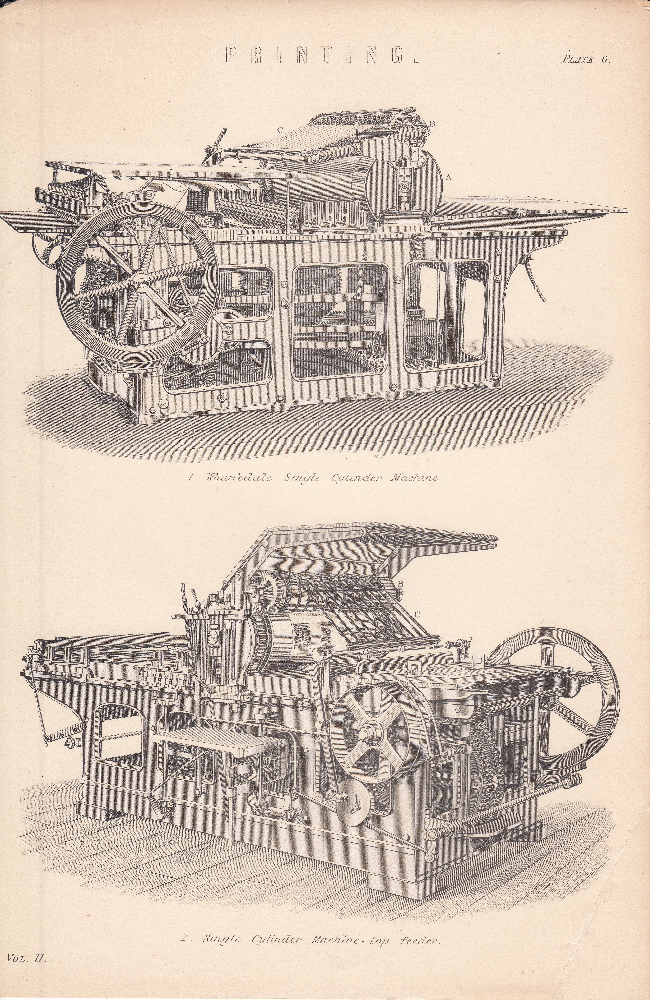
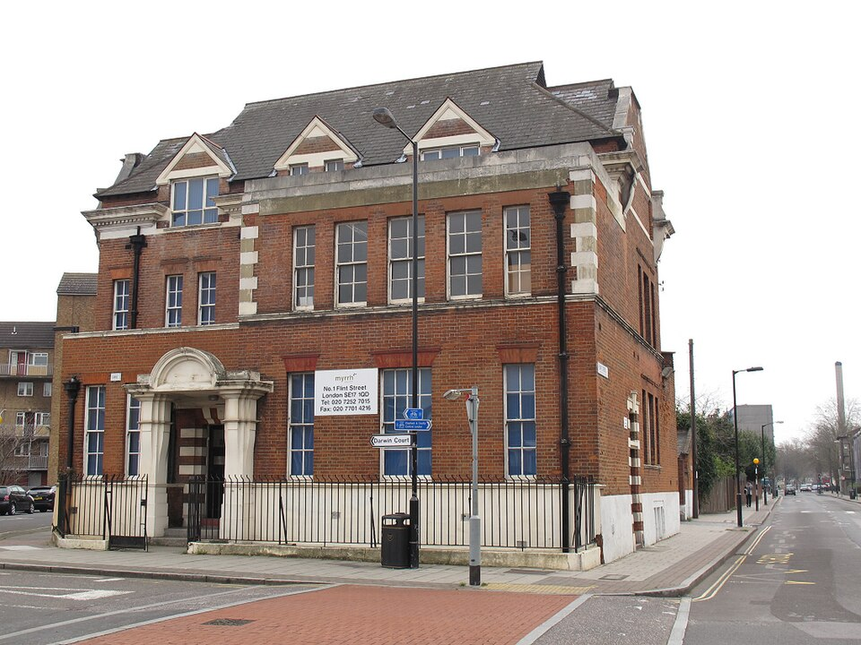
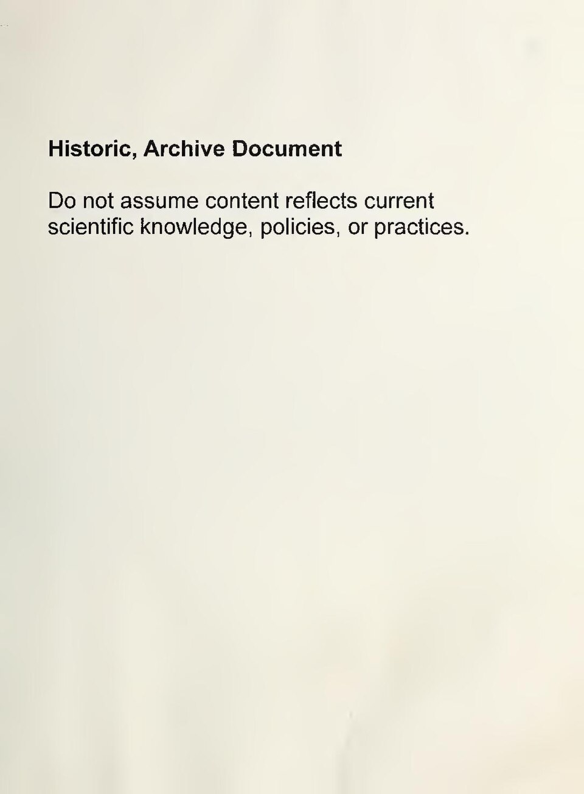
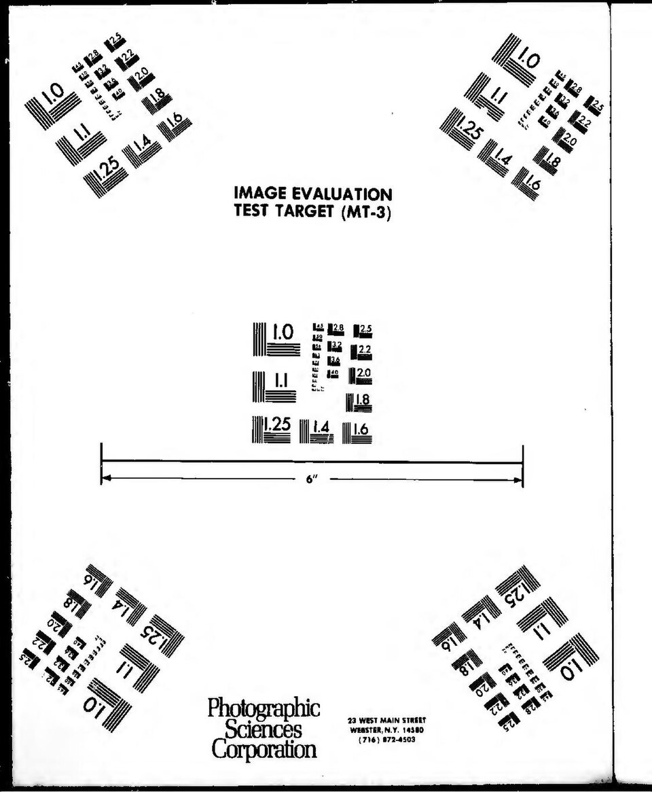
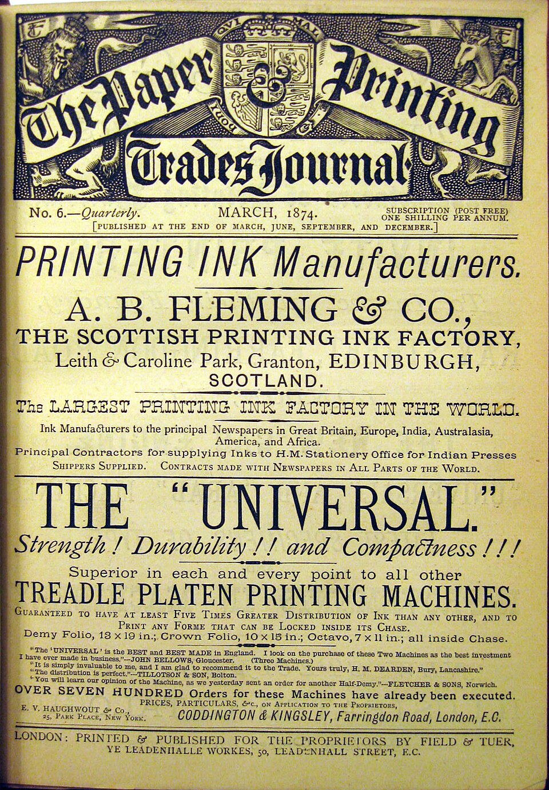
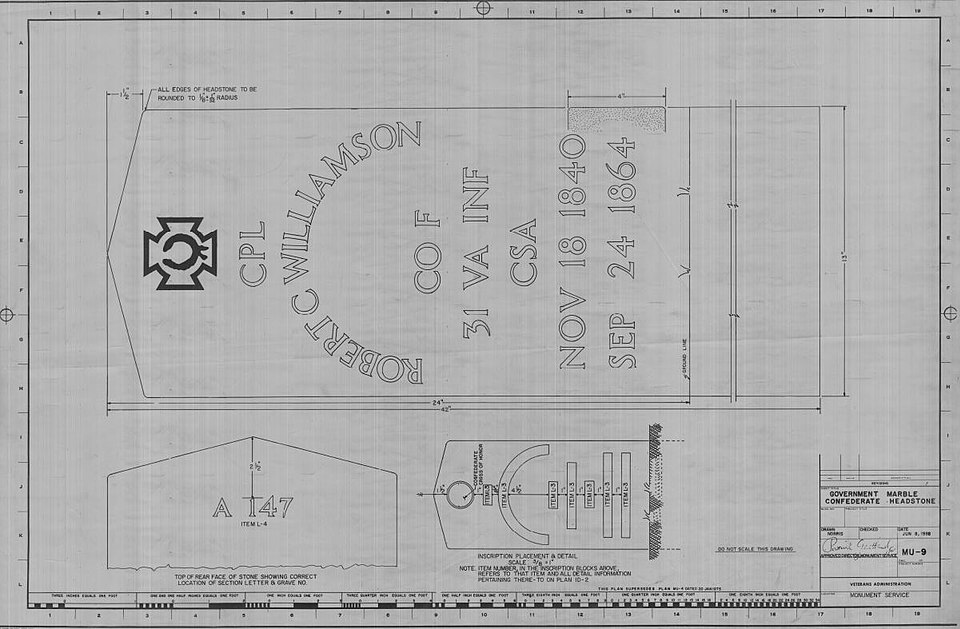
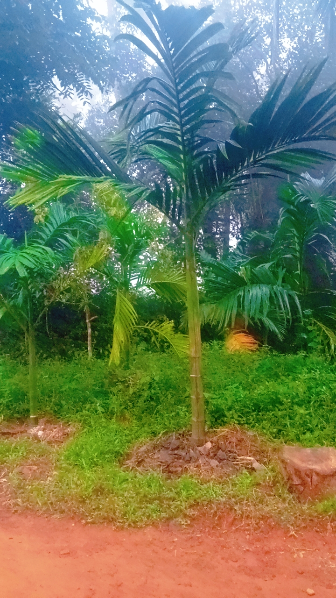

# Knowledge Preservation & Education

> *Image: National Encyclopaedia: A Dictionary of Universal Knowledge. Published by William Mackenzie, 1880., Public domain*

> *Printing Press Victorian Illustration from National Encyclopaedia, 1880*

> *Image: William Mackenzie, Public domain*

Capabilities in this domain:

> *Image: Ibaneali, CC0*

- [Education & Training](education.md) — Apprenticeships, trade schools, universities, and systematic knowledge transmission.

> *Image: African Library and Information Associations and Institutions, CC BY-SA 4.0*

- [Libraries & Information Systems](libraries.md) — Library construction, cataloging, preservation, and information retrieval systems.

> *Image: KnowledgeAGoogle, CC BY-SA 4.0*

- [Writing & Record-Keeping](writing.md) — Development of writing systems, ink production, and record-keeping materials.

> *Image: Peprovira, CC BY-SA 4.0*

- [Paper & Printing Press](printing.md) — Paper production and movable-type printing press for mass reproduction and distribution of technical knowledge.

> *Image: Tochiprecious, CC BY-SA 4.0*

- [Education Pathways](education-pathways.md) — Structured learning sequences: skill decomposition, progressive curricula, assessment stages, and certification frameworks for turning written knowledge into embodied skill.

> *Image: Veterans Administration, Public domain*

- [Technical Drawing](technical-drawing.md) — Engineering drawing conventions (projection methods, dimensioning, section views, tolerances) for unambiguous exchange of manufacturing specifications between workshops.

> *Image: Rhododendrites, CC BY-SA 4.0*

- [Standards Bodies](standards-bodies.md) — Organizational mechanisms for creating, maintaining, and enforcing common technical specifications — screw threads, material grades, electrical voltages, and measurement units.
<!-- TODO: source image for Information Durability -->
- [Information Durability](information-durability.md) — Systematic preservation of knowledge across generations: archival media selection, environmental controls, migration protocols, and format preservation strategies.

> *Image: Afseenakela, CC BY-SA 4.0*

- [Scientific Method](scientific-method.md) — Systematic process for generating reliable knowledge through hypothesis formulation, controlled experimentation, measurement, and reproducible verification.

[↑ Back to Tech Tree](../../index.md)
