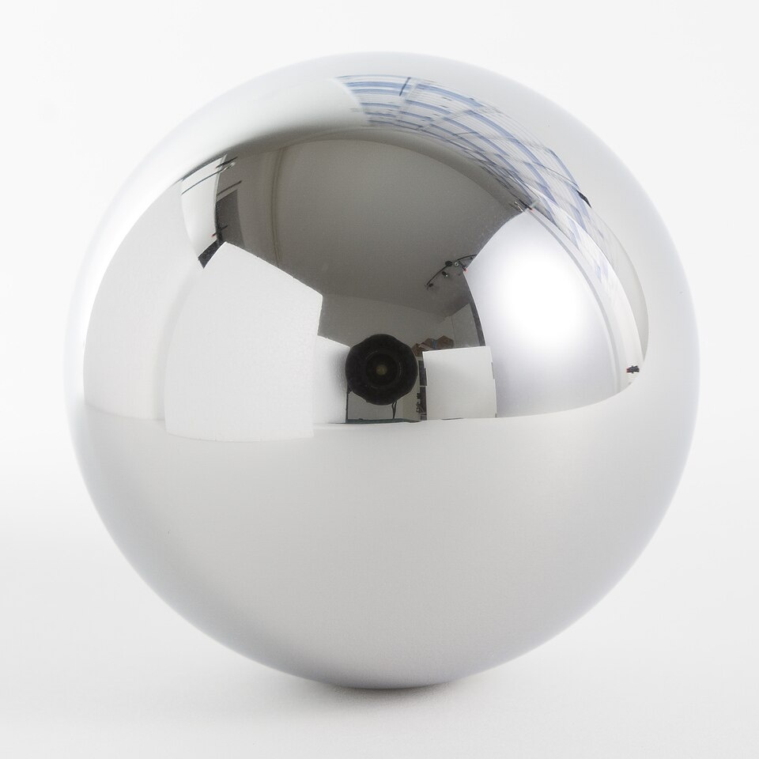

# Bearings, Abrasives & Cutting Tools

> **Node ID**: machine-tools.bearings-abrasives
> **Domain**: [Machine Tools Bootstrap](./index.md)
> **Dependencies**: [`machine-tools.iterative-bootstrap`](iterative-bootstrap.md)
> **Enables**: [`machine-tools.machining`](machining.md)
> **Timeline**: Years 10-25
> **Outputs**: bearings, ball_bearings, abrasives, cutting_tools, taps, dies, hss_tool_bits
> **Critical**: Yes — precision enablers for all machine tool construction

Bearings and abrasives are the two technologies that make precision machinery possible. Bearings reduce shaft friction from metal-on-metal seizure (coefficient 0.3-0.5) to manageable levels (0.001-0.03), while abrasives remove material in microscopic increments that cutting tools cannot reach. Together they bridge the gap between the ~0.1 mm tolerance of a leadscrew lathe and the ~0.005 mm tolerance of a surface grinder.

This article covers the bootstrap sequence for producing both capabilities from limited starting materials. For detailed bearing design and manufacture, see [Bearings](bearings.md). For abrasive materials and cutting tool production, see [Abrasives & Cutting Tools](abrasives.md). For the machining operations that use these tools, see [Machining](machining.md).

## The Precision Dependency

> *Bearing ball made of stainless steel 1.4034 in diameter 60mm, Grade 100 (DIN 5401).*

> *Image: Retired electrician, CC0*

Machine tool precision depends on a feedback loop between bearings and abrasives:

1. **Plain bearings** (babbitt-lined, 0.05-0.10 mm clearance) enable the crude lathe to turn shafts and bore holes at ~0.5 mm tolerance.
2. **Natural abrasives** (emery, sandstone) allow hand-lapping of mating surfaces to improve flatness from ~0.1 mm to ~0.02 mm.
3. **Improved bearings** (better clearance, scraped shells) built from lapped components achieve ~0.1 mm tolerance.
4. **Synthetic abrasives** (SiC, Al₂O₃ from electric arc furnace) enable grinding to ~0.01 mm tolerance.
5. **Precision bearings** (ball bearings with 0.005-0.015 mm clearance) made using ground components enable spindle runout below 0.005 mm.
6. **Precision grinding** on those spindles achieves ~0.005 mm tolerance, enabling gauge blocks.

Each level builds on the outputs of the previous level. Skipping levels is not possible because the bearing precision determines the grinding precision, and the grinding precision determines the next bearing precision.

## Bearing Types in Bootstrap Order

### Level 1: Wooden Bearings (Year 10)

Before metal bearings exist, hardwood bearings work for low-speed, light-load applications.

- **Material**: Oak or lignum vitae (self-lubricating due to natural resin content). Bore the hardwood block to shaft diameter + 1-2 mm clearance.
- **Lubrication**: Animal fat (tallow, lard) applied liberally. Reapply every 30-60 minutes of operation. Without lubrication, wooden bearings seize within minutes.
- **Performance**: Load capacity 0.5-1.0 MPa, speed 100-300 RPM, service life 100-500 hours. Adequate for a foot-treadle-powered wooden lathe.
- **Failure mode**: Glazing and burning of the wood bore surface. The bearing smells of scorched wood before seizure. Reduce load, add more fat, or replace the bearing block.

### Level 2: Babbitt-Lined Journal Bearings (Year 10-12)

The first precision bearing. Cast-in-place babbitt metal provides a soft, conformable lining inside a cast iron shell.

| Parameter | Value | Notes |
|-----------|-------|-------|
| Babbitt composition | 88% Sn / 8% Sb / 4% Cu | Tin-based; lead-based (80% Pb / 15% Sb / 5% Sn) is cheaper but lower performance |
| Pouring temperature | 400-450°C | Well above 240°C liquidus; below 500°C to avoid oxidation |
| Shell clearance | Shaft diameter + 4-6 mm | Space for babbitt lining |
| Radial running clearance | 0.001-0.002 × shaft diameter | 50 mm shaft → 0.05-0.10 mm; measure with feeler gauges |
| Allowable bearing pressure | 2-8 MPa | Babbitt on steel; depends on speed and lubrication |
| Coefficient of friction | 0.01-0.03 | Hydrodynamic regime (oil film supports the shaft) |
| Speed range | 0-1500 RPM | Above 1500 RPM, friction heat overwhelms cooling |
| Service life | 10,000-50,000 hours | With proper lubrication; minutes without oil |

For full construction procedure, see [Bearings](bearings.md).

### Level 3: Bronze Bushings (Year 12-15)

Turned from cast bronze (Cu 85-90% / Sn 10-15%), bronze bushings are more durable than babbitt and can be bored to closer tolerance on a lathe.

| Parameter | Value |
|-----------|-------|
| Material | Phosphor bronze (Cu 89% / Sn 10% / P 1%) |
| Clearance | 0.001-0.0015 × shaft diameter (tighter than babbitt because bronze is harder) |
| Bearing pressure | 5-15 MPa |
| Speed range | 0-3000 RPM with oil lubrication |
| Service life | 20,000-100,000 hours |

Bronze bushings are the standard bearing for lathe spindles, milling machine arbor supports, and drill press spindles once the lathe can bore them accurately. They require oil lubrication (oil ring, wick, or drip feed).

### Level 4: Ball Bearings (Year 15-25)

Rolling element bearings reduce friction by another order of magnitude and enable high-speed spindles. Manufacturing them requires precision grinding (0.05 μm Ra raceway finish), which requires synthetic abrasives.

| Parameter | Value (6205 type) |
|-----------|-------------------|
| Bore | 25.000-25.004 mm (H5) |
| OD | 52.000-52.002 mm |
| Ball diameter | 7.94 mm, 1-5 μm sphericity |
| Radial clearance | 0.005-0.015 mm (C2) or 0.015-0.030 mm (CN) |
| Raceway finish | 0.05 μm Ra |
| Friction coefficient | 0.001-0.002 |
| Load rating | 14.0 kN (static) |
| Speed rating | 12,000 RPM (grease), 15,000 RPM (oil) |
| Steel | 52100 (1% C, 1.5% Cr), hardened 58-62 HRC |

For full construction procedure, see [Bearings](bearings.md).

## Abrasive Materials in Bootstrap Order

### Level 1: Natural Abrasives (Year 10)

Available without any industrial infrastructure:

| Abrasive | Source | Hardness (Mohs) | Use |
|----------|--------|-----------------|-----|
| Sandstone | Quarried sandstone blocks | 6-7 | Flat lapping of surface plates and machine ways |
| Emery | Natural emery rock (Corundum + magnetite) | 7-8 | Grinding and polishing; emery cloth for hand finishing |
| Pumice | Volcanic rock | 6 | Fine polishing of non-ferrous metals |
| Tripoli | Silica powder | 7 | Final polishing of brass and copper |
| Crocus | Iron oxide (Fe₂O₃) powder | 5-6 | Final polish on steel; produces red mirror finish |

**Sandstone lap construction**: Dress a sandstone block flat by rubbing two blocks together with water. Progress through finer grades by selecting harder, finer-grained stone. A 300 × 300 mm sandstone lap can hand-lap cast iron surfaces to 0.02 mm flatness over a full day of work.

**Emery grading**: Crush natural emery rock with a steel mortar and pestle. Sieve into grades: coarse (60-100 mesh, 150-250 μm), medium (100-180 mesh, 80-150 μm), fine (180-320 mesh, 45-80 μm). Mix with tallow or oil to form a lapping paste. Finer grades produce smoother finishes but remove material more slowly.

### Level 2: Synthetic Abrasives (Year 12-20)

Manufactured in an electric arc furnace at 2000-2500°C, synthetic abrasives are harder and more consistent than natural ones.

| Abrasive | Composition | Hardness (Mohs) | Grit Size Range | Primary Use |
|----------|-------------|-----------------|-----------------|-------------|
| Silicon carbide (SiC) | SiC | 9.5 | 16-1200 mesh | Cast iron, non-ferrous metals, stone |
| Aluminum oxide (Al₂O₃) | Al₂O₃ | 9.0 | 16-1200 mesh | Steel, high-speed steel tool grinding |
| Cubic boron nitride (CBN) | BN | 9.5+ | 80-400 mesh | Hardened steel (tool room grinding) |
| Diamond | C | 10 | 80-600 mesh | Carbide tool grinding, wire drawing dies |

**Grinding wheel specification (standard marking system)**:

Example: A-60-L-5-V-23
- **A** = Aluminum oxide (SiC = C, CBN = B, Diamond = D)
- **60** = Grit size (coarser = lower numbers: 24 = very coarse, 120 = fine, 600 = very fine)
- **L** = Grade (A = very soft, Z = very hard; L-M is medium for general purpose)
- **5** = Structure (1 = very dense, 15 = very open; 5-8 is standard)
- **V** = Bond type (V = vitrified/ceramic, B = resinoid, R = rubber, M = metal)
- **23** = Manufacturer's mark

**Surface finish vs. grit size** (steel, grinding):

| Grit Size | Ra (μm) | Application |
|-----------|---------|-------------|
| 24-36 | 3.2-6.3 | Roughing, stock removal |
| 46-60 | 1.6-3.2 | General surface grinding |
| 80-120 | 0.4-1.6 | Finishing passes |
| 180-320 | 0.1-0.4 | Fine finishing, gauge block grinding |
| 400-600 | 0.025-0.1 | Lapping preparation |

**Cutting speed for grinding**: 1500-2100 m/min peripheral wheel speed. For a 200 mm diameter wheel, this translates to 2400-3300 RPM. Never exceed the rated RPM marked on the wheel. Overspeed causes wheel explosion.

## Cutting Tool Materials in Bootstrap Order

### Carbon Steel (Year 10)

Plain high-carbon steel (0.9-1.2% C), hardened to 62-65 HRC by quenching in water from 780-820°C.

| Parameter | Value |
|-----------|-------|
| Hardness | 62-65 HRC after quenching |
| Cutting speed | 5-10 m/min for steel, 15-25 m/min for cast iron |
| Temperature limit | ~200°C (loses hardness above this) |
| Application | Light finishing cuts, scraping tools, hand tools |

Carbon steel tools dull quickly at higher cutting speeds because the cutting edge heats above 200°C and the steel temper softens. They are adequate for the crude lathe running at low RPM but become a bottleneck as spindle speeds increase.

### High-Speed Steel (Year 12-15)

Alloy steel containing tungsten (18% in classic T1 grade), chromium (4%), vanadium (1%), and carbon (0.7%). Hardened to 63-66 HRC by heating to 1250-1300°C, oil quenching, and triple tempering at 540-560°C.

| Parameter | Value |
|-----------|-------|
| Hardness | 63-66 HRC |
| Cutting speed | 20-50 m/min for steel, 40-80 m/min for cast iron |
| Red hardness | Maintains cutting hardness up to 600°C |
| Application | General purpose turning, drilling, milling |

HSS retains hardness at the high temperatures generated by faster cutting speeds. This is why it is called "high-speed" — it allows cutting speeds 3-5× faster than carbon steel. The tungsten forms hard tungsten carbide particles in the steel matrix that resist softening at elevated temperature.

### Tungsten Carbide Inserts (Year 20-30)

Sintered WC-Co (tungsten carbide particles in a cobalt binder). Produced by powder metallurgy: press WC + Co powder into inserts, sinter at 1350-1450°C.

| Parameter | Value |
|-----------|-------|
| Hardness | 89-93 HRA (equivalent to 1500-2000 HV) |
| Cutting speed | 80-250 m/min for steel, 150-400 m/min for aluminum |
| Temperature limit | ~1000°C |
| Application | Production turning and milling at high speed |

Carbide inserts enable the high material removal rates needed for production machining, but they are brittle and require rigid machine setups. Chipping occurs from vibration or interrupted cuts.

## Recommended Spindle Speeds by Material and Tool

The fundamental cutting speed formula: **RPM = (1000 × V) / (π × D)**

Where V = cutting speed in m/min, D = workpiece diameter in mm.

| Material | HSS Speed (m/min) | Carbide Speed (m/min) | Notes |
|----------|--------------------|-----------------------|-------|
| Low carbon steel | 20-35 | 80-180 | Most common; use cutting oil |
| Medium carbon steel | 15-25 | 60-150 | Tougher than low carbon |
| Cast iron | 15-30 | 80-200 | Dry cut (no oil — dust chips) |
| Stainless steel (304) | 10-20 | 50-120 | Work hardens — keep cutting, don't dwell |
| Aluminum | 100-300 | 300-1000 | Very fast; use kerosene or paraffin as cutting fluid |
| Copper/brass | 50-100 | 200-500 | Use zero rake angle to prevent grabbing |
| Bronze | 40-80 | 150-400 | Similar to copper but less grabby |

**Example**: Turning 50 mm diameter mild steel with HSS tool at 25 m/min: RPM = (1000 × 25) / (π × 50) = 159 RPM.

**Feed rate**: 0.1-0.3 mm/rev for roughing, 0.05-0.15 mm/rev for finishing. Depth of cut: 1-3 mm for roughing, 0.1-0.5 mm for finishing.

## Troubleshooting

| Problem | Probable Cause | Solution |
|---------|---------------|----------|
| Babbitt bearing overheating (>100°C) | Clearance too tight or oil starvation | Set clearance to 0.001-0.002 × shaft diameter; verify oil ring delivers oil; check grooves are not clogged |
| Ball bearing rough and noisy | Contamination (1-5 μm particles scoring raceways) or end of fatigue life | Clean in solvent, inspect at 10× magnification, replace if raceway scored; reassemble in clean environment |
| Grinding wheel loading (metal smeared on wheel face) | Wheel grade too hard or grit too fine for the material | Switch to softer grade or coarser grit; dress the wheel to open the face |
| Grinding wheel glazing (shiny, cutting poorly) | Wheel too hard, not breaking down to expose fresh grit | Dress with a sharp diamond dresser; switch to softer wheel grade |
| Cutting tool chipping (HSS or carbide) | Excessive feed rate or interrupted cuts without chamfer | Reduce feed rate; grind a chamfer on the leading edge; for carbide, use tougher grade (higher Co content) |
| Poor surface finish (tool marks, tearing) | Tool dull, wrong rake angle, or insufficient cutting fluid | Sharpen tool; increase positive rake for softer materials; flood with cutting oil |
| Workpiece heating and expanding during grinding | Insufficient coolant flow or too-heavy grinding pass | Increase coolant flow to 10-20 L/min; reduce depth of cut to 0.005-0.01 mm per pass; allow cooling between passes |
| Wheel explosion or crack | Wheel damaged, overspeed, or improper mounting | Ring test new wheels (tap with non-metallic hammer — clear ring = sound, dull thud = cracked); never exceed rated RPM; use flanges and blotters |
| Babbitt pouring defects (voids, porosity) | Shell not preheated, or poured too slowly | Preheat shell to 150-200°C; pour in one continuous stream; vent trapped air through small holes in the shell |
| Bearing seizure after short service | Lubrication failure or incorrect clearance | Verify oil delivery system (ring, wick, or drip); check clearance is 0.001-0.002 × shaft diameter; check for shaft misalignment |

## Safety Considerations

Bearings and abrasives present hazards from rotating machinery, hot metal, grinding dust, and wheel explosion. These hazards are present in every machine shop and must be controlled systematically.

### Rotating Machinery

- **Entanglement**: Lathe chucks, grinding spindles, and drill presses grab loose clothing, gloves, hair, and jewelry. The rotating workpiece pulls the operator into the machine with force proportional to RPM. Never wear gloves or loose sleeves near rotating machinery. Tie back long hair. Remove rings and bracelets.
- **Shaft whipping**: An unbalanced shaft rotating at speed can whip violently, striking anyone nearby. Check shaft runout with a dial indicator before increasing speed. Maximum runout for plain bearings: 0.05 mm. For ball bearings: 0.01 mm.

### Grinding Wheel Hazards

- **Wheel explosion**: A grinding wheel is a brittle ceramic spinning at 1500-2100 m/min peripheral speed. If cracked, improperly mounted, or oversped, it explodes with fragments traveling at the peripheral speed (35 m/s for a 200 mm wheel at 3300 RPM). Always ring-test new wheels. Use wheel guards that cover 180° of the wheel periphery. Never exceed the rated RPM marked on the wheel blotter.
- **Abrasive dust inhalation**: Grinding generates fine dust (1-10 μm particle size) containing metal particles and abrasive fragments. Silica dust from sandstone lapping causes silicosis with prolonged exposure. Aluminum oxide and silicon carbide dust are less hazardous but still irritate the respiratory tract. Use local exhaust ventilation at the grinding point. Wear a dust mask (N95 minimum) when hand-lapping.
- **Eye injury from grinding debris**: Grinding sparks and abrasive fragments eject from the wheel at high velocity. These penetrate the cornea and cause permanent vision damage. Safety glasses with side shields are mandatory around all grinding operations.

### Hot Metal (Babbitt Pouring)

- **Molten metal splash**: Babbitt poured at 400-450°C splatters if it contacts moisture or oil on the shell surface. Preheat and clean the shell thoroughly. Even a drop of condensation causes a steam explosion that throws molten metal 1-2 meters.
- **Burns from hot castings**: Freshly poured babbitt shells and heat-treated tool bits remain hot enough to cause deep burns for 30-60 minutes after removal from the furnace. Use tongs for all handling. Mark hot parts clearly.

### Cutting Tool Handling

- **Sharp tool bits**: HSS and carbide tool bits have sharp cutting edges that cut skin cleanly. Store in racks or wrapped in cloth, not loose in drawers. Handle with gloves when setting up, but remove gloves before operating the lathe.
- **Chip disposal**: Steel chips from turning and grinding are sharp and may be hot. Sweep chips into a metal container with a brush, never by hand. Chips from stainless steel can remain hot enough to burn for several minutes after cutting.

### Personal Protective Equipment

- Safety glasses with side shields at all times in the machine shop
- Face shield for grinding operations and babbitt pouring
- No gloves, loose clothing, or jewelry near rotating machinery
- Leather apron for babbitt pouring and hot metal handling
- N95 dust mask for hand-lapping and dry grinding operations
- Heat-resistant gloves for handling hot castings (removed before operating machinery)

## Bootstrap Sequence: From Wooden Bearings to Ball Bearings

| Stage | Bearing | Abrasive | Tolerance Achievable | Key Milestone |
|-------|---------|----------|---------------------|---------------|
| Year 10 | Wood + tallow | Sandstone, emery | ~0.5 mm | Crude lathe runs |
| Year 11 | Babbitt-lined journal | Emery paste, fine grades | ~0.1 mm | Lathe with leadscrew cuts threads |
| Year 13 | Bronze bushings | Natural abrasives, hand-lapped | ~0.05 mm | Shaper produces flat surfaces |
| Year 15 | Improved babbitt | SiC and Al₂O₃ wheels (early synthetic) | ~0.01 mm | Surface grinder operational |
| Year 20 | Ball bearings (52100 steel) | Synthetic abrasives, precision grinding | ~0.005 mm | Precision spindles for production machines |
| Year 25 | ABEC-5 ball bearings | Precision grinding + lapping | ~0.001 mm | Gauge blocks, precision metrology |

This progression is the backbone of the [Iterative Bootstrap](./iterative-bootstrap.md) sequence. Each stage requires the outputs of the previous stage, and the compounding precision improvements enable every downstream technology from steam engines to semiconductor equipment.

## See Also

- [Bearings](bearings.md) — detailed bearing design, construction, and selection
- [Abrasives & Cutting Tools](abrasives.md) — abrasive materials, grinding wheels, and cutting tool production
- [Machining](./machining.md) — lathe, mill, and grinding operations
- [Iterative Bootstrap](./iterative-bootstrap.md) — building precision machines from these components
- [Machine Tools Overview](./index.md) — complete machine tools reference

*Part of the [Bootciv Tech Tree](../../index.md) · [Machine Tools Bootstrap](./index.md) · [All Domains](../../index.md)*
