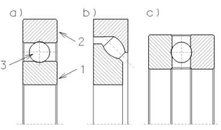

# Bearings

> **Node ID**: machine-tools.bearings
> **Domain**: [Machine Tools Bootstrap](./index.md)
> **Dependencies**: [`machine-tools.iterative-bootstrap`](iterative-bootstrap.md)
> **Enables**: [`machine-tools.machining`](machining.md)
> **Timeline**: Years 10-25
> **Outputs**: bearings, ball_bearings, plain_bearings, babbitt_linings
> **Critical**: Yes — precision enablers for all machine tool construction

Bearings are the precision enablers of machine tool construction. Without bearings, shafts seize and machines destroy themselves from friction. This article covers plain (journal) bearings, rolling element (ball and roller) bearings, bearing selection, and bearing lubricants. For abrasive materials and cutting tools, see [Abrasives & Cutting Tools](abrasives.md).

For the machine tool construction sequence, see [Iterative Bootstrap](./iterative-bootstrap.md). For the machining operations that use these tools, see [Machining](./machining.md).

## Plain (Journal) Bearings

> *Łożyska toczne: a) kulkowe zwykłe; b) baryłkowe wzdłużne; c) wzdłużne jednokierunkowe*

> *Image: Jonasz at Polish Wikipedia, CC BY-SA 3.0*

The simplest and most robust bearing type. A cylindrical shaft rotates inside a slightly larger cylindrical housing, separated by a thin film of lubricant.

**Construction steps for a babbitt-lined journal bearing**:
1. Machine the bearing shell from cast iron or steel. Shell bore: shaft diameter + 4-6 mm (to allow for babbitt lining thickness). Shell length: 1.0-1.5 × shaft diameter. Finish the bore surface rough (~1-2 mm Ra) to provide mechanical keying for the babbitt.
2. Prepare the mandrel: turn a steel rod to shaft diameter + radial clearance (0.001-0.002 × shaft diameter; for a 50 mm shaft, mandrel = 50.05-50.10 mm). Coat the mandrel with soot or graphite to prevent babbitt adhesion.
3. Assemble the shell around the mandrel. Seal both ends with clay or putty to contain the molten babbitt. Leave a pouring hole at the top (10-15 mm diameter).
4. Melt babbitt metal (Sn-Sb-Cu alloy, 88/8/4 typical composition) in a crucible to 400-450°C (well above the 240°C liquidus, but below 500°C to avoid oxidation). Skim dross from the surface.
5. Preheat the assembled shell and mandrel to 150-200°C to prevent premature solidification. Pour babbitt through the pouring hole in a steady, continuous stream until it fills the cavity and overflows slightly.
6. Allow to cool to room temperature (30-60 minutes). Disassemble. The babbitt shell now has a precise bore matching the mandrel diameter. Machine oil grooves (2-3 mm wide × 1.5 mm deep) in the babbitt surface in an axial or figure-8 pattern.

**Calibration**: Insert the shaft into the bearing. Measure radial clearance with feeler gauges: target 0.001-0.002 × shaft diameter (50 mm shaft → 0.05-0.10 mm). Spin the shaft by hand — it should rotate freely with no binding but minimal perceptible play. Check axial end float: 0.1-0.3 mm.

**Expected performance**: Allowable bearing pressure: 2-8 MPa for babbitt on steel. Coefficient of friction: 0.01-0.03 (hydrodynamic regime). Speed range: 0-1500 RPM depending on load and lubrication. Operating temperature: up to 100°C with adequate lubrication. Service life: 10,000-50,000 hours with proper lubrication.

**Materials specifications**: Babbitt metal (88% Sn / 8% Sb / 4% Cu), cast iron shell (minimum wall thickness 5 mm), steel mandrel (turned to shaft diameter + clearance, ±0.02 mm), lubricating oil (SAE 30 or equivalent mineral oil).

**Lubrication**: Oil ring (a ring rides on the shaft, dips into oil reservoir below, carries oil up to the bearing surface) or gravity-fed oil cup. Grease-packed for slow-speed bearings.

**Strengths**:
- Simple to manufacture — requires only basic casting and machining capability
- Tolerant of misalignment (the soft babbitt conforms to shaft position over time)
- Embeds contaminants — dirt particles press into the soft babbitt rather than scoring the shaft

**Weaknesses**:
- Higher friction than rolling bearings (~0.01-0.03 coefficient of friction vs. ~0.001 for ball bearings)
- Requires continuous lubrication — oil starvation causes rapid failure (minutes to hours)
- Limited speed capability — above 1500 RPM, friction heat overwhelms cooling capacity

## Rolling Element Bearings (Precision)

Ball and roller bearings reduce friction and enable high-speed machinery (machine tool spindles, engines, generators).

**Construction steps for a ball bearing (6205 type)**:
1. **Inner ring**: Forge bearing steel (52100 grade, 1% C, 1.5% Cr) to ring blank. Turn on lathe to final dimensions: 25.00 mm bore (H5 tolerance, +0.004/0 mm), 31.5 mm OD, 15 mm width. Grind the raceway (the curved track the balls ride on) to a groove radius of 3.97 mm (ball radius + 2-3% for conformity), with 0.05 μm Ra surface finish.
2. **Outer ring**: Forge and turn to 52.00 mm OD (±0.002 mm), 46.5 mm bore with raceway groove, 15 mm width. Grind raceway to same profile and finish as inner ring.
3. **Balls**: Cut 7.94 mm diameter wire into slugs. Cold head into rough spheres in a header. Grind between grooved cast iron plates (the plates have concentric grooves matching the ball radius, and the balls roll between them under load for 2-4 hours). Lap to 1-5 μm sphericity variation using 600-1200 grit abrasive paste. Harden at 820-860°C, oil quench, temper at 150-200°C to 58-62 HRC.
4. **Cage**: Stamp from 0.5 mm brass sheet (or 0.5 mm mild steel sheet). Two halves, each with ball pockets (7 pockets for a 6205 bearing). Rivet halves together through the pillar posts.
5. **Assembly**: Place balls between inner and outer raceways. Compress the cage halves around the balls. Rivet cage halves together. Pack with lithium grease. Install seals or shields (pressed steel, crimped into the outer ring groove).

**Calibration**: Measure bore with a bore gauge: 25.000-25.004 mm (H5 tolerance). Measure OD with a micrometer: 52.000-52.002 mm. Check radial internal clearance with a dial indicator: 0.005-0.015 mm for C2 (tight) clearance, 0.015-0.030 mm for CN (normal) clearance. Spin the bearing by hand — should rotate smoothly with no detectable roughness or clicking.

**Expected performance**: Radial load rating: 14.0 kN (basic static, 6205). Speed rating: 12,000 RPM (grease lubricated) or 15,000 RPM (oil lubricated). Friction coefficient: 0.001-0.002. Service life (L10): 20,000-50,000 hours at rated load and speed. Operating temperature range: -30°C to +120°C with lithium grease.

**Materials specifications**: Bearing steel 52100 (1.0% C, 1.5% Cr, balance Fe) for rings and balls, brass sheet (0.5 mm) or steel sheet (0.5 mm) for cage, lithium grease (NLGI grade 2), NBR rubber or pressed steel for seals.

**Tolerance classes**: ABEC-1 (standard) to ABEC-9 (ultra-precision). Higher classes = tighter tolerances on bore, OD, and runout. Machine tool spindles need ABEC-5 or better.

**Strengths**:
- Very low friction (0.001-0.002 coefficient) — 10× lower than plain bearings
- Precise shaft location — radial clearance of 0.005-0.030 mm
- Pre-sealed, pre-greased units require minimal maintenance

**Weaknesses**:
- Complex manufacturing requiring precision grinding (0.05 μm Ra raceway finish) — beyond bootstrap capability initially
- Sensitive to contamination — even 1-5 μm particles cause raceway damage and premature failure
- Finite fatigue life (L10) — even properly loaded bearings eventually develop subsurface spalling

## Bearing Selection Guide

| Application | Type | Speed | Load | Lubrication |
|-------------|------|-------|------|-------------|
| Line shaft | Plain (babbitt) | Low-medium | Moderate | Oil ring |
| Lathe spindle | Ball bearing (ABEC-5+) | Medium-high | Light-moderate | Grease or oil mist |
| Flywheel | Plain (babbitt) | Low | Heavy | Oil cup |
| Milling spindle | Ball bearing (ABEC-7+) | High | Moderate | Grease |
| Engine crankshaft | Plain (babbitt/insert) | Medium | Heavy | Pressure oil |
| High-speed grinder | Ball bearing or air bearing | Very high | Light | Oil mist |

## Bearing Lubricants

- **Mineral oil**: Refined petroleum oil. Standard lubricant for most bearings. Viscosity grade selected by speed and load (thicker oil for slower speeds and heavier loads).
- **Animal fat (tallow, lard)**: Pre-petroleum lubricant. Works well for plain bearings and slow-speed applications. Lard oil as cutting fluid for turning and threading — reduces friction, improves finish.
- **Vegetable oil** (linseed, castor): Cutting fluid for brass and aluminum. Castor oil has excellent film strength for high-speed bearings. Not ideal for steel machining (polymerizes and gums).
- **Grease**: Oil thickened with soap (calcium, lithium, or sodium soap). Stays in place, does not drain away. Used for sealed bearings and slow-speed applications. Lithium grease is the general-purpose standard.

**Strengths**:
- Multiple options available at different technology levels (animal fat at the earliest, mineral oil and synthetic grease later)
- Lubrication dramatically extends bearing life — 10-50× compared to dry running

**Weaknesses**:
- Lubricant contamination (dirt, water, metal particles) degrades performance and accelerates wear
- Some lubricants (vegetable oil, animal fat) have limited shelf life — they oxidize and become acidic

## Precision Metrology for Bearing Production

- **Micrometer**: Measures external dimensions to 0.01 mm resolution. Essential for checking shaft diameters against bearing bore specifications.
- **Bore gauge / inside micrometer**: Measures internal diameters to 0.01 mm. For checking bearing housing bores.
- **Dial indicator**: Measures runout (eccentricity) to 0.01 mm. For checking shaft straightness and bearing alignment.
- **Surface plate**: Flat granite or cast iron reference surface (flat to 0.002 mm). The foundation of all dimensional measurement.

## Limitations

- **Bearing speed limits**: Ball and roller bearings have maximum speed ratings (dN value = bore diameter × speed). Exceeding limits causes lubricant breakdown, cage failure, and seizure. High-speed applications require special designs (angular contact, hybrid ceramic).
- **Bearing fatigue life**: Rolling element bearings fail by subsurface fatigue (spalling) after a statistical number of stress cycles. Rated life (L10) is the cycles at which 10% of bearings fail. Design life typically 20,000-100,000 hours.
- **Contamination sensitivity**: Bearing performance degrades rapidly with particulate contamination. Even 1-5 μm particles cause surface damage. Clean assembly environments and effective sealing are essential.

## Safety Considerations

Bearing manufacture and installation involve hot metal (babbitt pouring at 400-450°C), heavy rotating machinery, and precision grinding. Each hazard requires specific controls.

- **Babbitt pouring burns**: Molten babbitt at 400-450°C splatters on contact with moisture or oil on the shell surface. A single drop of condensation on the shell causes a steam explosion that throws molten metal 1-2 meters. Preheat and clean shells thoroughly before pouring. Use leather apron, face shield, and heat-resistant gloves. Keep a dry work area.
- **Grinding wheel explosion during raceway grinding**: Precision grinding wheels spin at 1500-2100 m/min peripheral speed. A cracked wheel explodes with fragments traveling at the peripheral speed (a 200 mm wheel at 3000 RPM = 31 m/s). Ring test every new wheel (suspend and tap with non-metallic hammer: clear ring = sound, dull thud = cracked). Never exceed rated RPM. Use wheel guards covering 180° of periphery.
- **Rotating machinery entanglement**: Bearing testing on lathes and spin testers creates entanglement hazards. Shafts spinning at 1000-3000 RPM grab loose clothing, hair, and jewelry. Never wear gloves or loose sleeves near rotating shafts. Tie back long hair. Remove rings.
- **Crush injuries during press fitting**: Ball bearings pressed into housings require 5-50 kN force depending on interference fit. Fingers caught between the bearing and housing during press-in are crushed. Use press tools that keep hands clear of the pressing zone. Two-hand controls on hydraulic presses.
- **Heavy castings**: Machine beds and bearing housings weigh 10-100 kg. A dropped cast iron housing on a foot causes fractures. Use hoists for anything over 25 kg. Lift with legs, not back. Team lifts for items over 50 kg.
- **Bearing steel dust**: Grinding bearing steel (52100) produces fine metallic dust. Inhalation irritates the respiratory tract. Use local exhaust ventilation at the grinding point. Wear a dust mask during extended grinding sessions.

### Personal Protective Equipment

- Safety glasses with side shields at all times in the machine shop
- Face shield for babbitt pouring and grinding operations
- Heat-resistant gloves for handling hot castings and babbitt (removed before operating machinery)
- Leather apron for babbitt pouring
- No gloves, loose clothing, or jewelry near rotating shafts or spindles
- Steel-toe boots for handling heavy castings and machine components

### Emergency Procedures

- Keep burn kit with cold water bucket at the babbitt pouring station
- Post emergency stop locations on all rotating machinery (spin testers, lathes)
- Maintain fire extinguisher near the grinding area (class ABC)
- Train all personnel on entanglement response: hit e-stop, do not grab rotating workpiece
- Establish clear exclusion zone around grinding wheels during operation

## Troubleshooting

| Problem | Probable Cause | Solution |
|---------|---------------|----------|
| Babbitt bearing overheating and seizing (operating temp >100°C) | Radial clearance too tight (<0.001× shaft diameter) or oil starvation — babbitt fails within minutes without lubrication | Set radial clearance to 0.001-0.002× shaft diameter (50 mm shaft → 0.05-0.10 mm measured with feeler gauges); verify oil ring dips into reservoir and carries oil to shaft surface; check that oil grooves (2-3 mm wide × 1.5 mm deep) are unobstructed |
| Ball bearing rough rotation (clicking or gritty feel, radial clearance >0.030 mm) | Contamination with 1-5 μm particles scoring raceways, or bearing exceeded L10 fatigue life (20,000-50,000 hours) | Disassemble, clean in solvent, and inspect raceways under 10× magnification for scoring/spalling; replace if raceway damage visible; reassemble in clean environment with fresh lithium grease (NLGI grade 2); ensure seals/shields are intact |
| Babbitt lining cracked or separating from shell | Shell bore too smooth (<0.5 mm Ra) for mechanical keying, or babbitt poured onto oily/damp surface | Roughen shell bore to 1-2 mm Ra with coarse file; clean shell with solvent, preheat to 150-200°C; pour babbitt in one continuous stream; never pour onto a cold or damp shell |
| Ball bearing inner ring spinning on shaft | Shaft diameter undersized for the bearing bore (insufficient interference fit) | Machine shaft to correct tolerance: for a 25 mm bore bearing, shaft should be 25.000-25.008 mm (k5 tolerance); if shaft is worn, build up with chrome plating or replace shaft |
| Excessive vibration at high speed | Bearing radial clearance too large for the application, or unbalanced rotating assembly | Use tighter clearance bearing (C2: 0.005-0.015 mm instead of CN: 0.015-0.030 mm); check shaft runout with dial indicator (must be <0.01 mm for high-speed spindles); balance rotating assembly |
| Oil leakage from plain bearing housing | Oil groove connected to edge of shell, or oil reservoir overfilled | Ensure oil grooves are blind (do not break through the shell edge); fill reservoir to level just below the oil ring; check that drain holes are not blocked |
| Ball bearing noise increases over time | Raceway spalling from fatigue, or lubrication failure | Measure vibration signature; if high-frequency components increasing, bearing is approaching end of fatigue life; plan replacement before failure; check grease condition (dry, discolored, or contaminated grease means relubrication needed) |
| Bearing housing bore worn oversize | Fretting corrosion between bearing outer ring and housing from micro-motion | Measure housing bore with inside micrometer; if worn beyond tolerance (52.000-52.002 mm for 6205), bore oversize and install a sleeve, or replace housing; apply Loctite bearing retainer to prevent recurrence |
| Bronze bushing seizing after brief operation | Insufficient initial lubrication, or debris in the oil hole | Prime the oiling system before first start; flush oil passages with clean oil; verify oil reaches the bearing surface within 30 seconds of start-up; never run a dry bronze bearing under load |

## Scaling Notes

Bearing production scales dramatically with precision capability:

- **Workshop scale** (1-10 bearings/day): Hand-scraped babbitt plain bearings poured in place on the shaft. Oil grooves cut with a narrow chisel. Tolerance: ±0.05 mm on clearance. Adequate for low-speed machinery (under 500 RPM). One skilled machinist with a lathe, foundry crucible, and scraping tools.

- **Factory scale** (100-1,000 bearings/day): Machine-bored babbitt shells with concentric oil grooves. Turned bronze bushings. Purchased ball bearings (if available from a supplier). Tolerance: ±0.01 mm on bore and clearance. This scale supports general industrial machinery — line shafts, pumps, blowers, and machine tools up to medium precision.

- **Precision scale** (10,000+ bearings/day): Ground and super-finished ball bearings with sub-micron raceway roundness. ABEC 7-9 precision grades for spindle bearings. Requires precision grinding machines, clean assembly rooms, and steel with controlled inclusion content (bearing steel 52100, vacuum-degassed). This scale enables high-speed spindles (10,000+ RPM) and precision machine tools.

**Critical bottleneck**: Steel purity for rolling-element bearings. Bearing steel (SAE 52100, 1% C, 1.5% Cr) must have oxide inclusion content below 0.001% by volume. Inclusions act as stress concentrators that initiate fatigue spalling. Vacuum degassing or electroslag remelting is required to achieve this purity level. Without it, bearing fatigue life drops by 5-10×.

## Quality Control

| Check | Method | Acceptance Criteria |
|-------|--------|-------------------|
| Radial clearance (ball bearing) | Dial indicator on outer ring, inner ring fixed | C2: 5-15 μm, CN: 15-30 μm, C3: 30-45 μm (varies by bore diameter) |
| Bore diameter (inner ring) | Air gauge or calibrated plug gauge | k5 tolerance: +2 to +8 μm over nominal for 25 mm bore |
| Outside diameter (outer ring) | Micrometer or ring gauge | J6 tolerance: ±5 μm on nominal for 52 mm OD |
| Raceway roundness | Roundness measuring instrument (spindle type) | ABEC 1: <5 μm, ABEC 5: <1 μm, ABEC 7: <0.5 μm |
| Surface finish (raceway) | Profilometer | ABEC 1: <0.2 μm Ra, ABEC 5: <0.05 μm Ra |
| Running noise | Accelerometer mounted on housing during test spin at 1,500 RPM | Andronoise value within bearing manufacturer specification |
| Babbitt bond test | Ultrasonic inspection or tap test | No unbonded areas >5 mm diameter; ring tone when tapped |
| Hardness (ball/roller) | Rockwell C tester | 58-64 HRC for 52100 bearing steel |

## Safety & Hazards

- **Entanglement**: Rotating shafts with exposed bearings can grab loose clothing, hair, or rags. Guard all exposed rotating parts. Wear fitted clothing; tie back long hair. Never wipe a rotating shaft with a rag.
- **Burns**: Bearing housings on heavy machinery can reach 80-120°C in normal operation. Use infrared thermometer before touching. Wear leather gloves when handling bearings that have been in service.
- **Eye injuries**: Bearing failure at speed ejects metal fragments. Never stand in the plane of rotation during bearing run-up after installation. Wear safety glasses in all bearing installation/removal areas.
- **Chemical exposure**: Bearing cleaning solvents (mineral spirits, Stoddard solvent, acetone) are toxic and flammable. Use in well-ventilated areas with spark-free tools. Wear nitrile gloves. Store in approved flammable liquid cabinets.
- **Heavy lifting**: Large bearings (>50 kg) require mechanical lifting. Use overhead crane or chain hoist. Never lift a bearing by clamping onto the inner ring — always support the outer ring or use slings around the housing.

## Cross-References

- [Abrasives & Cutting Tools](./abrasives.md) — abrasive materials and cutting tool production
- [Machining](./machining.md) — lathe, mill, and grinding operations using these tools
- [Iterative Bootstrap](./iterative-bootstrap.md) — building precision machines from these components
- [Forming](./forming.md) — forging and rolling of bearing steel
- [Lubricants](../chemistry/lubricants.md) — cutting fluid and bearing oil production
- [Iron & Steel](../metals/iron-steel.md) — bearing steel (52100) and tool steel production
- [Casting](../metals/casting.md) — casting bearing shells

*Part of the [Bootciv Tech Tree](../../index.md) · [Machine Tools Bootstrap](./index.md) · [All Domains](../../index.md)*
