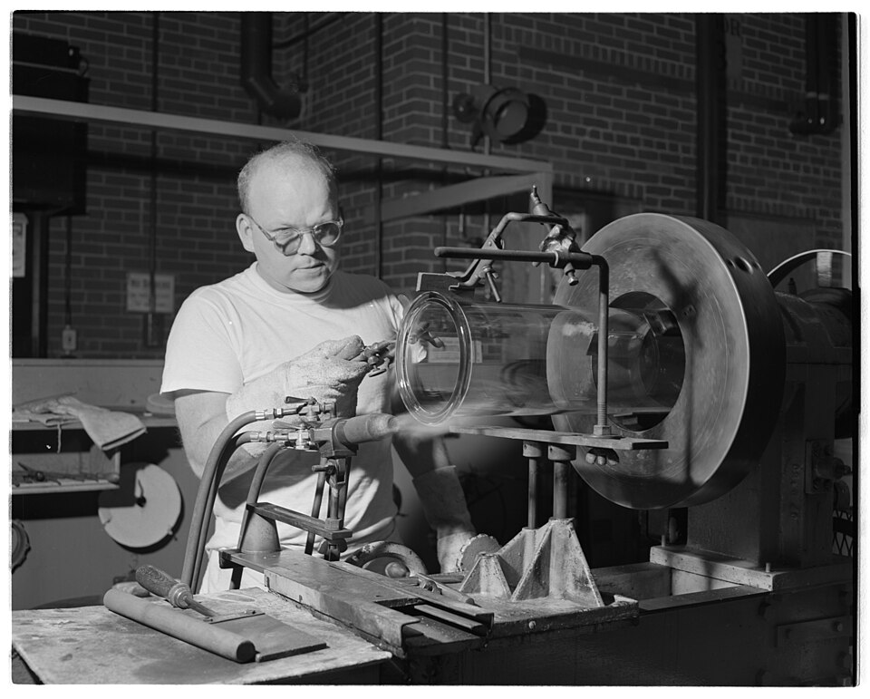

# Blow Molding Equipment

> **Node ID**: machine-tools.blow-molding-equipment
> **Domain**: [Machine Tools](./index.md)
> **Dependencies**: [`machine-tools.extruder`](extruder.md), [`metals.iron-steel`](../metals/iron-steel.md), [`energy.hydraulics`](../energy/index.md)
> **Enables**: [`polymers.thermoplastics`](../polymers/thermoplastics.md), [`chemistry.packaging-testing`](../chemistry/packaging-testing.md)
> **Timeline**: Years 18-28
> **Outputs**: bottles, tanks, hollow_containers, ducting
> **Critical**: No — other methods (rotational molding, welded sheet) can produce hollow parts, but blow molding is the only economical route for high-volume bottle production

## Overview

> *Image: Dow Chemical Company, Public domain*

Blow molding produces hollow plastic parts by extruding or injecting a tube of molten polymer (the parison), enclosing it in a split mold, and inflating it with compressed air against the mold cavity walls. The polymer solidifies on contact with the cooled mold surface, taking the mold's shape. The process is limited to hollow parts with uniform wall thickness but offers the lowest tooling cost of any hollow-part production method — blow molds cost $3,000-30,000 versus $10,000-100,000+ for injection molds.

Two principal methods exist: **extrusion blow molding** (continuous parison extruded downward, mold closes around it, air inflates) and **injection blow molding** (preform first injection-molded, then reheated and stretch-blown for biaxial molecular orientation). Extrusion blow molding is simpler and cheaper — the standard method for PE bottles, jerry cans, and drums. Injection blow molding produces PET beverage bottles with dramatically improved tensile strength (300%+ improvement) and gas barrier properties, but requires an [injection molding machine](injection-molding-machine.md) for the preform stage.

The [extruder](extruder.md) feeds the parison in extrusion blow molding. The same barrel-screw-heater technology applies, with an annular die head replacing the profile die. Downstream, blow-molded containers are essential for liquid storage, chemical handling, and food packaging throughout industrial civilization.

The key engineering challenge in blow molding is wall thickness uniformity. The parison sags under gravity during extrusion (parison sag), thinning the bottom while the top remains thick. The die swell (polymer expansion exiting the die) partially compensates but does not eliminate the gradient. For production-quality containers, a parison wall thickness programmer varies the die gap during extrusion — but this adds servo control complexity. For bootstrap production, design containers with generous wall thickness tolerances (±30%) and accept the non-uniformity.

Material selection constrains the process: LDPE (low-density polyethylene) blow-molds at 160-240°C with low melt strength — suitable for squeeze bottles and flexible containers. HDPE blow-molds at 180-240°C with higher melt strength — the standard for rigid bottles, jerry cans, and drums. PET requires injection blow molding with a two-stage process (inject preform, then stretch-blow at 95-115°C for amorphous orientation). PVC is technically blow-moldable but releases HCl at processing temperatures — avoid unless no alternative polymer is available.

## Prerequisites

- [Extruder](extruder.md) — for parison extrusion in extrusion blow molding
- [Steel plate](../metals/iron-steel.md) — for mold construction and machine frame
- [Compressed air supply](../energy/index.md) — 0.2-1.5 MPa, clean and dry
- [Hydraulic system](../energy/index.md) — for mold closing and clamping
- [Cooling water](../water/index.md) — for mold temperature control

## Bill of Materials

### Parison Die Head

| Material | Quantity | Specifications | Source | Alternatives |
|----------|----------|----------------|--------|-------------|
| Tool steel (die body) | 10-30 kg | P20 or H13, for die head and mandrel | [Iron & Steel](../metals/iron-steel.md) | Mild steel (shorter life) |
| Band heater (die head) | 1-2 | 1-3 kW, matched to die geometry | [Electric Furnaces](../energy/electric-furnaces.md) | Gas torch (poor temperature control) |
| Thermocouple | 1 | Type K, 0-400°C | [Measurement](../measurement/precision-metrology.md) | RTD sensor |

### Mold

| Material | Quantity | Specifications | Source | Alternatives |
|----------|----------|----------------|--------|-------------|
| Aluminum (mold cavities) | 20-100 kg | 6061-T6 or 7075-T6, machined to bottle profile | [Non-Ferrous Metals](../metals/non-ferrous.md) | Steel mold (heavier, harder to machine, better durability) |
| Steel (pinch-off inserts) | 2-5 kg | Hardened tool steel (D2 or O1), sharpened cutting edges | [Iron & Steel](../metals/iron-steel.md) | Brass (wears quickly, short runs only) |
| Copper tubing (cooling channels) | 5-15 m | 8-12 mm OD, soldered into mold body | [Non-Ferrous Metals](../metals/non-ferrous.md) | Drilled steel channels (harder to fabricate) |
| Guide pins and bushings | 4 sets | Hardened steel, 12-20 mm diameter | [Machine Tools](./index.md) | Tapered alignment dowels |

### Mold Clamping and Blow System

| Material | Quantity | Specifications | Source | Alternatives |
|----------|----------|----------------|--------|-------------|
| Steel plate (platens) | 50-200 kg | A36, 30-50 mm thick | [Iron & Steel](../metals/iron-steel.md) | Cast iron (heavier, better damping) |
| Hydraulic cylinder (clamp) | 1 | Bore 80-150 mm, stroke 200-400 mm, rated to 14 MPa | [Energy](../energy/index.md) | Pneumatic cylinder (lower force, faster) |
| Blow pin assembly | 1 | Hardened steel tube, 5-15 mm bore, with air inlet and seal | [Iron & Steel](../metals/iron-steel.md) | Standard pipe nipple (no seal) |
| Air regulator and valve | 1 | 0-2.0 MPa range, solenoid or manual | [Energy](../energy/index.md) | Needle valve (less repeatable) |

## Process Description

### Parison Die Head

1. **Machine die body**: Turn the die body from P20 tool steel on a lathe. The interior channels melt from the extruder barrel into an annular gap between the die body (outer) and mandrel (inner). The annular gap width determines parison wall thickness: for 2 mm parison wall, gap = 2 mm at the die lip. Machine interior to 0.4 μm Ra finish to prevent dead spots.
2. **Machine mandrel**: Turn the mandrel (center pin) from tool steel. For adjustable wall thickness: machine a threaded adjustment so the mandrel raises or lowers by 0.5-2.0 mm, changing the annular gap. Install the mandrel inside the die body with the gap set to target parison thickness.
3. **Install die heater**: Clamp a band heater around the die body, wire to a separate PID controller. The die must be at the same temperature as the last barrel zone to prevent premature solidification. Install thermocouple in the die wall, 5 mm from the melt channel.

**Calibration**: Extrude a parison into open air (no mold). Measure wall thickness at four points around the circumference with a micrometer, at 100 mm intervals along the length. Circumferential variation must be <±10%.

**Expected performance**: Die swell for LDPE: 1.3-1.6× die orifice diameter. For HDPE: 1.5-2.0×. Parison wall thickness uniformity: ±10% circumferential.

### Blow Mold

4. **Machine mold cavities**: CNC mill or hand-carve the bottle profile into two matching aluminum blocks. Cavity surface: polished to 0.2-0.4 μm Ra for glossy finish; bead-blasted for matte. Parting line must be flat and continuous within 0.02 mm to prevent flash.
5. **Install pinch-off**: Machine hardened steel insert strips along the bottom edge of each mold half. The pinch-off edge is beveled to 0.1-0.3 mm land width that cuts and welds the parison bottom in one action. Align pinch-off between halves within 0.05 mm.
6. **Install cooling channels**: Embed copper tubing in grooves milled into the mold body (10-15 mm from cavity surface). Solder tubing in place. Connect fittings for water circulation at 5-15 liters/minute per half. Mold temperature: 10-25°C for PE, 40-60°C for thick-wall parts.
7. **Install guide pins and blow pin channel**: Mount two guide pins (12-20 mm hardened steel) on one mold half and matching bushings on the other. Alignment tolerance at parting line: 0.02 mm maximum offset. Drill a channel through the mold top for the blow pin.

**Calibration**: Close empty mold on a sheet of carbon paper at the parting line. Open and inspect — imprint must show uniform contact along the entire parting line. Gaps indicate misalignment.

**Expected performance**: Mold life: 500,000-5,000,000 cycles (aluminum). Parting line alignment: ±0.02 mm.

### Mold Clamping System

8. **Fabricate platens**: Cut two steel plates (300-600 mm square, 30-50 mm thick). Mill faces flat within 0.05 mm. Mount one platen rigidly to the frame (fixed). Mount the other on linear guides (moving). Drill mounting holes for mold bolt patterns.
9. **Install clamp cylinder**: Mount hydraulic cylinder behind the moving platen. Clamp force must exceed blow pressure × projected part area: for 0.1 m² bottle at 0.8 MPa, minimum clamp = 80 kN (~8 tonnes). Size at 1.5×: 120 kN.
10. **Install blow pin actuator**: Mount a pneumatic or hydraulic cylinder to push the blow pin into the parison after mold closing and retract before mold opening. Stroke: 50-150 mm. The blow pin must seal against the parison to prevent air leakage during inflation.

**Calibration**: Connect regulated compressed air to the blow pin via a solenoid valve. Set blow pressure for PE bottles: 0.3-0.8 MPa. Verify air pressure at the blow pin with a gauge. Cycle the clamp and blow pin 20 times — verify smooth, repeatable operation.

**Expected performance**: Clamp force: 5-50 tons. Blow pressure: 0.3-0.8 MPa (PE), 1.0-1.5 MPa (PET stretch-blow). Cycle time: 5-30 seconds.

## Quantitative Parameters

### Process Parameters by Method

| Parameter | Extrusion Blow (PE) | Injection Blow (PET) |
|-----------|---------------------|----------------------|
| Container volume range | 0.1-50 L | 0.2-3 L |
| Blow pressure | 0.3-0.8 MPa | 1.0-1.5 MPa |
| Melt temperature | 180-240°C | 260-290°C |
| Mold temperature | 10-25°C | 10-15°C |
| Cycle time | 5-30 seconds | 8-20 seconds |
| Production rate | 100-700 bottles/hour | 500-2000 bottles/hour |
| Wall thickness range | 0.3-3.0 mm | 0.2-0.8 mm |
| Blow ratio (typical) | 2:1 to 4:1 | 3:1 to 7:1 (stretch) |
| Clamp force | 5-50 tons | 10-30 tons |

### Cycle Time Breakdown (1 L PE Bottle)

| Phase | Duration |
|-------|----------|
| Parison extrusion | 2-3 s |
| Mold close + blow | 1-2 s |
| Cooling dwell | 5-8 s |
| Mold open + ejection | 1-2 s |
| **Total** | **9-15 s** |

### Die Head Design Parameters

| Parameter | Value |
|-----------|-------|
| Annular gap (parison wall) | 1-3 mm (adjustable) |
| Die land length | 15-30 mm |
| Entrance bell angle | 30-45° included |
| Mandrel adjustment range | 0.5-2.0 mm axial travel |
| Die body material | P20 or H13 tool steel |
| Die heater power | 1-3 kW |
| Required die temperature | Match last barrel zone ±5°C |
| Parison extrusion speed | 50-200 mm/s (gravity-assisted) |

## Scaling Notes

- A single-station blow molder produces 100-300 bottles/hour for 0.5-2 L containers. Sufficient for village-scale production.
- Scale to multi-station (4-8 molds on a rotary table) for 500-2000+ bottles/hour. Multi-station requires a larger clamp frame and rotary index mechanism.
- Large containers (20-250 L drums, fuel tanks) require higher clamp force (50-200 tons) and slower cycles (30-120 s). Parison sag becomes the dominant quality issue.
- Co-extrusion blow molding (multi-layer parison with barrier layer) produces containers with improved O₂/moisture barrier. Requires a multi-layer die head — build only when food-grade packaging demands justify the complexity.
- Wooden molds: For prototyping or very short runs (<100 parts), a split mold carved from hardwood can produce acceptable PE bottles at low pressure (0.2-0.4 MPa). Limited to <500 cycles.
- Parison wall thickness programming: For precision containers, a programmable die gap adjusts the annular opening during extrusion, producing a parison with variable wall thickness along its length. Thick sections compensate for corners that thin during blowing. This requires a servo-controlled mandrel actuator — build only after basic blow molding is proven.
- Material consumption: A 1 L HDPE bottle weighs 35-50 g. At 200 bottles/hour, resin consumption is 7-10 kg/hour. Plan extruder capacity accordingly — the extruder must maintain steady output during the short parison extrusion window (2-3 seconds).

## Troubleshooting

| Problem | Probable Cause | Solution |
|---------|---------------|----------|
| Thin walls at corners | Blow ratio too high; parison not centered | Reduce blow ratio (redesign part); adjust die centering; increase parison wall thickness |
| Flash at parting line | Insufficient clamp force; mold alignment off | Increase clamp force; check guide pins and parting line alignment; clean mold faces |
| Leaking pinch-off | Dull pinch-off edges; misalignment | Sharpen or replace pinch-off inserts; realign mold halves; increase pinch-off land width |
| Uneven wall thickness | Parison sag (gravity thins bottom) | Use higher melt strength polymer; shorten parison extrusion time; install parison wall thickness programmer |
| Bottle stuck in mold | Insufficient cooling; vacuum formation | Increase cooling water flow; extend cooling dwell; install air blow-off to break vacuum |
| Parison curl | Die temperature uneven; mandrel off-center | Adjust die heater placement for uniform temperature; center mandrel; check die lip for nicks |
| Excessive die swell | Polymer too hot; die land too short | Lower die temperature 5-10°C; increase die land length 50-100%; use lower MI grade |
| Contamination streaks | Dirty die; degraded polymer | Clean die and breaker plate; purge barrel with fresh polymer |
| Neck finish out-of-round | Blow pin misaligned; uneven cooling | Center blow pin in neck ring; increase neck cooling; check blow pin seal condition |
| Parison blow-out (burst) | Blow pressure too high; thin parison wall | Reduce blow pressure 0.1-0.2 MPa; increase parison wall thickness; check for die damage |
| Excessive bottom weld line | Pinch-off too hot; parison too long | Reduce die temperature 5-10°C; shorten parison extrusion time; sharpen pinch-off edge |

## Safety

- **Pinch points**: The mold closing action generates 5-50+ tons of force. A hand caught between closing mold halves is crushed catastrophically. Install two-hand controls and safety interlock gates. Never reach into the mold area during automatic cycling.
- **Compressed air**: Blow air at 0.2-1.5 MPa can cause injuries if a fitting fails or a hose whips. Secure all connections with safety chains. Pressure-test the air system at 1.5× maximum working pressure before first use. A burst fitting at 1.0 MPa releases air with enough force to drive a hose whip through skin.
- **Hot parison**: The extruded parison exits at 160-240°C. Contact causes thermal burns. Guard the area between the die head and mold. Do not manually adjust the parison while the extruder is running — use wooden tools if necessary.
- **Mold handling**: Blow molds (especially steel) weigh 20-100+ kg. Use a hoist for installation and removal. Never lift a mold above waist height without mechanical assistance.
- **Noise**: The mold closing action and parison cutoff produce impact noise of 85-100 dB. Hearing protection (NRR 25+ earplugs) recommended for extended operation near the machine.
- **Polymer fumes**: HDPE and LDPE processing at 200-240°C releases minimal volatiles. PVC blow molding (avoid if possible) releases HCl at temperatures above 180°C. Provide ventilation at 10-15 air changes per hour for any polymer processing area.

## Quality Control

1. **Volume check**: Fill 10 bottles from each production run. Weigh water fill. All must be within ±3% of design volume.
2. **Drop test**: Drop a filled bottle from 1.2 m onto concrete. No cracking or leaking acceptable. Test 3 bottles per production lot.
3. **Wall thickness measurement**: Cut a bottle from each lot at the thinnest point (usually a corner). Measure with calipers — minimum wall thickness must meet specification (≥0.3 mm for 500 mL PE bottles).
4. **Leak test**: Fill the blown container with water. Apply internal air pressure at 1.5× intended service pressure. Inspect for leaks at pinch-off weld, parting line, and neck finish. Zero leaks acceptable.
5. **Neck finish inspection**: Verify bottle neck threads engage the closure cap smoothly without cross-threading.
6. **Weight consistency**: Weigh 10 consecutive bottles on a precision scale (0.1 g resolution). Weight variation must be <±3%. Weight tracks parison consistency and wall thickness uniformity.
7. **Top-load compression test**: Place an empty bottle upright between platens of a [hydraulic press](hydraulic-press.md). Apply 200-400 N axial load (depending on container size). No buckling or collapse. This test simulates stacking loads during storage and transport.

## Variations and Alternatives

- **Extrusion blow molding vs. injection blow molding**: Extrusion blow is simpler and cheaper to set up. Injection blow produces bottles with tighter tolerances, better neck finish, and biaxial molecular orientation (PET only). Build extrusion blow first; add injection blow when PET bottle quality is required.
- **Rotational molding**: For large tanks (100+ liters), rotational molding produces uniform-wall hollow parts with lower tooling cost but much longer cycle times (10-30 minutes). Requires an oven and a rotating mold mechanism.
- **Wooden molds**: For prototyping or very short runs (<100 parts), a hardwood split mold produces acceptable PE bottles at low pressure. Limited to <500 cycles before mold degrades.
- **Thermoforming** ([thermoforming-equipment.md](thermoforming-equipment.md)): Alternative for large, open-top containers (trays, tubs) but cannot produce closed hollow shapes.
- **Injection molding** ([injection-molding-machine.md](injection-molding-machine.md)): Can produce solid parts with threads and complex features but cannot produce hollow closed containers.

## References

- [Extruder](extruder.md) — provides the parison melt for extrusion blow molding
- [Injection Molding Machine](injection-molding-machine.md) — provides preforms for injection blow molding
- [Thermoforming Equipment](thermoforming-equipment.md) — alternative for large hollow or curved parts from sheet
- [Compression Press](compression-press.md) — for solid parts that don't require hollow geometry
- [Thermoplastics Processing](../polymers/thermoplastics.md) — polymer-specific blow molding parameters
- Die swell ratio: LDPE 1.3-1.6×, HDPE 1.5-2.0× die orifice. Account for die swell when setting die gap.
- Blow pressure range: 0.3-0.8 MPa for PE (2-50 L), 1.0-1.5 MPa for PET stretch-blow.
- Clamp force sizing: F = blow pressure × projected part area × 1.5 safety factor. Undersized clamp produces flash at the parting line.
- Cooling water flow requirement: 5-15 L/min per mold half at 10-15°C inlet temperature. Warm water (>25°C) increases cycle time and reduces production rate.
- HDPE bottle weight guidelines: 500 mL bottle = 30-40 g; 1 L bottle = 40-60 g; 5 L jerry can = 200-350 g. Weight scales with volume to the 0.67 power for geometrically similar containers.
- Blow-up ratio limit: The ratio of the largest mold cavity diameter to the parison diameter should not exceed 4:1 for extrusion blow molding. Higher ratios produce unacceptably thin corners. For PET stretch-blow molding, ratios of 7:1 are achievable due to biaxial orientation strengthening.
- Mold surface finish and part appearance: The mold cavity surface finish transfers directly to the blown part. A polished mold (0.2-0.4 μm Ra) produces a glossy part. A bead-blasted mold (2-5 μm Ra) produces a matte finish that hides minor surface imperfections. For prototype molds in hardwood, the wood grain texture appears on the part surface — acceptable for non-cosmetic containers.
- Acetaldehyde generation in PET: PET blow molding at temperatures above 260°C generates acetaldehyde, which imparts a sweet taste to beverages stored in the container. Keep melt temperature below 260°C for food-contact PET bottles. This is a quality, not a safety, issue — acetaldehyde at the levels generated (1-5 ppm in the container wall) is not harmful but is detectable by taste in water.
- Deflashing: After blow molding, the pinch-off tab and neck flash must be removed. A deflashing jig holds the bottle while a rotating knife trims the flash to within 0.5 mm of the part surface. For low-volume production, trim with a sharp knife or shears by hand. Automated deflashing machines use matched metal dies that close around the part and shear the flash.
- Mold cooling design: The cooling cycle (5-8 seconds for a 1 L PE bottle) is typically the longest phase of the blow molding cycle. Efficient cooling requires water channels 10-15 mm from the cavity surface, carrying 5-15 L/min of 10-15°C water per mold half. Baffles within the cooling channels direct water flow across the full mold surface. Uneven cooling produces warpage and non-uniform wall thickness — the last area to cool is the thickest section, which shrinks and pulls the surrounding material inward.
- Blow pin design: The blow pin serves three functions: it delivers compressed air to inflate the parison, it seals against the parison neck to prevent air leakage, and it forms the inside diameter of the bottle neck finish. The blow pin diameter must be 0.5-1.0 mm smaller than the neck inner diameter to allow for polymer shrinkage during cooling. For threaded neck finishes, the blow pin engages with a neck ring in the mold that forms the threads on the outside while the blow pin forms the inside.
- Startup and shutdown procedure: On startup, heat the extruder and die to setpoint before beginning parison extrusion (30-45 minutes). Extrude parison material until it runs clear and uniform. Close the mold on the first good parison. On shutdown, stop the extruder screw and purge the barrel with LDPE (or the current material) until the die runs clear. Do not leave material in the die to solidify — it creates a hard plug that is difficult to remove on the next startup.
- Part weight control: The weight of a blow-molded container is determined by the parison length and the die gap setting. Heavier containers have thicker walls and better impact resistance but consume more material. For a 1 L HDPE bottle, the weight range is 35-60 g depending on application. Chemical containers (UN-rated) require minimum wall thickness of 1.0 mm and must pass a 1.8 m drop test filled with the intended contents. Food-grade containers require minimum wall thickness of 0.3 mm for shelf-stable products.
- In-mold labeling: For production runs requiring branded or labeled containers, place a printed label (polypropylene or polyethylene film) against the mold cavity wall before the parison is inflated. The hot polymer bonds the label to the container wall during blowing. This eliminates a secondary labeling step. The label must be the same polymer family as the container (PE label for PE bottle) for proper adhesion.
- Container design guidelines for blow molding: Design containers with uniform wall thickness distribution in mind. Avoid sharp corners (use 3-5 mm minimum radius) — corners thin excessively during blowing. Maintain a constant cross-section where possible. The blow ratio (depth of draw / width of opening) should not exceed 4:1 for extrusion blow. Provide 2-3° draft on all vertical sidewalls for part ejection. Position the parting line on a flat surface for best flash control.
- Multi-layer containers: For containers requiring improved barrier properties (oxygen barrier, UV protection, chemical resistance), co-extrusion blow molding produces a parison with 2-7 layers of different polymers. A typical 3-layer structure has: outer layer (HDPE for strength), barrier layer (EVOH or nylon for O₂ barrier, 5-10% of wall), inner layer (HDPE for food contact). The multi-layer die head feeds from 2-7 separate extruders — build single-layer blow molding first and add layers only when barrier properties justify the complexity.

---
*Part of the [Bootciv Tech Tree](../index.md) • [Machine Tools](./index.md) • [All Domains](../index.md)*
