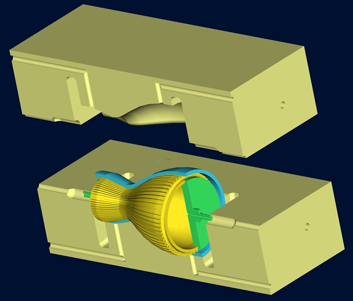

# Diffusion Bonding

> **Node ID**: machine-tools.joining.diffusion-bonding
> **Domain**: [Machine-Tools](./index.md)
> **Dependencies**: See prerequisites
> **Enables**: [`Metal Joining`](joining.md), [`Electric Furnaces`](../energy/electric-furnaces.md)
> **Timeline**: Years 35-65
> **Outputs**: diffusion_bonds, hermetic_seals
> **Critical**: No

## Overview

> *Image: Romanusas2, CC BY-SA 4.0*

Solid-state joining at 50-80% melting point temperature under 1-10 MPa pressure for 30-120 minutes. Atomic diffusion across the interface eliminates the joint line, producing a bond microstructurally indistinguishable from parent metal. Joins dissimilar metals (Ti-to-SS, Cu-to-Al) via thin interlayers without brittle intermetallics. HIP bonding (50-200 MPa isostatic) for complex internal surfaces. Critical for UHV chambers and semiconductor heat exchangers.

Surface preparation is the dominant factor in bond quality. The mating surfaces must be flat and smooth to maximize contact area, with surface roughness below a few micrometers typically required. Any oxide layer, organic contamination, or adsorbed moisture forms a diffusion barrier that prevents atomic bonding. Preparation methods include mechanical polishing, chemical etching, electro-polishing, and sputter cleaning, with the final step performed immediately before assembly to minimize re-oxidation.

Diffusion bonding is performed in vacuum or inert atmosphere to prevent oxide formation during the long heating cycle. The applied pressure must be sufficient to bring surface asperities into contact and initiate grain boundary diffusion, but not so high as to cause macroscopic deformation of the workpiece. For complex geometries with internal surfaces, hot isostatic pressing (HIP) applies uniform pressure from all directions using argon gas, enabling simultaneous bonding of multiple joints in a single cycle.

Diffusion bonding was developed to address joining challenges in the aerospace and nuclear industries, where the need to fabricate complex titanium and refractory metal structures with high reliability drove investment in solid-state joining technology. The process remains indispensable for applications where fusion welding would degrade material properties or where joint geometry makes conventional welding impossible.

Unlike fusion welding, diffusion bonding introduces no filler metal, no melting, and no cast microstructure at the joint. The parent metal microstructure is preserved across the interface, and the mechanical properties of the joint approach those of the base material. This makes diffusion bonding the preferred choice for joints in fatigue-critical structures and applications requiring hermetic sealing with zero leak rate.

The ability to join dissimilar metals without brittle intermetallic formation makes diffusion bonding uniquely valuable for applications requiring the combination of properties from different materials in a single component, such as titanium-to-stainless steel transition joints in aerospace and chemical processing equipment.

Primary outputs: `diffusion_bonds`, `hermetic_seals`.

## Prerequisites

### Materials

- Metals to be joined (titanium, steel, nickel alloys, copper)
- Interlayer foils (nickel, copper, or silver for dissimilar joints)
- Argon or nitrogen for inert atmosphere
- Polishing consumables (abrasive papers, diamond paste, etchants)

### Equipment

- Vacuum hot press with hydraulic ram and heated platens (capable of 1200°C and 20 MPa)
- HIP unit for complex geometry bonding (50-200 MPa argon pressure)
- Surface preparation equipment (polishing wheels, lapping machines, chemical etch stations)
- Vacuum furnace with temperature uniformity within ±5°C across the bond zone

### Knowledge

- Solid-state diffusion kinetics and activation energies for the metals being joined
- Surface science and oxide layer behavior at elevated temperature
- Thermomechanical cycling and residual stress development in bonded assemblies
- Metallographic interpretation of bond line quality from cross-section samples
- Vacuum furnace operation and atmosphere purity requirements

### Infrastructure

- Vacuum or inert atmosphere furnace with temperature uniformity capability
- Hydraulic press with heated platens and vacuum chamber integration
- Surface preparation area (lapping, polishing, chemical etching) separate from the bonding furnace
- Argon gas supply with purity monitoring and oxygen/moisture dew point measurement
- Metallographic sample preparation and microscopy for destructive testing

## Process Description

Diffusion bonding joins metals by holding polished surfaces together at elevated temperature under pressure long enough for atoms to migrate across the interface. No melting occurs. The process has three overlapping stages: initial contact and plastic deformation of surface asperities, grain boundary diffusion along the contacting surfaces, and volume diffusion that eliminates the remaining voids.

### Step-by-Step Procedure

1. Machine mating surfaces flat to within 0.01 mm over the joint area. Polish to a surface roughness of Ra 0.4 μm or finer. Any curvature or waviness reduces contact area and creates unbonded regions.
2. Clean polished surfaces with solvent degreasing, then chemical etch or sputter clean immediately before assembly. Handle only with clean gloves. Any fingerprint oil, adsorbed moisture, or re-formed oxide blocks diffusion.
3. Assemble the joint with interlayer foil if joining dissimilar metals. Load into the vacuum hot press or HIP unit. Position thermocouples at the bond interface for accurate temperature measurement.
4. Evacuate the furnace to below 10⁻³ mbar (or backfill with argon to below 5 ppm O₂). Heat to the target bonding temperature at a controlled rate, typically 5-10°C per minute, to avoid thermal shock.
5. Apply bonding pressure once temperature stabilizes. Hold at temperature and pressure for the specified dwell time (30 minutes to 4 hours depending on material and geometry). Maintain atmosphere purity throughout.
6. Cool under continued pressure to prevent joint separation during thermal contraction. Cool at controlled rate (2-5°C per minute) through the temperature range where residual stresses develop.
7. Remove the bonded assembly and inspect. Section a witness coupon from each cycle for metallographic examination of the bond line.

The three stages of bond formation occur in sequence during the dwell time. In the first stage, the applied pressure deforms surface asperities, increasing the actual contact area from a small fraction to a substantial portion of the interface. In the second stage, grain boundary diffusion along the contacting surfaces begins to eliminate the interface voids, forming isolated pores. In the third stage, volume diffusion from the pore surfaces gradually shrinks and eliminates the remaining voids. The relative duration of each stage depends on the material, temperature, and initial surface condition.

For titanium alloys, the high solubility of oxygen in titanium at bonding temperature means that even thin residual oxide layers dissolve during the dwell, which is one reason titanium diffusion bonds so reliably. Stainless steel, by contrast, forms a tenacious chromium oxide that does not dissolve readily, requiring more aggressive surface preparation or the use of a deoxidizing atmosphere.

The selection of bonding temperature involves a trade-off between diffusion rate and microstructural stability. Higher temperatures accelerate diffusion and shorten the required dwell time, but may cause grain coarsening, phase transformations, or overaging in precipitation-hardened alloys. The bonding temperature is typically set just below the temperature where adverse microstructural changes begin, and the dwell time is extended as needed to achieve full bond strength at that temperature.

### Process Parameters

| Parameter | Range | Notes |
|-----------|-------|-------|
| Temperature | 50-80% of melting point | Ti: 850-950°C, Steel: 900-1100°C, Cu: 700-850°C |
| Pressure | 1-10 MPa (uniaxial), 50-200 MPa (HIP) | Higher pressure reduces required time |
| Dwell Time | 30 min to 4 hours | Longer for thicker sections and lower temperatures |
| Atmosphere | Vacuum (<10⁻³ mbar) or inert gas (<5 ppm O₂) | Vacuum preferred for reactive metals |
| Surface Roughness | Ra ≤ 0.4 μm | Finer is better; critical for bond quality |

The bonding atmosphere must prevent oxidation of the mating surfaces throughout the heating and cooling cycle. Vacuum furnaces provide the cleanest environment but have limited throughput due to pump-down time. Inert gas furnaces using argon offer faster cycle times but must maintain oxygen levels below a few parts per million to prevent oxide formation at bonding temperature. The choice between vacuum and inert gas depends on the materials being bonded and the production volume requirements.

## Safety Considerations

Diffusion bonding involves furnace temperatures exceeding 900°C and hydraulic press forces capable of crushing limbs. The combination of heat and force creates hazards that require specific controls.

- **Furnace burns**: Hot press platens and furnace interiors exceed 900°C. Skin contact causes immediate third-degree burns destroying tissue through the full dermal layer. At 600°C, contact for 1 second causes deep burns. Surfaces remain above 100°C (burn threshold) for 2-4 hours after the furnace is turned off. Use infrared thermometer to verify surface temperature before approaching. Post "HOT SURFACE" warning signs that remain in place until the furnace has cooled below 50°C.
- **Hydraulic crush**: The ram applies 5-200 tons of force (50-200 MPa over the platen area). Hands caught between platens suffer simultaneous crushing and thermal burns. A 200-ton press exerted over a 100 mm wide hand produces approximately 2000 MPa, far exceeding bone crush strength (100-200 MPa). Two-hand controls with anti-tie-down (both hands must be on controls, releasing either hand immediately stops the ram) are mandatory. Never reach between platens during operation.
- **Asphyxiation**: Argon and nitrogen used for inert atmospheres displace air in enclosed spaces. At 18% oxygen (vs. 20.9% normal), cognitive impairment begins. At 16%, unconsciousness occurs. At 6%, death occurs within minutes. Argon is 38% heavier than air and pools in floor-level spaces (trenches, pits, near-floor storage areas). A single argon cylinder releasing its contents (8 m³ at STP) can displace all oxygen in a 40 m³ room. Install oxygen monitors with audible alarms in any room where inert gases are used, mounted at breathing height (1.5 m) and near floor level (0.3 m) for argon.
- **Vacuum implosion**: Large vacuum furnace chambers experience 10 tonnes of atmospheric force per square meter of surface area. A 1-meter diameter cylindrical chamber has over 7 tonnes of external force on each end cap. A damaged or corroded chamber wall can implode, sending fragments inward at high speed. Inspect vessels quarterly for corrosion, dents deeper than 2 mm, and seal surface degradation. Hydrostatically test vessels to 1.5× atmospheric pressure every 2 years.
- **Burns from bonded workpieces**: Completed diffusion bonds emerge from the furnace at 900+°C. The workpiece is not visibly glowing below approximately 400°C but is still hot enough to cause serious burns. Always use tongs or hoists to remove bonded assemblies from the furnace. Place hot workpieces in a designated cooling area with a barrier rope and "HOT" signs.

### Personal Protective Equipment

- Heat-resistant gloves rated for handling materials above 500°C when loading/unloading furnace
- Face shield with IR filter for viewing hot furnace interior through the sight port (IR intensity at 900°C through unprotected glass can cause cataracts)
- Leather apron and flame-resistant clothing for press operations
- Oxygen monitor (worn on collar or chest pocket) in any enclosed space where inert gases are used
- Steel-toe boots with metatarsal guard for handling heavy workpieces and fixtures

### Emergency Procedures

- Post emergency stop locations for hot press hydraulic system and vacuum furnace power at every operator station
- Maintain inert gas emergency purge capability for furnace atmosphere
- Install oxygen deficiency monitor with audible alarm (>90 dB) in furnace room, connected to automatic ventilation override
- Keep burn kit with fire blanket at the furnace station
- Train all personnel on inert gas asphyxiation rescue: never enter an oxygen-deficient space without self-contained breathing apparatus (SCBA). Rescue attempts without SCBA have a high fatality rate as the rescuer also loses consciousness within seconds.

## Quality Control

### Acceptance Criteria

- **Diffusion Bonds**: Bond line microstructurally indistinguishable from parent metal on cross-section; tensile strength at least 90% of parent metal; no continuous voids along the interface
- **Hermetic Seals**: Leak rate below 10⁻⁹ mbar·L/s (helium mass spectrometer); no evidence of through-thickness porosity

For structural applications, the bond strength must be verified through mechanical testing. Lap-shear specimens loaded in tension provide the most direct measure of bond strength. Butt-joint tensile specimens loaded perpendicular to the bond plane test the bond under the most demanding condition. Impact testing (Charpy) of bonded specimens reveals whether the bond line acts as a brittle fracture path. In a well-made diffusion bond, the fracture occurs in the parent metal rather than at the interface.

### Testing Methods

- Ultrasonic C-scan imaging to detect unbonded areas at the interface (resolution limited to ~0.5 mm void size)
- Metallographic cross-section of witness coupon for bond line examination, etched to reveal grain growth across the interface
- Leak testing of hermetic seals using helium mass spectrometer
- Tensile and shear testing of lap-shear and butt-joint specimens from witness coupons
- Microhardness traverse across the bond line to detect softening or hardening zones

### Sampling Protocol

- Include witness coupon in every bond cycle for destructive testing
- Ultrasonic scan 100% of bonded area on production parts
- Verify furnace temperature uniformity survey at regular intervals (quarterly or after maintenance)
- Maintain bonding parameter logs (temperature, pressure, time, atmosphere) for every cycle for traceability
- Reject and investigate any cycle with atmosphere excursion or temperature deviation exceeding ±10°C

## Scaling Notes

- **Bench scale**: Small vacuum hot press with 50-100 mm platen diameter. Single joints in flat geometries. Cycle times of 2-6 hours including heat-up and cool-down. Suitable for process development and small components.
- **Pilot scale**: Larger vacuum furnace with multiple joint capability. Bonding of assemblies with several joint interfaces in a single cycle. Semi-automated surface preparation. Batch sizes of 10-50 parts.
- **Production scale**: Continuous vacuum furnace with load-lock for high throughput, or HIP units processing hundreds of parts per cycle. Automated surface preparation and inspection. Annual volumes in the thousands.

Scaling diffusion bonding presents unique challenges. Surface preparation quality must be maintained across hundreds of parts per batch, which requires automated polishing and cleaning systems rather than manual bench work. Furnace cycle time is the throughput bottleneck: a single cycle takes 4-12 hours including heat-up, dwell, and cool-down. Load-lock systems allow preparing the next batch while the current batch processes, but the capital investment is substantial. For HIP bonding, the cycle time is similar but the throughput per cycle is higher because dozens of parts can be loaded into the vessel simultaneously.

Bond quality verification is challenging because a well-made diffusion bond is microstructurally identical to the parent material. Ultrasonic testing with focused transducers can detect unbonded areas, but micro-level voids at the interface may be below the resolution of conventional NDT methods. Metallographic cross-sectioning of test coupons processed alongside production parts provides the most reliable assessment of bond quality.

Interlayer materials enable joining of dissimilar metal pairs that would form brittle intermetallic compounds if joined directly. Thin foils of compatible intermediate metals (nickel between titanium and stainless steel, for example) allow graded diffusion across the interface. The interlayer thickness must be optimized to accommodate the diffusion distances while remaining thin enough to avoid creating a weak plane at the joint.

Copper-to-aluminum diffusion bonding is used in electrical and thermal management applications where the high conductivity of both metals is needed in a single assembly. The challenge is controlling the formation of brittle Cu-Al intermetallic compounds at the interface. Thin interlayers of nickel or silver prevent direct Cu-Al contact while allowing bonding at temperatures compatible with both metals.

## Troubleshooting

| Problem | Probable Cause | Solution |
|---------|---------------|----------|
| Unbonded areas at interface | Surface roughness too high or contamination | Re-polish to Ra ≤ 0.4 μm; sputter clean immediately before assembly |
| Continuous voids along bond line | Insufficient pressure or temperature | Increase pressure within workpiece deformation limit; verify thermocouple calibration at bond line |
| Weak bond (fails below 70% parent metal strength) | Oxide layer not removed before bonding | Improve cleaning; reduce time between preparation and loading into furnace |
| Grain boundary voids | Insufficient diffusion time | Extend dwell time; increase temperature by 25-50°C |
| Workpiece distortion | Pressure too high for the geometry | Reduce pressure; use HIP for uniform loading; add structural restraint fixtures |
| Interface contamination visible in cross-section | Furnace atmosphere leak or insufficient vacuum | Check furnace leak rate; verify argon purity; inspect furnace seals |
| Cracking at dissimilar metal interface | Thermal expansion mismatch during cooling | Reduce cooling rate; add compliant interlayer; use graded interlayer stack |

## Variations and Alternatives

- **Hot isostatic pressing (HIP) bonding**: Applies isostatic pressure from all directions using argon gas, enabling simultaneous bonding of complex internal surfaces. Used for titanium aerospace structures with internal cooling channels and multi-port vacuum manifolds for semiconductor processing equipment.
- **Superplastic forming and diffusion bonding (SPF/DB)**: Combines diffusion bonding with superplastic forming of titanium sheet. Internal features are bonded first, then argon gas pressure inflates the pack into a die cavity. Used for titanium aerospace panels with integral stiffeners.
- **Active metal bonding**: Uses a thin layer of titanium or zirconium at the ceramic-metal interface to promote chemical bonding between dissimilar material classes. Used for alumina-to-Kovar joints in electronic packaging.

Diffusion bonding of ceramics to metals (alumina to Kovar for electronic packaging) requires careful matching of thermal expansion coefficients to prevent residual stresses from cracking the ceramic during cooling from the bonding temperature.

Active metal bonding uses a thin layer of titanium or zirconium at the ceramic-metal interface to promote chemical bonding between dissimilar material classes. The active metal forms a reaction layer that bonds to the ceramic on one side and to the metal workpiece on the other, bridging the fundamental difference in bonding character between ceramics (ionic/covalent) and metals (metallic).

The absence of a molten zone in diffusion bonding means no porosity, no segregation, and no heat-affected zone in the conventional sense. The joint is microstructurally continuous with the parent material when properly executed, making it the preferred process for applications where a fusion weld zone would be unacceptable: ultra-high vacuum chamber fabrication, semiconductor process equipment with internal cooling channels, and biomedical implants where the joint must withstand cyclic loading without fatigue crack initiation.

## References

- [Metal Joining](joining.md) — parent capability
- [Machine-Tools Domain](./index.md) — domain overview and related capabilities
- [Metal Joining](joining.md) — downstream capability
- [Electric Furnaces](../energy/electric-furnaces.md) — downstream capability

### Material Handling

- Protect prepared bonding surfaces from recontamination by storing in sealed bags with desiccant immediately after polishing
- Handle interlayer foils with clean nitrile gloves to prevent oil transfer from skin contact
- Store polished workpieces in a clean, dry area; bond within hours of final surface preparation
- Maintain argon gas supply purity; install moisture and oxygen traps on gas lines to the furnace
- Segregate witness coupons from different bond cycles to prevent cross-contamination of traceability records
- Clean furnace interior before each cycle to prevent contamination from previous runs
- Log atmosphere composition (vacuum level or O₂ ppm) throughout each bonding cycle for traceability
- Handle HIP-processed components with care after removal; residual internal pressure can cause unexpected movement if the component has internal channels
- Maintain a log of furnace leak-up rates to detect seal degradation before it affects bond quality
- Calibrate bonding press force gauges on a quarterly schedule; force drift produces inconsistent bond quality
- Verify thermocouple accuracy against a reference standard before each production bonding cycle; temperature errors directly affect bond strength

---
*Part of the [Bootciv Tech Tree](../index.md) · [Machine-Tools](./index.md) · [All Domains](../index.md)*
