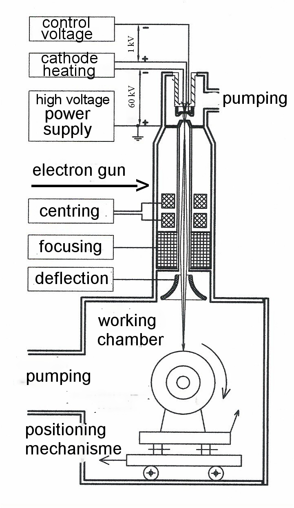

# Electron Beam Welding

> **Node ID**: machine-tools.joining.electron-beam
> **Domain**: [Machine-Tools](./index.md)
> **Dependencies**: [`Vacuum Chambers & Sealing`](../vacuum/chambers.md)
> **Enables**: [`Vacuum Pumps`](../vacuum/pumps.md), [`Metal Joining`](joining.md), [`Electricity Generation & Distribution`](../energy/electricity.md)
> **Timeline**: Years 30-60
> **Outputs**: electron_beam_welds, hermetic_seals
> **Critical**: No

## Overview

> *Electron beam welder*

> *Image: Zobač, CC0*

Focused electron beam (30-150kV accelerating voltage, 10-100mA beam current) welding in vacuum chamber. Deep narrow penetration (depth-to-width 10:1 to 30:1), minimal heat input and distortion. Zero porosity, zero contamination. Critical for UHV vacuum chamber fabrication (leak rates below 10⁻¹⁰ mbar·L/s), refractory metals, and aerospace components. Single-pass penetration up to 200mm in steel.

The vacuum environment is both the primary advantage and the main logistical constraint of electron beam welding. The absence of atmospheric gases eliminates oxidation, nitrogen pickup, and porosity. The weld metal is as clean or cleaner than the base metal. This makes EBW the preferred process for joining reactive and refractory metals (titanium, zirconium, niobium, tantalum, tungsten) that rapidly oxidize or embrittle when welded in air. The workpiece must fit entirely within the vacuum chamber, which limits the maximum weldable component size.

Beam parameters, including accelerating voltage, beam current, focus position, and travel speed, are precisely controlled to achieve the desired penetration depth and weld profile. The beam can be electromagnetically deflected and oscillated to distribute heat input across a wider area or to fill gaps in poor-fit joints. Pulsed beam modes reduce heat input for welding near heat-sensitive features. CNC-controlled workpiece manipulation allows complex circumferential and curved weld paths without repositioning.

The combination of deep penetration, minimal distortion, and zero contamination makes EBW indispensable for applications where joint reliability cannot be compromised: nuclear reactor components, aerospace flight hardware, and semiconductor vacuum chamber fabrication where a single leak defect can render an entire system non-functional.

Primary outputs: `electron_beam_welds`, `hermetic_seals`.

Electron beam welding was developed in the mid-20th century, enabled by advances in high-vacuum technology and electron optics that were originally pursued for particle physics research and electron microscopy. The process found early application in nuclear and aerospace programs where its ability to weld reactive metals in a contamination-free environment justified the capital investment.

The electron beam deposits energy in a volume rather than just at the surface, because the high-energy electrons penetrate into the metal before scattering and depositing their kinetic energy as heat. This volumetric energy deposition is what gives EBW its characteristically deep, narrow weld profile. At 150 kV accelerating voltage, single-pass penetration reaches 200 mm in steel, a capability unmatched by any other welding process.

EBW is one of the few welding processes that can join refractory metals (tungsten, molybdenum, tantalum, niobium) reliably. These metals oxidize rapidly at elevated temperature and embrittle when contaminated by interstitial elements (oxygen, nitrogen, hydrogen). The vacuum environment of EBW provides the necessary protection without requiring the expensive glove-box facilities that would be needed for arc welding of these materials.

Electron beam welding machines range from small chamber units for laboratory and precision component work to large vacuum chambers capable of accommodating aerospace structures several meters in dimension. The capital cost is justified for applications requiring deep single-pass penetration, zero contamination, and minimal distortion.

## Prerequisites

### Materials

- Metals to be welded (steel, titanium, nickel alloys, refractory metals)
- Vacuum-compatible fixturing materials (stainless steel, copper heat sinks)
- Backing bars and run-on/run-off tabs for weld start and end

### Equipment

- [Vacuum Chambers & Sealing](../vacuum/chambers.md) — tool dependency
- Electron beam welding machine with vacuum chamber
- High-voltage power supply (30-150 kV) with electron gun assembly
- CNC workpiece manipulation system (rotary, X-Y, or multi-axis)
- Vacuum pumping system (diffusion pump or turbomolecular) with adequate throughput for chamber volume

### Knowledge

- Electron beam generation: heated cathode filament, grid cup, accelerating anode, and magnetic focusing lenses
- Keyhole welding dynamics and beam-material interaction at high energy density
- Vacuum technology: pump-down sequences, leak detection, and chamber outgassing behavior
- CNC programming for multi-axis weld path control
- X-ray shielding requirements and radiation safety protocols

### Infrastructure

- Radiation-shielded room with interlocked access doors (lead-lined walls or chamber shielding)
- High-voltage power supply with isolated electrical service and emergency disconnect
- Vacuum pumping system with cold trap or baffles to prevent oil backstreaming
- Cooling water circulation for electron gun and chamber components
- Beam alignment and calibration verification tools (faraday cup, beam scanner)

## Process Description

The electron gun generates a beam by heating a cathode filament (tungsten or lanthanum hexaboride) to thermionic emission temperature. The emitted electrons are accelerated through the anode at 30-150 kV, focused by electromagnetic lenses to a spot diameter of 0.1-1.0 mm, and steered by deflection coils onto the workpiece. When the beam strikes the metal, kinetic energy converts to heat, vaporizing a narrow channel (keyhole) through the workpiece thickness. Molten metal flows around the keyhole and solidifies behind it as the beam advances.

The magnetic lenses that focus the beam are sensitive to external magnetic fields. Ferromagnetic workpieces or fixtures near the beam path can deflect the beam off the joint line. Demagnetization of workpieces before welding is standard practice for precision EBW operations. The earth's magnetic field can also affect beam position over long weld paths, requiring electronic compensation in the deflection system.

### Step-by-Step Procedure

1. Clean workpiece surfaces with solvent and lint-free wipes. Remove all oil, grease, and oxide. In vacuum, contamination cannot be displaced by shielding gas, so surface cleanliness is more demanding than for arc welding.
2. Assemble the joint with fixturing. Fit-up must be tight: gaps exceeding 0.1 mm allow beam energy to pass through without coupling. Use precision-machined joint faces or custom shims.
3. Load the workpiece into the vacuum chamber. Mount on the CNC manipulation system. Attach run-on and run-off tabs at weld start and end to contain beam entry and exit holes.
4. Seal and evacuate the chamber to the required vacuum level (high vacuum: below 10⁻³ mbar for reactive metals; medium vacuum: below 10⁻¹ mbar for steel).
5. Align the beam to the joint using a low-power beam spot and optical viewing system or CCD camera. Set accelerating voltage, beam current, focus position, and travel speed per the welding procedure specification.
6. Initiate the weld. The beam ramps to full power at the start tab, traverses the joint at programmed speed, and ramps down at the exit tab. Monitor beam current and vacuum level throughout.
7. After welding, allow the chamber to vent to atmosphere (or backfill with dry nitrogen) before removing the workpiece. Remove run-on/run-off tabs.

The keyhole formed by the electron beam is sustained by the balance between beam energy input and heat conduction into the surrounding metal. If the beam power drops suddenly or the travel speed increases, the keyhole can collapse, trapping vapor that forms root porosity. Modern EBW machines use closed-loop control of beam current and focus to maintain keyhole stability throughout the weld, including programmed ramp-up at the start and ramp-down at the end.

Beam focusing is achieved by electromagnetic coils rather than glass optics, which means the focal point can be adjusted instantaneously by changing coil current. This allows real-time focus control during welding: the focus can be shifted deeper as the beam penetrates thicker material, or oscillated to widen the weld profile. The ability to deflect the beam electromagnetically without moving the workpiece enables complex weld patterns, circular seams, and multiple welds in a single setup.

### Process Parameters

| Parameter | Range | Notes |
|-----------|-------|-------|
| Accelerating Voltage | 30-150 kV | Higher voltage = deeper penetration; 60 kV typical for general work |
| Beam Current | 10-200 mA | Controls heat input; proportional to penetration depth |
| Travel Speed | 100-2000 mm/min | Higher speed with higher current for same penetration |
| Focus Position | Above, at, or below surface | Below surface for maximum penetration; at surface for wider weld |
| Vacuum Level | 10⁻¹ to 10⁻⁵ mbar | High vacuum for Ti, Zr; medium vacuum for steel |

### Penetration Depth vs. Parameters (Steel)

| Voltage (kV) | Beam Current (mA) | Power (kW) | Travel Speed (mm/min) | Penetration (mm) |
|-------------|-------------------|-----------|----------------------|-----------------|
| 60 | 30 | 1.8 | 500 | 5-8 |
| 60 | 50 | 3.0 | 500 | 10-15 |
| 60 | 100 | 6.0 | 500 | 20-30 |
| 100 | 50 | 5.0 | 500 | 15-25 |
| 100 | 100 | 10.0 | 500 | 30-50 |
| 150 | 50 | 7.5 | 500 | 25-40 |
| 150 | 100 | 15.0 | 500 | 50-100 |
| 150 | 200 | 30.0 | 500 | 100-200 |

Single-pass penetration is the primary advantage of EBW. A 150 kV beam at 200 mA penetrates up to 200 mm in steel in a single pass, with a depth-to-width ratio of 10:1 to 30:1. This is unachievable with any arc welding process, which maxes out at roughly 10-15 mm single-pass penetration.

### Recommended Parameters by Material

| Material | Voltage (kV) | Current (mA) | Speed (mm/min) | Vacuum Level | Notes |
|----------|-------------|-------------|----------------|--------------|-------|
| Low carbon steel | 60 | 30-80 | 300-1000 | 10⁻¹ mbar | Most forgiving; medium vacuum acceptable |
| Stainless 304 | 60 | 30-60 | 300-800 | 10⁻² mbar | Watch for sensitization in HAZ |
| Titanium (CP, Gr2) | 60-100 | 30-60 | 300-800 | 10⁻⁴ mbar | High vacuum essential; titanium dissolves oxygen at weld temp |
| Inconel 718 | 100-150 | 50-100 | 200-600 | 10⁻³ mbar | Nickel alloy; watch for hot cracking at high restraint |
| Copper | 60-100 | 80-150 | 200-500 | 10⁻² mbar | High thermal conductivity requires higher power |
| Tungsten | 100-150 | 100-200 | 100-300 | 10⁻⁴ mbar | Refractory metal; high vacuum essential to prevent embrittlement |
| Zirconium | 60-100 | 30-60 | 300-800 | 10⁻⁴ mbar | Nuclear grade; extreme cleanliness required |

The welding vacuum level affects beam quality and weld metal properties. High vacuum provides the best beam focus and deepest penetration but requires longer pump-down time. Medium vacuum reduces cycle time but may allow some gas absorption in the weld metal. For titanium and other reactive metals, high vacuum is essential to prevent embrittlement. For steel welding, medium vacuum provides adequate protection with better productivity.

## Safety Considerations

Electron beam welding generates penetrating X-rays when the beam strikes the workpiece, and the high-voltage power supply stores lethal electrical energy. These hazards define the safety architecture of the installation.

- **X-ray radiation**: The electron beam produces bremsstrahlung X-rays proportional to the accelerating voltage. At 150 kV, the X-rays are energetic enough to penetrate thin steel. The vacuum chamber must provide adequate lead shielding, and interlocked doors must prevent access during operation. Viewing windows use lead glass with optical filters.
- **High voltage**: The power supply operates at 30-150 kV DC with stored energy capable of causing fatal electrical shock. Insulation integrity must be verified regularly. Emergency discharge procedures are required for maintenance.
- **Vacuum chamber**: The chamber is a pressure vessel under external atmospheric load. A damaged chamber can implode. Inspect regularly for corrosion, dents, and seal degradation.
- **Beam misalignment**: If the beam misses the joint and strikes the chamber wall, it can burn through, releasing vacuum and generating X-rays in unshielded directions. Seam tracking systems and beam alignment verification before each weld prevent this.

### Personal Protective Equipment

- Radiation badge dosimeter for all personnel working in the EBW area
- Lead-impregnated gloves for handling components near the chamber during setup (when beam is off)
- Safety glasses with optical density rating for the laser alignment system (if used for beam alignment)
- Hearing protection during vacuum pump operation (diffusion pump backing pumps can exceed 85 dB)
- Heat-resistant gloves when handling welded components immediately after chamber venting

### Emergency Procedures

- Test door interlock and X-ray shielding integrity annually with calibrated radiation survey instrument
- Maintain high-voltage emergency discharge procedures for stored energy in the power supply
- Post vacuum chamber emergency vent procedure (never open chamber door during beam operation)
- Keep electrical rescue hook and CPR-trained personnel available for high-voltage accident response
- Train all operators on vacuum implosion hazard zones and exclusion areas around the chamber
- Maintain a radiation survey of the EBW installation on file; re-survey after any modification to shielding or enclosure
- Install audible and visible warnings that activate during beam operation and persist for 30 seconds after beam off (residual X-ray emission continues briefly)
- Keep spare cathode filaments accessible; a failed filament during production requires immediate replacement to resume operation

## Quality Control

### Acceptance Criteria

- **Electron Beam Welds**: Full penetration without root porosity or spiking; weld width within ±15% of specification; no undercut at weld crown or root
- **Hermetic Seals**: Helium leak rate below 10⁻⁹ mbar·L/s; no detectable leaks at any weld joint

### Testing Methods

- Radiographic inspection of full penetration welds (X-ray or CT) to detect internal porosity, root defects, and incomplete penetration
- Helium leak testing of hermetic vacuum welds using mass spectrometer leak detector
- Cross-section metallography of weld samples for penetration depth, weld width, and microstructure verification
- Dimensional inspection of post-weld distortion against tolerance specification
- Visual inspection of weld crown and root for surface defects, undercut, and bead geometry

### Sampling Protocol

- Perform beam alignment and focus verification before each production run using calibration standards
- Maintain vacuum chamber leak rate log to detect degradation trends in seals and pumping system
- Radiograph or CT-scan 100% of critical welds (aerospace, nuclear, UHV); sample non-critical welds per statistical plan
- Cross-section and metallurgically examine weld sample from each new parameter setup or material combination
- Record all beam parameters (voltage, current, focus, speed, vacuum level) for each weld for traceability

## Scaling Notes

- **Bench scale**: Small chamber EBW unit (200-500 mm chamber diameter). Research and development, small precision components. Manual loading. Cycle time dominated by pump-down (15-60 minutes).
- **Pilot scale**: Medium chamber with CNC manipulation. Production of medium-volume aerospace or vacuum components. Load-lock for faster throughput. Semi-automated beam alignment.
- **Production scale**: Large vacuum chambers capable of accommodating structures several meters in dimension. Multi-chamber systems with load locks allow welding in one chamber while the next job pumps down. Annual throughput in thousands of assemblies.

Scaling EBW from bench to production is constrained by vacuum chamber size and pump-down time. The chamber must accommodate the entire workpiece, which limits EBW to components that fit within the available chamber dimensions. Multi-chamber systems with load locks mitigate the throughput limitation by allowing the next job to pump down while the current weld is in progress. Non-vacuum EBW eliminates the chamber constraint but sacrifices the deep-penetration and contamination-free characteristics that justify EBW's cost.

Pump-down time for the vacuum chamber is a significant productivity factor. Large chambers may require considerable time to reach the vacuum level needed for welding. Multi-chamber systems with load locks allow welding in one chamber while the next job pumps down in the load lock, increasing throughput. The capital cost of EBW equipment is significantly higher than conventional arc welding, limiting its use to applications where its unique capabilities justify the investment.

## Troubleshooting

| Problem | Probable Cause | Solution |
|---------|---------------|----------|
| Root porosity | Keyhole instability or trapped gas in base metal | Reduce travel speed by 15-20%; adjust beam focus 1-2 mm deeper; verify base metal cleanliness with solvent wipe; degas base metal by preheating to 200-300°C before welding |
| Spiking (irregular root penetration) | Beam instability, focus drift, or magnetic fields | Re-calibrate magnetic focusing lenses; verify high-voltage ripple is below 1%; demagnetize workpiece; check for ferromagnetic fixtures near beam path |
| Undercut at weld toe | Excessive beam power for joint geometry | Reduce beam current by 10-15%; widen beam oscillation amplitude to 0.5-1.0 mm; add filler wire or run-off tabs |
| Missed joint at root | Beam misalignment with joint line | Verify joint tracking system calibration; re-align beam to joint centerline using optical sight; tighten fit-up to <0.1 mm gap |
| Cold shuts (incomplete side-wall fusion) | Insufficient beam oscillation or too-fast travel | Increase oscillation width by 0.2-0.5 mm; reduce travel speed by 20%; verify oscillation frequency is 100-500 Hz |
| Weld cracking | High restraint, material susceptibility, or fast cooling | Preheat workpiece to 150-250°C; modify joint design to reduce restraint by 30-50%; post-weld heat treat per material specification |
| X-ray shielding alarm during operation | Beam striking chamber wall or fixture | Stop weld immediately; verify beam alignment and joint tracking; inspect for workpiece shift during welding |
| Excessive weld width (low depth-to-width ratio) | Focus too close to surface or excessive oscillation | Move focus point 2-5 mm below surface; reduce oscillation amplitude; verify beam spot size is 0.3-0.8 mm |
| Incomplete penetration | Insufficient power or focus too deep | Increase beam current by 10-20%; move focus toward surface; verify vacuum level is adequate (below 10⁻³ mbar for reactive metals) |
| Arc discharge in chamber | Outgassing from contaminated workpiece or fixtures | Clean workpiece thoroughly with solvent; pre-pump and outgas at 200°C; check chamber interior for condensate from previous welds |

## Variations and Alternatives

- **Non-vacuum EBW**: Operates at atmospheric pressure using differential pumping stages. Eliminates chamber size limitation but restricts penetration depth and introduces atmospheric contamination. Used for heavy steel sections in shipbuilding where moderate weld quality is acceptable.
- **Multi-beam EBW**: Splits the electron beam to weld multiple joints simultaneously, increasing throughput for gear assemblies and sensor housings with many identical welds per workpiece.
- **EB drilling**: Pulsed electron beam drills small cooling holes in turbine engine superalloy components with high precision and no tool wear.

EBW is the welding method of choice for fabricating ultra-high vacuum chambers used in particle accelerators, space simulation chambers, and semiconductor processing equipment. The zero-porosity, zero-contamination welds achieve the helium leak rates necessary for UHV service. The deep narrow penetration allows welding of thick sections in a single pass that would require multiple passes with arc welding, reducing total heat input and distortion. For titanium and refractory metals, the vacuum atmosphere provides the inert environment that would otherwise require expensive glove-box facilities.

## References

- [Metal Joining](joining.md) — parent capability
- [Machine-Tools Domain](./index.md) — domain overview and related capabilities
- [Vacuum Chambers & Sealing](../vacuum/chambers.md) — upstream dependency (tool)
- [Vacuum Pumps](../vacuum/pumps.md) — downstream capability
- [Metal Joining](joining.md) — downstream capability
- [Electricity Generation & Distribution](../energy/electricity.md) — downstream capability

### Material Handling

- Clean workpieces with solvent and lint-free wipes immediately before loading into vacuum chamber; residual oil contaminates the weld and increases pump-down time through outgassing
- Replace electron gun filament per maintenance schedule to prevent unexpected production interruption; a failed filament mid-weld ruins the part
- Store filament spares and high-voltage insulator components in dry conditions; moisture absorption causes flashover at high voltage
- Maintain vacuum chamber cleanliness; metal spatter and condensate from previous welds increase outgassing and extend pump-down time
- Segregate welded and unwelded components to prevent mixing parts at different stages of inspection
- Record beam parameters (voltage, current, focus, speed, vacuum level) for each weld in a permanent log for traceability and failure analysis
- Replace cathode filament per the scheduled interval; filament failure during a weld ruins the workpiece and requires re-evacuation of the chamber
- Maintain a log of chamber pump-down time; increasing pump-down time indicates vacuum seal degradation or internal contamination
- Calibrate beam current and focus electronics annually using a Faraday cup and beam scanner
- Demagnetize all ferromagnetic workpieces before loading into the EBW chamber to prevent beam deflection
- Log pump-down time for each cycle; increasing pump-down time indicates seal wear or internal contamination

---
*Part of the [Bootciv Tech Tree](../index.md) · [Machine-Tools](./index.md) · [All Domains](../index.md)*
