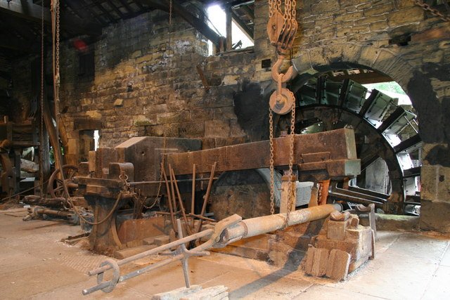

# Forge Hammer (Power Hammer)

> **Node ID**: machine-tools.forge-hammer
> **Domain**: [Machine Tools](./index.md)
> **Dependencies**: [`metals.iron-steel`](../metals/iron-steel.md), [`machine-tools.casting`](../metals/casting.md), [`machine-tools.machining`](machining.md)
> **Enables**: [`machine-tools.forming`](forming.md), [`metals.iron-steel`](../metals/iron-steel.md)
> **Timeline**: Years 10-20
> **Outputs**: forged_parts, billets, die_forgings
> **Critical**: No — hand sledges and strikers can substitute at lower throughput, but power hammers multiply productive output by 5-10× and enable closed-die forging

## Overview

> *Belly helve hammer, Wortley Top Forge Water powered forging hammer.*

> *Image: Chris Allen, CC BY-SA 2.0*

A power hammer lifts a heavy ram (tup) and releases it to strike the workpiece on an anvil, delivering repeated blows at 5-300 strikes per minute depending on the mechanism. The mechanized blow replaces the two-person striker team (smith + sledge man), multiplying both the force and consistency of hand forging. The ram is raised by one of several mechanisms — a cam and spring (helve hammer), a crank and leaf spring (spring helve), or compressed air/steam (air hammer) — and falls by gravity. The impact energy (E = m × g × h) determines the working capacity: a 25 kg ram falling 300 mm delivers 73 J per blow.

Power hammers are the bridge between hand forging and industrial-scale metal shaping. A single operator with a 25 kg spring helve hammer can produce in one hour what a smith and striker team produce in a full day. The consistency of machine-guided blows enables closed-die forging — placing hot metal in a shaped die cavity and hammering it to fill the die precisely — which produces interchangeable parts with 0.5-2 mm dimensional tolerance. Without power hammers, the [iterative bootstrap](iterative-bootstrap.md) slows dramatically: every crankshaft, connecting rod, gear blank, and tool steel billet must be shaped by hand, a process that is slow, inconsistent, and limited to small cross-sections.

This article covers construction of the three main power hammer types in bootstrap order: helve hammer (simplest, water-powered), spring helve hammer (intermediate, crank-driven), and notes on air/steam hammers (advanced). For forging operations (heating, drawing, upsetting, punching, bending) using the hammer, see [Forming](forming.md).

The hammer works by converting rotational energy into impact energy. The crankshaft (150-300 RPM) deflects a leaf spring, storing elastic energy. When the crank passes top dead center, the spring snaps back, driving the ram downward onto the workpiece. The blow energy depends on ram mass and effective stroke height. A 25 kg ram at 100 mm effective stroke delivers 25 J per blow at 200 BPM — enough to forge mild steel up to 30 mm square in a single heat. Heavier rams (40-100 kg) at longer strokes produce proportionally more energy, enabling larger cross-sections and denser die-filling.

The [anvil](anvil.md) block in a power hammer serves the same function as a hand forging anvil — a massive, rigid surface that absorbs and returns impact energy. The anvil block mass must be 10-15× the ram mass. A 25 kg hammer requires a 250+ kg anvil block, typically cast iron set in a timber or concrete foundation.

## Prerequisites

- [Casting capability](../metals/casting.md) — for anvil block, flywheel, hammer head, and frame components
- [Machining capability](machining.md) — for crankshaft, bearings, ram alignment surfaces, and die faces
- [Iron and steel supply](../metals/iron-steel.md) — for ram, crankshaft, leaf spring, and fasteners
- [Power source](../energy/index.md) — water wheel (3-5 HP), line shaft, or electric motor for sustained operation
- [Belt drive or line shaft](iterative-bootstrap.md) — for power transmission from source to crankshaft
- [Refractory materials](../ceramics/index.md) — for the forge hearth that heats workpieces before hammering

## Bill of Materials

### Spring Helve Hammer (Primary Build — 25-40 kg Ram)

| Material | Quantity | Specifications | Source | Alternatives |
|----------|----------|----------------|--------|-------------|
| Hardwood timber (frame) | 0.2 m³ | Oak or ash, 150 × 150 mm posts, 2.5 m tall | [Foundations](../foundations/tools-basic.md) | Welded steel frame (requires more fabrication) |
| Cast iron (anvil block) | 100-200 kg | Gray cast iron, 200 × 200 × 300 mm minimum | [Casting](../metals/casting.md) | Steel block (less vibration damping) |
| Steel (ram/tup) | 25-40 kg | Medium-carbon steel (0.4-0.5% C), hardened face | [Iron & Steel](../metals/iron-steel.md) | Cast iron ram (acceptable for light work) |
| Leaf spring | 1 | Vehicle leaf spring, 1.0-1.5 m long, 50 mm wide | [Iron & Steel](../metals/iron-steel.md) | Laminated spring (forge-welded leaves) |
| Crankshaft | 1 | Forged steel, 50-100 mm throw | [Machining](machining.md) | Eccentric sheave on shaft |
| Flywheel | 1 | Cast iron, 300-400 mm diameter, 20-30 kg | [Casting](../metals/casting.md) | Weighted disk on crankshaft |
| Bronze bushings | 4-6 | Matched to shaft diameter, wall thickness 5-10 mm | [Casting](../metals/casting.md) | Greased bores in hardwood blocks (short life) |
| Belt or chain drive | 1 | Leather belt or roller chain, for power input | [Animals](../animals/animal-materials.md) | Direct drive from water wheel shaft |
| Bolts and fasteners | 30-50 | M12-M16 steel bolts, nuts, washers | [Iron & Steel](../metals/iron-steel.md) | Through-bolts with cotter pins |

### Helve Hammer (Simplest Build — Water-Powered)

| Material | Quantity | Specifications | Source | Alternatives |
|----------|----------|----------------|--------|-------------|
| Hardwood beam (helve) | 1 | 3-4 m long, 150 × 150 mm oak | [Foundations](../foundations/tools-basic.md) | Steel I-beam (more rigid) |
| Stone or cast iron (anvil) | 100-200 kg | Flat-top boulder or cast block, 200 × 200 mm face | [Foundations](../foundations/tools-basic.md) | Welded steel anvil block |
| Cam | 1 | Wood or cast iron, 100-150 mm lift, mounted on water-wheel shaft | [Casting](../metals/casting.md) | Crank and connecting rod |
| Hammer head | 1 | 15-50 kg cast iron or steel, bolted to helve end | [Iron & Steel](../metals/iron-steel.md) | — |
| Pivot pin | 1 | 30-40 mm steel rod, 300 mm long | [Iron & Steel](../metals/iron-steel.md) | Hardwood dowel (wear-limited) |

## Process Description

### Frame Construction (Spring Helve Hammer)

1. **Lay out the foundation**: Mark a rectangular area 1.2 m wide × 1.8 m deep on compacted earth or a concrete pad. Excavate 200 mm deep for the timber sill. Bed the sill (200 × 200 mm oak beam, 1.8 m long) in compacted gravel for drainage and vibration damping.
2. **Erect the four posts**: Cut four oak or ash posts to 2.5 m length, 150 × 150 mm section. Stand them vertically at the corners of a 1.0 m × 1.5 m rectangle on the sill. Notch the post bottoms into the sill (50 mm mortise) and bolt through with M16 bolts. The two rear posts support the spring pivot; the two front posts frame the anvil area.
3. **Install cross-bracing**: Bolt horizontal cross-timbers between the posts at 500 mm and 1500 mm above the sill. Add diagonal braces from each post base to the midpoint of the adjacent cross-member. Frame flex absorbs blow energy — the bracing must eliminate any perceptible sway when the hammer operates. Test by pushing the frame laterally at spring height: deflection should be <5 mm under 50 kg lateral force.
4. **Attach the spring mounting plate**: Weld or bolt a 10 mm steel plate (200 × 300 mm) across the tops of the two rear posts. Drill four M16 bolt holes for the leaf spring pivot bolt and the adjustable stop bolt.

### Anvil Block Installation

5. **Prepare the anvil foundation**: Dig a pit 400 mm deep × 400 mm square in the center of the frame floor. Fill the bottom 200 mm with compacted gravel. Place the 100-200 kg cast iron anvil block on the gravel. The anvil mass must be 10-15× the ram mass to absorb blows without bouncing. A 25 kg ram requires a 250+ kg anvil; a 40 kg ram requires 400+ kg.
6. **Set the anvil height**: The anvil face must be 700-800 mm above floor level — this places the workpiece at a comfortable height for the standing operator. Adjust by adding or removing gravel under the anvil block. Check with a spirit level: the face must be level within 0.5 mm across its width.
7. **Lock the anvil in place**: Pack the remaining pit space around the anvil with sand and gravel. Wedge hardwood shims between the anvil and the surrounding earth. The anvil must not walk or rotate under repeated blows.

### Spring and Ram Assembly

8. **Mount the leaf spring**: Bolt one end of the leaf spring (1.0-1.5 m long vehicle spring) to the rear mounting plate using M16 bolts through the spring's center bolt hole. The spring extends forward over the anvil at approximately 15-20° above horizontal at rest. The spring rate determines the hammer's characteristics: too stiff and the crank cannot deflect it enough; too soft and the blow is weak. A standard truck leaf spring (50 mm wide, 8-12 mm thick, multi-leaf) provides the right stiffness for a 25-40 kg ram.
9. **Fabricate the ram (tup)**: Forge or machine a 25-40 kg steel block, 80-100 mm wide × 120-150 mm long × 150-200 mm tall. The bottom face (striking surface) must be flat within 0.1 mm over its full area. If using medium-carbon steel (0.4-0.5% C), harden the face: heat to 820-850°C (cherry red), oil quench, temper at 350-400°C for 1 hour to achieve 45-50 HRC. Do NOT harden the entire ram — only the face — or the body may crack from impact stress.
10. **Attach the ram to the spring**: Clamp or bolt the ram to the free end of the leaf spring, directly above the anvil face. Use a U-bolt or through-bolt with steel reinforcing plates on both sides of the spring. The ram must hang with its face parallel to the anvil face — check with a straightedge and adjust with shims.
11. **Set the rest gap**: At rest (spring undeflected), the ram face should be 20-40 mm above the anvil face. This gap allows the operator to position workpieces between blows. Adjust by tilting the spring pivot or adding/removing shims at the pivot bolt.

### Crank Assembly and Drive

12. **Machine the crankshaft**: Turn a crankshaft from forged steel bar. The crank throw (50-100 mm) determines the stroke: a 75 mm throw lifts the spring 75 mm at the engagement point, producing a 50-100 mm effective ram stroke. The shaft diameter at the journals should be 40-50 mm. The crank pin diameter: 30-40 mm.
13. **Mount the crankshaft in bearings**: Install bronze bushings (5-10 mm wall) in bearing housings bolted to the frame cross-members. The crankshaft sits at a height where the crank pin contacts the underside of the leaf spring at its midpoint (halfway between the pivot and the ram). Lubricate bearings with grease before each use.
14. **Attach the flywheel**: Mount a cast iron flywheel (300-400 mm diameter, 20-30 kg) on one end of the crankshaft. The flywheel stores energy between blows and smooths the cyclic loading. Key the flywheel to the shaft with a steel key (6 × 6 mm).
15. **Connect the power source**: Mount a belt pulley (150-200 mm diameter) on the other end of the crankshaft. Connect to the line shaft, water wheel, or motor via leather belt or roller chain. The crankshaft should turn at 150-300 RPM (producing 150-300 blows per minute). Belt speed: 5-10 m/s. For a hand-cranked version, mount a 400-500 mm crank handle on the flywheel extension — one person can crank a 25 kg hammer for short sessions.

### Helve Hammer Assembly (Water-Powered Alternative)

16. **Prepare the helve beam**: Select a straight oak or ash beam, 3-4 m long, 150 × 150 mm section. Bolt the hammer head (15-50 kg) to one end using two M20 through-bolts with square washers. The opposite (tail) end is lifted by the cam.
17. **Install the pivot (fulcrum)**: Mount a 35 mm steel pivot pin through the beam at a point 1/3 to 1/2 of the way from the hammer end. Support the pin in notched hardwood posts or a steel fork bolted to the timber frame. The pivot location controls the mechanical advantage: closer to the hammer end = heavier but slower blows; closer to the tail = lighter but faster blows.
18. **Mount the cam on the water-wheel shaft**: Fabricate a cam (wood or cast iron) with 100-150 mm lift and mount it on the water-wheel shaft. The cam lifts the tail of the helve beam once per revolution. As the cam rotates past, the beam falls by gravity and the hammer strikes the anvil.
19. **Set the stroke and blow rate**: The blow rate equals the water-wheel RPM (typically 5-20 RPM for an overshot wheel). Adjust the cam lift to control the stroke height (30-60 cm). Add a second cam 180° opposite for 10-40 blows per minute. The long helve arm (3-4 m) multiplies the fall distance at the hammer end, producing very heavy blows from modest cam lift.

**Strengths**:
- Simplest mechanism — a cam on a water-wheel shaft lifts the beam tail; gravity does the rest, no crankshaft or leaf spring needed
- Very heavy blows (100-300 J) from the long lever arm — handles larger billets (up to 50 mm square) than the spring helve
- Runs on water power alone — no electric motor, no fuel, minimal maintenance beyond greasing the pivot

**Weaknesses**:
- Very slow blow rate (5-20 BPM) — the water wheel limits cycle speed, reducing throughput for small parts
- Requires a water wheel with 3-5 HP output — not feasible without a suitable stream or river
- Large footprint — the 3-4 m helve beam demands a tall, wide frame and dedicated building space

### Calibration

20. **Blow force verification**: Place a 20 mm thick soft copper bar on the anvil. Strike one blow at full stroke. Measure the indentation depth and diameter with calipers. A 25 kg ram at 300 mm stroke should produce a 3-5 mm deep impression in 20 mm copper. Calculate approximate force: F ≈ (indentation area) × (copper hardness, ~50 HV). Adjust the crank throw or spring tension to achieve the target.
21. **Alignment check**: Ink a flat steel plate with a thin, even coat of machinist's dye (Prussian blue or soot-and-oil). Place it on the anvil and strike one blow. The impression should be uniform across the full ram face — if one side is deeper, the ram is not parallel to the anvil. Adjust the spring mounting shims.
22. **Run-in test**: Operate the hammer at full speed for 30 minutes. Monitor: (a) crankshaft bearing temperature — must not exceed 60°C (too hot to hold = bearing failure imminent); (b) frame bolt tightness — re-torque all bolts after run-in; (c) spring condition — inspect for cracks at the clamp points; (d) vibration — the frame should not walk across the floor (if it does, add anchor bolts through the sill into the floor).

**Expected performance**: Spring helve: 150-300 BPM, 70-120 J per blow, capable of forging mild steel up to 30 mm square. Helve (water): 5-20 BPM, 100-300 J per blow, capable of forging mild steel up to 50 mm square. Both operate continuously as long as the power source runs.

**Strengths (Spring Helve)**:
- Fast blow rate (150-300 BPM) — high throughput for small-to-medium forgings, matching hand-hammer cadence
- Compact footprint (1.2 × 1.8 m frame) fits in a small forge shop without dedicated building space
- Salvaged vehicle leaf spring provides the spring element — no custom spring manufacturing needed

**Weaknesses (Spring Helve)**:
- Leaf spring fatigue limits service life — a salvaged spring may fail after 6-12 months of daily use
- Blow energy limited to 70-120 J — insufficient for billets larger than 30 mm square in mild steel
- Requires a crankshaft and precision bearings — more complex machining than the helve hammer's simple cam

## Quantitative Parameters

| Parameter | Spring Helve | Helve (Water) | Air/Steam Hammer |
|-----------|-------------|---------------|------------------|
| Ram weight | 25-40 kg | 15-50 kg | 50-5000 kg |
| Blow energy | 70-120 J | 100-300 J | 500-50,000 J |
| Blows per minute | 150-300 | 5-20 | 60-200 |
| Stroke length | 50-150 mm | 300-600 mm | 300-1200 mm |
| Maximum billet section (mild steel) | 30 mm square | 50 mm square | 300 mm square |
| Anvil-to-ram mass ratio | 10:1 to 15:1 | 8:1 to 12:1 | 15:1 to 20:1 |
| Power required | 1-3 HP (0.75-2.2 kW) | 3-5 HP (water wheel) | 10-50 HP (compressed air/steam) |
| Duty cycle | Continuous | Continuous | Continuous |

### Ram Impact Energy Calculation

| Ram Mass (kg) | Stroke (mm) | Impact Energy (J) | Impact Velocity (m/s) |
|---------------|-------------|-------------------|----------------------|
| 15 | 100 | 14.7 | 1.40 |
| 25 | 150 | 36.8 | 1.72 |
| 40 | 200 | 78.5 | 1.98 |
| 50 | 300 | 147 | 2.43 |
| 100 | 400 | 392 | 2.80 |

Formula: E = m × g × h, where g = 9.81 m/s². Impact velocity v = √(2gh).

### Closed-Die Forging Tolerances

| Feature | Spring Helve | Air Hammer |
|---------|-------------|------------|
| Length/width | ±0.5-2.0 mm | ±0.3-1.0 mm |
| Thickness | ±0.5-1.0 mm | ±0.3-0.5 mm |
| Draft angle | 3-7° | 3-5° |
| Corner radius | 1-3 mm | 0.5-2 mm |
| Flash thickness | 0.5-1.5 mm | 0.3-1.0 mm |
| Parting line offset | 0.5-1.0 mm | 0.2-0.5 mm |

## Scaling Notes

- A 25 kg spring helve hammer handles 80% of bootstrap forging needs: tool making, small crankshafts, connecting rods, gear blanks, and hardware. Start here.
- Scale to a 50-100 kg hammer when producing large crankshafts (>50 mm diameter), axles, or structural components. The spring helve design scales to about 100 kg ram weight before the leaf spring becomes impractically stiff.
- For forging above 100 kg ram weight, the helve hammer or air/steam hammer becomes necessary. The helve hammer scales to 200+ kg by increasing the beam section and hammer head mass. The cam-lift mechanism handles the large strokes.
- Air hammers (50-5000 kg) require compressed air at 5-7 bar or [steam](../energy/steam-power.md) at 6-10 bar. These are industrial-era machines — build them when the foundry can produce the large cast iron cylinders (200+ mm bore) and the power system can supply 10-50 HP continuously.
- Closed-die forging (producing interchangeable parts in shaped dies) requires 25+ kg ram weight and 100+ J per blow to fill the die cavity. A 25 kg spring helve is the minimum for closed-die work in aluminum and mild steel.
- Foundation requirements: A 25 kg hammer on a timber frame transmits significant vibration through the ground. Place the hammer on a separate foundation pad (concrete block on sand) isolated from nearby precision equipment. A shared foundation with a lathe causes chatter on the lathe.
- Production rate: A skilled operator with a 25 kg spring helve hammer produces 20-60 forged parts per hour (simple shapes like bolt heads, small brackets). Closed-die forgings require 3-10 blows per part. Open-die forging of bar stock proceeds at 1-2 kg of shaped metal per hour.

## Troubleshooting

| Problem | Probable Cause | Solution |
|---------|---------------|----------|
| Ram face hits anvil with no workpiece (die clash) | Mis-adjusted rest gap or worn spring | Adjust spring pivot to increase rest gap to 20-40 mm; replace fatigued spring |
| Uneven blows (heavy on one side) | Ram face not parallel to anvil | Re-shim ram attachment; check spring mounting bolts for uneven tightness |
| Bearings overheating (>60°C) | Insufficient lubrication; bearing misalignment; excessive crank speed | Re-grease bearings; realign bearing housings; reduce crankshaft RPM |
| Frame walks or vibrates excessively | Frame not anchored; sill not level; bolts loosened | Anchor sill to floor with stakes or bolts; level the sill; re-torque all bolts |
| Spring cracks at clamp point | Stress concentration from sharp clamp edges; metal fatigue | Radius the clamp edges (3-5 mm fillet); replace spring; distribute clamp force with wider plates |
| Hammer blows too light | Crank throw too small; spring too stiff; ram too light | Increase crank throw; use a thinner spring; add mass to ram |
| Hammer blows too heavy (damages workpieces) | Ram too heavy; stroke too long; working cold metal | Reduce ram mass or crank throw; ensure workpiece is at forging temperature (900-1100°C for steel) |
| Workpiece slides off anvil during blows | Anvil face worn concave; insufficient anvil mass | Re-surface anvil face flat; increase anvil mass to >10× ram mass |
| Belt slips on pulley | Insufficient belt tension; belt worn or glazed | Tighten belt; dress belt with rosin; replace worn belt |
| Excessive vibration transmitted to floor | Anvil not sufficiently isolated; frame bolts loose | Place rubber or hardwood pads under the anvil block; re-torque all frame bolts; add 50 mm sand layer under the sill |
| Workpiece bends instead of upsetting | Ram face too narrow; workpiece too tall for diameter | Use full-width ram face; limit upset height-to-diameter ratio to 2:1; heat the workpiece uniformly |

## Safety

- **Noise**: Power hammers produce impact noise exceeding 100 dB (peak 120-130 dB for helves). Prolonged exposure above 85 dB causes permanent hearing loss. Hearing protection is mandatory: earplugs rated NRR 25+ or earmuffs rated NRR 30+. Double-protection (plugs + muffs) recommended for extended sessions.
- **Pinch points (ram-to-anvil gap)**: The ram closes on the anvil with 70-300 J per blow — enough to amputate fingers or crush hands instantly. Never place hands between ram and anvil. Use 400-600 mm forging tongs to position and hold workpieces. Install a treadle-operated clutch or foot pedal so the operator controls when blows occur — the hammer should NOT cycle continuously without operator input.
- **Flying scale and sparks**: Hot forging produces oxide scale fragments that fly off under hammer blows at high velocity. Scale fragments can embed in skin and eyes. Safety glasses (ANSI Z87.1 impact rated) and a face shield are mandatory. Leather apron protects torso from burns. Foundry boots (steel toe, no synthetic uppers that melt) protect feet from dropped hot metal.
- **Spring failure**: A cracked leaf spring can fracture suddenly under cyclic loading, launching fragments or releasing the ram in an uncontrolled fall. Inspect the spring daily before operation: look for cracks, especially at the clamp points and the center bolt hole. Tap-test the spring — a clear ring indicates sound metal; a dull thud indicates a crack. Replace cracked springs immediately — do not attempt to weld-repair a cracked spring.
- **Frame failure**: Loose bolts allow the frame to rack and fail under repeated impact loading. Inspect and re-torque all frame bolts daily during the first week of operation, then weekly. Replace any bolt that has stretched or stripped.
- **Hot metal burns**: Workpieces at forging temperature (800-1100°C for steel) cause instant deep burns on contact. Dark metal at 500°C still causes serious burns — it may not glow but is dangerously hot. Use tongs, never bare hands. Mark hot metal with chalk or a tag to prevent accidental handling.

## Quality Control

1. **Ram face flatness**: Check ram face flatness weekly with a precision straightedge. Place the straightedge across the face in both directions — any gap >0.1 mm indicates wear or deformation. Re-surface by grinding or filing. A concave ram face produces workpieces with rounded edges; a convex face causes center-line contact and uneven deformation.
2. **Anvil face flatness**: Same check as ram face. The anvil face should be flat within 0.15 mm. Anvils develop a concave wear pattern in the center from repeated blows — re-surface by grinding when the depression exceeds 0.5 mm.
3. **Ram-to-anvil alignment**: Ink a flat steel plate with machinist's dye and place on the anvil. Strike one light blow. The impression should be uniform — if the contact pattern shows heavier contact on one side or one end, the ram is misaligned. Correct by adjusting the spring mounting.
4. **Blow energy verification**: Periodically (monthly or after any adjustment) repeat the copper bar indentation test described in Calibration. The indentation should be consistent blow-to-blow within ±10%. Inconsistent blows indicate a worn crank, loose pivot, or fatigued spring.
5. **Bearing temperature monitoring**: Check crankshaft bearing temperature by hand after each 30-minute operating session. Bearings should be warm but comfortable to hold (<50°C). If bearings are too hot to touch (>60°C), shut down and investigate before bearing seizure occurs.
6. **Die alignment check**: For closed-die forging, verify die halves align within 0.5 mm at the parting line. Misaligned dies produce parts with shifted flash and dimensional error. Use alignment dowels in the die set — inspect dowels for wear monthly.

## Variations and Alternatives

- **Helve hammer**: Beam pivoted at one end, hammer head at the other. Simplest mechanism — a cam on a water-wheel shaft lifts the tail, the beam falls by gravity. Stroke 30-60 cm, 5-20 BPM. The first mechanized forging tool, used from the 12th century onward. Best for heavy, slow blows on large sections. Build this first if a water wheel is available.
- **Tilt hammer**: Similar to a helve but the tail is lifted by multiple cams on the shaft, producing 80-200 BPM. More compact than a full helve. Used in early water-powered forges for nail-making and small hardware. Good intermediate step between hand forging and spring helve.
- **Spring helve hammer** (this article's primary build): Timber frame, 25-40 kg ram on a salvaged vehicle leaf spring. Crank-driven at 150-300 BPM. The best intermediate build — constructable with basic [machine tools](machining.md) and a salvaged spring. Handles 80% of bootstrap forging needs.
- **Pneumatic (air) hammer**: Compressed air at 5-7 bar alternately drives the ram up and down in a cylinder. Precise control of blow force via air pressure. Capacity 50-5000 kg. Requires an air compressor (3-10 kW) and precision cylinder boring. Industrial-era machine — build when the [foundry](foundry-equipment.md) can produce large cast iron cylinders and the [energy system](../energy/index.md) can supply continuous compressed air.
- **Steam hammer**: Steam at 6-10 bar drives the ram. The most powerful forging machines ever built (up to 125,000 kg ram). Requires [steam power](../energy/steam-power.md) infrastructure. Post-bootstrap technology for large-scale production.
- **Hydraulic press forging**: A [hydraulic press](hydraulic-press.md) can forge metal by slow squeezing rather than impact. Slower cycle time but more precise control over deformation. Does not replace a power hammer for high-volume forging but complements it for precision work.
- **Hand forging with strikers**: Two-person team (smith + striker with a sledge hammer). No machine construction required. Throughput is 1/5 to 1/10 of a power hammer. Viable for low-volume work or when no power source is available.
- Die material selection: Closed-die forging dies must withstand repeated impact at 900-1100°C. H13 tool steel (5% Cr, hot-work grade) is the standard, hardened to 44-52 HRC. Dies for short runs (<100 parts) can be made from medium-carbon steel (0.5% C) at lower cost but wear rapidly above 50 parts.
- Forging temperature by material: Mild steel: 900-1200°C (yellow-orange). Aluminum: 350-480°C (no visible color change — use temperature-indicating crayons or a pyrometer). Copper: 700-900°C (dull to cherry red). Brass: 600-800°C (dark red to cherry red). Never forge steel below 800°C (blue shortness range) — the metal cracks rather than deforms.
- Production rate estimates: Open-die (hand tools on flat die), 25 kg hammer: 10-30 parts/hour for simple shapes. Closed-die (shaped dies): 5-15 parts/hour. Continuous drawing (lengthening bar): 2-5 kg shaped metal per hour. These rates assume hot metal is continuously available from the forge.
- Power transmission: A 25 kg spring helve hammer at 200 BPM draws approximately 1.5 kW (2 HP) from its power source. A water wheel at 3-5 HP can drive a 25-40 kg hammer continuously. An electric motor at 2-3 kW is the modern equivalent. Belt speed for flat leather belts: 5-10 m/s. For V-belts: 10-20 m/s.
- Treadle control: The hammer should only strike when the operator activates a treadle (foot pedal) or two-hand control. Continuous cycling without operator control is a severe safety hazard — the operator cannot remove workpieces between blows. A treadle-activated clutch disengages the crank from the spring between blows, allowing the operator to reposition the workpiece before the next blow.
- Lubrication schedule: Grease all bearings before each use. Oil the pivot pin and spring clamp bolts weekly. Check crank pin and bearing for excessive play monthly — a loose crank produces inconsistent blows and accelerates bearing wear. Use lithium-complex grease rated to 150°C for crankshaft bearings that run hot during extended sessions.

## References

- [Forming](forming.md) — forging operations and procedures using the power hammer
- [Casting](../metals/casting.md) — casting the anvil block, flywheel, and hammer head
- [Machining](machining.md) — machining the crankshaft, bearings, and die faces
- [Iron & Steel](../metals/iron-steel.md) — steel for the ram, crankshaft, and spring; heat treatment of the ram face
- [Iterative Bootstrap](iterative-bootstrap.md) — machine tool construction sequence
- [Foundry Equipment](foundry-equipment.md) — crucibles and furnaces for melting cast components
- [Hydraulic Press](hydraulic-press.md) — alternative metal shaping by pressing instead of hammering

---
*Part of the [Bootciv Tech Tree](../../index.md) • [Machine Tools](./index.md) • [All Domains](../../index.md)*
