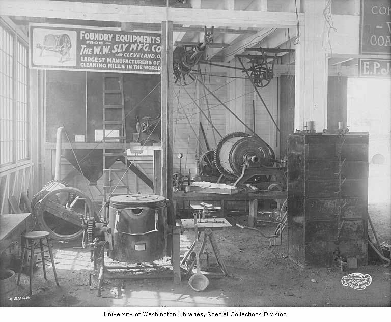

# Foundry Equipment

> **Node ID**: machine-tools.foundry-equipment
> **Domain**: [Machine Tools](./index.md)
> **Dependencies**: [`metals.iron-steel`](../metals/iron-steel.md), [`machine-tools.casting`](../metals/casting.md), [`ceramics`](../ceramics/index.md)
> **Enables**: [`machine-tools.iterative-bootstrap`](iterative-bootstrap.md), [`machine-tools.casting`](../metals/casting.md)
> **Timeline**: Years 5-15
> **Outputs**: crucibles, flasks, ladles, furnace_components
> **Critical**: Yes — foundry equipment is the prerequisite for all casting; without crucibles, furnaces, and molds, no complex metal parts can be produced

## Overview

> *Image: Frank H. Nowell, Public domain*

Foundry equipment melts metal, contains molten metal, and shapes it into castings. The three essential subsystems are: (1) the furnace and crucible that heat metal above its melting point, (2) the flask and mold that define the casting shape, and (3) the ladle and pouring equipment that transfer molten metal safely from furnace to mold. Each subsystem must withstand repeated thermal cycling between ambient temperature and 700-1500°C without cracking, deforming, or contaminating the melt.

Foundry equipment is the prerequisite for all metal casting. Without it, metal parts can only be shaped by forging (which requires a [forge hammer](forge-hammer.md)) or machining from solid stock (which wastes 20-80% of material as chips). Casting produces complex shapes — engine blocks, machine tool frames, gear blanks, pump housings — that would be impossible or impractical to forge or machine from solid. The [iterative bootstrap](iterative-bootstrap.md) sequence depends on castings at every stage: the first lathe bed, the first milling machine column, the first gear housing.

This article covers construction of the primary foundry equipment. For casting procedures (sand preparation, pattern making, mold making, pouring technique), see [Casting](../metals/casting.md).

## Prerequisites

- [Fireclay and refractory materials](../ceramics/index.md) — for furnace lining, crucibles, and ladle coatings
- [Charcoal or coke production](../energy/charcoal.md) — for furnace fuel
- [Iron and steel](../metals/iron-steel.md) — for furnace shells, flasks, and ladles
- [Bellows or blower](../energy/index.md) — for forced air to reach melting temperatures
- [Basic carpentry](../foundations/tools-basic.md) — for wooden flask construction

## Bill of Materials

### Crucible Furnace (Aluminum, Bronze)

| Material | Quantity | Specifications | Source | Alternatives |
|----------|----------|----------------|--------|-------------|
| Steel shell | 1 | 5 mm plate, 400 mm diameter × 500 mm tall | [Iron & Steel](../metals/iron-steel.md) | Repurposed steel drum (thinner wall) |
| Refractory lining | 20-40 kg | Fireclay + grog (crushed refractory), 50 mm wall | [Ceramics](../ceramics/index.md) | Commercial castable refractory |
| Clay-graphite crucible | 1 | 5-15 kg capacity, rated to 1400°C | [Ceramics](../ceramics/index.md) | Steel pipe with welded bottom (aluminum only, short life) |
| Charcoal | 50-100 kg | Lump charcoal, for fuel | [Energy](../energy/charcoal.md) | Coke (hotter, requires coking coal) |
| Blower | 1 | Electric blower or hand-cranked fan, 100-300 L/min | [Energy](../energy/index.md) | Bellows (lower airflow, intermittent) |
| Steel pipe (tuyere) | 1 | 25-40 mm diameter, 200 mm long | [Iron & Steel](../metals/iron-steel.md) | Clay pipe (fragile) |

### Cupola Furnace (Cast Iron)

| Material | Quantity | Specifications | Source | Alternatives |
|----------|----------|----------------|--------|-------------|
| Steel shell | 1 | 5-10 mm plate, 40-60 cm bore × 2-4 m tall | [Iron & Steel](../metals/iron-steel.md) | — |
| Fireclay refractory brick | 100-200 | 230 × 115 × 65 mm, rated to 1600°C | [Ceramics](../ceramics/index.md) | Rammed fireclay lining (less durable) |
| Tuyeres (air nozzles) | 2-4 | Steel pipe, 25-40 mm diameter | [Iron & Steel](../metals/iron-steel.md) | — |
| Blower | 1 | Forced air at 5-15 kPa, 5-20 m³/min | [Energy](../energy/index.md) | Multiple bellows in parallel |
| Tap hole plug | Several | Clay or refractory material | [Ceramics](../ceramics/index.md) | — |

### Flasks (Mold Containers)

| Material | Quantity | Specifications | Source | Alternatives |
|----------|----------|----------------|--------|-------------|
| Pine or hardwood boards | 0.1 m³ | 25 mm thick, for flask sides | [Foundations](../foundations/tools-basic.md) | Steel plate (heavier, more durable) |
| Steel flat bar (reinforcement) | 10-20 kg | 25 × 3 mm, for flask edges and handles | [Iron & Steel](../metals/iron-steel.md) | — |
| Locating pins | 8-16 | 8 mm steel rod, 30 mm long | [Iron & Steel](../metals/iron-steel.md) | Wooden dowels (wear quickly) |

### Ladles and Pouring Equipment

| Material | Quantity | Specifications | Source | Alternatives |
|----------|----------|----------------|--------|-------------|
| Steel pipe (ladle body) | 1 | 100-150 mm diameter × 150 mm deep, welded bottom | [Iron & Steel](../metals/iron-steel.md) | Clay crucible as ladle (fragile) |
| Steel rod (handle) | 1 | 20 mm diameter × 1.5 m long | [Iron & Steel](../metals/iron-steel.md) | — |
| Refractory wash | 2-5 kg | Fireclay slurry, for coating ladle interior | [Ceramics](../ceramics/index.md) | — |

## Process Description

### Crucible Furnace (Charcoal-Fired, for Aluminum and Bronze)

1. **Form the steel shell**: Roll 5 mm steel plate into a cylinder 400 mm diameter × 500 mm tall. Weld the longitudinal seam with full penetration. Cut a 200 mm hole in the bottom center for ash removal (with removable cover). Cut a 30 mm hole near the bottom side for the tuyere. Weld angle-iron legs raising the furnace 200 mm off the ground.
2. **Line the furnace with refractory**: Mix fireclay with 30% grog and water to stiff consistency. Apply 50 mm thick to inner wall and bottom. Form a depression in the bottom to cradle the crucible. Inside diameter after lining: 250-300 mm, leaving 25-50 mm gap between crucible and wall for the fuel bed.
3. **Install the tuyere**: Insert a 30 mm steel pipe through the side hole, angled 5-10° downward toward the center. Tuyere tip at crucible bottom level, directing blast air into the fuel bed. Seal pipe-to-shell joint with refractory.
4. **Dry and fire the lining**: Air dry 24-48 hours. Build a small wood fire inside, increase intensity over 4-6 hours to drive off moisture slowly (fast drying cracks the refractory). Let cool. Inspect for cracks — hairline cracks are normal and seal with fireclay wash on the next heat.
5. **Make or obtain a crucible**: Fire a clay-graphite crucible (40% clay, 40% graphite, 20% grog; form over a mandrel; fire to 1200°C). For aluminum only (max 800°C), use a steel pipe with welded bottom — it oxidizes but lasts 20-50 heats.
6. **Connect the blower**: Attach pipe or hose from blower to tuyere. Install a sliding damper in the air line to control blast intensity. Full blast for maximum temperature; reduced for holding.

**Calibration**: Fill crucible with aluminum scrap. Light furnace, turn on blower. Aluminum should melt within 20-40 minutes. If slower, check tuyere clearance and blower output. Target: 750-800°C for aluminum pouring. Inspect crucible before each use: tap with a wooden stick — clear ring = sound, dull thud = cracked (retire immediately).

**Expected performance**: Maximum temperature: 1200-1400°C. Aluminum capacity: 5-15 kg per heat. Fuel consumption: 2-4 kg charcoal per kg aluminum. Crucible life: 50-200 heats (clay-graphite), 20-50 heats (steel, aluminum only).

### Cupola Furnace (for Cast Iron)

7. **Form the shell**: Roll 5-10 mm steel plate into a cylinder 40-60 cm ID × 2-4 m tall. Weld longitudinal seam. Weld flat bottom plate with 40 mm tap hole at lowest point. Add slag notch slightly above tap hole on opposite side.
8. **Line with refractory brick**: Line interior with fireclay brick (65-115 mm thick) set in fireclay mortar. Lined bore: 30-50 cm. At tuyere level (20-30 cm above bottom), leave openings matching tuyere pipes.
9. **Install tuyeres and wind box**: Weld 2-4 tuyere pipes (25-40 mm) through shell into refractory at evenly spaced positions. Weld a sheet-metal wind box enclosing all tuyere inlets on the outside. Connect blower to wind box.
10. **Add the charging door**: Cut a 200 × 300 mm opening at 2/3 height. Fabricate a hinged steel door with refractory lining. This is where coke, iron, and limestone are charged in alternating layers.
11. **Add tap hole and slag notch**: The tap hole (40 mm at very bottom) is plugged with clay during operation and opened with a steel rod when iron is ready. The slag notch (slightly above tap hole) allows slag to overflow separately.

**Calibration**: Light a warm-up fire in the cupola. Charge layers of coke, iron scrap, and limestone (flux). Start the blower. First iron should tap in 30-60 minutes. Iron temperature at tap: 1350-1500°C. If temperature is low, increase coke ratio or blast volume.

**Expected performance**: Cast iron melting rate: 500-1500 kg/hour (40 cm bore). Coke consumption: 1 part coke to 8-10 parts iron. Campaign duration: 4-12 hours continuous. Refractory lining life: 10-30 campaigns.

### Flasks (Cope and Drag Pairs)

12. **Cut the flask sides**: For a medium flask (400 × 400 × 150 mm per half), cut four pieces of 25 mm pine board: two at 400 mm and two at 450 mm (allowing corner overlap).
13. **Assemble the flask halves**: Nail or screw boards into open-top, open-bottom boxes. Reinforce corners with steel flat bar (25 × 3 mm). The drag (bottom) and cope (top) are identical boxes.
14. **Install locating pins**: Drill two 8 mm holes through cope sides at diagonally opposite corners. Install 8 mm steel pins protruding 15 mm below cope bottom edge. Drill matching holes in drag top edge. Pins ensure cope aligns with drag — misalignment produces shifted castings.
15. **Add handles and cross-bars**: Screw steel flat bar handles to the outside of each half. Install a cross-bar inside the cope to support sand when filled and flipped.
16. **Seal the wood**: Paint or varnish interior to prevent moisture absorption from green sand, which causes warping. Shellac or linseed oil works. Make 5-10 pairs of various sizes (200 × 200 to 600 × 600 mm).

**Calibration**: Close flask halves with no sand. Check that pins seat smoothly and mating surfaces meet flush with no gap >0.5 mm. A gap allows metal to flash out during pouring.

**Expected performance**: Flask sizes: 200 × 200 to 600 × 600 mm. Pin alignment accuracy: ±0.5 mm. Wooden flask life: 200-500 pours with sealant maintenance.

### Ladles

17. **Make the ladle body**: Cut a 150 mm disc from 3 mm steel plate. Form into a shallow bowl (150 mm deep) by hammering over a hollow form. Alternatively, weld a 100-150 mm pipe section (150 mm tall) to a flat bottom plate. Weld a pouring spout into the rim.
18. **Attach the handle**: Weld a 20 mm steel rod (1.5 m long) to the ladle body at 90°. Add a cross-grip at the handle end for two-handed pouring control.
19. **Coat with refractory wash**: Coat interior with fireclay slurry. Dry slowly, then preheat before first use. Re-coat every 5-10 pours.

**Calibration**: Preheat ladle to 200-300°C before each pour. A cold ladle causes premature freezing. Preheat by holding over furnace exhaust or filling with a small amount of molten metal and discarding.

**Expected performance**: Ladle capacity: 1-5 kg aluminum or bronze. Handle length: 1.5 m (keeps hands 1 m+ from molten metal).

## Quantitative Parameters

### Crucible Furnace

| Parameter | Value |
|-----------|-------|
| Maximum temperature | 1200-1400°C (charcoal + forced air) |
| Aluminum capacity | 5-15 kg per heat |
| Bronze/copper capacity | 5-10 kg per heat |
| Melting time (5 kg aluminum) | 20-40 minutes |
| Fuel consumption | 2-4 kg charcoal per kg aluminum |
| Crucible life (clay-graphite) | 50-200 heats |
| Crucible life (steel, aluminum only) | 20-50 heats |

### Cupola Furnace

| Parameter | Value |
|-----------|-------|
| Maximum temperature | 1350-1500°C |
| Cast iron melting rate | 500-1500 kg/hour (40 cm bore) |
| Coke consumption | 1 part coke to 8-10 parts iron by weight |
| Campaign duration | 4-12 hours continuous |
| Refractory lining life | 10-30 campaigns (before re-lining) |

### Flasks

| Parameter | Value |
|-----------|-------|
| Flask sizes (typical set) | 200 × 200, 300 × 300, 400 × 400, 600 × 600 mm |
| Flask depth per half | 100-300 mm |
| Locating pin accuracy | ±0.5 mm alignment |
| Wooden flask life | 200-500 pours (with sealant) |
| Steel flask life | Thousands of pours |

## Scaling Notes

- A single crucible furnace with a 10 kg crucible handles most aluminum and bronze casting for machine tool construction. This is sufficient for producing gear blanks, bearing housings, pulleys, and small frame castings.
- Scale to a cupola furnace when cast iron production exceeds 100 kg/day. The cupola melts continuously, producing a steady stream of iron — unlike the batch crucible furnace.
- Induction furnaces (requiring [electricity](../energy/electricity.md) and copper coil winding) offer precise temperature control and clean melts. Build charcoal/cupola furnaces first; add induction when precision alloys are required.
- Multiple flask sizes allow casting a range of parts without wasting sand. A set of 5-10 flask pairs (200 × 200 to 600 × 600 mm) covers most bootstrap needs.
- For very large castings (machine tool beds, engine blocks), build a pit mold in the foundry floor rather than using a flask.

## Troubleshooting

| Problem | Probable Cause | Solution |
|---------|---------------|----------|
| Aluminum won't melt after 60 minutes | Blower insufficient; tuyere blocked; refractory wet | Check blower output (100-300 L/min); clear tuyere; re-fire refractory to remove moisture |
| Crucible cracks on first use | Crucible not properly fired; thermal shock too rapid | Fire clay-graphite crucibles to 1200°C before first use; heat slowly on first use |
| Cast iron too cold to pour (solidifies in ladle) | Cupola not hot enough; tap too early; ladle not preheated | Increase coke ratio; wait for bright white-hot iron at tap; preheat ladle to 300°C |
| Flask misalignment (shifted castings) | Locating pins worn or bent; sand expansion moved cope | Replace worn pins; ram sand uniformly; add weights on cope during pouring |
| Porosity in aluminum castings | Gas absorption from wet charge or dirty scrap; hydrogen | Pre-dry all charge material; use degassing flux; pour at correct temperature (720-760°C) |
| Ladle lining cracks | Thermal cycling; improper drying of refractory wash | Dry wash slowly; preheat ladle gradually; re-coat every 5-10 pours |

## Safety

- **Molten metal burns**: Aluminum at 700°C and cast iron at 1400°C cause instant deep burns. Full PPE: face shield (not safety glasses — face shield), leather apron, leather gauntlet gloves, foundry boots (steel toe, no synthetic materials). Never pour over wet ground — moisture causes steam explosions that launch molten metal. Clear all water, damp sand, and combustibles from a 2 m radius around the pouring area.
- **Zinc fume (brass/bronze)**: Zinc boils at 907°C. Melting brass above this temperature generates zinc oxide fume causing metal fume fever (flu-like symptoms 4-8 hours after exposure, lasting 24-48 hours). Ventilate when melting brass. Work outdoors or with forced extraction. Zinc oxide IDLH: 500 mg/m³.
- **Carbon monoxide**: Charcoal and coke furnaces produce CO (lethal at 0.1% in air for 1 hour, IDLH 1200 ppm). Work outdoors or with open doors and cross-ventilation. Never operate a foundry in an enclosed space without forced ventilation.
- **Crucible failure**: A cracked crucible can disintegrate during a pour, dumping 5-15 kg of molten metal. Inspect every crucible before each use. Tap test: clear ring = sound, dull thud = cracked and must be retired. Have a dry sand pit adjacent to the furnace for emergency disposal.
- **Molten metal and water**: Never allow water to contact molten metal. Water expands 1700× when it flashes to steam, producing an explosion that sprays molten metal in all directions. Pre-dry all tools, molds, and charge material. Never pour into a damp mold.

## Quality Control

1. **Metal temperature verification**: Use an optical pyrometer or immersion thermocouple to verify pouring temperature. Aluminum: 720-760°C. Bronze: 1050-1150°C. Cast iron: 1350-1450°C. Pouring too cold causes misruns (incomplete fill); pouring too hot causes gas porosity and penetration into sand.
2. **Crucible inspection**: Tap-test every crucible before each use. Discard any crucible with visible cracks, glaze spalling, or a dull thud on tapping. A crucible that fails during a pour is a life-threatening emergency.
3. **Flask alignment**: Close flask halves with no sand and check mating surfaces with a feeler gauge. Gap must be <0.5 mm. Worn locating pins produce shifted castings.
4. **Sand moisture test**: Squeeze a handful of tempered green sand. It should hold its shape when compressed and break cleanly when bent. If it crumbles, add water. If it sticks to hands, it is too wet (steam explosion risk during pouring).

## Variations and Alternatives

- **Crucible furnace vs. cupola furnace**: Crucible furnaces are batch-process (5-15 kg per heat), simple to build, and suitable for aluminum and bronze. Cupola furnaces are continuous-process (500+ kg/hour), require more infrastructure, and are designed for cast iron. Build a crucible furnace first; add a cupola when iron casting volume justifies it.
- **Gas-fired crucible furnace**: Propane or natural gas burners replace charcoal, providing cleaner heat and easier temperature control. Requires gas supply infrastructure. Build charcoal-fired first; convert to gas when available.
- **Induction furnace**: Copper coil carrying high-frequency AC current induces eddy currents in the metal charge, heating it directly. Precise temperature control, clean melts, no combustion gases. Requires 10-100 kW of electrical power at high frequency. Post-bootstrap technology.
- **Investment casting (lost wax)**: Produces castings with exceptional detail and surface finish by coating a wax pattern in ceramic, melting out the wax, and pouring metal into the ceramic shell. Suitable for turbine blades, jewelry, and precision components. Uses the same foundry equipment for melting and pouring. See [Casting](../metals/casting.md).
- **Die casting**: Forces molten metal into a steel die under high pressure. Produces accurate, smooth castings at high volume. Requires a [hydraulic press](hydraulic-press.md) and hardened steel dies. Post-bootstrap for production-scale parts.

## References

- [Casting](../metals/casting.md) — sand casting procedures, mold making, pattern design, and gating systems
- [Iron & Steel](../metals/iron-steel.md) — metal stock for casting and furnace construction
- [Ceramics](../ceramics/index.md) — refractory materials, crucibles, and fireclay
- [Charcoal Production](../energy/charcoal.md) — fuel for crucible and cupola furnaces
- [Iterative Bootstrap](iterative-bootstrap.md) — how castings become machine tools
- [Forge Hammer](forge-hammer.md) — alternative shaping by hot forging instead of casting
- [Hydraulic Press](hydraulic-press.md) — press construction using cast components

---
*Part of the [Bootciv Tech Tree](../index.md) • [Machine Tools](./index.md) • [All Domains](../index.md)*
