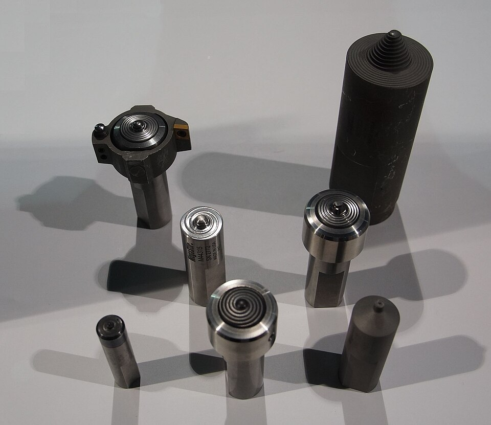

# Friction Stir Welding

> **Node ID**: machine-tools.joining.friction-stir
> **Domain**: [Machine-Tools](./index.md)
> **Dependencies**: See prerequisites
> **Enables**: [`Machining`](machining.md), [`Metal Joining`](joining.md)
> **Timeline**: Years 30-60
> **Outputs**: friction_stir_welds
> **Critical**: No

## Overview

> *Image: NearEMPTiness, CC BY-SA 4.0*

Solid-state joining via rotating tool (500-1500 RPM, 50-200 mm/min feed). Tool friction heats metal to plasticized state (70-90% of melting point) without melting. Joins unweldable aluminum alloys (2xxx, 7xxx series) and dissimilar metals (Al-to-steel, Al-to-Cu) without brittle intermetallics. Tool materials: H13 steel for aluminum, PCBN for steel.

The rotating pin tool generates friction heat at the shoulder-workpiece interface and along the pin profile. The plasticized material flows around the pin from the leading edge to the trailing edge, consolidating behind the tool to form the weld. The forging pressure applied by the tool shoulder prevents void formation and ensures intimate contact between the plasticized material and the workpiece surfaces.

Joint preparation for FSW is simpler than for fusion welding: no edge beveling, no filler wire, and no shielding gas. However, the workpieces must be rigidly clamped to resist the substantial lateral forces generated by the rotating tool, and a backing bar is required beneath the joint to support the downward forging force. The tool must plunge to full depth before traversing, creating a starting hole that is typically filled with a run-on tab.

The elimination of filler wire, shielding gas, and consumable electrodes makes FSW an economically attractive process for long production runs of aluminum structures, where the higher capital cost of the FSW machine is offset by lower per-weld consumable costs and the elimination of fume extraction requirements.

Primary outputs: `friction_stir_welds`.

Friction stir welding was invented in 1991 at The Welding Institute in the United Kingdom, representing one of the most significant developments in welding technology in the late 20th century. Its rapid adoption in aerospace and shipbuilding demonstrated the industry's need for a reliable method of joining the high-strength aluminum alloys used in modern lightweight structures.

The process offers environmental advantages over fusion welding: no welding fumes, no UV radiation, no shielding gas consumption, and no consumable electrodes. The only consumable is the tool pin and shoulder, which last for thousands of meters of weld in aluminum. These characteristics make FSW attractive for enclosed manufacturing environments where fume extraction would otherwise be required.

FSW produces welds with lower residual stress and distortion than arc welding because the peak temperature is lower and the thermal gradient is less severe. This reduces or eliminates the need for post-weld stress relief and straightening operations, which is particularly valuable for large panel structures where distortion control is a major manufacturing challenge.

The process produces no welding fumes, no UV radiation, and no spatter, making it suitable for enclosed manufacturing environments where fume extraction would otherwise be required. The absence of shielding gas consumption and filler wire reduces consumable costs and logistics complexity.

## Prerequisites

### Materials

- Aluminum plate or extrusion (2xxx, 5xxx, 6xxx, 7xxx series), copper, magnesium, or steel
- Tool steel (H13) or PCBN pin tools with shoulder geometry matched to material thickness
- Argon shielding gas for reactive metals (titanium, some steels)

### Equipment

- FSW machine with high-force spindle (hydraulic or ball-screw driven, capable of 20-50 kN downward force)
- Rigid clamping system and backing anvil (steel or cast iron)
- Purpose-built FSW machine or heavy-duty CNC milling machine modified for FSW

### Knowledge

- Thermomechanical processing and plastic flow behavior at temperatures below the melting point
- Tool wear mechanisms and replacement scheduling for different workpiece materials
- FSW parameter windows: the relationship between RPM, traverse speed, plunge depth, and weld quality
- Clamping force requirements and workpiece restraint design for the lateral forces generated during welding
- Interpretation of FSW-specific defects: tunnel voids, hook defects, joint line remnants

### Infrastructure

- Heavy-duty milling machine or purpose-built FSW machine with rigid frame (frame deflection causes tool misalignment)
- Rigid fixture table with clamping system rated for high lateral forces (5-20 kN per clamp)
- Backing anvil of hardened steel or cast iron, wider than the workpiece
- Tool grinding and measurement equipment for pin profile verification
- NDT equipment for post-weld inspection (ultrasonic phased array or radiography)

## Process Description

Friction stir welding uses a non-consumable rotating tool with a profiled pin and a broad shoulder. The pin plunges into the joint line between two abutting workpieces, friction-heating and plasticizing the surrounding metal. As the tool traverses along the joint, plasticized material flows around the pin from the advancing side to the retreating side, consolidating behind the tool under the forging pressure of the shoulder. The weld is formed entirely in the solid state: no melting occurs at any point.

### Step-by-Step Procedure

1. Prepare the joint faces by cleaning with acetone or alcohol. Remove all oil, oxide scale, and anodized coatings. FSW tolerates minor surface contamination better than fusion welding, but clean faces produce consistent welds.
2. Position the two workpieces in abutment on the backing anvil. Clamp rigidly with fixtures every 100-200 mm along the joint length. Verify that the joint line is straight and the sheets are flush at the surface. Any misalignment translates directly into weld root defect.
3. Set tool RPM and traverse speed per the welding procedure specification. For 6mm aluminum: 1000-1500 RPM, 200-400 mm/min. Tool tilt angle typically 1-3° trailing.
4. Plunge the rotating tool into the workpiece at the start position. The shoulder contacts the workpiece surface, generating friction heat. Dwell for 5-15 seconds to establish thermal equilibrium and achieve full penetration. Monitor spindle torque during plunge: a steady torque indicates proper heating.
5. Traverse the tool along the joint line at the programmed speed. Monitor spindle torque and downward force for deviations that indicate tool wear or parameter drift. The advancing side (tool rotation adds to travel direction) and retreating side experience different thermal and mechanical conditions.
6. At the weld end, either retract the tool (leaving an exit hole) or continue onto a run-off tab that is removed later. The exit hole is an inherent geometric feature of FSW.
7. Inspect the weld visually for surface quality: the weld crown should show concentric arc-shaped marks from the tool shoulder with no tunnel defects, excessive flash, or surface grooving.

### Process Parameters

| Parameter | Range | Notes |
|-----------|-------|-------|
| Tool Rotation | 200-2000 RPM | Higher RPM for harder materials; lower RPM for thick sections |
| Traverse Speed | 50-500 mm/min | Lower speed for deeper penetration and harder materials |
| Plunge Depth | Pin length + 0.1-0.3 mm shoulder penetration | Shoulder must forge the crown surface |
| Tool Tilt | 1-3° trailing | Improves shoulder contact and material consolidation |
| Downward Force | 5-50 kN | Depends on material, thickness, and tool design |

### Recommended Parameters by Material and Thickness

| Material | Thickness (mm) | RPM | Traverse (mm/min) | Downward Force (kN) | Tool Material |
|----------|---------------|-----|--------------------|--------------------|---------------|
| Al 6061-T6 | 3 | 1200-1800 | 400-800 | 5-10 | H13 steel |
| Al 6061-T6 | 6 | 800-1200 | 200-400 | 10-20 | H13 steel |
| Al 6061-T6 | 12 | 400-800 | 80-200 | 20-40 | H13 steel |
| Al 7075-T6 | 6 | 600-1000 | 150-300 | 15-25 | H13 steel |
| Al 5083-H321 | 6 | 800-1200 | 200-400 | 10-20 | H13 steel |
| Mild steel | 3 | 400-600 | 100-200 | 15-25 | PCBN or W-Re |
| Mild steel | 6 | 300-500 | 50-150 | 25-40 | PCBN or W-Re |
| Stainless 304 | 3 | 400-600 | 80-150 | 20-30 | PCBN |
| Copper C110 | 3 | 800-1200 | 200-400 | 8-15 | H13 steel |
| Ti-6Al-4V | 3 | 400-600 | 80-150 | 15-25 | W-Re alloy |

Tool life: H13 tools last thousands of meters in aluminum but only meters to tens of meters in steel and titanium. This cost differential is the primary reason FSW is widely adopted for aluminum but limited to niche applications for ferrous metals.

The advancing side of the FSW weld (where tool rotation adds to travel direction) typically experiences higher temperatures and more material flow than the retreating side. This asymmetry can produce slightly different microstructures on each side of the weld. For critical applications, weld procedure qualification includes mechanical testing of specimens taken from both sides of the weld centerline.

The thermal cycle experienced by the workpiece during FSW is significantly milder than during fusion welding. Peak temperatures reach 70-90% of the melting point but for a shorter duration, and the cooling rate is slower because the heat input is distributed over a larger volume. This results in less residual stress, less distortion, and a narrower heat-affected zone compared to MIG or TIG welding of the same material thickness.

## Safety Considerations

The FSW tool rotates at high speed under substantial downward force. The workpiece clamping system must resist several tons of lateral force generated during welding. Workpiece ejection from inadequate clamping causes serious injuries.

- **Rotating tool entanglement**: The pin tool presents an entanglement hazard similar to a large drill bit. Loose clothing, sleeves, or hair caught in the rotating tool pull the operator into the machine.
- **Burns**: The plasticized metal adjacent to the tool reaches 70-90% of melting point (350-500°C for aluminum). The workpiece surface near the weld track remains hot enough to burn for several minutes after the tool passes.
- **Workpiece ejection**: Lateral forces during welding can eject inadequately clamped workpieces across the shop floor. All clamping must be verified before tool plunge. The clamping force must exceed the lateral force generated by the rotating tool, which can reach 5-20 kN.
- **Sparks and hot particles**: The tool sheds fine metallic particles during welding, particularly when welding harder alloys or when the tool is worn. These particles are hot and can cause eye injuries. The advancing side of the weld generates more particle ejection than the retreating side.

### Personal Protective Equipment

- Safety glasses with side shields at all times; face shield during tool plunge and retract
- Close-fitting clothing with no loose sleeves; no gloves near the rotating spindle
- Heat-resistant gloves when handling welded workpieces after cooling for 2+ minutes
- Hearing protection: the FSW process generates high noise levels from the rotating spindle and material deformation
- Steel-toe boots for handling heavy workpieces and clamping fixtures

### Emergency Procedures

- Post workpiece clamping verification checklist at the machine station; all clamps must be torqued before each weld
- Maintain emergency stop access clear of obstructions at all times; e-stop must be reachable from the operator position
- Keep burn kit near the machine for contact burns from hot workpieces
- Train all operators on proper response to tool breakage during welding: hit e-stop, do not attempt to restrain the workpiece
- Establish exclusion zone around the machine during welding operations to protect bystanders from ejected hot particles
- Verify that the backing anvil is securely bolted to the machine table before each weld run; the anvil must not shift under forging load
- Inspect spindle bearings for unusual noise or vibration before each shift; bearing failure during welding damages the tool and workpiece

## Quality Control

### Acceptance Criteria

- **Friction Stir Welds**: No tunnel defects, voids, or joint line remnants visible on cross-section. Tensile strength at least 70-80% of parent metal for heat-treatable aluminum alloys. Bend testing per AWS D17.3 with no cracking. Surface flash height within specification.

### Testing Methods

- Ultrasonic phased-array inspection of weld cross-section for internal voids and tunnel defects
- Bend testing of samples per AWS D17.3 specification (root bend and face bend)
- Radiographic examination for internal voids in thick-section welds
- Cross-section metallography: section, polish, and etch weld samples for microstructure examination and defect identification
- Visual inspection of weld crown for surface defects, flash, and tool shoulder marking pattern

### Sampling Protocol

- Section and etch weld samples from each new parameter setup to verify microstructure before production
- Document tool condition and replacement intervals for traceability
- Ultrasonically inspect 100% of critical structural welds; sample non-critical welds per statistical plan
- Perform bend testing on 2 specimens per meter of weld length for procedure qualification
- Record spindle torque and downward force data for each weld; deviations from baseline signal developing problems

## Scaling Notes

- **Bench scale**: Modified CNC milling machine with FSW tooling. Short welds (under 500 mm) in aluminum up to 6 mm thickness. Manual clamping. Suitable for process development and small component fabrication.
- **Pilot scale**: Purpose-built FSW machine with 1-3 meter weld length capability. Hydraulic clamping system. Welds aluminum up to 12 mm and steel up to 6 mm. Tool change stations for rapid setup.
- **Production scale**: Gantry-type FSW machine with weld lengths exceeding 10 meters. Automated clamping and tool changing. Multiple tool stations for different joint configurations. Used in ship panel and aerospace skin production.

Scaling from bench to production FSW requires solving the clamping challenge at larger scales. A 10-meter weld generates lateral forces that require heavy-duty clamping fixtures every 200-300 mm along the joint. The backing anvil must be flat and rigid over the full weld length. For ship panel production, vacuum clamping systems hold the plates in position on a flat steel bed while the gantry-mounted FSW head traverses the joint. Process monitoring through spindle torque and downward force measurement provides real-time quality data that scales naturally from bench to production.

Tool wear and life are the dominant cost factors for FSW of steel and titanium. PCBN and tungsten-rhenium tools are expensive and wear gradually during steel welding, limiting weld length per tool. For aluminum welding, H13 tool steel tools last for thousands of meters of weld, making tool cost per joint negligible.

The exit hole left when the tool retracts at the end of the weld is an inherent geometric limitation. Strategies to address it include run-off tabs that are removed after welding, retracting the tool while filling the cavity with additional material, or terminating the weld in a non-critical region.

## Troubleshooting

| Problem | Probable Cause | Solution |
|---------|---------------|----------|
| Tunnel defect (internal void) | Insufficient plunge depth or too-fast traverse | Increase tool plunge depth by 0.1-0.2 mm; reduce traverse speed by 20-30%; verify backing support rigidity |
| Surface galling / excessive flash | Excessive tool shoulder friction or high RPM | Reduce RPM by 15-20%; verify tool shoulder condition; adjust tilt angle to 2-3° trailing |
| Joint line remnant (kissing bond) | Insufficient material flow around pin | Increase tool rotation speed by 10-20%; decrease traverse speed; check pin profile for wear beyond 0.2 mm |
| Wormhole defect | Too much heat input, material flowing away from pin | Reduce RPM by 20%; increase traverse speed by 15-25%; check shoulder concavity is 2-5° |
| Tool pin breakage | Excessive lateral force or hard spot in material | Reduce traverse speed by 25%; pre-inspect material for hard inclusions; reduce pin length-to-diameter ratio to below 3:1 |
| Lack of penetration at root | Pin too short for material thickness | Use longer pin tool; verify plunge depth setting; check backing anvil flatness (must be within 0.1 mm over joint length) |
| Surface groove along weld center | Tool shoulder not fully contacting the crown | Increase downward force by 2-5 kN; verify shoulder diameter is 2.5-3× pin diameter; check for tool tilt error |
| Cavity at weld end (exit hole) | Tool retracts before material consolidates | Use run-off tab extending 20-30 mm beyond the structural joint; accept exit hole in non-critical tab area |
| Hook defect (in lap joints) | Upward bending of sheet interface on advancing side | Reduce plunge depth; use bobbin tool for lap joints; orient joint so hook deflects away from loading direction |
| Inconsistent weld strength along length | Tool wear during long welds (steel/titanium) | Replace tool per schedule (measure wear after each weld in steel); monitor spindle torque for drift; rotate to fresh tool position |

## Variations and Alternatives

- **Bobbin tool FSW**: Rotating pin with shoulders on both top and bottom of the workpiece. Eliminates the need for a backing bar and enables welding of hollow extrusions and closed profiles from outside. Extends FSW capability to structures inaccessible to conventional single-shoulder tooling.
- **FSW of steel and titanium**: Requires PCBN or tungsten-rhenium tool materials that can withstand the higher temperatures needed to plasticize these metals. Tool life remains limited (meters to tens of meters per tool), making it expensive but valuable for critical solid-state joints.
- **Friction stir processing**: Uses the same FSW tool to refine microstructure in castings or surface alloys without joining. Improves fatigue life and ductility of cast aluminum components by breaking up porosity and coarse second-phase particles.

FSW has become the preferred joining method for aluminum structures in aerospace, marine, and automotive applications where the high-strength aluminum alloys (2xxx and 7xxx series) cannot be reliably fusion welded. The solid-state process avoids hot cracking, porosity, and the severe loss of mechanical properties that occurs in the heat-affected zone of fusion welds in these alloys.

FSW of steel and titanium is an active area of development. The higher temperatures required to plasticize these metals demand more durable tool materials. Polycrystalline cubic boron nitride (PCBN) and tungsten-rhenium alloys are used for steel welding, but tool life remains limited. As tool materials and process understanding improve, FSW is expected to find increasing application in steel construction, pipeline welding, and titanium aerospace structures.

The process can be performed on overlapping lap joints as well as butt joints, expanding its applicability to structures where one sheet overlays another, such as aircraft skin-to-stringer connections and ship deck panel joints. Refrigerant cooling of the FSW tool shoulder extends tool life when welding higher-melting-point alloys by reducing the thermal cycling stress on the tool material.

FSW can also be applied to additive manufacturing, where successive layers of metal are friction-stir deposited to build three-dimensional structures with wrought-equivalent mechanical properties. This additive approach avoids the porosity and anisotropy common in powder-bed additive processes and can build large structures using relatively simple equipment compared to laser powder-bed systems.

Bobbin tool FSW is a variant that uses a rotating pin with shoulders on both the top and bottom of the workpiece, eliminating the need for a backing bar and enabling welding of hollow extrusions and closed profiles from outside. This extends FSW capability to structures that would otherwise be inaccessible to conventional single-shoulder FSW tooling.

## References

- [Metal Joining](joining.md) — parent capability
- [Machine-Tools Domain](./index.md) — domain overview and related capabilities
- [Machining](machining.md) — downstream capability
- [Metal Joining](joining.md) — downstream capability

### Material Handling

- Clean joint faces with acetone or alcohol immediately before clamping; remove all oils and oxides from the abutting surfaces
- Inspect FSW tool pin profile for wear or cracking before each production shift; a worn pin produces tunnel defects
- Clamp workpieces with verified fixture torque before each weld; lateral force during welding can shift inadequately clamped parts
- Store tool steel and PCBN pin tools in protective cases; chipped pin edges produce surface defects
- Allow welded workpieces to cool below 100°C before handling without heat-resistant gloves
- Record tool condition (run count, visual inspection notes) in a log to track tool life and predict replacement needs
- Retain weld process data (RPM, traverse speed, spindle torque, downward force) for traceability in structural applications
- Inspect pin tool thread profile under magnification after each production shift; progressive wear changes the material flow pattern
- Lubricate the FSW machine spindle bearings per the manufacturer's schedule; bearing failure during welding damages the tool and workpiece
- Record weld parameters and tool condition data for each production lot for traceability
- Maintain backing anvil surface flatness; a dented or worn anvil produces inconsistent weld root quality
- Retain cross-section samples from each new parameter setup as reference standards for future production

---
*Part of the [Bootciv Tech Tree](../index.md) · [Machine-Tools](./index.md) · [All Domains](../index.md)*
