# Machine Tools Bootstrap

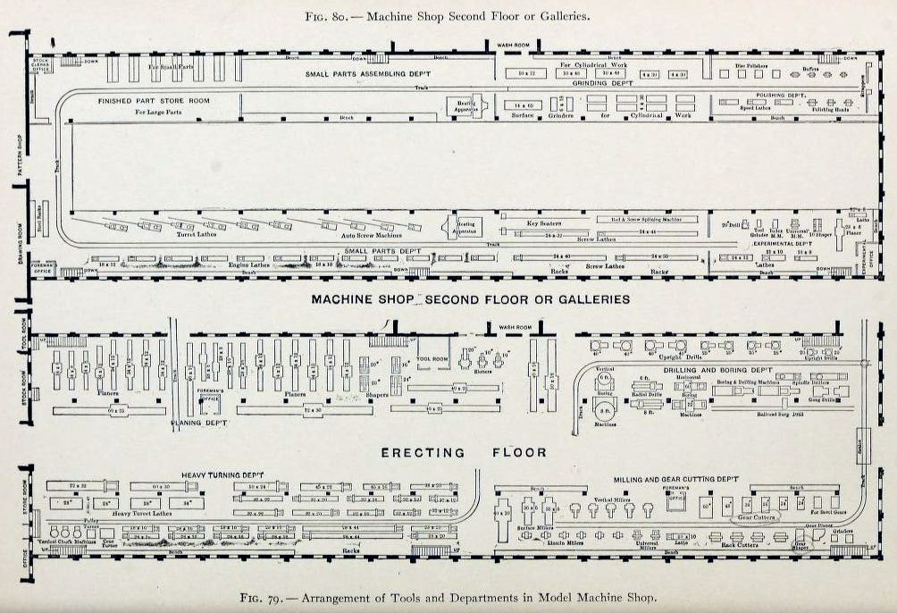
> *Image: Oscar E. Perrigo, Public domain*

> *Machine Shop Arrangement of Tools and Departments, 1906*

> *Image: Oscar E. Perrigo, Public domain*

Capabilities in this domain:

> *Image: Lucasbosch, CC BY-SA 3.0*

- [Bearings, Abrasives & Cutting Tools](bearings-abrasives.md) — Overview: plain bearings, rolling element bearings, natural and synthetic abrasives, cutting tool materials, and thread cutting.

> *Image: Jonasz at Polish Wikipedia, CC BY-SA 3.0*

- [Bearings](bearings.md) — Plain journal bearings (babbitt metal), rolling element ball bearings (52100 steel), bearing selection guide, and bearing lubricants.

> *Image: Pittigrilli, CC BY-SA 4.0*

- [Abrasives & Cutting Tools](abrasives.md) — Natural abrasives (emery, sandstone) and synthetic abrasives (SiC, Al₂O₃ from electric arc furnace), grinding wheel construction, lapping, honing, thread cutting, tap and die production, and cutting tool materials (carbon steel, HSS).
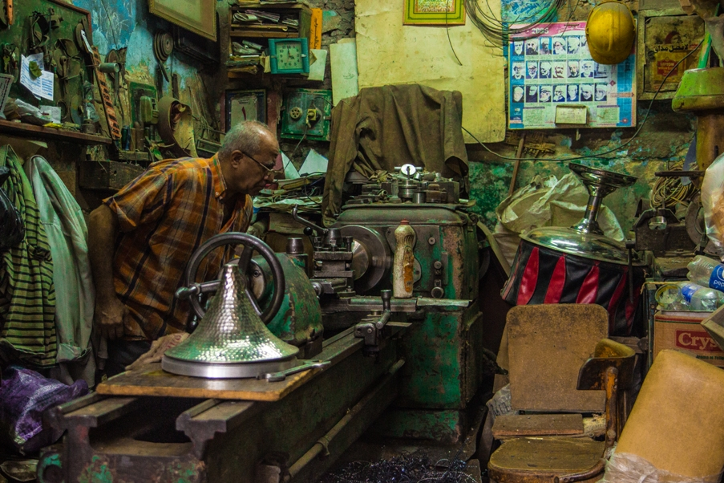
> *Image: Mahmoud Hamed ismailia, CC BY-SA 4.0*

- [Metal Forming](forming.md) — Forge work, hammer forming, rolling, and drawing of metals into shapes.
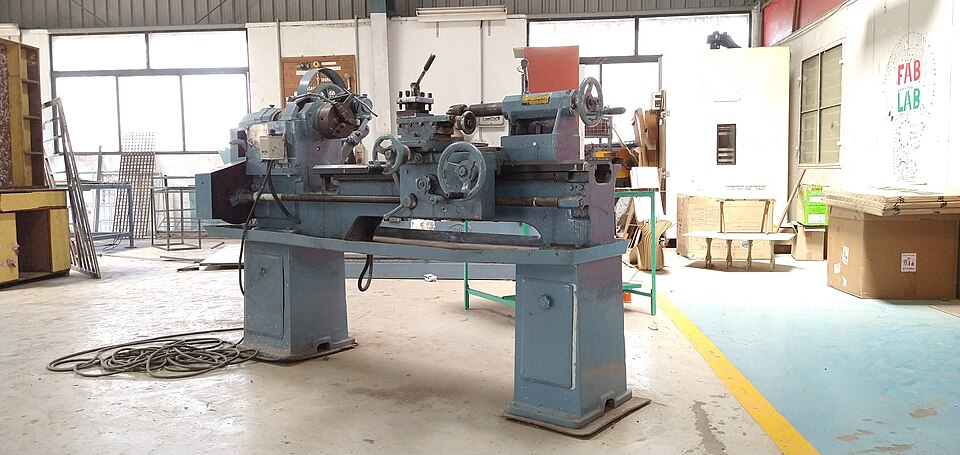
> *Image: Sunnybansodeva, CC BY-SA 4.0*

- [Iterative Machine Bootstrap](iterative-bootstrap.md) — The core self-improving sequence: crude lathe (0.5 mm tolerance) → improved lathe with leadscrew (0.1 mm) → shaper (0.05 mm) → milling machine (0.025 mm) → drill press → surface grinder (0.005 mm). Each machine doubles precision achievable with the previous generation.
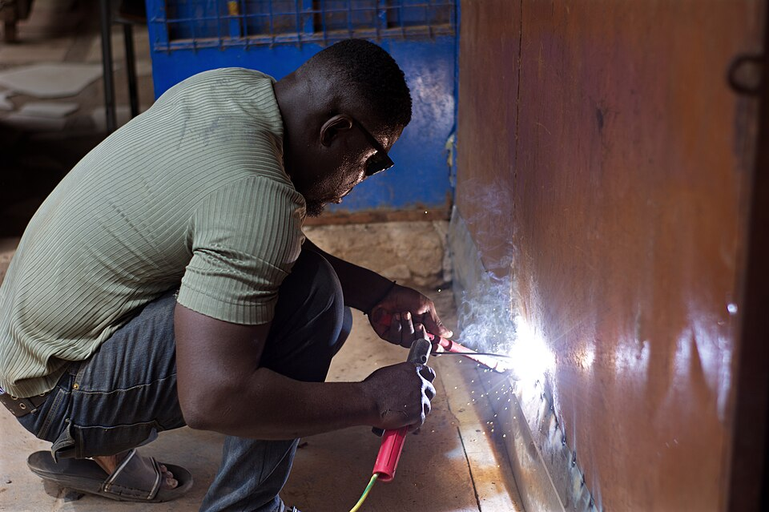
> *Image: Kwameghana(Bright Kwame Ayisi), CC BY-SA 4.0*

- [Metal Joining](joining.md) — Overview: forge welding, brazing, soldering, riveting, oxy-acetylene, SMAW, TIG, MIG, resistance, electron beam, ultrasonic, friction stir, laser, and diffusion bonding.

> *Image: Krorc, CC BY-SA 3.0*

- [Welding](welding.md) — Forge welding, oxy-acetylene, SMAW (stick), TIG (GTAW), MIG (GMAW), resistance spot/seam, electron beam, ultrasonic, friction stir, laser, and diffusion bonding. Covers vacuum chamber fabrication, hermetic sealing, and weld quality inspection.
<!-- TODO: source image for Brazing & Soldering -->
- [Brazing & Soldering](brazing-soldering.md) — Brass brazing (spelter), silver brazing (hard soldering), and soft soldering. Filler alloy joining for structural joints, electrical connections, plumbing, and sheet metal seams.
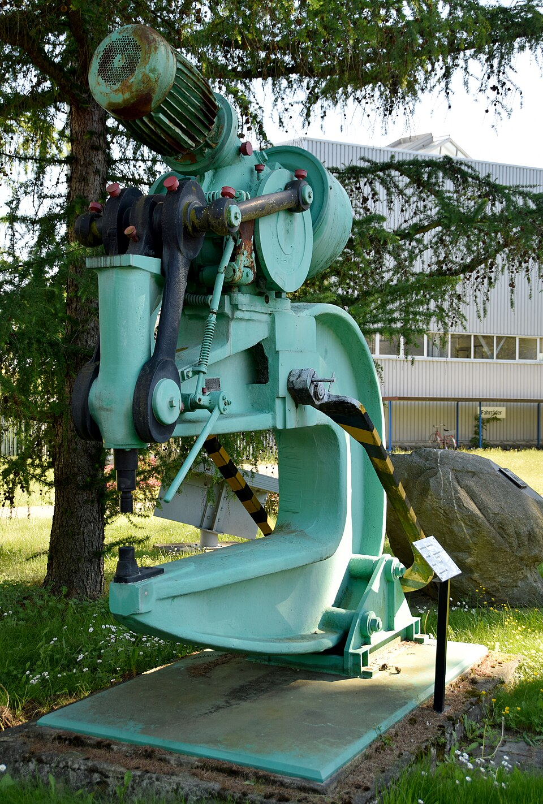
> *Image: Photographer: Mosbatho, CC BY 4.0*

- [Riveting](riveting.md) — Hot and cold riveting, joint configurations (lap, butt with cover plates, boiler seams), rivet patterns, and tap-test inspection.
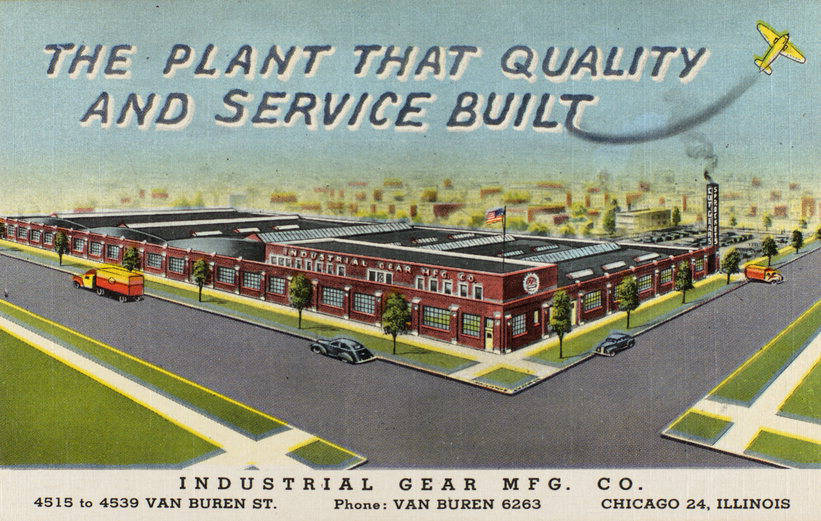
> *Image: Unknown authorUnknown author, Public domain*

- [Gears & Gear Manufacturing](gears.md) — Design, cutting, and finishing of gear teeth for power transmission: spur, helical, bevel, worm, and rack-and-pinion types.
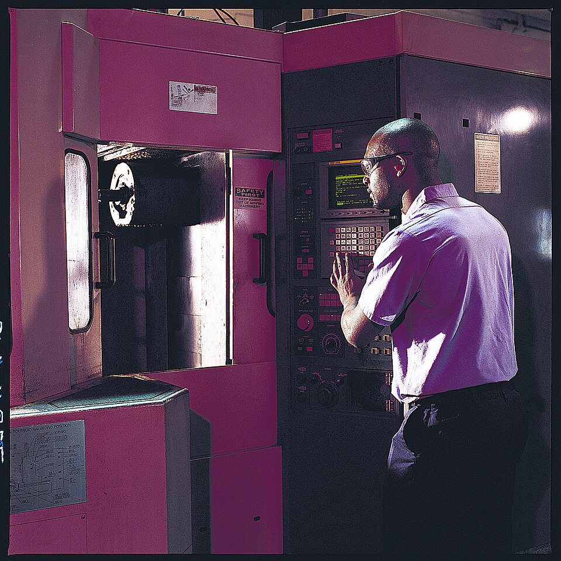
> *Image: Leadingtopunion, CC0*

- [Machining](machining.md) — Lathe turning, milling, drilling, and grinding of metal parts to precise dimensions.

> *Image: Jet Lowe, Public domain*

- [Belt & Shaft Power Transmission](power-transmission.md) — Mechanical power distribution via belts, shafts, pulleys, and line shaft systems from a single prime mover to multiple machines.

> *Image: BsBsBs, CC BY-SA 3.0*

- [Mass Production & Interchangeability](mass-production.md) — Interchangeable parts, tolerance specification with go/no-go gauges, production line layout, statistical process control, and standardized fasteners.
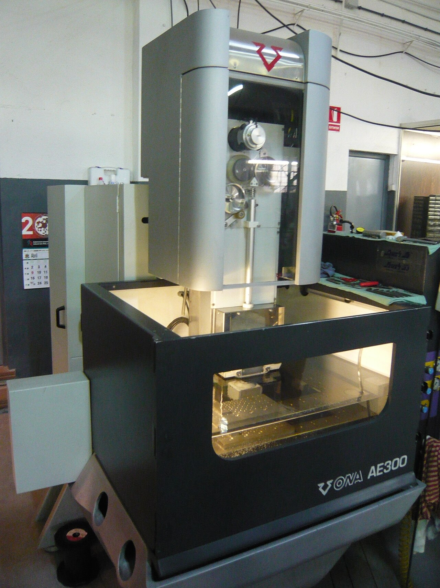
> *Image: Ricard Polls, Public domain*

- [EDM, CNC & Precision Grinding](edm-cnc.md) — Electrical Discharge Machining (wire EDM, sinker EDM), Computer Numerical Control (servo/stepper drives, 5-axis), and precision/ultra-precision grinding for sub-micron accuracy required by semiconductor equipment.

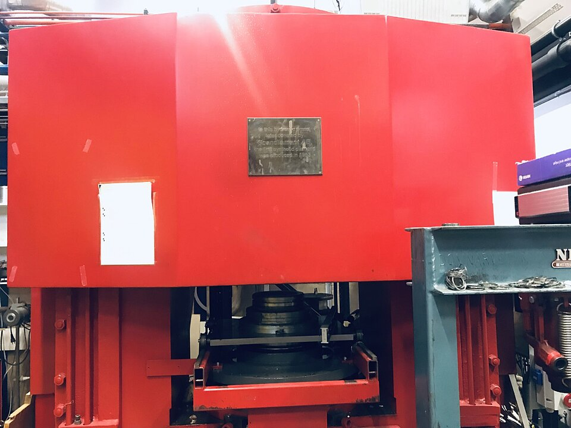
> *Image: SaiduzzamanUmU, CC BY-SA 4.0*

- [Hydraulic Press](hydraulic-press.md) — Fluid-powered press (10-500+ tons) for metal forming, compression molding, and powder compaction using Pascal's principle.
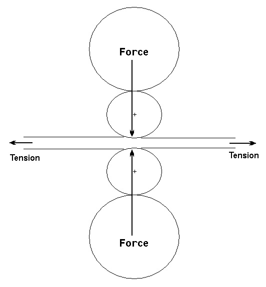
> *Image: AutoElectEngr, CC BY-SA 4.0*

- [Rolling Mill](rolling-mill.md) — Roll-forming equipment for reducing metal stock thickness and producing sheets, bars, and profiles through powered rollers.
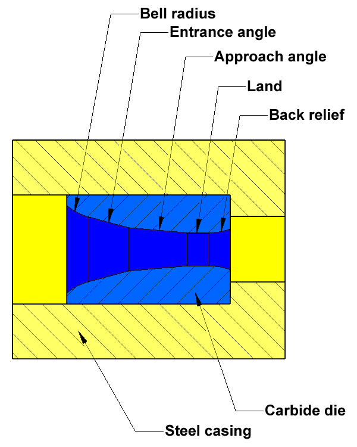
> *Image: Wizard191, CC BY-SA 3.0*

- [Wire Drawing Die](wire-drawing-die.md) — Tungsten carbide or diamond dies for drawing wire to precise diameters from rough stock.

> *Image: Chris Allen, CC BY-SA 2.0*

- [Forge Hammer](forge-hammer.md) — Powered forging hammers (trip, helve, steam, pneumatic) for heavy forging operations beyond hand-hammer capability.

> *Image: Department of the Interior. Patent Office. (1849 - 1925), Public domain*

- [Sheet Metal Brake](sheet-metal-brake.md) — Bending and forming equipment for sheet metal into channels, angles, boxes, and enclosures.
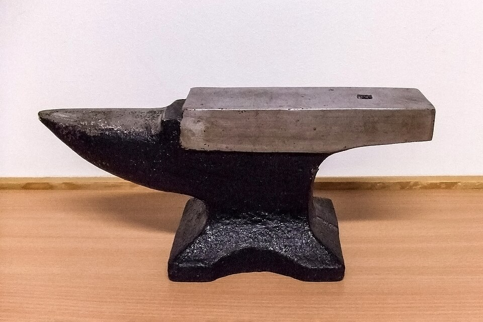
> *Image: W.carter, CC BY-SA 4.0*

- [Anvil](anvil.md) — Forging anvil construction from stone through cast iron with steel face — the primary workholding surface for smithing.
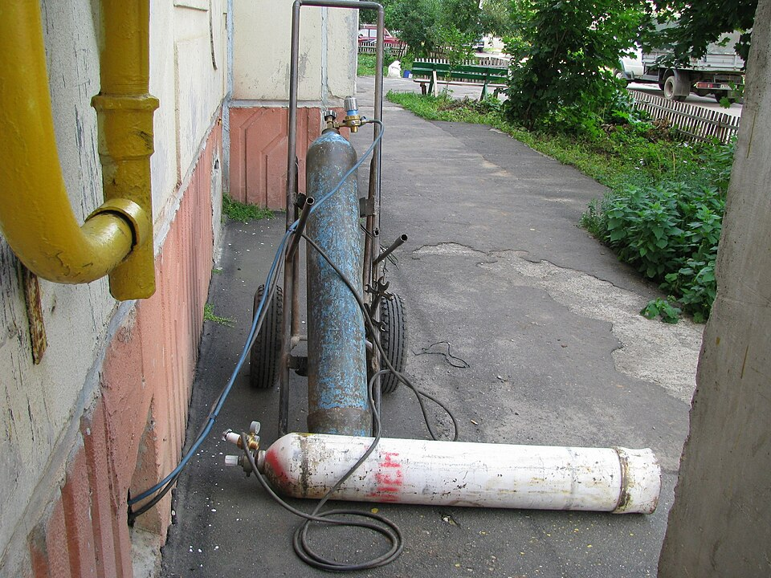
> *Image: Federal Bureau of Investigation, Public domain*

- [Welding Equipment](welding-equipment.md) — Construction of welding apparatus: oxy-acetylene torches, arc welders (SMAW, TIG, MIG), spot welders, and associated fixtures.

> *Image: Frank H. Nowell, Public domain*

- [Foundry Equipment](foundry-equipment.md) — Crucibles, ladles, molding equipment, and pouring systems for metal casting operations.
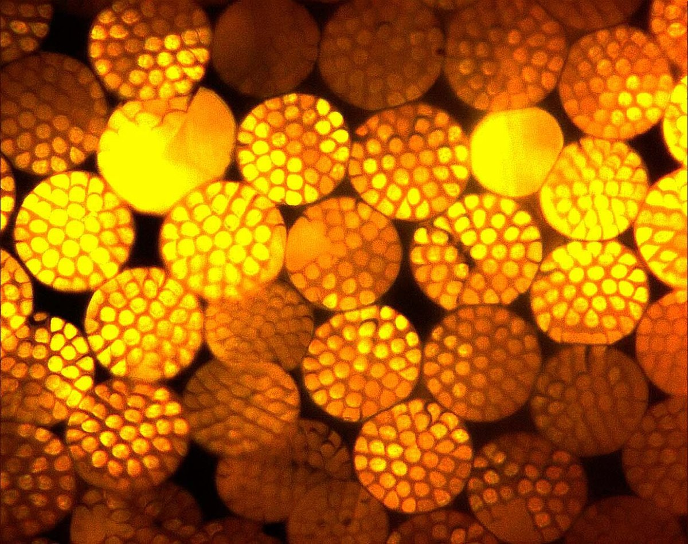
> *Image: Leonard J. DeFrancisci (copyright holder), CC BY-SA 4.0*

- [Extruder](extruder.md) — Single-screw and twin-screw extruders for continuous forming of polymers, food products, and other materials.
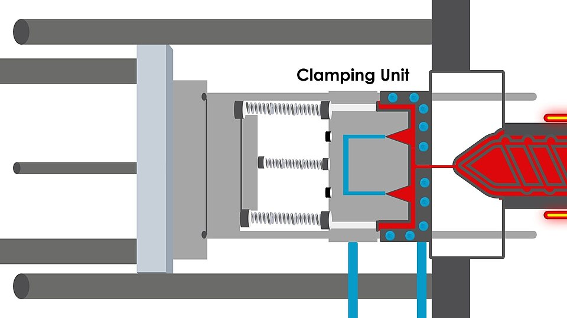
> *Image: PedroCalamaro, CC BY-SA 4.0*

- [Injection Molding Machine](injection-molding-machine.md) — High-pressure molding equipment (50-500+ tons) for producing complex thermoplastic parts in volume.

> *Image: Dow Chemical Company, Public domain*

- [Blow Molding Equipment](blow-molding-equipment.md) — Extrusion and injection blow molding machines for producing hollow plastic containers and parts.
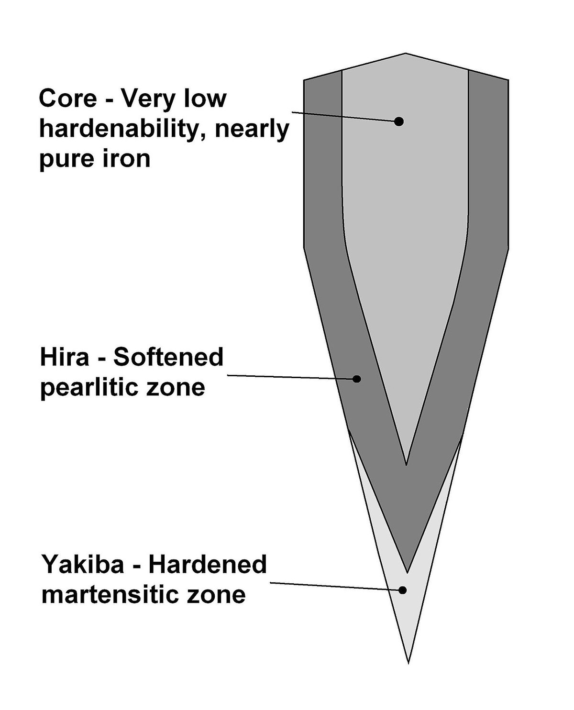
> *Image: Zaereth, CC BY-SA 3.0*

- [Compression Press](compression-press.md) — Heated platen presses for compression molding of thermosets, rubber, composites, and powder metallurgy.
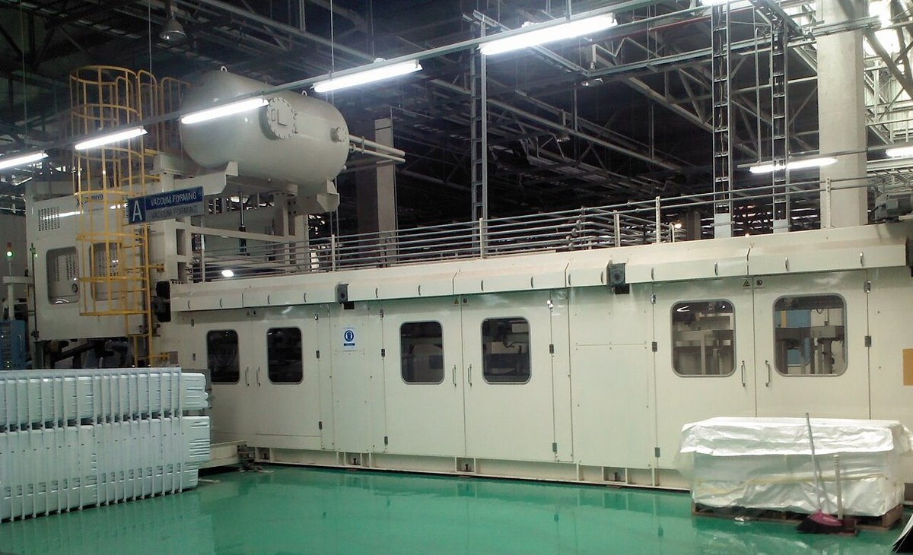
> *Image: Blue tooth7, CC BY-SA 4.0*

- [Thermoforming Equipment](thermoforming-equipment.md) — Vacuum and pressure forming machines for shaping heated thermoplastic sheet into products.
[↑ Back to Tech Tree](../index.md)
