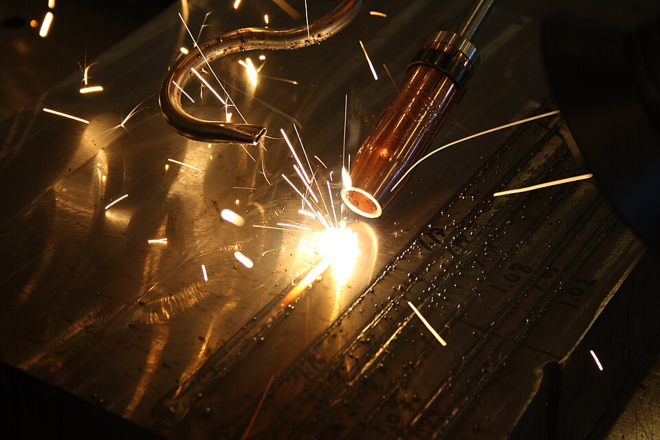

# Laser Welding

> **Node ID**: machine-tools.joining.laser-welding
> **Domain**: [Machine-Tools](./index.md)
> **Dependencies**: See prerequisites
> **Enables**: [`Electricity Generation & Distribution`](../energy/electricity.md), [`Metal Joining`](joining.md)
> **Timeline**: Years 30-60
> **Outputs**: laser_welds
> **Critical**: No

## Overview

> *A laser welding test at LWT (Lindoe Welding Technology). The 32 kW laser system is in this test limited to 12 kW. The invisible laser beam is coming directly from above. Inert gas from the big nozzle flows around the weld bead and compressed air from the small nozzle removes fumes.*

> *Image: Krorc, CC BY-SA 3.0*

CO₂ laser (10.6μm, 100W-20kW) or fiber laser (1.06μm, 100W-30kW) focused beam welding. Keyhole mode: deep narrow welds (depth-to-width 5:1 to 15:1), speed 1-20 m/min. Conduction mode: shallow welds for thin materials. Fiber laser deliverable through flexible fiber optic, easily robot-integrated. High-speed precision welding for semiconductor equipment components.

In keyhole welding, the focused laser intensity vaporizes metal at the weld center, creating a vapor channel (keyhole) that propagates deep into the workpiece. The laser energy deposits along the keyhole walls rather than just at the surface, enabling deep penetration at high travel speeds. Surface tension and vapor pressure maintain the keyhole open during welding, and the molten metal flows around the keyhole to close behind it as the beam advances. Shielding gas, typically argon, helium, or nitrogen, protects the molten pool from oxidation and suppresses plasma formation above the keyhole that could deflect the beam.

Conduction-mode welding operates at lower power density, heating the surface without forming a keyhole. Heat conducts downward into the workpiece, producing wider, shallower welds suitable for thin sheet, foils, and applications requiring minimal penetration. Conduction mode provides smoother bead appearance and is less sensitive to fit-up gaps than keyhole mode.

The non-contact nature of laser welding, where energy is delivered through an optical beam rather than a physical electrode or tool, enables welding in locations inaccessible to conventional welding torches and facilitates easy integration with robotic positioning systems for complex three-dimensional weld paths.

Primary outputs: `laser_welds`.

Laser welding became practical for production use with the development of high-power CO₂ lasers in the 1970s and fiber lasers in the 2000s. The fiber laser's ability to deliver high power through a flexible cable has been transformative, enabling easy integration with multi-axis robotic systems for complex three-dimensional welding tasks.

The key advantage of fiber lasers over CO₂ lasers for welding is beam delivery flexibility. A fiber laser beam travels through a flexible glass fiber that can be routed along a robotic arm, around corners, and into tight spaces. CO₂ laser beams at 10.6μm wavelength cannot be transmitted through glass fiber and must be guided by mirrors that require precise alignment.

Laser welding is inherently a low-distortion process because the heat input per unit length of weld is significantly lower than arc welding. The focused beam delivers energy precisely to the joint, minimizing the volume of heated material and the resulting thermal expansion and contraction. This makes laser welding preferred for precision components where dimensional tolerance must be maintained.

## Prerequisites

### Materials

- Metals to be welded (steel, stainless steel, aluminum, titanium, copper)
- Shielding gas (argon, helium, or nitrogen depending on material)
- Filler wire for gap-bridging applications (optional)

### Equipment

- Fiber or CO₂ laser source with beam delivery system (fiber optic cable or mirror guide)
- CNC workstation or multi-axis robotic arm with focusing optics and collimator
- Shielding gas nozzle (coaxial or trailing) integrated with the welding head
- Wire feeder for filler wire applications (optional)

### Knowledge

- Laser optics: beam quality (M²), spot size, depth of focus, and their effect on weld penetration and mode
- Keyhole dynamics: formation, stability, and collapse mechanisms that cause porosity
- Laser safety classification and required controls for Class 4 laser systems
- Beam-material interaction at different wavelengths: absorption, reflection, and plasma formation
- Shielding gas selection for laser welding: plasma suppression (helium) vs. cost (argon) vs. nitrogen reactivity

### Infrastructure

- Laser-safe enclosure with interlocked access doors, warning signs, and beam path covers
- Fume extraction system for metallic welding fumes (chromium VI from stainless steel welding is a carcinogen)
- Cooling water circulation for laser source and optics (fiber lasers require water chilling)
- Beam power calibration equipment (power meter) for verifying output before each shift
- Gas supply with regulators and flow meters for shielding gas delivery

## Process Description

The laser beam is generated in the resonator (CO₂ gas mixture or fiber-coupled diode-pumped Yb fiber), shaped by beam expander and collimator optics, and focused onto the workpiece through a focusing lens or parabolic mirror. At the focal point, power densities reach 10⁶ to 10⁷ W/cm², sufficient to vaporize metal and form a keyhole. The beam delivery for fiber lasers uses a flexible fiber optic cable that can be routed to a robotic arm, while CO₂ lasers require a rigid mirror-based beam guide.

### Step-by-Step Procedure

1. Clean joint surfaces to remove oxide, oil, and coatings. Laser welding is sensitive to surface contaminants: zinc coatings on galvanized steel generate vapor that blows out the keyhole, causing blowouts and porosity.
2. Fit up the joint with tight gap control. Laser welds require gaps less than 10-15% of the focused spot diameter. Gaps wider than this allow beam energy to pass through. Use precision shearing, machining, or tight clamping for fit-up.
3. Set laser parameters: power (100W-10kW depending on material and thickness), travel speed (0.5-20 m/min), focus position (slightly below surface for keyhole mode, at surface for conduction mode), and shielding gas flow rate.
4. Align the beam to the joint path. Use a low-power visible alignment laser coaxial with the welding beam, or a seam-tracking system for automated joints.
5. Initiate the weld with a controlled power ramp to establish the keyhole without spatter. Traverse the beam along the joint at the programmed speed. Monitor the weld pool through a coaxial camera or photodiode for real-time quality feedback.
6. At the weld end, ramp power down to close the keyhole gradually without leaving a crater. Abrupt power termination leaves a root porosity defect at the weld end.
7. Inspect the completed weld visually and with NDT methods. The narrow weld bead and small heat-affected zone are characteristic of laser welding.

### Process Parameters

| Parameter | Range | Notes |
|-----------|-------|-------|
| Laser Power | 100W - 30kW | 200-500W for thin foil; 2-6kW for sheet metal; 10-30kW for thick plate |
| Travel Speed | 0.5 - 20 m/min | Higher speed with higher power for same penetration |
| Spot Diameter | 0.1 - 1.0 mm | Smaller spot for keyhole mode; larger for conduction mode |
| Focus Position | -3 to +3 mm relative to surface | Below surface for deep penetration; above for wider weld |
| Shielding Gas Flow | 10-30 L/min | Argon for steel; helium for high-power welding to suppress plasma |

### Penetration Depth vs. Power and Speed (Mild Steel, Fiber Laser)

| Power (kW) | Speed 1 m/min | Speed 3 m/min | Speed 6 m/min | Speed 10 m/min |
|-----------|--------------|--------------|--------------|----------------|
| 1 | 3-4 mm | 1.5-2 mm | 0.8-1.2 mm | 0.5-0.8 mm |
| 2 | 5-7 mm | 3-4 mm | 1.5-2.5 mm | 1.0-1.5 mm |
| 4 | 8-12 mm | 5-7 mm | 3-4 mm | 2-3 mm |
| 6 | 12-16 mm | 7-10 mm | 4-6 mm | 3-4 mm |
| 10 | 18-25 mm | 10-15 mm | 6-9 mm | 4-6 mm |
| 15 | 25-35 mm | 15-22 mm | 9-14 mm | 6-9 mm |

These values are for keyhole mode with argon shielding gas. Conduction mode produces approximately 40-60% of the penetration shown.

### Recommended Parameters by Material (Fiber Laser)

| Material | Thickness (mm) | Power (kW) | Speed (m/min) | Shielding Gas | Focus Position |
|----------|---------------|-----------|--------------|---------------|----------------|
| Mild steel | 1 | 1.5-2.5 | 3-6 | Ar, 15 L/min | -1 mm |
| Mild steel | 3 | 3-5 | 2-4 | Ar, 15 L/min | -2 mm |
| Mild steel | 6 | 5-8 | 1-3 | Ar, 20 L/min | -2 mm |
| Mild steel | 10 | 8-12 | 0.5-1.5 | He, 20 L/min | -3 mm |
| Stainless 304 | 1 | 1.5-2 | 3-5 | Ar, 15 L/min | -1 mm |
| Stainless 304 | 3 | 3-5 | 1.5-3 | Ar+He mix, 18 L/min | -2 mm |
| Aluminum 6061 | 1 | 2-3 | 3-8 | Ar, 15 L/min | -1 mm |
| Aluminum 6061 | 3 | 4-6 | 2-4 | Ar, 20 L/min | -2 mm |
| Titanium Gr2 | 2 | 2-4 | 2-4 | Ar, 20 L/min + trailing | -1.5 mm |
| Copper C110 | 1 | 3-5 | 2-4 | Ar, 15 L/min | 0 mm (conduction) |

Weld quality in laser welding is highly sensitive to focus position relative to the workpiece surface. Focus positioned slightly below the surface typically produces the deepest penetration in keyhole mode, while focus at or above the surface favors conduction-mode welding. The depth of focus, the range over which the beam remains effectively focused, depends on the beam quality and focusing optics. High-beam-quality fiber lasers produce a longer depth of focus than CO₂ lasers at equivalent spot size, providing more tolerance for workpiece positioning variations.

The choice between keyhole and conduction mode depends on the application. Keyhole mode produces deep, narrow welds with high aspect ratio, suitable for thicker materials and applications requiring full penetration in a single pass. Conduction mode produces wider, shallower welds with smoother bead appearance, suitable for thin materials, aesthetic joints, and applications where the keyhole instability of highly reflective metals would be problematic.

## Safety Considerations

Laser radiation at both CO₂ and fiber laser wavelengths is invisible and can cause permanent eye damage, including retinal burns, from scattered reflections at considerable distance from the beam path. Laser welding is classified as Class 4, the highest hazard class.

- **Eye damage from laser radiation**: Fiber laser radiation (1.06μm) passes through the cornea and focuses on the retina, causing irreversible burns. CO₂ laser radiation (10.6μm) is absorbed by the cornea. Both are invisible. Scattered reflections from the workpiece can be hazardous meters from the beam path.
- **Reflected beam ignition**: Reflected laser energy can ignite flammable materials, paper, and solvents in the work area. Remove all combustible materials from the enclosure.
- **Reflected beam ignition**: Reflected laser energy can ignite flammable materials, paper, and solvents in the work area. Remove all combustible materials from the enclosure. The reflected beam maintains sufficient intensity to ignite materials several meters from the weld zone.
- **Welding fumes**: Metal vapor from the keyhole contains submicron particles of the base metal and its alloying elements. Chromium VI from stainless steel welding is a known carcinogen. Local exhaust ventilation at the weld zone is mandatory.
- **Plasma radiation**: The plasma plume above the keyhole generates intense ultraviolet radiation that causes welder's flash (photokeratitis). The plasma is more intense with CO₂ lasers than with fiber lasers due to the longer wavelength.

### Personal Protective Equipment

- Laser safety glasses with optical density rated for the specific laser wavelength (OD 5+ for fiber laser at 1.06μm; different rating for CO₂ at 10.6μm)
- Welding helmet with appropriate filter shade for viewing the weld pool during manual laser welding
- Flame-resistant clothing with no reflective surfaces that could redirect stray laser energy
- Respiratory protection when fume extraction is insufficient or during maintenance inside the enclosure
- Steel-toe boots for handling heavy workpieces and fixtures

### Emergency Procedures

- Test laser enclosure interlocks and beam shutoff on a weekly schedule; document results
- Maintain laser-specific eye wash station near the enclosure entrance
- Post laser warning signs at all entrances to the laser area with wavelength and power information
- Train all personnel on laser eye injury first aid: immediate medical attention, do not rub eyes
- Fire suppression system inside the laser enclosure (CO₂ or clean agent, not water near high-voltage laser components)

## Quality Control

### Acceptance Criteria

- **Laser Welds**: Full penetration without porosity or lack of fusion. Weld width and penetration depth within specification. No spatter or surface underfill exceeding 10% of material thickness. Heat-affected zone within specified limits.

### Testing Methods

- Cross-section metallography of weld samples for penetration depth, weld width, and microstructure verification
- X-ray radiography for internal porosity and fusion assessment in thick-section welds
- Real-time weld monitoring via coaxial camera and photodiode signals (detects keyhole instability, porosity events, and lack of fusion)
- Leak testing for hermetic joints (helium mass spectrometer)
- Visual inspection under magnification for surface defects, undercut, spatter, and bead geometry

### Sampling Protocol

- Verify beam focus and power calibration before each shift using a laser power meter
- Log weld parameters (power, speed, focus position, gas flow) and quality data for each joint for traceability
- Cross-section weld samples from each new parameter setup or material combination
- Perform 100% visual inspection; radiograph critical welds per applicable code
- Record real-time monitoring data for post-weld quality review; flag deviations for investigation

## Scaling Notes

- **Bench scale**: Small fiber laser (200-500W) with manual or simple CNC positioning. Thin sheet and foil welding. Spot welding and seam welding of small components. Suitable for battery tab welding and electronic component assembly.
- **Pilot scale**: 1-6 kW fiber laser on robotic arm or multi-axis CNC. Sheet metal welding up to 4 mm steel. Semi-automated fixture loading. Production of moderate-volume components.
- **Production scale**: Multiple 6-30 kW laser welding cells with robotic beam delivery. Automotive body construction, aerospace structural panels, and heavy fabrication. Throughput of hundreds of meters of weld per shift.

Scaling from bench to production laser welding requires attention to beam delivery reliability. At high duty cycles, fiber optic cables degrade from back-reflections and contamination at the connectors. Protective cover slides (sacrificial glass discs between the focusing optic and the workpiece) must be replaced on a schedule based on spatter accumulation. The cost of consumables (cover slides, shielding gas, nozzle tips) scales linearly with production volume and must be factored into per-weld cost calculations.

Laser beam delivery is a key differentiator between laser types. CO₂ lasers require mirror-based beam guiding systems that must maintain precise alignment, while fiber lasers transmit through flexible fiber optic cables that can be easily routed to robotic arms or multi-axis heads. This flexibility has made fiber lasers the dominant choice for automated welding cells.

Gap bridging capability is limited compared to arc welding processes. Laser welds require tight fit-up: gaps exceeding a small fraction of the focused spot size allow beam energy to pass through rather than couple with the workpiece. Wire feed or wobble-beam techniques can improve gap tolerance but add complexity.

## Troubleshooting

| Problem | Probable Cause | Solution |
|---------|---------------|----------|
| Porosity (keyhole instability) | Keyhole collapses intermittently, trapping gas | Increase power 10-15% or reduce speed by 20% to stabilize keyhole; adjust shielding gas to helium for plasma suppression; verify surface cleanliness |
| Cracking (solidification) | High cooling rate creates brittle microstructure | Add trailing heat using second beam or reduce cooling rate with 150-200°C preheat; use filler wire to modify weld metal composition (e.g., ER70S-6 adds deoxidizers) |
| Spatter and underfill | Keyhole collapse at weld start or excessive power ramp | Use controlled power ramp-up at start (ramp to full power over 0.5-1.0 s); reduce power by 10%; improve shielding gas coverage with coaxial nozzle |
| Lack of fusion at root | Beam focus too deep or insufficient power | Adjust focus position 1-2 mm closer to surface; increase power by 10-15%; verify joint alignment is within ±0.2 mm |
| Humping bead | Excessive travel speed for the power level | Reduce speed by 20-30%; increase power 10-15% to maintain keyhole stability at the desired speed |
| Poor penetration on reflective metals (Al, Cu) | Low absorption at 1.06 μm wavelength | Apply surface treatment (sandblasting or blackening) to increase absorption; use shorter wavelength laser (blue/green under development); use higher power with beam oscillation at 100-300 Hz |
| Plasma blocking beam (high-power welding) | Ionized metal vapor above keyhole absorbs and scatters the beam | Switch to helium shielding gas (higher ionization potential than argon); increase gas flow to 20-30 L/min; add side jet to blow plasma away from beam path |
| Gap bridging failure | Joint gap exceeds 10-15% of spot diameter | Tighten fit-up to <0.1 mm for 1 mm spot; add filler wire (1.0-1.2 mm diameter) at 2-5 m/min feed rate; use beam wobble (0.5-1.0 mm amplitude) to widen melt pool |
| Root porosity at weld end | Abrupt power termination leaves unfilled keyhole crater | Program power ramp-down over 0.3-0.5 s at weld end; continue shielding gas for 2-3 seconds after beam off; overlap end onto run-off tab |

## Variations and Alternatives

- **Hybrid laser-arc welding**: Combines a laser beam with a MIG arc in a single weld pool. The laser provides deep penetration while the arc adds filler material and improves gap bridging. Achieves laser-quality welds with the fit-up tolerance of arc welding.
- **Remote laser welding**: Scanning mirrors steer the laser beam across the workpiece without moving the focusing optics or workpiece. Welds multiple joints in rapid succession with minimal positioning time, achieving speeds an order of magnitude faster than robotic arc welding.
- **Blue/green wavelength lasers**: Under development for industrial welding. Higher absorption in copper than infrared wavelengths of standard fiber lasers, enabling more efficient copper welding for battery and electronics manufacturing.

Laser welding has largely replaced resistance spot welding in automotive body construction for many manufacturers, offering continuous seam welds (stronger and stiffer joints), single-sided access (no electrode reach limitations), and high speed. In semiconductor equipment manufacturing, laser welding produces the small, precise welds needed on thin-walled stainless steel tubing and fittings for gas distribution systems.

Laser welding produces a characteristically narrow heat-affected zone compared to arc welding, resulting in less metallurgical degradation of the base metal adjacent to the weld and reduced thermal distortion of the workpiece. This narrow HAZ makes laser welding particularly suitable for welding near heat-sensitive components and for applications where post-weld machining must be minimized.

Laser welding of copper and aluminum, both highly reflective at common laser wavelengths, requires careful optimization of beam parameters to overcome the low absorption of laser energy at these metal surfaces. Blue and green wavelength lasers offer higher absorption in copper than the infrared wavelengths of CO₂ and standard fiber lasers, enabling more efficient copper welding for battery and electronics manufacturing.

Laser welding produces a characteristically narrow heat-affected zone compared to arc welding, resulting in less metallurgical degradation of the base metal adjacent to the weld and reduced thermal distortion of the workpiece. This narrow HAZ makes laser welding particularly suitable for welding near heat-sensitive components and for applications where post-weld machining must be minimized.

Remote laser welding stations use scanning mirrors to steer the laser beam across the workpiece without moving the focusing optics or the workpiece itself. This enables welding of multiple joints in rapid succession with minimal positioning time, achieving welding speeds an order of magnitude faster than conventional robotic arc welding stations. The combination of high speed, non-contact energy delivery, and easy robotic integration has made fiber laser welding the fastest-growing welding process in automotive manufacturing.

## References

- [Metal Joining](joining.md) — parent capability
- [Machine-Tools Domain](./index.md) — domain overview and related capabilities
- [Electricity Generation & Distribution](../energy/electricity.md) — downstream capability
- [Metal Joining](joining.md) — downstream capability

### Material Handling

- Clean optics and protective cover slides per daily maintenance schedule; contaminated optics scatter beam energy and degrade weld quality
- Verify shielding gas purity and flow rate before each production run; contamination causes porosity
- Remove zinc coatings (galvanized steel) from the weld zone before laser welding; zinc vapor causes blowouts
- Store focusing lenses and cover slides in clean, dry conditions; fingerprint oils etch the coating at laser power
- Keep wire feeder aligned to the weld pool for filler wire applications; misaligned wire causes lack of fusion
- Maintain beam delivery fiber optic minimum bend radius; sharp bends damage the fiber and reduce delivered power
- Record laser power, travel speed, and focus position for each weld in a permanent log for traceability
- Maintain beam delivery fiber optic minimum bend radius; sharp bends damage the fiber and reduce delivered power
- Check cover slide condition before each shift; a cracked or contaminated cover slide scatters the beam and degrades weld quality
- Keep spare focusing lenses and cover slides in inventory; a cracked lens stops production until replacement
- Verify laser power meter calibration monthly; power drift affects penetration depth and weld consistency
- Clean the beam delivery fiber connector end faces with alcohol and lint-free wipes before each installation; connector contamination causes hot spots that damage the fiber
- Perform laser power measurement with a calibrated power meter at the workpiece position before each shift
- Verify nozzle gas flow with a flow meter; subjective assessment of gas coverage is unreliable

---
*Part of the [Bootciv Tech Tree](../index.md) · [Machine-Tools](./index.md) · [All Domains](../index.md)*
