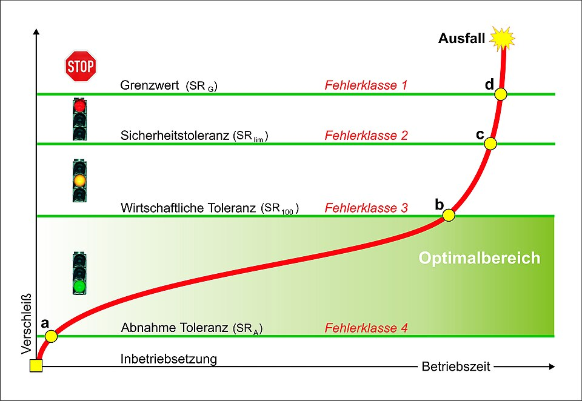

# Mass Production & Interchangeability

> **Node ID**: machine-tools.mass-production
> **Domain**: [Machine Tools Bootstrap](./index.md)
> **Timeline**: Years 15-30
> **Outputs**: interchangeable_parts, standardized_assemblies, production_lines
> **Dependencies**: [`machine-tools.machining`](machining.md), [`measurement.precision-metrology`](../measurement/precision-metrology.md), [`machine-tools.bearings-abrasives`](bearings-abrasives.md)
> **Critical**: Yes — transforms individual craftsmanship into repeatable, scalable manufacturing; without it, every mechanism is a one-off requiring skilled fitting

Mass production manufactures identical parts to controlled tolerance so that any part from a batch fits any assembly without hand-fitting. This capability depends on [Machining](./machining.md) for producing parts to tolerance, [Precision Metrology](../measurement/precision-metrology.md) for verifying conformance with gauges and standards, and [Bearings & Abrasives](./bearings-abrasives.md) for the cutting tools and surface finishes that make interchangeability achievable.

## The Interchangeability Problem

> *Schematic of the wear course of development with graded tolerances (SR) on the evaluation of measurement results. For ease of reference, the corresponding error classes for the qualitative assessment are located.
The tolerance limits in this image reflect the typical profile of a plant life. Afte...*

> *Image: Marx, CC BY 3.0*

A craftsman building a single mechanism files, scrapes, and fits each part individually — a bearing is reamed to match its specific shaft, a bracket is drilled to match its specific hole pattern. This works for one-off production but fails at scale: if a part breaks, the replacement must be hand-fitted too, and no two machines are truly identical.

Interchangeable parts solve this by manufacturing every copy of a part within a defined tolerance band. Any part within tolerance fits any assembly within tolerance — no selection, no fitting, no individual adjustment. This requires three preconditions:

1. **Machine tools that hold tolerance** — the lathe, mill, or grinder must produce parts within the specified range consistently. See [Iterative Bootstrap](./iterative-bootstrap.md) for the precision progression.
2. **Measurement standards that verify tolerance** — gauges, gauge blocks, and inspection instruments that can reliably distinguish a conforming part from a reject. See [Precision Metrology](../measurement/precision-metrology.md).
3. **Material consistency** — the same alloy, heat treatment, and surface finish from batch to batch, so that dimensional control maps to functional performance.

## Whitney's Interchangeable Muskets (1798-1801)

Eli Whitney's contract with the U.S. government for 10,000 muskets is the foundational case study in American interchangeable manufacture. Whitney promised parts so uniform that any lock plate, trigger, or barrel from his factory would fit any musket stock without filing. The reality was more complicated — Whitney's earliest parts were not truly interchangeable, and hand-fitting persisted — but the contract established the principle that drove a generation of investment in precision machinery.

**What Whitney actually achieved**:
- Jigs and fixtures that guided drills and files to the same position on every workpiece, reducing operator-dependent variation
- Specialized machines for single operations (a machine that drilled only the lock plate, a machine that milled only the trigger) rather than general-purpose tools
- Gauges and templates that inspectors used to accept or reject parts at each stage
- A production sequence where parts flowed from roughing operations through finishing operations to assembly in a defined order

**What Whitney did not yet achieve**:
- True statistical process control — parts were gauged but not measured to a numerical standard
- Tolerances tight enough for guaranteed interchangeability without selection — the 0.1-0.25 mm range of his machinery was borderline for lock mechanism fits
- Hardened gauges — his gauges wore, introducing drift over production runs

The lesson is clear: interchangeability is not a binary state. It is a spectrum that improves as machine precision, gauge accuracy, and process discipline tighten together.

## Tolerance Specification & Gauging

### Tolerance Stack-Up

When two parts must fit together — a shaft in a bearing bore, a bolt in a hole — the assembler cares about the clearance between them. If the shaft diameter is 25.00 mm ±0.02 mm and the bore diameter is 25.04 mm ±0.02 mm, the clearance ranges from 0.00 mm (worst case: largest shaft in smallest bore) to 0.08 mm (smallest shaft in largest bore). For a running fit at moderate speed, 0.02-0.06 mm clearance is typical — the worst-case zero-clearance fit will seize.

**Tolerance allocation** for a typical assembly (shaft-and-bearing unit):
1. Define the functional requirement: running clearance 0.02-0.06 mm.
2. Allocate tolerance to each component: bore 25.04 ±0.01 mm, shaft 25.00 ±0.01 mm.
3. Worst-case clearance: 25.05 − 24.99 = 0.06 mm (acceptable). Worst-case interference: 25.03 − 25.01 = 0.02 mm clearance (acceptable).
4. Verify that the machine tools can achieve ±0.01 mm — this requires grinding or precision boring (see [Machining](./machining.md) tolerance table).

### Go / No-Go Gauges

The fastest way to verify a dimension in production is a pair of gauges:

- **Go gauge**: The maximum material condition — the largest shaft or smallest hole that is still acceptable. The go gauge must pass through or over the part. If it does not, the part is oversize (shaft) or undersize (hole) and must be reworked or scrapped.
- **No-go gauge**: The minimum material condition — the smallest shaft or largest hole that is still acceptable. The no-go gauge must NOT pass. If it does, the part is undersize (shaft) or oversize (hole) and is a reject.

**Construction steps for go/no-go ring gauges** (M12×1.75 external thread):
1. Machine two ring gauges from hardened tool steel (O1 or A2, hardened to 58-62 HRC). The go gauge is threaded to the maximum material limit of the external thread (pitch diameter 10.863 mm for 6g tolerance). The no-go gauge is threaded to the minimum material limit (pitch diameter 10.679 mm).
2. Lap the gauge threads to ±0.005 mm on pitch diameter. Verify with a precision thread measuring machine or calibrated wires.
3. Mark the gauges clearly: "GO M12×1.75-6g" and "NOGO M12×1.75-6g" with the pitch diameter limits engraved.
4. Calibrate the gauges against gauge blocks or a master thread plug gauge before each production run.

**Inspection procedure for production parts**:
1. Screw the go gauge onto the threaded part by hand. It must engage the full thread length without forcing.
2. Screw the no-go gauge onto the part. It must not engage more than 2 full turns (the standard acceptance rule for thread gauges).
3. Record the result: accept or reject. No measurement — the gauge gives a binary pass/fail.

**Expected performance**: Inspection time per part: 5-10 seconds (versus 2-3 minutes for a micrometer measurement). Gauge life: 5,000-20,000 inspections before wear takes the gauge out of calibration. Gauge accuracy: ±0.005 mm on the gauged dimension.

**Materials specifications**: Tool steel O1 or A2 (hardened 58-62 HRC), lapping compound (aluminum oxide, 5 μm and 1 μm grades), thread measuring wires (0.904 mm diameter for M12×1.75), gauge blocks (grade 0 or grade 1 for calibration).

### Gauge Block Calibration

Gauge blocks (Jo-blocks) are the primary length standard for the shop floor. They come in sets (typically 81 or 112 pieces) that can be wrung together to build any dimension in 0.001 mm steps. See [Precision Metrology](../measurement/precision-metrology.md) for the full calibration chain.

**Quick reference — gauge block grades**:

| Grade | Tolerance | Application |
|-------|-----------|-------------|
| Grade 0 (AAA) | ±0.05 μm | Laboratory calibration of other gauges |
| Grade 1 (AA) | ±0.10 μm | Inspection department — setting instruments |
| Grade 2 (A) | ±0.20 μm | Shop floor — setting calipers, micrometers, gauges |

### Plug Gauges and Snap Gauges

- **Plug gauge**: Checks internal diameters (holes). A stepped cylindrical pin where one end is the go diameter and the other is the no-go diameter. Faster than measuring every hole with an inside micrometer.
- **Snap gauge**: Checks external diameters (shafts). A C-shaped frame with two anvils — one set to the go limit, one to the no-go limit. The operator slides the part through: it must pass the go anvil and stop at the no-go anvil.

## Production Line Layout

### Line Design Principles

A production line arranges machines and workstations in sequence so that parts flow from raw material to finished assembly with minimal handling and waiting. The key parameters are:

- **Cycle time**: The time to complete one unit at the slowest station (the bottleneck). The line cannot produce faster than the bottleneck.
- **Takt time**: The required production rate, determined by demand. If demand is 100 units/day and the factory runs 8 hours, takt time = 480 minutes / 100 = 4.8 minutes per unit.
- **Workstation count**: Number of stations = total work content / takt time. If assembling a unit takes 24 minutes of labor and takt time is 4.8 minutes, you need at least 5 stations (24 / 4.8 = 5).

### Layout for Interchangeable Part Production

A practical layout for producing interchangeable shaft-and-bearing units:

1. **Raw material receiving**: Bar stock (25 mm diameter mild steel) inspected for diameter tolerance (±0.1 mm) and material certificate verification.
2. **Cut-off station**: Abrasive chop saw or parting lathe cuts bars to shaft blanks (100 mm length ±0.5 mm). Output: shaft blanks.
3. **Rough turning station**: Lathe roughs the bearing journal to 25.3 mm diameter (0.3 mm oversize for finishing). Cycle time: 2 minutes per shaft.
4. **Finish turning station**: Lathe finishes the bearing journal to 25.00 mm ±0.02 mm. Cycle time: 3 minutes per shaft. This is typically the bottleneck for the shaft line.
5. **Grinding station** (optional, for tighter tolerance): Cylindrical grinder finishes the journal to 25.000 mm ±0.005 mm. Cycle time: 5 minutes per shaft.
6. **Gauging station**: Go/no-go snap gauge checks the journal diameter. Plug gauge checks the bearing bore (if bearings are produced on the same line). Parts are sorted: accept, rework (if oversize — return to grinding), scrap (if undersize).
7. **Assembly station**: Shaft pressed into bearing housing. Interference fit or transition fit depending on the application. Assembly fixture ensures alignment.
8. **Final test**: Spin the assembled unit. Check for smooth rotation, no detectable runout by hand, acceptable axial play (measured with a dial indicator).

### Material Flow

Parts move between stations via:
- **Manual transfer**: Operator carries parts in trays or tote boxes. Simple, flexible, but slow and error-prone for high volumes.
- **Gravity roller conveyor**: Parts on trays roll downhill between stations. No power required. Works for light-to-medium weight.
- **Belt conveyor**: Continuous moving belt carries parts. Good for high-volume, single-product lines.
- **Chute and bin**: Finished parts slide into bins sorted by size grade (selective assembly) or acceptance status.

## Ford's Assembly Line (1913)

Henry Ford's Highland Park assembly line for the Model T is the paradigmatic case of mass production applied to a complex product. The principles generalize beyond automobiles.

**Key innovations**:
- **Moving assembly line**: The chassis moved past stationary workstations on a motor-driven chain conveyor. Workers stayed in place; the work came to them. Cycle time dropped from 12.5 hours to 93 minutes per car.
- **Task decomposition**: Each worker performed a small, repetitive set of motions (tighten 4 bolts, install 1 component). This reduced training time and increased speed through repetition, but made work monotonous and required careful ergonomic design.
- **Standardized components**: Every Model T used the same bolts (7/16-20 UNF), the same axle shafts, the same steering column. Interchangeability was enforced by gauging at the parts supplier level — Ford inspected incoming parts with go/no-go gauges and rejected entire batches that failed.
- **Sequential delivery**: Parts arrived at each workstation in the order and quantity needed, just as the chassis arrived. This minimized work-in-progress inventory and floor space.

**Transferable principles for bootstrapping**:
1. Start with manual assembly stations in sequence before investing in powered conveyors.
2. Gauge incoming parts before they reach assembly — reject non-conforming parts early.
3. Standardize fasteners and interfaces first (thread standards, hole patterns, shaft diameters). See [Bearings & Abrasives](./bearings-abrasives.md) for thread standard production.
4. Decompose the assembly into tasks that take roughly equal time (balance the line) so no station is idle while others are overloaded.
5. Time each station with a stopwatch. The bottleneck determines the line rate. Add workers or machines to the bottleneck until the line is balanced.

## Quality Control at Scale

### Statistical Process Control (SPC)

Inspecting every part is impractical above a few hundred units. Statistical process control samples a fraction of production and uses the results to infer the behavior of the whole batch.

**X-bar and R chart** (variable measurement — for dimensions measured with a micrometer):
1. Take a sample of 5 parts from each production batch (or at regular time intervals).
2. Measure the critical dimension on each part. Calculate the sample average (X-bar) and the sample range (R = maximum − minimum).
3. Plot X-bar on the X-bar chart and R on the R chart against time.
4. Set control limits: upper control limit (UCL) and lower control limit (LCL) at ±3σ from the process mean. These are calculated from the process data, not from the specification limits.
5. If a point falls outside the control limits, or if a run of 7 points trends in one direction, the process is out of control — stop the line and investigate.

**p-chart** (attribute measurement — for go/no-go gauging):
1. Inspect 50 parts per batch with a go/no-go gauge. Count the number rejected (p = rejects / 50).
2. Plot p on the p-chart against batch number.
3. Set control limits based on the historical average reject rate. If p exceeds the upper control limit, the process has shifted — tool wear, material change, or machine drift are likely causes.

### Process Capability

The capability index Cpk measures whether the process spread fits within the specification limits:

**Cpk = min[(USL − X̄) / (3σ), (X̄ − LSL) / (3σ)]**

Where USL = upper specification limit, LSL = lower specification limit, X̄ = process mean, σ = process standard deviation.

- Cpk ≥ 1.33: Capable process (4σ between mean and nearest limit). Fewer than 6 defects per 100,000 parts.
- Cpk = 1.0: Marginal (3σ between mean and nearest limit). About 3 defects per 1,000 parts.
- Cpk < 1.0: Incapable. The process cannot consistently meet the specification.

**Example**: A shaft turning operation targets 25.000 mm ±0.02 mm (USL = 25.020, LSL = 24.980). The process mean is 25.002 mm and the standard deviation is 0.005 mm.

Cpk = min[(25.020 − 25.002) / (3 × 0.005), (25.002 − 24.980) / (3 × 0.005)]
Cpk = min[1.20, 1.47] = 1.20

This is marginally capable. To improve: adjust the tool offset to center the process closer to 25.000 mm, or reduce variation by using a finishing pass at lower feed rate.

### Sampling Plans

For go/no-go inspection (attribute sampling), a sampling plan defines how many parts to inspect and how many defects are allowed before rejecting the batch:

- **(n, c) plan**: Inspect n parts from the batch. Accept the batch if the number of defects ≤ c. Reject if defects > c.
- **Example — (50, 2) plan**: Inspect 50 parts. Accept if 0, 1, or 2 defects found. Reject if 3 or more defects found. This plan catches batches with >8% defect rate with 90% confidence.

**Operating characteristic (OC) curve**: Plots the probability of accepting a batch versus the true defect rate. A good sampling plan has high acceptance probability for batches below the acceptable quality level (AQL, typically 1-2%) and low acceptance probability for batches above the rejectable quality level (RQL, typically 5-10%).

## Standardized Fasteners & Interfaces

### Thread Standards

Mass production demands standardized fasteners so that any bolt fits any nut. The two major standards are:

- **ISO metric** (M-series): M3, M4, M5, M6, M8, M10, M12, M16, M20, M24. Thread angle 60°. Coarse pitch standard (e.g., M12×1.75). World standard.
- **Unified National** (UNC/UNF): 1/4-20, 5/16-18, 3/8-16, 7/16-14, 1/2-13. Thread angle 60°. Coarse (UNC) and fine (UNF) series. Legacy U.S. standard.

Thread production: See [Bearings & Abrasives](./bearings-abrasives.md) for tap and die manufacturing. See [Machining](./machining.md) for thread cutting on the lathe.

### Dowel Pins and Keys

For parts that must align precisely (gear trains, bearing housings, machine columns):

- **Dowel pins**: Hardened steel pins (typically m6 interference fit) pressed into reamed holes. Position the mating part relative to a datum within ±0.01 mm. Used in addition to bolts — bolts clamp, dowels locate.
- **Keys and keyways**: Rectangular or Woodruff keys transmit torque between shafts and hubs. Keyway tolerance: width ±0.02 mm, depth ±0.05 mm. See [Machining](./machining.md) for keyway milling.

### Fits and Tolerances (ISO System)

The ISO hole/basis system defines standard fits by combining a fundamental deviation (letter) with a tolerance grade (number):

| Fit | Hole | Shaft | Clearance | Application |
|-----|------|-------|-----------|-------------|
| Running fit | H8 | f7 | 0.020-0.074 mm (25 mm dia) | Bearing bores, sliding guides |
| Transition fit | H7 | k6 | −0.007 to +0.027 mm (25 mm dia) | Couplings, gear hubs (may need light press) |
| Interference fit | H7 | p6 | −0.035 to −0.001 mm (25 mm dia) | Bearing outer races in housings, permanent assemblies |
| Force fit | H7 | s6 | −0.048 to −0.014 mm (25 mm dia) | Permanently assembled components |

Negative clearance = interference (the shaft is larger than the hole — requires a press or thermal assembly).

## Tooling for Production Lines

### Jigs and Fixtures

A jig guides the cutting tool to the correct position on the workpiece. A fixture holds the workpiece in the correct position for a machining or assembly operation. Both are essential for producing interchangeable parts on general-purpose machines.

**Drill jig construction** (for drilling four 6 mm holes on a 80 mm bolt circle in a 100 mm flange):
1. Design the jig body: a mild steel plate (120 × 120 × 15 mm) with a central bore matching the workpiece pilot diameter (25.00 mm ±0.01 mm).
2. Drill and ream four guide holes at the bolt circle positions using a jig borer or CNC mill. Insert hardened steel drill bushings (6.00 mm ID ±0.01 mm, O1 steel, hardened 58-62 HRC) into the guide holes. Press fit the bushings.
3. Add a clamp (toggle clamp or cam clamp) to hold the workpiece against the jig face.
4. Add a locating pin or slot to orient the workpiece rotationally (if the hole pattern has angular alignment requirements).

**Expected performance**: Hole positional accuracy: ±0.05 mm relative to the workpiece datum (determined by the jig bushing placement, not the drill press accuracy). Hole diameter: ±0.05 mm (determined by the drill bushing guiding the drill bit). Cycle time per part: 30-60 seconds (load, drill 4 holes, unload) versus 10-15 minutes without a jig (layout, center punch, indicate, drill each hole individually).

**Materials specifications**: Mild steel plate (120 × 120 × 15 mm), drill bushings (6.00 mm ID, O1 hardened steel, 4 pieces), toggle clamp, dowel pins (for jig assembly alignment), hex-head cap screws (for jig assembly).

### Fixturing for Turning

A soft jaw set for the lathe chuck enables batch production of parts with consistent gripping:

1. Machine a set of aluminum or mild steel soft jaws for the 3-jaw chuck. Mount the soft jaws on the chuck.
2. Turn the soft jaws to the workpiece diameter (e.g., 25 mm) with the chuck jaws tightened to their working position. This ensures the gripping surfaces are concentric with the spindle axis.
3. Load parts against a fixed stop (the jaw face or a separate end stop). The stop ensures consistent Z-axis positioning from part to part.
4. Turn, bore, or thread each part. The soft jaws grip without marring the finished surface.

### Quick-Change Tooling

For production lines that run multiple operations, quick-change toolholders reduce setup time between operations from 30-60 minutes to 2-5 minutes:

- **Quick-change toolpost** (lathe): Indexable tool block system. Loosen one clamp, swap the tool block, tighten. Tool height and centering are maintained by the precision ground interfaces.
- **Pallet system** (mill): Workpiece mounted on a pallet that locates on the mill table with dowel pins and clamps. Swap pallets (with different workpieces) without re-indicating the vise or re-zeroing coordinates.
- **Collet chuck** (lathe): Draw-in collet system for bar feed. Change collets in 2-3 minutes for different bar diameters. Better concentricity than a 3-jaw chuck (±0.005 mm versus ±0.05 mm).

## Production Economics

### Break-Even Analysis for Tooling Investment

A drill jig costs 20 hours of skilled labor to design and build. Without the jig, each part takes 15 minutes to drill. With the jig, each part takes 1 minute. The break-even point:

- Time saved per part: 14 minutes
- Tooling investment: 20 hours = 1,200 minutes
- Break-even quantity: 1,200 / 14 ≈ 86 parts

If the production run is less than 86 parts, hand layout and drilling is cheaper. Above 86 parts, the jig pays for itself. This calculation applies to every specialized tooling decision in mass production.

### Cost per Unit

The cost per unit has three components:
1. **Material cost**: Raw material per part plus scrap allowance (typically 5-15% for machining operations).
2. **Labor cost**: Operator time per part × labor rate. Decreases with automation and higher production volume.
3. **Overhead cost**: Machine depreciation, tooling amortization, floor space, utilities, and quality control. Allocated per unit based on production volume.

**Typical allocation for machined parts** (at 1,000 units/year):

| Cost Component | Fraction of Total |
|---------------|-------------------|
| Material | 25-40% |
| Direct labor | 15-25% |
| Tooling amortization | 10-20% |
| Machine overhead | 15-25% |
| Quality control | 5-10% |
| Scrap and rework | 3-8% |

## Quality Control Infrastructure

### Inspection Room

A temperature-controlled inspection room (20°C ±1°C) houses the precision measurement equipment that cannot be used on the shop floor due to thermal variation and contamination:

- Gauge blocks (grade 0 or 1) for setting and calibrating instruments
- Comparator (mechanical or electronic, 0.001 mm resolution) for checking parts against a master
- Surface plate (grade 0, calibrated by the Whitworth three-plate method — see [Precision Metrology](../measurement/precision-metrology.md))
- Height gauge, sine bar, and gauge blocks for angle measurement
- Optical flat and monochromatic light source for flatness measurement

### Shop Floor Gauging

On the production floor, operators use robust, fast instruments:

- Go/no-go gauges (ring, plug, snap) — binary pass/fail, no reading
- Calipers (vernier, 0.02 mm) — quick rough check
- Micrometers (0.01 mm) — accurate dimensional check
- Dial indicators (0.01 mm) — runout, flatness, alignment
- Thread gauges (go/no-go) — thread acceptance

### Calibration Cycle

Every measuring instrument drifts with use and time. A calibration cycle defines how often each instrument is checked against a higher-accuracy standard:

| Instrument | Calibration Interval | Standard |
|------------|---------------------|----------|
| Go/no-go gauges | Every 5,000 parts or weekly | Gauge blocks (grade 1) |
| Micrometers | Monthly | Gauge blocks (grade 0) |
| Calipers | Monthly | Gauge blocks (grade 0) |
| Dial indicators | Quarterly | Gauge blocks (grade 0) |
| Gauge blocks (grade 1) | Annually | Gauge blocks (grade 0) |
| Gauge blocks (grade 0) | Every 3 years | National standard or inter-laboratory comparison |

## Troubleshooting

| Problem | Probable Cause | Solution |
|---------|---------------|----------|
| Assembly requires selective fitting (parts do not interchange) | Process spread exceeds tolerance band, or process mean is off-center | Measure 50 parts and calculate Cpk. If Cpk < 1.0, reduce variation (sharper tools, lighter cuts, better fixturing). If mean is off-center, adjust tool offset. |
| Go gauge does not pass on new parts | Parts oversize — tool worn or offset incorrect | Check tool wear (measure the last acceptable part). Adjust tool offset by the difference between measured and target dimension. Re-sharpen or replace the cutting tool. |
| No-go gauge passes (parts undersize) | Excessive stock removal — tool overcutting or workpiece deflecting | Reduce depth of cut for the final pass. Check workpiece deflection (use steady rest for long parts). Verify the finishing tool is sharp — dull tools require more force, causing deflection. |
| Reject rate exceeds 5% on gauging station | Process has shifted or tool has worn past acceptable limit | Stop the line. Measure 10 consecutive parts with a micrometer to determine the current process mean and spread. Replace or re-sharpen the cutting tool. Adjust the tool offset. |
| Parts pass gauging but do not assemble correctly | Tolerance stack-up issue — individual parts are within spec but the cumulative assembly exceeds allowable clearance | Perform a tolerance analysis on the full assembly. Tighten individual tolerances or switch to selective assembly (measure and match shafts to bores by size grade). |
| Gauge wears out prematurely (reject rate drifts over a shift) | Gauge material too soft for the inspection volume, or gauge handling is abrasive | Use hardened tool steel gauges (58-62 HRC). Handle gauges with care — do not force or drop. Store gauges in fitted wooden cases with oil coating to prevent rust. |
| Thread gauges accept parts that do not mate with standard nuts | Thread form error (drunken thread, incorrect flank angle) or pitch diameter within gauge tolerance but cumulative pitch error exceeds nut tolerance | Check thread form with an optical comparator or thread measuring wires. Verify the leadscrew accuracy on the threading lathe. Check that the change gears produce the correct pitch. |

## Safety Considerations

Mass production concentrates multiple hazards in a single facility. The combination of machine tools, material handling, repetitive tasks, and high throughput creates risk conditions different from a job shop, where slower pace and individual attention provide informal safety margins.

- **Machine entanglement on lathes and mills**: Production operators run the same machine for 8+ hours, creating fatigue-induced complacency. Loose sleeves, gloves, hair, and jewelry that a cautious job-shop machinist avoids become lethal hazards in a production environment where attention wanders. No gloves, loose clothing, or jewelry near any rotating spindle. Hair secured under a cap. Each machine station needs a clearly visible emergency stop bar (not just a button, which requires precise hand placement) reachable from the normal operator position.
- **Crush injuries from presses and power fixtures**: Production hydraulic presses and pneumatic clamping fixtures close with 5-50 kN force. Fingers caught between the platens or clamp jaws are crushed or severed. Two-hand anti-tie-down controls are mandatory on all powered pressing and clamping equipment: both hands must initiate the cycle, and releasing either hand immediately stops the closing motion.
- **Chip and coolant hazards at high volume**: Production machining generates chips continuously, filling chip pans and accumulating on floors. Steel chips are sharp enough to cut through shoe leather. Coolant mist from high-pressure systems (10-30 bar) creates an oily aerosol that coats floors, creating slip hazards, and irritates the respiratory tract with prolonged exposure. Empty chip pans each shift. Use anti-fatigue mats with drainage at operator stations. Install coolant mist collectors on machines running at high coolant pressure.
- **Repetitive strain injury (RSI)**: Production line workers repeat the same motions hundreds to thousands of times per shift. Common injuries include carpal tunnel syndrome (from gripping and turning motions), epicondylitis (from forearm twisting), and rotator cuff strain (from overhead assembly). Countermeasures: rotate workers between stations every 2 hours; design fixtures and tools to minimize wrist deviation (keep wrists neutral, not bent); limit grip force requirements to under 20 N for repetitive tasks; provide ergonomically designed handles on assembly tools.
- **Material handling injuries**: Moving 25 kg bins of parts between stations causes back injuries. The maximum safe lifting weight for a single person under optimal conditions (load close to body, waist height, no twisting) is 23 kg per NIOSH guidelines. Production bins should be sized to stay under this limit, or mechanical lifting aids (hoists, roller conveyors, tilt tables) should be installed at stations handling heavier loads. Floor-level bins require bending, which multiplies the effective spinal load to 3-5× the object weight.
- **Noise exposure**: Multiple machines running simultaneously produce sustained noise levels of 85-100 dB in a production machine shop. At 90 dB, OSHA limits exposure to 8 hours; at 100 dB, the limit drops to 2 hours. Without hearing protection, a full shift at 95 dB causes measurable permanent hearing loss. Provide hearing protection (earplugs rated NRR 25-33 dB) and enforce use in designated areas.

### Personal Protective Equipment

- Safety glasses with side shields at all times on the production floor
- Steel-toe boots with metatarsal guard where heavy parts are handled
- Hearing protection in designated high-noise areas (posted with signage when noise exceeds 85 dB)
- No gloves or loose clothing near rotating machinery (lathe, mill, drill press, grinder)
- Cut-resistant gloves for handling parts with sharp edges (removed before operating machines)
- Back support belts are not a substitute for proper lifting technique or mechanical aids

### Emergency Procedures

- Post emergency stop locations at every machine station and at the end of each production line
- Maintain first aid station with eye wash, burn treatment, and bandage supplies within 30 seconds walk of every operator
- Train all operators on machine entanglement response: hit e-stop, do not attempt to pull the victim free from rotating machinery (this causes further injury)
- Establish clear pedestrian lanes (marked with floor paint) separating foot traffic from forklift and material transport paths
- Post maximum load limits on all overhead hoists and lifting devices; inspect hoist chains and hooks quarterly

## See Also

- Machining operations that produce parts to tolerance: [Machining](./machining.md)
- Measurement standards and gauge block production: [Precision Metrology](../measurement/precision-metrology.md)
- Cutting tools, abrasives, and thread production: [Bearings & Abrasives](./bearings-abrasives.md)
- Machine tool precision progression: [Iterative Bootstrap](./iterative-bootstrap.md)
- CNC machining for automated production: [EDM, CNC & Precision Grinding](./edm-cnc.md)

## Limitations

- **Tolerance versus cost**: Tighter tolerances cost exponentially more. Holding ±0.01 mm costs roughly 3-5× more than ±0.05 mm due to additional machining passes, more frequent tool changes, and tighter process control. Design parts to the widest tolerance that functionally works.
- **Gauge wear and drift**: Hardened gauges wear at 0.001-0.005 mm per 1,000 inspections on steel parts. Without periodic recalibration, the effective tolerance band widens until interchangeability is lost.
- **Setup rigidity**: Production line tooling (jigs, fixtures, gauges) is specific to one part design. Changing to a new product requires new tooling — days or weeks of lead time. This is the fundamental tension between flexibility and efficiency.
- **Surface finish versus tolerance**: A part can be dimensionally within tolerance but have surface finish defects (tool marks, chatter, burrs) that prevent proper fit. Gauge-based inspection catches dimensional errors but not finish defects — visual inspection remains necessary.
- **Thermal effects**: Parts measured warm (after machining) may be 0.01-0.02 mm larger than when measured at 20°C reference temperature. For tight-tolerance work, allow parts to cool before final gauging, or apply a thermal correction factor.

---

*Part of the [Bootciv Tech Tree](../index.md) • [Machine Tools Bootstrap](./index.md) • [All Domains](../index.md)*

