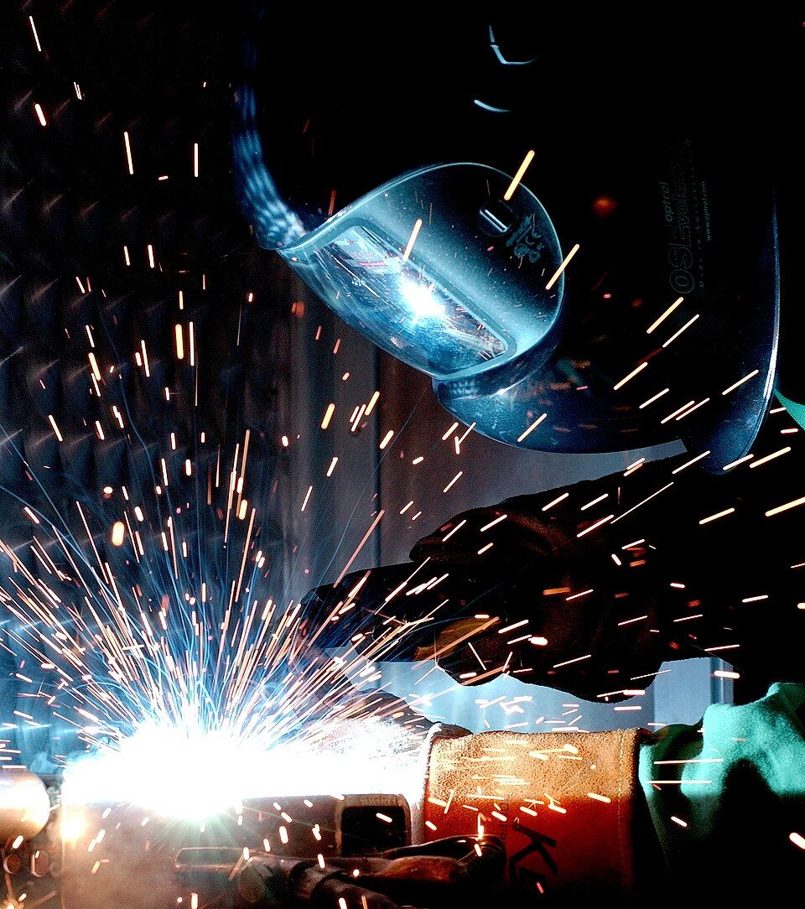

# MIG Welding (GMAW)

> **Node ID**: machine-tools.joining.mig-welding
> **Domain**: [Machine-Tools](./index.md)
> **Dependencies**: See prerequisites
> **Enables**: [`Metal Joining`](joining.md), [`Electricity Generation & Distribution`](../energy/electricity.md)
> **Timeline**: Years 20-50
> **Outputs**: mig_welds
> **Critical**: No

## Overview

> *A man gas metal arc welding (MIG).*

> *Image: William M. Plate Jr., Public domain*

Gas Metal Arc Welding with continuously fed consumable wire electrode and CO₂/Ar shielding gas. Current 100-400A, voltage 16-35V. High deposition rate (2-8 kg/hour). Transfer modes: short-circuit, globular, spray, and pulsed spray. Dominant process for structural fabrication, automotive, and high-production welding.

The transfer mode determines weld pool behavior, spatter generation, and position capability. Short-circuit transfer operates at low voltage where the wire touches the weld pool and extinguishes the arc repeatedly, making it suitable for thin materials and out-of-position welding but producing more spatter. Spray transfer, at higher voltage and current with argon-rich shielding, projects fine droplets across the arc gap in a stable stream, providing high deposition with minimal spatter but limited to flat and horizontal positions.

Pulsed spray transfer combines the advantages of both modes by cycling the current between a peak level that sprays droplets and a background level that maintains the arc without transferring metal. This allows spray-quality deposition at lower average current, enabling out-of-position welding with low spatter. Modern inverter power supplies provide precise pulse control that adapts to wire feed speed changes in real time.

Shielding gas selection affects arc stability, penetration profile, and weld metal chemistry. Pure CO₂ provides deep penetration at low cost but generates more spatter. Argon-CO₂ blends (75/25 or 80/20) offer a good balance for mild steel. Argon-helium-CO₂ triple mixes are used for stainless steel and some aluminum applications.

## Why Transfer Modes Exist

The transfer mode describes how molten metal moves from the wire tip to the weld pool. It is determined by the interaction of three forces: gravity pulling the droplet down, electromagnetic force (Lorentz force) pushing it away from the wire tip, and surface tension holding it to the wire. As current increases, the electromagnetic force overcomes surface tension, changing the transfer mode.

- **Short-circuit transfer** (16-20V): At low voltage, the wire feeds into the pool faster than it melts. The wire physically touches the pool, short-circuiting the arc. The short-circuit current spike rapidly melts the wire, and surface tension pulls the molten ball into the pool. This cycle repeats 20-100 times per second. The result is a cold, controllable process ideal for thin materials and out-of-position welding, but the repeated short circuits produce spatter. Heat input is low because the arc is extinguished during each short circuit.
- **Globular transfer** (20-24V): At medium voltage with CO₂-rich shielding, droplets grow to 1-3 times the wire diameter before detaching. Gravity and electromagnetic force must overcome the large surface tension of the big droplet. The large, erratic droplets produce irregular bead shape and moderate spatter. This mode is the least controlled and is generally avoided in production, though it occurs naturally at intermediate settings.
- **Spray transfer** (25-35V, argon-rich gas): At high voltage with argon-rich shielding (80%+ Ar), electromagnetic pinch force dominates surface tension. Droplets are smaller than the wire diameter (0.5-0.8×) and stream across the arc gap in a stable cone. The continuous arc produces smooth, spatter-free welds at high deposition rates. The physics: at high current density in argon, the Lorentz force (proportional to I²) exceeds surface tension (proportional to droplet radius), producing many small droplets instead of one large one. Spray transfer requires argon-rich gas because CO₂ changes the arc plasma characteristics, raising the transition current above practical levels.
- **Pulsed spray** (inverter power supply): The power supply alternates between a peak current (above spray transition threshold, 300-500A for 1.2 mm wire) and a background current (below it, 50-100A). During the peak pulse, one droplet detaches in spray mode. During background, the arc maintains but no metal transfers. This gives spray-quality droplets at an average current low enough for out-of-position welding and thin materials. The pulse frequency (30-300 Hz) controls the droplet rate.

### Recommended Parameters by Material and Thickness (Mild Steel)

| Thickness | Joint Type | Wire Dia. (mm) | Wire Feed (m/min) | Voltage (V) | Current (A) | Transfer Mode | Gas |
|-----------|-----------|----------------|-------------------|-------------|-------------|--------------|-----|
| 1.0 mm | Square butt | 0.6-0.8 | 3-5 | 16-18 | 60-100 | Short-circuit | 75/25 Ar/CO₂ |
| 1.5 mm | Square butt | 0.8 | 4-6 | 17-19 | 80-130 | Short-circuit | 75/25 Ar/CO₂ |
| 3 mm | Square butt | 0.9-1.0 | 5-7 | 18-20 | 120-160 | Short-circuit | 75/25 Ar/CO₂ |
| 6 mm | V-groove | 1.0 | 5-7 | 20-22 | 140-180 | Globular/short | 75/25 Ar/CO₂ |
| 6 mm | Fillet | 1.0 | 6-8 | 20-22 | 160-200 | Globular/short | 75/25 Ar/CO₂ |
| 10 mm | V-groove | 1.2 | 8-12 | 24-28 | 220-300 | Spray | 90/10 Ar/CO₂ |
| 12 mm | V-groove | 1.2 | 10-14 | 26-30 | 260-350 | Spray | 90/10 Ar/CO₂ |
| 20 mm | V-groove | 1.6 | 5-8 | 28-32 | 300-400 | Spray | 90/10 Ar/CO₂ |

Primary outputs: `mig_welds`.

GMAW was developed during the mid-20th century as a faster alternative to shielded metal arc welding (stick welding), using a continuously fed wire electrode that eliminated the need to stop and change electrodes. The process quickly gained acceptance in shipbuilding and defense manufacturing during wartime production acceleration.

MIG welding is by far the most widely used arc welding process in structural fabrication, automotive manufacturing, and general metalworking. The combination of high deposition rate, continuous operation (no electrode changes), adaptability to robotic automation, and relatively low operator skill requirements makes it the default choice for joining steel, stainless steel, and aluminum in thicknesses from 1mm sheet to heavy structural sections.

## Prerequisites

### Materials

- Consumable wire electrode matching base metal: ER70S-6 for carbon steel, ER308L/309L/316L for stainless, ER4043/5356 for aluminum
- Shielding gas: CO₂, argon, or blends (75/25 Ar/CO₂ for mild steel, trimix for stainless, pure argon for aluminum)
- Anti-spatter compound or gel for nozzle and contact tip protection (optional)

### Equipment

- MIG welding power supply (constant voltage type, 150-400A output)
- Wire feeder (push, pull, or push-pull type) with drive rolls matched to wire diameter
- Welding torch with contact tip, gas diffuser, nozzle, and liner
- Gas cylinder with flow regulator (10-25 L/min typical)

### Knowledge

- Metal transfer modes and their parameter windows: short-circuit (16-20V), globular (20-24V), spray (24-35V with argon-rich gas)
- Shielding gas selection for different base metals and transfer modes
- Wire feed speed, voltage, and their relationship to deposition rate and heat input
- Contact tip and nozzle maintenance for consistent wire feed and gas coverage
- Joint design and weld procedure qualification per applicable code (AWS D1.1 for structural steel)

### Infrastructure

- Welding booth with fume extraction hood rated for the wire and base metal being used
- Secured gas cylinder storage with chain or strap restraints (cylinders are projectiles if valve breaks)
- Power supply on dedicated circuit with proper ground (MIG draws 20-50A at 240V)
- Wire storage in dry conditions (surface rust on wire causes erratic feed and porosity)

## Process Description

The MIG welding torch feeds a continuous wire electrode through a contact tip that conducts welding current to the wire. The arc melts the wire tip and the base metal, forming a weld pool. Shielding gas flows through the nozzle surrounding the contact tip, displacing air from the arc and weld pool. The wire feeder pushes wire from a spool through the torch liner at a controlled speed. Constant voltage power supply maintains arc length automatically: as the wire feeds faster, current increases to melt more wire and maintain the arc gap.

### Step-by-Step Procedure

1. Select wire electrode and shielding gas for the base metal. Load wire onto the feeder spool, thread through the liner and contact tip. Select the correct contact tip size for the wire diameter (0.6, 0.8, 0.9, 1.0, or 1.2 mm).
2. Set wire feed speed and voltage per the welding procedure specification. For 1.0 mm ER70S-6 wire on 6 mm steel: 5-7 m/min wire feed, 20-22V, short-circuit or globular transfer. For spray transfer on thicker material: 10-14 m/min, 26-30V, with 90/10 Ar/CO₂ gas.
3. Set shielding gas flow to 12-18 L/min for typical joint configurations. Higher flow (20-25 L/min) for outdoor or drafty conditions. Too much flow causes turbulence that draws air in.
4. Clean the joint surfaces to bare metal. Remove mill scale, rust, oil, paint, and zinc coatings from the weld zone. Grind to bright metal for critical joints.
5. Position the torch at 10-15° push angle (electrode pointing in the direction of travel) for flat and horizontal welding. Use a slight drag angle for vertical-up welding. Maintain 10-15 mm stick-out (distance from contact tip to workpiece).
6. Initiate the arc by pulling the trigger (wire feed, gas flow, and current start simultaneously). Move along the joint at a steady speed. Watch the weld pool shape and listen to the arc sound: a steady crackle indicates proper short-circuit transfer; a harsh buzz indicates voltage is too low; a hissing sound indicates voltage is too high.
7. Fill the joint with the required number of passes. Root pass first at lower current, followed by fill passes, then a cap pass. Clean slag and spatter between passes.
8. Inspect the completed weld visually for bead profile, undercut, porosity, and spatter.

The MIG arc operates in constant voltage mode, which means the power supply automatically adjusts current to maintain arc length. If the torch moves closer to the workpiece (shorter stick-out), the voltage drop decreases and the power supply reduces current, preventing burn-through. If the torch moves away, current increases to melt more wire and maintain the arc. This self-regulating characteristic is one reason MIG welding is easier to learn than TIG: the arc length largely takes care of itself.

Push-pull wire feeding is used for aluminum MIG welding, where the soft aluminum wire tends to buckle in the liner if pushed from the feeder. A pull motor in the torch handpiece works in coordination with the push motor at the feeder to maintain consistent wire tension. This adds cost and complexity but is essential for aluminum wire diameters below 1.2mm. For steel wire, push-only feeding is sufficient.

### Process Parameters

| Parameter | Range | Notes |
|-----------|-------|-------|
| Wire Diameter | 0.6-1.6 mm | 0.6-0.8 mm for thin sheet; 1.0-1.2 mm for structural; 1.4-1.6 mm for heavy fab |
| Wire Feed Speed | 2-15 m/min | Higher speed = higher deposition and current |
| Voltage | 15-35V | 15-20V for short-circuit; 22-28V for globular; 25-35V for spray |
| Current | 100-400A | Automatically set by wire feed speed and voltage |
| Shielding Gas Flow | 10-25 L/min | 12-18 L/min typical; higher for outdoor work |

Wire electrode selection must match the base metal composition and the mechanical property requirements of the joint. For carbon steel, ER70S-6 wire with 75/25 argon-CO₂ shielding is the most common combination. Stainless steel requires matching alloy wire (ER308L, ER309L, ER316L) with trimix shielding gas. Aluminum MIG uses ER4043 or ER5356 wire with pure argon shielding. Flux-cored wires (E71T-1, E71T-11) provide their own shielding and are used where wind or draft conditions make gas-shielded welding impractical.

The choice between solid wire and flux-cored wire depends on the application. Solid wire with external gas shielding produces cleaner welds with less spatter and is preferred for shop fabrication. Flux-cored wire provides deeper penetration and tolerates surface contamination better, making it preferred for field welding on construction sites where wind would blow away shielding gas and mill scale is common on structural steel.

## Safety Considerations

MIG welding generates high levels of welding fume and intense ultraviolet radiation. The combination of high current, shielding gas cylinders, and hot spatter creates multiple hazard categories that must be controlled simultaneously.

- **Welding fumes**: MIG welding fume contains metal oxides from the wire and base metal. Welding galvanized steel generates zinc oxide fume that causes metal fume fever (flu-like symptoms). Stainless steel fume contains hexavalent chromium, a carcinogen. Adequate local exhaust ventilation at the arc is required.
- **Arc radiation (UV)**: The MIG arc emits intense ultraviolet radiation that causes welder's flash (photokeratitis), a painful inflammation of the cornea, from even brief unprotected exposure. Reflected UV from nearby walls can cause burns on exposed skin.
- **Spatter and fire**: Short-circuit transfer mode generates hot spatter that travels several meters. Spatter ignites clothing, paper, solvents, and other combustibles in the work area. Fire watch required for 30 minutes after welding in areas with combustible materials.
- **Compressed gas cylinders**: Shielding gas cylinders at 200 bar pressure become projectiles if the valve is damaged. Secure cylinders upright with chains or straps.

- **Burns from hot metal**: MIG spatter travels several meters from the arc. Flame-resistant clothing (welding jacket, no synthetic fabrics that melt onto skin) is mandatory. Leather gloves with gauntlet cuffs protect wrists.

### Personal Protective Equipment

- Welding helmet with auto-darkening filter (shade 10-13) with proper filter rating for the current level
- Flame-resistant clothing (welding jacket, no synthetic fabrics that melt onto skin)
- Leather gloves with gauntlet cuffs to protect wrists from spatter and UV burns
- Safety glasses under the helmet for eye protection during chipping and grinding between passes
- Steel-toe boots for handling heavy workpieces and fixtures
- Respiratory protection when fume extraction is insufficient or when welding galvanized or coated materials

### Emergency Procedures

- Maintain welding fume extraction system operation verification log; check flow at the hood before each shift
- Post cylinder handling and securing procedures at gas storage area; chain cylinders upright at all times
- Fire watch for 30 minutes after welding in areas with combustible materials within 10 meters
- First aid kit with burn treatment supplies and eye wash station
- Train all personnel on metal fume fever symptoms (chills, fever, nausea) and response (fresh air, medical attention)

## Quality Control

### Acceptance Criteria

- **MIG Welds**: Bead profile smooth and uniform with proper reinforcement height. No undercut exceeding 1 mm. No porosity, slag inclusions, or lack of fusion. Fillet weld leg size within tolerance. Visual acceptance per AWS D1.1 or applicable code.

### Testing Methods

- Visual weld inspection per AWS D1.1 acceptance criteria (bead profile, undercut, porosity, crack indication)
- Magnetic particle testing for surface and near-surface discontinuities in ferromagnetic materials
- Radiographic or ultrasonic examination for internal defects (porosity, slag, lack of fusion)
- Bend testing of groove weld qualification coupons (root bend and face bend)
- Macroetch cross-section for fillet weld profile and penetration verification

### Sampling Protocol

- Verify wire feed speed and gas flow before each shift start using calibrated meters
- Inspect contact tip and liner for wear on daily preventive schedule; replace contact tip when bore becomes ovalized
- Visual inspection of 100% of production welds per applicable code
- Radiographic or ultrasonic examination per code requirements (typically spot or 100% for structural welds)
- Record weld parameters and inspection results for traceability

## Scaling Notes

- **Bench scale**: 150-200A portable MIG welder with 0.8 mm wire. Workshop fabrication and repair. Gas cylinder mounted on the welder cart. Single-operator manual welding.
- **Pilot scale**: 300-400A MIG power supply with separate wire feeder. Structural fabrication shop. Multiple welding stations with centralized gas manifold. Semi-automated fixtures for repetitive joints.
- **Production scale**: Robotic MIG welding cells with arm-mounted wire feeders and through-arm torch cables. Automated fixture loading and unloading. Twin-wire tandem systems for high-deposition heavy fabrication. Hundreds of meters of weld per shift.

Scaling from manual to robotic MIG welding involves more than bolting a torch to a robot arm. Wire feed consistency becomes critical at high duty cycles: the wire feeder must deliver wire smoothly at all arm orientations without tangling. Through-arm cable routing (where the wire, gas, and power conductors pass through the center of the robot arm) reduces cable fatigue and improves reliability. Touch-sensing and arc-voltage tracking systems allow the robot to compensate for part-to-part variation in joint position. Programming for multi-pass welds on thick sections requires careful control of weave pattern, interpass temperature, and deposition sequence.

Wire feed rate is the primary productivity control: higher feed rates increase deposition but require corresponding increases in voltage and current to maintain arc stability. For heavy structural fabrication, twin-wire and tandem MIG systems feed two wires into a single weld pool, nearly doubling deposition rate compared to single-wire operation. Robotic MIG welding cells use wire feeders mounted on the robot arm for consistent feed at any torch orientation.

## Troubleshooting

| Problem | Probable Cause | Solution |
|---------|---------------|----------|
| Excessive spatter | Voltage too low for wire speed, or wrong gas mix | Increase voltage; switch to argon-rich mix for spray transfer; apply anti-spatter to nozzle |
| Porosity in weld | Gas coverage failure, contaminated surface, or wet gas | Check gas flow and nozzle for blockage; clean joint surfaces; verify gas cylinder is not contaminated |
| Bird-nesting (wire tangles in liner) | Wrong liner size, worn drive rolls, or sharp bend in torch cable | Match liner to wire size; replace worn drive rolls; keep torch cable straight during welding |
| Undercut at weld toes | Excessive current or incorrect torch angle | Reduce current; push angle should be 10-15°; slow travel speed at toes |
| Burn-through on thin material | Excessive heat input for material thickness | Switch to short-circuit mode at lower voltage; reduce wire speed; use 0.6-0.8 mm wire; increase travel speed |
| Irregular bead shape | Unsteady hand travel or varying stick-out | Practice consistent travel speed; maintain constant stick-out (10-15 mm); consider mechanized welding for long seams |

## Variations and Alternatives

- **Flux-cored arc welding (FCAW)**: Tubular wire filled with flux instead of solid wire with external shielding gas. The flux core generates its own shielding gas and slag coverage. Self-shielded FCAW eliminates gas cylinders entirely, making it practical for construction site welding and shipbuilding. Produces rougher bead appearance and more spatter but works in wind and draft conditions.
- **Pulsed MIG**: Inverter power supply cycles current between peak and background levels. Provides spray transfer quality at lower average current, enabling out-of-position welding of thin materials with minimal spatter. Requires synergic wire feed and power supply coordination.
- **Surface tension transfer (STT)**: Controlled short-circuit transfer mode producing very low spatter levels. Well-suited for root pass welding of pipe and sheet metal requiring precise heat control.

MIG welding is the most widely used welding process in industry by total weld metal deposited, owing to its high deposition rate, relative ease of learning compared to TIG welding, and adaptability to robotic automation. The continuous wire feed eliminates the need to stop and change electrodes as in shielded metal arc welding, providing higher arc-on time and productivity.

The development of inverter-based power supplies revolutionized MIG welding by providing precise electronic control of current waveform, enabling advanced transfer modes like pulsed spray that were not achievable with older transformer-rectifier machines. MIG welding can be adapted for surfacing and cladding operations by feeding a filler wire that deposits a wear-resistant or corrosion-resistant alloy onto a base metal substrate.

Flux-cored arc welding (FCAW) is a variant of MIG welding that uses a tubular wire filled with flux instead of solid wire with external shielding gas. The flux core provides its own shielding gas generation and slag coverage, making FCAW suitable for outdoor welding where wind would blow away shielding gas. Self-shielded FCAW wires eliminate the need for gas cylinders entirely, at the cost of somewhat rougher bead appearance and more spatter. This makes FCAW practical for construction site welding and shipbuilding.

Joint design for MIG welding follows standard arc welding practice: V-groove, bevel, fillet, and square-butt configurations with appropriate root openings and included angles. Multiple passes fill thicker joints, with the root pass deposited first at lower current, followed by fill passes at higher deposition rates and a cap pass for surface finish.

## References

- [Metal Joining](joining.md) — parent capability
- [Machine-Tools Domain](./index.md) — domain overview and related capabilities
- [Metal Joining](joining.md) — downstream capability
- [Electricity Generation & Distribution](../energy/electricity.md) — downstream capability

### Material Handling

- Keep wire feeder liner clean and replace when wire feed becomes erratic; a clogged liner causes bird-nesting and wire stoppage
- Store welding wire in original packaging with desiccant until loaded; surface rust on wire degrades feed consistency and causes porosity
- Secure gas cylinders upright with chains at all times; never lay a cylinder on its side (liquid CO₂ enters the regulator)
- Replace contact tips when the bore becomes ovalized or when wire sticks in the tip during welding
- Clean the gas nozzle of spatter buildup between welds; blocked nozzle flow causes porosity
- Record wire type, diameter, gas composition, voltage, and wire feed speed for each weld procedure for traceability
- Verify gas cylinder pressure before each shift; low cylinder pressure indicates imminent gas runout mid-weld
- Clean drive rolls and liner when changing wire diameter or material; mixed wire fragments cause feed jams
- Keep fire extinguisher rated for Class B and C (oil and electrical fires) at each welding station
- Check ground clamp connection to the workpiece before each weld; poor ground causes unstable arc and stray current paths
- Inspect nozzle and diffuser for spatter buildup between welds; partial blockage redirects gas flow and causes porosity
- Verify wire feed roll tension: too tight deforms the wire (erratic feed); too loose allows wire slip (stuttering arc)
- Replace contact tip when the bore becomes ovalized or when wire sticks in the tip during welding
- Keep fire extinguisher rated for Class B and C (oil and electrical fires) at each welding station

---
*Part of the [Bootciv Tech Tree](../index.md) · [Machine-Tools](./index.md) · [All Domains](../index.md)*
