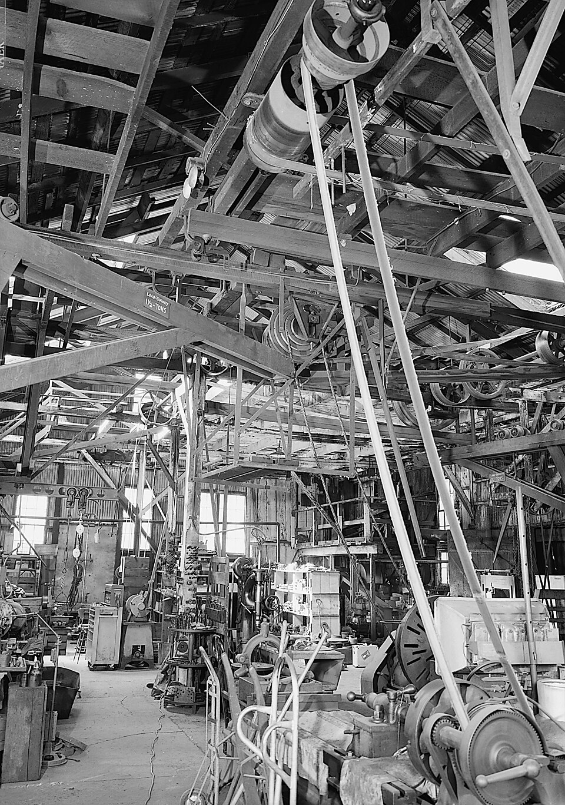

# Belt & Shaft Power Transmission

> **Node ID**: machine-tools.power-transmission
> **Domain**: [Machine Tools Bootstrap](./index.md)
> **Timeline**: Years 10-20
> **Outputs**: transmitted_mechanical_power
> **Dependencies**: [`metals.iron-steel`](../metals/iron-steel.md), [`machine-tools.machining`](./machining.md)
> **Enables**: [`machine-tools.iterative-bootstrap`](./iterative-bootstrap.md), [`energy.steam-power`](../energy/steam-power.md)
> **Critical**: No — mechanical power transmission enables multi-machine shops driven by a single prime mover, but individual machines can be hand-powered or directly driven

This article covers mechanical power transmission systems — belts, shafts, pulleys, and line shaft layouts. For individual prime movers, see [Steam Power](../energy/steam-power.md) and [Electric Motor](../energy/electric-motor.md). For the machine tools driven by these systems, see [Machining](./machining.md).

## Overview

> *Line shaft and belt driven machinery. MACHINE SHOP NORTH/NORTHEAST INCLUDING OVERHEAD LINE SHAFTING. MOSTLY BELT DRIVEN WITH ONE ROPE DRIVEN LATHE IN MIDDLE GROUND. POWER COMES FROM KNIGHT TURBINE ON FAR WALL SHOWN IN K-77, 78 (42') HAER CAL,3-SUCRK,1-45*

> *Image: Jet Lowe, Public domain*

Mechanical power transmission converts rotational energy from a prime mover (water wheel, steam engine, electric motor) into useful work at one or more machine tools. Before individual electric motors on each machine (which required mature electrical infrastructure), every factory and workshop distributed power mechanically through a system of line shafts, counter-shafts, and belts. The technology is simple in principle — wrap a belt around two pulleys — but the engineering of efficient, reliable shaft systems required careful attention to belt tension, shaft deflection, bearing placement, and speed ratios.

During the Industrial Revolution, line shaft systems were the backbone of every factory floor. A single steam engine or water wheel drove a main shaft running the length of the building, with belt-driven takeoffs to each machine. A typical 1870s machine shop had 150-300 m of line shafting driving 20-50 machines. These systems remained common in manufacturing well into the 1920s, and the principles remain relevant for bootstrapping scenarios where electric motors are not yet available or where a single prime mover must serve multiple functions.

Power capacity ranges from fractional horsepower (0.5 kW for a small leather belt driving a single lathe) to 200+ kW for large canvas-rubber belts on main drive shafts. Transmission efficiency per belt stage is 95-98% when properly installed and tensioned. A complete line shaft system with 4-6 belt stages achieves 80-90% overall efficiency from prime mover to final driven machine.

## Prerequisites

- **Materials**: [Iron and steel bar stock](../metals/iron-steel.md) for shafts and pulleys; leather, canvas, or rubber for belts; babbitt metal or bronze for bearings
- **Machine tools**: [Lathe](./machining.md) for turning shafts and pulleys to required diameter and concentricity; [drill press](./machining.md) for bearing housing bolt holes; [milling machine](./machining.md) for keyway cutting
- **Knowledge**: Understanding of torque, RPM, and power relationships (power = torque × angular velocity); belt tension and creep mechanics; shaft deflection and critical speed
- **Infrastructure**: A prime mover (water wheel at 5-30 kW, or steam engine at 10-200 kW); building structure capable of supporting shaft bearings at 3-5 m height; lubrication supply (grease or oil)

## Bill of Materials

Typical materials for a 6 m line shaft section driving 4 machines at 10 kW total:

| Material | Quantity | Source | Alternatives |
|----------|----------|--------|-------------|
| Mild steel shaft stock (50 mm diameter) | 6 m | [Iron & Steel](../metals/iron-steel.md) — turned and ground | Cold-rolled steel (less accurate, requires turning) |
| Cast iron pulleys (200-400 mm diameter) | 8-10 pieces | [Iron & Steel](../metals/iron-steel.md) — cast and machined | Fabricated steel pulleys (welded construction) |
| Leather belting (150 mm wide × 5 mm thick) | 30 m | [Animals](../animals/animal-materials.md) — oak-tanned leather | Canvas belt (lower power, 60-70% of leather capacity); rubber belt (requires vulcanization) |
| Babbitt metal (for bearing liners) | 5 kg | [Metals](../metals/non-ferrous.md) — tin-antimony-copper alloy | Bronze bushings (higher friction, requires machining) |
| Cast iron bearing housings | 6-8 pieces | [Iron & Steel](../metals/iron-steel.md) — castings | Fabricated steel housings (welded plate) |
| Lubricating oil (mineral or vegetable) | 5 liters/month | [Chemistry](../chemistry/lubricants.md) | Lard oil (degrades faster); grease (higher friction at high speed) |
| Steel keys (12 × 8 mm cross-section) | 8-10 pieces | [Iron & Steel](../metals/iron-steel.md) — keystock | Taper pins (less torque capacity) |
| Fasteners (bolts, set screws, hangers) | Assorted | [Machine Tools](./mass-production.md) — standard fasteners | Threaded rod with nuts |

## Process Description

### Belt Drive Principle

A belt transmits power through friction between the belt and pulley surfaces. The driving pulley pulls the tight side of the belt; the slack side returns with lower tension. The difference between tight-side tension (T₁) and slack-side tension (T₂) equals the transmitted force: **effective pull = T₁ - T₂**. Power transmitted: **P = (T₁ - T₂) × v**, where v is belt speed in m/s.

Belt speed is the critical design parameter. Too slow (<5 m/s) wastes belt width capacity. Too fast (>25 m/s) causes centrifugal force that reduces grip, increases belt wear, and generates heat. Optimal range for leather belts: 10-20 m/s. For canvas/rubber belts: 15-25 m/s.

**Speed ratio**: Output RPM = Input RPM × (driving pulley diameter / driven pulley diameter). Maximum practical ratio per belt stage: 5:1 (larger ratios cause excessive wrap angle loss on the small pulley). For larger ratios, use a two-stage reduction with a counter-shaft.

### Shaft Design

Shafts transmit torque from the prime mover or from one pulley to the next. They must resist both torsional stress (from transmitted torque) and bending stress (from belt tension and shaft weight). Shaft deflection between bearings must not exceed 0.0005 × bearing spacing (length) — a 2 m span allows 1.0 mm maximum deflection.

**Construction steps for a 50 mm diameter line shaft section** (6 m long, 4 bearing supports):

1. Select shaft material: cold-drawn or turned mild steel (AISI 1020 or equivalent), 50 mm nominal diameter. Actual diameter after turning: 50.00 mm ±0.05 mm over the full length. Surface finish on bearing journals: 1.6 μm Ra or better (ground finish preferred).
2. Turn the shaft on the [lathe](./machining.md) between centers. Support with a steady rest at 1.5 m intervals to prevent deflection during turning. Rough turn to 50.5 mm diameter, finish turn to 50.00 mm ±0.05 mm.
3. Cut keyways at each pulley location using the [milling machine](./machining.md). Keyway width: 12 mm for 50 mm shaft (per standard key sizing: key width ≈ shaft diameter / 4). Keyway depth: 5 mm from shaft surface. Deburr all keyway edges with a file.
4. Cut the shaft to length (6.00 m ±1 mm). Face both ends. Chamfer edges 1.5 mm × 45°.
5. Install keys in each keyway. Keys should be a snug sliding fit in the keyway — drive in with a soft mallet, no excessive force. Key length: 75-100 mm per pulley.

**Calibration**: Mount the finished shaft between centers on V-blocks. Measure runout at each bearing journal location with a dial indicator: total indicated runout must be <0.05 mm. Measure diameter at each journal with a micrometer: all journals must be within 50.00 mm ±0.05 mm. Check keyway width with slip gauges: 12.00 mm ±0.05 mm. Check keyway depth with a depth micrometer: 5.00 mm ±0.10 mm from shaft OD.

**Expected performance**: Maximum transmitted torque for a 50 mm mild steel shaft at 200 RPM: ~250 N·m (safe shear stress 40 MPa). Maximum power: ~5 kW per shaft section. Critical speed (whirl): 650-800 RPM for a 50 mm shaft on 2 m bearing spacing — never operate within 20% of critical speed.

**Strengths**:
- Simple construction — a turned steel bar with keyways
- Robust and long-lasting with proper lubrication — line shafts run for decades
- Easily extended by coupling additional sections with flanged couplings

**Weaknesses**:
- Long shafts require intermediate bearings every 2-3 m — each bearing adds friction and maintenance
- Shaft alignment is critical — misalignment >0.05 mm per coupling causes vibration and bearing wear
- Heavy — a 50 mm × 6 m steel shaft weighs ~58 kg; requires overhead rigging for installation

### Pulley Design

Pulleys convert torque between shaft and belt. Cast iron is the standard material — it machines well, has adequate strength, and its weight provides flywheel effect that smooths out torque pulsations from reciprocating prime movers.

**Construction steps for a 300 mm diameter flat-belt pulley**:

1. Pattern-make and cast a gray iron pulley blank (AGMA Class 30 or equivalent): 300 mm outside diameter × 150 mm face width × 50 mm bore. Include a web with 4-6 spokes. Cast-in hub with 12 mm keyway slot (or machine keyway after boring).
2. Mount the casting on the [lathe](./machining.md) in a 4-jaw chuck. Bore the hub to 50.00 mm ±0.02 mm (matching shaft diameter). Check bore with an inside micrometer at two positions.
3. Turn the pulley face (belt track surface) concentric with the bore. Mount on a mandrel pressed into the bore. Turn the OD to 300.00 mm ±0.10 mm. Face width is already cast to ~150 mm — clean up both face edges to remove casting flash. Crown the face: machine a slight convex crown, 0.5-1.0 mm higher at center than at edges. The crown keeps the belt tracking on center.
4. Cut the keyway in the hub to match the shaft keyway: 12 mm wide × 5 mm deep. Use the [milling machine](./machining.md) with an end mill.

**Calibration**: Mount the finished pulley on a ground mandrel between centers. Measure face runout with a dial indicator: <0.05 mm total indicated runout. Measure bore diameter with an inside micrometer: 50.00 mm ±0.02 mm. Measure crown height with a straightedge and feeler gauges: 0.5-1.0 mm rise at center relative to edges.

**Expected performance**: Maximum belt speed for cast iron pulleys: 25 m/s (30 m/s for steel pulleys with static balancing). Power capacity for a 300 mm × 150 mm pulley at 200 RPM with a leather belt: ~7.5 kW. Face width determines belt width and thus power capacity — belt width = pulley face width minus 25 mm margin on each side.

**Strengths**:
- Cast iron pulleys are durable and self-damping (vibration absorption)
- Crowned face provides automatic belt centering without guides
- Step-cone pulleys (multiple diameters on one hub) provide discrete speed changes without gearboxes

**Weaknesses**:
- Cast iron is brittle — pulleys crack if dropped or if the shaft jams under load
- Large pulleys (>500 mm) require pattern-making and foundry work — not a quick fabrication
- Crown must be accurately machined — incorrect crown causes belt wander and edge wear

### Belt Fabrication and Splicing

Belts are the wear component of the system. They stretch, degrade, and require periodic replacement. Material choice depends on power level, speed, and available resources.

**Leather belts** (oak-tanned, 4-6 mm thick):
- Power capacity: 0.025-0.040 kW per mm of width at 15 m/s belt speed
- A 150 mm wide leather belt transmits 3.75-6.0 kW at 15 m/s
- Tension: tight side 2.0-2.5 MPa of belt cross-section; slack side 0.5-1.0 MPa
- Service life: 2-5 years with proper maintenance (cleaning, dressing, re-tensioning)
- Splice method: copper-plated wire hooks (lace) for belts up to 100 mm wide; cemented overlap splice (150-200 mm overlap, rubber cement) for wider belts

**Canvas belts** (woven cotton duck, 4-8 plies):
- Power capacity: 60-70% of equivalent leather belt
- A 150 mm wide canvas belt transmits 2.3-4.2 kW at 15 m/s
- Better suited for moist environments (leather rots; canvas resists mildew)
- Splice method: rawhide lacing or wire hooks

**Rubber-impregnated canvas belts** (canvas plies bonded with vulcanized rubber):
- Power capacity: 0.035-0.055 kW per mm of width at 15 m/s
- A 150 mm wide rubber-canvas belt transmits 5.3-8.3 kW at 15 m/s
- Resists oil, moisture, and heat better than plain canvas
- Requires [vulcanization capability](../polymers/rubber.md) for manufacture and for field splicing

**Belt splice procedure** (wire-hook lacing for a 150 mm leather belt):
1. Square-cut both belt ends with a sharp knife and straightedge. The cut must be exactly perpendicular to the belt edge — check with a square.
2. Place the belt end on a hardwood backing block. Punch lacing holes with a belt punch: 6 mm from the end edge, spaced 20 mm apart across the width. Use 5 mm diameter holes for belts up to 5 mm thick.
3. Insert steel wire hooks (No. 5 size for 150 mm belt) through the holes from the flesh side. Curl the hook points back into the belt surface. Repeat on the other belt end.
4. Lace the two ends together with a rawhide or steel connecting pin inserted through the interlocked hooks. The pin diameter must match the hook curve — typically 4-5 mm.

**Calibration**: Tension the installed belt by adjusting the counter-shaft position (or motor slide base). Measure tension by deflecting the belt at mid-span with a spring scale: for a 150 mm belt on 2 m centers, 10 mm deflection should require 15-25 N of force (corresponds to ~2.0 MPa initial tension). Use a belt tension gauge if available.

**Expected performance**: Belt creep (speed loss from elastic stretch): 1-2% under rated load. Belt slip under overload: begins at 150% of rated load — slip generates heat and rapid wear. Efficiency per belt stage: 95-98% at proper tension.

**Strengths**:
- Belts absorb shock loads and vibration — protect both prime mover and driven machine from sudden overloads
- Clean disengagement — a belt can be shifted off the pulley to disconnect a machine without stopping the line shaft
- Low cost relative to gears for the same power level

**Weaknesses**:
- Not synchronized — belt creep (1-2%) and potential slip mean the driven speed is not exactly proportional to the driving speed
- Require periodic re-tensioning as the belt stretches (leather stretches 2-5% in the first month of use)
- Leather belts degrade in oily or wet environments — rubber-canvas belts are better for such conditions

### Line Shaft Layout

A line shaft is a horizontal shaft running the length of a workshop, supported by overhead bearings hung from the ceiling joists or from dedicated support frames. Each machine connects to the line shaft via a counter-shaft and belt.

**Layout procedure for a 4-machine workshop** (12 m × 6 m floor plan):

1. Determine machine positions on the floor plan. Place heavy machines (lathes, milling machines) near columns or walls for floor support. Allow 1.0-1.5 m clearance around each machine for operator access.
2. Mark the line shaft centerline on the ceiling: 3.0-3.5 m above floor level, running the length of the shop. The shaft must be parallel to the long wall within 2 mm over 12 m — use a taut wire and turnbuckles for alignment.
3. Install bearing hangers at 2.0-2.5 m intervals. Each hanger is a cast iron bracket bolted to the ceiling joist with a split-plummer block housing the babbitt-lined bearing. Use 6-8 hangers for a 12 m shaft.
4. Install the line shaft sections, coupling them with flanged or compression couplings aligned within 0.05 mm runout at each joint.
5. Install the main drive pulley (largest pulley, near the prime mover). Typical diameter: 400-600 mm for a belt from a 2-3 m diameter water wheel pulley running at 50-80 RPM.
6. Install counter-shafts above each machine. Each counter-shaft is a short shaft (0.5-1.0 m) with two pulleys: a large receiving pulley from the line shaft and a small delivering pulley to the machine. Mount on wall brackets or ceiling hangers.
7. Install belts. Shift the counter-shaft bracket to tension each belt (10 mm deflection at 15-25 N for a 150 mm belt on 2 m centers, per belt splice calibration above).
8. Install belt shifters (fork mechanisms) on each counter-shaft to engage/disengage individual machines without stopping the line shaft. A belt shifter is a simple fork that pushes the belt onto or off a loose pulley (a pulley that rotates freely on the shaft, not keyed to it).

**Calibration**: Run the complete system at working speed. Measure vibration at each bearing with a vibration indicator or by touch: perceptible vibration must be minimal — if a coin placed on the bearing housing falls off, vibration is excessive. Check belt tracking: all belts must run centered on their pulleys without edge rubbing. Measure delivered speed at each machine with a tachometer: must be within ±5% of design RPM.

**Expected performance**: Overall transmission efficiency (prime mover to final machine): 80-90% for a system with 2-4 belt stages. Maximum practical line shaft length: 30-50 m with intermediate bearings. Power loss per bearing: 50-150 W depending on shaft diameter and lubrication. A 12 m system with 6 bearings loses 300-900 W to bearing friction.

**Strengths**:
- Single prime mover serves all machines — eliminates need for individual motors or engines
- Machines can be added, removed, or relocated by adjusting counter-shafts and belts
- Simple maintenance — visual inspection of belts, periodic lubrication of bearings

**Weaknesses**:
- Fixed layout — moving a machine requires relocating its counter-shaft and belt
- Noise — a running line shaft system with 4-8 belts generates 75-85 dB ambient noise
- Safety hazard — exposed belts and rotating shafts require guarding (wood or sheet metal enclosures)
- Power is always transmitted — even idle shafts rotate, consuming 5-15% of prime mover output in friction losses

## Quantitative Parameters

### Belt Capacity by Material and Width

| Belt Material | Width (mm) | Thickness (mm) | Speed (m/s) | Power (kW) | Max Pulley Ratio |
|---------------|-----------|-----------------|-------------|------------|------------------|
| Leather (oak-tanned) | 75 | 5 | 10-15 | 1.9-3.0 | 4:1 |
| Leather (oak-tanned) | 150 | 5 | 10-15 | 3.8-6.0 | 4:1 |
| Leather (oak-tanned) | 200 | 6 | 15-20 | 7.5-11.0 | 3:1 |
| Canvas (4-ply cotton) | 100 | 4 | 10-15 | 1.5-2.4 | 4:1 |
| Canvas (4-ply cotton) | 150 | 5 | 15-20 | 3.2-4.5 | 4:1 |
| Rubber-canvas (5-ply) | 150 | 6 | 15-25 | 5.3-8.3 | 4:1 |
| Rubber-canvas (5-ply) | 250 | 8 | 15-25 | 8.8-13.8 | 3:1 |

### Shaft Sizing by Power and Speed

| Shaft Diameter (mm) | Speed (RPM) | Max Torque (N·m) | Max Power (kW) | Max Bearing Span (m) |
|---------------------|-------------|-------------------|-----------------|----------------------|
| 30 | 200 | 55 | 1.1 | 1.5 |
| 40 | 200 | 130 | 2.7 | 2.0 |
| 50 | 200 | 250 | 5.2 | 2.5 |
| 60 | 200 | 440 | 9.2 | 3.0 |
| 75 | 200 | 880 | 18.4 | 3.5 |
| 50 | 400 | 250 | 10.5 | 2.0 |
| 75 | 400 | 880 | 36.8 | 2.5 |

### Bearing Friction Loss

| Shaft Diameter (mm) | Speed (RPM) | Friction Loss per Bearing (W) | Lubricant |
|---------------------|-------------|-------------------------------|-----------|
| 30 | 200 | 20-40 | Grease |
| 50 | 200 | 50-100 | Oil (drip feed) |
| 75 | 200 | 100-200 | Oil (ring oiler) |
| 50 | 400 | 100-200 | Oil (drip feed) |
| 75 | 400 | 200-400 | Oil (ring oiler) |

## Scaling Notes

**Bench scale (single machine, <2 kW)**: A single leather belt 50-75 mm wide on a counter-shaft driven directly from a water wheel or small engine. No line shaft needed — the prime mover drives one machine directly. Minimum infrastructure: two pillow-block bearings, two pulleys, one belt.

**Workshop scale (4-10 machines, 5-20 kW)**: Line shaft running 6-15 m, supported by 4-8 ceiling-mounted bearings. Counter-shafts for each machine. Requires a building with adequate ceiling structure (or a dedicated frame). This is the scale of an 1850s-1880s machine shop.

**Factory scale (20-50 machines, 50-200 kW)**: Multiple line shafts in parallel, interconnected by overhead counter-shafts. Main drive shaft may be 100-150 mm diameter. Requires a rigid building structure and a prime mover of adequate capacity. Power distribution from the main shaft to subsidiary shafts uses wide belts (200-300 mm) running at 15-20 m/s.

**Key scaling bottleneck**: Bearing friction. A factory with 100 bearings at 100-200 W each loses 10-20 kW to friction alone — 5-15% of total power input. Roller bearings (see [Bearings & Abrasives](./bearings-abrasives.md)) reduce friction by 60-80% but require precision manufacturing.

## Troubleshooting

| Problem | Probable Cause | Solution |
|---------|---------------|----------|
| Belt tracks off pulley edge repeatedly | Pulley crown worn flat (<0.3 mm), or shafts not parallel (misalignment >2 mm over 1 m) | Re-machine crown to 0.5-1.0 mm; align shafts to within 1 mm over 1 m using a taut wire reference |
| Belt slips under load (squealing, speed loss >5%) | Insufficient tension, or belt glazed/contaminated with oil | Increase tension by adjusting counter-shaft position; clean belt with warm water and apply belt dressing (rosin-based); replace if leather is oil-soaked |
| Excessive vibration at one bearing (coin falls off housing) | Shaft misaligned at coupling (>0.05 mm runout), or bearing worn (babbitt liner eroded >0.5 mm) | Re-align coupling with feeler gauges; re-pour babbitt liner or replace bearing bushing |
| Belt breaks at splice within 3 months of installation | Splice holes too close to belt edge (<5 mm margin), or wire hooks corroded | Re-splice with holes 6 mm from edge and 20 mm spacing; use galvanized or copper-plated hooks |
| Machine speed lower than design (measured RPM 10%+ below target) | Belt creep from overload, or wrong pulley ratio | Reduce load on the machine; verify pulley diameters with calipers — replace if actual ratio is off by >5% from design |
| Bearing overheating (housing >70°C, oil smoking) | Insufficient lubrication, or shaft misalignment causing edge loading | Increase oil flow (drip feed to 2-3 drops/minute); check alignment with a straightedge across the bearing housing — realign if gap exceeds 0.10 mm |
| Line shaft coupling failure (broken bolts, cracked flange) | Repeated shock loads from machine jams, or coupling misalignment causing fatigue | Install a slip clutch or belt shifter to disconnect the jammed machine; use grade 8.8 bolts in couplings; realign coupling to <0.05 mm runout |

## Safety

- **Rotating shaft hazard**: Exposed line shafts rotating at 150-400 RPM can entangle loose clothing, hair, or rags. Guard all shafts within 2.5 m of floor level with sheet metal or wood enclosures. Entanglement at 200 RPM pulls a limb in within 0.3 seconds — too fast to react.
- **Belt entanglement**: In-running nip points between belt and pulley are the most dangerous locations. A hand caught between belt and pulley at 15 m/s belt speed is drawn in before the operator can release. Install nip-point guards (wood or wire mesh) at all belt-pulley engagement points. Post warning signs at each nip point.
- **Pulley burst**: A cast iron pulley with a hidden casting defect can fracture at speed. Maximum rim speed for cast iron: 25 m/s (equivalent to 1600 RPM for a 300 mm pulley). For higher speeds, use steel pulleys. Inspect pulleys visually before first use — reject any with visible cracks, gas holes, or cold shuts.
- **Overhead shafts**: Line shafts mounted at 3-3.5 m height must be supported by structural members rated for the combined weight of shaft, pulleys, and belt tension. A 6 m shaft with 4 pulleys weighs 100-150 kg — a falling shaft is lethal. Support hangers must be bolted through ceiling joists with load-rated hardware, not screwed into plaster or lightweight framing.
- **Lockout**: Before any maintenance on the line shaft system, disconnect the prime mover and lock the power disconnect in the off position. A locked-out machine cannot be accidentally started by another worker. Install belt shifters at each machine to disengage when not in use.

## Quality Control

- **Shaft straightness**: Support on V-blocks at both ends. Measure runout at the midpoint with a dial indicator: maximum 0.05 mm total indicated runout. Reject shafts with >0.10 mm runout — re-straighten by press or replace.
- **Bore concentricity**: Mount pulley on a mandrel between centers. Measure face runout: <0.05 mm. Bore must be concentric with the turned OD within 0.03 mm.
- **Belt uniformity**: Leather belt thickness must be uniform within ±0.5 mm across the width and along the length. Measure at 5 points along the belt with a thickness gauge. Variations cause uneven tension, tracking problems, and premature edge wear.
- **Alignment check**: After installation, verify shaft alignment with a taut wire reference along the full length. Deviation at any bearing point must be <2 mm from the reference line. Check coupling alignment with feeler gauges: gap variation <0.05 mm around the coupling flange.

## Variations and Alternatives

| Method | Power Range | Efficiency | Complexity | Best For |
|--------|-------------|------------|------------|----------|
| Flat belt on flat pulley | 0.5-50 kW | 95-98% | Low | General-purpose, industrial-era shops |
| V-belt on grooved sheave | 0.5-200 kW | 95-97% | Medium | Higher grip per width, compact drives (requires rubber V-belts) |
| Rope drive (cotton or manila) | 5-100 kW | 90-95% | Low | Long-center drives (>10 m), multiple driven pulleys from one rope |
| Chain drive (roller chain) | 1-100 kW | 97-99% | Medium | Synchronous drives where speed ratio must be exact, no creep |
| Gear drive (spur or helical) | 1-500+ kW | 98-99% | High | Compact, high-ratio, synchronous power transmission — requires precision gear cutting |
| Direct drive (motor-to-machine) | 0.1-500+ kW | 100% | Low | Individual machines with dedicated motors — requires mature electrical infrastructure |

For bootstrapping, flat belts on flat pulleys are the practical first choice. They require only leather (or canvas), iron pulleys, and a turned shaft. V-belts require molded rubber and grooved sheaves. Chain drives require precision pin-and-roller fabrication. Gear drives require [gear-cutting capability](./machining.md). Each upgrade in transmission technology depends on the manufacturing precision available.

**Historical progression**: Water wheel direct drive (pre-1700) → leather belt and wooden shaft (1700-1800) → iron shaft with cast iron pulleys (1800-1850) → line shaft factory systems (1850-1920) → individual electric motor per machine (1920-present).

## See Also

- Prime movers: [Steam Power](../energy/steam-power.md), [Water Turbines](../energy/water-turbines.md)
- Bearing technology: [Bearings & Abrasives](./bearings-abrasives.md)
- Shaft and pulley machining: [Machining](./machining.md)
- Machine tool construction sequence: [Iterative Bootstrap](./iterative-bootstrap.md)
- Metal stock for shafts and pulleys: [Iron & Steel](../metals/iron-steel.md)
- Lubricant production: [Lubricants](../chemistry/lubricants.md)

## References

- Machine tools driven by line shafts: [Machining](./machining.md) — feeds and speeds assume adequate power delivery
- Bearing materials and construction: [Bearings & Abrasives](./bearings-abrasives.md) — babbitt bearing pour procedure
- Metal stock properties: [Iron & Steel](../metals/iron-steel.md) — shaft material selection
- Historical line shaft factories: standard mechanical engineering references describe the transition from line shaft to unit drive (1870-1930)
- Belt power capacity data: based on leather belt manufacturers' engineering tables (Dunlop Leather Belting, 1950s; Rubber Manufacturers Association standards)

---

*Part of the [Bootciv Tech Tree](../index.md) • [Machine Tools Bootstrap](./index.md) • [All Domains](../index.md)*
