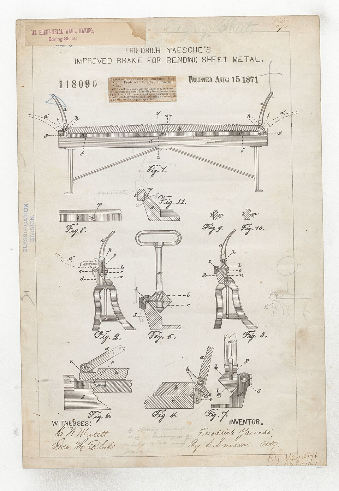

# Sheet Metal Brake

> **Node ID**: machine-tools.sheet-metal-brake
> **Domain**: [Machine Tools](./index.md)
> **Dependencies**: [`metals.iron-steel`](../metals/iron-steel.md), [`machine-tools.machining`](machining.md)
> **Enables**: [`machine-tools.forming`](forming.md), [`construction.structural-engineering`](../construction/structural-engineering.md)
> **Timeline**: Years 10-15
> **Outputs**: bent_sheet, formed_panels, ductwork, boxes
> **Critical**: No — bending can be done in a vise or over an anvil edge for small work, but a brake is the only practical method for producing long, straight, repeatable bends in sheet metal

## Overview

> *Friedrich Yaesche's Improved Brake for Bending Sheet Metal*

> *Image: Department of the Interior. Patent Office. (1849 - 1925), Public domain*

A sheet metal brake clamps a flat sheet between a stationary bed and a clamping bar, then swings a hinged bending leaf upward around the clamp edge to fold the sheet to a precise angle. The bend occurs along a straight line defined by the clamping bar edge. The inner bend radius equals the clamping bar edge radius (typically 1-3 mm for sharp bends). Springback of 2-5° in mild steel and 5-10° in aluminum requires overbending past the target angle. The brake handles sheet metal up to 1.5 m wide and 1.5 mm (mild steel) or 2 mm (aluminum) thick in hand-operated versions.

The sheet metal brake is the simplest machine tool that produces precision results. It has no moving parts beyond hinges and clamping bolts — no gears, no bearings, no power source. Yet it enables the production of ductwork, enclosures, boxes, brackets, cabinet panels, and structural angles that are impossible to make consistently by hand. In the bootstrap sequence, the brake produces: electrical junction boxes, ventilation ducting, machine guards, battery enclosures, solar panel frames, and housing panels. Every downstream system that involves enclosure, ducting, or structural angle depends on the brake's ability to make long, straight, repeatable bends.

Without a brake, sheet metal is bent by clamping it in a vise and hammering it over — a process that produces wavy, inconsistent bends with poor angle control. The brake converts a skilled hand operation into a repeatable machine operation, enabling production quantities of identical parts.

The bend radius is set by the clamping bar edge radius. A sharp edge (0.5 mm radius) produces a tight bend suitable for mild steel and copper. A larger radius (2-3 mm) is needed for aluminum (which cracks at sharp radii) and harder alloys. The minimum bend radius for each material is a function of its ductility: soft aluminum bends at 1× material thickness, stainless steel at 2× thickness. Attempting a sharper bend than the material allows produces cracking along the outer fiber of the bend.

Springback is the other critical parameter. When the bending force is released, the material elastically recovers by 2-5° in mild steel and 5-10° in aluminum. The brake compensates by overbending past the target angle. A stroke limiter with adjustable stops provides consistent overbend without operator judgment. Once calibrated for a specific material and thickness, the stops produce identical bends for the entire production run.

## Prerequisites

- [Steel flat bar and plate](../metals/iron-steel.md) — for bed, clamping bar, and bending leaf
- [Basic machining](machining.md) — for straightening edges, drilling holes, and fitting hinges
- [Drilling capability](machining.md) — for bolt holes and hinge pin holes
- [Measurement tools](../measurement/index.md) — straightedge and protractor for alignment and angle setting
- [Welding capability](welding-equipment.md) — for assembling the frame (or bolted construction as alternative)

## Bill of Materials

| Material | Quantity | Specifications | Source | Alternatives |
|----------|----------|----------------|--------|-------------|
| Steel flat bar (bed) | 10-20 kg | 60 × 8 mm, 1.5 m long, flat and straight | [Iron & Steel](../metals/iron-steel.md) | Cast iron bed (heavier, self-damping) |
| Steel flat bar (clamping bar) | 5-10 kg | 40 × 6 mm, 1.5 m long | [Iron & Steel](../metals/iron-steel.md) | Hardened tool steel edge (longer life) |
| Steel plate (bending leaf) | 10-15 kg | 4-6 mm thick, 150 mm wide × 1.5 m long | [Iron & Steel](../metals/iron-steel.md) | Aluminum plate (lighter, less rigid) |
| Steel angle iron (frame) | 10-20 kg | 50 × 50 × 5 mm, for frame and hinges | [Iron & Steel](../metals/iron-steel.md) | Welded box section (stiffer) |
| Hinge pins | 2-3 | 10 mm diameter steel rod, 100 mm long | [Iron & Steel](../metals/iron-steel.md) | Commercial butt hinges (limited strength) |
| Clamping bolts with nuts | 10-15 | M10 or M12, 80 mm long | [Iron & Steel](../metals/iron-steel.md) | C-clamps (slower to operate) |
| Angle protractor | 1 | 0-180°, 1° graduations | [Measurement](../measurement/index.md) | Bevel gauge (less precise) |
| Steel stand or bench | 1 | Heavy enough to resist bending force without tipping | [Construction](../construction/index.md) | Bolted to existing workbench |

## Process Description

### Bed Preparation

1. **Select the bed bar**: Choose a steel flat bar 60 × 8 mm × 1.5 m long. Inspect for straightness by placing it on a flat surface (surface plate or machined table) — any gap >0.5 mm indicates bow that must be corrected before use.
2. **Straighten the bed bar**: If the bar is bowed, correct by placing it convex-side-up on a flat anvil and striking the high points with a heavy hammer. Check frequently with a straightedge. Target: straight within 0.1 mm over the full 1.5 m length. The top edge of the bed defines the bend line — any waviness reproduces as a wavy bend on every part.
3. **Machine the top edge**: File or mill the top edge (the edge the sheet wraps around) to a slight radius of 0.5-1.0 mm. A sharp 90° edge causes cracking on harder alloys; a small radius produces clean bends on mild steel, aluminum, and copper. The radius must be uniform along the entire 1.5 m length.

### Clamping Bar Preparation

4. **Machine the clamping bar**: File or mill the bottom edge of the clamping bar (40 × 6 mm) flat and straight to 0.1 mm over the full length. This edge presses the sheet against the bed — any waviness produces uneven clamping and a wavy bend line.
5. **Drill clamping bolt holes**: Drill holes through the clamping bar at 100 mm intervals (15 holes for a 1.5 m bar). Use a drill press to maintain perpendicularity. Deburr both sides of each hole. Drill matching holes in a top clamp bar (a second flat bar that sits above the clamping bar and carries the bolt heads). Countersink the top clamp bar holes for flush bolt heads — protruding bolt heads interfere with the bending leaf.

### Frame Assembly

6. **Build the frame**: Weld or bolt a rectangular frame from 50 × 50 × 5 mm angle iron. The frame is approximately 1.6 m wide × 0.6 m deep × 0.9 m tall (standing height). The bed bar bolts to the top front edge of the frame. Cross-brace the frame with diagonal members to prevent racking — the bending force acts horizontally on the bed and can twist an unbraced frame. A fully braced frame should deflect <1 mm under maximum bending load.
7. **Mount the bed bar**: Bolt the bed bar to the top front edge of the frame using M10 bolts at 200 mm intervals. The bed bar's machined top edge faces forward (toward the operator). Shim between the bed bar and frame as needed to achieve perfect straightness — any frame imperfection transfers to the bed bar.
8. **Mount the top clamp bar**: Bolt the top clamp bar to the frame directly above and behind the bed bar, with the clamping bar hanging below it. The clamping bar hangs on the bolts and can be raised or lowered by turning the nuts. The sheet metal slides between the bed bar top edge and the clamping bar bottom edge.

### Bending Leaf and Hinges

9. **Cut the bending leaf**: Cut a steel plate 4-6 mm thick × 150 mm wide × 1.5 m long. File or grind the leading edge (the edge that contacts the sheet during bending) to a 1-2 mm radius. This edge presses against the outside of the bend — it must be smooth to avoid marking the sheet surface.
10. **Install hinge brackets**: Weld three hinge brackets to the underside of the bending leaf, positioned 100 mm from each end and one at the center. Each bracket is a pair of steel tabs with a 10.2 mm hole for the hinge pin. Weld matching brackets to the frame, positioned so the hinge pin centerline is directly below the rear edge of the bed bar. The hinge pin axis defines the bend axis — it must be exactly parallel to the bed bar top edge within 0.2 mm over the full length.
11. **Insert hinge pins**: Slide 10 mm steel rods through the matching bracket holes. The pins should rotate freely with <0.1 mm clearance. If the pins bind, the bending leaf will not swing smoothly and the bend angle will vary along the length. Secure pins with cotter pins or retaining clips to prevent axial movement.
12. **Add handles**: Weld or bolt a 25 mm diameter steel tube (500-800 mm long) to each end of the bending leaf. Longer handles provide more leverage for thicker material. For 1.5 mm mild steel, 500 mm handles are sufficient; for heavier work, extend to 800 mm.

### Stroke Limiter (Optional but Recommended)

13. **Install adjustable stops**: Weld a bracket to each end of the frame, positioned to contact the bending leaf handles at the desired maximum bend angle. Thread an M12 bolt through each bracket — the bolt tip contacts the handle and limits the bending leaf travel. Adjust the bolt depth to set the bend angle. Lock with a jam nut. This allows repeatable bends without measuring each one — set once, bend 100 identical parts.

### Calibration

14. **Edge straightness verification**: Place a precision straightedge against the bed bar top edge and the clamping bar bottom edge. No gap should exceed 0.1 mm. If gaps are found, shim behind the bars or re-machine the edges.
15. **Hinge alignment check**: Swing the bending leaf through its full range (0-135°). It should move smoothly without binding or lateral play. Measure the gap between the bending leaf leading edge and the bed bar top edge at both ends — the gap should be equal within 0.2 mm. If not, adjust the hinge bracket positions.
16. **Angle calibration**: Clamp a 1 mm mild steel test piece. Bend to a nominal 90° using the stroke limiter. Measure the actual angle with a protractor. Adjust the stroke limiter to compensate for springback — typically set to 93-95° for a 90° bend in mild steel, 95-100° for aluminum.
17. **Repeatability test**: Bend 5 identical test pieces to the same angle setting. Measure all 5 with a protractor. The bend angle must be repeatable within ±1°. If variation exceeds ±1°, check for loose hinge pins, frame racking, or uneven clamping bolt torque.

**Expected performance**: Maximum sheet width: 1.5 m. Maximum thickness: 1.5 mm mild steel (hand-operated). Bend angle range: 0-135°. Angle repeatability: ±1° with stroke limiter. Springback: 2-5° mild steel, 5-10° aluminum.

## Quantitative Parameters

| Parameter | Value |
|-----------|-------|
| Maximum sheet width | 1.5 m (bed length) |
| Maximum thickness (mild steel) | 1.5 mm (hand-operated) |
| Maximum thickness (aluminum) | 2.0 mm (hand-operated) |
| Minimum bend radius | 1-3 mm (clamping bar edge radius) |
| Bend angle range | 0-135° (depending on frame design) |
| Angle repeatability | ±1° (with stroke limiter) |
| Springback (mild steel) | 2-5° |
| Springback (aluminum) | 5-10° |
| Clamping bolt spacing | 100 mm |
| Bending force (1 mm steel, 1 m bend) | 250-400 N at handle end |
| Bending force (1.5 mm steel, 1 m bend) | 600-900 N at handle end |

### Bending Force by Material and Thickness (1 m bend length)

| Material | 0.5 mm | 1.0 mm | 1.5 mm | 2.0 mm |
|----------|--------|--------|--------|--------|
| Mild steel | 60-100 N | 250-400 N | 600-900 N | 1000-1500 N |
| Aluminum 6061 | 25-40 N | 100-160 N | 250-400 N | 450-700 N |
| Copper | 35-60 N | 150-250 N | 350-550 N | 600-1000 N |
| Stainless 304 | 100-160 N | 400-650 N | 900-1400 N | 1600-2500 N |

Note: Forces are measured at the handle end (500 mm from hinge). A 1.5 m brake with 800 mm handles provides additional mechanical advantage for heavier material.

### Springback Compensation by Material

| Material | Thickness (mm) | Target Angle | Overbend Setting |
|----------|----------------|-------------|-----------------|
| Mild steel | 0.5-1.0 | 90° | 93° |
| Mild steel | 1.0-1.5 | 90° | 95° |
| Aluminum (6061) | 0.5-1.0 | 90° | 95° |
| Aluminum (6061) | 1.0-2.0 | 90° | 100° |
| Copper | 0.5-1.5 | 90° | 92° |

### Box Fabrication Bending Sequence (200 × 150 × 100 mm Box, 1 mm Steel)

| Step | Operation | Bend Line | Bend Angle | Notes |
|------|-----------|-----------|------------|-------|
| 1 | Clamp sheet at 100 mm from edge | 100 mm | 90° | First long side |
| 2 | Clamp at 200 mm from first bend | 200 mm | 90° | Second long side (opposite) |
| 3 | Clamp at 100 mm from second bend | 100 mm | 90° | First short side |
| 4 | Clamp at 150 mm from third bend | 150 mm | 90° | Second short side |
| 5 | Corner seams | — | — | Rivet or spot-weld corners |

Note: Steps 3 and 4 require removing the clamping bar at the ends to avoid interfering with previously-bent flanges. A finger brake (box-and-pan) simplifies this.
| Stainless steel | 0.5-1.0 | 90° | 96° |

### Minimum Bend Radius by Material

| Material | Minimum Inner Radius |
|----------|---------------------|
| Soft aluminum | 1× thickness |
| Half-hard aluminum | 2× thickness |
| Mild steel | 1× thickness |
| Stainless steel | 2× thickness |
| Copper | 0.5× thickness |

## Scaling Notes

- A 1.5 m hand brake handles most enclosure and ductwork needs for the bootstrap sequence. Ductwork, junction boxes, battery enclosures, and machine guards all use bends under 1.5 m long.
- For sheet metal >1.5 mm thick in steel, hand force is insufficient. Options: (a) use a [hydraulic press](hydraulic-press.md) with a V-die (press brake), which can bend 3-6 mm steel; (b) build a longer-handled brake with a heavier frame; (c) use a floor-mounted lever brake with mechanical advantage.
- For bends >1.5 m long, weld multiple bed bars end-to-end with aligned edges. The frame must be correspondingly longer and more heavily braced. A 3 m brake requires a steel frame (timber is not rigid enough at this span).
- Production brakes add quick-release cam clamps instead of threaded bolts, reducing setup time from 60 seconds to 5 seconds per bend. Cam clamps are eccentric levers: a 180° rotation of the lever raises or lowers the clamping bar by 3-5 mm.
- Box-and-pan brakes add removable finger segments to the clamping bar, allowing bends that are not full-width (e.g., bending the sides of a box while leaving the corners unbent). Build finger segments 50-100 mm wide that bolt to the top clamp bar individually.

## Troubleshooting

| Problem | Probable Cause | Solution |
|---------|---------------|----------|
| Wavy bend line | Bed bar not straight; uneven clamping | Re-straighten bed bar to <0.1 mm deviation; tighten all clamping bolts uniformly |
| Unequal bend angle along length | Hinge pins misaligned; frame racking | Shim hinge brackets; add cross-bracing to frame |
| Sheet cracks at bend (steel) | Bend radius too small; material at fault | Increase clamping bar edge radius to 2-3 mm; check material grade (some high-carbon steels cannot be sharp-bent) |
| Sheet cracks at bend (aluminum) | Material work-hardened; bend radius too small | Anneal aluminum before bending (heat to 350-400°C, air cool); increase bend radius |
| Springback exceeds expected value | Wrong material grade; thickness variation | Measure actual thickness; do a test bend and adjust overbend setting for the specific batch |
| Clamping bolts loosen during bending | Bolt holes elongated; insufficient torque | Weld the top clamp bar to the frame; use lock nuts; increase bolt diameter to M12 |
| Bending leaf does not return to start | Hinge pins binding; debris in hinge | Clean and lubricate hinge pins; check for bent pins; ream hinge holes for proper clearance |
| Marked sheet surface | Rough bending leaf edge; debris on bed bar | Polish bending leaf leading edge; clean bed and clamp bars before each use |
| Bending force exceeds operator strength | Material too thick; bend length too long for hand operation | Reduce bend length (make multiple shorter bends); switch to a [hydraulic press brake](hydraulic-press.md); use a longer handle for more leverage |
| Angle varies between identical pieces | Clamping bolts not torqued evenly; frame racking progressive | Tighten clamping bolts in alternating sequence from center outward; check frame for loose bolts after every 50 bends |

## Safety

- **Pinch points (clamping bar)**: The clamping bar closes on the bed with several hundred newtons of force when bolts are tightened. Fingers caught between clamp and bed are crushed. Keep hands clear of the clamping area while tightening bolts. Use a push stick or pliers to position small workpieces.
- **Pinch points (bending leaf)**: The bending leaf swings upward with 10-15 kg of mass. When released after a bend, it falls by gravity. Keep fingers away from the hinge area and the path of the falling leaf. Install a friction brake or counterbalance spring if the leaf fall is uncontrolled.
- **Sharp sheet metal edges**: Sheet metal edges are razor-sharp after cutting or shearing. Cuts from sheet metal are deep and ragged. Wear leather gloves when handling sheet stock. File or deburr edges before inserting into the brake.
- **Flying clamping bolts**: If a clamping bolt strips its threads or the clamp bar cracks, the stored elastic energy in the bent sheet can launch the clamp bar upward. Inspect clamp bar and bolts for cracks and thread wear. Replace any bolt that shows signs of fatigue (stretched threads, necking).

## Quality Control

1. **Bed straightness inspection**: Before each production run, check the bed bar top edge with a straightedge. Any deviation >0.2 mm will produce visible bend waviness. Re-shim or re-machine if necessary.
2. **Angle verification**: For production runs, bend the first piece and measure with a protractor before continuing. Verify every 10th piece if the run exceeds 20 parts. Record the measured angles — if they drift, the stroke limiter has shifted or the frame is racking.
3. **Bend radius consistency**: The inner bend radius should be uniform along the full bend length. Inspect with a radius gauge. Variation >0.5 mm indicates uneven clamping or a bed bar that is not straight.
4. **Springback tracking**: Springback varies with material batch and temper. When starting a new batch of sheet metal, always do a test bend first and re-calibrate the overbend setting. Do not assume the previous batch's settings apply.
5. **Surface finish check**: The brake should not mark or scratch the sheet surface. Inspect bent parts for score marks (caused by rough bed or clamp edges) and indentations (caused by debris trapped between clamp and sheet). Polish the bed and clamp edges and clean before each use.
6. **Clamp bar wear**: Inspect the clamping bar edge for rounding or nicks after each production run. A rounded edge produces a larger-than-expected bend radius. Re-machine the edge to the specified 0.5-1.0 mm radius when rounding exceeds the specification.
7. **Hinge pin wear**: Check hinge pins for scoring or elongation of the pin holes annually. Worn pins produce lateral play in the bending leaf, causing angle variation along the bend length. Replace pins and ream the holes if clearance exceeds 0.2 mm.

## Variations and Alternatives

- **Finger brake (box-and-pan brake)**: The clamping bar is made of removable finger segments (50-100 mm wide) rather than a single continuous bar. This allows bending the sides of a box while leaving the corners unbent — essential for making rectangular boxes, trays, and enclosures. The fingers are individually bolted to the top clamp bar and can be removed or repositioned as needed.
- **Press brake (hydraulic)**: A [hydraulic press](hydraulic-press.md) fitted with a V-die upper punch and V-die lower die. The punch presses the sheet into the V-opening, producing a bend. Handles much heavier material (3-10 mm steel) and longer lengths (2-4 m). The tonnage calculation: P = 650 × S² × L / V, where P = force (kN), S = thickness (mm), L = bend length (mm), V = V-die opening (mm). For example, bending 3 mm mild steel 1000 mm long in a 24 mm V-die requires 244 kN (~25 tonnes).
- **Cornice brake**: Similar to the hand brake described here but with a solid clamping bar that is the full width of the machine. Cannot make box bends. Simpler construction. The standard form for long, straight bends in ductwork and panels.
- **Slip roll**: For cylindrical bends (round ductwork, cylinders, cones), a slip roll (three-roll bender) curves sheet metal between adjustable rollers. Not a replacement for a brake — it makes curved shapes, not sharp bends. See [Rolling Mill](rolling-mill.md) for roller construction principles.
- **Hand bending over an edge**: For small work (<300 mm) and non-critical angles, clamping sheet in a vise with a hardwood block and bending by hand or with a mallet works. No machine construction required. Not repeatable enough for production.
- Sheet metal preparation: Remove burrs from sheared edges before bending — burrs create stress concentrators that initiate cracks at the bend line. Deburr with a file or rotary deburring tool. Cut edges should be perpendicular to the sheet surface — angled cuts produce uneven bends.
- Bending sequence for boxes: When making a box with four sides, bend the two opposite sides first, then the remaining two. Bending in adjacent sequence causes the previously-bent flange to interfere with the clamping bar on the next bend. Plan the bend order before starting.
- Hemming and seaming: A hem fold (bending the sheet edge back on itself) reinforces the edge and eliminates the sharp raw edge. Set the clamping bar to expose 5-8 mm of sheet, bend to 180°. For a seam (interlocking two sheet edges), bend one edge up and the other down, then hook together and flatten with a mallet. Hems and seams are essential for ductwork joints.
- Bending force calculation: F = k × TS × t² × L / (V × 1000), where k = 1.33 for V-bending, TS = tensile strength (MPa), t = thickness (mm), L = bend length (mm), V = V-die opening (mm). For mild steel (TS = 400 MPa), 1.5 mm thick, 1000 mm bend length, V = 12 mm: F = 1.33 × 400 × 1.5² × 1000 / (12 × 1000) = 100 kN (~10 tonnes). This exceeds hand-brake capacity — use a [hydraulic press brake](hydraulic-press.md) for this combination.
- Maintenance schedule: Inspect the bed bar straightness before each production run. Check hinge pins for play monthly. Lubricate hinge pins with light oil weekly. Re-torque all frame bolts monthly during the first year of use (timber frames settle). Inspect the clamping bar edge for rounding every 1000 bends — re-machine when edge radius exceeds specification.
- Bend allowance calculation: When bending sheet metal, the total developed length (flat pattern length) differs from the sum of the finished dimensions. The bend allowance accounts for the material stretch at the outer fiber and compression at the inner fiber. For mild steel at 90° with a bend radius equal to material thickness: bend allowance ≈ 1.57 × (radius + 0.33 × thickness). Subtract the bend allowance from the sum of the two flange lengths to get the flat pattern length.
- Material handling for long bends: Sheet metal longer than 1 m is difficult for one person to position accurately in the brake. Use a roller stand (a freewheeling roller at table height) positioned at each end of the brake to support the sheet during positioning. This prevents the sheet from drooping and ensures the bend line is positioned accurately against the bed bar edge.
- Galvanized sheet precautions: Bending galvanized (zinc-coated) sheet metal causes the zinc coating to crack and flake at the bend line. This is cosmetic, not structural — the underlying steel is still protected. However, welding near a galvanized bend produces zinc oxide fumes, which cause metal fume fever (flu-like symptoms lasting 24-48 hours). Grind off the zinc coating within 50 mm of any weld location.

## References

- [Forming](forming.md) — sheet metal bending operations, springback compensation, and tonnage calculations
- [Machining](machining.md) — machining operations for straightening edges and drilling hinge holes
- [Hydraulic Press](hydraulic-press.md) — press brake forming for heavier gauge material
- [Iron & Steel](../metals/iron-steel.md) — steel stock for brake construction
- [Rolling Mill](rolling-mill.md) — roller construction for cylindrical bends
- [Welding Equipment](welding-equipment.md) — welding the frame assembly

---
*Part of the [Bootciv Tech Tree](../index.md) • [Machine Tools](./index.md) • [All Domains](../index.md)*
