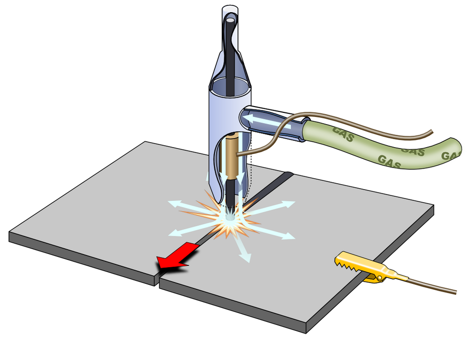

# TIG Welding (GTAW)

> **Node ID**: machine-tools.joining.tig-welding
> **Domain**: [Machine-Tools](./index.md)
> **Dependencies**: [`Vacuum Chambers & Sealing`](../vacuum/chambers.md)
> **Enables**: [`Air Separation & Bulk Gas Production`](../chemistry/air-separation.md), [`Electricity Generation & Distribution`](../energy/electricity.md), [`Metal Joining`](joining.md)
> **Timeline**: Years 20-50
> **Outputs**: tig_welds, orbital_welds, hermetic_seals
> **Critical**: No

## Overview

> *Gas arc welding (TIG &amp; MIG)*

> *Image: Shigeru23, CC BY-SA 3.0*

Gas Tungsten Arc Welding using non-consumable tungsten electrode with argon or helium shielding gas. Current 50-300A, voltage 10-22V. DCEN for steel/stainless/titanium, AC for aluminum. Produces highest-quality welds, essential for stainless steel tubing, vacuum-grade joints, and orbital tube welding for semiconductor gas distribution systems.

TIG welding offers the welder the most control over the weld pool of any arc welding process. The arc is maintained between the tungsten electrode and the workpiece, while filler metal is added separately by hand (or automatically in mechanized systems). This separation of heat source and filler gives precise control over penetration, bead shape, and heat input, making TIG the preferred process for critical joints in pressure vessels, piping systems, and aerospace structures.

The AC mode for aluminum and magnesium alternates between electrode-negative (heat in the workpiece) and electrode-positive (cleaning action that breaks up the tenacious aluminum oxide layer). The balance between these half-cycles is adjustable on modern power supplies: more cleaning for heavily oxidized surfaces, more penetration for clean material. DCEN mode is used for steel, stainless steel, titanium, copper, and nickel alloys, providing maximum heat input to the workpiece and minimal tungsten electrode heating.

Orbital TIG welding mechanizes the process for circumferential tube joints, using a rotating weld head that travels around the tube while the tube remains stationary. Programmable controllers adjust current, travel speed, and wire feed as a function of angular position to compensate for gravity effects on the weld pool. This produces consistently high-quality welds in tube-to-tube and tube-to-fitting joints for semiconductor gas distribution systems, pharmaceutical piping, and aerospace fuel lines.

Primary outputs: `tig_welds`, `orbital_welds`, `hermetic_seals`.

TIG welding was developed in the 1930s to address the need for high-quality welding of magnesium and stainless steel in aerospace applications. The process produces the cleanest welds of any arc welding method, requiring no flux and leaving no slag residue that could contaminate the weld or interfere with post-weld inspection.

For semiconductor-grade piping systems, TIG welding is the only acceptable joining method. The requirements for orbital TIG welds in ultra-high-purity gas distribution include complete joint penetration, smooth internal bead profile (to prevent particle entrapment), and no discoloration of the internal surface (indicating oxidation during welding).

TIG welding is the preferred process for welding thin-wall tubing and sheet metal where precise heat control is needed to prevent burn-through. The ability to control heat input independently of filler addition gives TIG unmatched versatility for precision work on stainless steel, titanium, nickel alloys, and other specialty metals.

## Prerequisites

### Materials

- Tungsten electrodes: thoriated (red, DC), ceriated (gray, AC/DC), or lanthanated (gold, AC/DC)
- Filler rod matching base metal composition (ER308L for 304 stainless, ER70S-2 for carbon steel, etc.)
- Argon or helium shielding gas (argon for most applications; helium for deeper penetration on aluminum and copper)
- Argon for back-purging reactive metals (titanium, stainless steel root passes)

### Equipment

- [Vacuum Chambers & Sealing](../vacuum/chambers.md) — tool dependency
- TIG welding power supply (constant current, with AC/DC capability for aluminum work)
- TIG torch with gas lens, ceramic cup, collet, and collet body
- Orbital welding head for tube joints (optional, for production tube welding)
- Gas flow regulator and foot or hand amperage control (foot pedal preferred for manual welding)

### Knowledge

- Tungsten electrode types, preparation (grinding), and contamination effects on arc stability
- AC balance control for aluminum oxide cleaning versus penetration depth
- Gas lens function and cup size selection for shielding coverage on reactive metals
- Pulsed TIG parameters: peak current, background current, pulse frequency, and duty cycle for thin-material control
- Orbital weld programming: current, travel speed, and wire feed schedules as a function of angular position

### Infrastructure

- Welding station with argon gas supply and flow regulation (separate lines for torch and back purge)
- Orbital welding head enclosure for tube joint applications with enclosed purge chamber
- Tungsten electrode grinding station with dedicated wheel (no cross-contamination from other metals)
- Fume extraction for hexavalent chromium from stainless steel welding
- Dedicated tungsten grinder or electrode sharpener with dust collection (thoriated tungsten dust is hazardous)

## Process Description

The TIG torch holds a non-consumable tungsten electrode centered in a ceramic gas cup. Shielding gas flows through the cup and a gas lens (a porous disc that laminizes the gas flow), creating a smooth envelope of inert gas around the arc and weld pool. The arc is initiated without touching the tungsten to the workpiece: modern power supplies use high-frequency (HF) start, which creates a pilot arc that ionizes the gap. The welder then adds filler rod to the leading edge of the weld pool by hand, controlling the addition rate independently of the arc heat.

### Step-by-Step Procedure

1. Select and prepare the tungsten electrode. For DCEN (steel, stainless, titanium): grind to a sharp point (taper length 2-3 times the electrode diameter) on a dedicated wheel. For AC (aluminum): grind to a rounded or balled tip. Grind parallel to the electrode length, never circumferentially.
2. Select the correct ceramic cup size and gas lens for the application. Larger cups (#6-#8) for titanium and stainless steel that need extended shielding; smaller cups (#4-#5) for tight-access joints. Install the tungsten with 3-6 mm stickout past the cup rim.
3. Clean joint surfaces to bright metal. Stainless steel and titanium require particular attention: use a stainless wire brush (not carbon steel, which embeds iron particles). Remove all oxide, oil, and moisture. For titanium, clean with acetone immediately before welding.
4. Set up back purge if welding stainless or titanium tubing: seal the tube ends, flow argon through the ID at 5-10 L/min to displace air from the root side. Verify oxygen level is below 0.1% with a purge monitor before starting.
5. Set welding parameters: current (50-200A for manual DCEN depending on material thickness), arc length (1-3 mm), and shielding gas flow (8-15 L/min for argon). For AC aluminum: set balance (60-70% EN for clean material, 50-60% EN for oxidized surfaces) and frequency (60-200 Hz).
6. Initiate the arc using HF start. Establish the weld pool. Add filler rod to the leading edge of the pool, not directly under the arc. Control heat input with the foot pedal: ease off the current as the pool approaches the desired size, press harder to increase penetration.
7. Travel along the joint at a steady pace, maintaining consistent arc length. Watch the weld pool shape: a teardrop shape indicates proper travel speed; a round pool means you are going too slow; a narrow trailing pool means too fast.
8. At the weld end, taper the current down gradually using the foot pedal to fill the crater. Abrupt termination leaves a crater crack. Continue shielding gas flow for 5-10 seconds after the arc extinguishes to protect the hot weld bead and tungsten.
9. Inspect the completed weld. TIG welds should have a uniform bead with distinct "stacked dime" ripples. No tungsten inclusions, no discoloration on stainless or titanium (indicates loss of shielding).

The gas lens is a critical component in the TIG torch that many welders overlook. It is a porous sintered metal disc that laminizes the shielding gas flow, creating a smooth, extended envelope of inert gas around the arc. Without a gas lens, the gas flow becomes turbulent just past the cup rim, drawing air into the shielding zone. A gas lens extends effective shielding coverage by 2-3 times compared to a standard collet body, and is essential for welding reactive metals (titanium, stainless steel) and for out-of-position work where gravity affects gas coverage.

Tungsten electrode preparation directly affects arc starting reliability, arc stability, and weld quality. The electrode tip must be ground on a dedicated wheel (never a wheel used for other metals) with the grinding direction parallel to the electrode axis. Circumferential grinding creates microscopic ridges that cause the arc to wander around the tip. A consistent taper angle of 15-30° from the axis produces a stable, concentrated arc. For AC welding on aluminum, the tip forms a natural ball during operation, which is the desired shape for aluminum work.

### Process Parameters

| Parameter | Range | Notes |
|-----------|-------|-------|
| Current (DCEN) | 50-300A | Steel/stainless/titanium; lower for thin material |
| Current (AC) | 80-250A | Aluminum/magnesium; balance and frequency adjustable |
| Arc Length | 1-3 mm | Shorter arc = narrower weld, more penetration |
| Tungsten Diameter | 1.0-4.0 mm | Match to current range; 1.6 mm for under 100A, 2.4 mm for 100-200A |
| Shielding Gas Flow | 8-20 L/min | Argon 8-15; helium 12-20; higher for titanium trailing shield |
| Cup Size | #4-#10 | Larger for reactive metals needing extended coverage |

### Recommended Parameters by Material and Thickness

| Material | Thickness (mm) | Current (A) | Tungsten | Filler Rod | Gas | Cup Size | Key Notes |
|----------|---------------|-------------|----------|------------|-----|----------|-----------|
| Mild steel | 1 | 60-90 | 1.6 mm, DCEN | ER70S-2, 1.6 mm | Ar, 8-10 L/min | #5-6 | No back purge needed |
| Mild steel | 3 | 100-140 | 2.4 mm, DCEN | ER70S-2, 2.4 mm | Ar, 10-12 L/min | #6-7 | Clean to bright metal |
| Mild steel | 6 | 140-180 | 2.4 mm, DCEN | ER70S-2, 2.4 mm | Ar, 12-15 L/min | #6-8 | Multi-pass V-groove |
| Stainless 304 | 1 | 50-80 | 1.6 mm, DCEN | ER308L, 1.6 mm | Ar, 10-12 L/min | #6-7 | Back purge O₂ <0.1% |
| Stainless 304 | 3 | 90-130 | 2.4 mm, DCEN | ER308L, 2.4 mm | Ar, 12-15 L/min | #7-8 | Back purge mandatory |
| Stainless 304 | 6 | 130-170 | 2.4 mm, DCEN | ER308L, 2.4 mm | Ar, 15-18 L/min | #8 | Back purge, no discoloration |
| Aluminum 6061 | 1.5 | 80-120 | 2.4 mm, AC | ER4043, 1.6 mm | Ar, 12-15 L/min | #6-7 | AC balance 65-70% EN |
| Aluminum 6061 | 3 | 120-170 | 2.4 mm, AC | ER4043, 2.4 mm | Ar, 15-18 L/min | #7-8 | AC balance 65% EN |
| Aluminum 6061 | 6 | 170-220 | 3.2 mm, AC | ER4043, 3.2 mm | Ar, 18-20 L/min | #8-10 | AC freq 120-200 Hz |
| Titanium Gr2 | 1.5 | 70-100 | 2.4 mm, DCEN | ERTi-2, 1.6 mm | Ar, 15-20 L/min + trailing | #8-10 | Trailing shield essential |
| Titanium Gr2 | 3 | 100-140 | 2.4 mm, DCEN | ERTi-2, 2.4 mm | Ar, 20-25 L/min + trailing | #8-10 | Shield until <400°C |
| Copper C110 | 3 | 150-220 | 3.2 mm, DCEN | ERCu, 2.4 mm | He, 15-20 L/min | #8 | Helium for deeper penetration |
| Inconel 625 | 3 | 90-130 | 2.4 mm, DCEN | ERNiCrMo-3, 2.4 mm | Ar, 12-15 L/min | #7-8 | Low interpass temp (<175°C) |

### Tungsten Electrode Selection

| Type | Color Code | Composition | Best For | Current Range (A, DCEN) | Tip Shape |
|------|-----------|-------------|----------|------------------------|-----------|
| 2% Thoriated | Red | W + 2% ThO₂ | Carbon steel, stainless steel | 1.6 mm: 60-150; 2.4 mm: 130-300 | Sharp point |
| 2% Ceriated | Gray | W + 2% CeO₂ | AC/DC universal, low amperage | 1.6 mm: 50-130; 2.4 mm: 100-250 | Sharp point (DC), balled (AC) |
| 1.5% Lanthanated | Gold | W + 1.5% La₂O₃ | AC/DC universal, long life | 1.6 mm: 50-150; 2.4 mm: 120-280 | Sharp point (DC), balled (AC) |
| Pure tungsten | Green | 100% W | AC aluminum (balls naturally) | 2.4 mm: 80-200 | Balled tip |

Pulsed TIG welding alternates between a high peak current that penetrates and a low background current that maintains the arc without excessive heat input. This pulsing action constricts the arc and increases penetration at lower average current, making it possible to weld thin materials with less distortion and to achieve full penetration on root passes without excessive melt-through. The pulse frequency and duty cycle are adjustable parameters that allow fine-tuning for specific joint geometries and material thicknesses.

## Safety Considerations

TIG welding produces the highest ultraviolet radiation intensity of any arc welding process, particularly when welding with helium shielding gas. The tungsten electrode grinding dust and argon shielding gas create additional hazards.

- **Arc radiation (UV)**: TIG arc radiation, especially with helium gas, is the most intense of all arc welding processes. Welder's flash (photokeratitis) occurs rapidly without proper filtering lenses. Exposed skin within 2-3 meters of the arc develops UV burns similar to sunburn.
- **Ozone generation**: The intense UV radiation from the TIG arc produces ozone from atmospheric oxygen. In confined spaces, ozone accumulation causes respiratory irritation and lung damage.
- **Tungsten dust**: Grinding tungsten electrodes produces fine particulate hazardous if inhaled. Thoriated tungsten contains low-level radioactive thorium oxide. Respiratory protection is mandatory during grinding, and grinding must be done on a dedicated wheel with dust collection.
- **Argon asphyxiation**: Argon is 38% heavier than air and pools in low areas. In confined spaces (tanks, vessels, pit welding), argon from the shielding gas displaces oxygen, creating asphyxiation hazard without warning symptoms.
- **Ozone from AC welding**: AC TIG on aluminum generates more ozone than DC TIG due to the higher arc intensity during the cleaning cycle.

### Personal Protective Equipment

- Welding helmet with auto-darkening filter (shade 8-13) rated for TIG arc intensity; shade 10-12 for typical DC work, shade 12-13 for helium AC work
- Flame-resistant clothing covering all exposed skin (TIG UV burns exposed forearms and neck rapidly)
- Leather TIG gloves (thinner than MIG gloves for filler rod dexterity, but still protecting from UV and heat)
- Respiratory protection when grinding tungsten electrodes (N95 minimum; P100 for thoriated tungsten)
- Oxygen monitor in any confined space where argon shielding gas is used

### Emergency Procedures

- Maintain confined space entry procedures for tank and vessel welding (atmospheric testing, rescue plan, attendant stationed outside)
- Verify argon backup supply and automatic changeover for orbital welding systems (loss of shielding gas during orbital weld ruins the joint)
- Keep dedicated tungsten grinding area ventilated with local exhaust and dust collection
- First aid kit with burn treatment and eye wash for UV flash injuries
- Train operators on ozone exposure symptoms (headache, chest tightness, coughing) and response (move to fresh air, seek medical attention if symptoms persist)

## Quality Control

### Acceptance Criteria

- **TIG Welds**: Bead profile smooth with uniform ripple pattern. No tungsten inclusions, porosity, or undercut. Fusion complete at weld toes and root. No discoloration on stainless steel or titanium (indicates loss of shielding).
- **Orbital Welds**: Complete joint penetration with smooth internal bead profile (no concavity or icicles). Internal surface discoloration does not exceed medium straw (heat tint) for sanitary applications. Video recording of each joint passes visual review.
- **Hermetic Seals**: Helium leak rate below 10⁻⁹ mbar·L/s for UHV applications. No detectable leaks at any joint.

### Testing Methods

- Visual inspection under magnification for bead profile, tungsten inclusions, and discoloration
- Dye penetrant inspection for surface-breaking defects in non-porous materials
- Helium leak testing for vacuum-grade hermetic seals using mass spectrometer leak detector
- Orbital weld documentation via video recording of each joint for real-time and post-weld review
- Ferrite content measurement on stainless steel welds (using a ferrite meter or magnetic gauge)
- Bend testing of groove weld qualification coupons

### Sampling Protocol

- Record orbital weld parameters and video for each production joint; review 100% of critical weld videos
- Verify tungsten electrode tip geometry and condition before each weld; replace contaminated electrodes immediately
- Perform dye penetrant testing on 100% of critical structural TIG welds
- Helium leak test 100% of hermetic seal welds
- Cross-section and metallurgically examine weld samples from each new parameter setup or material combination

## Scaling Notes

- **Bench scale**: 150-200A DC TIG power supply with foot pedal control. Manual welding of small assemblies, tube fittings, and repair work. Argon cylinder on a cart. Suitable for prototype work and small-batch precision welding.
- **Pilot scale**: 300A AC/DC TIG power supply with pulsed capability. Orbital welding head for tube joints. Semi-automated fixture for repetitive manual welding. Production of moderate-volume stainless and titanium assemblies.
- **Production scale**: Multiple orbital welding stations with enclosed weld heads and video monitoring. Automated filler wire feed integrated with orbital heads. Weld parameter documentation and video archiving for every production joint. Throughput measured in hundreds of tube joints per shift.

Scaling from manual to orbital TIG welding is the critical production transition. Manual TIG is inherently slow (deposition rates of 0.5-1.5 kg/hr) and dependent on operator skill for quality. Orbital welding mechanizes the process for circumferential tube joints, achieving consistent quality at higher speed. However, orbital welding requires investment in enclosed weld heads, programmable power supplies, and video monitoring systems. The qualification cost for orbital welding procedures is substantial but is amortized over the production volume.

Tungsten electrode preparation affects arc stability and weld quality. The electrode tip must be ground to a consistent taper: a sharper tip concentrates the arc for precise weld placement, while a blunter tip provides a broader, more stable arc for heavier deposits. Proper grinding parallel to the electrode length (not circumferentially) prevents arc wander.

Shielding gas coverage must extend beyond the immediate weld area for reactive metals. Titanium and stainless steel require trailing shields that protect the solidified weld bead and heat-affected zone until they cool below their oxidation threshold temperature. Back-purging the inside of tubing with argon during welding prevents oxide formation on the root pass, which is essential for corrosion resistance and vacuum service.

## Troubleshooting

| Problem | Probable Cause | Solution |
|---------|---------------|----------|
| Tungsten inclusion in weld | Electrode touched the weld pool or filler rod contacted tungsten | Maintain 1-3 mm arc length; keep filler rod angled away from tungsten at 10-15°; replace contaminated electrode immediately (grind fresh tip on dedicated wheel) |
| Arc wander (unstable arc) | Contaminated or improperly ground electrode | Re-grind electrode tip parallel to length at 15-30° taper; clean with acetone; check for thorium depletion (replace electrode if tip is pitted or eroded) |
| Oxidation on root side of tube weld | Missing or insufficient back purge | Verify argon back purge flow at 5-10 L/min; use purge monitor to confirm O₂ below 0.1%; extend purge time to 3-5 minutes before starting weld |
| Porosity | Contaminated filler rod or base metal, or gas coverage failure | Clean filler rod and base metal with acetone; check gas flow (8-15 L/min for argon); verify gas lens is clean; replace clogged gas lens |
| Lack of fusion at weld toes | Insufficient current or too-fast travel | Increase current by 10-15A; slow travel speed; pause briefly (0.5-1.0 s) at weld toes to ensure fusion; verify torch angle is 10-15° push |
| Cracking (stainless steel) | High restraint, incorrect filler selection, or insufficient ferrite | Select filler with higher ferrite content (ER312 for dissimilar joints; target 3-8 FN ferrite number); reduce restraint with fixturing; preheat thick sections to 100-150°C |
| Discoloration on stainless or titanium | Loss of gas shielding during or after welding | Increase cup size to #8-#10; use gas lens for extended coverage; continue post-flow gas for 8-15 seconds after arc extinguishes; for titanium, add trailing shield 50-75 mm behind the torch |
| Aluminum weld looks dirty/black | Insufficient cleaning action (AC balance too far toward EN) | Adjust AC balance to 60-65% EN (more cleaning) for oxidized material; clean base metal with stainless wire brush immediately before welding; increase AC frequency to 120-200 Hz for narrower cleaning zone |
| Tungsten eroding rapidly | Excessive current for tungsten diameter, or wrong polarity | Match tungsten size to current: 1.6 mm for <150A, 2.4 mm for 130-280A, 3.2 mm for 250-400A; verify DCEN for steel/titanium (not DCEP, which overheats tungsten) |
| Arc difficult to start | Tungsten tip contaminated or too blunt, or HF start malfunction | Re-grind tungsten to sharp point; verify HF start unit is functioning (audible tick when trigger pulled); clean workpiece surface to ensure good ground contact |

## Variations and Alternatives

- **Orbital TIG welding**: Mechanized circumferential tube welding with rotating weld head. Programmable current, speed, and wire feed as a function of weld position. Enclosed weld heads maintain argon purge on both OD and ID. Used for semiconductor gas distribution tubing, pharmaceutical process piping, and aerospace fuel lines.
- **Hot wire TIG**: Resistively heats the filler wire before it enters the weld pool, increasing deposition rate to 2-3 times conventional TIG while maintaining TIG weld quality. Used for heavy-wall pipe welding and cladding operations.
- **Autogenous TIG**: Welding without filler wire, fusing the base metal edges together. Used for thin sheet, tube-to-tube joints with tight fit-up, and applications where filler metal composition must exactly match the base metal.

For semiconductor-grade piping systems, TIG welding is the only acceptable joining method. The requirements for orbital TIG welds in ultra-high-purity gas distribution include complete joint penetration, smooth internal bead profile (to prevent particle entrapment), and no discoloration of the internal surface (indicating oxidation during welding). These requirements drive the use of automated orbital welding machines with enclosed weld heads that maintain argon purge on both OD and ID surfaces throughout the weld cycle.

## References

- [Metal Joining](joining.md) — parent capability
- [Machine-Tools Domain](./index.md) — domain overview and related capabilities
- [Vacuum Chambers & Sealing](../vacuum/chambers.md) — upstream dependency (tool)
- [Air Separation & Bulk Gas Production](../chemistry/air-separation.md) — downstream capability
- [Electricity Generation & Distribution](../energy/electricity.md) — downstream capability
- [Metal Joining](joining.md) — downstream capability

### Material Handling

- Store filler rod in sealed containers or tubes to prevent surface contamination and oxidation; contaminated filler causes porosity
- Grind tungsten electrodes on a dedicated wheel only; cross-contamination from other metals causes arc instability
- Handle tungsten electrodes with clean gloves after grinding; fingerprint oils contaminate the arc
- Store stainless and titanium components in clean, dry conditions before welding; surface rust and contamination require re-cleaning
- Maintain separate wire brushes for stainless steel, carbon steel, and aluminum to prevent cross-contamination
- Track tungsten electrode consumption and replacement intervals; a contaminated electrode produces arc instability from the first weld
- Log welding parameters (current, gas flow, tungsten type) for each joint for traceability in critical applications
- Verify argon gas purity (industrial grade minimum 99.997%) before starting production welding; contaminated gas causes porosity
- Replace gas lens when flow becomes turbulent (visible by reduced effective shielding distance during test welds)
- Verify argon gas purity (industrial grade minimum 99.997%) before starting production welding

---
*Part of the [Bootciv Tech Tree](../index.md) · [Machine-Tools](./index.md) · [All Domains](../index.md)*
