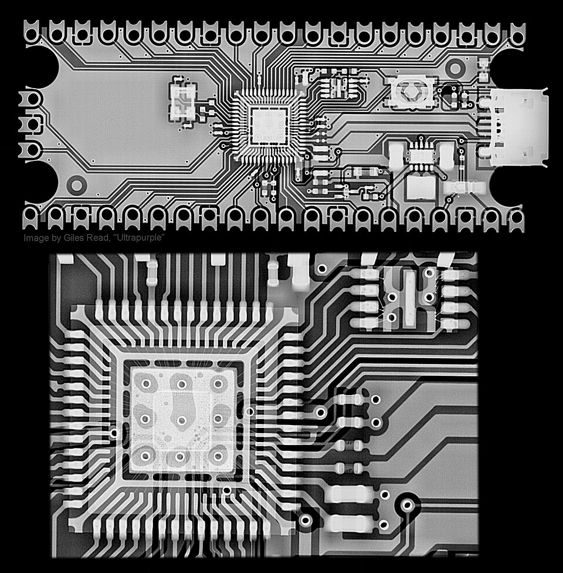

# Ultrasonic Welding & Wire Bonding

> **Node ID**: machine-tools.joining.ultrasonic-bonding
> **Domain**: [Machine-Tools](./index.md)
> **Dependencies**: [`Semiconductor Packaging & Testing`](../chemistry/packaging-testing.md)
> **Enables**: [`Electricity Generation & Distribution`](../energy/electricity.md), [`Metal Joining`](joining.md)
> **Timeline**: Years 40-70
> **Outputs**: ultrasonic_bonds, wire_bonds
> **Critical**: No

## Overview

> *Henry W. Putnam Machines for Bonding Wire Fastenings for Bottle Toppers*

> *Image: Department of the Interior. Patent Office. (1849 - 1925), Public domain*

Solid-state joining via 20-60 kHz mechanical vibration under pressure. Wire bonding: 25μm Au wire at 0.5-2.0W, 20-100ms bond time, dominant IC interconnection method (over 10 trillion bonds per year). Thermosonic Au ball bonding (150-250°C stage temperature) and ultrasonic Al wedge bonding (room temperature). Also joins thin foils, battery tabs, and dissimilar metals without brittle intermetallics.

Wire bonding connects the integrated circuit die to the package leads or substrate using fine gold or aluminum wire. In thermosonic ball bonding, a spark (electronic flame-off) melts the end of the gold wire into a free-air ball, which is pressed onto the aluminum bond pad while ultrasonic energy and heat are applied, creating a metallurgical bond. The wire is then looped to the lead finger where a second bond (stitch) is made. Aluminum wedge bonding uses a similar process at room temperature, with a wedge tool pressing the wire against the pad.

The ultrasonic energy disrupts surface oxides and contaminant films at the bonding interface, allowing direct metal-to-metal contact. Under continued vibration and pressure, atomic diffusion across the interface creates a solid-state weld without reaching the melting point of either material. This mechanism allows bonding of dissimilar metals that would form brittle intermetallic compounds if melted together.

Beyond wire bonding, ultrasonic welding joins thin metal foils, strips, and sheets in applications including battery tab connections (connecting lithium-ion cell terminals to bus bars), automotive wiring harness splices, and foil sealing in packaging. The absence of heat input beyond the immediate bond zone preserves material properties in adjacent areas.

Primary outputs: `ultrasonic_bonds`, `wire_bonds`.

Wire bonding emerged as the dominant IC interconnect method in the 1960s and has been refined continuously since then, with modern equipment capable of placing bonds at rates and accuracies that would have seemed impossible in the early decades of semiconductor manufacturing. The ultrasonic bonding process consumes only the bonding wire itself (no solder, no flux, no adhesives), making it a clean and economical interconnection method suitable for the ultra-clean manufacturing environments required by semiconductor fabrication.

The ultrasonic welding mechanism involves several simultaneous processes at the bond interface. First, the scrubbing action of the vibrating tool breaks through brittle oxide and contamination layers. Second, the cleaned metal surfaces are forced into intimate contact by the applied pressure. Third, the cyclic deformation at the interface generates dislocations that enhance atomic diffusion.

For larger-scale ultrasonic metal welding (battery tabs, wire harness splices), the process uses higher power (up to 3 kW) and larger horn geometries. The same solid-state bonding mechanism applies to these larger joints, joining dissimilar metal combinations (copper to aluminum for battery tabs) that are difficult or impossible with fusion welding.

## Prerequisites

### Materials

- Gold bonding wire (25μm diameter, 99.99% purity) for ball bonding
- Aluminum wire (25-250μm) for wedge bonding
- Copper or aluminum ribbon (0.5-2.0 mm wide, 0.1-0.3 mm thick) for battery tab welding
- Argon or forming gas for preventing oxidation during thermosonic bonding (stage heating)

### Equipment

- [Semiconductor Packaging & Testing](../chemistry/packaging-testing.md) — tool dependency
- Wire bonder with precision X-Y stage (0.5μm resolution) and optical alignment system (100-200× magnification)
- Ultrasonic generator (20-60 kHz, 0.1-5.0W for wire bonding; up to 3 kW for metal sheet welding)
- Transducer-booster-horn assembly tuned to the operating frequency
- Electronic flame-off (EFO) unit for ball formation in gold wire bonding

### Knowledge

- Ultrasonic energy coupling through the transducer-booster-horn system and how horn geometry affects amplitude
- Bond pad metallurgy: aluminum pad thickness, barrier layers, and their effect on bond reliability
- Wire bond failure modes: ball lift, heel crack, intermetallic growth (purple plague in Au-Al), and cratering
- Pull test and shear test interpretation for bond strength qualification
- Capillary and wedge tool selection, maintenance, and replacement criteria

### Infrastructure

- Cleanroom or controlled environment (class 10,000 or better) for wire bonding operations
- Pull test and shear test equipment for bond quality verification (gram-range force measurement)
- Optical microscope (100-500×) for bond inspection and tool alignment
- Stage heating system for thermosonic bonding (150-250°C substrate temperature)
- Deionized water and solvent supply for bond pad cleaning

## Process Description

The ultrasonic welding system converts electrical energy to mechanical vibration through a piezoelectric transducer, amplifies the vibration amplitude through a mechanical booster, and delivers it to the workpiece through a tuned horn (sonotrode). In wire bonding, the capillary or wedge tool mounted on the horn tip vibrates at 20-60 kHz with an amplitude of 0.5-5 μm while pressing the wire against the bond pad under controlled force. The scrubbing action breaks through oxide layers and surface contamination, and atomic bonding occurs at the clean metal-to-metal interface.

### Step-by-Step Procedure

1. Prepare the bond pads by cleaning to remove organic contamination and thick oxide layers. Plasma cleaning (oxygen or argon plasma) is standard before wire bonding. Verify pad cleanliness under magnification.
2. Load the device into the wire bonder. Align the bond pads to the program coordinates using the optical recognition system. The bonder identifies fiducial marks on the die and package to register the bond pad locations.
3. For ball bonding: the EFO spark melts the wire tail into a free-air ball (1.5-2.5 times the wire diameter). The capillary descends, pressing the ball onto the first bond pad. Ultrasonic energy (20-60 kHz, 0.5-2.0W) and force (20-50 gf) are applied for 20-100 ms, forming the ball bond.
4. The capillary rises and traverses to the second bond location, looping the wire to the programmed height and shape. Loop height, span, and trajectory are critical for wire sweep during molding.
5. At the second bond location, the capillary descends and presses the wire against the lead finger. Ultrasonic energy and force form the stitch bond (wedge-shaped). The wire is then clamped and broken (or cut) at the stitch tail.
6. For wedge bonding: the wedge tool presses the aluminum wire directly against the pad. No ball formation. Ultrasonic energy at room temperature forms the bond. Wire is cut after the second bond by tearing against the tool edge.
7. Inspect each bond under magnification for proper placement, bond shape, and absence of damage to the pad or surrounding structures.

For thermosonic gold ball bonding, the free-air ball formed by the EFO spark is a critical quality factor. The ball diameter must be consistent (typically 1.5-2.5 times the wire diameter) and centered on the wire axis. An off-center ball (golf club ball) produces an asymmetric bond with reduced contact area. Ball consistency depends on EFO current, spark gap distance, and wire tail length. Modern bonders control these parameters electronically, but older equipment requires manual adjustment.

The ultrasonic vibration system must be acoustically tuned: the transducer, booster, and horn form a resonant system that amplifies the vibration amplitude from the piezoelectric crystals to the bonding tool tip. If any component is loose, worn, or improperly assembled, the system goes out of tune and the delivered amplitude drops. Horn cracking from fatigue is a failure mode that develops over time and is detected by monitoring the generator power draw (a cracked horn requires more power to maintain the same amplitude).

### Process Parameters

| Parameter | Range | Notes |
|-----------|-------|-------|
| Ultrasonic Frequency | 20-60 kHz | 60 kHz for fine-pitch wire bonding; 20-40 kHz for larger wire and sheet welding |
| Ultrasonic Power | 0.1-5.0W (wire); up to 3kW (sheet) | Higher power for harder materials and larger cross-sections |
| Bond Force | 20-100 gf (wire); 50-500 N (sheet) | Excessive force causes cratering; insufficient force causes lift-off |
| Bond Time | 10-200 ms (wire); 0.1-2.0 s (sheet) | Longer time for harder materials and thicker cross-sections |
| Stage Temperature | 25°C (Al wedge); 150-250°C (Au ball) | Thermosonic bonding uses heat to assist bond formation |
| Wire Diameter | 15-50 μm (IC bonding); up to 500 μm (power) | 25 μm Au is the IC industry standard |

The bonding tool (capillary for ball bonding, wedge for aluminum bonding) must be precisely aligned to the bond pad for consistent placement. Tool wear affects both bond quality and placement accuracy: worn capillaries produce inconsistent ball shapes and may damage bond pads. Typical capillary life ranges from tens of thousands to hundreds of thousands of bonds before replacement.

## Safety Considerations

Ultrasonic welding heads vibrate at frequencies and amplitudes that can cause injury. Wire bonding equipment operates at high speed with microscopic precision.

- **Hand-arm vibration**: Ultrasonic welding heads for sheet metal welding vibrate at amplitudes sufficient to cause hand-arm vibration syndrome with prolonged exposure. Operators must not touch the horn during activation. For wire bonding, the vibration is contained within the tool, but the high-frequency vibration generates audible harmonics.
- **High-frequency noise**: The ultrasonic vibration generates audible harmonics that cause hearing fatigue and potential damage with prolonged exposure. Hearing protection is required near production ultrasonic welding equipment.
- **Electronic flame-off (EFO)**: The spark used to form the ball on gold wire generates an electric arc that poses eye and burn hazards if the wire fails to melt properly. The arc is contained within the bonder enclosure, but maintenance access requires safety interlocks.
- **Capillary puncture**: Wire bonding capillaries are sharp ceramic tools that can cause puncture wounds during tool changes and maintenance. Handle with care and dispose of worn capillaries in a sharps container.
- **Pinch points**: Ultrasonic sheet welding equipment applies significant clamping force between the horn and the anvil. Fingers caught between them suffer crushing injuries. Two-hand controls are mandatory on manual ultrasonic welding machines.

### Personal Protective Equipment

- Hearing protection near production ultrasonic welding equipment (audible harmonics above 85 dB)
- Safety glasses during tool changes and maintenance (capillary fragments are sharp)
- Heat-resistant gloves when handling heated stage platens for thermosonic bonding (150-250°C)
- Nitrile gloves when handling gold bonding wire (skin oils contaminate wire surface)
- Close-fitting clothing and no loose items near rotating stages on wire bonders

### Emergency Procedures

- Verify EFO fire suppression shielding on wire bonder spark gap; the arc can ignite nearby materials
- Maintain ultrasonic transducer frequency calibration per maintenance schedule; frequency drift causes uncontrolled amplitude
- Post pinch point warnings on ultrasonic sheet welding equipment
- Keep first aid kit with puncture wound treatment near the wire bonding area
- Train operators on capillary breakage response: stop the bonder, carefully collect ceramic fragments, replace capillary before resuming

## Quality Control

### Acceptance Criteria

- **Wire Bonds**: Ball diameter 2.0-3.5 times wire diameter. Ball shear strength exceeds 5 gf per mil of wire diameter. Pull test strength exceeds 3 gf for 25μm Au wire. No cratering, pad lift, or substrate cracking. Placement accuracy within ±5μm of target.
- **Ultrasonic Bonds (sheet)**: Peel strength meets minimum specification for the material and thickness combination. No voids or unbonded areas at the interface.

### Testing Methods

- Pull testing of wire bonds: hook under the wire loop, pull vertically, measure breaking force and record failure mode (ball lift, neck break, mid-span break, heel break, stitch lift)
- Ball shear testing: shear tool pushes the ball bond parallel to the pad surface to assess adhesion strength and identify cratering or intermetallic weakness
- Optical microscopy inspection at 100× or higher for bond geometry, placement accuracy, and loop profile
- Cross-section metallography of ultrasonic sheet welds for bond interface examination
- Electrical continuity and resistance testing for wire-bonded interconnects

### Sampling Protocol

- Perform pull and shear testing on statistical sample per lot (typically 5-10 wires per device for destructive testing)
- Inspect bond placement and loop geometry at magnification for each device (100% visual)
- Monitor pull test and shear test data for trend degradation (indicating tool wear or process drift)
- Cross-section ultrasonic sheet weld samples from each new material or thickness combination
- Replace capillary or wedge tool when pull test average drops below the minimum specification

## Scaling Notes

- **Bench scale**: Manual wire bonder with joystick control and optical microscope. Individual wire bonds placed by hand. Bond rates of 1-5 bonds per minute. Suitable for prototype and development work with small die counts.
- **Pilot scale**: Semi-automatic wire bonder with pattern recognition. Operator loads devices, bonder places bonds at programmed coordinates. Bond rates of 5-20 bonds per second. Production of moderate-volume semiconductor devices.
- **Production scale**: Fully automatic wire bonders with deep-learning pattern recognition, dual-head bonding, and automated material handling. Bond rates exceeding 15 bonds per second with placement accuracy of ±2μm. Hundreds of devices per hour. Multiple bonders in a production line.

Scaling from manual to automatic wire bonding requires significant investment in pattern recognition software that can identify bond pads on each die despite variations in die placement, pad contamination, and surface reflectivity. Modern bonders use machine vision with sub-micron resolution and neural-network-based pad recognition that adapts to new die layouts with minimal programming. The bonder must also manage wire looping: each wire must be formed into a precise loop profile that avoids touching adjacent wires or die edges during subsequent molding operations.

Wire bond reliability depends on bond placement accuracy, loop profile control, and intermetallic formation at the bond interface. Gold-aluminum intermetallic compounds (purple plague, AuAl₂ and Au₅Al₂) can grow over time at elevated temperature, increasing bond resistance and eventually causing failure. This drives the choice between gold wire (easier bonding, higher cost) and aluminum wire (lower cost, no purple plague risk but harder to bond).

## Troubleshooting

| Problem | Probable Cause | Solution |
|---------|---------------|----------|
| Ball lift (ball separates from pad) | Insufficient ultrasonic power, force, or contaminated pad | Increase ultrasonic power by 10-20%; verify pad cleanliness with plasma clean (100 W O₂ plasma, 2-5 min); check for pad oxide thickness >5 nm |
| Inconsistent ball size | Unstable EFO spark or wrong EFO current | Clean EFO electrode with alcohol; adjust EFO current to 30-50 mA and time to 300-500 μs; check wire tail length is 0.5-1.0× wire diameter |
| Heel crack in wire loop | Excessive loop height or sharp angle at stitch bond | Reduce loop height to 250-400 μm for 25 μm wire; increase loop radius; reduce second bond force to 20-30 gf to prevent excessive wire deformation |
| Stitch lift (second bond fails) | Insufficient force or power at second bond | Increase ultrasonic power by 15% and force to 40-60 gf for second bond; verify lead finger plating quality (2-5 μm Ni, 0.5-1.0 μm Au over Ni) |
| Cratering (pad or substrate cracks) | Excessive bond force or power for the pad structure | Reduce bond force to 20-30 gf; reduce ultrasonic power to 0.5-1.0W; verify pad thickness is >1.0 μm Al and underlying dielectric integrity (SiO₂ >0.8 μm) |
| Stuck capillary (wire bonds to tool) | Gold alloying on capillary inner surface | Replace capillary; reduce bond time to 20-50 ms; verify wire surface cleanliness (handle with nitrile gloves, not bare hands) |
| Wire sweep during molding | Loop height too high or wire too long relative to span | Reduce loop height; use lower trajectory loop profile; keep loop span below 3 mm for 25 μm wire; use forward-bonded loop (bond near side first) |
| Pad contamination visible under microscope | Incomplete plasma clean or storage time exceeded after cleaning | Re-clean with O₂/Ar plasma immediately before bonding; shelf life of plasma-cleaned parts is 4-8 hours maximum in open air; store in N₂-purged containers |
| Intermittent open circuit after thermal cycling | Au-Al intermetallic growth (purple plague) at elevated temperature | For high-temperature service (>150°C), use Al wire instead of Au to eliminate purple plague risk; limit Au-Al exposure to <125°C operating temperature; qualify with 1000-hour thermal cycling test |
| Inconsistent ultrasonic sheet weld strength | Horn amplitude drift or surface contamination on workpieces | Verify horn amplitude with laser vibrometer (target 20-40 μm peak-to-peak); clean workpiece surfaces with acetone; check horn face for wear or contamination buildup |

## Variations and Alternatives

- **Stud bumping (flip-chip variant)**: Ball bond placed on the chip pad, wire sheared off above the ball, leaving a gold stud bump. The bumped die is flipped and attached to the substrate using thermocompression or thermosonic bonding. Combines wire bonding equipment accessibility with flip-chip electrical performance.
- **Ribbon bonding**: Flat aluminum or copper ribbon instead of round wire. Lower electrical resistance and better high-frequency performance for RF and power devices where round wire inductance degrades circuit performance. Ribbon widths of 0.5-2.0 mm.
- **Thermocompression bonding**: Uses heat and pressure without ultrasonic energy. Requires higher temperature (300-500°C) and longer bond time. Produces reliable bonds but limited to gold-to-gold or gold-to-aluminum combinations. Older technology, largely replaced by thermosonic bonding.

Wire bonding technology has remained the dominant IC interconnection method for decades despite repeated predictions of its displacement by flip-chip or other advanced packaging technologies. The reasons are its reliability, speed, low cost, and the enormous installed base of wire bonding equipment. Modern automatic wire bonders place bonds at rates of over 15 per second with placement accuracy measured in micrometers. For bootstrapping semiconductor manufacturing, wire bonding is a logical starting point because it requires less advanced lithography and bonding pad preparation than flip-chip attachment.

The transition from gold wire to copper wire bonding in high-volume IC production has been driven by cost reduction. Copper wire is harder than gold and requires higher ultrasonic power and more precise force control, but the material cost savings are substantial. Copper wire bonding demands cleaner bond pads and more consistent plating quality than gold wire, pushing upstream requirements on wafer-level pad preparation.

Ribbon bonding using flat aluminum or copper ribbon instead of round wire provides lower electrical resistance and better high-frequency performance for RF and power devices, where the inductance of round wire bonds can degrade circuit performance at high frequencies. Ribbon cross-sections of 0.5-2.0 mm width are used for power semiconductor modules and RF amplifier packages where current carrying capacity and low parasitic inductance are critical.

## References

- [Metal Joining](joining.md) — parent capability
- [Machine-Tools Domain](./index.md) — domain overview and related capabilities
- [Semiconductor Packaging & Testing](../chemistry/packaging-testing.md) — upstream dependency (tool)
- [Electricity Generation & Distribution](../energy/electricity.md) — downstream capability
- [Metal Joining](joining.md) — downstream capability

### Material Handling

- Handle gold bonding wire with nitrile gloves; skin oils contaminate the wire surface and affect ball formation consistency
- Store IC devices in moisture-barrier bags with desiccant until ready for bonding; moisture absorption causes popcorning during subsequent molding
- Store bonding capillaries and wedge tools in protective cases; chipped or contaminated tool tips produce defective bonds from the first use
- Clean bond pads with plasma immediately before wire bonding; the shelf life of plasma-cleaned pads is measured in hours before recontamination requires re-cleaning
- Keep ultrasonic generator calibration current; frequency drift reduces bond energy delivery and causes inconsistent bond quality
- Record bond parameters (power, force, time, stage temperature) for each device lot for traceability and failure analysis
- Track capillary and wedge tool life by bond count; replace proactively before quality degradation becomes visible in pull test data
- Monitor ultrasonic generator power draw during production; increasing power demand indicates horn fatigue or contamination buildup
- Keep spare EFO electrodes and capillaries at the bonder station to minimize downtime during tool changes
- Document plasma cleaning parameters and interval for each product type; stale cleaning reduces bond yield
- Verify capillary and wedge tool alignment under magnification after each tool change
- Store bonding wire in sealed containers with desiccant to prevent surface oxidation

---
*Part of the [Bootciv Tech Tree](../../index.md) · [Machine-Tools](./index.md) · [All Domains](../../index.md)*
