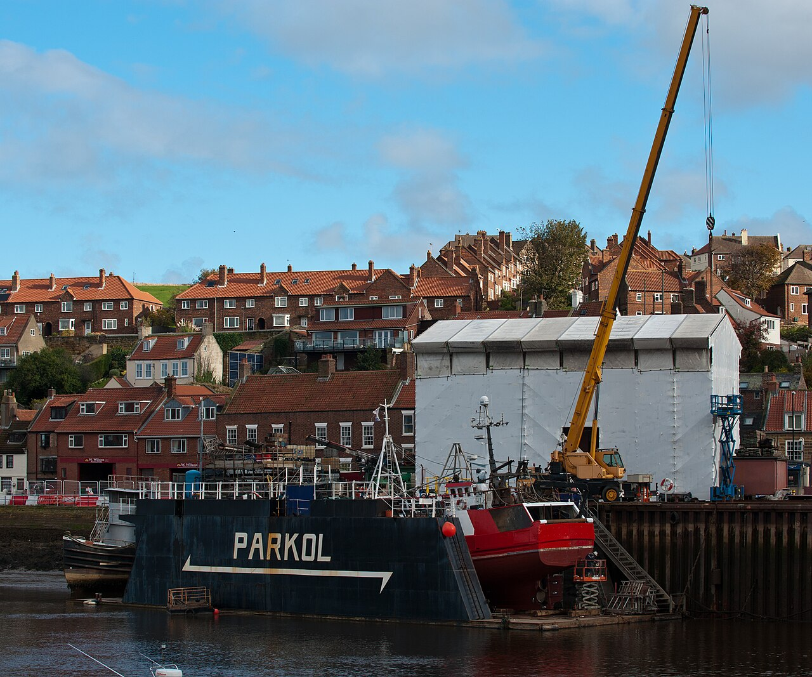
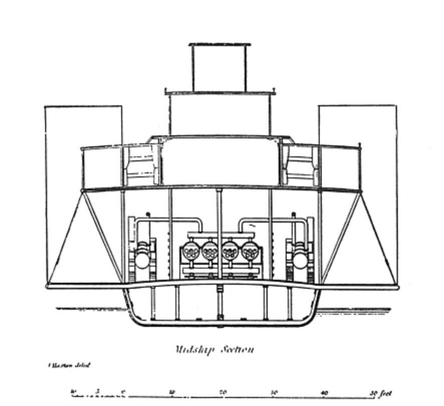
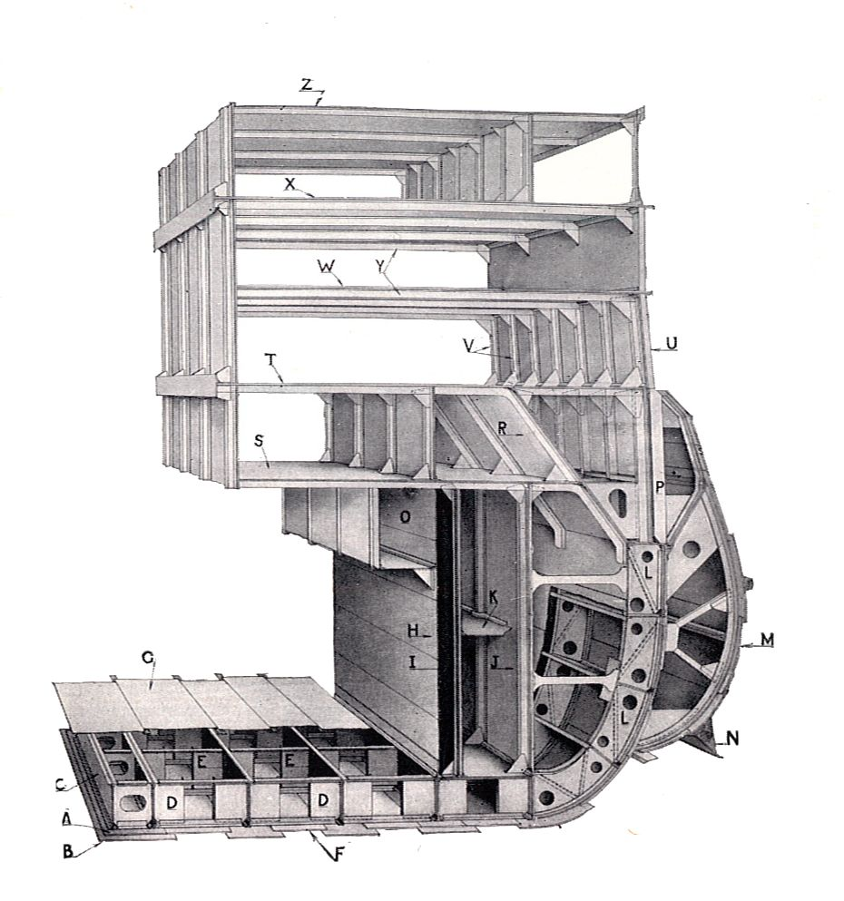
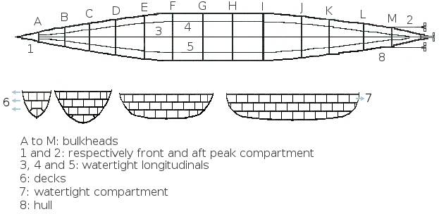

# Marine & Naval Engineering

> *Parkol Marine shipyard Whitby - Parkol Marine are an engineering and ship (boat) building company based in Whitby, North Yorkshire. They have a dry dock and the fabrication hangar is the structure with white cladding on it. The crane lowers new build ships into the river.*

> *Image: The joy of all things, CC BY-SA 4.0*

> **Node ID**: marine
> **Domain**: Marine & Naval Engineering
> **Timeline**: Years 0-50+
> **Outputs**: vessels, marine engines, sails & rigging, navigation instruments, harbor works, submarine cables, dry docks

Marine engineering covers the design, construction, propulsion, navigation, and maintenance of vessels and maritime infrastructure. This domain is distinct from [water transport](../transport/shipping.md) which focuses on transport operations (navigation practice, cargo handling, canal engineering). Marine engineering focuses on the engineering disciplines: hull structural design, marine propulsion machinery, navigation instrument development, harbor construction, and underwater systems.

The earliest marine engineering — dugout canoe construction — begins in the stone age with fire and axes. Progression through plank-built, clinker, carvel, and iron/steel hull construction tracks the development of metallurgy and machine tools. Marine propulsion evolves from oar and sail to steam and diesel engines. Each transition multiplies cargo capacity and route range.

### SIK Boundary with Transport.Shipping

The SIK Placement Test confirms <20% overlap between marine and transport.shipping:
- **Infrastructure**: transport.shipping uses ports and canals; marine builds and maintains ships, dry docks, and cable infrastructure (~25% overlap)
- **Knowledge**: transport.shipping is operational (piloting, cargo); marine is engineering (hull design, propulsion, corrosion) (~20% overlap)
- **Practitioners**: sailors and cargo handlers vs. shipbuilders, marine engineers, and naval architects (~15% overlap)

Result: standalone marine domain. Cross-reference [transport/shipping.md](../transport/shipping.md) for operational content.

## Capabilities in this domain:

> *Image: Unknown authorUnknown author, Public domain*

- [Hull Construction & Shipbuilding](shipbuilding.md) (`marine.shipbuilding`) — dugout → clinker → carvel → iron/steel hull construction, structural design, fastening methods
<!-- TODO: source image for Marine Navigation -->
- [Marine Navigation](navigation.md) (`marine.navigation`) — coastal piloting, celestial navigation, instrument development, dead reckoning

> *Image: Andy Dingley (scanner), Public domain*

- [Marine Propulsion Systems](propulsion.md) (`marine.propulsion`) — oar → sail → steam → diesel, marine engines, propeller design

> *Image: KVDP, Public domain*

- [Maritime Infrastructure & Underwater Engineering](infrastructure.md) (`marine.infrastructure`) — harbors, dry docks, lighthouses, submarine cables, corrosion prevention

## Dependencies

- [Foundations](../foundations/index.md) — fire, basic tools for earliest boat construction
- [Metals](../metals/index.md) — iron and steel for hulls, fasteners, anchors
- [Textiles](../textiles/index.md) — sailcloth, rope, cordage for rigging
- [Energy](../energy/index.md) — steam and internal combustion engines for propulsion
- [Knowledge](../knowledge/index.md) — writing for charts, mathematics for navigation
- [Machine Tools](../machine-tools/index.md) — precision manufacturing for marine engines and propellers
- [Polymers](../polymers/index.md) — gutta-percha for submarine cable insulation

---

[↑ Back to Tech Tree](../index.md)
