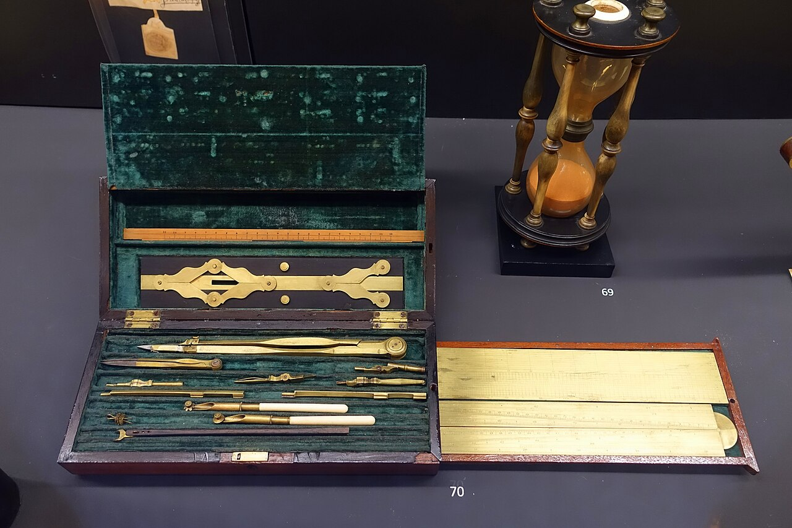

# Mathematics & Formal Sciences

> *Exhibit in the Museu da Ciência da Universidade de Coimbra - University of Coimbra - Coimbra, Portugal.*

> *Image: Daderot, CC0*

Capabilities in this domain:

- [Core Mathematics](core-mathematics.md) — Arithmetic, algebra, geometry, trigonometry, and number systems: the mathematical foundations for all engineering calculation and measurement.
- [Applied Mathematics](applied-mathematics.md) — Calculus, linear algebra, differential equations, probability, statistics, and numerical methods for modeling physical systems and quantifying uncertainty.
- [Formal Systems](formal-systems.md) — Boolean algebra, information theory, and computation theory: the mathematical foundations of digital logic, communication systems, and algorithmic reasoning.

[↑ Back to Tech Tree](../index.md)
