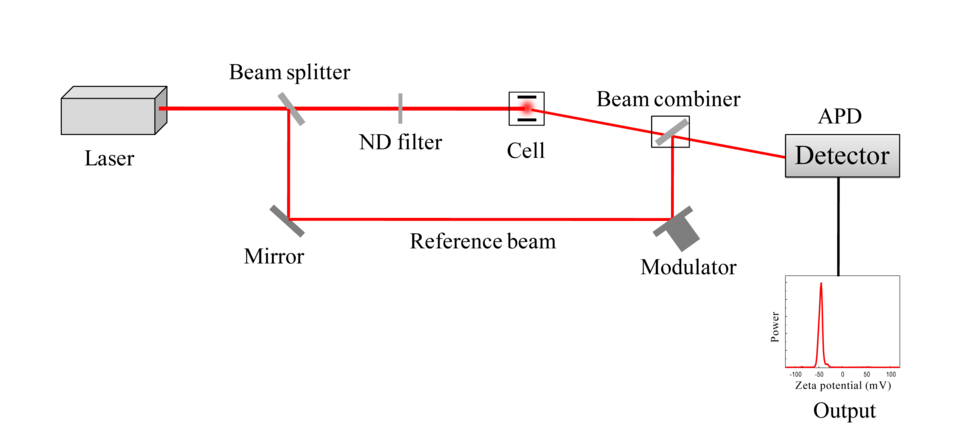
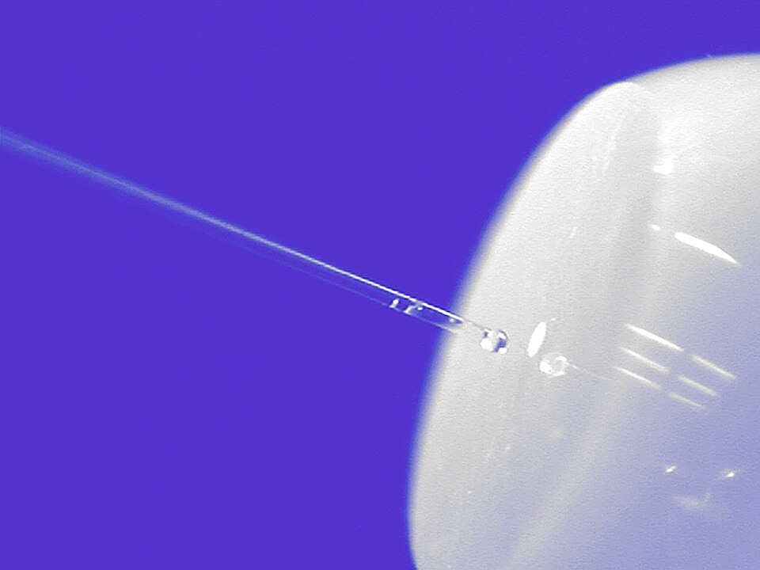
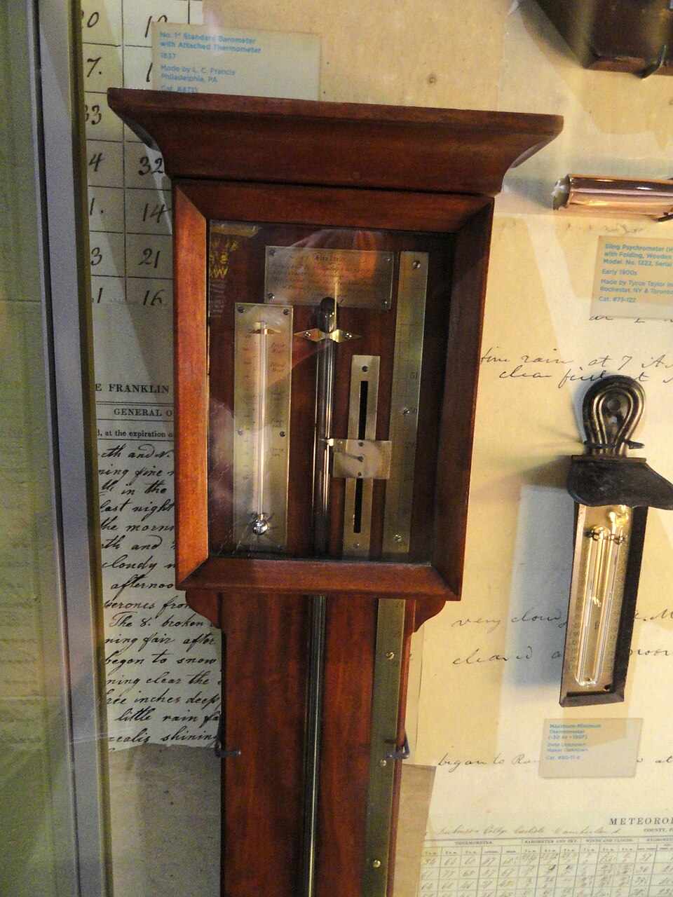
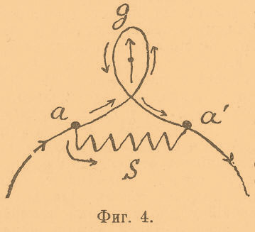
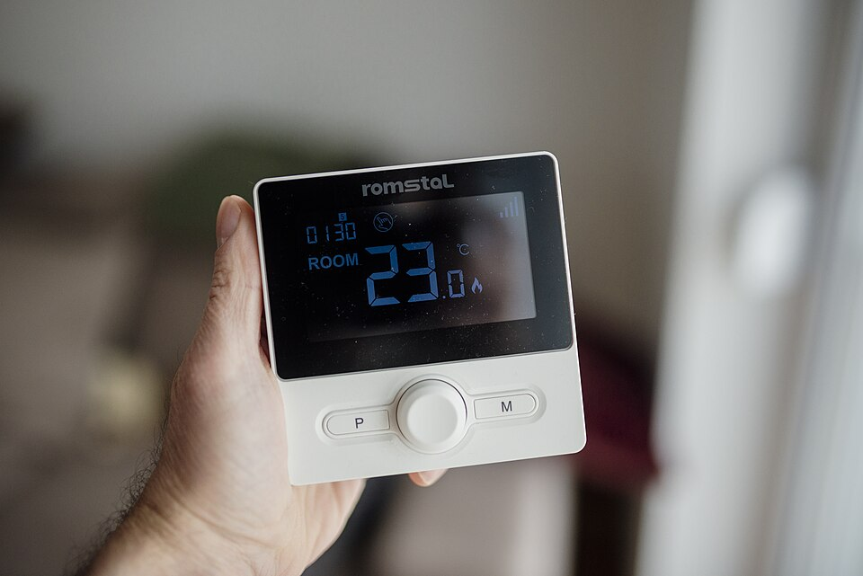
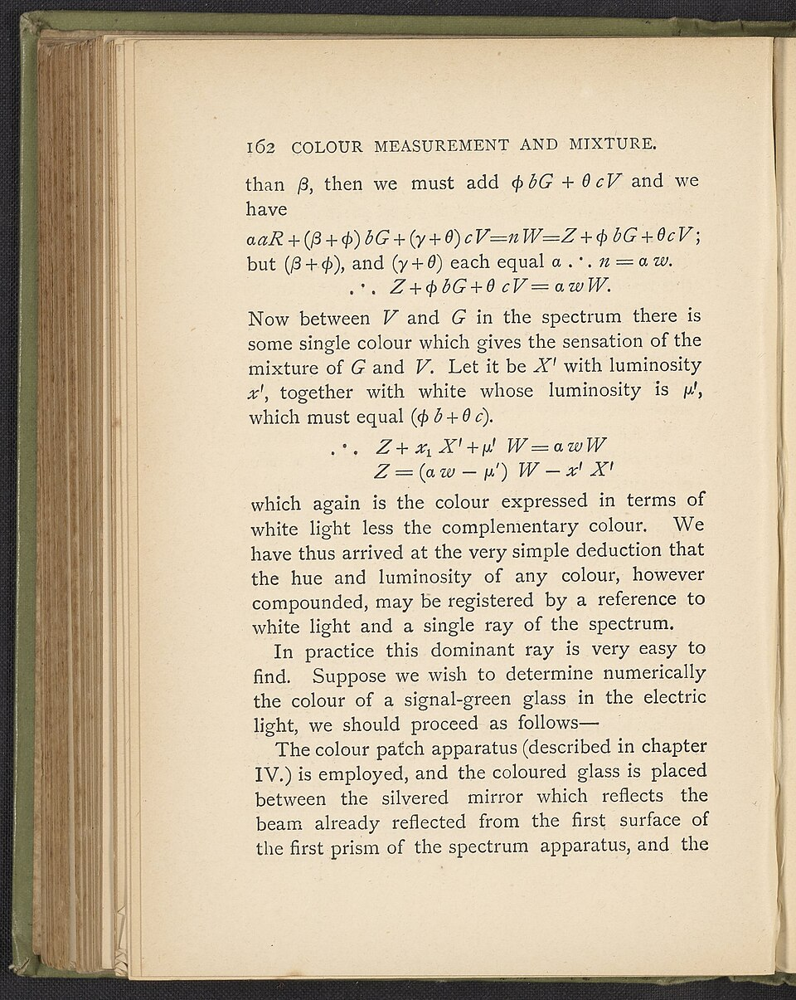

# Measurement

> *Image: Sobarwiki, Public domain*

> *Instrumentation for zeta potential measurement through light scattering.*

> *Image: Sobarwiki, Public domain*

Capabilities in this domain:

> *Image: National Institute of Standards and Technology, Public domain*

- [Precision Metrology & Standards](precision-metrology.md) — Surface plates via Whitworth three-plate method, hand scraping, straight edges, squares, vernier calipers (0.02 mm resolution), micrometers (0.01 mm), gauge blocks, angle measurement, calibration infrastructure, timekeeping (pendulum clocks ±5 sec/day), and electrical standards.

> *Image: Daderot, Public domain*

- [Temperature & Pressure Measurement](temperature-pressure.md) — Thermocouples (Type K, J, B, S), RTDs, bimetallic strips, pyrometers, Bourdon tube gauges, barometers, manometers, and flow measurement for industrial process control.

> *Image: Брокгауз и Ефрон, Public domain*

- [Electrical Instruments](electrical-instruments.md) — Galvanometers, multimeters, oscilloscopes, bridge circuits, and electrical standards for voltage, current, and resistance measurement.
<!-- TODO: source image for Optical Instruments -->
- [Optical Instruments](optical-instruments.md) — Spectroscopes, refractometers, polarimeters, interferometers, and photometric instruments for analytical measurement.

> *Image: Shixart1985, CC BY 2.0*

- [Thermostats & Temperature Control](thermostat.md) — Overview of 22 thermostat types from mechanical to advanced, with selection guide and troubleshooting.

> *Image: Shixart1985, CC BY 2.0*

- [Mechanical Thermostats](thermostat-mechanical.md) — Expansion rod, rod-and-tube, bimetallic strip, and snap-action disc thermostats. No external power required.

> *Image: Shixart1985, CC BY 2.0*

- [Fluid & Gas Thermostats](thermostat-fluid.md) — Mercury tilt, liquid expansion, vapor pressure, gas expansion, wax pellet, TRV, and pneumatic thermostats with remote sensing.

> *Image: Shixart1985, CC BY 2.0*

- [Electrical Thermostats](thermostat-electrical.md) — Thermocouple, RTD (Wheatstone bridge), and reed switch thermostats for high-temperature and precision applications.

> *Image: Shixart1985, CC BY 2.0*

- [Electronic Thermostats](thermostat-electronic.md) — Thermistor, silicon junction, IC sensor, and digital PID microcontroller thermostats for precise process control.

> *Image: Shixart1985, CC BY 2.0*

- [Advanced & Specialty Thermostats](thermostat-advanced.md) — Shape memory alloy actuators, quartz crystal sensors, and infrared pyrometers for calibration-grade and non-contact measurement.

[↑ Back to Tech Tree](../index.md)

> *Image: Sobarwiki, Public domain*
