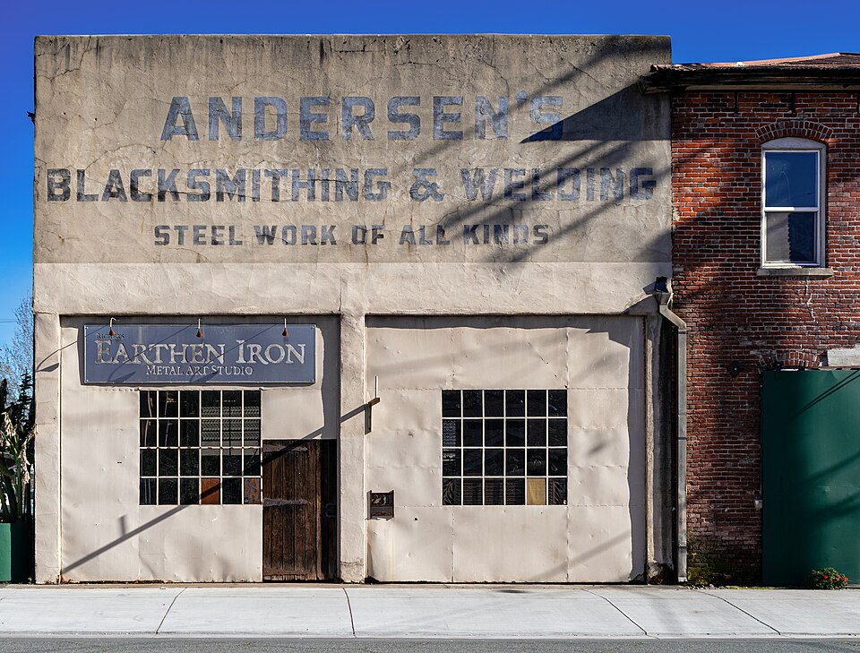

# Blacksmithing

> **Node ID**: metals.blacksmithing
> **Domain**: [Metals](./index.md)
> **Dependencies**: [`Machine Tools Bootstrap`](../machine-tools/index.md), [`Construction & Structural Engineering`](../construction/index.md)
> **Enables**: [`Furnace Design Principles`](../energy/furnace-design.md), [`Iron & Steel Production`](iron-steel.md)
> **Timeline**: Years 5-15
> **Outputs**: hand-forged-tools, hardware-fittings, wrought-iron-goods
> **Critical**: No

## Overview

> *Image: Photograph:  Radomianin, Public domain*

Hand forging of iron and steel into tools, hardware, and structural fittings using hammer, anvil, and hearth. Blacksmithing transforms bloomery iron and wrought iron into functional implements: hammers, chisels, hinges, brackets, chains, and agricultural tools, without requiring powered machinery.

The forge is the central tool. A hearth raised to a convenient working height, with an air supply (bellows or blower) to raise the fire to forging temperature. The anvil serves as the work surface, with a flat face for drawing and a horn for bending. The hammer is the primary shaping tool, with cross-peen and ball-peen variants for different forming operations.

Blacksmithing requires reading the color of heated metal to judge temperature. Dark red (~550°C) marks the lower working range. Bright orange (~900°C) is the primary forging range. Bright yellow to white (~1200-1300°C) is reserved for heavy forging and forge welding. Each operation (drawing out, upsetting, bending, punching, drifting, and forge welding) has specific temperature requirements and hammer techniques.

**Why temperature control matters**: Iron and steel undergo a crystal structure transformation (ferrite BCC to austenite FCC) at the critical temperature (727-912°C depending on carbon content). Below this transformation, the metal is rigid and resists deformation. Above it, the FCC austenite structure allows dislocations to move freely, making the metal plastic under hammer blows. Working below the critical temperature causes the metal to crack along grain boundaries rather than deform. Working too far above it burns the steel (grain boundary oxidation), producing a crumbly, sparkly surface that cannot be repaired. The visible color change corresponds to these metallurgical transitions with reasonable accuracy.

Primary outputs: `hand-forged-tools`, `hardware-fittings`, `wrought-iron-goods`.

Coal forges are the simplest to build and operate. A firepot (cast iron or steel plate) holds the burning coal, which is converted to coke around the edges by the heat of the fire. A centrifugal blower or bellows supplies air through a tuyere at the bottom of the firepot. The smith builds a "coke cave" of burning fuel over the work zone, providing a hot, reducing environment that minimizes scale formation on the steel. Gas forges (propane or natural gas) offer cleaner operation and faster heat-up but require a fuel supply. Induction forges heat electrically and produce no combustion gases, but need electricity and are limited to ferrous metals.

### Heat Color Chart for Steel

The primary temperature control method in a smithy without instruments. Colors are visible in a dim forge area; bright daylight makes colors below ~700°C invisible.

| Temperature (°C) | Color | Operation | Metallurgical State |
|-------------------|-------|-----------|-------------------|
| 200-290 | Pale straw to brown oxide (on polished surface) | Tempering cutting tools | Tempered martensite |
| 290-340 | Purple to dark blue oxide | Tempering springs, impact tools | Tempered martensite |
| 550 | Dark red (first visible glow in dark) | Lower limit for working | Below critical temperature; cracking risk |
| 650 | Dark cherry red | Annealing, stress relief | Approaching critical temperature |
| 700-780 | Cherry red | Normalizing, bending | Austenite transformation begins |
| 780-850 | Bright cherry red | Hardening quench temperature for ~0.8% C steel | Full austenite (quench to martensite) |
| 850-950 | Bright red to orange | General forging of steel | Austenite, good plasticity |
| 950-1050 | Bright orange | Heavy forging, drawing out | Austenite, maximum plasticity |
| 1050-1150 | Yellow | Upsetting, punching, forge welding prep | Austenite, grain growth risk if held too long |
| 1200-1300 | Bright yellow to white | Forge welding | Near burning point; act fast |
| 1300+ | White, sparking | Burning (destructive) | Grain boundary oxidation; scrap |

**Why the color changes**: Black-body radiation shifts from infrared (invisible) at low temperatures through the visible spectrum as temperature increases. The first visible glow (dark red, ~550°C) marks the lower boundary of hot working. The color-to-temperature mapping is consistent enough for practical work, with an accuracy of roughly ±25°C in a dim forge setting.

### Forge Temperature by Metal

| Metal | Forging Range (°C) | Color | Critical Notes |
|-------|---------------------|-------|---------------|
| Wrought iron | 800-1100 | Bright red to orange | Fibrous slag melts ~1200°C; do not exceed |
| Mild steel (1020) | 900-1150 | Orange to yellow | Very forgiving; wide working range |
| Medium carbon (1045) | 850-1100 | Bright red to yellow | Narrower range; watch for burning above 1100°C |
| High carbon (1095) | 800-1050 | Cherry red to orange | Burns easily above 1050°C; use lower temperatures |
| Tool steel (O1, W1) | 850-1050 | Bright red to orange | Very narrow range; must not overheat |
| Cast iron | Not forgeable | — | Brittle at all temperatures; shatters under hammer |

## Prerequisites

### Materials

- Wrought iron bar or mild steel bar stock (recycled iron and steel scrap works if sorted by type)
- Coal, charcoal, or coke for forge fuel
- Borax or clean sand for forge welding flux
- Quench media: water, brine, or oil (used motor oil works for mild quench)

### Equipment

- [Machine Tools Bootstrap](../machine-tools/index.md) — material dependency
- [Construction & Structural Engineering](../construction/index.md) — material dependency
- Forge (coal, gas, or induction) with blower or bellows and chimney hood
- Anvil (minimum 75 kg) mounted on a heavy wooden stump at knuckle height (wrist height when standing relaxed beside the anvil)
- Hammers: cross-peen (1-2 kg), straight-peen (1.5-3 kg), ball-peen (0.5-1 kg), sledge (4-8 kg)
- Tongs: flat jaw, round jaw, bolt jaw (at minimum), fitted to the stock sizes being worked

### Tong Selection Guide

Tongs must grip the stock firmly without slipping. Using the wrong size or style of tongs is the most common cause of workpiece loss (it flies across the shop) and hand injuries. The jaw shape must match the stock cross-section.

| Tong Type | Jaw Shape | Stock Size | Use |
|-----------|-----------|------------|-----|
| Flat jaw | Flat inside, parallel | 3-12 mm flat bar | Flat stock, sheet, small bars |
| Round jaw (V-bit) | V-groove inside | 6-25 mm round/square | Round and square bar (most versatile) |
| Bolt jaw | Recessed jaw with box | Specific bolt head size | Holding bolt heads during forging |
| Pickup tongs | Wide, flat jaws | Any width | General purpose, sheet metal |
| Square jaw | Flat with 90° inside | 6-20 mm square | Square stock |
| Scroll tongs | Curved jaws | — | Holding scrollwork without marring |

**Rule of thumb**: The tong jaws should contact at least 60% of the stock surface. If the stock slides in the tongs with a firm squeeze, the tongs are too large or the wrong style. Heat the jaws and hammer them to fit the stock if needed ("fitting tongs to the work"). A smith typically needs 5-10 pairs of tongs in different sizes and styles for general work.
- Swages and fullers for shaping consistent profiles
- Vise (leg vise preferred over machinist vise for hammering)
- Quench tank (water, oil) positioned within arm's reach of the anvil
- Slack tub (water) for cooling tools and quenching small items
- Hardie tools (cutter, fuller, bender) that fit the anvil hardie hole
- Grinding wheel or files for finishing

### Knowledge

- Reading metal temperature by color: dark red (~550°C), cherry red (~700°C), bright orange (~900°C), yellow (~1100°C), white (~1300°C)
- Hammer techniques: drawing out (lengthening and thinning), upsetting (thickening by compressing), bending, punching, drifting, and fullering
- Forge welding: flux application, joint preparation (scarfing), recognizing welding heat, striking sequence
- Heat treatment fundamentals: normalizing (relieve internal stresses), hardening (quench from critical temperature), tempering (reheat to controlled lower temperature judged by oxide colors)
- Steel identification by spark test on a grinding wheel: low carbon gives straight yellow sparks, medium carbon gives forking sparks with star bursts, high carbon gives dense short bursts with many forks
- Selection of quench media based on carbon content and desired hardness

### Infrastructure

- Forge with controllable air supply (bellows, centrifugal blower, or hand-cranked fan) and hood or chimney for smoke
- Anvil mounted on a heavy wooden block or stump at knuckle height
- Quench tanks for water and oil, positioned within arm's reach of the anvil
- Stock rack for organized storage of bar iron and steel by type and size
- Adequate floor space around the anvil for swinging a sledge hammer safely
- Fire-resistant floor (dirt, concrete, or metal plate) under and around the forge

## Process Description

### Step-by-Step Procedure

1. Build and maintain the forge fire. For a coal forge: clear the firepot, add fresh coke, open the air blast, and build a mound of burning coke around the work zone. The goal is a deep, clean fire with a reducing atmosphere (excess fuel, not excess air) to minimize scale formation.

**Why a reducing atmosphere matters**: Steel in an oxidizing fire (excess air) forms iron oxide scale (FeO, Fe₂O₃, Fe₃O₄) at 1-3 mm per hour of heating. Scale is waste metal that cannot be recovered and produces rough surfaces on the finished work. A deep, coke-covered fire with limited air ingress maintains a CO-rich atmosphere that prevents scale formation.

2. Heat the workpiece to forging temperature in the fire. For steel, this means bright orange to yellow (~900-1100°C). For wrought iron, bright red to orange (~800-900°C). Rotate the stock to heat evenly. Do not let the metal sit in the fire longer than needed.

3. Remove the workpiece from the forge with the correct tongs (the tongs must grip the stock firmly; if they slip, the piece flies across the shop). Position on the anvil and begin shaping.

4. For drawing out: strike with the cross-peen hammer at an angle to the workpiece, then flatten the ridges with the flat face. Work from the center outward for even lengthening. Keep the metal hot; return to the forge as soon as the color drops below bright red.

**Why drawing out works**: The cross-peen concentrates hammer force into a narrow band, compressing the metal perpendicular to the peen and causing it to elongate in the direction of least resistance. The flat face then smooths the ridges. This two-step sequence (concentrate force, then flatten) is more efficient than using only the flat face, which would spread the metal in all directions equally.

5. For upsetting: heat the end of the bar to bright orange, stand the bar vertically on the anvil face, and strike the top end with the sledge hammer. Drive the metal back into itself to thicken the heated portion.

**Why upsetting works**: At bright orange (~900°C), the austenite steel is plastic. The hammer blow compresses the hot end, and since the bar body below is cooler and stiffer, the plastic deformation concentrates in the heated zone. The metal thickens because it cannot easily elongate (constrained by the bar body) and instead expands laterally. The critical requirement is a steep temperature gradient: if the entire bar is hot, it buckles rather than upsets.

6. For punching and drifting: heat the workpiece to bright yellow, position on the anvil (over the hardie hole for through-punching), drive the punch with the sledge, clear the punch frequently to avoid sticking, then drift the hole to final size with a tapered drift pin.

7. Allow the finished piece to cool at a rate appropriate to the material and application. Normalize if needed: heat to medium red and cool in still air.
8. Inspect for cracks, dimensional accuracy, and surface quality. File or grind to final dimensions.

9. For items requiring a threaded end (bolts, taps), cut the threads with a die or lathe after the forging is complete and cooled. Forging distorts threads, so never thread before final heat treatment if dimensional precision matters.

### Process Parameters

| Parameter | Range | Notes |
|-----------|-------|-------|
| Forging temperature (wrought iron) | 800-1100°C (bright red to orange) | Do not work below dull red (~550°C); cracking risk increases |
| Forging temperature (steel) | 900-1100°C (bright orange to yellow) | Higher carbon steels forge at lower temperatures to avoid burning |
| Forge welding temperature | 1200-1300°C (bright yellow to white) | Metal sparks and looks fluid; must strike immediately |
| Hammer weight (hand hammer) | 1-2 kg | For finishing and light work |
| Hammer weight (sledge) | 4-8 kg | For heavy drawing, upsetting, and when striking with a team |
| Quench media (steel) | Water, brine, or oil | Water gives hardest result; oil is milder and less likely to crack |

### Forge Welding

Forge welding joins two pieces of iron or low-carbon steel by heating them to a white-hot welding heat and hammering them together on the anvil. Flux (clean sand or borax) is sprinkled on the joint surfaces to prevent oxidation and create a glassy layer that melts at welding temperature. The workpieces must be at welding temperature, a bright, sparkling white heat where the surface looks wet and fluid. The weld must be struck quickly and firmly before the metal cools below welding range. Multiple heats and repeated hammering may be needed for a sound weld through the entire joint.

Prepare the joint by scarfing: each piece is upset at the end and then hammered to a tapered, overlapping shape. The scarfed ends interlock, increasing the weld area and helping alignment during the strike. Test weld quality by striking the joint on the anvil edge. A sound weld rings clearly. A poor weld separates or bends at the joint. Forge welding is the primary joining method in a blacksmith shop without arc welding equipment.

### Heat Treatment of Forged Tools

After forging, steel tools require heat treatment to achieve the desired hardness and toughness. Normalize by heating to a medium red (~700°C) and allowing to cool in still air. This relieves forging stresses and refines the grain structure.

**Why normalizing refines grain**: Forging at high temperatures causes austenite grains to grow (grain coarsening). When the steel cools through the transformation temperature, each prior austenite grain transforms into multiple new ferrite-pearlite grains. Normalizing from just above the critical temperature produces fine, uniform grains because the austenite grains start small (limited time for growth at moderate temperature) and transform to a fine ferrite-pearlite structure on air cooling. Fine grains mean higher toughness and more uniform response to subsequent hardening.

Harden by heating to bright red (the critical temperature depends on carbon content; ~780°C for medium carbon steel) and quenching in water or oil. Water produces harder but more brittle results; oil is milder and less likely to crack the workpiece. Quench edge-first and agitate to break the vapor jacket that forms around the hot metal.

**Why quenching hardens**: When austenite (FCC, which can dissolve carbon) is cooled slowly, carbon diffuses out and forms soft ferrite + pearlite. When cooled fast enough (water or oil quench), the crystal structure transforms to martensite (BCT) before carbon can diffuse. The trapped carbon atoms distort the lattice, creating internal stresses that resist deformation. This is what makes martensite hard. The required cooling rate depends on carbon content: higher carbon steels harden more easily but crack more readily during quenching.

Temper immediately after hardening by reheating to a low temperature. The traditional method judges temperature by the oxide color that forms on a polished surface: pale straw (~200°C) for cutting tools that must hold a sharp edge, dark straw (~240°C) for punches and chisels, purple (~280°C) for tools needing moderate toughness, and dark blue (~320°C) for springs and items requiring maximum toughness with less hardness. Allow to cool slowly after tempering.

**Why tempering is necessary**: As-quenched martensite is hard but extremely brittle (impact toughness near zero). Tempering allows some of the trapped carbon to precipitate as tiny carbide particles, relieving internal stress while retaining most of the hardness. Higher tempering temperatures produce more carbide precipitation and stress relief, trading hardness for toughness. This tradeoff is controllable: the oxide colors on a polished surface indicate temperature within ±15°C, which is precise enough for practical work.

## Safety Considerations

Blacksmithing involves high-temperature work with heavy tools and hot metal. The primary hazards are burns, eye injuries, and hearing damage.

- **Burns**: Hot metal, scale, and sparks cause burns. Metal that has lost its visible glow can still be hot enough to cause serious burns. Always assume metal is hot until confirmed otherwise.
- **Eye injuries**: Scale (iron oxide) pops off the workpiece during forging and flies in unpredictable directions. Grinding produces sparks and particles. Both hazards require eye protection.
- **Hearing damage**: Repeated hammer strikes on the anvil produce high sound pressure levels. Extended sessions without hearing protection cause cumulative hearing loss.
- **Carbon monoxide**: Coal-fired forges produce carbon monoxide. Adequate ventilation and chimney draft are mandatory. Do not operate in enclosed spaces without active exhaust.
- **Crush injuries**: Heavy bar stock, finished pieces, and sledge hammer strikes present crush hazards to hands and feet.

### Personal Protective Equipment

- Safety glasses with side shields at all times when forging. Hot scale flies frequently and unpredictably.
- Leather apron to protect against hot scale and sparks on the body
- Heat-resistant gloves when handling hot stock outside the forge (not when hammering, gloves reduce grip and control)
- Steel-toe boots with metatarsal protection for heavy work
- Hearing protection (plugs or muffs) during extended hammering sessions
- Respiratory protection when grinding, especially on painted or coated stock
- Cotton or wool clothing only (synthetics melt into the skin on contact with hot metal)

### Emergency Procedures

- For burns: cool the burn immediately under clean running water for at least 20 minutes. Do not apply grease or ointment to fresh burns. Cover with a clean, dry dressing.
- For eye injuries from scale or sparks: do not rub the eye. Flush with clean water and seek medical attention.
- For oil quench fire: smother with a metal lid or use a Class B fire extinguisher. Never use water on an oil fire.
- Keep a bucket of sand or a fire extinguisher within reach of the forge at all times.

## Quality Control

### Acceptance Criteria

- **Hand Forged Tools**: The cutting edge must be hard enough to hold an edge but not so hard as to chip under normal use. Test by filing: a properly hardened tool resists a file cutting into the working surface.
- **Hardware Fittings**: Dimensions must match pattern templates. Threads (if any) must gauge correctly. Hinges and brackets must be free of cracks.
- **Wrought Iron Goods**: Surface must be smooth with forge marks acceptable for structural items. No cold shuts (folds of metal hammered in without welding) visible.

### Testing Methods

- **Spark test**: Touch the steel to a grinding wheel. Low carbon steel produces straight yellow sparks. Medium carbon gives forking sparks with star bursts. High carbon produces dense short bursts with many forks. Manganese gives a "potato masher" burst pattern. This is the fastest field identification method for unknown steel.
- **Ring test**: Suspend the tool and tap with a hammer. A clear ring indicates sound metal with no internal cracks. A dull thud indicates cracks or a cold shut.
- **File hardness test**: Run a mill file across the working surface. If the file bites, the metal is not fully hardened. If the file skates without cutting, the heat treatment succeeded.
- **Visual inspection**: Check for cracks (especially at sharp corners and punched holes), cold shuts, decarburized surfaces (soft, grainy appearance at edges), and dimensional accuracy against pattern templates.

### Sampling Protocol

- Test every piece by visual inspection and ring test during production
- File hardness test on every heat-treated tool before delivery
- Spark test incoming stock material to confirm steel type before working
- Track dimensional accuracy of common products against pattern templates
- Document heat treatment procedures and results by batch to build a knowledge base for consistent production

## Scaling Notes

- **Single smith**: One forge, one anvil, hand-held tongs and hammers. Output is individual tools and small hardware items. A skilled smith can produce dozens of simple items (nails, brackets, hooks) per day, or a few complex tools.
- **Shop with strikers**: Multiple forge stations with a team. The master smith holds the work and directs, while strikers swing sledges on command. Specialized tongs, swages, and fullers enable production runs of standard hardware. This is the traditional production model.
- **Power hammer shop**: A trip hammer, helve hammer, or pneumatic power hammer replaces the strikers for heavy work. A single smith can produce far more with a power hammer than with hand strikers. Requires water wheel, steam engine, or electric motor. Throughput jumps to hundreds of tools and thousands of fittings per month.

Key scaling bottleneck: skilled labor. Blacksmithing requires years of practice to master. Power hammers increase throughput for heavy work but require significant infrastructure. Consistent quality across multiple smiths requires standardized patterns, gauges, and documented procedures.

## Troubleshooting

| Problem | Probable Cause | Solution |
|---------|---------------|----------|
| Cracks in forged work | Working below bright red (~550°C); too-heavy blows on cold metal | Reheat to 900-1100°C before continuing; use lighter blows; never strike metal that has lost its visible glow |
| Burning the steel | Overheating past bright yellow (~1200°C); steel sparkles and melts | Reduce air blast; pull from fire as soon as color is right; burned steel cannot be repaired, cut out and reweld |
| Forge weld fails to take | Insufficient heat (<1200°C), dirty surfaces, or no flux | Reheat to bright yellow-white (1200-1300°C); wire-brush joint surfaces to bare metal; apply fresh borax or silica sand flux |
| Warped after hardening | Uneven cooling during quench; asymmetric shape | Quench vertically, edge-first; agitate in figure-8 pattern; temper immediately at 200-320°C |
| Excessive scale buildup | Too much air (oxidizing atmosphere) in the forge | Reduce air blast by 30-50%; build a deeper fire with 5-8 cm of coke around the work |
| Decarburized surface (soft skin) | Steel held at >900°C too long in oxidizing atmosphere | Minimize time in the fire to under 5 min per heat; use a reducing fire (excess coke, limited air) |
| File bites into hardened tool | Incomplete hardening or wrong quench media | Verify steel type by spark test (high C = dense short sparks); reheat to 780-850°C for 0.8% C steel; quench in water not oil for thin sections |
| Cold shuts in the work | Metal folded over on itself without welding at <1000°C | Grind out the fold completely; re-forge that section at 900-1100°C; keep metal surfaces clean during shaping |
| Hammer face chipping | Striking hardened steel with hardened hammer face | Never strike hammer on hammer or hardened steel on hardened steel; use a soft (annealed) drift between hammer and hardened work |
| Drift punch stuck in hole | Punch driven too deep without clearing; metal shrinks on cooling | Drive the punch from the opposite side with a sledge; if stuck fast, reheat the workpiece to orange and the punch will loosen |
| Steel splits at punched hole | Punching below 1000°C; punch diameter too large relative to stock thickness | Punch only at bright yellow (1100°C+); limit punch diameter to 1/3 of stock thickness; use pilot punch then drift to size |
| Anvil ring too loud or dead | Anvil loose on stump; face cracked or chipped | Retighten anvil to stump with iron bands or spikes; inspect face for cracks (a cracked anvil produces dead sound and mars work) |
| Tongs slipping on stock | Wrong jaw size or style for the stock; jaws worn smooth | Fit tongs to the work by heating jaws and hammering to contour; use V-bit tongs for round stock; replace worn tongs |
| Uneven drawing (taper goes crooked) | Hammering off-center; workpiece not rotated | Mark center of bar with a chalk line; rotate 90° between passes; use the anvil edge as a straight reference |
| Layer separation in forge weld | Oxide inclusion between layers; insufficient flux | Wire-brush both surfaces to bare metal before positioning; apply flux generously; heat to full welding temperature (1200-1300°C) before striking |

## Variations and Alternatives

- **Manual blacksmithing**: The baseline method. No power source beyond human muscle. Suitable for everything from nails to axe heads.
- **Power hammer forging**: Trip hammers, helve hammers, or pneumatic hammers for repetitive and heavy work. Requires water, steam, or electric power. Dramatically increases throughput.
- **Drop forging**: Closed dies and a drop hammer for mass production of identical parts. High tooling cost but very high throughput once dies are made. Requires precision die-making capability.
- **Machine tools**: Lathes and milling machines produce many of the same shapes with higher precision but require electricity or line shaft power. Not a replacement for forge welding or large structural work.

The blacksmith's ability to work metal without powered machinery makes this capability foundational for bootstrapping industrial civilization. Every tool, hinge, bracket, and chain must come from the forge before machine tools exist to automate production.

### Material Handling

Store bar stock and scrap iron sorted by type. Wrought iron, mild steel, and high-carbon steel must be kept separate to avoid mixing during forging, which produces unpredictable heat treatment results. Keep coal or charcoal dry in a covered bin. Oil quench tanks should be covered when not in use to prevent contamination and fire hazard. Scale and slag from the forge can be collected and returned to the smelter for reprocessing.

Keep finished forged goods organized by type and material. Lightly oil steel items before long-term storage to prevent rust. Wrought iron is more rust-resistant but still benefits from a protective coating. Label items by steel type if they will need heat treatment later.

## References

- [Metals](index.md) — parent capability
- [Metals Domain](./index.md) — domain overview and related capabilities
- [Machine Tools Bootstrap](../machine-tools/index.md) — upstream dependency (material)
- [Construction & Structural Engineering](../construction/index.md) — upstream dependency (material)
- [Furnace Design Principles](../energy/furnace-design.md) — downstream capability
- [Iron & Steel Production](iron-steel.md) — downstream capability

---
*Part of the [Bootciv Tech Tree](../index.md) · [Metals](./index.md) · [All Domains](../index.md)*