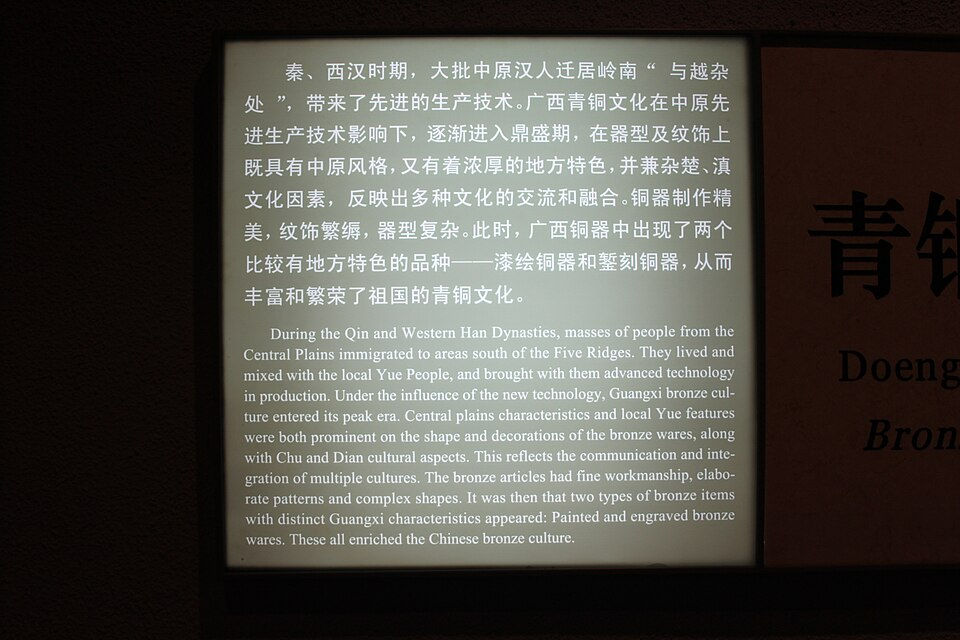

# Bronze Production

> **Node ID**: metals.bronze
> **Domain**: [Metallurgy](./index.md)
> **Dependencies**: [`metals.copper`](copper.md), [`metals.non-ferrous`](non-ferrous.md)
> **Enables**: [`health.medical-instruments`](../health/medical-instruments.md), [`textiles.sewing-tailoring`](../textiles/sewing-tailoring.md)
> **Timeline**: Years 5-10
> **Outputs**: bronze, bronze_castings, bronze_ingots, bronze_tools
> **Critical**: No

Adding tin to copper produces bronze: harder, lower melting point (~950 °C for 10% tin), better castability (flows into fine mold details), and more corrosion-resistant than pure copper. This article covers bronze alloying, casting methods specific to bronze, and bronze working techniques. For copper smelting and refining, see [Copper Production](copper.md).

## Prerequisites

> *Guangxi Provincial Museum, Nanning. Complete indexed photo collection at WorldHistoryPics.com.*

> *Image: Gary Todd from Xinzheng, China, CC0*

- [Copper smelting](copper.md) — copper ingot production
- [Tin metal](non-ferrous.md) — from cassiterite (SnO₂)
- [Beekeeping](../animals/beekeeping.md) — beeswax for lost-wax casting patterns
- [Pottery](../ceramics/pottery.md) — clay working skills for crucible construction

## Materials

| Material | Specification | Source |
|----------|--------------|--------|
| Copper ingots | >99% Cu | [Copper Production](copper.md) |
| Tin metal | >95% Sn, from cassiterite (SnO₂) | [Non-ferrous metals](non-ferrous.md) |
| Beeswax | Pure, melting point 62-65 °C | [Beekeeping](../animals/beekeeping.md) |
| Silica sand | >95% SiO₂, grain size 0.1-0.5 mm, for molding | [Mining](../mining/processing.md) |
| Fire clay | Al₂O₃ content >25%, plasticity index 15-30% | [Ceramics](../ceramics/pottery.md) |

## Bronze Alloying

Adding tin to copper produces bronze: harder, lower melting point (~950 °C for 10% tin), better castability (flows into fine mold details), and more corrosion-resistant than pure copper.

**Prerequisites**: [copper smelting](copper.md), [tin metal](non-ferrous.md) (from cassiterite SnO₂)

**Materials**: copper ingots (>99% Cu), tin metal (>95% Sn, from cassiterite), clay-graphite crucible, green stick for stirring

**Alloy composition**: 88-95% copper + 5-12% tin. 10% tin is standard "classic" bronze. More tin = harder but more brittle.

| Property | 5% Sn bronze | 10% Sn bronze | 12% Sn bronze |
|----------|-------------|--------------|--------------|
| Melting range | 1020-1060 °C | 920-950 °C | 880-920 °C |
| Hardness (as-cast) | 80-100 HV | 120-150 HV | 150-180 HV |
| Tensile strength | 220-260 MPa | 280-340 MPa | 260-300 MPa (brittle) |
| Elongation | 15-25% | 5-15% | 1-5% |
| Density | 8.8 g/cm³ | 8.8 g/cm³ | 8.7 g/cm³ |

**Process**:
1. Melt copper in crucible (reaches ~1100 °C).
2. Add tin metal (melts at 232 °C, dissolves rapidly in molten copper). Stir with green stick (reduces oxide formation).
3. Skim dross (oxides) from surface.
4. Pour into preheated mold immediately — bronze fluidity degrades with time as it oxidizes.

**Verification**: Break a small test button from the pour. Fracture surface of 10% tin bronze is fine-grained and grey-pink. A coarse, crystalline fracture indicates excessive tin or contamination. Weigh the test button to check density (8.8 g/cm³ ±0.1 for 10% Sn) — low density indicates gas porosity.

**Expected performance**: 10% tin bronze casts at 950-1050 °C, flows into mold features down to 1 mm width. Hardness: 120-150 HV as-cast, work-hardens to 200-250 HV. Corrosion rate in seawater: <0.025 mm/year.

**Tin sourcing challenge**: Cassiterite (SnO₂) is geologically rare. If unavailable locally, copper-only tools (softer, need frequent work-hardening by hammering) or arsenical bronze (copper + arsenic-bearing ores, ~1-5% As — effective but toxic during smelting) are alternatives. See [non-ferrous metal production](non-ferrous.md) for tin smelting.

**Strengths**:
- Lower melting point than pure copper — easier to melt with charcoal furnaces
- Superior castability — flows into fine mold details that pure copper cannot fill
- Harder and more corrosion-resistant than pure copper — better for tools and marine hardware

**Weaknesses**:
- Tin (cassiterite) is geologically rare — many regions lack local tin deposits entirely
- Arsenical bronze alternative is toxic during smelting (arsenic trioxide fumes)
- High-tin bronzes (>10% Sn) become brittle — limited working range

## Casting

Molten bronze is poured into molds to produce ingots, tools, and complex shapes. Three mold types serve different purposes; lost-wax casting enables the most intricate forms.

**Prerequisites**: [bronze alloying](#bronze-alloying) (above), [beekeeping](../animals/beekeeping.md) for wax, [clay working](../ceramics/pottery.md)

**Materials**: silica sand (>95% SiO₂, grain 0.1-0.5 mm), fire clay, beeswax (mp 62-65 °C), soapstone or fine-grained stone for reusable molds

**Mold types**:
- **Sand molds**: Fine, damp silica sand packed around wooden pattern. Pattern removed, bronze poured into cavity. Good for simple shapes (ingots, flat tools). Withstands single pour.
- **Clay molds**: Fired clay investment around wax model (lost-wax method) or carved directly. More durable, reusable 1-3 times. Better detail than sand.
- **Stone molds**: Carved soapstone or fine-grained stone. Reusable dozens of times. Best for standardized items (axe heads, ingots).
- **Pouring temperature**: 1000-1100 °C (bronze melts at ~950 °C for 10% Sn, needs superheat for fluidity). Preheat molds to 200-400 °C to prevent thermal shock and improve fill.

**Lost-wax casting** (complex shapes — tools, ornaments):
1. **Wax model**: Sculpt in beeswax or tallow. Attach wax sprue (5-10 mm dia ±2 mm) and vent wires.
2. **Clay investment**: Coat in thin clay slip, build up 2-4 layers of clay + grog (1-3 cm thick ±0.5 cm). Dry thoroughly (2-4 days at ambient temperature).
3. **Burnout**: Heat to 400-600 °C to melt and drain wax. Raise to 800-900 °C to fire clay hard and burn residual wax.
4. **Pour**: Pour molten bronze at 1000-1100 °C into hot mold (improves flow, reduces defects).
5. **Finish**: Cool slowly (2-4 hours), break away investment, cut sprues, file and polish.

**Verification**: Inspect the cast surface for porosity, cold shuts (unfilled areas), and shrinkage cavities. A well-cast bronze tool shows smooth surface finish with no visible gas porosity on the fracture face. Test the mold fill by weighing the casting against the expected volume (bronze density: 8.8 g/cm³) — a shortfall >5% indicates incomplete fill.

**Expected performance**: Sand mold: single use, surface finish ~0.5-1 mm roughness. Stone mold: 20-50 pours before mold degrades, best dimensional accuracy ±1 mm. Lost-wax: finest detail (sub-mm features possible), one use per investment.

**Strengths**:
- Stone molds produce identical items repeatedly with tight dimensional control (±1 mm)
- Lost-wax casting enables complex, undercut shapes impossible with two-part molds
- Casting eliminates the labor of hammering each tool to shape from raw stock

**Weaknesses**:
- Pouring at >1000 °C into cold or damp molds causes violent steam explosions
- Shrinkage on solidification (bronze shrinks ~1.5-2%) can cause internal cavities in thick sections
- Sand molds are single-use (but material can be reused!); lost-wax investment is destroyed per casting — high material consumption

## Work-Hardening & Annealing Bronze

Bronze work-hardens similarly to copper but starts harder. As-cast 10% tin bronze is ~120-150 HV. Cold hammering increases hardness to 200-250 HV. Bronze cannot be hot-worked as easily as copper — high-tin bronzes become hot-short (crumbly) above ~600 °C.

**Annealing** (restores ductility): Heat to 600-650 °C, hold 30-60 min. Cool in air. Unlike copper, bronze does not anneal as fully — repeated cycles gradually reduce ductility. Low-tin bronzes (5% Sn) tolerate more cold work between anneals than high-tin (12% Sn).

**Temperature estimation by color** (no instruments): Dark red ~550 °C, cherry red ~650 °C, bright cherry ~750 °C, dark orange ~850 °C, orange ~950 °C, light yellow ~1050 °C, white ~1150 °C+.

**Verification**: Test hardness by pressing a steel file against the workpiece. As-cast bronze resists the file moderately; work-hardened bronze at ~200-250 HV strongly resists the file.

**Expected performance**: As-cast 10% Sn bronze: ~120-150 HV. Cold-worked (50% reduction): ~200-250 HV, elongation drops to 2-5%. Annealing at 600-650 °C restores ductility to ~10-15%.

**Strengths**:
- Higher starting hardness than copper — less cold work needed for tool-grade hardness
- Work-hardened bronze (200-250 HV) is harder than work-hardened copper (~150 HV)

**Weaknesses**:
- Less ductile than copper at all stages — fewer work-harden/anneal cycles before cracking
- High-tin bronzes (>10% Sn) cannot be hot-worked — they crumble instead of deforming
- Annealing does not fully restore ductility — each cycle degrades slightly

## Safety & Hazards

- **Molten metal burns**: Bronze melts at ~950 °C for 10% tin bronze and causes devastating deep-tissue burns on skin contact. Molten metal splashes readily when poured into damp or cold molds. Wear heavy leather apron, gauntlet gloves, face shield, and closed-toe boots. Preheat all molds and crucibles to 200-400 °C before contact with molten metal. Never pour molten metal into wet molds; trapped moisture flashes to steam and ejects metal explosively.
- **Toxic fumes from arsenical ores**: Arsenical bronze production (~1-5% As) is particularly hazardous. Arsenic-bearing ores release arsenic trioxide (As₂O₃) vapor during smelting. Arsenic fumes cause nausea, vomiting, abdominal pain, and long-term nerve and organ damage. OSHA PEL for As₂O₃: 0.01 mg/m³ as an 8-hour TWA. Smelt in well-ventilated areas or under a hood. Respiratory protection (P100 particulate filter or better) required.
- **Carbon monoxide poisoning**: Charcoal-fueled furnaces produce substantial carbon monoxide (CO). CO is odorless, colorless, and causes headache at 100 ppm, dizziness at 200 ppm, confusion at 400 ppm, and death at >1,000 ppm with 1-2 hours exposure. NIOSH IDLH: 1,200 ppm. Never operate furnaces in enclosed spaces. Ensure through-draft ventilation.
- **Slag and spark injuries**: During hot forging and slag skimming, hot slag and metal particles spray out as bright sparks at 700-900 °C. Eye protection (safety glasses rated ANSI Z87.1 or face shield) is essential when hammering hot metal.

## Scaling Notes

Bronze production scales with furnace capacity and mold-making throughput:

- **Workshop scale** (1-5 kg pour): Charcoal-fired pit furnace with clay-graphite crucible (capacity 1-2 kg). Hand-bellows or natural draft. Sand molds packed by hand, or carved stone molds for standard items. One craftworker. Production: 1-3 castings per day. This is the earliest bronze production scale — sufficient for tools, weapons, and ornaments.

- **Foundry scale** (10-50 kg pour): Reverberatory furnace or forced-draft charcoal furnace. Graphite crucible (10-30 kg capacity). Multiple sand molding stations. Lost-wax casting for complex items. 3-8 workers. Production: 10-50 castings per day. This scale supports a small city's needs for tools, hardware, marine fittings, and weapons.

- **Industrial scale** (100-1,000+ kg pour): Coke-fired or oil-fired crucible furnace. Mechanical sand mixing and molding machines. Multiple pouring lines. 20-100 workers. Production: 100-1,000 castings per day. This scale supplies industrial bearings, marine propellers, artillery, and architectural bronze.

**Critical bottleneck**: Tin supply. Cassiterite (SnO₂) deposits are geographically concentrated. A bronze-producing civilization needs reliable trade routes or local tin deposits. Arsenical bronze (using arsenic-bearing copper ores) is a fallback but introduces severe toxicity during smelting.

## Quality Control

| Check | Method | Acceptance Criteria |
|-------|--------|-------------------|
| Alloy composition | Fracture test button — color and grain | Fine-grained, grey-pink for 10% Sn; reddish = too little tin; coarse white = too much tin |
| Tin content (quantitative) | Density measurement (Archimedes) | 8.8 g/cm³ ±0.1 for 10% Sn bronze |
| Gas porosity | Visual inspection of fracture surface | No visible gas holes >0.5 mm diameter |
| Casting fill completeness | Weight vs. expected volume | Shortfall <5% of expected casting weight |
| Surface hardness (as-cast) | File test or Brinell hardness | 120-150 HV for 10% Sn bronze |
| Surface hardness (work-hardened) | File test or Brinell hardness | 200-250 HV after 50% cold reduction |
| Mold dimensional accuracy | Straightedge + feeler gauges | ±1 mm for stone molds; ±2 mm for sand molds |

## Troubleshooting

| Problem | Probable Cause | Solution |
|---------|---------------|----------|
| Bronze casting has coarse, crystalline fracture with gas porosity | Tin content exceeds 12% (too brittle) or moisture in mold generating gas | Verify tin charge weight — target 88–95% Cu + 5–12% Sn; test density at 8.8 g/cm³ ±0.1; preheat molds to 200–400°C |
| Lost-wax casting shows incomplete fill (cold shuts) | Mold not preheated or pouring temperature below 1000°C — metal solidifies before filling cavity | Preheat mold to 200–400°C; superheat bronze to 1000–1100°C; increase sprue diameter to 8–10 mm for better flow |
| Bronze casting has reddish color instead of golden-yellow | Tin content too low — copper-rich alloy | Verify tin charge weight; target 5–12% Sn for proper bronze |
| Stone mold casting shows dimensional drift after 20+ pours | Mold surfaces eroding from repeated thermal cycling at 950–1100°C | Switch to new mold after 20–50 pours; for production runs >50 units, use carved soapstone or iron permanent molds |
| Arsenical bronze fumes causing nausea among workers | Inadequate ventilation during smelting of arsenic-bearing ores | Move smelting outdoors or under hood; provide P100 respirators; consider switching to tin bronze if cassiterite is available |

## Variations and Alternatives

| Alloy | Composition | Key Properties | Best Application |
|-------|------------|----------------|-----------------|
| Classic bronze | 90% Cu, 10% Sn | Hardness 120-150 HV, good castability | Tools, weapons, statues |
| Phosphor bronze | 90% Cu, 9.5% Sn, 0.5% P | Excellent fatigue resistance, spring properties | Springs, bearings, musical instruments |
| Aluminum bronze | 89-95% Cu, 5-11% Al | High strength (400-600 MPa), excellent seawater corrosion resistance | Marine propellers, pump impellers, valves |
| Silicon bronze | 96% Cu, 3% Si, 1% Mn | Good weldability, high toughness | Welding wire, marine hardware, art castings |
| Arsenical bronze | 95-99% Cu, 1-5% As | Harder than pure copper, no tin required | Where cassiterite is unavailable (toxic during smelting) |
| Leaded bronze | 85% Cu, 5% Sn, 5% Pb, 5% Zn | Excellent machinability, self-lubricating in bearings | Bearings, bushings, valves |
| Bell metal | 78% Cu, 22% Sn | Very hard (250+ HV), resonant tone | Bells, cymbals, gongs |

**Copper-only alternative**: Without tin, copper tools must be work-hardened by repeated cold hammering. Work-hardened copper reaches ~150 HV (compared to 120-150 HV for as-cast 10% Sn bronze). Copper tools are softer, require more frequent re-hardening, and lack bronze's castability advantage — but they work if tin is entirely unavailable.

**Brass alternative**: Copper + zinc (30-40% Zn) produces brass, which is easier to machine than bronze and has an attractive gold color. Brass is softer (80-120 HV) and less corrosion-resistant in seawater. See [Non-Ferrous Metals](non-ferrous.md) for zinc production.

## Historical Context

Bronze was the first intentionally alloyed metal, appearing around 3300 BCE in the Near East. The Bronze Age lasted nearly 2,000 years before iron smelting became widespread. Key milestones:

- **Copper Age (5500-3300 BCE)**: Pure copper tools, cold-worked and annealed. Soft (80-100 HV), limited durability. Arsenical copper appeared first — arsenic-bearing ores accidentally alloyed during smelting.
- **Early Bronze Age (3300-2000 BCE)**: Deliberate tin addition to copper. 5-10% Sn bronze tools and weapons replaced copper. Casting enabled mass production of standardized items (axe heads, spear points, daggers).
- **Full Bronze Age (2000-1200 BCE)**: Lost-wax casting developed for complex shapes. Trade networks for tin extended thousands of kilometers (Afghanistan tin to Mesopotamia, Cornwall tin to Mediterranean). Bronze became the dominant engineering material for tools, weapons, armor, and ship fittings.
- **Late Bronze Age collapse (~1200 BCE)**: Disruption of tin trade routes coincided with iron smelting becoming practical. Bronze remained important for bearings, bells, and marine hardware long after iron tools became common.

For a bootstrapping civilization, bronze fills the critical gap between copper (too soft for durable tools) and iron (requires higher smelting temperatures ~1200°C and more complex processing). A civilization with copper smelting and access to cassiterite can produce bronze tools within months — centuries before iron becomes practical.

## See Also

- [Copper Production](copper.md) — copper smelting, refining, and processing
- [Fire-Making](../foundations/fire.md) — smelting heat source
- [Beekeeping](../animals/beekeeping.md) — beeswax for lost-wax casting
- [Non-Ferrous Metals](non-ferrous.md) — tin smelting from cassiterite
- [Iron & Steel](iron-steel.md) — next metallurgical stage
- [Sewing & Tailoring](../textiles/sewing-tailoring.md) — bronze needles and tools
- [Medical Instruments](../health/medical-instruments.md) — bronze surgical tools

*Part of the [Bootciv Tech Tree](../../index.md) · [Metals](./index.md) · [All Domains](../../index.md)*
