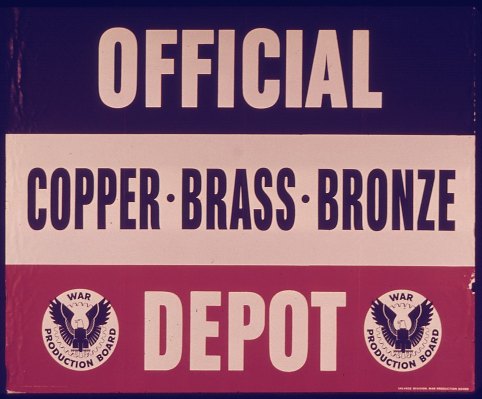

# Copper & Bronze Production

> **Node ID**: metals.copper-bronze
> **Domain**: [Metallurgy](./index.md)
> **Dependencies**: [`animals.beekeeping`](../animals/beekeeping.md), [`foundations.fire`](../foundations/fire.md), [`mining`](../mining/index.md)
> **Enables**: [`health.medical-instruments`](../health/medical-instruments.md), [`metals.iron-steel`](iron-steel.md), [`metals.non-ferrous`](non-ferrous.md), [`textiles.sewing-tailoring`](../textiles/sewing-tailoring.md)
> **Timeline**: Years 5-10
> **Outputs**: copper, bronze, castings, ingots
> **Critical**: No

Copper was the first metal smelted (~5000 BCE) and remains the backbone of electrical infrastructure worldwide. This article covers the fundamentals of copper and bronze metallurgy shared between the two detailed articles:

- **[Copper Production](copper.md)** — Copper smelting from carbonate and sulfide ores, casting, work-hardening, electrolytic refining, brass production, copper for electrical use, industrial smelting, and copper-nickel alloys.
- **[Bronze Production](bronze.md)** — Bronze alloying with tin, bronze casting methods, and bronze working techniques.

## Why Copper Came First

> *Image: Unknown authorUnknown author or not provided, Public domain*

Copper was the first metal worked because three properties align uniquely. First, several copper minerals occur as native (metallic) copper that can be cold-hammered without any smelting. Second, copper oxide and carbonate ores (malachite, azurite) reduce to metal at temperatures reachable in a pottery kiln or campfire with forced draft: 700-900°C. Compare this to iron, which requires 1200-1400°C for bloomery reduction. Third, molten copper at 1085°C melts cleanly and casts into open molds with good fluidity, unlike wrought iron which melts at 1538°C and absorbs carbon from the fuel before reaching that temperature.

The reduction chemistry is straightforward. When copper oxide ores are heated in contact with carbon (charcoal), the carbon strips oxygen from the ore:

- Cu₂O + C → 2Cu + CO (cuprous oxide + carbon → copper + carbon monoxide)
- 2CuO + C → 2Cu + CO₂ (cupric oxide + carbon → copper + carbon dioxide)

These reactions proceed at temperatures as low as 700°C, though complete reduction benefits from 900-1100°C. The reactions are self-indicating: the green or blue ore turns metallic, and the distinctive copper color confirms success.

## Copper Ore Types and Identification

| Ore | Formula | Appearance | Cu Content | Reduction Difficulty |
|-----|---------|------------|------------|---------------------|
| Native copper | Cu | Metallic, reddish, malleable | 100% | None (cold hammer) |
| Malachite | Cu₂CO₃(OH)₂ | Bright green, banded | 57% | Easy (reduces at 700-900°C) |
| Azurite | Cu₃(CO₃)₂(OH)₂ | Deep blue, crystalline | 55% | Easy (reduces at 700-900°C) |
| Cuprite | Cu₂O | Red, earthy to crystalline | 89% | Moderate |
| Chalcocite | Cu₂S | Dark gray to black | 80% | Moderate (requires roasting + reduction) |
| Chalcopyrite | CuFeS₂ | Brassy yellow, tarnishes | 35% | Hard (iron removal required) |
| Bornite | Cu₅FeS₄ | Purple-brown tarnish | 63% | Hard (iron removal required) |

The oxide and carbonate ores (malachite, azurite, cuprite) are the bootstrap entry point. They reduce directly in a charcoal fire with forced air. The sulfide ores (chalcocite, chalcopyrite, bornite) require a two-step process: roasting in air to convert sulfides to oxides (driving off SO₂), then reduction with carbon. Chalcopyrite, the most abundant copper ore worldwide, adds the complication of iron removal, requiring a matte smelting step at 1200-1300°C.

Field identification: malachite and azurite are unmistakable bright green and deep blue. Cuprite is red. Chalcopyrite looks like brass or pyrite ("fool's gold") but is softer and tarnishes to iridescent colors. Streak test on unglazed porcelain: copper minerals streak green to black, while pyrite streaks brown-black.

## Smelting Fundamentals

### Crucible Smelting (Simplest Method)

The lowest-technology copper smelting method requires only a clay crucible, charcoal, a forced-air source (bellows or blowpipe), and crushed ore.

1. Crush ore to pea-sized gravel (5-15 mm). Remove obvious gangue (rock without copper mineral). Wash to remove clay and dirt.
2. Place a 3-5 cm bed of charcoal in the crucible. Layer crushed ore on top. Cover with more charcoal. The charcoal-to-ore ratio should be 3:1 to 5:1 by weight (excess carbon ensures complete reduction).
3. Heat the crucible with forced air. Bellows delivering 50-150 liters per minute are sufficient for a small crucible (15-20 cm diameter). The fire must reach 900-1100°C. At these temperatures, the charcoal glows bright orange to yellow, and the crucible walls radiate visible heat.
4. Maintain full heat for 1-2 hours. The ore gradually reduces. You can observe the color change from green/blue to metallic copper. Small beads of copper form and coalesce.
5. Allow to cool slowly (30-60 minutes). Do not quench the crucible; thermal shock cracks it. Open the crucible and separate the copper prills (small beads) from the slag and unreacted charcoal.
6. Melt the prills together in a fresh crucible with charcoal cover. Heat to 1100-1200°C (copper melts at 1085°C). Pour into a simple open mold (depressed stone, sand mold, or clay mold) to form an ingot.

A 15 cm crucible processes 200-500 g of ore per firing, yielding 50-150 g of copper from oxide/carbonate ore at 25-40% recovery rate. Multiple firings are needed to accumulate enough copper for casting.

### Furnace Smelting (Higher Throughput)

A simple shaft furnace (50-80 cm tall, 25-40 cm internal diameter) made from clay or stone, with a tuyere (2-3 cm diameter clay pipe) at the base connected to bellows, processes 2-10 kg of ore per firing. The furnace operates on the same principle as the crucible but at larger scale. Layer charcoal and crushed ore alternately. Light from the bottom, apply full bellows blast. Run for 2-4 hours. Tap the molten copper and slag from the base, or break open the furnace after cooling to retrieve the copper mass.

Furnace smelting temperatures: 1100-1300°C with forced draft. The copper melts and collects at the bottom of the furnace. Slag (silicates and iron oxides) floats on the molten copper. Separate by tapping the slag hole first (higher), then the copper tap hole (lower).

Recovery rates: 60-85% for oxide/carbonate ores in a well-operated furnace. Poor bellows delivery, wet charcoal, or insufficient temperature drops recovery to 30-50%.

## Bronze Alloying

Adding tin to copper produces bronze, a harder, stronger alloy that casts more easily than pure copper. The tin-copper system forms a solid solution up to about 15% tin at typical casting temperatures. Above 15% tin, a brittle delta phase (Cu₃₁Sn₈) forms, making the alloy unsuitable for tools.

### Bronze Compositions by Application

| Alloy Type | Cu % | Sn % | Other | Hardness (HB) | Use |
|-----------|------|------|-------|---------------|-----|
| Leaded bronze (casting) | 85-88 | 5-8 | 2-5% Pb | 60-80 | Bushings, bearings, decorative |
| Standard bronze (tools) | 88-90 | 10-12 | — | 90-120 | Tools, weapons, fittings |
| Bell bronze | 78-80 | 20-22 | — | 140-180 | Bells, cymbals (hard, resonant) |
| Mirror bronze | 65-70 | 25-30 | — | 150-200 | Mirrors (polishable, brittle) |
| Phosphor bronze | 90-94 | 5-8 | 0.1-0.5% P | 80-130 | Springs, marine hardware |
| Leaded gunmetal | 85-88 | 4-6 | 2-5% Pb, 1-3% Zn | 65-90 | Valves, fittings, pump bodies |

**Why tin hardens copper**: Tin atoms are larger than copper atoms (atomic radius 1.45 Å vs 1.28 Å). When tin dissolves in the copper crystal lattice, it distorts the lattice and pins dislocations, preventing them from moving freely. This solid-solution strengthening raises hardness from about 40 HB (pure copper, annealed) to 90-120 HB for 10% tin bronze. The effect is similar to adding carbon to iron to make steel.

**Alloying procedure**:
1. Melt copper in a crucible under charcoal cover to prevent oxidation. Heat to 1150-1200°C (copper should be fully liquid and fluid).
2. Preheat tin metal separately. Tin melts at 232°C, so it needs only moderate heat.
3. Add the tin to the molten copper. The tin dissolves rapidly. Stir gently with a clay rod or charcoal stick to homogenize. Do not use an iron rod; iron dissolves into the bronze.
4. Skim any oxide dross from the surface. The charcoal cover reduces oxide formation.
5. Pour immediately into preheated molds. Bronze casting temperature: 1050-1150°C (pour 50-100°C above the liquidus for the specific alloy). Mold preheat to 200-400°C prevents misruns and cold shuts.

**Tin losses**: Tin oxidizes more readily than copper at molten metal temperatures. With a charcoal cover and prompt pouring, tin losses stay below 1-2%. Without a cover, losses can reach 5-10% as tin dross (SnO₂). Weigh the tin addition to compensate for expected loss.

## Copper and Bronze Properties

| Property | Pure Copper | 10% Tin Bronze | 5% Tin Bronze | Lead Bronze |
|----------|------------|----------------|----------------|-------------|
| Melting point | 1085°C | ~1000°C (liquidus) | ~1040°C | ~1000°C |
| Density | 8.96 g/cm³ | 8.8 g/cm³ | 8.7 g/cm³ | 8.8 g/cm³ |
| Tensile strength (cast) | 150-200 MPa | 200-300 MPa | 180-250 MPa | 180-230 MPa |
| Tensile strength (work-hardened) | 300-400 MPa | 350-500 MPa | 300-400 MPa | Not workable |
| Elongation (cast) | 15-25% | 5-15% | 10-20% | 3-8% |
| Hardness (cast, HB) | 40-50 | 90-120 | 70-90 | 60-80 |
| Castability | Good | Excellent | Good | Excellent (Pb improves flow) |
| Machinability | Fair | Good | Good | Excellent (Pb acts as chip breaker) |
| Corrosion resistance | Good (patina) | Good (marine) | Good | Good |

**Work hardening**: Pure copper and low-tin bronzes can be strengthened significantly by cold hammering. Each blow deforms the crystal structure, creating dislocations that entangle and impede further deformation. The hardness roughly doubles after 30-50% cold reduction. This is how early metalworkers made copper tools harder before bronze was developed. Annealing at 400-600°C restores softness for further working.

## Heat Color Chart for Copper-Bronze Working

Reading metal temperature by color is the primary temperature control method without instruments. These colors apply in a darkened or dim forge area.

| Temperature (°C) | Color (in dark) | Working Use |
|-------------------|-----------------|-------------|
| 200-300 | Faint brown oxidation | Stress relief, low-temperature tempering |
| 400 | Dark brown/purple oxidation | Annealing starts for work-hardened copper |
| 500-600 | Dark red (barely visible glow) | Copper annealing range |
| 700 | Dark cherry red | Bronze forging range begins |
| 800 | Bright cherry red | Copper forging, bronze shaping |
| 900 | Orange | Full forging range, sulfide ore roasting |
| 1000-1050 | Bright orange to yellow | Bronze casting temperature |
| 1085 | Yellow-white (copper melts) | Copper melting point |
| 1100-1200 | White-yellow | Copper casting, furnace smelting |

## Casting Methods

### Open Mold Casting

The simplest method. Carve a negative of the desired shape into a flat stone (fine-grained sandstone, limestone, or slate) or press into damp sand. Pour molten copper or bronze directly into the cavity. The bottom surface (against the mold) is smoother than the top surface (air exposure). Overspray and flash can be trimmed with a chisel or ground off with an abrasive stone.

Mold preheating: 200-400°C for stone molds, room temperature for sand molds. Cold stone molds cause premature solidification and misruns in thin sections.

### Lost-Wax (Investment) Casting

For complex shapes with undercuts that cannot be removed from a rigid mold.

1. Model the desired object in [beeswax](../animals/beekeeping.md). Attach wax sprues (pouring channels) and vents.
2. Cover the wax model with a clay investment (fine clay slip, 2-3 coats, then a coarse outer layer 1-2 cm thick). Let dry completely (1-3 days depending on size and humidity).
3. Heat the investment mold gently (100-150°C) to melt out the wax. Drain the wax through the sprue openings. This leaves a hollow cavity exactly the shape of the original model.
4. Fire the clay mold to harden it (800-1000°C, the same temperature range as pottery firing). The mold must be thoroughly dry and hard before pouring.
5. Pour molten bronze into the mold. The mold is typically heated to 200-400°C before pouring to prevent thermal shock and improve metal flow into thin sections.
6. Allow to cool. Break away the clay investment. Cut off sprues and vents. Chase (finish) the surface with files and abrasives.

**Investment composition**: Fine river clay mixed with 20-30% fine sand or crushed pottery grog for thermal shock resistance. Dung or plant fiber temper (5-10%) helps prevent cracking during drying and firing.

### Sand Molding

For重复 production of identical parts. Pack damp molding sand (silica sand + 5-10% clay binder + 3-5% water) around a wooden or metal pattern in a two-part flask. Remove the pattern, leaving the cavity. Sand casting is reusable: the sand is broken away after each pour and reconditioned with fresh clay and water.

Shrinkage allowance: bronze shrinks approximately 1-1.5% on solidification. Patterns must be made proportionally larger.

## Quantitative Smelting Parameters

| Parameter | Crucible Method | Shaft Furnace | Reverberatory Furnace |
|-----------|----------------|---------------|----------------------|
| Batch size (ore) | 0.2-0.5 kg | 2-10 kg | 100-1000+ kg |
| Charcoal per kg ore | 3-5 kg | 4-6 kg | 3-5 kg |
| Temperature | 900-1100°C | 1100-1300°C | 1200-1300°C |
| Cycle time | 2-3 hours | 3-5 hours | 4-8 hours |
| Recovery (oxide ore) | 25-40% | 60-85% | 85-95% |
| Recovery (sulfide ore) | Not practical | 30-50% | 70-90% |
| Air supply needed | 50-150 L/min | 200-500 L/min | Mechanized blower |
| Copper yield per firing | 50-150 g | 0.5-5 kg | 50-500+ kg |

## Safety

- **Molten metal splash**: Copper at 1100-1200°C and bronze at 1050-1150°C cause severe burns on contact. Moisture in molds or tools causes violent steam explosions that throw molten metal. Preheat all molds and tools that will contact molten metal. Preheat to 200°C minimum to drive off moisture.
- **Carbon monoxide**: Charcoal combustion in enclosed or semi-enclosed furnaces produces carbon monoxide (CO). CO is colorless, odorless, and causes headache, confusion, unconsciousness, and death at 0.1% concentration for 1 hour. Smelt outdoors or in a well-ventilated space with cross-draft. If anyone becomes confused or lethargic during smelting, move them to fresh air immediately.
- **SO₂ from sulfide ores**: Roasting copper sulfide ores (chalcopyrite, chalcocite) produces sulfur dioxide. SO₂ is a sharp, choking gas that irritates the respiratory tract and causes lung damage at concentrations above 5 ppm. Roast ores outdoors downwind. Do not inhale the smoke from sulfide roasting.
- **Zinc fume fever**: If brass scrap (copper-zinc alloy) is accidentally melted with copper or bronze, the zinc boils off at 907°C and produces zinc oxide fume. Inhalation causes metal fume fever: chills, fever, muscle aches, and headache 4-8 hours after exposure. The symptoms resemble influenza and resolve in 24-48 hours. Avoid melting brass with copper/bronze. If zinc fume is generated, ventilate the area.
- **Heavy metal hazards**: Lead in leaded bronze (2-5% Pb) produces lead oxide fume at pouring temperatures. Lead exposure causes cumulative neurological and organ damage. Antimony in some bronze alloys is toxic. Handle lead-bearing alloys with local exhaust ventilation. Wash hands after handling lead-containing metals.

### Personal Protective Equipment

- Leather apron and heat-resistant gloves when pouring molten metal
- Safety glasses or face shield with full face coverage during pouring
- Closed-toe leather boots (no synthetic materials that melt)
- Long sleeves of cotton or wool (synthetics melt on contact with hot metal)
- Respiratory protection when roasting sulfide ores (dust mask minimum)

## Troubleshooting

| Problem | Probable Cause | Solution |
|---------|---------------|----------|
| Copper prills are small and scattered, not coalescing | Temperature too low (below 1085°C) or insufficient time at temperature | Increase bellows blast; extend firing time 30-60 min; add more charcoal |
| Excessive slag, little copper | Charcoal-to-ore ratio too low, or ore grade too poor | Increase ratio to 5:1; upgrade ore by hand-sorting visible gangue |
| Bronze casting has porosity (small holes) | Gas absorption from air exposure; moisture in mold | Use charcoal cover on melt; preheat molds to 200°C+; pour quickly |
| Bronze casting shows misrun (incomplete fill) | Pour temperature too low; mold too cold; section too thin | Heat metal to 50-100°C above liquidus (1100-1150°C); preheat mold to 300-400°C; enlarge thin sections if possible |
| Tin content lower than expected | Tin oxidized as dross during melting; inadequate charcoal cover | Add fresh charcoal cover after tin addition; pour within 5-10 min of alloying; compensate tin addition by 1-2% for expected loss |
| Copper ingot has dark, rough surface | Heavy oxidation during cooling; no charcoal cover | Cover melt with charcoal; cast in covered mold; reduce time between melting and pouring |
| Sand mold breaks apart during pouring | Sand too dry (low clay binder) or too wet (steam explosion) | Adjust water to 3-5% by weight; squeeze test: sand should hold shape when squeezed but break cleanly |
| Lost-wax investment cracks during firing | Mold dried too fast or contains trapped moisture | Dry mold for 2-3 days; fire slowly (50-100°C/hour ramp); use grog temper in investment clay |
| Work-hardened copper cracks during forging | Working below recrystallization temperature; too much cold work between anneals | Reheat to 500-600°C (dark red) to anneal; limit cold reduction to 30-40% before re-annealing |
| Bronze tool edge chips instead of sharpening | Tin content too high (>15%), forming brittle delta phase | Reduce tin to 10-12% for tools; reserve high-tin alloys for bells only |

## Prerequisites

- [Fire management](../foundations/fire.md) — controlled combustion for furnace operation
- [Charcoal production](../energy/charcoal.md) — fuel achieving 1100-1300 °C in forced-draft furnaces
- [Mining](../mining/index.md) — ore extraction and beneficiation
- [Beekeeping](../animals/beekeeping.md) — beeswax for lost-wax casting patterns
- [Pottery](../ceramics/pottery.md) — clay working skills for furnace and crucible construction

## See Also

- [Copper Production](copper.md) — copper smelting, refining, and processing
- [Bronze Production](bronze.md) — bronze alloying, casting, and working
- [Iron & Steel](iron-steel.md) — next metallurgical stage
- [Non-Ferrous Metals](non-ferrous.md) — brass, zinc, and other copper alloys
- [Metal Casting](casting.md) — casting techniques in detail

*Part of the [Bootciv Tech Tree](../index.md) · [Metals](./index.md) · [All Domains](../index.md)*
