# Metals

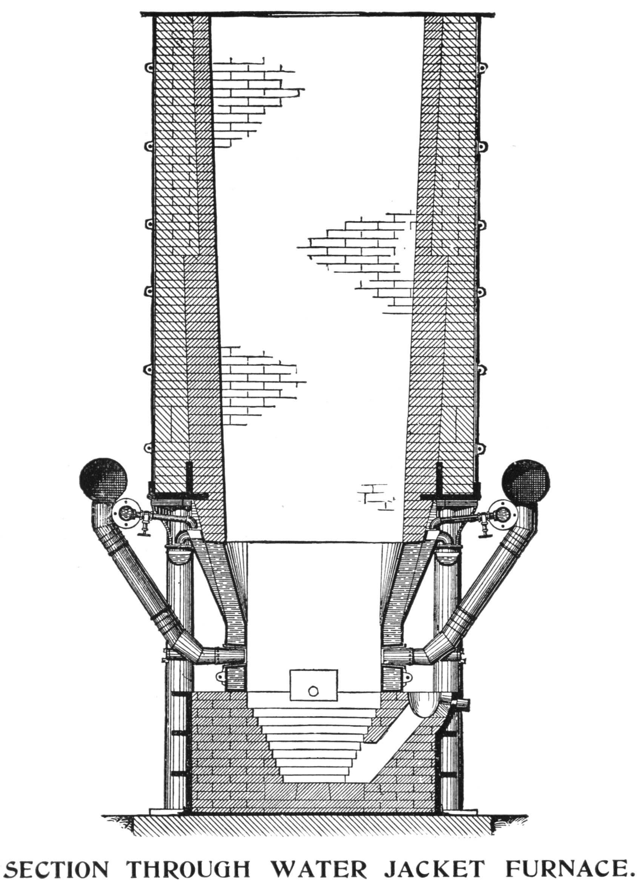
> *Image: Anaconda Company, Public domain*

> *Rectangular water jacket blast furnace Section*

> *Image: Anaconda Company, Public domain*

Capabilities in this domain:

> *Image: Syracuse Aluminum &amp; Bronze Co., Public domain*

- [Copper & Bronze Production](copper-bronze.md) — Overview: copper smelting, bronze alloying, casting, refining, and electrical copper.
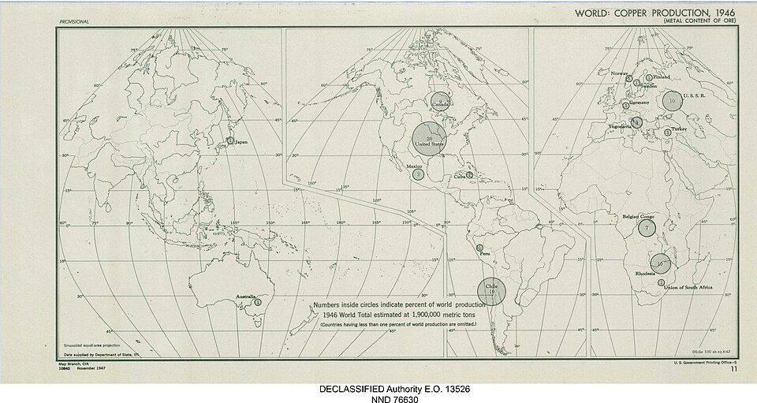
> *Image: Chemicalinterest, Public domain*

- [Copper Production](copper.md) — Copper smelting from carbonate and sulfide ores, casting, work-hardening, electrolytic refining, brass production, copper for electrical use, industrial smelting, and copper-nickel alloys.

> *Image: Mary Harrsch, CC BY-SA 4.0*

- [Bronze Production](bronze.md) — Bronze alloying with tin, bronze casting methods, and bronze working techniques.
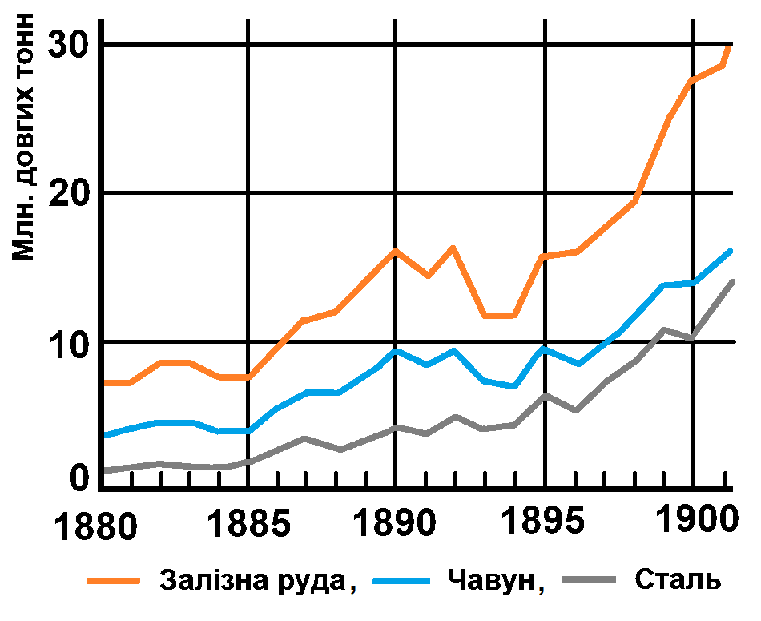
> *Image: Blast furnace chip worker, CC BY-SA 4.0*

- [Iron & Steel Production](iron-steel.md) — Bloomery smelting of iron ore at 1200-1400°C producing wrought iron, carburization for steel, and crucible steel. Heat treatment, metalworking, and joining.
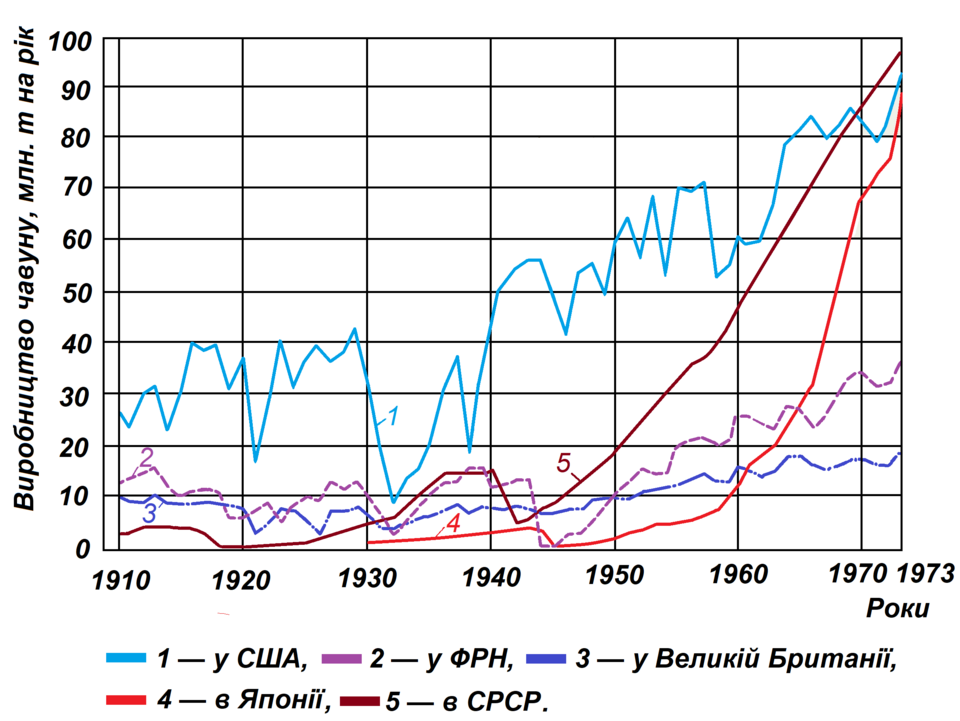
> *Image: Blast furnace chip worker, CC BY-SA 3.0*

- [Blast Furnace & Cast Iron](blast-furnace.md) — Continuous iron smelting producing pig iron and cast iron via blast furnace and cupola furnace. Hot blast stoves, slag processing, sintering, DRI.
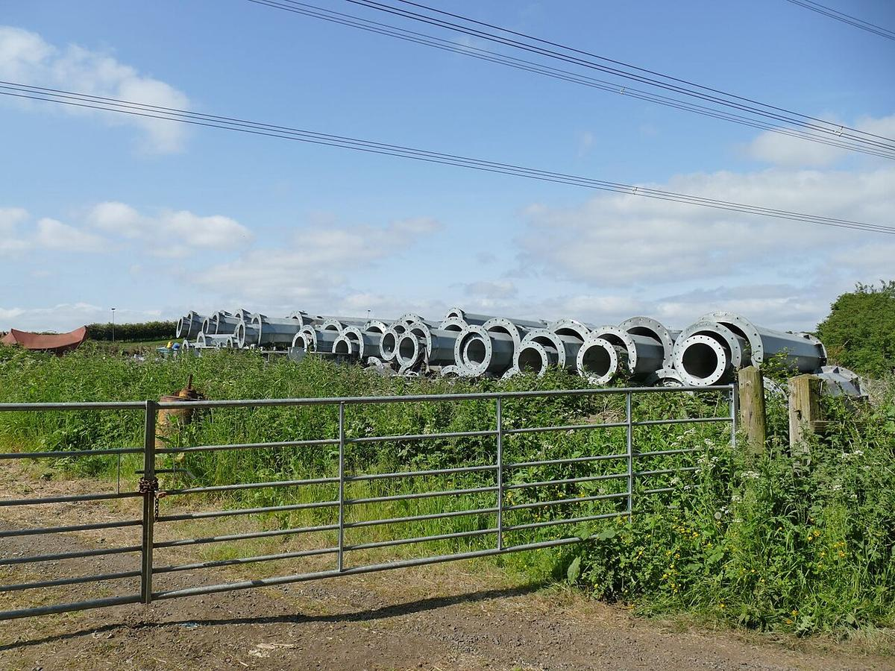
> *Image: Stephen Craven, CC BY-SA 2.0*

- [Metal Casting](casting.md) — Crucible furnaces for aluminum (660°C) and cast iron (1200-1400°C), green sand molding with bentonite binder, pattern making with shrinkage allowance, flask-based casting, and investment casting.
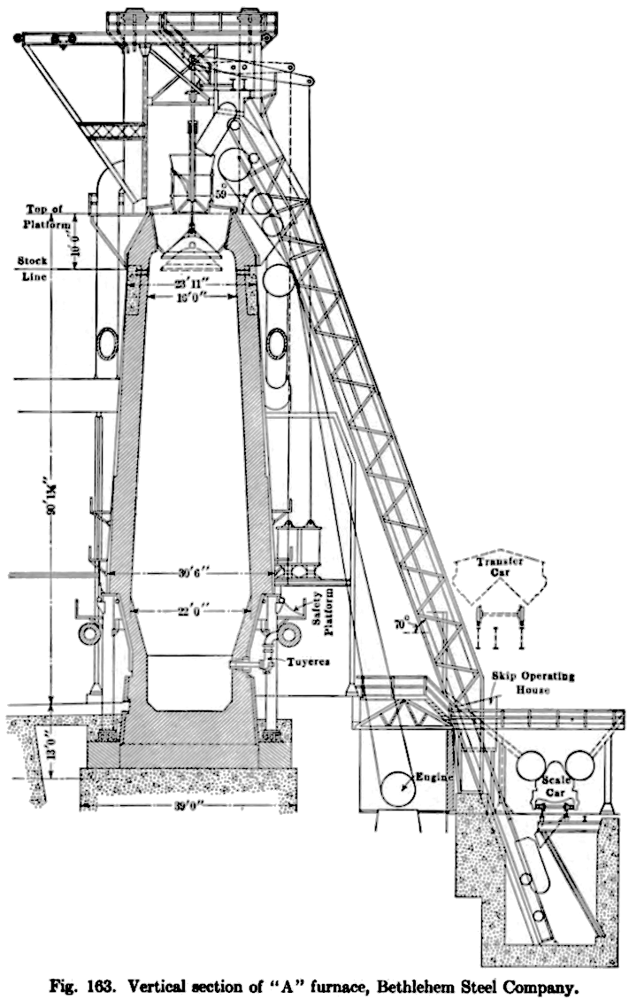
> *Image: Joseph Esrey Johnson, Jr. (1870-1919), Public domain*

- [Modern Steelmaking](steelmaking.md) — Bessemer, open-hearth, basic oxygen furnace (BOF), electric arc furnace (EAF), ladle metallurgy, continuous casting, and steel product forms.
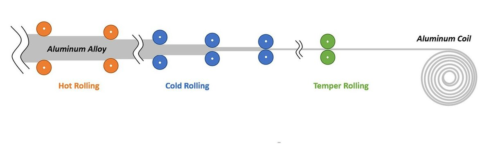
> *Image: Bruce McCrary for US National Park Service, Public domain*

- [Aluminum Production](aluminum.md) — Bayer process alumina production, Hall-Héroult electrolytic smelting, aluminum alloys, extrusion, die casting, and recycling.
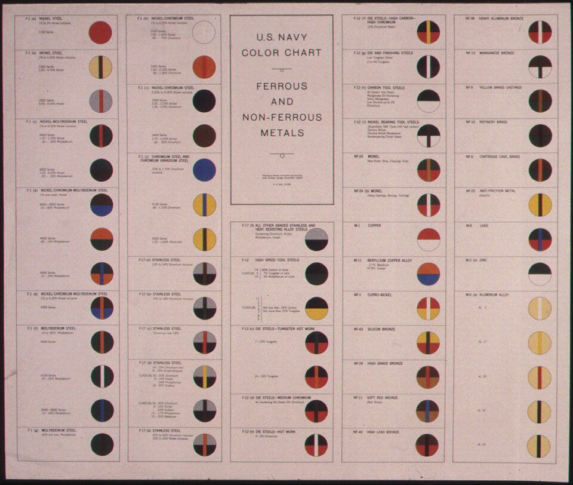
> *Image: Central Intelligence Agency, Public domain*

- [Non-Ferrous Metal Production](non-ferrous.md) — Industrial production of zinc, lead, tin, nickel, magnesium, and titanium from ores. Galvanizing, batteries, solder, and specialty metals.
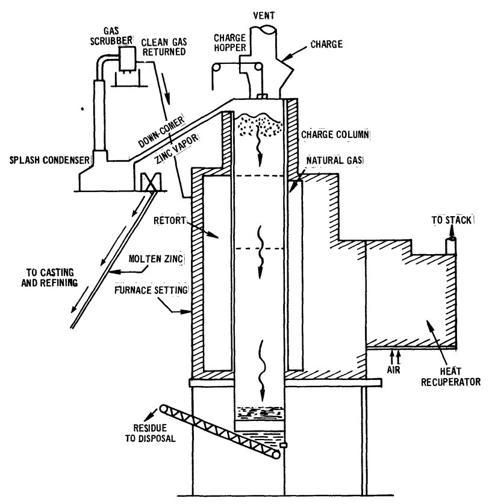
> *Image: United States Environmental Protection Agency, Public domain*

- [Zinc Production](zinc.md) — Zinc smelting for galvanizing steel corrosion protection, brass alloy production, zinc oxide manufacturing, and zinc-air batteries.
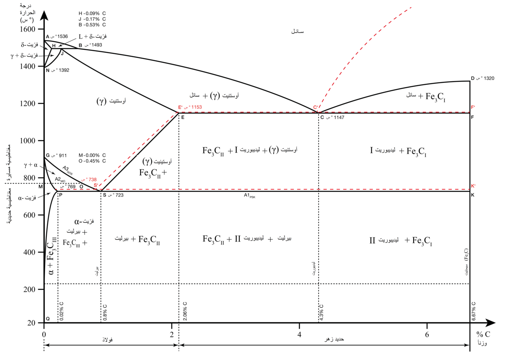
> *Image: AG Caesar, CC BY-SA 4.0*

- [Specialty Alloys](alloys.md) — Stainless steels, tool steels, superalloys (Ni-based, Co-based), titanium alloys, and alloy design principles.
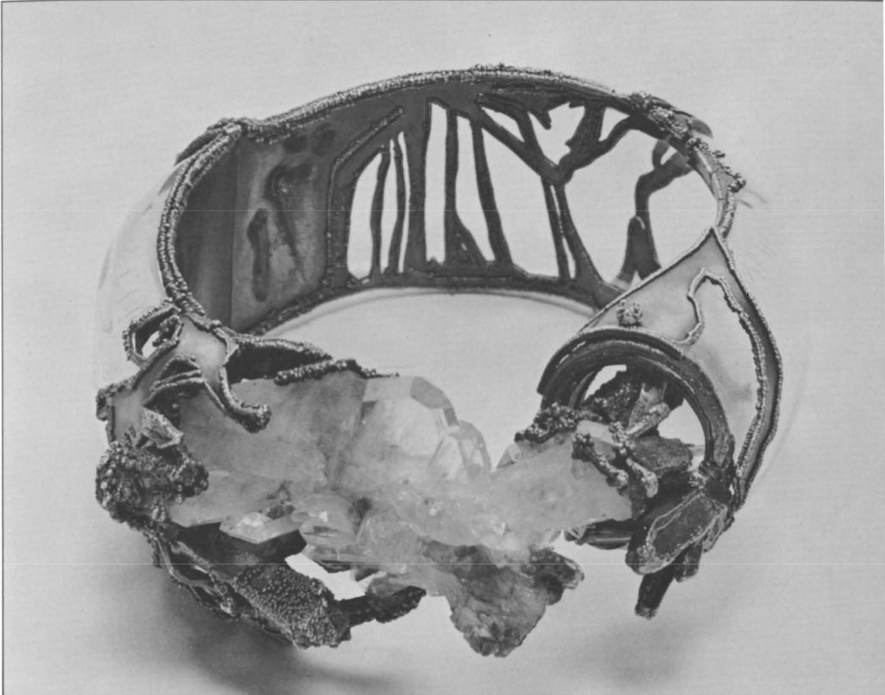
> *Image: Norman Geske, Public domain*

- [Primary Metal Forming](forming.md) — Continuous casting, hot rolling, extrusion, wire rod rolling, forging at scale, and structural section rolling at the mill.
<!-- TODO: source image for Metal Finishing & Surface Treatment -->
- [Metal Finishing & Surface Treatment](finishing.md) — Galvanizing, electroplating, anodizing, phosphating, case hardening, passivation, thermal spraying, and pickling.
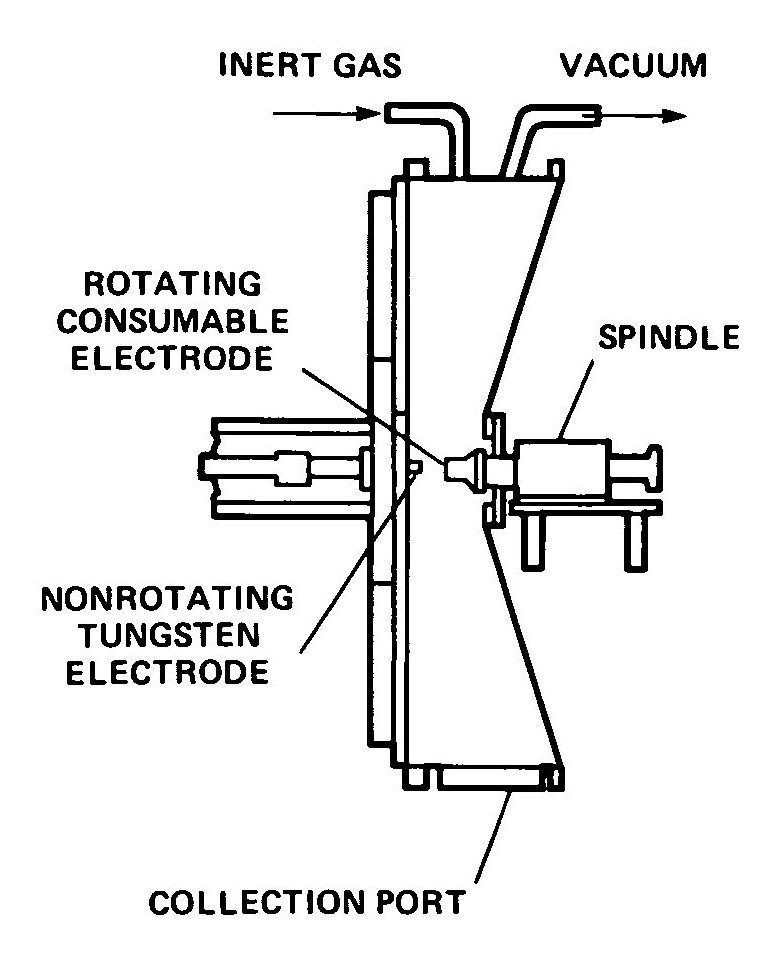
> *Image: R. A. Freitas Jr. and W. P. Gilbreath, Public domain*

- [Powder Metallurgy & Advanced Materials](powder-metallurgy.md) — Metal powder production, cemented carbides, tungsten, metal injection molding, HIP, and additive manufacturing.
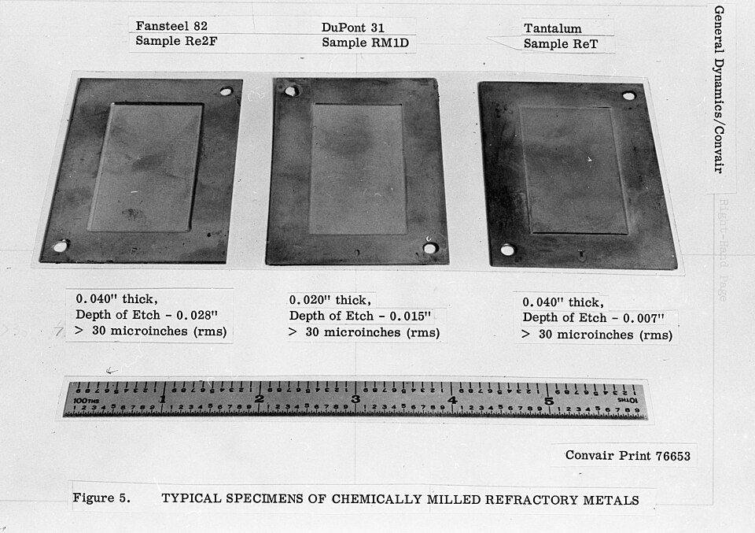
> *Image: San Diego Air &amp; Space Museum Archives, Public domain*

- [Refractory Metals](refractory-metals.md) — Tungsten, molybdenum, tantalum, and niobium for extreme-temperature and high-wear applications including furnace elements, filaments, and tool steel alloying.
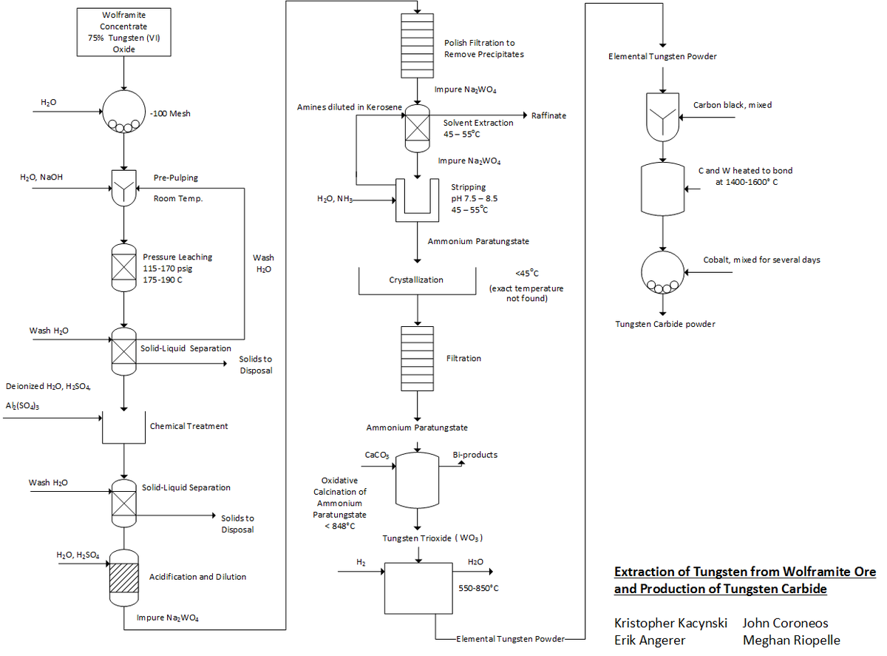
> *Image: Jwcorone, CC BY-SA 3.0*

- [Refractory & Specialty Metals for Semiconductor Manufacturing](refractory-specialty.md) — Tantalum (TaN/Ta diffusion barriers, sputtering targets), cobalt (CoSi₂ contacts, CMP slurry), and indium (ITO transparent conductors, InGaAs photonics, bump bonding).
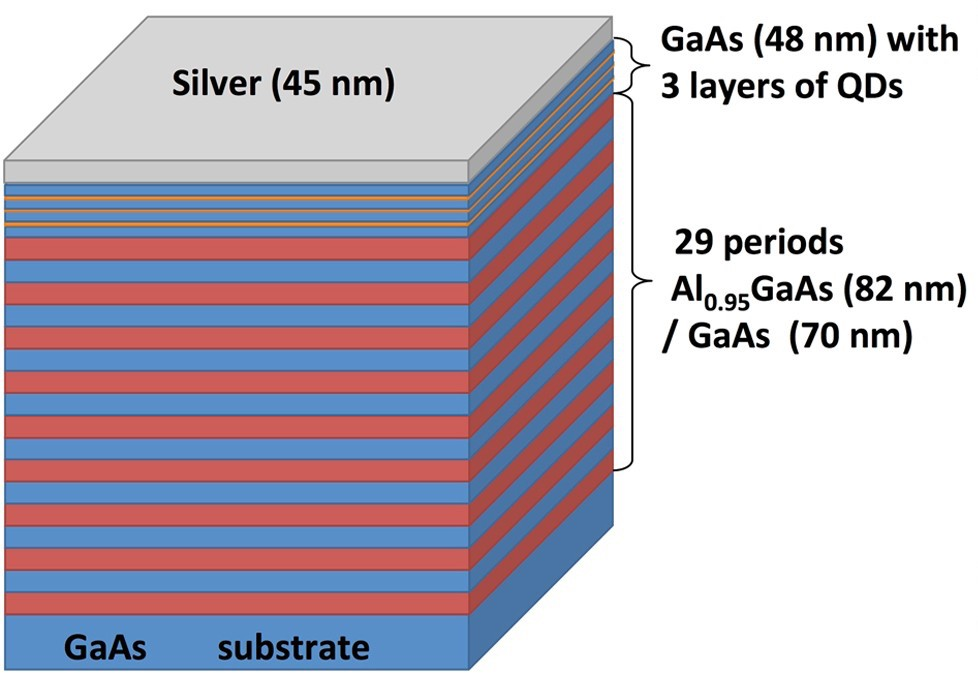
> *Image: Gary Shuster, CC BY-SA 3.0*

- [Specialty Metals for Semiconductor Interconnects & Barrier Layers](specialty-semiconductor.md) — Titanium (TiN hard masks, Ti diffusion barriers, TiO₂ high-k), tungsten (W CVD plug fill, contact vias, TSVs), molybdenum (gate electrodes, sputtering targets, heat sinks), and copper (dual damascene electroplating, CMP, electromigration).
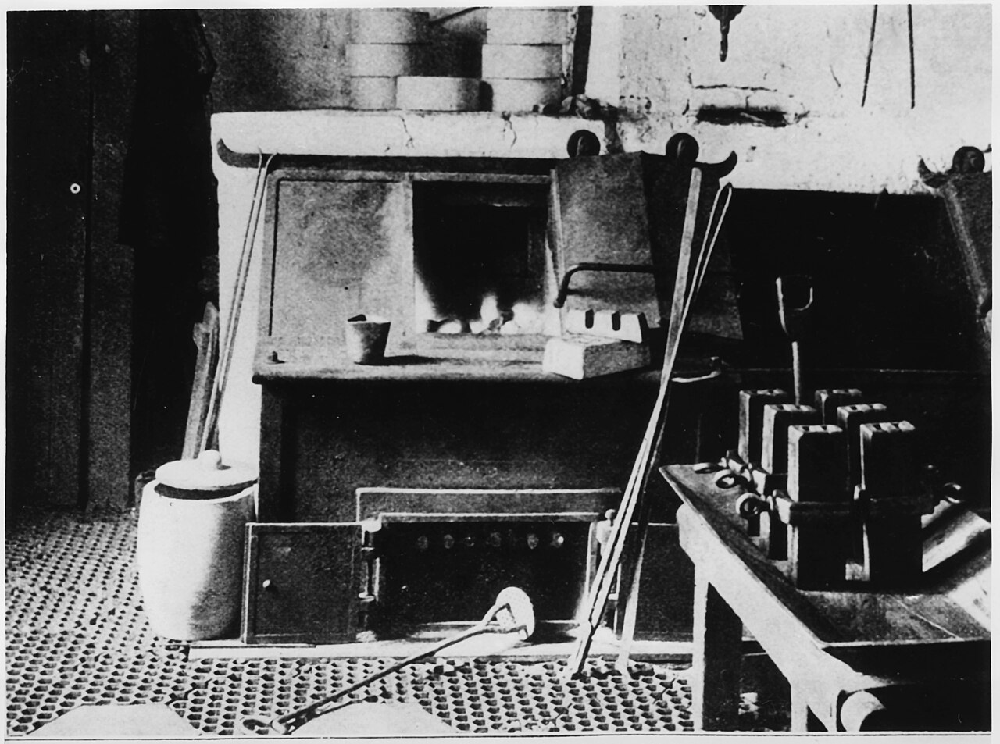
> *Image: bptakoma, CC BY 2.0*

- [Precious Metal Production](precious-metals.md) — Gold and silver extraction from ores, alluvial deposits, and recycled scrap. Cyanidation, electrolytic refining to 99.99%+, aqua regia, Wohlwill gold refining, and Moebius silver refining. Produces semiconductor-grade gold wire and silver paste.
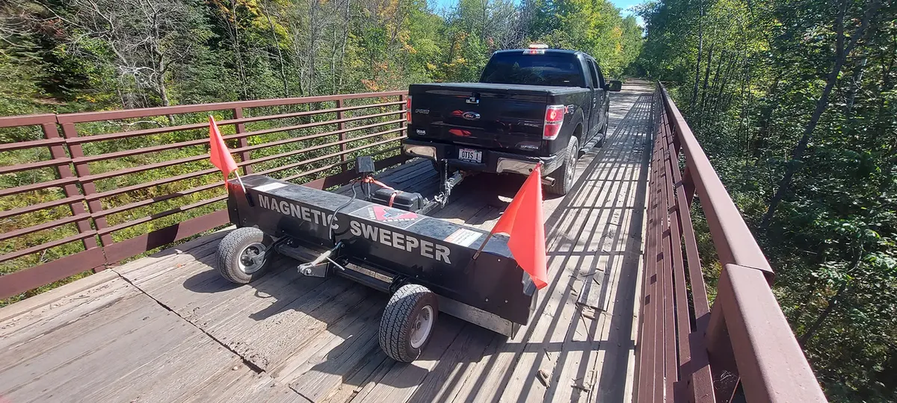
> *Image: Bluestreak Equipment Inc, CC BY-SA 4.0*

- [Magnetic Materials](magnetic-materials.md) — Soft magnetic silicon steel for transformer cores and motor laminations, alnico and ferrite permanent magnets, grain orientation, spinodal decomposition heat treatment, and lamination processing.
<!-- TODO: source image for Metal Scrap Recycling -->
- [Metal Scrap Recycling](metal-recycling.md) — Converting end-of-life metal products and manufacturing offcuts back into usable feedstock through sorting and remelting, requiring 5–95% less energy than primary production.

> *Image: Energy Saver, CC BY 3.0*

- [Spring Manufacturing](springs.md) — Compression, tension, torsion, leaf springs, and Belleville washers from high-carbon and alloy spring steel. Quench-and-temper heat treatment to 400-500°C, coiling/winding procedures, and shot peening for fatigue life.
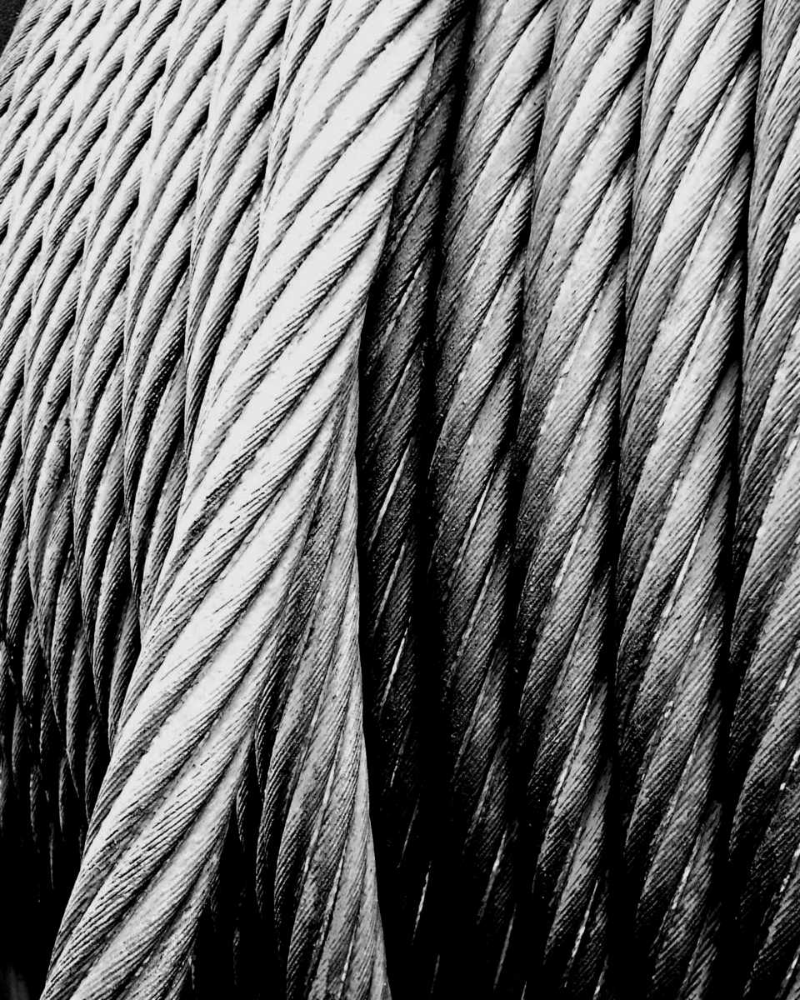
> *Image: Johannes 'volty' Hemmerlein, CC BY-SA 3.0*

- [Wire Rope & Steel Cable](wire-rope.md) — Wire drawing, stranding, and rope closing of high-carbon steel wire into flexible rope (6×7, 6×19, 6×37 constructions). Tensile grades 1570-1960 MPa, end fittings (swaging, zinc/epoxy socketing), inspection and discard criteria, and lubrication for mining hoists, cranes, elevators, and bridges.

[↑ Back to Tech Tree](../index.md)
