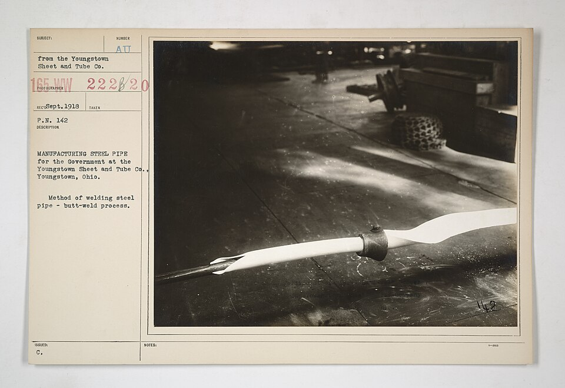

# Pipe and Tube Manufacturing

> **Node ID**: metals.pipe-making
> **Domain**: [Metals](./index.md)
> **Dependencies**: [`Water Distribution`](../water/distribution.md), [`Gas Handling`](../gas-handling/index.md)
> **Enables**: [`Metal Casting`](casting.md)
> **Timeline**: Years 15-30
> **Outputs**: metal-pipes, steel-tubes, cast-iron-pipes
> **Critical**: No

## Overview

> *Image: Unknown authorUnknown author or not provided, Public domain*

Manufacture of metal pipes and tubes by casting, extrusion, seamless piercing, or welding. Pipes are essential infrastructure for water distribution, gas handling, steam transport, and chemical processing. Each pipe material and process serves different applications: cast iron for water and drainage, seamless steel for high-pressure steam and structural use, welded steel for moderate-pressure fluids, and copper tube for domestic water and heat exchangers.

The choice of pipe-making method depends on the material, diameter, wall thickness, and pressure rating required. Cast iron pipes are made by centrifugal casting, where molten iron is poured into a spinning mold that distributes the metal evenly against the mold wall. Steel pipes are either seamless (pierced from a solid billet and elongated on a rolling mill) or welded (formed from flat strip and seam-welded). Copper tubes are made by extrusion followed by cold drawing.

For bootstrapping purposes, centrifugal cast iron pipe is the simplest starting point. The equipment (a spinning mold and a ladle) is far less complex than a seamless piercing mill. Cast iron pipes serve municipal water distribution, building drainage, and low-pressure gas service. Steel pipe production can follow once the rolling mill infrastructure is established.

### Pipe Schedule Reference

Pipe sizes are designated by nominal diameter and schedule (wall thickness). The schedule number determines the pressure rating. The pipe-making process must control wall thickness to within the specified tolerance for the schedule being produced.

| Nominal Size | OD (mm) | Sch 40 Wall (mm) | Sch 40 ID (mm) | Sch 80 Wall (mm) | Sch 80 ID (mm) | Sch 40 Weight (kg/m) |
|--------------|---------|-------------------|-----------------|-------------------|-----------------|----------------------|
| 1" (DN25) | 33.4 | 3.38 | 26.6 | 4.55 | 24.3 | 2.50 |
| 2" (DN50) | 60.3 | 3.91 | 52.5 | 5.54 | 49.2 | 5.44 |
| 4" (DN100) | 114.3 | 6.02 | 102.3 | 8.56 | 97.2 | 16.07 |
| 6" (DN150) | 168.3 | 7.11 | 154.1 | 10.97 | 146.4 | 28.26 |
| 8" (DN200) | 219.1 | 8.18 | 202.7 | 12.70 | 193.7 | 42.55 |
| 12" (DN300) | 323.9 | 10.31 | 303.3 | 17.48 | 288.9 | 81.55 |

**Why schedule matters**: The schedule number is approximately defined as S = 1000 × P / S_allowable, where P is the design pressure and S_allowable is the allowable stress. Higher schedule = thicker wall = higher pressure rating. Sch 40 is standard for most water and low-pressure applications. Sch 80 is used for higher pressures and corrosive services where corrosion allowance is needed.

### Centrifugal Force Requirements

The centrifugal casting mold must spin fast enough to hold the molten metal against the wall. The centrifugal acceleration must exceed gravitational acceleration by a factor of 50-150 (the G-factor). Too slow, and the metal slumps; too fast, and the equipment stresses become excessive.

G-factor = ω²r / g, where ω = angular velocity (rad/s), r = mold radius (m), g = 9.81 m/s².

| Pipe Diameter (mm) | Mold RPM | G-factor | Motor Power (kW per m of mold length) |
|---------------------|----------|----------|---------------------------------------|
| 100 | 900-1100 | 50-75 | 3-5 |
| 200 | 600-800 | 40-70 | 5-8 |
| 300 | 450-600 | 35-60 | 8-12 |
| 400 | 350-500 | 30-55 | 10-15 |
| 600 | 250-350 | 25-50 | 15-25 |

The minimum RPM for a given pipe diameter can be calculated: RPM_min = 423 / √(r_meters). For a 200 mm diameter pipe (r = 0.1 m), RPM_min = 423 / √0.1 ≈ 1340... but in practice the formula above using G-factor 50-80 gives more realistic values because the mold is longer and centrifugal force accumulates along the length.

Primary outputs: `metal-pipes`, `steel-tubes`, `cast-iron-pipes`.

## Prerequisites

### Materials

- Cast iron (for centrifugal casting of water and drainage pipes)
- Steel billets or strip (for seamless or welded steel pipe)
- Copper billets (for copper tube production)
- Clay (for ceramic pipes used in drainage and chemical service)
- Welding consumables (for welded pipe: ERW electrodes, SAW flux and wire)
- Zinc for galvanizing steel pipe (optional, for corrosion protection)
- Refractory wash coatings for centrifugal casting molds

### Equipment

- [Water Distribution](../water/distribution.md) — material dependency
- [Gas Handling](../gas-handling/index.md) — material dependency
- Centrifugal casting machine with spinning mold (for cast iron pipe)
- Piercing mill (for seamless steel pipe: cross-roll piercer or Mannesmann piercer)
- Pilger mill or plug mill (for elongating the pierced shell)
- Sizing mill and straightening machine
- Roll forming stand and welding unit (for welded pipe: ERW or SAW)
- Extrusion press (for copper tube and non-ferrous pipe)
- Drawing bench with dies and mandrels for copper tube drawing
- Mandrels and dies for drawing and sizing
- Hydrostatic testing equipment
- Cutting and facing equipment (saw, torch, or rotary cutter)
- Crane and handling equipment for heavy pipe

### Knowledge

- Understanding of centrifugal casting: mold rotation speed, pouring temperature, coating the mold with a refractory wash
- Seamless pipe piercing: how the Mannesmann effect creates a cavity in the billet center when rotated between angled rolls
- Pipe rolling: controlling wall thickness and diameter through roll gap, mandrel position, and pass schedule
- Welded pipe forming: strip edge preparation, roll forming geometry, welding parameters (current, voltage, speed)
- Heat treatment of welded pipe: normalizing the weld zone to restore grain structure
- Hydrostatic testing: pressure calculation based on material grade and wall thickness

### Infrastructure

- Furnace for heating billets (for seamless pipe) or melting iron (for centrifugal casting)
- Casting area with mold preparation, coating, and handling
- Rolling mill floor with roll forming stands, mandrel extraction, and sizing
- Welding station with power supply, cooling, and bead control (for welded pipe)
- Hydrostatic test station with high-pressure pump, end seals, and pressure gauges
- Cooling bed or rack for straightening and cooling finished pipe
- Handling and storage area organized by pipe size, schedule, and material grade
- Galvanizing line (if producing galvanized steel pipe): molten zinc kettle at ~450°C, fluxing station, and cooling rack

## Process Description

### Cast Iron Pipe (Centrifugal Casting)

1. Preheat and coat the water-cooled metal mold with a thin refractory wash (silica or zirconia). The coating controls the casting surface finish and protects the mold from thermal shock. Coating thickness: 0.5-1.5 mm. Apply by spraying or brushing while the mold rotates slowly (50-100 RPM).
2. Spin the mold to the target rotation speed (500-1000 RPM depending on pipe diameter). Centrifugal force must be sufficient to hold the molten iron against the mold wall. The G-factor (centrifugal acceleration / gravitational acceleration) should be 50-150.
3. Pour molten cast iron into the spinning mold through a trough or runner. The pour temperature must be 1300-1400°C (measured with an optical pyrometer). The metal flows along the mold length, and centrifugal force distributes it evenly against the wall. The pour rate controls wall thickness: for a 6" Sch 40 pipe (7.11 mm wall), pour approximately 28 kg of iron per meter of pipe length. Pour duration: 5-15 seconds per meter of pipe length.
4. Allow the iron to solidify while the mold continues to spin. Solidification time: 30-90 seconds depending on wall thickness and mold cooling. The centrifugal force drives denser metal outward and lighter slag and gas inclusions inward, where they can be machined off or remain on the inner surface.
5. Stop the mold and extract the pipe. The pipe shrinks slightly on cooling (shrinkage allowance ~1% for cast iron) and releases from the mold. Cool on a rack. Typical pipe temperature at extraction: 800-950°C (bright red to orange).
6. Machine the socket (bell) end and spigot end to specification. The bell-and-spigot joint is the standard connection method for cast iron water pipe: the spigot end of one pipe slides into the bell (socket) end of the next, sealed with lead, rubber gasket, or cement mortar. Bell depth is typically 1.5-2× the pipe wall thickness. Test hydrostatically at 1.5-2× the rated working pressure (hold for 10-30 seconds, check for leaks and seepage).

### Seamless Steel Pipe (Piercing and Rolling)

1. Heat a round steel billet to 1200-1280°C in a reheating furnace. The billet must be uniformly heated through its cross-section.
2. Pierce the billet in the Mannesmann piercer. The heated billet is fed between two large, angled rolls that rotate it and force it over a pointed mandrel. The combination of tensile stress at the billet center (the Mannesmann effect) and the mandrel point creates a hollow shell.
3. Elongate the pierced shell on a pilger mill or plug mill. The shell is rolled between dies that reduce the wall thickness and increase the length. The mandrel inside the shell controls the inner diameter.
4. Pass the rough pipe through a sizing mill to bring the outside diameter to specification. Multiple stands of rolls progressively size the pipe.
5. Reheat and pass through a straightening machine if needed. Cold-draw through a die and over a mandrel for closer dimensional tolerance if required.
6. Cut to length, face the ends, test hydrostatically, and inspect.

### Welded Steel Pipe (ERW or SAW)

1. Uncoil flat steel strip and feed into a roll forming line. A series of contoured rolls progressively form the flat strip into a round tube shape.
2. Bring the strip edges together at the welding station. For ERW (Electric Resistance Welding), copper contacts apply high-frequency current to the edges. The current heats the edges to welding temperature, and squeeze rolls force them together. For SAW (Submerged Arc Welding), a continuous wire electrode and granular flux deposit a weld bead along the seam.
3. Remove the internal and external weld bead flash (for ERW) by cutting or scarfing.
4. Normalize the weld zone by induction heating to refine the grain structure disturbed by welding. This step is essential for ERW pipe that will serve in pressure applications. Without normalizing, the weld zone has a different microstructure from the parent metal, creating a weak point.
5. Size and straighten the pipe in a sizing mill. Cut to length and test hydrostatically.

### Process Parameters

| Parameter | Range | Notes |
|-----------|-------|-------|
| Cast iron pouring temperature | 1300-1400°C | Must be fully liquid; too cold causes misruns |
| Centrifugal mold speed | 500-1000 RPM | Higher speed for larger diameters; must overcome gravity |
| Billet heating temperature (seamless) | 1200-1280°C | Uniform heating required; cold spots cause piercing failure |
| Pilger mill reduction | 60-80% wall reduction | Controls final wall thickness |
| ERW welding frequency | 100-400 kHz | Higher frequency concentrates heat at the strip edges |
| ERW welding speed | 10-60 m/min | Faster for thin-wall, smaller diameter |
| Hydrostatic test pressure | 1.5x to 2x working pressure | Per applicable code; hold for specified time, check for leaks |

Pipe sizes are designated by nominal diameter and schedule (wall thickness). A 6-inch Schedule 40 pipe, for example, has a nominal bore of 150 mm and a wall thickness of approximately 7 mm. The schedule number determines the pressure rating. Heavier schedules (80, 120, 160) have thicker walls and higher pressure ratings. The pipe-making process must control wall thickness to within the specified tolerance for the schedule being produced.

## Safety Considerations

- **Molten metal**: Cast iron pouring in centrifugal casting involves molten metal at 1300-1400°C. Spillage causes severe burns. Moisture in the mold causes violent steam explosions. Preheat molds and keep them dry.
- **Pinch points**: Rolling mills, pilger mills, and roll forming stands have powerful rotating rolls. Clothing, hands, and tools caught in the rolls cause crushing and amputation injuries. Never reach into a running mill.
- **Heavy pipe handling**: Finished pipe is heavy and awkward to handle manually. Use cranes, slings, and pipe hooks. Rolls of pipe in storage yards can crush workers if not blocked and stacked properly.
- **Radiation and sparks from welding**: ERW and SAW produce intense UV radiation, sparks, and spatter. Burns to skin and eyes (arc flash or welder's flash) are hazards.
- **Noise**: Rolling mills and cutting equipment produce high noise levels. Hearing protection is mandatory.

### Personal Protective Equipment

- Safety glasses with side shields at all times
- Face shield and heat-resistant gloves when working near molten iron or hot pipe
- Hearing protection in the rolling mill and cutting areas
- Steel-toe boots with metatarsal protection
- Welding helmet with appropriate shade lens when observing or performing welding operations
- Long sleeves and leather apron when handling freshly cast or freshly welded pipe

### Emergency Procedures

- For molten metal splash: cool the burn under running water for at least 20 minutes. Do not remove adhered metal. Seek medical attention.
- For caught clothing in a mill: hit the emergency stop immediately. Do not reach toward the rolls. Cut the clothing to free the worker if needed.
- For arc flash eye injury: move the affected person away from the welding area, apply cold compresses, and seek medical attention. Do not rub the eyes.
- Keep fire extinguishers at all welding stations and near the casting area.

## Quality Control

### Acceptance Criteria

- **Cast Iron Pipes**: Wall thickness within specified tolerance. Socket and spigot dimensions gauge correctly. No cracks, porosity, or cold shuts visible on inner or outer surface. Hydrostatic test passed at required pressure.
- **Steel Tubes (Seamless)**: Outside diameter, wall thickness, and ovality within tolerance. No internal laps, seams, or cracks. Hydrostatic test passed. Material grade verified (tensile strength, yield strength, elongation).
- **Welded Steel Pipes**: Weld bead smooth and full-penetration. No undercut, porosity, or incomplete fusion. Weld zone normalized. Hydrostatic test passed.

### Testing Methods

- **Hydrostatic testing**: Seal both ends of the pipe, fill with water, pressurize to 1.5-2x the rated working pressure, and hold for a specified time. Watch for pressure drop (leaks) and visual seepage. This is the primary acceptance test for pressure-containing pipe.
- **Wall thickness measurement**: Ultrasonic thickness gauge or mechanical micrometer. Measure at multiple points around the circumference and along the length. Wall thickness must not fall below the minimum specified for the pipe schedule.
- **Diameter and ovality**: Measure outside diameter with a pi tape or caliper at several points. Ovality (difference between maximum and minimum diameter at any cross-section) must be within tolerance.
- **Visual inspection**: Check inner and outer surfaces for cracks, laps, pits, rolled-in scale, and weld defects. Use a borescope or light for internal inspection of small diameter pipe.
- **Weld inspection (for welded pipe)**: Radiographic or ultrasonic examination of the weld seam if required by specification. Check for incomplete fusion, porosity, and slag inclusions.

### Sampling Protocol

- Hydrostatic test every pipe (100% testing is standard for pressure pipe)
- Measure wall thickness on every pipe at multiple points
- Visual inspect 100% of pipes inside and outside
- Destructive testing (tensile, flatten, bend) on sample pipes per heat lot
- Track dimensional data by batch for trend analysis and mill calibration

## Scaling Notes

- **Foundry scale**: Single centrifugal casting machine, manual pouring. Cast iron pipes in limited diameters. Tens to hundreds of pipes per day depending on size. This is the bootstrapping entry point for pipe production.
- **Pipe mill (seamless)**: Piercing mill, pilger mill, sizing mill, straightener, and test station in a line. Requires significant capital equipment and power. Hundreds of tonnes of pipe per month.
- **Pipe mill (welded)**: Uncoiler, roll forming line, welder, sizing, cutting, and testing. More flexible than seamless for different diameters. Can be built incrementally starting with ERW for smaller diameters.

Key scaling challenges: the piercing mill for seamless pipe is a massive, precision machine that requires heavy foundations and significant power. Welded pipe lines are more modular and can be scaled up incrementally. Centrifugal casting is relatively simple to set up but limited to cast iron and non-ferrous metals. Handling and straightening long, heavy pipes requires overhead cranes and adequate floor space.

Copper tube production (extrusion and drawing) is a smaller-scale operation that can coexist with the other pipe-making processes. A hydraulic extrusion press forces a heated copper billet through a die with a mandrel, producing a tube shell. The shell is then cold-drawn through dies and over mandrels to final dimensions, using equipment similar to wire drawing but with internal tooling.

## Troubleshooting

| Problem | Probable Cause | Solution |
|---------|---------------|----------|
| Ovality (out-of-round pipe) | Uneven cooling, worn rolls, incorrect roll gap | Check and adjust roll gap (±0.5 mm); ensure uniform cooling with water spray on all sides; replace worn rolls when eccentricity exceeds 0.5% of OD |
| Wall thickness variation > ±10% | Eccentric mandrel, uneven billet heating, worn tooling | Re-center mandrel (runout <0.3 mm); ensure billet heated to ±15°C through cross-section (soak 1-2 hours per 100 mm diameter); inspect and replace worn dies |
| Inner surface defects (laps, seams) | Excessive oxidation during piercing, dirty mandrel surface | Control furnace atmosphere to neutral (O₂ <2%); clean mandrel between passes; reduce dwell time at >1100°C to under 30 minutes |
| Weld defects (porosity, incomplete fusion) | Insufficient heat, dirty strip edges, wrong welding speed | Increase weld current by 10-15%; clean strip edges to bright metal with wire brush; adjust welding speed to 15-30 m/min for 6-10 mm wall |
| Cracking during hydro test | Pre-existing crack from casting or rolling defect; hard spots in cast iron | Inspect more carefully before testing (magnetic particle for steel); improve casting parameters (ensure mold preheated to 200°C+); anneal cast iron at 550°C for 2 hours to relieve residual stress |
| Pipe not straight (>3 mm/m) | Uneven cooling, worn straightener rolls, bent mandrel | Adjust straightener rolls (0.5-1.0 mm interference); cool pipe evenly on a flat bed (no concentrated water spray); inspect mandrel for runout |
| White iron formation (too hard to machine) | Rapid cooling against uncoated metal mold | Apply refractory wash coating (0.5-1.5 mm); reduce mold cooling water flow; anneal at 900°C for 2-4 hours to convert cementite to graphite |
| Surface pitting on cast pipe | Moisture in refractory mold coating; gas porosity from high pouring temperature | Dry coating thoroughly before pouring; reduce pour temperature to 1300-1350°C (excess temperature increases gas solubility) |
| Longitudinal cracks in seamless pipe | Excessive reduction per pass (>80%); billet too cold in center | Limit reduction per pass to 60-75%; increase billet soak time to ensure core temperature within 30°C of surface |
| ERW weld hook crack | Oxide inclusions trapped at weld seam (from insufficient squeeze-out) | Increase squeeze pressure by 10-20%; clean strip edges with acid pickling; verify strip edges are parallel (gap <0.5 mm before welding) |
| Bell end socket too tight or too loose | Machining tolerance drift; pattern wear | Gauge each bell with a go/no-go mandrel (±0.5 mm tolerance); replace worn machining tools; check machine alignment daily |

## Variations and Alternatives

- **Centrifugal casting**: Best for cast iron water and drainage pipe. Simple equipment, good surface quality. Limited to materials that can be cast.
- **Seamless piercing and rolling**: Best for high-pressure and high-temperature applications. No weld seam to fail. Expensive equipment, limited diameter range per mill setup.
- **ERW (Electric Resistance Welding)**: Best for medium-diameter steel pipe (20-600 mm). Fast, continuous production. Weld quality requires good strip preparation and controlled parameters.
- **SAW (Submerged Arc Welding)**: Best for large-diameter pipe (400-1600 mm). High deposition rate, deep penetration. Typically used for spiral-welded or straight-seam large pipe.
- **Extrusion and drawing**: Best for copper tube and non-ferrous pipe. Produces smooth, close-tolerance tube. Extrusion press is the main capital item.
- **Clay pipe extrusion and firing**: For drainage and chemical service where metal is not needed. Low-tech alternative that requires a clay extruder and kiln rather than metalworking equipment.
- **Copper tube (extrusion and drawing)**: Extrude a copper billet through a die to form a tube shell, then cold-draw through dies and over mandrels to final size. Produces smooth, close-tolerance tube for domestic water, refrigeration, and heat exchangers. Requires an extrusion press and drawing bench.

Pipe ends are prepared according to the joining method. Cast iron pipes use bell-and-spigot joints. Steel pipes may be beveled for welding, threaded for screw fittings, or grooved for mechanical couplings. Copper tubes use soldered, brazed, or press-fit joints. The end preparation step is part of the finishing line and must match the specification for the intended installation method.

## References

- [Metals](index.md) — parent capability
- [Metals Domain](./index.md) — domain overview and related capabilities
- [Water Distribution](../water/distribution.md) — upstream dependency (material)
- [Gas Handling](../gas-handling/index.md) — upstream dependency (material)
- [Metal Casting](casting.md) — downstream capability

---
*Part of the [Bootciv Tech Tree](../index.md) · [Metals](./index.md) · [All Domains](../index.md)*