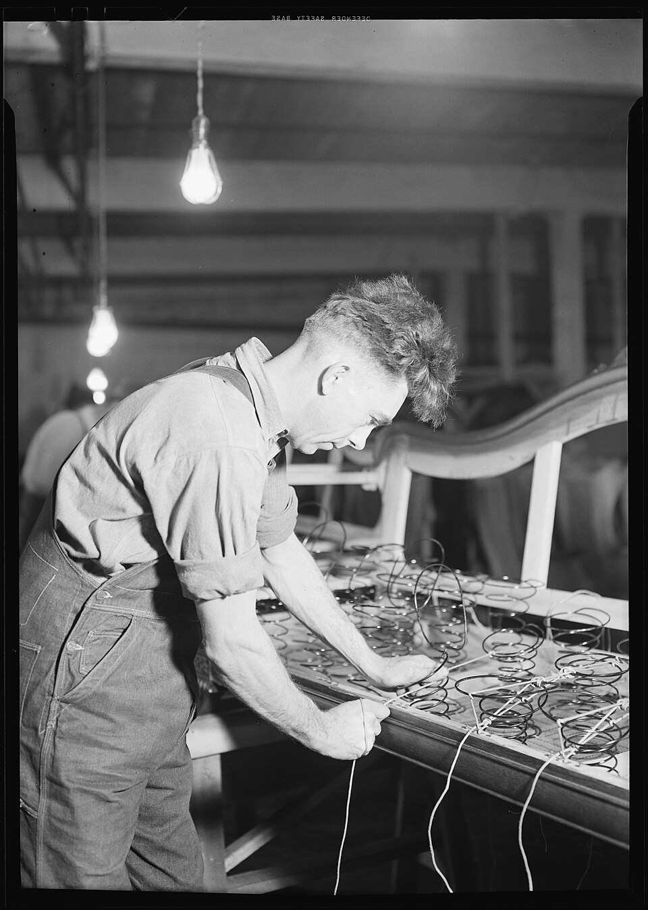

# Spring Manufacturing

> **Node ID**: metals.springs
> **Domain**: [Metals](./index.md)
> **Dependencies**: [`metals.iron-steel`](iron-steel.md), [`machine-tools.machining`](../machine-tools/machining.md)
> **Enables**: [`energy.steam-power`](../energy/steam-power.md), [`transport.railways`](../transport/railways.md), [`machine-tools.joining`](../machine-tools/joining.md), [`electronics`](../electronics/index.md)
> **Timeline**: Years 10-20
> **Outputs**: compression_springs, tension_springs, torsion_springs, leaf_springs, belleville_washers
> **Critical**: false

## Overview

> *Image: Lewis Hine, Public domain*

Springs store mechanical energy through elastic deformation and release it on demand. Every mechanism of industrial civilization depends on them: valve springs in steam engines and internal combustion engines, suspension springs in rail vehicles and road vehicles, return springs in locks and latches, contact springs in electrical switches, and measuring springs in instruments and gauges. Without springs, valves do not close, suspensions do not absorb shock, and electrical contacts do not maintain pressure.

A spring is any elastic element that deflects under load and returns to its original shape when the load is removed. The key material property is the elastic limit (also called yield strength in tension): the stress below which deformation is fully reversible. Spring steel achieves elastic limits of 700-1300 MPa after proper heat treatment, compared to 200-350 MPa for annealed mild steel. This high elastic limit, combined with good fatigue resistance, makes heat-treated high-carbon and alloy steels the dominant spring materials.

Spring manufacturing sits downstream of [Iron & Steel Production](iron-steel.md) and requires access to precision [Machining](../machine-tools/machining.md) for mandrel making, wire drawing dies, and finishing operations. The capability becomes available once high-carbon steel (0.6-1.0% C) and controlled heat treatment (quench + temper) are established.

## Prerequisites

- **Materials**:
  - [High-carbon steel](iron-steel.md) (0.6-1.0% C) or silicon-manganese spring steel (SAE 9260: 0.56-0.64% C, 1.8-2.2% Si, 0.75-1.0% Mn)
  - [Oil for quenching](../petroleum/index.md) — vegetable oil or mineral oil, 20-40 liters per batch
  - [Mild steel](iron-steel.md) for tooling (mandrels, jigs, winding arbors)
- **Tools and equipment**:
  - [Lathe](../machine-tools/machining.md) for turning mandrels to precise diameters
  - Forge or furnace capable of 820-870°C (austenitizing temperature for spring steel)
  - Temper furnace or oven with ±10°C control at 300-500°C
  - Wire drawing capability (draw plates or dies for reducing rod to wire)
  - Spring winding arbor (hand-cranked or lathe-driven)
  - [Surface grinder](../machine-tools/machining.md) or belt grinder for finishing ends
- **Knowledge**:
  - Hooke's law: F = kx, where k is spring rate (N/mm) and x is deflection (mm)
  - Torsional stress in coil springs: τ = (8 × F × D) / (π × d³), where F = load (N), D = mean coil diameter (mm), d = wire diameter (mm)
  - Heat treatment of high-carbon steel: austenitize → quench → temper sequence
- **Infrastructure**:
  - Ventilated workspace for oil quenching (oil fume management)
  - Eye protection, leather apron, heat-resistant gloves, face shield

## Bill of Materials

| Material | Quantity per 100 coil springs (10 mm wire, 50 mm OD, 100 mm free length) | Source | Alternatives |
|----------|--------------------------------------------------------------------------|--------|-------------|
| High-carbon steel wire (0.7-0.9% C) | 8-10 kg | [Iron & Steel](iron-steel.md) — drawn through dies from rolled rod | Silicon-manganese spring steel (SAE 9260) for improved fatigue life |
| Quenching oil (vegetable or mineral) | 20-40 liters (reusable for 50-100 cycles with skimming) | [Petroleum](../petroleum/index.md) or vegetable oil press | Water quench permissible for wire <3 mm diameter only — cracking risk above 3 mm |
| Tempering oven fuel (charcoal, gas, or electric) | 5-10 kWh equivalent per batch | [Energy](../energy/index.md) | Charcoal muffle furnace with thermocouple |
| Mild steel mandrel stock | 1-2 kg per mandrel diameter (reusable for 500+ springs) | [Iron & Steel](iron-steel.md) | Hardwood mandrel for prototyping only — wears after 10-20 springs |
| Abrasive belts or grinding wheels | 1-2 per 100 springs (end grinding) | [Abrasives](../ceramics/index.md) | File and hand stone (slow but functional) |
| Shot peening media (steel shot, 0.3-0.8 mm) | 5-10 kg (reusable for thousands of springs) | [Iron & Steel](iron-steel.md) | Grit blasting with chilled cast iron shot |

## Process Description

### Spring Steel Composition and Heat Treatment

**Steel selection**: Spring steel must have sufficient carbon to achieve high hardness after quenching (≥55 HRC), yet enough toughness after tempering to withstand repeated loading without fracture. Three grades cover most applications:

- **High-carbon steel (1070-1095)**: 0.70-0.95% C. Hardens to 58-64 HRC. Tempered at 350-450°C for spring applications. Simplest to produce in a bloomery/crucible steel operation. Adequate for leaf springs, flat springs, and coil springs in non-corrosive environments.
- **Silicon-manganese spring steel (SAE 9260)**: 0.56-0.64% C, 1.8-2.2% Si, 0.75-1.0% Mn. Silicon increases elastic limit and improves resistance to stress relaxation at elevated temperatures. Manganese provides hardenability. Preferred for vehicle suspension springs and engine valve springs.
- **Chromium-vanadium spring steel (SAE 6150)**: 0.48-0.53% C, 0.8-1.1% Cr, 0.15% V min. Chromium adds hardenability and corrosion resistance. Vanadium refines grain structure, improving fatigue life. Used for high-performance coil springs and torsion bars.

**Heat treatment procedure** (for high-carbon steel springs):

1. **Austenitize**: Heat spring (or wire/strip before forming) to 820-870°C (bright cherry red). Hold for 15-30 minutes per 25 mm of cross-section to ensure uniform temperature throughout. At this temperature, the steel's crystal structure transforms from ferrite + pearlite (BCC) to austenite (FCC), dissolving carbon into solution.
2. **Quench**: Plunge into oil at 40-60°C (warm oil, not cold). Agitate the spring continuously during quenching to break the vapor blanket that forms around the hot metal. Oil quench cools at ~100-200°C/s — fast enough to form martensite in spring steel, but not so fast as to cause the cracking that water quenching produces in high-carbon sections >3 mm. The steel is now extremely hard (58-64 HRC) and brittle.
3. **Temper**: Reheat immediately (within 1 hour of quenching — delayed tempering risks quench-cracking from residual stress). Heat to 400-500°C (dark straw to purple oxide color on polished steel surface). Hold for 60-90 minutes. This transforms some brittle martensite to tempered martensite, trading hardness for toughness. Target: 42-50 HRC for most spring applications. Higher tempering temperature = tougher but less stiff.
4. **Cool**: Air cool to room temperature. No further transformation occurs.

**Critical parameters**:
- Austenitizing temperature must not exceed 870°C for 0.8% C steel — overheating causes grain coarsening, which drastically reduces fatigue life.
- Tempering temperature is the primary control knob: 350°C for maximum stiffness (flat springs, music wire), 400°C for general coil springs, 450-500°C for leaf springs needing maximum toughness.
- Quench delay (time between removing from furnace and plunging into oil) must be <5 seconds. Longer delay allows pearlite formation, producing soft spots.

### Compression Springs

**Principle**: A helical coil spring that resists compressive force. Under load, the wire undergoes torsional stress. The spring rate (stiffness) is determined by wire diameter, coil diameter, and number of active coils: k = G × d⁴ / (8 × N × D³), where G = shear modulus (~79 GPa for steel), d = wire diameter, N = number of active coils, D = mean coil diameter.

**Materials**: High-carbon steel wire (1070-1095) or SAE 9260, drawn to final diameter. Wire diameter 0.5-20 mm for typical springs. Shot-peened after coiling and heat treatment.

**Procedure**:
1. Calculate spring dimensions from load requirements. Determine wire diameter (d), mean coil diameter (D), number of active coils (N), and free length (L₀). Verify that the spring index (C = D/d) falls between 4 and 12 — below 4 causes high forming stress; above 12 causes buckling under compression.
2. Cut wire to length: L_wire ≈ π × D × (N + 2) + 2 × d (allowing for end coils).
3. Mount mandrel on lathe or winding arbor. Mandrel diameter = mean coil diameter minus wire diameter minus springback allowance (typically 5-15% of coil diameter, determined by trial).
4. Clamp wire end to mandrel. Rotate mandrel while guiding wire onto it under light tension. Feed rate: one coil per revolution. Maintain consistent tension throughout winding.
5. After winding, release tension. The spring will expand (springback) to a diameter slightly larger than the mandrel. Measure and adjust mandrel size if needed.
6. Close the ends: for closed-ground ends, grind both end coils flat on a belt grinder or surface grinder. Remove approximately 270° of the end coil to create a flat bearing surface. Both ends must be flat and perpendicular to the spring axis within 1-2°.
7. Heat treat (austenitize → quench → temper as described above) if starting from annealed wire. If using pre-hardened wire (music wire), this step is skipped.
8. Shot peen the spring surface (see Shot Peening below).
9. Measure free length, spring rate, and solid height. Verify against specification.

**Expected performance**: Fatigue life 10,000-10,000,000 cycles depending on stress level, material, and shot peening. Maximum operating stress for infinite life (≥10⁷ cycles): ~40-50% of tensile strength for shot-peened springs.

**Strengths**:
- Most common spring type — straightforward to design and manufacture.
- Linear spring rate (force proportional to deflection) simplifies mechanism design.

**Weaknesses**:
- Buckling risk when free length exceeds 4-5× the coil diameter without lateral support.
- End grinding required for axial stability — adds a manufacturing step.

### Tension (Extension) Springs

**Principle**: A helical coil spring that resists tensile (pulling) force. Similar to compression springs in coiling geometry, but the coils are wound tightly together (close-wound) so the spring has zero deflection at its natural length. Extension comes from separating the coils. Hook or loop ends transmit the load.

**Materials**: Same high-carbon or alloy spring steel wire as compression springs. Wire diameter 0.3-16 mm.

**Procedure**:
1. Calculate spring dimensions. Tension springs typically operate at lower stresses than compression springs because the hooks experience bending stress concentrations. Design hook stress ≤40% of tensile strength for adequate fatigue life.
2. Wind spring close-coiled on mandrel (no gap between coils). Apply back-tension during winding to ensure coils are in contact.
3. Form hooks at each end. Three common hook types:
   - **Machine hook**: Bend the last half-coil upward at 90°, then into a full loop. Weakest hook type — stress concentration at the bend.
   - **Cross-over hook**: Bend wire across the center of the coil and form a loop on the opposite side. Stronger than machine hook because the bend radius is larger.
   - **Threaded plug**: Screw a threaded steel plug into the end of the spring. Strongest option — no wire bending required. Requires internal threading capability.
4. Heat treat after hook formation (if starting from annealed wire).
5. Shot peen body and hooks.
6. Test: measure spring rate and maximum extension. Verify hooks do not deform under rated load.

**Expected performance**: Fatigue life 5,000-1,000,000 cycles. Lower than compression springs due to hook stress concentrations. For applications requiring >10⁶ cycles, use threaded end fittings instead of bent hooks.

**Strengths**:
- Pull-to-actuate mechanism fits natural ergonomics (door latches, trampolines, garage doors).
- Compact in the relaxed state — stores energy at zero external length.

**Weaknesses**:
- Hooks are the failure point — bending stress at hook root exceeds coil body stress by 1.5-3×.
- No overload protection — compression springs bottom out at solid height; tension springs have no mechanical stop and can be overstretched to fracture.

### Torsion Springs

**Principle**: A helical coil spring that resists rotational (torque) force. The legs (straight wire ends extending from the coil) transmit torque. Under load, the wire undergoes bending stress (not torsion, despite the name). Spring rate expressed as torque per radian of deflection: k_t = E × d⁴ / (10.8 × N × D), where E = Young's modulus (~200 GPa for steel).

**Materials**: High-carbon spring steel wire (1070-1095). For close-wound torsion springs, wire diameter 0.3-12 mm.

**Procedure**:
1. Calculate wire diameter and coil dimensions from torque requirement. Bending stress at the inner surface of the coil: σ = (32 × M) / (π × d³) × K_b, where M = applied moment (N·mm), K_b = stress correction factor (1.05-1.25 depending on spring index).
2. Wind spring on mandrel. Torsion springs are wound in the opposite direction to the applied torque (the spring winds up tighter under load). If the spring must rotate clockwise under load, wind it counterclockwise on the mandrel.
3. Form legs: bend wire ends to the required angle and shape using forming pliers or a bending jig. Common leg configurations: straight legs at 90° to each other, straight legs at 180°, hinged hooks on legs, and offset legs for attachment points.
4. Heat treat (if required by wire condition).
5. Shot peen coil body. Legs typically not peened.
6. Test: apply torque and measure angular deflection. Verify spring rate matches design within ±10%.

**Expected performance**: Fatigue life 10,000-1,000,000 cycles. Torque capacity 0.01-500 N·m depending on wire size and coil diameter.

**Strengths**:
- Direct torque transmission — no leverage conversion needed. Ideal for hinges, clips, and rotary mechanisms.
- Compact — a torsion spring fits around a shaft, using axial space efficiently.

**Weaknesses**:
- Bending stress at inner coil surface is higher than torsional stress in the wire body — inner surface cracks initiate fatigue failure.
- Leg configuration is application-specific — less standardized than compression spring ends.

### Leaf Springs

**Principle**: A flat beam of spring steel that deflects under transverse load. Multiple leaves of graduated length are stacked and clamped together to form a semi-elliptical or elliptical spring assembly. The longest leaf (master leaf) carries the attachment eyes. Under load, each leaf bends and slides against its neighbors, providing inter-leaf friction that acts as built-in damping.

**Materials**: High-carbon steel (1070-1095) or SAE 5160 (chromium spring steel: 0.56-0.64% C, 0.7-0.9% Cr). SAE 5160 is the standard for vehicle leaf springs — chromium improves hardenability through the full thickness of leaves up to 25 mm.

**Procedure**:
1. Cut leaves from rolled spring steel strip to graduated lengths. The master leaf is longest and includes rolled eyes at each end for mounting pins. Each successive leaf is 50-100 mm shorter per end.
2. Heat each leaf individually to 820-850°C. Forge or press to the desired curvature (camber). A simple form die on a hydraulic press produces consistent curvature; alternatively, hammer over an anvil horn.
3. Quench each leaf in oil immediately after forming. Agitate vigorously.
4. Temper at 450-500°C for 60-90 minutes. Target hardness: 38-44 HRC. Leaf springs need more toughness than coil springs because they operate at higher bending stresses relative to wire diameter.
5. Grind the tension surface (top surface in service) of each leaf smooth. Surface scratches on the tension side are fatigue crack initiation sites.
6. Shot peen the tension surface of each leaf. This is the single most critical step for leaf spring fatigue life.
7. Assemble the stack: place the master leaf on top, then progressively shorter leaves beneath. Clamp with a center bolt through pre-drilled holes. Add rebound clips (U-bolts) at 2-4 locations along the stack to prevent leaf separation on rebound.
8. Test: mount the assembled spring in a test fixture and apply load at the center. Measure deflection. Spring rate should match design within ±10%.

**Expected performance**: Fatigue life 50,000-500,000 cycles for vehicle suspension springs. Static load capacity 500-50,000 kg per spring depending on leaf count and dimensions.

**Strengths**:
- Built-in damping from inter-leaf friction — no separate shock absorber needed for basic applications.
- Load distribution across multiple leaves — a single cracked leaf does not cause catastrophic failure (the remaining leaves carry load).

**Weaknesses**:
- Heavy — leaf springs are 2-3× the weight of coil springs for equivalent load capacity.
- Inter-leaf friction causes wear and squeaking. Requires lubrication (graphite grease) between leaves.

### Belleville Washers (Disc Springs)

**Principle**: A conical disc spring — a flat washer that has been dished (pressed into a conical shape). Under axial load, the disc flattens elastically. The load-deflection curve is non-linear and can be tuned by stacking multiple washers in series (more deflection, same load) or in parallel (more load, same deflection). Stacking combinations achieve virtually any spring characteristic.

**Materials**: High-carbon spring steel strip (1070-1095), thickness 0.5-10 mm. For corrosive environments, stainless steel (AISI 301 or 17-7 PH) or phosphor bronze.

**Procedure**:
1. Punch or laser-cut discs from spring steel strip. Outer diameter (OD), inner diameter (ID), and thickness (t) are the three defining dimensions.
2. Press each disc into a conical shape (dish) using a matched die set. Cone height (h) is typically 0.4-1.5× the material thickness. The spring rate depends on the h/t ratio:
   - h/t < 0.4: nearly linear spring characteristic
   - h/t ≈ 1.0: nearly constant load over 80% of deflection (zero-rate region)
   - h/t > 1.3: snap-through (bistable) behavior
3. Heat treat: austenitize at 820-850°C, quench in oil, temper at 400-450°C.
4. Shot peen the concave (tension) surface.
5. Grind bearing surfaces flat (optional — improves load consistency).
6. Test: compress washer to flat and measure load at 50% and 100% deflection. Compare to DIN 2093 standard values for the size.

**Expected performance**: Load capacity 100 N to 500 kN per washer depending on size. Fatigue life 10,000-10,000,000 cycles depending on stress level and stacking arrangement.

**Strengths**:
- Extremely compact — high load capacity in very small axial space.
- Stackable for adjustable spring characteristics: series stacks increase deflection, parallel stacks increase load.
- Non-linear rate tunable by geometry — constant-load springs possible.

**Weaknesses**:
- Small deflection per washer (typically 0.5-3 mm) — requires series stacking for larger travel.
- Load capacity sensitive to dimensional tolerances — ±5% thickness variation causes ±15% load variation.

## Quantitative Parameters

| Parameter | Compression Spring | Tension Spring | Torsion Spring | Leaf Spring | Belleville Washer |
|-----------|-------------------|----------------|----------------|-------------|-------------------|
| Wire/thickness range | 0.5-20 mm | 0.3-16 mm | 0.3-12 mm | 3-25 mm strip | 0.5-10 mm |
| Coil/OD diameter range | 3-300 mm | 3-200 mm | 5-150 mm | 50-1500 mm | 6-500 mm |
| Spring rate range | 0.1-10,000 N/mm | 0.05-5,000 N/mm | 0.01-500 N·m/rad | 5-5,000 N/mm | 100 N-500 kN/washer |
| Max deflection | 10-70% of free length | 10-50% of body length | 30-120° angular | 30-100 mm | 0.5-3 mm per washer |
| Fatigue life (shot-peened) | 10⁵-10⁷ cycles | 10⁴-10⁶ cycles | 10⁴-10⁶ cycles | 5×10⁴-5×10⁵ cycles | 10⁴-10⁷ cycles |
| Austenitizing temperature | 820-870°C | 820-870°C | 820-870°C | 820-850°C | 820-850°C |
| Quench medium | Oil (40-60°C) | Oil (40-60°C) | Oil (40-60°C) | Oil (40-60°C) | Oil (40-60°C) |
| Tempering temperature | 350-450°C | 350-450°C | 350-450°C | 450-500°C | 400-450°C |
| Target hardness (HRC) | 42-50 | 42-48 | 42-50 | 38-44 | 44-50 |

### Shot Peening Parameters

| Parameter | Value |
|-----------|-------|
| Shot material | Cast steel shot (S110-S660, 0.3-1.7 mm diameter) |
| Shot hardness | 45-55 HRC |
| Impact velocity | 50-80 m/s (air blast) or 60-100 m/s (centrifugal wheel) |
| Coverage | 100% surface (no unpeened areas visible at 10× magnification) |
| Almen intensity | 0.15-0.60 mm A (depending on wire/strip thickness) |
| Duration | 5-20 minutes per batch (varies with equipment and coverage rate) |
| Fatigue life improvement | 2-10× compared to unpeened springs |

## Scaling Notes

**Manual stage** (1-50 springs/day): Hand-cranked winding arbor, forge heating, oil quench in 20-liter pail, tempering in a muffle furnace with thermocouple. Shot peening with a hand-held air blast nozzle. Adequate for replacement springs, prototyping, and low-volume production.

**Workshop stage** (50-500 springs/day): Lathe-driven winding with automatic feed, gas-fired or electric furnace with temperature control (±5°C), tempering oven with convection circulation, motorized shot peening cabinet. Enables batch production of standard spring sizes.

**Industrial stage** (500+ springs/day): CNC spring coiling machines (automatic feed, cut, and end-forming in one cycle), continuous conveyor furnaces for austenitizing and tempering (throughput 500-5000 springs/hour), automated shot peening with intensity monitoring, 100% load testing on inline test fixtures. Required for automotive and aerospace spring volumes.

**Scale bottlenecks**:
- Wire drawing: Producing consistent-diameter spring wire requires multiple passes through hardened steel dies. Each die reduces diameter by 10-20%. A 10 mm rod requires 15-25 passes to reach 1 mm wire. Wire drawing capability often limits spring production before coiling does.
- Heat treatment throughput: Batch furnaces cycle every 1-2 hours. Continuous furnaces eliminate this bottleneck but require higher capital investment.
- End grinding: Compression spring end grinding is a dedicated operation — surface grinding both ends flat and parallel. At industrial scale, this requires a dedicated double-disc grinder.

## Troubleshooting

| Problem | Probable Cause | Solution |
|---------|---------------|----------|
| Spring takes permanent set after first compression (does not return to free length) | Tempering temperature too high — steel too soft, elastic limit below working stress | Reduce tempering temperature by 25-50°C; verify thermocouple accuracy; target 42-50 HRC |
| Spring fractures after <1000 cycles | Surface defect (scratch, seam, decarburization) acting as fatigue crack initiator | Grind tension surface smooth; shot peen after heat treatment; inspect wire for surface defects before coiling |
| Quench cracking (spring splits during or after oil quench) | Water contamination in quench oil, or wire diameter >3 mm with water quench instead of oil | Use oil quench for all wire >3 mm; keep oil at 40-60°C; agitate spring during quench to break vapor blanket |
| Spring rate is 20%+ higher than calculated | Actual wire diameter larger than nominal, or coil count fewer than designed | Measure actual wire diameter with micrometer (±0.01 mm); recount active coils; recalculate k = Gd⁴/8ND³ |
| Tension spring hook breaks at bend | Hook bend radius too small — stress concentration factor >2.0 | Increase bend radius to ≥2× wire diameter; switch to machine hook or threaded plug fitting |
| Leaf spring crack initiates at center bolt hole | Drilled hole creates stress concentration; insufficient radius at hole edge | Ream hole to smooth finish; radius hole edges with countersink; orient so hole is on neutral axis |
| Belleville washer load varies ±20% between units | Thickness variation in strip stock — load ∝ t³, so ±5% thickness → ±15% load | Sort strip stock by measured thickness; grind to ±0.02 mm tolerance before forming |
| Spring corrodes in service (rust pitting) | No protective coating; high-carbon steel has negligible corrosion resistance | Apply phosphating + oil, or hot-dip galvanizing (post-temper at ≤200°C to avoid hydrogen embrittlement), or use stainless spring steel |

## Safety

- **Stored energy hazard**: Springs under load store kinetic energy. A compressed compression spring releasing unexpectedly ejects parts at high velocity. A tension spring fracturing under load whips its broken ends with force sufficient to cause lacerations and eye injuries. **Always restrain springs during assembly, disassembly, and testing.** Use a spring compressor (two plates with threaded rods) for compression springs. Use a safety cable through the center of tension springs during installation.
- **Eye protection mandatory**: Wire springs under tension can snap. The fracture produces a whip effect — broken wire ends travel at 10-30 m/s. Wear safety glasses or face shield during spring winding, heat treatment, testing, and any handling of loaded springs.
- **Restraint fixtures for large springs**: Leaf springs and large coil springs (>5 kg, >200 mm free length) must be clamped in a fixture during coiling, heat treatment, and grinding. Unrestrained large springs can bow and eject from the work area during quenching or grinding.
- **Oil quench fire risk**: Quenching oil ignites at ~200-250°C (flash point of common quench oils). A spring removed from the furnace at 820°C and suspended above the oil tank can ignite oil vapors. **Lower the spring below the oil surface within 3 seconds.** Keep a metal lid or fire blanket adjacent to the quench tank. Never quench near open flames. Use a deep tank (spring fully submerged ≥100 mm below oil surface).
- **Hot metal burns**: Spring steel at austenitizing temperature (820-870°C) causes instantaneous third-degree burns on contact. At tempering temperature (400-500°C), metal causes burns on contact within 1-2 seconds. Use tongs of appropriate length (≥400 mm for 820°C work). Wear leather gloves rated for 500°C contact.
- **Grinding hazards**: End grinding produces fine steel dust and sparks. Wear safety glasses with side shields. Ensure grinding area is free of flammable materials (oil quench should be ≥3 m from grinding station). Sparks from grinding spring steel can travel 2-3 m.

## Quality Control

**Acceptance criteria for finished springs**:
- Free length: ±2% of nominal (compression/tension), ±1 mm for Belleville washers
- Spring rate: ±10% of nominal (measured between 20% and 80% of rated deflection)
- Solid height: Springs must compress to solid without permanent set (≤0.5% free length change after 3 compressions to solid)
- Hardness: 38-50 HRC depending on type (see Parameters table above)
- Squareness of ends: ≤2° deviation from perpendicular (compression springs)
- Surface finish: No visible cracks, seams, or decarburization. Shot peening coverage ≥100% at 10× magnification.

**Testing methods**:
- **Load test**: Compress spring to 50% and 100% of rated deflection. Measure load with calibrated scale or load cell. Calculate spring rate from load-deflection slope.
- **Permanent set test**: Compress spring to solid height three times. Measure free length before and after. Change must be ≤0.5% of original free length.
- **Fatigue test (sample basis)**: Cycle spring between 20% and 80% of rated deflection at 1-5 Hz. Record cycles to failure. Minimum acceptable: 10× the expected service life (e.g., test to 100,000 cycles for an application requiring 10,000 cycles).
- **Hardness test**: Rockwell C on ground flat section. Test ≥2 locations per spring, 90° apart.
- **Visual inspection**: Magnifying glass (5-10×) for surface cracks, seam defects, and decarburization. Decarburized layer (soft, low-carbon surface from heating in oxidizing atmosphere) must be <0.05 mm or removed by grinding/peening.

**Field test (no equipment needed)**: Drop the spring from 1 m onto a concrete floor. A well-tempered spring rings with a clear, sustained tone. A spring that produces a dull thud is undertempered (too brittle) or has internal cracks.

## Variations and Alternatives

**Non-steel spring materials**:
- **Phosphor bronze** (Cu-Sn alloy): Lower elastic limit (~400 MPa) but excellent corrosion resistance and electrical conductivity. Used for electrical contact springs and instrument springs in marine environments.
- **Beryllium copper** (Cu-Be alloy): Highest elastic limit of any copper alloy (~1000 MPa after age hardening). Used for precision instrument springs and non-magnetic applications. Beryllium dust is toxic — machining requires strict respiratory protection.
- **Inconel 718 / X-750** (nickel superalloy): For springs operating above 250°C (exhaust gas recirculation valves, turbine components). Requires precipitation hardening rather than quench-and-temper.

**Wire forming alternatives to coiling**:
- **Stamping**: Flat springs, clock springs, and spring clips can be stamped from strip stock in a single operation. Requires a stamping press and hardened die set. Economical above 1000 pieces.
- **Wire forming (CNC)**: Complex spring shapes (wire forms, clips, rings) produced by bending wire around multiple pins in a CNC wire-forming machine. Not a traditional coiling operation — more versatile for non-helical shapes.

**Trade-offs comparison**:

| Method | Best for | Min. batch | Tooling cost | Flexibility |
|--------|----------|-----------|--------------|-------------|
| Hand winding (arbor) | Prototyping, replacement springs, <50 pcs | 1 | Low (mandrel + hand tools) | High — any geometry |
| Lathe winding | Standard compression/tension springs, 10-500 pcs | 10 | Low (mandrel + lathe) | Moderate — helical only |
| CNC spring coiler | Production volumes, complex end forms | 500+ | High (machine + tooling) | High — programmable |
| Stamping | Flat springs, clips, spring washers | 1000+ | High (die set) | Low — one geometry per die |

## See Also

- [Iron & Steel Production](iron-steel.md) — prerequisite: high-carbon steel and heat treatment fundamentals
- [Specialty Alloys](alloys.md) — spring steel grades (SAE 5160, 6150, 9260) and non-ferrous spring alloys
- [Metal Forming](forming.md) — wire drawing from rolled rod, the upstream process for spring wire
- [Metal Finishing](finishing.md) — phosphating, galvanizing, and shot peening for spring corrosion protection
- [Machining](../machine-tools/machining.md) — lathe work for mandrels, grinding for spring ends
- [Energy: Steam Power](../energy/steam-power.md) — major consumer of valve springs and governor springs
- [Electronics](../electronics/index.md) — contact springs, relay springs, battery springs

---
*Part of the [Bootciv Tech Tree](../index.md) • [Metals](./index.md) • [All Domains](../index.md)*
