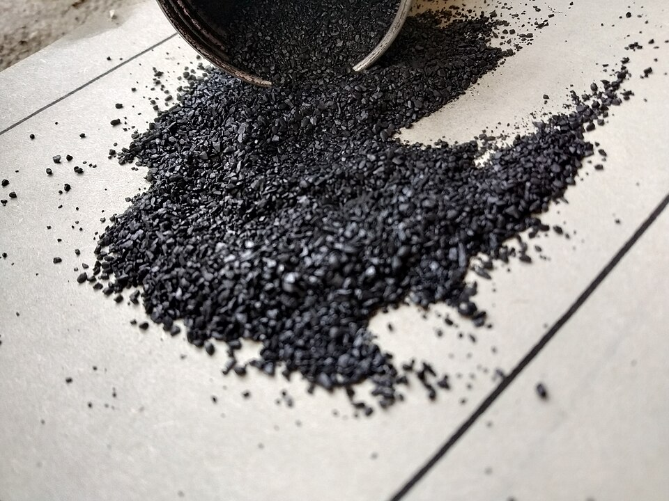
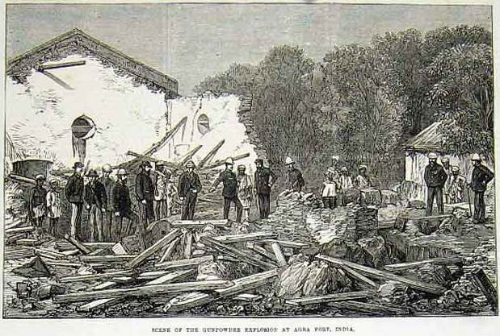

# Black Powder Explosives

> **Node ID**: mining.extraction.black-powder
> **Domain**: [Mining](./index.md)
> **Dependencies**: See prerequisites
> **Enables**: [`Explosives and Propellants`](../chemistry/explosives.md), [`Mining Extraction`](extraction.md)
> **Timeline**: Years 15-30
> **Outputs**: black_powder, blasting_capability
> **Critical**: No

## Overview

> *Barut*

> *Image: Satirdan kahraman, CC BY-SA 4.0*

Gunpowder manufacture (75% KNO₃, 15% charcoal, 10% sulfur) for mining blasting. Process: pulverize ingredients separately, wet-mix, press into cakes, crumble and sieve to grain sizes. Corning process ensures uniform burn rate. Enables breaking rock far beyond fire-setting and hand-tool limits.

Black powder represents the first practical chemical explosive. Before its adoption in mining, the only methods for breaking hard rock were fire-setting (heating rock with a fire, then cracking it with cold water quenching) and laborious hammer-and-chisel work. Black powder blasts remove orders of magnitude more rock per worker-day, transforming mining from a slow, manual operation into an industrial-scale materials extraction process. The key constraint on production is saltpeter supply — potassium nitrate must be harvested from nitrate-bearing earth or produced by controlled composting of organic waste, both of which are land- and time-intensive.

Manufacturing safety is paramount. The process is designed around risk reduction: ingredients are ground separately (never together), mixed wet (to prevent accidental ignition during blending), and processed in small batches in isolated buildings. Every step assumes that an ignition event may occur and limits the consequences when it does.

The transition from black powder to more powerful explosives (dynamite, TNT) requires advanced organic chemistry. Black powder remains the only explosive accessible to a civilization at the charcoal-sulfur-saltpeter technology level, making it a critical bottleneck for large-scale mining until higher chemistry develops.

Black powder has a dual role: as a blasting agent for mining and construction, and as a propellant for firearms and pyrotechnics. The manufacturing process is the same for both applications; only the grain size and pressing density differ.

## Prerequisites

### Materials

- **Potassium nitrate (saltpeter)** — the oxidizer. Obtained from nitrate-bearing earth (cave deposits, old animal pens, compost heaps) by water leaching and crystallization. Purity affects burn rate — impure saltpeter produces weak, inconsistent powder.
- **Charcoal** — the fuel. Made from hardwood (willow, alder, maple) by carbonization in a covered pit or kiln. Charcoal source affects performance — willow charcoal produces the fastest powder. Must be finely ground.
- **Sulfur** — the ignition facilitator. Lowers the ignition temperature of the mixture and increases burn speed. Obtained from volcanic deposits or by roasting pyrite. Must be free of acid contamination.

### Equipment

- **Grinding equipment**: Wooden mortars and pestles (brass-bound for durability), or water-powered stamp mills for production scale. Never use iron or steel grinding equipment — sparks from steel-on-steel contact can ignite dry powder.
- **Mixing surface**: Large flat stone slab or heavy wooden table for wet-mixing. Wooden muller for working the paste.
- **Screw press**: Wooden or brass-framed press for compacting the wet mixture into cakes. The press must produce uniform pressure across the cake face.
- **Sieving equipment**: Wooden-frame sieves with graded brass or copper mesh screens for sorting grain sizes.
- **Non-sparking tools**: Brass, copper, or wooden implements for all handling of dry powder. No steel or iron tools in any area where dry powder is present.
- Standard workshop tools and equipment
- Process-specific instrumentation

### Knowledge

- Understanding of the three-component system and how each ingredient contributes (saltpeter: oxidizer, charcoal: fuel, sulfur: ignition facilitator)
- Familiarity with non-sparking tool protocols — brass, copper, wood only; no iron or steel near dry powder
- Ability to assess saltpeter purity by crystallization appearance and burn test results
- Safety training for explosive materials handling, batch-size limits, and blast-wall procedures
- Understanding of grain-size effects on burn rate and application selection

### Infrastructure

- **Isolated processing building(s)**: Each operation (grinding, mixing, pressing, corning, storage) should be in a separate structure with earth-bank blast walls between them. Distance between buildings: at least 20 meters. Manufacturing buildings should be remote from habitation and other industrial operations.
- **Non-flammable construction**: Stone or earthen walls, sheet-metal or sod roofs. Wood framing is acceptable if separated from powder handling areas.
- **Ventilation**: Open-sided or well-ventilated buildings to prevent dust accumulation. Suspended powder dust in an enclosed space creates an explosive atmosphere far more dangerous than the bulk material.
- **Water supply**: Running water for wet-mixing and for emergency fire suppression.
- **Dry storage**: Sealed containers in a cool, dry building. Powder absorbs atmospheric moisture, degrading performance.

## Process Description

Black powder manufacture combines three ingredients — potassium nitrate (saltpeter), charcoal, and sulfur — into a homogeneous mixture that burns at a controlled, rapid rate when ignited. The manufacturing challenge is achieving uniform composition: any pocket of unmixed ingredient causes inconsistent burn rates, which in mining means unreliable blasts.

The traditional composition by mass: 75% potassium nitrate (the oxidizer), 15% charcoal (the fuel), 10% sulfur (lowers ignition temperature and increases burn speed). Variations exist for different applications — slower powders for propellants, faster powders for blasting.

### Step-by-Step Procedure

1. **Pulverize ingredients separately**. Each component must be ground to a fine, uniform powder before mixing. Grind charcoal to a fine dust. Crush sulfur to a fine powder. Pulverize saltpeter crystals. Each ingredient is processed alone — never combine before grinding, as friction during grinding of mixed powders can cause ignition.
2. **Wet-mix the ingredients**. Combine the three powders with a small amount of water or urine to form a paste. Work the paste thoroughly on a flat surface with a wooden muller, folding and re-working for an extended period until the color is completely uniform. The wet mix prevents accidental ignition during blending.
3. **Press into cakes**. Compress the wet mixture into flat cakes using a screw press. Pressing increases density, which controls the burn rate — denser powder burns more slowly and predictably. Apply steady pressure and hold.
4. **Dry the pressed cakes**. Air-dry the cakes at moderate temperature until fully dry. The cakes become hard and brittle when properly dried.
5. **Corning (crumbling and sieving)**. Break the dried cakes into grains using a wooden mallet on a non-sparking surface (wood or leather). Sieve the grains through graded screens to sort by size. Grain size determines burn rate and application: coarse grains for blasting, fine grains for firearms.
6. **Dust the grains with graphite** (optional). Tumble graded grains with fine graphite powder to coat them. This prevents clumping, improves flow, and makes the powder somewhat moisture-resistant.
7. **Store in sealed containers**. Pack into wooden kegs or sealed metal containers. Keep dry — moisture absorption degrades performance.

### Process Parameters

| Parameter | Range | Notes |
|-----------|-------|-------|
| Saltpeter content | 70-75% | Higher = faster burn |
| Charcoal content | 10-15% | Primary fuel |
| Sulfur content | 10-15% | Ignition facilitator |
| Grain size (blasting) | 2-6 mm | Coarse, slower burn for rock breaking |
| Grain size (firearms) | 0.5-2 mm | Fine, faster burn for propulsion |
| Cake pressing pressure | Moderate | Higher density = slower, more uniform burn |

### Saltpeter Production

Potassium nitrate is the rate-limiting ingredient. It occurs naturally in cave deposits and as efflorescence on nitrogen-rich soils (animal pens, latrines, compost heaps). The traditional production method:

- Collect nitrate-bearing earth from sites where animal waste has accumulated. Old stable floors, bat guano caves, and compost piles are productive sources.
- Leach the earth with water in a series of shallow pits lined with clay. Water dissolves the potassium nitrate; insoluble material remains.
- Boil the leachate to concentrate. Add wood ash (potassium carbonate) to convert calcium nitrate to potassium nitrate (calcium carbonate precipitates out).
- Crystallize by continued evaporation. Saltpeter crystals form as the solution cools and concentrates further.
- Yield from nitrate-bearing earth is low — many kilograms of earth yield only grams of saltpeter. Production requires large collection areas and sustained effort.

### Saltpeter Yield by Source

| Source | KNO₃ Content | Yield per Tonne of Earth | Collection Effort |
|--------|:------------:|:------------------------:|-------------------|
| Bat guano caves (dry) | 2-10% | 20-100 kg | Moderate — cave access |
| Old stable floors (5+ years) | 0.5-3% | 5-30 kg | Easy — surface collection |
| Compost heaps (2+ years) | 0.2-1% | 2-10 kg | Easy — surface collection |
| Saltpeter nitre beds (managed) | 1-5% | 10-50 kg | High — requires 1-2 year setup |
| Natural cave efflorescence | 5-30% | 50-300 kg | Moderate — requires cave exploration |

**Managed saltpeter production (nitre beds)**: The controlled method for producing saltpeter at scale. Mix wood ash, manure, urine, and vegetable waste in a long bed (5-10 m × 2-3 m × 0.5-1 m deep). Keep moist but not wet. Turn monthly. After 12-18 months of decomposition by nitrifying bacteria, the bed contains 1-5% KNO₃. Leach and crystallize as above. A well-managed nitre bed measuring 10 m × 3 m × 0.75 m yields approximately 100-300 kg of saltpeter per cycle.

**Saltpeter purity test**: Dissolve a sample in water and evaporate. Pure KNO₃ forms long, needle-like white crystals. If the crystals are rounded or form a crust, impurities (NaCl, KCl, Ca(NO₃)₂) are present. A burn test confirms quality: 1 g of pure KNO₃ mixed with 0.2 g of charcoal and ignited should burn completely in 1-2 seconds, leaving minimal white ash.

## Blasting with Black Powder

Black powder's primary mining application is breaking rock in shaft sinking, tunnel driving, and stoping. The procedure differs fundamentally from modern high-explosive blasting because black powder is a deflagrating explosive (burns rapidly) rather than a detonating one (shatters by shock wave). It works by building gas pressure in a confined drill hole until the rock fails in tension.

### Blast Hole Dimensions and Spacing

| Application | Hole Diameter | Hole Depth | Burden (distance to free face) | Spacing (between holes) |
|------------|:------------:|:----------:|:-------------------------------:|:-----------------------:|
| Shaft sinking (vertical) | 25-40 mm | 0.6-1.5 m | 0.4-0.8 m | 0.4-0.8 m |
| Tunnel driving (horizontal) | 25-40 mm | 0.8-2.0 m | 0.5-1.0 m | 0.5-1.0 m |
| Bench blasting (open cut) | 30-50 mm | 1.0-3.0 m | 0.8-1.5 m | 0.8-1.2 m |
| Boulder breaking | 25-35 mm | 0.3-0.6 m | N/A (single hole) | N/A |
| Stope blasting (underground) | 25-35 mm | 0.8-1.5 m | 0.5-0.8 m | 0.5-0.8 m |

The burden (distance from the hole to the nearest free rock face) must not exceed 30-40 times the hole diameter for black powder. Exceeding this ratio wastes energy because the gas pressure cannot overcome the rock mass before venting through the hole. This is a key limitation: black powder moves less rock per hole than dynamite, requiring more holes per advance.

### Charge Calculation

Black powder charge weight depends on rock type, hole dimensions, and the desired fragmentation:

**Powder factor**: 0.5-2.0 kg of black powder per cubic meter of rock broken, depending on rock hardness.

| Rock Type | Powder Factor (kg/m³) | Typical Charge per 1 m Hole (g) | Fragmentation |
|-----------|:---------------------:|:-------------------------------:|:-------------:|
| Soft shale, weathered rock | 0.5-0.8 | 200-400 | Coarse chunks |
| Sandstone, limestone | 0.8-1.2 | 300-600 | Medium fragments |
| Granite, basalt, hard ore | 1.2-2.0 | 500-1000 | Fine to medium |
| Quartzite, very hard rock | 1.5-2.5 | 800-1500 | Fine (may need secondary breaking) |

**Charge per hole** = hole volume × loading density × burden-to-depth ratio correction

For a 32 mm diameter hole, 1.2 m deep, in limestone:
- Hole volume: π × (0.016)² × 1.2 = 0.00097 m³ ≈ 1.0 L
- Fill 60-70% of hole depth with powder (remainder is stemming): charge length = 0.7 × 1.2 = 0.84 m
- Black powder loading density: ~1.0 g/cm³ (loose) to 1.2 g/cm³ (tamped)
- Charge weight: 0.84 × π × (1.6)² × 1.0 ≈ 6.8 g/cm × 84 cm ≈ 570 g
- Expected break: burden × spacing × depth = 0.6 × 0.6 × 1.2 = 0.43 m³
- Powder factor check: 570 g ÷ 0.43 m³ = 1.3 kg/m³ (within range for limestone)

### Blasting Procedure (Step-by-Step)

1. **Drill blast holes**: Use a hand-held drill (churn drill for shallow holes, piston drill for deeper) or a drill carriage for production work. Hole diameter 25-40 mm, depth 0.6-2.0 m. Drill dry when possible — water in the hole degrades black powder.

2. **Clean holes**: Blow out drill cuttings with a blowpipe or bellows. Any debris in the hole reduces the effective charge length and weakens the blast.

3. **Load the charge**: Pour black powder into the hole using a copper or wooden funnel (no iron or steel near the hole). For a 32 mm hole, approximately 500-800 g of powder fills 60-70% of the hole depth. Do not tamp excessively — moderate tamping with a wooden rammer compresses the charge gently. Over-tamping can ignite the powder.

4. **Insert the fuse**: Use safety fuse (black powder core in a waterproof textile casing, burns at 8-15 mm/s). Cut the fuse to the required length: (distance to safe cover ÷ retreat speed) + 30 seconds margin. Insert the fuse into the powder charge, leaving the free end accessible. At lower technology levels, a goose quill filled with fine powder serves as a fuse.

5. **Stem the hole**: Fill the remaining 30-40% of hole depth above the charge with clay, damp earth, or fine sand. Stemming confines the gas pressure and directs it into the rock rather than blowing out the hole. Tamp the stemming firmly with a wooden rod. Proper stemming is what separates an effective blast from a loud fizzle: a poorly stemmed hole vents gas upward instead of breaking rock.

6. **Clear the area**: Withdraw all personnel to a safe distance. For underground mines: minimum 50 m from the blast, around a corner if possible (rock fragments travel in straight lines). For open-cut: minimum 100 m. Post guards at all entries to the blast area.

7. **Light the fuse**: One person, the shot-firer, lights the fuse and immediately retreats. For multiple holes, light the furthest first and work toward the nearest. Safety fuse burn rate: approximately 10 mm/s, so a 1 m fuse gives roughly 100 seconds of retreat time.

8. **Wait and re-enter**: After the blast, wait at least 5 minutes for dust and fumes to clear (longer in poorly ventilated underground workings). The shot-firer returns first to check for misfires (a hole that did not fire). If a misfire is found, wait 30 minutes before approaching, then carefully remove stemming and reload. Never drill into a misfired hole.

9. **Muck out the broken rock**: Shovel or load the fragmented rock into mine carts or buckets. Expect 1.5-3.0 m³ of broken rock per metre of tunnel advance, depending on tunnel cross-section.

### Rock Breakage by Rock Type

| Rock Type | Compressive Strength (MPa) | Advance per Round (m) | Holes per Round | Total Charge per Round (kg) |
|-----------|:--------------------------:|:---------------------:|:---------------:|:--------------------------:|
| Shale | 20-70 | 0.8-1.2 | 8-12 | 2-5 |
| Sandstone | 50-150 | 0.6-1.0 | 12-18 | 4-10 |
| Limestone | 60-170 | 0.6-1.0 | 12-18 | 5-12 |
| Granite | 100-250 | 0.4-0.8 | 18-30 | 10-25 |
| Basalt | 150-300 | 0.4-0.7 | 20-35 | 12-30 |

Note: advance per round is typically 60-80% of hole depth. Shorter advance in harder rock reflects the energy required to break the rock and the practical limit of how deeply holes can be loaded with black powder.

## Safety Considerations

This process involves specific hazards requiring trained personnel and protective measures:

- **Explosion and fire**: The manufactured product is an explosive. All operations involving dry powder must be conducted with non-sparking tools (wood, brass, copper). No iron or steel tools near dry powder. No open flames, no static discharge, no friction sources. Processing buildings should be isolated from other structures and surrounded by earth embankments to deflect blast.
- **Friction sensitivity**: Dry black powder ignites from friction, impact, or spark. The wet-mixing step exists specifically to eliminate this hazard during blending. Never dry-mix the ingredients.
- **Toxic gas exposure**: Sulfur fumes during grinding and mixing cause respiratory irritation. Burned powder produces sulfur dioxide and other toxic gases — a hazard during blasting operations, not manufacture.
- **Cave-ins and rock falls**: During blasting operations using the finished product.
- **Dust inhalation**: Fine saltpeter, charcoal, and sulfur dust are respiratory irritants. Keep materials damp during grinding where possible.

### Personal Protective Equipment

- Safety glasses or face shield — mandatory at all times during manufacturing
- Leather apron — provides basic protection against flash burns
- Respiratory protection during grinding and mixing operations (sulfur and charcoal dust)
- Non-sparking footwear — brass or copper hobnails, no steel
- Cotton or wool clothing only — synthetic fabrics generate static electricity

### Emergency Procedures

- Maintain first aid kit with burn treatment supplies — flash burns are the most common manufacturing injury.
- Know locations of emergency shutoffs and exits. Manufacturing buildings should have two exits, both opening outward.
- Establish evacuation routes to a safe distance (minimum 50 meters from the manufacturing building).
- Train all personnel on fire suppression. Do NOT attempt to extinguish a black powder fire with water — it may spread burning powder. Use sand to smother small fires. Evacuate and let larger fires burn out behind blast walls.
- Process small batches only. A single batch should not exceed what can be safely handled in one operation — the entire batch may ignite. Smaller batches limit the energy of any single accident.

## Quality Control

### Acceptance Criteria

- **Black Powder**: Uniform color (no streaks of unmixed ingredient). Grain size within specified grade range. Burns completely without leaving significant residue. Ignition reliability — every test sample ignites from a standard fuse.
- **Blasting Capability**: Shot holes must be loaded and stemmed (packed with clay or earth above the charge) to direct blast energy into rock. Powder must be dry and free-flowing at time of use.

### Testing Methods

- **Visual inspection**: Color uniformity indicates thorough mixing. Streaks of white (saltpeter), black (charcoal), or yellow (sulfur) indicate incomplete blending — re-mix.
- **Burn test**: Place a small line of powder on a non-combustible surface. Ignite one end. The flame should travel the full length at a consistent speed without sputtering or leaving unburned residue. Inconsistent burn = poor mixing or wrong grain size.
- **Grain size analysis**: Sieve a sample through graded screens. Report the mass fraction retained on each screen. Blasting powder should be predominantly in the 2-6 mm range.
- **Moisture test**: Weigh a sample, dry at low heat, re-weigh. Moisture content above 1% degrades performance and indicates storage problems.

### Sampling Protocol

- Test-burn a sample from every batch before release. A short line of powder on a stone surface should burn end-to-end without interruption.
- Inspect first-article output against full specification — color, grain size distribution, burn rate.
- Sample subsequent production at defined intervals. Record burn rate for each sample batch.
- Record all measurements for trend analysis. If burn rate shifts across consecutive batches, ingredient purity or mixing quality has changed.
- Reject and investigate any out-of-specification results. Do not release suspect powder for blasting use.

## Scaling Notes

Transitioning from bench-scale to production involves these considerations:

- **Bench scale (manual)**: Hand grinding with mortar and pestle, manual pressing. Grams to kilograms per batch. Suitable for initial experimentation and very small-scale mining.
- **Pilot scale (workshop)**: Stamp mills for grinding, screw press for corning. Kilograms to tens of kilograms per batch. Water-powered stamp mills dramatically increase grinding throughput.
- **Production scale (factory)**: Multiple stamp mills, large presses, standardized sieving. Tens to hundreds of kilograms per batch. Separate buildings for each operation (grinding, mixing, pressing, corning) with blast walls between them. Maximum batch size limited by safety considerations — no single batch should exceed the energy that the blast walls can contain.

Key scaling challenges: grinding throughput (saltpeter is hard, charcoal is abrasive on equipment), maintaining mixing uniformity at larger volumes, and the ever-present explosion hazard that requires batch-size limits and physical isolation of process steps.

## Troubleshooting

| Problem | Probable Cause | Solution |
|---------|---------------|----------|
| Powder burns unevenly (sputters, inconsistent flame) | Incomplete mixing or non-uniform grain size | Re-wet-mix for longer (minimum 15-20 minutes of working the paste); re-sieve grains to uniform size; check that saltpeter is fully dissolved in the wet paste before pressing |
| Powder fails to ignite from fuse or spark | Moisture absorption (>1% water content) or sulfur degraded | Dry powder at low, indirect heat (40-50°C) on a clean surface; verify sulfur quality (bright yellow, no gray discoloration); test fuse burn rate separately |
| Excessive residue after burning (>10% ash) | Wrong proportions (too much charcoal) or saltpeter impure | Re-measure ingredients by mass with a balance (75:15:10 ratio); verify saltpeter purity by burn test — pure KNO₃ + charcoal should burn with minimal ash |
| Blasting shot fails to break rock (vent blowout) | Insufficient charge, poor stemming, or burden too large | Increase charge by 25-50%; ensure stemming fills at least 30% of hole depth with tightly tamped damp clay; reduce burden to ≤30× hole diameter |
| Blasting shot produces fine dust instead of fractured rock | Over-charged or burden too small | Reduce charge weight by 20-30%; increase burden distance; use coarse-grain powder (4-6 mm) for slower gas buildup |
| Grains crumble to dust during handling | Cakes not pressed firmly enough or under-dried before corning | Increase press pressure (aim for dense, hard cakes); dry cakes for 48-72 hours at 30-40°C before corning; humidity during drying causes weak cakes |
| Saltpeter yield too low from leaching | Source earth depleted, leaching incomplete, or calcium nitrate not converted | Rotate collection sites; pass leachate through fresh earth 2-3 times; ensure wood ash (potassium carbonate) is added during boiling to convert Ca(NO₃)₂ to KNO₃ |
| Misfire (hole does not fire after fuse lit) | Fuse extinguished, powder damp, or fuse not in contact with charge | Wait 30 minutes before approaching; carefully remove stemming; check if powder is damp (replace if so); reload with fresh powder and new fuse; never attempt to drill out a misfired hole |
| Underground blast produces excessive fumes (choke gas) | Too much sulfur or insufficient ventilation | Ensure powder is well-mixed (excess sulfur produces more SO₂); wait minimum 5 minutes before re-entering, longer in poorly ventilated headings; run ventilation fan at full capacity after blasting |
| Rock face shows "bootleg" (hole drilled but not broken) | Burden too large or hole alignment wrong | Reduce burden to ≤0.6 m for 32 mm holes in hard rock; drill holes perpendicular to the free face; ensure holes are parallel, not converging |
| Multiple-hole round produces uneven breakage | Some holes fired before others (fuse length variation) | Cut all fuses to exactly the same length; light fuses in sequence from furthest to nearest; for consistent rounds, use detonating cord (requires higher technology) |

## Variations and Alternatives

- **Serpentine powder (dry-mixed)**: The earliest form — ingredients ground and mixed dry without corning. Simpler but inconsistent; prone to separation during transport (ingredients settle by density). Burns unevenly. Suitable only when corning technology is unavailable.
- **Corned powder (standard)**: Wet-mixed, pressed, crumbled, and sieved as described above. Uniform burn rate, reliable performance. The baseline manufacturing method.
- **Ammonium nitrate-based explosives (later development)**: Replace saltpeter with ammonium nitrate for higher explosive power. Requires industrial chemistry capability (ammonia synthesis via Haber process). Far beyond black powder technology level.
- **Gun cotton / nitrocellulose (later development)**: Cellulose treated with nitric and sulfuric acids. More powerful than black powder, produces less smoke. Requires concentrated acids and careful temperature control.

## References

- [Mining Extraction](extraction.md) — parent capability
- [Mining Domain](./index.md) — domain overview and related capabilities
- [Explosives and Propellants](../chemistry/explosives.md) — downstream capability
- [Mining Extraction](extraction.md) — downstream capability

Black powder directly enables [Mining Extraction](extraction.md) by breaking rock far more effectively than fire-setting or manual hammering. It also serves as the basis for all later explosive development and as a propellant for firearms. The saltpeter production process connects to [Chemistry](../chemistry/index.md) through nitrate extraction and crystallization techniques.

The development of black powder is one of the clearest examples of how a single technology can transform an entire economic sector. Before black powder, mine depths were limited by how far miners could break rock with hand tools. After black powder, mine depths were limited by ventilation and water pumping — problems that drive the development of entirely different engineering capabilities.

### Material Handling

Proper handling of input materials and products is essential for consistent results:

- Store saltpeter, charcoal, and sulfur separately in clearly labeled containers. Never store mixed (dry) powder ingredients together.
- Use FIFO (first-in, first-out) inventory management for finished powder — older powder may have absorbed moisture and should be tested before use.
- Label all containers with contents, date of manufacture, and batch number for traceability.
- Inspect finished powder before use — reject any that shows caking, discoloration, or moisture signs.
- Transport powder in sealed wooden or copper containers. Pad to prevent shifting and friction during transport.
- Segregate waste streams: off-spec powder should be burned in a controlled manner (thin line, remote location) rather than accumulated.
- Maintain a powder inventory log: date manufactured, batch number, quantity, and disposition (used, tested, destroyed).

---

*Part of the [Bootciv Tech Tree](../index.md) · [Mining](./index.md) · [All Domains](../index.md)*

