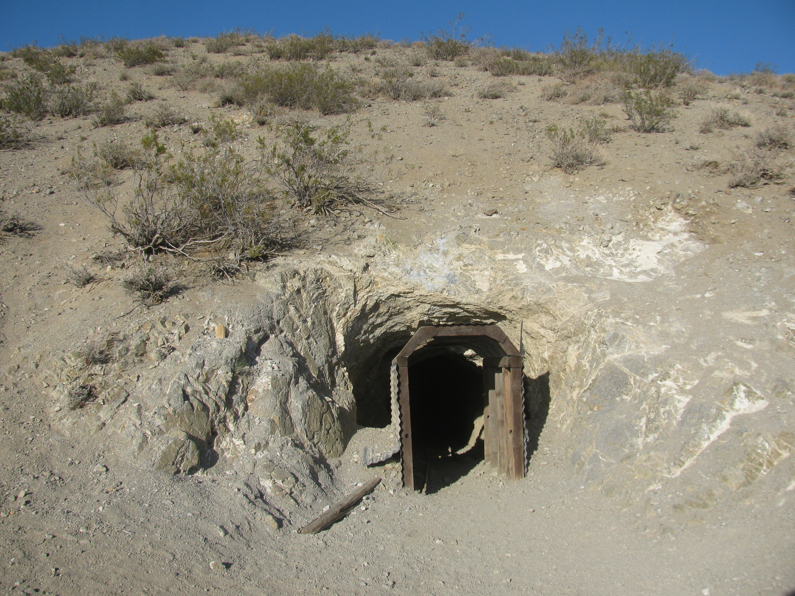
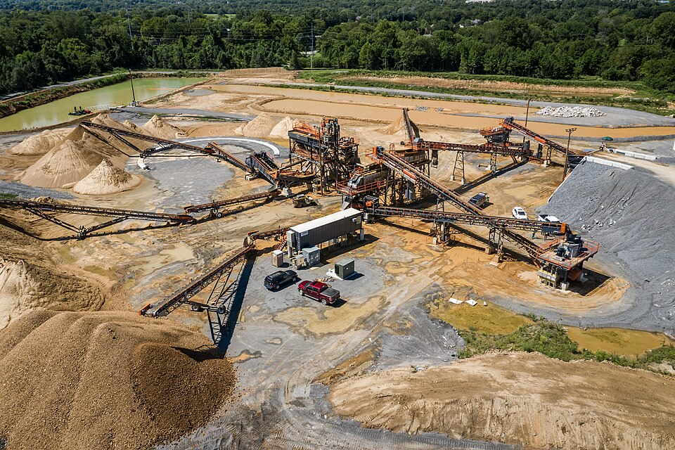
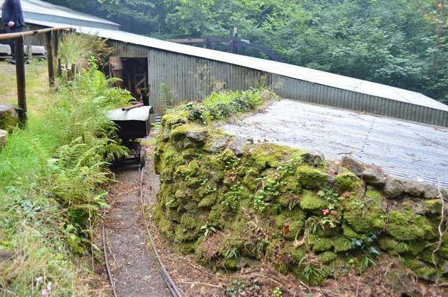
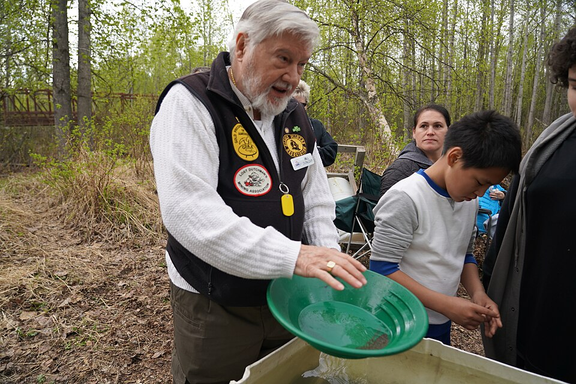
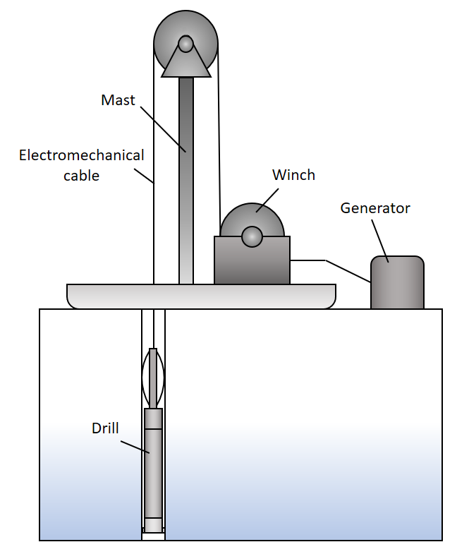

# Mining Engineering & Extractive Metallurgy

> *Image: Kurtis2014, CC BY-SA 3.0*

> *The historic Burro Schmidt Tunnel through the granitic El Paso Mountains*

> *Image: Kurtis2014, CC BY-SA 3.0*

Capabilities in this domain:

> *Image: Weekly Journal Miner, Public domain*

- [Mining Extraction](extraction.md) — Surface and underground mining methods for extracting ore from deposits.

> *Image: Satirdan kahraman, CC BY-SA 4.0*

- [Black Powder Explosives](black-powder.md) — Gunpowder manufacture and blasting techniques for mining operations.

> *Image: Ashley Dace, CC BY-SA 2.0*

- [Ore Processing](processing.md) — Ore crushing, grinding, gravity separation, and concentration to produce marketable ore products.

> *Image: BLM Alaska, Public domain*

- [Prospecting & Surveying](prospecting.md) — Geological survey, ore body identification, and deposit evaluation techniques.

> *Image: Mike Christie, CC BY-SA 4.0*

- [Drilling](drilling.md) — Hand steel, pneumatic, and core drilling techniques for blast holes and prospecting.
<!-- TODO: source image for Mine Ventilation -->
- [Mine Ventilation](ventilation.md) — Natural, furnace, and mechanical ventilation systems for underground air supply and hazard control.

> *Image: Xtremizta, CC BY-SA 2.0*

- [Tailings Reprocessing](tailings-reprocessing.md) — Recovering residual metals and useful materials from mine waste using modern extraction techniques, improving resource efficiency and reducing environmental footprint.

[↑ Back to Tech Tree](../index.md)
