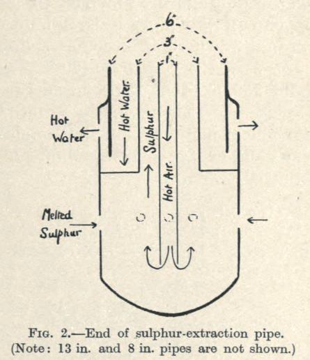
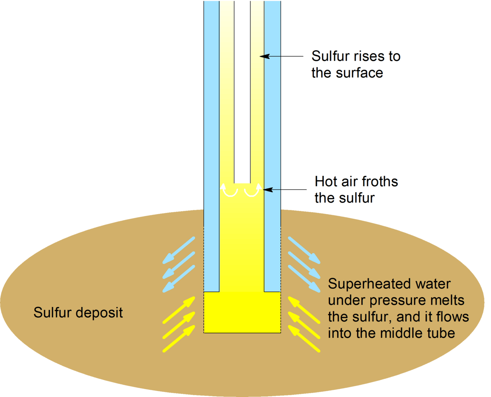

# Sulfur Extraction

> **Node ID**: mining.sulfur-extraction
> **Domain**: [Mining](./index.md)
> **Dependencies**: [`Mineral Acid Production`](../chemistry/acids.md)
> **Enables**: Various downstream capabilities
> **Timeline**: Years 10-25
> **Outputs**: elemental_sulfur, sulfur_dioxide, sulfuric_acid_precursor
> **Critical**: No

## Overview

> *Sulfur extraction drawing (pipe end)*

> *Image: Percy Cyril Lesley Thorne, Public domain*

> *Pictorial representation of the Frasch process. Adapted from Wolfgang Nehb, Karel Vydra (2005), “Sulfur”, in Ullmann’s Encyclopedia of Industrial Chemistry, Weinheim: Wiley-VCH, DOI:10.1002/14356007.a25_507.pub2*

> *Image: Rifleman 82 (talk), Public domain*

Extraction of elemental sulfur from volcanic deposits (native sulfur collection), pyrite roasting, Frasch process (superheated water injection into underground deposits), and Claus process (recovery from sour gas). Sulfur is the gateway feedstock for sulfuric acid production — the most produced industrial chemical and foundation of the chemical industry.

Sulfuric acid consumes more sulfur than any other application. It is used in steel pickling, fertilizer production, petroleum refining, chemical synthesis, and battery production. A civilization that cannot produce sulfuric acid cannot produce phosphate fertilizers, cannot refine petroleum, cannot make most synthetic chemicals. Sulfur availability is therefore a civilizational bottleneck — without it, the chemical industry does not exist.

Native sulfur occurs around volcanic fumaroles and hot springs as yellow crystalline deposits. These surface deposits are the easiest source to exploit and are the starting point for sulfur production at low technology levels. Deeper deposits and alternative sources (pyrite, sour gas) require progressively more sophisticated extraction methods.

At the lowest technology level, sulfur is also used directly in black powder manufacture (mixed with saltpeter and charcoal), in medicine (sulfur ointments for skin conditions), and for vulcanization of rubber. These direct uses create demand even before sulfuric acid production is established.

## Prerequisites

### Materials

- **Sulfur-bearing ore or deposits** — native sulfur crystals, sulfur-bearing rock, or iron pyrite (FeS₂). Deposit type determines extraction method.
- **Fuel** — wood, charcoal, or coal for kiln and furnace operations. Frasch process requires large quantities of fuel for steam generation.
- **Water** — for Frasch process steam generation and for cooling/cleaning operations.

### Equipment

- **Collection tools**: Picks, shovels, baskets for native sulfur collection. Basic mining tools.
- **Kiln or furnace**: Stone or brick construction for the Sicilian method and pyrite roasting. Refractory lining for high-temperature operations. Chimney or gas ducting for SO₂ capture.
- **Distillation apparatus**: Covered vessel (retort) with condensation surface for sulfur sublimation purification. Clay or iron construction.
- **Drilling equipment (Frasch)**: Drill rig capable of reaching sulfur deposits (typically 100-300 meters deep). Steel drill pipe and casing.
- **Steam generation (Frasch)**: Boiler capable of producing superheated water under pressure. Steam piping and injection wells.
- [Mineral Acid Production](../chemistry/acids.md) — material dependency

### Knowledge

- Understanding of sulfur occurrence — where deposits form, how to recognize sulfur-bearing rock, and which geological settings are productive
- Familiarity with gas hazards (H₂S, SO₂) and appropriate safety protocols for each
- Ability to operate kilns and furnaces for sulfur extraction and purification
- Understanding of sulfur melting and sublimation behavior for purification
- Safety training for volcanic terrain, underground mining, and high-pressure steam (Frasch process)

### Infrastructure

- **Volcanic collection site**: Accessible routes to fumarole deposits. Wind-aware positioning (workers must be upwind of gas emissions). Shelter from direct volcanic heat.
- **Kiln/furnace installation**: Permanent stone or brick structure with gas capture ducting. Fuel storage area. Product collection area.
- **Frasch process installation**: Steam boiler plant, drilling rig, injection wells, sulfur collection tanks. Requires significant capital investment but produces high volumes.
- **Storage**: Cool, dry, well-ventilated warehouse for solid sulfur. Sulfur storage must be separated from oxidizers and ignition sources.

## Deposit Grades and Occurrence

Sulfur occurs in several geological settings, each with different sulfur content, accessibility, and extraction complexity:

| Deposit Type | Sulfur Content | Depth | Scale | Extraction Method |
|-------------|:--------------:|:-----:|:-----:|-------------------|
| Volcanic fumarole deposits | 40-95% S | Surface to 30 m | 10-10,000 tonnes | Hand collection |
| Sedimentary native sulfur (evaporite-associated) | 15-40% S | 50-300 m | 100,000-10M tonnes | Sicilian kiln or Frasch |
| Salt dome cap rock sulfur | 10-30% S (cap rock) | 100-600 m | 1M-100M tonnes | Frasch process |
| Pyrite (FeS₂) ore | 45-50% S by mass (massive) | Surface to 500 m | Vast | Roasting → SO₂ |
| Pyritic shale | 2-10% S | Surface to 200 m | Vast | Roasting → SO₂ (low grade) |
| Sour natural gas (H₂S) | 1-30% H₂S by volume | 500-5,000 m | Continuous flow | Claus process |

**Volcanic native sulfur** is the easiest to exploit but limited in scale. Fumarole deposits form where volcanic gases (H₂S, SO₂) react at the surface to precipitate elemental sulfur as yellow crystals. Typical deposit dimensions: 5-50 m across, 0.5-5 m thick. The sulfur grade is high (often >80% pure) but mixed with volcanic ash, clay, and rock fragments. Impurities include arsenic (0.01-2%), selenium (0.001-0.5%), and traces of mercury.

**Sedimentary sulfur deposits** form when gypsum (CaSO₄·2H₂O) or anhydrite (CaSO₄) is reduced by hydrocarbons or bacteria under anaerobic conditions, precipitating native sulfur in the pore spaces of limestone or evaporite rock. The sulfur content ranges from 15% (economic cutoff for kiln processing) to 40% (high-grade). These deposits are the primary feed for the Sicilian kiln method.

**Salt dome cap rock** contains the largest sulfur deposits. The Frasch process was developed specifically for these: sulfur occurs as disseminated crystals and vein fillings in the calcite cap rock overlying salt domes. Individual domes may contain 1-50 million tonnes of sulfur at 10-30% grade. Gulf Coast domes (Texas, Louisiana) historically dominated world sulfur production.

**Pyrite** is the fallback source when native sulfur is unavailable. Massive pyrite ore (FeS₂) contains 53.3% sulfur by mass (the theoretical maximum). Real ores grade 40-50% S due to gangue minerals. Roasting 1 tonne of 45% S pyrite yields approximately 900 kg of SO₂ gas, which feeds sulfuric acid production at roughly 1.4 tonnes H₂SO₄ per tonne of pyrite.

## Process Description

Sulfur extraction methods depend on the deposit type. The progression from simplest to most complex tracks the development of mining and chemical capability.

### Step-by-Step Procedure

1. Survey the site to confirm presence and concentration of sulfur deposits. Document geological conditions — volcanic fumaroles, salt dome cap rock, or sedimentary pyrite beds.
2. Prepare the extraction site: clear vegetation, establish drainage, set up equipment. Install safety barriers. For volcanic deposits, assess fumarole gas hazards.
3. Begin extraction using the method appropriate to deposit type and depth:
   - **Native sulfur collection**: At volcanic fumaroles and hot springs, sulfur crystallizes directly from volcanic gases on rock surfaces. Workers collect the bright yellow crystalline deposits by hand, using picks and shovels to break the crystals free. The simplest method, requiring only basic tools and access to volcanic terrain. Sulfur melts at a low temperature, so care must be taken near fumarole vents where ground temperatures may approach or exceed the melting point.
   - **Sicilian method (distillation)**: Pile sulfur-bearing rock in a kiln with a limited air supply. Heat the pile. Sulfur melts and flows out of the rock, collecting in a well at the bottom. Impure sulfur is then re-melted in a covered vessel (sublimation distillation) — sulfur vapor condenses on a cool surface as pure crystals. This method processes lower-grade ores that are not amenable to simple collection.
   - **Pyrite roasting**: Heat iron pyrite (FeS₂) in a furnace with limited air. The sulfur burns off as sulfur dioxide gas, which is captured and processed. The remaining iron oxide (burnt pyrite) is a useful material for iron smelting or as a pigment. This method does not produce elemental sulfur directly but generates sulfur dioxide — a precursor to sulfuric acid via the contact process.
   - **Frasch process (deep deposits)**: Drill into underground sulfur deposits in salt dome cap rock. Inject superheated water to melt the sulfur in place. Force the molten sulfur to the surface using compressed air. The Frasch process requires high-pressure steam generation and deep drilling capability, but produces very pure sulfur from deposits inaccessible by other methods.
4. Process extracted material through purification (re-melting, sublimation) to concentrate the product.
5. Transport processed material to storage. Record yield and quality for each batch.
6. Rehabilitate the site as operations progress — backfill, regrade, revegetate.

### Extraction Methods Comparison

| Method | Deposit Type | Technology Level | Purity | Hazards |
|--------|-------------|-----------------|--------|---------|
| Native collection | Volcanic surface deposits | Very low | Moderate | Volcanic gases, heat |
| Sicilian distillation | Sulfur-bearing ore | Low | High | Furnace operation |
| Pyrite roasting | Sedimentary pyrite | Moderate | SO₂ gas (not elemental) | SO₂ gas, furnace |
| Frasch process | Deep salt dome sulfur | High | Very high | Steam pressure, drilling |

### Products and Downstream Uses

Elemental sulfur produced by these methods feeds directly into:

1. **Sulfuric acid production**: The primary use. Burned to SO₂, then converted to SO₃ over a vanadium catalyst, then absorbed in water. Sulfuric acid is the most-produced industrial chemical and feeds fertilizer production, steel processing, petroleum refining, and chemical synthesis.
2. **Black powder manufacture**: Mixed with saltpeter and charcoal as the ignition facilitator.
3. **Vulcanization**: Cross-links rubber molecules to improve strength, elasticity, and temperature resistance. Essential for tires, seals, and rubber goods.
4. **Fungicide and pesticide**: Elemental sulfur dust applied to crops to control fungal diseases. The oldest known pesticide.

### Process Parameters

| Parameter | Range | Notes |
|-----------|-------|-------|
| Operating Temperature | Process-dependent | See specific procedure |
| Throughput | Scale-dependent | Bench to production |
| Yield | Process-dependent | Acceptable output fraction |

## Safety Considerations

This process involves specific hazards requiring trained personnel and protective measures:

- **Hydrogen sulfide (H₂S) exposure**: Volcanic fumaroles and some sulfur deposits release H₂S, which is toxic at low concentrations and lethal at higher levels. H₂S paralyzes the olfactory nerve — after a brief exposure, victims can no longer smell it and may not realize they are being poisoned. Gas monitoring required for all volcanic and underground operations.
- **Sulfur dioxide (SO₂) inhalation**: Pyrite roasting and sulfur burning produce SO₂, which is intensely irritating to the respiratory tract. Causes coughing, bronchospasm, and at high concentrations, pulmonary edema.
- **Thermal burns**: Molten sulfur is handled at temperatures above its melting point. Sulfur burns produce a blue flame that is difficult to see in daylight — a sulfur fire may not be visually obvious. Molten sulfur ignites on contact with hot surfaces.
- **Volcanic terrain hazards**: Unstable ground, hot surfaces, toxic gas emissions, and steam vents at collection sites. Ground temperature alone can cause severe burns through boot soles.
- **Cave-ins**: Underground mining of sulfur-bearing rock shares conventional mining hazards.

### Personal Protective Equipment

- Safety glasses or face shield — mandatory near all sulfur processing
- Respiratory protection with acid gas cartridges for SO₂ environments; supplied air for H₂S environments
- Heat-resistant gloves for handling molten sulfur and near furnaces
- Heat-resistant footwear for volcanic terrain collection
- Hard hat for underground and pyrite roasting operations
- Gas detector (chemical indicator or canary for lowest tech levels) when working near volcanic fumaroles

### Emergency Procedures

- Maintain first aid kit with burn treatment and respiratory support. H₂S exposure victims must be moved to fresh air immediately — rescue attempts require self-contained breathing apparatus to prevent additional casualties.
- Know locations of emergency shutoffs for steam supply (Frasch process) and furnace dampers.
- Establish evacuation routes and assembly points upwind of gas sources. Wind direction awareness is critical for all operations involving SO₂ or H₂S.
- Train all personnel on gas hazard recognition. H₂S kills quickly — seconds at high concentrations. SO₂ provides warning by irritation but still causes serious harm with prolonged exposure.
- Sulfur fires: smother with sand. Do not use water on molten sulfur fires — water causes violent steam explosions that scatter burning sulfur.

## Quality Control

### Acceptance Criteria

- **Elemental Sulfur**: Bright yellow color (darkening indicates impurities). Free of ash, rock fragments, and organic contamination. Melting point at the expected range confirms purity.
- **Sulfur Dioxide**: Gas concentration sufficient for downstream processing. Free of particulate matter and other acidic gases when captured from pyrite roasting.
- **Sulfuric Acid Precursor**: Depends on form — solid sulfur should be free of arsenic contamination (arsenic is a common impurity in volcanic sulfur that poisons sulfuric acid catalysts).

### Testing Methods

- **Visual inspection**: Pure sulfur is bright, lemon-yellow. Darkening, reddening, or graying indicates impurities.
- **Melting point test**: Pure sulfur melts sharply at its known melting point. A broad melting range indicates impurities. Place a small sample in a heated oil bath and observe the temperature at which melting begins and completes.
- **Ash test**: Burn a weighed sample. Residue = ash (mineral impurities). High ash content indicates incomplete purification.
- **Burning test**: Pure sulfur burns with a blue flame, producing SO₂. If the flame is yellow or smoky, organic impurities are present.

### Sampling Protocol

- Inspect first-article output against full specification. Test color, melting point, and ash content.
- Sample subsequent production at defined intervals. Track purity trends — increasing impurities may indicate the ore grade is declining or kiln conditions are drifting.
- Record all measurements for trend analysis.
- Reject and investigate any out-of-specification results. Sulfur with arsenic contamination must not be used in sulfuric acid production — arsenic poisons the vanadium catalyst in the contact process.
- For gas stream analysis (pyrite roasting), monitor SO₂ concentration continuously to maintain process efficiency.

## Scaling Notes

Transitioning from bench-scale to production involves these considerations:

- **Bench scale (native collection)**: Manual collection from surface deposits. Workers with picks and baskets at volcanic sites. Output limited by deposit size and accessibility. No infrastructure beyond basic tools.
- **Pilot scale (Sicilian kiln)**: Furnace-based extraction from sulfur-bearing ore. Requires fuel supply and kiln construction. Processes lower-grade ores. Output limited by furnace size and fuel availability.
- **Production scale (Frasch or industrial pyrite roasting)**: Deep drilling with steam injection (Frasch) or large-scale pyrite roasting furnaces with gas capture. Requires drilling capability, high-pressure steam generation, and gas handling infrastructure. Produces sulfur in industrial quantities sufficient for sulfuric acid plant feedstock.

Key scaling challenges: sulfur deposits are geographically limited (volcanic regions, salt domes, pyrite-bearing sedimentary basins), the Frasch process requires abundant fuel for steam generation, and pyrite roasting requires gas capture and treatment infrastructure to avoid massive SO₂ air pollution.

## Troubleshooting

| Problem | Probable Cause | Solution |
|---------|---------------|----------|
| Low sulfur recovery from ore (<50% yield) | Kiln temperature too low or ore grade below economic cutoff | Assay ore before processing (target >15% S); increase kiln temperature to 150-180°C; extend burn cycle by 1-2 days; if ore is below 10% S, switch to pyrite roasting instead |
| Sulfur discolored (gray, dark red, or brown) | Mineral impurities (iron, arsenic) or organic contamination from the ore | Re-melt and sublimate through distillation; filter molten sulfur through coarse cloth at 130-140°C to remove suspended ash; test for arsenic (gray color, garlic odor on heating) and reject contaminated batches from catalyst-grade production |
| SO₂ gas not captured effectively from pyrite roasting | Leaky furnace seals, insufficient draft, or excess air diluting the gas stream | Seal furnace joints with fireclay; ensure gas ducting is intact; measure draft with a manometer (target 5-15 Pa negative pressure at furnace); reduce excess air to achieve 7-13% SO₂ in exhaust |
| Sulfur ignites during handling or storage | Surface temperature exceeded 232°C (autoignition) or contact with spark/open flame | Keep molten sulfur below 160°C during handling; store solid sulfur away from heat and ignition sources; if fire occurs, smother with sand — never use water on molten sulfur fires |
| Frasch well yield declining rapidly | Cavern collapsed, deposit exhausted in the immediate zone, or steam pressure insufficient | Increase steam injection pressure by 0.2-0.3 MPa; drill offset wells 30-50 m from existing well to access undisturbed deposit; if multiple wells show decline, the dome may be exhausted |
| Arsenic contamination in sulfur (detectable by smell or catalyst poisoning) | Volcanic sulfur source contains arsenic minerals (orpiment, realgar) | Switch to sublimation purification at 444°C — arsenic compounds have different boiling points and fractionate out; test each batch by heating a small sample and checking for garlic odor; contaminated sulfur is acceptable for vulcanization but must not go to sulfuric acid production |
| Kiln sulfur has high ash content (>5% residue) | Ore not sorted before loading; fine gangue carried through grate with molten sulfur | Hand-sort ore to remove visible rock fragments; wash ore before loading; install a finer grate (10-15 mm openings); settle molten sulfur longer in collection well before drawing off |
| Sublimation product is brown, not bright yellow | Condensation surface too hot or sulfur vapor carrying impurities | Reduce condensation surface temperature to 30-80°C for flowers of sulfur; keep above 115°C for liquid collection; clean the retort between batches to remove residual ash |
| Pyrite roaster producing low SO₂ (<5%) | Ore grade too low, excess air, or roasting temperature insufficient | Assay pyrite ore (target >40% S); reduce air intake; maintain roasting temperature at 600-900°C; if ore is low grade, concentrate by crushing and gravity separation before roasting |

## Variations and Alternatives

- **Native sulfur collection**: Lowest technology threshold. Requires only access to volcanic terrain. Limited by geography and deposit size.
- **Sicilian kiln method**: Moderate technology. Processes sulfur-bearing rock through furnace heating. The standard method before the Frasch process was developed.
- **Pyrite roasting**: Produces SO₂ gas rather than elemental sulfur. The gas is fed directly to a sulfuric acid contact process plant. Bypasses elemental sulfur production entirely when sulfuric acid is the end goal.
- **Frasch process**: Highest technology requirement but produces the purest sulfur from deep deposits. Requires deep drilling and high-pressure steam. Economically viable only for large deposits.
- **Claus process (sour gas recovery)**: Recovers sulfur from hydrogen sulfide in natural gas and refinery gas. A later development requiring petroleum refining infrastructure.

## References

- [Mining Engineering & Extractive Metallurgy](index.md) — parent capability
- [Mining Domain](./index.md) — domain overview and related capabilities
- [Mineral Acid Production](../chemistry/acids.md) — upstream dependency (material)

Sulfur extraction is the gateway to [Mineral Acid Production](../chemistry/acids.md). Without sulfur, there is no sulfuric acid; without sulfuric acid, there is no phosphate fertilizer, no steel pickling, no lead-acid battery, no petroleum refining. Sulfur availability often determines whether a civilization develops a chemical industry or remains dependent on mechanical manufacturing alone.

Proper handling of input materials and products is essential for consistent results:

- Store elemental sulfur in a cool, dry, well-ventilated area away from ignition sources. Sulfur dust forms explosive mixtures with air at sufficient concentrations.
- Use FIFO (first-in, first-out) inventory management. Sulfur does not degrade with time but may absorb moisture in humid conditions.
- Label all containers with contents, source, and batch number.
- Inspect materials before use — reject sulfur that shows discoloration, contamination, or moisture damage.
- Segregate waste streams: spent ore from kiln processing can be used as construction fill; ash from sulfur burning may contain useful trace minerals.
- SO₂ gas must be captured and processed — never vent to atmosphere at ground level. SO₂ is toxic and causes environmental acidification.

---

*Part of the [Bootciv Tech Tree](../../index.md) · [Mining](./index.md) · [All Domains](../../index.md)*
