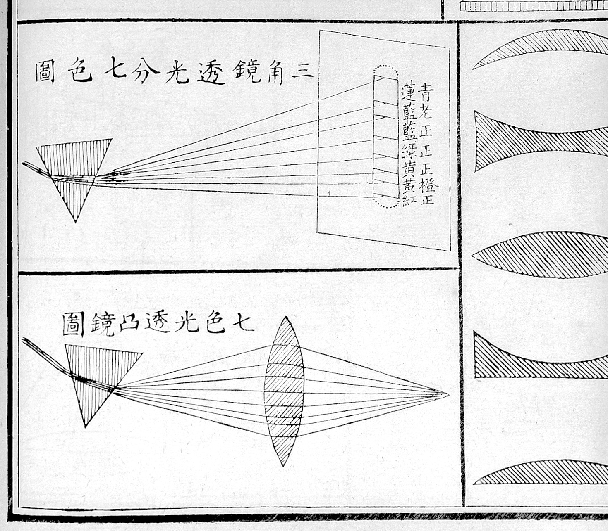
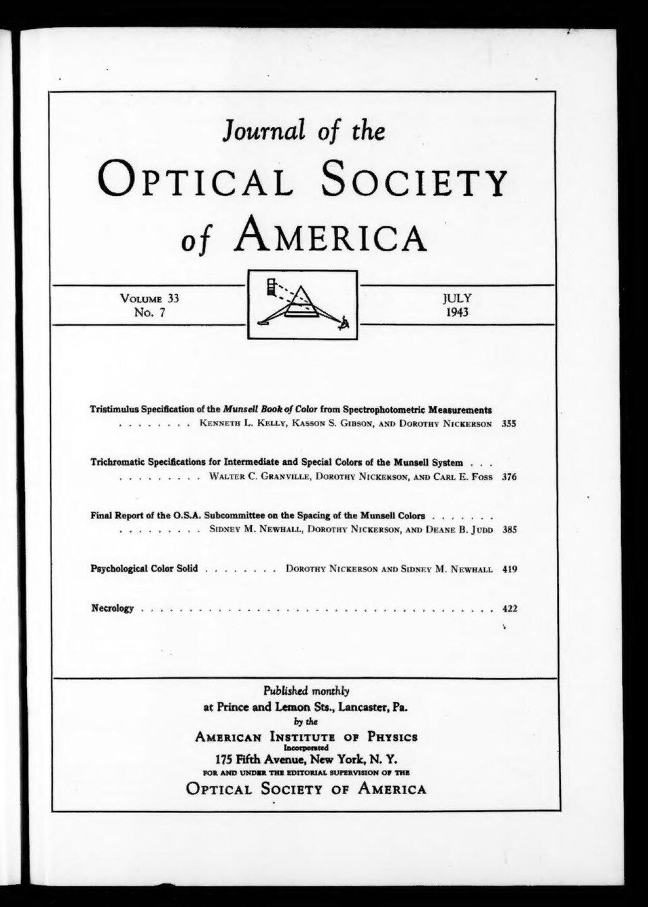
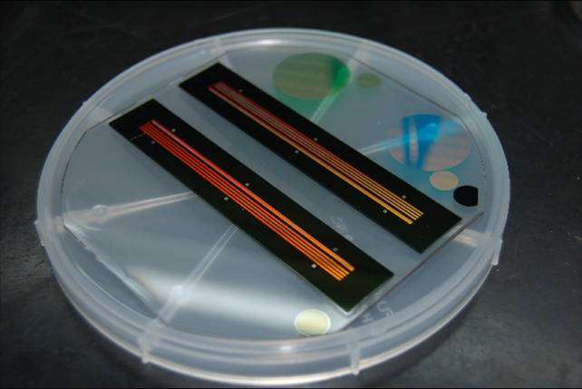
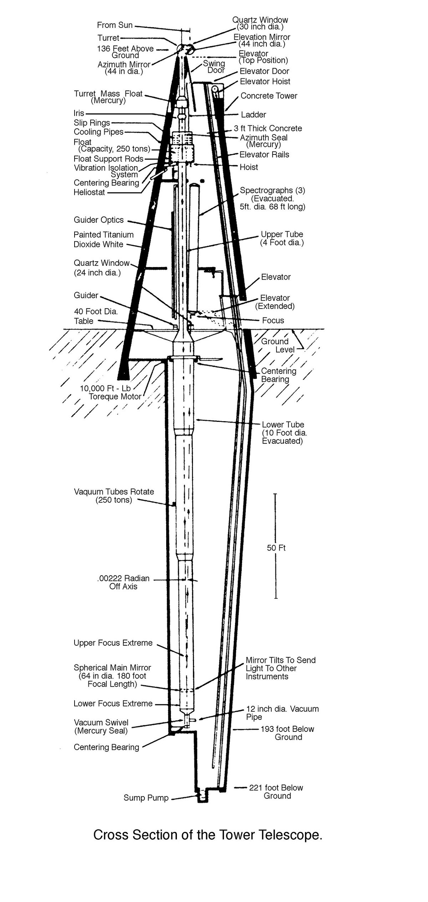

# Optics

> *Image: Wikimedia Commons contributor, CC BY 4.0*

> *Illustration showing two prisms — diagrams on perspective and optics*

> *Image: Wellcome Collection, CC BY 4.0*

Capabilities in this domain:

> *Image: Rubin Observatory/NSF/AURA, CC BY 4.0*

- [Optics & Inspection](inspection.md) — Lens grinding and polishing (rough grind → fine grind → polish with cerium oxide), compound microscopes (40x-1000x), optical comparators, spectroscopes, and optional vacuum tube electronics.

> *Image: CILAS, CC BY-SA 3.0*

- [Optical Coatings](optical-coatings.md) — Thin-film deposition for anti-reflection and mirror coatings via vacuum evaporation.

> *Image: Luke Hebert, Public domain*

- [Precision Instruments](precision-instruments.md) — Interferometers, autocollimators, optical flats, alignment telescopes, and MTF testing for optical quality assurance.

[↑ Back to Tech Tree](../index.md)
