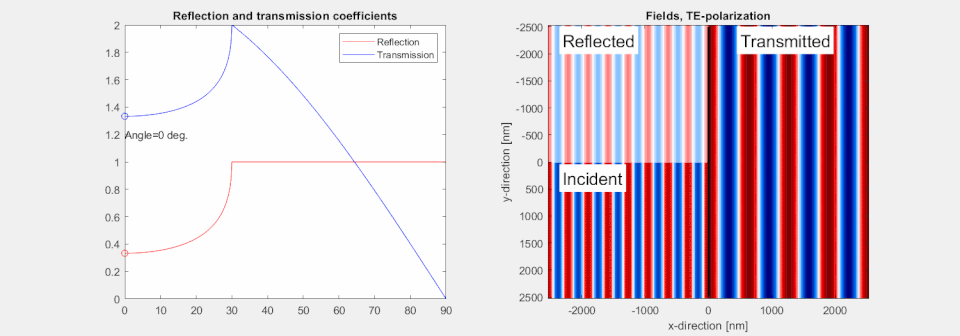
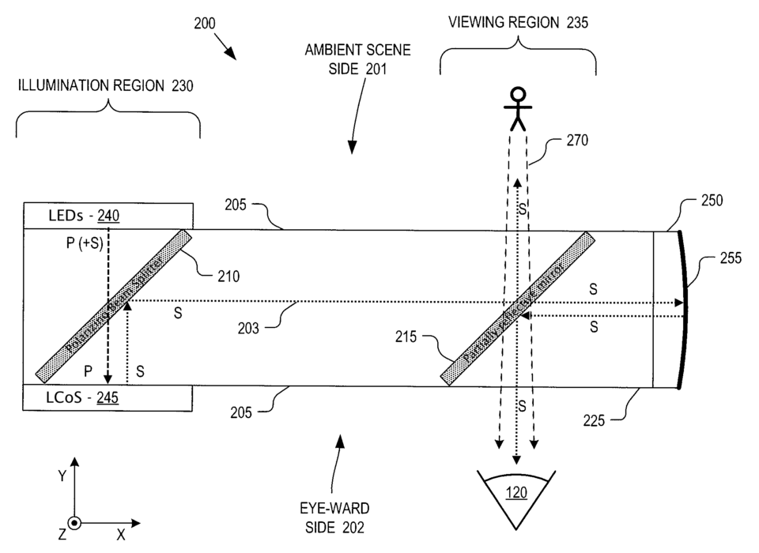

# Optics

> *Cross section of an eyepiece (200), for use in a head mounted display (HMD) with components: 120 - viewer's eye 200 - heads-up display eyepiece including: 201 - ambient scene side of eyepiece 202 - eyeward side of eyepiece 203 - forward light propagation path 204 - reverse light propagation path ...*

> *Image: Gupta, Anurag.; Amirparviz, Babak; Sharma, Sumit; Raffle, Hayes S.; Wang, Chia-Jean, Public domain*

Capabilities in this domain:

- [Optics & Inspection](inspection.md) — Lens grinding and polishing (rough grind → fine grind → polish with cerium oxide), compound microscopes (40x-1000x), optical comparators, spectroscopes, and optional vacuum tube electronics.
- [Optical Coatings](optical-coatings.md) — Thin-film deposition for anti-reflection and mirror coatings via vacuum evaporation.
- [Precision Instruments](precision-instruments.md) — Interferometers, autocollimators, optical flats, alignment telescopes, and MTF testing for optical quality assurance.

[↑ Back to Tech Tree](../index.md)

