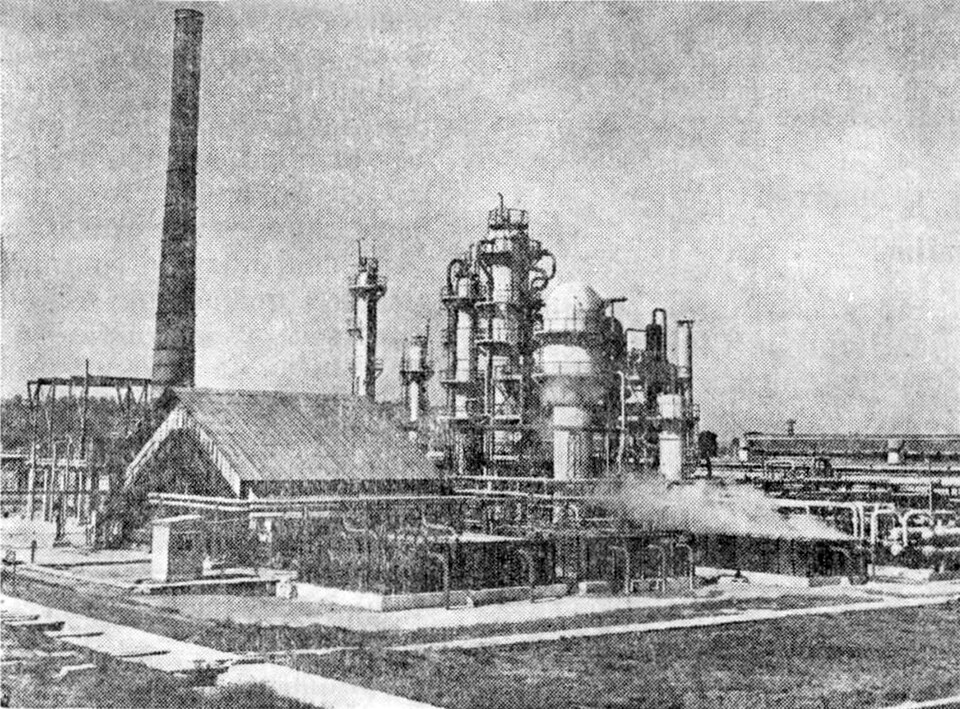

# Atmospheric & Vacuum Distillation

> **Node ID**: petroleum.refining.distillation
> **Domain**: [Petroleum](./index.md)
> **Dependencies**: [`Catalytic Cracking & Conversion`](cracking.md)
> **Enables**: [`Petroleum Refining`](refining.md)
> **Timeline**: Years 15-30
> **Outputs**: naphtha, kerosene, diesel, atmospheric_residue, vacuum_gas_oil, vacuum_residue
> **Critical**: No

## Overview

> *„Instalațiile D.A.V. —1 și D.A.V. —2 de la Rafinăria Onești”*

> *Image: Unknown authorUnknown author, Public domain*

> *„Instalațiile D.A.V. —1 și D.A.V. —2 de la Rafinăria Onești”*

> *Image: Unknown authorUnknown author, Public domain*

ADU separates crude into naphtha (40-180°C), kerosene (180-260°C), diesel (260-350°C), and atmospheric residue. VDU processes residue at 10-30 mmHg to produce vacuum gas oil and vacuum residue. Together they provide the primary separation that all downstream units depend on.

The atmospheric distillation unit is the first processing step in any refinery. Crude oil is preheated through heat exchangers with hot product streams, then enters a fired heater where it reaches its final temperature (typically 340-385°C at the heater outlet) before entering the flash zone of the distillation column. Liquid drops to the column bottom while vapors rise through a series of trays or packing, condensing at progressively lower temperatures to yield different product fractions drawn off at multiple side taps.

The vacuum distillation unit processes the atmospheric residue that would otherwise require excessively high temperatures to vaporize at atmospheric pressure, temperatures that would cause thermal cracking and coke formation. Operating under vacuum (10-30 mmHg absolute) reduces the boiling points of heavy hydrocarbons by 100-150°C, allowing recovery of vacuum gas oil for catalytic cracking or hydrocracking feedstock. The remaining vacuum residue serves as feed for bitumen production, coking units, or fuel oil blending.

Distillation of petroleum has been practiced since ancient times for producing lamp oil and lubricants, but industrial-scale continuous distillation columns capable of separating crude oil into multiple simultaneous product streams were a development of the late 19th century. The first modern refinery with atmospheric distillation resembling current practice was built at Ploiești, Romania, in 1857.

Primary outputs: `naphtha`, `kerosene`, `diesel`, `atmospheric_residue`, `vacuum_gas_oil`, `vacuum_residue`.

The product distribution from distillation depends entirely on the crude oil composition being processed. Light crudes (high API gravity, 35-45°) yield higher proportions of naphtha and middle distillates, while heavy crudes (low API gravity, 15-25°) produce more residue requiring further conversion. Refinery configuration is optimized for the crude types available from regional production or import sources.

The overhead system of the atmospheric column, where the lightest fractions (C1-C4 gases and naphtha) are condensed, is the most corrosion-prone section of the distillation unit. Hydrochloric acid from salt hydrolysis, hydrogen sulfide from the crude, and water condensation create an aggressive acidic environment at temperatures of 80-150°C. Neutralizing amine injection, corrosion inhibitor chemicals, and metallurgical upgrades to stainless steel or alloy-clad construction are the primary defenses against overhead corrosion.

The atmospheric distillation column is the defining unit of any petroleum refinery. Without it, no downstream conversion or treating unit can operate. The column's capacity sets the throughput ceiling for the entire refinery. Running the column at reduced feed rate due to fouling, corrosion, or mechanical problems cascades as lost production through every downstream unit, making reliable ADU/VDU operation the first priority in refinery maintenance planning.

## Prerequisites

### Materials

- Crude oil feedstock (any grade, though the column cut points are set for the dominant crude type)
- Desalter wash water (3-10% of crude volume, for salt and solids removal)
- Corrosion inhibitor and neutralizing amine chemicals (injected into the overhead system)
- Antifoam chemical (injected at the vacuum column flash zone to suppress foam)

### Equipment

- [Catalytic Cracking & Conversion](cracking.md) — material dependency
- Atmospheric distillation column (30-50 valve trays or sieve trays, 2-6 m diameter, 30-50 m tall)
- Fired heater (cylindrical or box-type, crude outlet temperature 340-385°C)
- Vacuum distillation column (structured packing, 5-10 m diameter, operates at 10-30 mmHg)
- Vacuum system: steam ejectors (2-3 stages with intercondensers) or liquid-ring vacuum pumps
- Heat exchanger network: 10-20 shell-and-tube exchangers in the crude preheat train
- Overhead condenser and reflux drum with water draw-off boot

### Knowledge

- Vapor-liquid equilibrium: understanding how boiling point distribution and reflux ratio control product cut points
- Fired heater operation: monitoring tube metal temperature, bridge wall temperature, and excess oxygen to prevent tube coking
- Desalter operation: controlling mix valve pressure drop, electrostatic grid voltage, and water injection rate for effective salt removal
- Vacuum system troubleshooting: understanding ejector performance curves, motive steam pressure requirements, and intercondenser fouling effects
- Tray and packing hydraulics: recognizing flooding and weeping conditions, calculating vapor velocity relative to the flooding point

### Infrastructure

- Crude oil storage tanks with adequate capacity (minimum 3-5 days feed inventory) and heating coils for heavy crudes in cold climates
- Sour water treatment system for H₂S-bearing condensate from the overhead reflux drum
- Product tank farm with segregated tanks for each fraction (naphtha, kerosene, diesel, VGO, residue)
- Flare system for pressure relief from the column and heater safety relief valves
- Cooling water system for overhead condensers and vacuum system intercondensers

## Process Description

### Step-by-Step Procedure

1. **Desalting**: Mix crude oil with 3-10% wash water in a mix valve, then pass through an electrostatic desalter. The electric field coalesces water droplets carrying dissolved salts, solids, and metals. Separate the water phase in the settling zone. Effective desalting reduces salt content below 1 PTB (pounds per thousand barrels).
2. **Preheat**: Route crude through the preheat train, a series of shell-and-tube heat exchangers recovering heat from hot product streams and pump-around circuits. Crude temperature rises from ambient to 250-300°C through heat integration alone, before the fired heater.
3. **Fired heating**: The fired heater raises crude from preheat outlet temperature to the target column inlet temperature of 340-385°C. The heater operates with 3-5% excess oxygen. Monitor tube metal temperatures closely, as exceeding 430°C causes thermal cracking and coke deposition inside the tubes.
4. **Atmospheric distillation**: Hot crude enters the flash zone of the column. Vapor rises through 30-50 trays, contacting downward-flowing reflux liquid. Products are drawn as side streams at their boiling range: overhead (C1-C4 gas + naphtha vapor), then kerosene, diesel, and atmospheric gas oil at progressively lower draw points. Atmospheric residue collects at the column bottom.
5. **Side stripping**: Each side draw passes through a small stripping column with 4-6 trays and steam stripping to remove light ends that would otherwise depress the product flash point. This sharpens the cut point between adjacent products.
6. **Vacuum distillation**: Atmospheric residue is heated to 380-415°C and fed to the vacuum column operating at 10-30 mmHg absolute. The reduced pressure lowers boiling points by 100-150°C, allowing separation of vacuum gas oil (VGO) from vacuum residue without thermal cracking. VGO is drawn as light and heavy VGO fractions; vacuum residue is pumped from the column bottom.

### Process Parameters

| Parameter | Range | Notes |
|-----------|-------|-------|
| ADU heater outlet temperature | 340-385°C | Higher for heavier crudes |
| ADU column top temperature | 100-150°C | Controls naphtha endpoint |
| ADU column bottom temperature | 330-370°C | Determines flash zone vaporization |
| ADU reflux ratio | 2:1 to 5:1 (external) | Higher reflux sharpens separation |
| VDU heater outlet temperature | 380-415°C | Limited by thermal cracking onset |
| VDU operating pressure | 10-30 mmHg abs | Lower pressure = lower boiling points |
| Desalter temperature | 120-150°C | Optimal for water coalescence |

The crude preheat train, a series of shell-and-tube heat exchangers that recover heat from hot product streams, can recover 60-70% of the heat required to bring crude to its final heater outlet temperature. Effective heat integration reduces the fired heater fuel consumption and is a major factor in refinery energy efficiency. Fouling of these heat exchangers by crude oil deposits reduces heat recovery over time, increasing fuel costs until the exchangers are cleaned during turnaround.

## Safety Considerations

- **Fired heater tube rupture**: The heater at the inlet of the atmospheric column heats crude oil to a temperature approaching its autoignition point. Tube ruptures inside the heater release crude directly into the firebox, causing immediate and intense fires. Tube metal temperature monitoring, with automatic fuel trip on high temperature, is the primary safeguard.
- **Vacuum column air ingress**: The vacuum column operates below atmospheric pressure. Any air ingress through a gasket leak or damaged seal creates an explosive atmosphere inside the column. Oxygen monitoring at the vacuum system ejector discharge detects air leaks before they become hazardous.
- **H₂S in overhead systems**: Hydrogen sulfide in sour crude concentrates in the overhead systems of both columns. Overhead sampling points and reflux drum vents require gas detection and respiratory protection for anyone working nearby.
- **Hot oil burns**: Atmospheric residue at 340°C and vacuum residue at 380°C cause severe thermal burns on skin contact. Line tracing, sampling connections, and drain valves in the hot oil circuits require insulated guards.

### Personal Protective Equipment

- Flame-resistant clothing for all personnel in the process unit area
- Insulated gloves and face shield when sampling hot product streams or operating drain valves
- Self-contained breathing apparatus staged at column overhead access points for H₂S emergency
- Hard hat, safety glasses, and steel-toe boots for all unit entry
- Personal H₂S monitor clipped at breathing zone, calibrated monthly

### Emergency Procedures

- Maintain fire steam snuffing system on fired heater tubes, tested quarterly
- Verify emergency depressurization valves on both ADU and VDU systems during monthly functional tests
- Heater tube failure: trip fuel supply, activate steam snuffing, isolate crude feed, and depressurize the heater coil to the flare
- Vacuum system air ingress: immediately inject emergency steam into the column to suppress ignition risk, then isolate and re-establish vacuum
- Sour water spill: contain and route to the sour water stripper. Do not allow to reach the oily water sewer, where H₂S release could expose personnel in low-lying areas.

## Quality Control

### Acceptance Criteria

- **Naphtha**: ASTM D86 distillation — IBP 30-50°C, FBP 160-200°C, suitable for reformer feed or gasoline blending
- **Kerosene**: Flash point above 38°C (ASTM D93), freeze point below -47°C (jet fuel) or -30°C (illuminating), smoke point above 20 mm
- **Diesel**: Flash point above 52°C, cetane index above 40, sulfur meeting specification
- **Vacuum gas oil**: Boiling range 350-550°C equivalent, metals (Ni+V) below 2 ppm for FCC feed

### Testing Methods

- Distillation curve analysis (ASTM D86) for each product fraction — measures the boiling range that defines product identity
- Flash point testing (ASTM D93) for kerosene and diesel product streams
- Vacuum system performance monitoring via ejector discharge pressure — rising pressure signals fouling or air ingress
- Crude oil assay: TBP (true boiling point) distillation of incoming crude to verify it matches the column cut point design basis
- Overhead corrosion coupon weights: measure metal loss rate to verify corrosion inhibitor dosing is adequate

### Sampling Protocol

- Monitor overhead corrosion coupon weights weekly for acid salt detection — rising corrosion rate signals inadequate neutralizing amine injection
- Track heat exchanger fouling factor via crude preheat temperature trend — a 10°C drop in preheat outlet over a run cycle triggers cleaning planning
- Sample each product stream every 8 hours for ASTM D86 distillation; adjust draw rates and reflux to maintain cut points
- Monitor vacuum system intercondenser outlet temperature and ejector motive steam pressure daily
- Track desalter performance by measuring salt-in-crude before and after, daily

## Scaling Notes

Crude oil desalting precedes distillation to remove dissolved salts, solids, and water that would cause corrosion and fouling in the column and heat exchangers. The desalter mixes crude with wash water, then uses electrostatic coalescence to separate the water phase carrying the contaminants. Effective desalting is critical for long run lengths between column inspections. A poorly desalted crude with high salt content accelerates overhead corrosion and can cause ammonium chloride salt deposition on the upper trays, eventually restricting vapor flow.

Distillation column internal design, whether valve trays, sieve trays, or structured packing, affects separation sharpness, pressure drop, and capacity. Trays are more tolerant of fouling feeds and wider operating ranges, while packing offers lower pressure drop and better separation efficiency per unit height. Vacuum columns almost exclusively use structured packing to minimize pressure drop, which translates directly to lower operating temperatures and reduced thermal cracking of the heavy hydrocarbons.

A world-scale atmospheric distillation column processes 100,000-400,000 barrels per day of crude oil. The column diameter ranges from 2-6 meters, height from 30-50 meters, with 30-50 trays. The fired heater is a major capital item and energy consumer, burning refinery fuel gas or fuel oil at rates of 50-200 MW thermal input.

The side-stream strippers attached to the atmospheric column provide additional fractionation of each product draw, removing light ends that would otherwise depress the flash point of kerosene and diesel products. These small stripping columns operate with a few trays and steam stripping medium.

Pump-around circuits on the atmospheric column remove heat at intermediate points, improving vapor-liquid contact efficiency on the trays above while recovering heat for crude preheat. Each pump-around circuit draws liquid from a tray, cools it through heat exchange with crude, and returns it to the column several trays above the draw point.

The reflux ratio, the ratio of condensed overhead liquid returned to the column versus drawn off as product, is the primary control variable for product separation sharpness. Higher reflux ratios produce sharper cuts between adjacent fractions (e.g., tighter separation between naphtha and kerosene) at the cost of increased energy consumption in the reboiler and condenser. Typical atmospheric columns operate with 2:1 to 5:1 external reflux ratio, with higher ratios used when processing crudes with closely spaced boiling fractions.

Column internal metallurgy must withstand the corrosive environment created by H₂S, HCl (from hydrolysis of magnesium and calcium chlorides in the crude), and naphthenic acids present in some crude types. Carbon steel trays are adequate for the middle and lower sections where temperatures are high enough to prevent aqueous corrosion. The upper (overhead) section, where water condenses at temperatures below 150°C, requires stainless steel or alloy-clad construction to resist the acidic aqueous phase.

Naphthenic acid corrosion is a particular concern with certain crude types (TAN > 0.5 mg KOH/g). These organic acids attack carbon steel at 220-400°C, creating localized pitting and grooving in column internals, transfer lines, and pump casings. Metallurgical upgrades to 316 stainless steel or 12% chromium alloys are required in the affected temperature zones when processing high-TAN crudes.

Turnaround planning for distillation columns typically follows a 4-6 year cycle. The turnaround interval is determined by the corrosion rate of the column internals, the fouling rate of the heat exchanger network, and the statutory inspection requirements for pressure vessels. A well-planned turnaround minimizes downtime while addressing all accumulated maintenance needs, including tray replacement, heat exchanger bundle cleaning, and heater tube inspection.

## Troubleshooting

| Problem | Probable Cause | Solution |
|---------|---------------|----------|
| Column flooding | Excessive vapor velocity, fouled trays, or high liquid level | Reduce heater firing rate (lower boilup); check tray condition during next turnaround; verify level controllers on draw pans |
| Poor product separation (overlap) | Damaged trays, packing upset, or incorrect reflux ratio | Inspect column internals via gamma scan; increase reflux ratio; check for tray damage from pressure surges |
| High energy consumption | Fouled heat exchangers reducing preheat recovery | Clean exchanger bundles during turnaround; verify desalter performance is not contributing to fouling |
| Off-spec flash point on diesel | Insufficient steam stripping in side stripper or light ends leaking down the column | Increase stripping steam rate; check side stripper tray condition; verify draw tray liquid seal integrity |
| Vacuum column pressure rising | Ejector wear, fouled intercondenser, or air leak through a gasket | Clean intercondenser tubes; verify ejector nozzle condition; perform helium leak test on column flanges |
| Naphtha endpoint too high | Insufficient reflux or column top temperature too high | Increase reflux ratio; lower overhead temperature by adjusting reflux; check overhead condenser performance |
| Desalter oil-undercarry | Inadequate residence time, low temperature, or grid voltage too low | Increase residence time; raise desalter temperature to 130-150°C; verify electrostatic grid voltage and clean grids |

The crude oil desalter is often overlooked but is critical to reliable distillation operation. Crude oil arriving at the refinery contains produced water with dissolved chlorides (MgCl₂, CaCl₂, NaCl). These salts hydrolyze at distillation temperatures to form hydrochloric acid, which attacks the carbon steel in the column overhead system. The resulting corrosion produces iron sulfide and iron chloride deposits that foul trays and heat exchangers. Effective desalting, reducing salt content below 1 PTB, is the first line of defense against overhead corrosion.

## Variations and Alternatives

- **Batch distillation (pot still)**: The oldest method, still used for small-scale specialty products. Charge a kettle with crude, heat, and collect fractions by boiling point as they come off. Simple equipment but poor separation and low throughput.
- **Steam distillation**: Injecting steam reduces hydrocarbon partial pressure, lowering effective boiling points. Used for specific high-boiling fractions where vacuum equipment is not available.
- **Membrane separation**: Emerging technology for specific separations (e.g., hydrogen recovery from fuel gas streams). Not applicable to bulk crude distillation but useful for downstream product purification. Polymer membranes with selective permeability can recover hydrogen from refinery off-gas at lower energy cost than cryogenic separation.
- **Extractive distillation**: Adding a high-boiling solvent to the feed to alter relative volatilities and improve separation of close-boiling components. Used in specific applications like aromatic extraction from cracked naphtha, but not for bulk crude oil fractionation.

## References

- [Petroleum Refining](refining.md) — parent capability
- [Petroleum Domain](./index.md) — domain overview and related capabilities
- [Catalytic Cracking & Conversion](cracking.md) — upstream dependency (material)
- [Petroleum Refining](refining.md) — downstream capability

### Material Handling

- Maintain crude oil tank heating to prevent wax precipitation in cold climates, using steam coils or external heaters
- Sample crude oil from each incoming delivery for API gravity and water content before tank charging, to detect off-spec crude before it reaches the desalter
- Store naphtha in floating-roof tanks to minimize vapor losses and fire risk
- Pump vacuum residue hot (above its pour point, typically 150-200°C) through steam-traced lines to prevent solidification
- Monitor product tank levels and quality continuously; segregate off-spec material to slop tanks for reprocessing
- Schedule heat exchanger cleaning based on fouling factor trends rather than fixed calendar intervals to optimize run length versus cleaning cost
- Verify desalter wash water quality (low hardness, low dissolved oxygen) to prevent scaling and corrosion in the desalter and downstream heat exchangers

---
*Part of the [Bootciv Tech Tree](../../index.md) · [Petroleum](./index.md) · [All Domains](../../index.md)*
