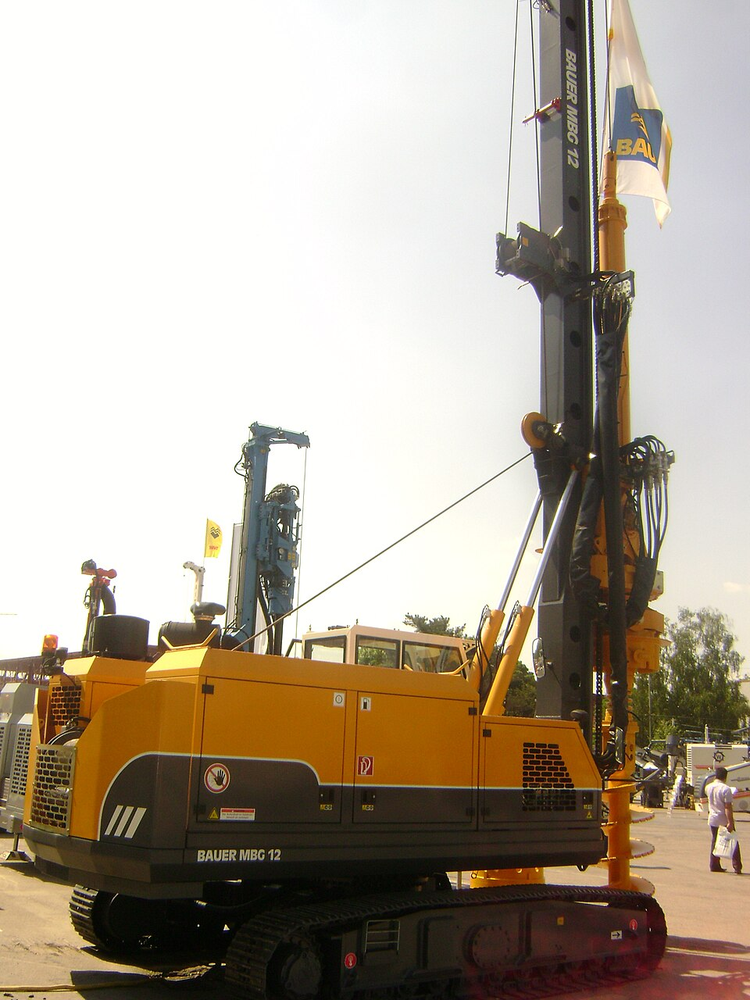

# Rotary Drilling

> **Node ID**: petroleum.extraction.rotary
> **Domain**: [Petroleum](./index.md)
> **Dependencies**: See prerequisites
> **Enables**: [`Crude Oil Extraction`](extraction.md), [`Cable-Tool Drilling`](cable-tool.md)
> **Timeline**: Years 20-35
> > **Outputs**: crude_oil
> **Critical**: No

## Overview

> *Image: Gabinho, CC BY 3.0*

Rotating drill bit with continuous drilling mud circulation. Depth range 100-5,000+ m, penetration rate 10-100 m/day. Requires steel drill pipe, mud pumps, and blowout preventer. The dominant drilling method since the 1920s.

The rotary drilling system consists of a rotating drill string of screwed-together steel pipe sections, a drill bit at the bottom (roller cone or polycrystalline diamond compact), and a circulating mud system. Drilling mud, a weighted mixture of water or oil with bentonite clay, barite, and various chemical additives, is pumped down the hollow drill string, exits through nozzles in the bit, and returns up the annular space between the drill pipe and borehole wall, carrying rock cuttings to the surface.

Drilling mud serves multiple functions simultaneously: it cools and lubricates the bit, suspends and transports cuttings during circulation and when pumps are stopped, maintains hydrostatic pressure against formation fluids to prevent blowouts, deposits a filter cake on the borehole wall to prevent fluid loss into permeable formations, and supports the borehole walls against collapse. Adjusting mud weight, viscosity, and chemical properties to match formation conditions is a continuous process managed by the mud engineer.

The transition from cable-tool to rotary drilling in the early 20th century was driven by the need to reach deeper formations, drill through hard rock layers more quickly, and maintain borehole stability in unconsolidated formations that collapsed when drilled dry. The Spindletop discovery well in Texas (1901) demonstrated rotary drilling's capability on a spectacular scale, and the method rapidly displaced cable-tool drilling for most oilfield applications.

Primary outputs: `crude_oil`.

A rotary drilling rig is a complex assembly of mechanical, hydraulic, and electrical systems. The capital cost of a drilling rig and its associated support equipment represents a major investment. Rig utilization rate, the fraction of time spent actually drilling versus mobilizing, maintaining, or standing idle, is the primary determinant of drilling cost per well.

The drill bit has evolved substantially since the early cone bits developed by Howard Hughes Sr. in 1909. Modern tricone bits use sealed journal bearings and tungsten carbide inserts shaped for specific formation types: long chisel inserts for soft formations, short conical inserts for medium, and short round inserts for hard rock. PDC bits use synthetic diamond compacts brazed to a steel body, shearing rock rather than crushing it. PDC bits drill 3-5 times faster than roller cone bits in compatible formations but are limited to formations where impact loading does not fracture the diamond cutters.

Casing programs for a typical well include three to five concentric strings, each smaller than the last. The surface casing (17.5-inch hole, 13.375-inch casing) protects fresh water aquifers and provides a structural foundation. Intermediate casing isolates problem formations (high-pressure zones, lost-circulation zones, reactive shales). Production casing (typically 4.5 to 7 inches) provides the final conduit. Each casing string is cemented in place, and the cement quality is verified by acoustic logging (cement bond log) before drilling the next, smaller hole section.

The rate of penetration (ROP) is the primary measure of drilling efficiency, typically expressed in meters per hour or feet per hour. ROP depends on weight on bit (WOB), rotary speed (RPM), bit type, mud hydraulics, and formation hardness. In soft formations, ROP can exceed 50 m/hour; in hard rock, it may drop below 2 m/hour. The driller optimizes WOB and RPM to maximize ROP while maintaining directional control and avoiding bit damage. Real-time ROP trending, displayed on the driller's console, provides immediate feedback on formation changes and bit condition.

## Prerequisites

### Materials

- Steel drill pipe and tool joints (API Spec 5D, Grade E-75 or higher, 9.7 m per joint)
- Drill collars (heavy-walled pipe to provide weight on bit, typically 4-8% of total drill string weight)
- Drilling mud components: bentonite clay (viscosifier), barite (weighting material to 18+ ppg), caustic soda (pH control), lignite or lignosulfonate (thinner/dispersant)
- Well cement (API Class A through H, depending on depth and temperature) and casing strings (surface, intermediate, production)
- Drill bits: roller cone (tricone) with tungsten carbide inserts, or PDC (polycrystalline diamond compact) bits

### Equipment

- Drill rig with derrick (30-50 m), drawworks (hoisting drum), and rotary table or top drive system
- Mud pumps (two or three duplex or triplex piston pumps, rated 1,000-3,000 HP)
- Shale shaker (vibrating screen for primary cuttings removal), desander, desilter, and centrifuge (solids control equipment)
- Blowout preventer (BOP) stack: annular preventer, pipe rams, blind rams, shear rams, with hydraulic accumulator unit
- Kelly (square or hexagonal drive section, if using rotary table) or top drive (motor-driven rotating head that replaces the kelly)

### Knowledge

- Wellbore hydraulics: calculating annular velocity, equivalent circulating density, and pressure losses to optimize hole cleaning and formation pressure balance
- Drilling fluid engineering: mud weight control, filtrate management, rheology testing (viscometer readings at 600 and 300 RPM)
- Well control procedures: recognizing a kick (formation fluid influx), performing the driller's method or wait-and-weight method to kill the well
- BOP operation and testing: ram function testing, accumulator pressure verification, and shut-in procedures
- Directional drilling fundamentals: measurement-while-drilling (MWD) tool operation, well trajectory planning, and steerable motor operation

### Infrastructure

- Prepared drilling pad (50×50 m minimum, graded and compacted) with mud pits (active, reserve, and settling) and a lined reserve pit for waste
- Blowout preventer stack mounted on the wellhead conductor, with hydraulic accumulator unit and remote control panel
- Power supply: diesel-electric generators (500-2,000 kW for a medium rig) or rig-mounted diesel engines with mechanical drive
- Water supply: 50-200 m³/day for mud mixing and rig operations
- Access road capable of supporting heavy truck loads (casing, chemicals, equipment)

## Process Description

### Step-by-Step Procedure

1. **Rig up and spud**: Assemble the rig on the prepared pad. Set conductor pipe (large-diameter casing, 50-100 cm, driven or cemented 10-30 m into the ground). Install the BOP stack on the conductor. Make up the first drill string (bit + drill collars + drill pipe + kelly or top drive connection).
2. **Drill surface hole**: Drill to the surface casing depth (100-500 m). Circulate mud continuously: pump down the drill string, through bit nozzles, up the annulus carrying cuttings to the shale shaker. Maintain mud weight sufficient to control shallow formation pressures. Pull the drill string, run surface casing, and cement it in place.
3. **Drill intermediate hole**: Change to a smaller bit diameter. Drill through the intermediate section, which may include problem formations (high-pressure zones, lost-circulation zones, reactive shales). Adjust mud weight and chemistry as needed. If well direction must be controlled, deploy a steerable downhole motor with MWD tool. Run intermediate casing and cement.
4. **Drill production hole**: Drill the final section to the target depth through the producing formation. Use mud that minimizes damage to the producing zone (oil-based mud, low-solids mud, or underbalanced drilling in some cases). Maintain precise well trajectory if drilling directionally.
5. **Circulate and condition**: Circulate the hole clean of all cuttings. Condition the mud to the specifications needed for casing running. Perform a flow check (shut in the well and observe for influx) before pulling the drill string.
6. **Complete the well**: Run production casing, cement in place, and perforate the casing at the producing interval using shaped charges run on wireline. Install the production tubing, packer, and wellhead tree for hydrocarbon production.

### Process Parameters

| Parameter | Range | Notes |
|-----------|-------|-------|
| Rotary speed (RPM) | 60-200 RPM | Faster for soft formations, slower for hard |
| Weight on bit (WOB) | 5,000-50,000 lbs | Depends on bit type and hole diameter |
| Mud flow rate | 200-800 GPM | Must achieve annular velocity above 100 ft/min for cuttings transport |
| Mud weight | 8.5-18+ ppg | Must exceed formation pore pressure gradient |
| Rate of penetration (ROP) | 10-100 m/day | Function of WOB, RPM, bit condition, and formation hardness |
| Bit nozzle velocity | 200-400 ft/sec | Hydraulic horsepower at the bit for cleaning and cooling |

### Casing Program Dimensions

A typical well uses three to five concentric casing strings, each cemented in place to isolate formations. The hole diameter steps down with each string.

| Casing String | Hole Diameter | Casing OD | Setting Depth | Purpose |
|---------------|--------------|-----------|---------------|---------|
| Conductor | 26-36 inch | 20-30 inch | 10-30 m | Stabilize surface soil, start mud circulation |
| Surface | 17.5 inch | 13.375 inch | 100-500 m | Protect freshwater aquifers, provide structural base |
| Intermediate | 12.25 inch | 9.625 inch | 500-3,000 m | Isolate problem zones (high pressure, reactive shale) |
| Production | 8.5 inch | 4.5-7 inch | To target depth | Final conduit to producing formation |
| Liner (optional) | 6.0 inch | 4.5 inch | Deep or horizontal section | Save casing cost by hanging inside intermediate |

The production casing must be large enough to accommodate the tubing, packer, and downhole equipment that will be installed during well completion. For a well producing 100-500 barrels per day, 4.5-inch production casing with 2.875-inch tubing is typical. High-rate wells may use 7-inch production casing with 4.5-inch tubing.

### Drilling Mud Specifications

Mud properties are tested every 15-30 minutes while drilling. The mud engineer adjusts weight, viscosity, and chemistry to match the formation being drilled.

| Property | Typical Range | Measurement Method |
|----------|--------------|-------------------|
| Mud weight | 8.5-18 ppg (1.02-2.16 SG) | Mud balance (beam scale) |
| Funnel viscosity | 40-60 sec/qt | Marsh funnel |
| Plastic viscosity | 10-30 cP | Rotational viscometer at 600/300 RPM |
| Yield point | 5-25 lb/100 ft² | Calculated from viscometer readings |
| Fluid loss (API) | 5-15 mL/30 min | Filter press at 100 psi |
| pH | 9.5-11.0 | pH paper or meter |
| Chloride content | Variable | Silver nitrate titration |

Mud weight is the primary well control parameter. Normal formation pressure gradient is roughly 0.465 psi/ft (equivalent to 8.95 ppg mud). Abnormally pressured formations may require mud weights of 14-18 ppg. Exceeding the formation fracture gradient by too much mud weight causes lost circulation, where whole mud flows into the formation instead of returning up the annulus. This is one of the most costly drilling problems: the mud is expensive, and lost returns mean the well is uncontrolled until the zone is isolated.

Drill bit selection depends on the formation being penetrated. Roller cone bits with tungsten carbide inserts handle soft to medium formations. PDC bits with synthetic diamond cutters provide faster penetration in medium to hard formations. PDC bits have no moving parts, reducing failure risk, but are more expensive and can be damaged by hitting abrasive or bouncy formations. Bit performance is tracked by measuring feet drilled per hour and cost per foot drilled.

## Safety Considerations

- **Blowout**: Uncontrolled flow of formation fluids to surface is the catastrophic failure mode. The BOP stack provides multiple redundant barriers: pipe rams grip the drill pipe, blind rams seal the open hole, and shear rams cut the pipe to seal the well. Regular BOP testing (weekly ram function tests, accumulator pressure checks) and crew well control drills are mandatory.
- **Rotating equipment entanglement**: The rotating drill string, kelly, and rotary table create entanglement hazards. Loose clothing, lanyards, or tools caught in the rotating equipment cause severe injuries. No loose clothing or dangling items are permitted on the rig floor.
- **Pipe handling**: Drill pipe joints weigh 25-40 kg/m. Handling during tripping (running or pulling the string) involves heavy loads suspended from the traveling block. Dropped pipe, stabbing injuries, and pinch points between the pipe and rotary table cause the majority of rig floor injuries.
- **H₂S exposure**: Drilling through sour formations releases hydrogen sulfide. The occupational exposure limits are strict: OSHA PEL is 20 ppm ceiling, with 50 ppm peak allowed for 10 minutes per 8-hour shift. NIOSH recommended limit is 10 ppm TWA. The IDLH concentration is 100 ppm, where olfactory fatigue sets in and the rotten-egg odor disappears, removing the natural warning sign. Above 300 ppm, pulmonary edema risk rises sharply. Above 700 ppm, rapid unconsciousness occurs within breaths. Personal H₂S monitors clipped at the collar alert at 10 ppm (warning) and 15 ppm (alarm). SCBA staged at the rig floor, and automatic mud gas detectors are mandatory in sour gas areas. H₂S is heavier than air (density 1.36× air) and accumulates in the cellar, mud pits, and any low ground around the rig.
- **Benzene exposure**: Crude oil vapors at the wellhead and shale shaker contain benzene, a confirmed carcinogen. OSHA PEL is 1 ppm TWA, 5 ppm STEL. Minimize time spent standing over the shale shaker or near open mud returns. Use enclosed shale shaker cabinets where available. Respiratory protection (organic vapor cartridge) is required when sampling crude at the wellhead.
- **Fire and explosion prevention**: The BOP stack is the primary barrier between the well and the surface environment. If the BOP fails to seal, formation fluids reach the rig floor where diesel engines, electrical equipment, and static discharge provide ignition sources. Keep the rig floor clear of spilled oil and fuel. Bond and ground all metal connections during casing running operations to prevent static buildup. The mud gas separator (poor boy degasser) must be vented to a safe location at least 30 m from the rig floor and ignition sources.

### Personal Protective Equipment

- Hard hat, safety glasses, and steel-toe boots on the rig floor at all times
- Impact-resistant gloves when handling drill pipe, tongs, and slips
- Hearing protection (rig floor noise exceeds 85 dBA from mud pumps and engines)
- Flame-resistant coveralls (FRC) in hydrocarbon-bearing zones
- Personal H₂S monitor clipped at the collar, calibrated monthly

### Emergency Procedures

- Well kick: Shut in the BOP immediately. Record shut-in drill pipe pressure and shut-in casing pressure. Calculate kill weight mud. Execute the driller's method or wait-and-weight method to circulate the influx out while maintaining bottomhole pressure above formation pressure.
- Fire on the rig floor: Trip the mud pumps (to avoid feeding fuel to the fire). Activate the BOP shear rams if the well is flowing. Evacuate upwind. Fight the fire only if it can be done safely.
- Dropped object from the derrick: All personnel on the rig floor take cover. Do not look up. Account for all crew members before resuming operations.
- H₂S alarm: Don emergency breathing apparatus, move upwind, assemble at muster point. Verify BOP is closed.

## Quality Control

### Acceptance Criteria

- **Crude Oil**: API gravity within expected range for the field. Water cut below 5% for initial production.
- **Well bore**: Within the planned trajectory tolerance (typically 30 m horizontal displacement per 1,000 m of vertical depth for vertical wells). Casing cement bond verified by cement bond log (CBL).

### Testing Methods

- Mud weight testing with a mud balance every 15 minutes while drilling, every connection
- Viscometer readings (600 and 300 RPM) every tour to monitor rheology
- Drill pipe inspection for fatigue cracks and wall thinning: MPI (magnetic particle inspection) at specified intervals
- BOP ram function test and accumulator pressure verification on weekly schedule
- Cement bond log (CBL) after each casing cement job to verify zonal isolation
- MWD survey data (inclination and azimuth) every 30 m of drilling for trajectory control

### Sampling Protocol

- Monitor mud weight and viscosity at the flow line every connection — any decrease in mud weight signals gas cutting, which precedes a kick
- Track bit wear indicators continuously: rising torque, declining rate of penetration, and changing weight-on-bit response
- Log all formation changes identified by cuttings analysis (lagged to account for transport time from bit to surface)
- Perform a flow check (shut in and observe for 15 minutes) before every trip out of the hole
- Record cement volumes pumped and returns observed to verify proper cement placement

## Scaling Notes

Directional drilling extends the capability of rotary rigs beyond vertical wells. MWD tools transmit inclination and azimuth data from the bottom of the hole to the surface via mud pulse telemetry, allowing the driller to steer the bit along a planned trajectory. Horizontal wells, multilateral completions, and extended-reach drilling all build on directional capability to access reserves that cannot be reached from directly above. A modern horizontal well may extend 2,000+ m laterally through the producing formation.

Well control is the primary safety concern. The BOP stack at the wellhead provides multiple redundant barriers. Regular BOP testing and crew drills in well control procedures are mandatory. All rig crews must be trained and certified in well control (IWCF or equivalent certification), with refresher training every two years.

Modern rigs use top drives instead of rotary tables, providing better control over drill string rotation and the ability to circulate mud while tripping. Automated pipe handling systems reduce the manual labor and hazard exposure of the rig crew. MWD and LWD tools transmit formation evaluation data in real time, allowing geosteering of the bit through the productive zone. These advances have dramatically increased drilling efficiency.

Casing and cementing programs protect groundwater aquifers and isolate different pressure zones in the wellbore. Surface casing is set to the depth required by regulation to protect fresh water, then cemented in place. The cement is pumped down the casing and displaced up the annular space between casing and borehole wall, where it sets to form a hydraulic seal. Cement bond quality is verified by acoustic logging.

## Troubleshooting

| Problem | Probable Cause | Solution |
|---------|---------------|----------|
| Lost circulation (mud lost to formation) | Fractured formation, cavernous void, or mud weight exceeding fracture gradient | Pump lost-circulation material (LCM: ground walnut shells, mica, cellulose fibers); reduce mud weight; consider setting casing to isolate the lost zone |
| Stuck drill pipe (differential sticking) | Pressure differential forces pipe against the borehole wall filter cake in a permeable zone | Reduce mud weight; apply spotting fluid (oil-based pill) around the stuck point; work pipe with jarring action; if unsuccessful, back off and sidetrack |
| Well kick (formation fluid influx) | Mud weight insufficient to balance formation pore pressure, or swabbing during trip out | Shut in BOP immediately; record pressures; calculate kill weight mud; circulate the kick out using the driller's method or wait-and-weight method |
| Rapid bit wear | Abrasive formation, excessive WOB, or inadequate hydraulics at the bit | Reduce WOB; increase pump rate for better bit cooling; switch to more wear-resistant bit type (PDC or premium tungsten carbide grade) |
| Well deviation beyond tolerance | Crooked formation tendency, inadequate WOB control, or misaligned BHA | Assemble a packed-hole bottomhole assembly (BHA) with stabilizers; reduce WOB; use a steerable motor to correct trajectory |
| Cement channeling (poor bond) | Mud not fully displaced by cement, or casing not centralized | Increase centralizer density on the casing string; improve mud conditioning before cementing; use cement with better displacement properties |
| Twist-off (drill pipe separation) | Fatigue failure at the tool joint from cyclic bending stress while rotating under high WOB in a crooked hole | Reduce WOB; use higher-grade drill pipe; inspect pipe regularly with magnetic particle inspection; fish the lower string with an overshot |
| Shale instability (hole enlargement) | Reactive clay formations swelling on contact with water-based mud | Switch to oil-based or synthetic-based mud; add shale inhibitor chemicals to water-based mud; increase mud weight to stabilize the wellbore mechanically |
| Drill pipe washout (hole in pipe wall) | Erosion from abrasive mud at high velocity through thin-walled sections | Monitor pump pressure for sudden drop (signature of washout); pull string and inspect; replace suspect joints; reduce pump rate if cuttings load in the mud is high |
| Bit balling (clay sticking to bit) | Sticky clay formations adhering to bit cutters and plugging nozzles | Increase bit nozzle velocity; add detergent or lubricant to mud; reduce WOB to let hydraulics clean the bit; switch to PDC bit with better anti-balling design |
| Casing wear from drill string rotation | Drill pipe rubbing against intermediate casing in deviated or crooked holes | Install casing wear protectors (rubber or aluminum sleeves) on the drill pipe at the wear zone; reduce rotary speed; add lubricant to mud; monitor casing wall thickness with caliper logs |
| Gas cutting of mud (reduced mud weight at surface) | Formation gas entering the annulus and expanding as it rises, reducing mud density | Do not reduce mud weight based on gas-cut surface density; calculate bottomhole equivalent density instead; increase mud weight if the bottomhole equivalent density is insufficient; check for kick indicators (pit gain, flow check) |

The kelly, a square or hexagonal steel bar, transmits rotary motion from the rotary table to the drill string while allowing the string to slide downward as the bit penetrates. The kelly passes through a bushing in the rotary table; as the table rotates, it drives the kelly, which drives the entire drill string. Modern rigs increasingly use top drives instead, where a motor mounted on the traveling block rotates the drill string directly, providing better control and the ability to circulate mud while tripping pipe.

The drill string is assembled from joints of drill pipe approximately 9.7 m in length, screwed together with tapered tool joints. A typical drill string for a deep well may contain 200-400 individual joints that must be torqued to specification during each trip into and out of the hole. Thread compound (dope) on the connections prevents galling and ensures proper torque transfer. The bottomhole assembly (BHA) consists of drill collars (heavy-walled pipe that provides weight on bit), stabilizers (blade-like centralizers that control well deviation), and measurement-while-drilling tools that transmit survey data to the surface via mud pulse telemetry.

## Variations and Alternatives

- **Cable-tool drilling**: Percussion drilling with no mud circulation, suitable for shallow wells in arid regions. Much slower but requires less infrastructure. See [Cable-Tool Drilling](cable-tool.md).
- **Coiled tubing drilling**: Using a continuous reel of small-diameter (25-60 mm) steel tubing instead of jointed drill pipe. Faster tripping (no making/breaking connections), better suited for through-tubing intervention and shallow re-entry drilling. Limited by tubing fatigue life (the steel work-hardens with each bend over the reel and must be retired after a defined number of cycles). Not suitable for deep or directional wells.
- **Underbalanced drilling**: Drilling with mud weight below formation pore pressure, allowing the formation to produce while drilling. Reduces formation damage in the producing zone but requires equipment to handle produced hydrocarbons at the surface. Higher risk of well control events. Primarily used in depleted reservoirs and hard rock where conventional overbalanced drilling causes excessive lost circulation.

The drill string is assembled from joints of drill pipe approximately 9.7 m in length, screwed together with tapered tool joints. A typical drill string for a deep well may contain hundreds of individual joints that must be torqued to specification during each trip into and out of the hole. Thread compound (dope) on the connections prevents galling and ensures proper torque transfer.

Drilling fluid (mud) is classified by its base fluid: water-based mud (WBM), oil-based mud (OBM), and synthetic-based mud (SBM). The choice affects cost, environmental impact, and drilling performance. WBM is the least expensive and most environmentally benign but cannot stabilize reactive clay formations effectively. OBM provides excellent wellbore stability and lubrication but creates environmental concerns with oil-contaminated cuttings disposal. SBM splits the difference with many of OBM's performance advantages and better environmental characteristics, at higher cost than WBM.

Offshore rotary drilling platforms extend the technology to submarine reservoirs, requiring additional engineering for wave loading, corrosion protection, and well control in the marine environment. Subsea BOP stacks on floating rigs add the complexity of operating the primary well control barrier through a remote control and hydraulic umbilical from the rig to the seabed.

Extended-reach drilling allows wells to be drilled horizontally for thousands of meters from a single surface location, reducing the number of well pads needed to develop a field and enabling access to offshore reservoirs from onshore drilling sites. Wells extending 10+ km horizontally from the surface location are now routinely drilled, though they require precise directional control and careful management of torque and drag on the extended drill string.

The drilling mud system has become increasingly sophisticated as wells grow deeper and more complex. Water-based muds (WBM) are the simplest and most environmentally benign, using bentonite clay for viscosity and barite for weight. Oil-based muds (OBM) provide better wellbore stability in reactive shales and superior lubrication for directional drilling, but create environmental challenges for cuttings disposal. Synthetic-based muds (SBM) offer many of the performance advantages of OBM with lower environmental toxicity.

Solids control equipment removes drilled cuttings from the mud before it is recirculated downhole. The shale shaker provides primary separation through vibrating screens. Desanders and desilters (hydrocyclones) remove progressively smaller particles. The centrifuge provides the finest separation, recovering barite for reuse while discarding ultra-fine drilled solids that would otherwise increase mud viscosity and reduce drilling rate. Poor solids control leads to elevated mud weight, increased pump wear, and reduced rate of penetration.

Well completion follows drilling and involves running production casing, perforating the casing at the producing interval with shaped charges, and installing downhole production equipment including tubing, packer, and subsurface safety valve. The completed well is then connected to surface production facilities through a wellhead and flow control tree.

## References

- [Crude Oil Extraction](extraction.md) — parent capability
- [Petroleum Domain](./index.md) — domain overview and related capabilities
- [Crude Oil Extraction](extraction.md) — downstream capability
- [Cable-Tool Drilling](cable-tool.md) — downstream capability

### Material Handling

- Inspect drill pipe threads and apply thread compound (zinc-based or copper-based dope) before each connection
- Store barite and bentonite in dry conditions. Moisture causes clumping that plugs mud pump suction strainers
- Handle cement through enclosed bulk systems (pneumatic transfer) to avoid dust exposure and moisture contamination
- Stack casing on level cribbing with wooden dunnage between layers; protect threads with thread protectors until makeup
- Manage waste drilling fluid in lined reserve pits; do not discharge mud or cuttings to unlined ground
- Verify BOP ram configuration matches the drill pipe and casing sizes currently in the well before drilling ahead
- Label mud chemical additions in the mud house; mixing up caustic soda and bentonite creates a dangerous exothermic reaction in the mud pits

---
*Part of the [Bootciv Tech Tree](../index.md) · [Petroleum](./index.md) · [All Domains](../index.md)*
