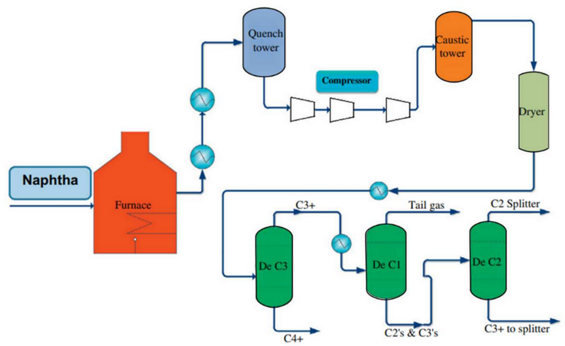

# Steam Cracking (Olefin Production)

> **Node ID**: petroleum.petrochemicals.steam-cracking
> **Domain**: [Petroleum](./index.md)
> **Dependencies**: See prerequisites
> **Enables**: [`Petrochemical Feedstocks`](petrochemicals.md)
> **Timeline**: Years 25-50+
> **Outputs**: ethylene, propylene, butadiene, pyrolysis_gasoline
> **Critical**: No

## Overview

> *Image: Gholami, Z., Gholami, F., Tišler, Z., &amp; Vakili, M., CC BY-SA 4.0*

Naphtha or ethane mixed with steam and heated to 750-900°C in tubular furnace for 0.1-0.5 seconds residence time. Free-radical cracking produces ethylene (30-84% yield depending on feedstock) and propylene. Cryogenic separation train yields polymer-grade ethylene (99.9%) and propylene (99.5%+).

Steam cracking is the primary route to light olefins, the building blocks of the petrochemical industry. Ethylene feeds polyethylene production (the highest-volume plastic), ethylene oxide, ethylene glycol, and vinyl chloride. Propylene feeds polypropylene, acrylonitrile, and propylene oxide. Butadiene is the precursor for synthetic rubbers. The steam cracker is thus the foundational unit of any petrochemical complex.

Feedstock choice significantly affects product distribution. Ethane feedstock, available from natural gas processing, yields the highest ethylene selectivity (80-84%). Naphtha, derived from crude oil distillation, produces a broader slate including propylene (13-18%), butadiene (4-5%), and aromatics. Heavier feeds like gas oil produce even more diverse product slates but with lower overall olefin yields and more rapid furnace fouling from coke deposition.

Steam cracking technology emerged in the mid-20th century as demand for plastics and synthetic materials created a market for large volumes of ethylene and propylene that could not be economically supplied from refinery byproduct streams alone. The first commercial steam cracker for ethylene production was commissioned by Union Carbide in the 1940s, and the technology has since scaled to world-scale plants producing over 1 million tonnes of ethylene per year.

Primary outputs: `ethylene`, `propylene`, `butadiene`, `pyrolysis_gasoline`.

The pyrolysis gasoline co-product is a mixture of aromatics and diolefins that requires hydrogenation before blending into the gasoline pool or further processing for aromatic extraction. Butadiene extraction from the C4 fraction provides the monomer for synthetic rubber production, a material with broad industrial applications from tires to seals to vibration isolation mounts.

The cracked gas composition at the furnace outlet is the primary determinant of plant economics. For naphtha feed at 820°C COT, a typical cracked gas yield (weight percent of feed) is: ethylene 30-33%, propylene 13-16%, butadiene 4-5%, aromatics (BTX) 8-10%, fuel oil 3-5%, fuel gas (methane + hydrogen + ethane) 20-25%. The ethylene yield is the primary economic output, and every degree of COT or fraction of a second of residence time is optimized to maximize ethylene while keeping coke formation manageable.

The furnace design must balance competing objectives: high heat flux for rapid cracking, uniform temperature distribution across all parallel coils, and minimum residence time for selectivity. A modern furnace has 4-16 parallel coil passes, each receiving identical feed flow and heat input. Any imbalance between passes causes some coils to produce more coke than others, forcing the entire furnace off-line for decoke when the worst-pass pressure drop reaches the limit. Flow balancing orifices in the feed manifold and individual pass temperature monitoring are used to maintain uniform operation across all passes.

The decoking procedure is a carefully controlled operation. After stopping feed flow, steam is introduced to purge hydrocarbons from the coils. Air is then gradually added to the steam, and the air-steam mixture burns the coke layer off the tube walls. The burn rate must be controlled to prevent localized overheating that would damage the tube metallurgy. The entire decoke cycle takes 24-48 hours, after which the furnace is ready to return to cracking service. Modern furnaces are designed for quick decoke turnaround to maximize annual production.

## Prerequisites

### Materials

- Naphtha or ethane feedstock (ethane from natural gas processing; naphtha from crude distillation)
- Steam for dilution (high-pressure steam, typically 0.3-0.5 kg steam per kg hydrocarbon feed)
- Hydrogen for acetylene hydrogenation (selective removal of acetylene impurity from ethylene product)
- Alloy steel furnace tubes (HK-40, HP-modified, or 35Cr-45Ni micro-alloyed grades) resistant to 1,100°C tube metal temperature and carburization

### Equipment

- Cracking furnace with radiant section (alloy coil tubes inside a refractory-lined firebox) and convection section (finned tubes for feed preheat and steam superheating)
- Transfer line exchanger (TLE) for rapid quench of cracked gas from 850°C to 350-600°C in less than 0.1 seconds, generating high-pressure steam as a byproduct
- Cracked gas compressor (multi-stage centrifugal, typically 4-5 stages compressing from near-atmospheric to 35-40 bar)
- Cold separation train: demethanizer, deethanizer, depropanizer, debutanizer columns operating at cryogenic temperatures (-170°C to -30°C)
- Cascaded refrigeration system using ethylene and propylene refrigerants to achieve the low temperatures required for fractionation

### Knowledge

- Free-radical cracking kinetics: understanding how coil outlet temperature, residence time, and hydrocarbon partial pressure control the product distribution among ethylene, propylene, butadiene, aromatics, fuel oil, and fuel gas
- Cryogenic separation principles: cascaded refrigeration cycles, Joule-Thomson expansion, and column operation at temperatures where methane and ethylene have similar relative volatilities
- Furnace metallurgy and coking: recognizing the relationship between tube metal temperature, coke deposition rate, and tube carburization that limits tube life
- Acetylene hydrogenation catalyst management: selective hydrogenation removes trace acetylene from ethylene without hydrogenating ethylene to ethane, a narrow operating window controlled by catalyst temperature and hydrogen partial pressure

### Infrastructure

- Feedstock storage: naphtha tanks (floating roof) or ethane storage bullets (refrigerated or pressurized)
- Product storage spheres for pressurized ethylene and propylene (refrigerated at -104°C and -48°C respectively, or stored pressurized at ambient temperature)
- Cooling water system for compressor intercoolers and condensers
- Fuel gas system: methane and hydrogen byproducts from the separation train fuel the cracking furnaces, providing much of the plant's energy requirement
- Steam system: high-pressure steam generated in TLEs drives turbine-driven compressors; medium and low-pressure steam serves process heating needs

## Process Description

### Step-by-Step Procedure

1. **Feed preheat and mixing**: Preheat the hydrocarbon feedstock (ethane to 500°C, naphtha to 550°C) in the convection section of the furnace. Mix with dilution steam (0.3-0.5 kg steam per kg feed). The steam reduces hydrocarbon partial pressure, favoring olefin formation and suppressing coke deposition.
2. **Radiant section cracking**: The steam-hydrocarbon mixture enters the radiant section alloy coils. Burners fire along the coil path, heating the process fluid to the target coil outlet temperature (COT): 840-860°C for ethane, 800-840°C for naphtha. Residence time in the radiant coils is 0.1-0.5 seconds. Free-radical chain reactions break C-C bonds, producing smaller olefins.
3. **Rapid quench**: The cracked gas exits the furnace and enters the transfer line exchanger (TLE), where it is cooled from 850°C to 350-600°C in under 0.1 seconds. This rapid quench freezes the reaction, preventing secondary cracking and recombination reactions that would reduce ethylene yield. The recovered heat generates high-pressure steam (up to 120 bar).
4. **Compression**: The cracked gas is compressed from near-atmospheric pressure to 35-40 bar through 4-5 centrifugal compressor stages with interstage cooling and condensate knockout. Acid gas (CO₂, H₂S) is removed by amine washing between compression stages.
5. **Drying and chilling**: The compressed gas is dried over molecular sieves to prevent ice and hydrate formation in the cold section. It is then progressively chilled through heat exchange with cold product streams and the refrigeration system.
6. **Cryogenic separation**: The chilled gas enters the demethanizer, which separates methane and hydrogen (overhead, used as fuel gas) from the C2+ fraction. The deethanizer separates ethylene (polymer-grade, 99.9% purity) from the C3+ fraction. The depropanizer yields propylene product. The debutanizer recovers butadiene and pyrolysis gasoline. Each column operates at temperatures determined by the product boiling points under the system pressure.

### Process Parameters

| Parameter | Range | Notes |
|-----------|-------|-------|
| Coil outlet temperature (COT) | 800-860°C | Higher for ethane, lower for naphtha; severity control |
| Steam-to-hydrocarbon ratio | 0.3-0.5:1 (weight) | Higher for heavier feeds; reduces coking |
| Residence time in radiant coils | 0.1-0.5 seconds | Shorter = higher selectivity to ethylene |
| Cracked gas compressor discharge | 35-40 bar | Sets cold section operating pressure |
| Demethanizer overhead temperature | -170°C to -140°C | Lowest temperature in the plant |
| Furnace run length between decokes | 30-100 days | Depends on feed and severity |

### Product Yields by Feedstock

Feedstock choice is the single largest determinant of plant economics. Ethane yields the most ethylene per ton of feed but produces little else of value. Naphtha yields less ethylene but generates a broader slate of co-products that contribute to revenue. The yield differences are large enough that feedstock selection determines whether a plant is profitable.

**Steam cracking yields (wt% of feed)**:

| Product | Ethane Feed | Propane Feed | Naphtha Feed | Gas Oil Feed |
|---------|------------|-------------|-------------|-------------|
| Ethylene | 80-84% | 40-45% | 30-35% | 24-28% |
| Propylene | 1-2% | 15-20% | 13-18% | 12-15% |
| Butadiene (C₄=) | 1-2% | 2-3% | 4-5% | 4-5% |
| BTX aromatics | 0.5-1% | 3-5% | 8-10% | 8-10% |
| Pyrolysis gasoline (C₅+) | 1-3% | 5-10% | 18-25% | 15-20% |
| Fuel gas (H₂ + C₁-C₂) | 10-15% | 20-25% | 15-20% | 12-15% |
| Fuel oil | 0-1% | 1-3% | 3-5% | 15-25% |

**Typical cracking conditions by feedstock**:

| Parameter | Ethane | Propane | Naphtha | Gas Oil |
|-----------|--------|---------|---------|---------|
| Coil outlet temperature (COT) | 840-860°C | 830-850°C | 800-840°C | 780-820°C |
| Steam/hydrocarbon ratio (wt/wt) | 0.3-0.4 | 0.35-0.45 | 0.45-0.55 | 0.6-0.8 |
| Residence time (seconds) | 0.15-0.3 | 0.2-0.35 | 0.2-0.5 | 0.2-0.5 |
| Typical run length (days) | 60-100 | 50-80 | 40-70 | 30-50 |

Heavier feeds require more steam dilution to suppress coke formation, but even with higher dilution they still produce coke faster, shortening the furnace run length between decoking cycles. This is the fundamental tradeoff: heavier feeds yield a more diverse (and sometimes more valuable) product slate, but at the cost of more frequent furnace downtime for decoking.

### Furnace Coil Specifications

The radiant coil tubes operate at the most severe conditions in the petrochemical industry: internal process fluid at 800-860°C, external firebox temperature at 1,050-1,100°C, and constant exposure to carburizing gases. Tube metallurgy determines furnace life.

| Alloy Grade | Composition | Max Tube Metal Temp | Typical Coil Life |
|-------------|------------|--------------------|--------------------|
| HK-40 | 25Cr-20Ni | 1,050°C | 2-3 years |
| HP-modified | 25Cr-35Ni + Nb | 1,100°C | 4-6 years |
| 35Cr-45Ni micro-alloyed | 35Cr-45Ni + Nb/Ti/W | 1,100-1,150°C | 6-10 years |

Tube inner diameter: typically 50-100 mm. Wall thickness: 8-15 mm. Coil length: 30-80 m per pass. A furnace with 8 parallel passes contains roughly 240-640 m of radiant coil tubing. Carburization (carbon absorption into the tube wall metal) causes the tube to become brittle and reduces creep life. When tube diameter expands by 3-5% from creep elongation, the coil must be replaced.

The steam-to-hydrocarbon ratio in the furnace feed affects both yield and coking rate. Higher steam dilution reduces hydrocarbon partial pressure, favoring olefin formation and reducing coke deposition on tube walls, but at the cost of increased energy consumption to heat the additional steam. The optimal ratio balances product yield, furnace run length between decoking cycles, and total energy consumption per ton of ethylene produced.

## Safety Considerations

- **Furnace tube rupture**: Tubes in the radiant section operate at the highest temperatures in the petrochemical industry. Tube ruptures release hydrocarbons directly into the furnace firebox, causing fires that can propagate to the convection section. Tube metal temperature monitoring with infrared pyrometry, combined with strict limits on COT and feed rate, prevents overheating. A tube failure requires immediate fuel trip and steam purge.
- **Cracked gas compressor seal failure**: The compressor handles large volumes of flammable gas at multiple pressure stages. Seal failures release gas to atmosphere, creating fire and explosion risk. Seal oil systems with backup pumps and automatic isolation valves mitigate this hazard.
- **Cold embrittlement**: The cryogenic separation train operates at temperatures down to -170°C. Carbon steel becomes brittle and fractures catastrophically at these temperatures. Only properly rated 9% nickel steel, austenitic stainless steel, or aluminum alloys may be used in cold service. Strict material verification during construction prevents accidental carbon steel substitution.
- **Pressurized ethylene/propylene storage**: Stored as pressurized liquids that flash to large volumes of flammable gas on release. Ethylene storage at -104°C, propylene at -48°C. Storage spheres are equipped with fireproofing, water spray systems, and remote emergency shutdown valves. BLEVE (boiling liquid expanding vapor explosion) is the catastrophic failure mode if a storage sphere is engulfed in fire and the pressure relief system cannot keep up: the sphere ruptures and the released liquid flashes to vapor, creating a fireball hundreds of meters in diameter.
- **Benzene exposure in pyrolysis gasoline**: Pyrolysis gasoline contains 30-50% aromatics including 5-15% benzene. Benzene is a confirmed human carcinogen. OSHA PEL: 1 ppm TWA, 5 ppm STEL. NIOSH REL: 0.1 ppm TWA. Raw pyrolysis gasoline must be hydrogenated before storage because the unstable diolefins polymerize into gums. Handle with enclosed systems and chemical-resistant gloves. Do not sample pyrolysis gasoline without respiratory protection.
- **Fire prevention**: The steam cracker has the largest hydrocarbon inventory in a petrochemical complex. Furnace feed preheat systems, the cracked gas compressor, and the cold separation train all contain flammable materials at elevated pressure. Firewater deluge coverage must extend to all hydrocarbon-containing equipment. The plant flare system must handle emergency blowdown from all furnaces, the cracked gas compressor, and product storage simultaneously. Gas detection (catalytic bead or infrared) is installed around the compressor deck, furnace area, and storage spheres with automatic shutdown triggers at 25% LEL (lower explosive limit).

### Personal Protective Equipment

- Flame-resistant clothing for all personnel in the furnace and compressor areas
- Insulated gloves and face shield when sampling from process taps
- Cold-weather PPE (insulated gloves, face protection) for work in the cold separation area
- Hard hat, safety glasses, and steel-toe boots for all plant areas
- Hearing protection near compressors and furnaces (exceeds 85 dBA)

### Emergency Procedures

- Maintain emergency steam purge capability on furnace feed lines for immediate fire suppression on tube rupture
- Verify fire water spray systems on all product storage spheres on weekly test
- Furnace fire: trip fuel supply, close feed isolation valves, purge with steam, do not attempt to extinguish a feed-fed fire without isolating the source
- Compressor seal leak: automatic isolation valves should close on high gas detection reading; operators verify isolation and start emergency ventilation
- Cold box leak: evacuate the area immediately. Cryogenic liquid spills embrittle surrounding steel structures and create oxygen-deficient atmospheres from condensation of ambient air.

## Quality Control

### Acceptance Criteria

- **Ethylene**: Polymer-grade purity 99.9% minimum; acetylene below 1 ppm; methane below 0.1%
- **Propylene**: Polymer-grade 99.5%+ or chemical-grade 92-95%; methylacetylene and propadiene below 5 ppm
- **Butadiene**: Minimum 99.5% for rubber production; vinyl acetylene below 50 ppm
- **Pyrolysis gasoline**: Stabilized (light ends removed) and hydrogenated before use as gasoline blend stock or aromatics extraction feed

### Testing Methods

- Gas chromatography analysis of cracked gas composition at the furnace outlet (online analyzers for real-time yield monitoring)
- Polymer-grade purity verification for ethylene and propylene by GC with FID detector, every 4 hours
- Furnace tube wall temperature monitoring via infrared pyrometry during operation; rising tube temperature profile signals coke buildup
- Acetylene converter catalyst activity check by monitoring acetylene slip in ethylene product
- Refrigeration compressor performance monitoring: suction and discharge pressures and temperatures to verify refrigeration capacity

### Sampling Protocol

- Monitor furnace coil outlet temperature for each pass for uniformity — variation greater than 5°C between parallel passes indicates fouling or burner imbalance
- Track cracked gas compressor suction pressure as a system health indicator — rising suction pressure suggests fouling in the chillers or a compressor performance issue
- Sample ethylene product every 4 hours for GC analysis; any acetylene above specification triggers a converter catalyst check
- Track furnace run length and COT trend; schedule decoke when tube metal temperature approaches the limit or pressure drop across the coils increases by 0.5 bar above baseline
- Monitor TLE outlet temperature — rising temperature signals coke fouling in the TLE tubes

## Scaling Notes

The cracking furnace is the heart of the plant, and its design is the primary constraint on plant economics. A world-scale cracker has 8-12 furnaces, each processing 30,000-60,000 tonnes per year of feedstock. Tubes in the radiant section must withstand both the process temperature (850°C internal) and the firebox temperature (1,100°C external) while maintaining heat transfer. Coke deposition on tube inner surfaces gradually increases tube metal temperature and pressure drop, eventually requiring a decoking cycle.

Decoking involves stopping feed flow, introducing steam and air into the coils, and burning off the coke layer at controlled rates. The decoke cycle takes 24-48 hours, during which the furnace is offline. Furnace run length between decokes (30-100 days depending on feed and severity) determines on-stream time and thus annual production. Shorter run lengths from heavy feeds or high severity directly reduce annual ethylene output.

The cryogenic separation train downstream of the furnace is the other major capital component. Compressing the cracked gas to 35-40 bar, then chilling it through multiple refrigeration stages using ethylene and propylene refrigerants, separates the product fractions by boiling point. The compressor that circulates cracked gas through the separation train is typically the largest rotating equipment in the complex, consuming a substantial fraction of the plant's total energy input, often 30-40 MW for a world-scale plant.

Achieving polymer-grade purity requires tight control of column operating conditions and removal of acetylene and methylacetylene contaminants through selective hydrogenation over palladium-based catalyst. The hydrogenation reaction is exothermic and temperature-sensitive: too cold and acetylene passes through; too hot and ethylene is hydrogenated to ethane, losing product.

The TLE (transfer line exchanger), also called a waste heat boiler, is a shell-and-tube exchanger that quenches the cracked gas from 850°C to 350-600°C. Boiler feedwater on the shell side absorbs the heat and generates high-pressure steam (up to 120 bar). Coke deposits inside the TLE tubes reduce heat transfer and raise the outlet temperature, which allows secondary reactions to degrade ethylene yield. TLE cleaning, performed during furnace decoke cycles, requires mechanical or hydraulic methods to remove the hard coke layer from the tube internals.

Furnace coil metallurgy has evolved significantly to withstand the extreme operating conditions. Early coils of cast HK-40 (25Cr-20Ni) steel would carburize and fail after 2-3 years of service. Modern micro-alloyed HP grades (35Cr-45Ni with additions of niobium, titanium, and tungsten) resist carburization and creep for 6-10 years. When a coil reaches its creep life limit, tube diameter expands (creep elongation) and the coil must be replaced, a major maintenance event costing millions of dollars per furnace.

## Troubleshooting

| Problem | Probable Cause | Solution |
|---------|---------------|----------|
| Short furnace run length (rapid coking) | Excessive severity, heavy feed, or low steam dilution | Reduce COT; increase steam-to-feed ratio; switch to lighter feedstock if available |
| Acetylene in ethylene product | Acetylene converter catalyst deactivated or temperature too low | Check converter catalyst temperature; adjust hydrogen addition rate; replace catalyst if CO poisoning is suspected |
| High fuel gas consumption | Inefficient heat recovery in convection section or fouled TLEs | Clean TLE tubes; optimize convection coil arrangement; check for flue gas bypass |
| Ethylene purity below spec | Demethanizer or deethanizer column flooding or temperature drift | Check column pressure and temperature profile; verify reflux ratio; inspect for tray damage or flooding |
| Compressor vibration rising | Fouling on impeller wheels from polymer deposits or mechanical wear | Schedule online washing with solvent; if persistent, plan shutdown for mechanical inspection |
| TLE outlet temperature rising | Coke fouling inside TLE tubes reducing heat transfer | Schedule TLE mechanical cleaning during next furnace decoke; verify water/steam side pressure |
| Ethylene yield declining across furnaces | Aging furnace coils with reduced heat transfer or uneven burner firing | Inspect coil condition with infrared scan; clean or replace burners; evaluate coil replacement schedule |
| High pressure drop across cold section | Chiller fouling or hydrate formation from inadequate drying | Regenerate molecular sieve dryers; check for liquid carryover from compressor knockout drums |
| Green oil formation in acetylene converter | Polymerization of acetylene on catalyst at excessive temperature | Reduce converter inlet temperature; check CO moderator concentration; replace catalyst if green oil fouling is severe |
| Uneven COT across parallel furnace passes | Plugged feed orifices, unbalanced burner firing, or pass-specific coke buildup | Check and clean flow balancing orifices in feed manifold; adjust individual burner fuel rates; monitor pass-by-pass COT; if one pass shows higher pressure drop, schedule early decoke for that pass |
| Demethanizer reflux temperature drifting high | Loss of ethylene refrigeration capacity or warm end approach fouled | Check ethylene refrigerant compressor suction and discharge pressures; inspect demethanizer condenser for fouling; verify refrigerant inventory |
| Rapid TLE fouling (outlet temp rising faster than normal) | Heavy feed with high aromatic content producing excessive coke in TLE | Reduce severity (lower COT); increase steam dilution; blend feed with lighter stock; schedule more frequent TLE mechanical cleaning |
| Cracked gas compressor surge | Compressor operating point moving left of the surge line due to reduced flow or increased discharge pressure | Open anti-surge recycle valve; check for downstream fouling causing pressure increase; verify all compressor stages are within operating range; do not operate near surge during startup without active anti-surge control |
| Ethylene product contamination with ethane | Deethanizer reboiler temperature too high or reflux too low | Reduce deethanizer reboiler duty; increase reflux ratio; check column pressure (higher pressure narrows relative volatility between ethylene and ethane) |

## Variations and Alternatives

- **Ethane cracking**: Using ethane from natural gas processing as feedstock dramatically simplifies the operation and improves ethylene yield to 80-84% (versus 30-35% from naphtha). Regions with abundant natural gas have a significant cost advantage. The methane co-product fuels the furnace, reducing external energy needs.
- **Propane/butane cracking**: Intermediate between ethane and naphtha in yield structure and complexity. Often used where LPG is available at low cost from gas processing operations. Propylene yields from propane cracking can reach 15-20%, making it attractive when propylene demand is high relative to ethylene.
- **Methanol-to-olefins (MTO)**: Converting natural gas to methanol, then to olefins over zeolite catalyst (SAPO-34 or ZSM-5). Avoids the need for naphtha or ethane feedstock entirely, enabling olefin production from stranded natural gas reserves. Higher capital cost but competitive where gas is cheap and liquid feedstocks are expensive. Commercial MTO plants have operated in China since 2010.

Olefins can also be produced from ethane recovered at natural gas processing plants. This integration of feedstock supply, byproduct fuel utilization, and product separation is characteristic of efficient petrochemical complex design. A modern integrated complex may produce ethylene, polyethylene, ethylene glycol, polypropylene, and other derivatives on a single site, minimizing transportation costs and maximizing the value extracted from each barrel of feedstock.

Steam cracker economics are highly sensitive to the spread between feedstock cost and product prices, known as the cracking margin. When feedstock prices rise faster than product prices, margins compress and marginal producers may curtail production. This cyclicality drives investment toward integrated complexes with flexible feed capability and downstream derivative units that capture additional value.

The capital cost of a world-scale steam cracker, including furnaces, compressors, separation train, storage, and utilities, runs into billions of dollars, making it one of the largest single investments in the chemical industry. Economic viability depends on sustained demand for olefins at prices that cover feedstock, energy, and capital recovery costs over a 20-30 year plant life.

Olefins can also be produced from ethane recovered at natural gas processing plants. This integration of feedstock supply, byproduct fuel utilization, and product separation is characteristic of efficient petrochemical complex design. A modern integrated complex may produce ethylene, polyethylene, ethylene glycol, polypropylene, and other derivatives on a single site, minimizing transportation costs and maximizing the value extracted from each ton of feedstock.

The separation train following steam cracking is one of the most energy-intensive refrigeration systems in the chemical industry. Achieving the very low temperatures needed to condense and separate ethylene from methane and hydrogen requires cascaded refrigeration cycles using ethylene and propylene as refrigerants. The compressor that circulates cracked gas through the separation train is typically the largest rotating equipment in the entire complex, consuming 30-40 MW for a world-scale plant.

Acetylene removal from the ethylene product stream is essential because even trace acetylene (above 1 ppm) poisons the catalyst used in polyethylene production. The acetylene converter uses a palladium-based catalyst that selectively hydrogenates acetylene to ethylene without significantly hydrogenating ethylene to ethane. This narrow selectivity window requires precise control of catalyst temperature, hydrogen partial pressure, and carbon monoxide moderator concentration. CO is deliberately added in ppm quantities to poison the catalyst just enough to prevent ethylene hydrogenation while still converting acetylene.

The methane and hydrogen separated in the demethanizer overhead become the plant's fuel gas, supplying the majority of the furnace fuel requirement. This internal fuel generation makes the steam cracker largely self-sufficient in energy once operating, though supplemental fuel is needed during startup and when running at low severity. The hydrogen-rich fuel gas from an ethane cracker has a higher heating value than that from a naphtha cracker, reflecting the greater hydrogen content of the lighter feedstock.

## References

- [Petrochemical Feedstocks](petrochemicals.md) — parent capability
- [Petroleum Domain](./index.md) — domain overview and related capabilities
- [Petrochemical Feedstocks](petrochemicals.md) — downstream capability

### Material Handling

- Monitor naphtha feed storage tanks for water accumulation and biological growth (microbes produce acids that corrode storage tanks and contaminate the feed)
- Store polymer-grade ethylene and propylene spheres at design pressure, monitor for leak indications with combustible gas detectors around the sphere dike
- Handle fresh decoking catalyst and chemicals according to the safety data sheet; some catalyst materials are pyrophoric in air
- Filter all feedstock before furnace entry to remove particulates that accelerate coil fouling
- Segregate pyrolysis gasoline from other hydrocarbon streams until it has been hydrogenated; raw py-gas contains unstable diolefins that polymerize in storage, forming gums and deposits
- Track TLE outlet temperature trends to plan cleaning before coke buildup degrades ethylene yield
- Verify refrigerant inventories (ethylene and propylene) are adequate before starting the cold section after a shutdown

---
*Part of the [Bootciv Tech Tree](../index.md) · [Petroleum](./index.md) · [All Domains](../index.md)*
