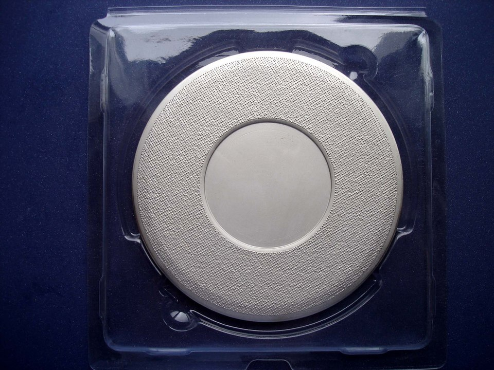
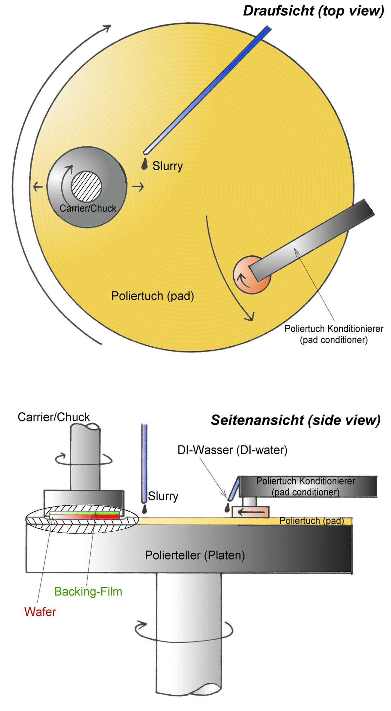

# Chemical Mechanical Planarization (CMP)

> **Node ID**: photolithography.fab-processes.cmp
> **Domain**: [Photolithography & IC Fabrication](./index.md)
> **Parent**: [Core Fab Processes](fab-processes.md)
> **Dependencies**: [`chemistry`](../chemistry/index.md), [`polymers`](../polymers/index.md), [`precision-motion`](../precision-motion/index.md), [`ultra-pure.upw`](../ultra-pure/upw.md)
> **Timeline**: Years 45-70
> **Outputs**: planarized_surfaces, tungsten_plugs, copper_damascene
> **Critical**: No — enables multi-level interconnect but single-layer ICs are possible without it

Chemical Mechanical Planarization (CMP) produces atomically flat surfaces by combining chemical dissolution with mechanical abrasion. A wafer is pressed face-down against a rotating polyurethane pad while abrasive slurry flows between them. The slurry chemistry softens the target material; the pad and slurry particles mechanically remove the reaction products. CMP is the enabling technology for multi-level metal interconnect in integrated circuits — without planarization, each successive deposited layer follows the topography of the layer beneath, accumulating steps that make photolithography impossible at feature sizes below a few microns.

## Process Principle

> *Pad conditioner (Chiaping model 108) for the chemical-mechanical polishing (CMP), which removes material from uneven topography on a wafer surface until a flat surface is created.*

> *Image: cpxmn, CC BY-SA 2.0*

> *Functional principle of Chemical-mechanical polishing*

> *Image: wisem, Public domain*

The Preston equation governs material removal: **RR = Kp × P × V**, where RR is removal rate (nm/min), Kp is the Preston coefficient (material- and slurry-dependent), P is downforce pressure (psi), and V is relative velocity between wafer and pad (m/min). Removal rate is linearly proportional to both pressure and velocity, allowing precise control by adjusting either parameter.

**Equipment configuration**:
- **Polishing platen**: 600-800 mm diameter cast aluminum or stainless steel disk, rotating at 30-80 RPM, surfaced with a polishing pad
- **Carrier head**: Holds wafer face-down against the pad, applies controlled downforce (2-7 psi), rotates at 20-60 RPM (typically counter-rotating to platen for uniform removal)
- **Slurry delivery**: Dispensed onto pad surface at 100-300 mL/min through a nozzle arm that sweeps across the pad
- **Pad conditioner**: Diamond-embedded disk (200-300 grit in nickel bond, 150-200 mm diameter) pressed against the pad surface periodically to regenerate pad texture

## Oxide CMP (SiO₂ Planarization)

Oxide CMP is the most common application, used to planarize inter-layer dielectric (ILD) between metal layers.

**Slurry composition**:
- **Abrasive**: Colloidal silica (SiO₂ particles, 20-100 nm diameter) at 10-30% solids by weight. Particle size distribution tightly controlled — larger particles cause scratches, smaller particles reduce removal rate
- **Chemistry**: KOH or ammonium hydroxide (NH₄OH) solution, pH 10-11. The alkaline environment softens the SiO₂ surface by forming a hydrated layer (silicic acid, Si(OH)₄) that the abrasive particles can mechanically remove
- **Stabilizer**: Small amounts of hydrogen peroxide (H₂O₂) or surfactants prevent particle agglomeration and control selectivity

**Process parameters and removal rates**:

| Parameter | Oxide CMP | Tungsten CMP | Copper CMP |
|---|---|---|---|
| Abrasive | Colloidal silica (20-100 nm) | Alumina Al₂O₃ (50-200 nm) | Colloidal silica (30-80 nm) |
| Chemistry | KOH/NH₄OH, pH 10-11 | Fe(NO₃)₃ or H₂O₂-based, pH 2-4 | Glycine + H₂O₂ + BTA, pH 3-5 |
| Removal rate | 100-300 nm/min | 200-400 nm/min | 200-500 nm/min |
| Downforce | 2-5 psi | 3-5 psi | 1-3 psi |
| Platen speed | 30-80 RPM | 30-60 RPM | 30-60 RPM |
| Selectivity to oxide | — | >10:1 (W:SiO₂) | >20:1 (Cu:SiO₂) |
| Selectivity to resist | 3-5:1 | 2-4:1 | 2-3:1 |

**Endpoint detection**: Motor current monitoring detects when the oxide layer clears (removal rate changes as underlying material is exposed). Optical endpoint uses interference fringes from the thinning oxide — the periodic reflectance signal corresponds to film thickness changes. Both methods provide ~10 nm accuracy in determining when to stop polishing.

## Tungsten CMP (W Plug Formation)

After tungsten CVD fills contact holes and vias, excess tungsten on the field areas must be removed to leave only the plugs in the holes.

**Slurry composition**:
- **Abrasive**: Alumina (Al₂O₃) particles, 50-200 nm diameter, at 3-10% solids
- **Oxidizer**: Iron(III) nitrate (Fe(NO₃)₃) or hydrogen peroxide (H₂O₂) at 1-5% concentration. The oxidizer converts tungsten to WO₃ or soluble tungstate species; the alumina abrasive then removes the oxide layer
- **pH**: 2-4 (acidic). Tungsten oxidizes rapidly in acidic oxidizer solutions

**Removal rates**: 200-400 nm/min for tungsten. Oxide removal during W CMP: <20 nm/min (selectivity >10:1). This high selectivity ensures the surrounding oxide is not significantly thinned while removing the excess tungsten.

## Copper CMP (Damascene Process)

Copper CMP enables the dual-damascene interconnect process used in modern ICs: copper is electroplated into patterned trenches and vias, then CMP removes the excess copper and barrier layer to leave copper lines embedded in the dielectric.

**Slurry composition**:
- **Abrasive**: Colloidal silica (30-80 nm), 5-15% solids
- **Oxidizer**: Hydrogen peroxide (H₂O₂) at 1-3%, forming CuO and Cu₂O on the surface
- **Complexing agent**: Glycine (NH₂CH₂COOH) at 0.1-1.0%, forms soluble copper-glycine complexes that dissolve the oxidized copper
- **Corrosion inhibitor**: Benzotriazole (BTA, C₆H₄N₃H) at 0.01-0.1%, adsorbs on copper surface to protect recessed areas from chemical dissolution (provides selectivity between raised and recessed features)

**Two-step process**: First step (bulk removal): aggressive slurry removes most copper at 300-500 nm/min. Second step (buff): mild slurry with higher BTA concentration removes the final copper and barrier layer (TaN/Ta) at 50-100 nm/min with minimal dishing of the copper lines.

## Polishing Pads

The polishing pad is as critical as the slurry in determining CMP performance. Pad properties control the pressure distribution, slurry transport, and mechanical abrasion characteristics.

**Pad materials and construction**:
- **Material**: Cast or sheet polyurethane — chosen for its controlled hardness, chemical resistance to alkaline and acidic slurries, and consistent mechanical properties over thousands of polishing cycles
- **Hardness**: Shore D 40-60 for oxide CMP pads, Shore D 50-70 for metal CMP pads. Softer pads conform better to wafer topography (better planarization); harder pads provide more uniform removal across the wafer (better within-wafer uniformity)
- **Construction**: Typical two-layer pad — top layer (1.0-1.5 mm cast polyurethane with engineered pores or grooves for slurry transport) bonded to a sub-pad (1-2 mm compressed felt or foam that provides compliance and absorbs wafer-level pressure variations)

**Pad conditioning**: The pad surface degrades during polishing — pores compress closed (glazing), and the surface texture smooths out. A diamond-conditioner disk is pressed against the rotating pad every 30-60 seconds during polishing (or continuously on a separate conditioning zone) to regenerate the surface texture. Without conditioning, removal rate drops 50-80% over 30 minutes. Pad lifetime: 500-2000 wafer polishings per pad before replacement.

**Groove patterns**: Pads are grooved (concentric circles, XY grid, or spiral patterns) to improve slurry distribution across the pad surface and carry away spent slurry and debris. Groove depth: 0.3-0.8 mm, width: 0.3-1.0 mm, pitch: 2-5 mm.

## Downforce and Rotation Mechanics

CMP removal uniformity depends on precise control of pressure distribution and relative velocity across the wafer surface.

**Pressure control**: The carrier head uses a pneumatic or electromagnetic system to apply uniform downforce across the wafer. Multi-zone carrier heads (3-5 independently controlled pressure zones) compensate for edge effects — the wafer edge naturally polishes faster due to higher relative velocity and pad deformation. Zone pressures are tuned to achieve <3% within-wafer non-uniformity (WIWNU).

**Rotation mechanics**: The relative velocity between wafer and pad is the product of platen rotation and carrier rotation. Counter-rotation (wafer rotates opposite to platen) maximizes relative velocity and improves removal uniformity. Retaining ring on the carrier head prevents the wafer from sliding out during rotation.

**Wafer backside pressure**: Some carrier heads apply controlled pressure to the wafer backside (behind the wafer) to compensate for wafer bow and warp, ensuring uniform contact pressure on the front (polishing) side.

## Endpoint Detection

Accurate endpoint detection prevents over-polishing (which thins underlying layers) and under-polishing (which leaves residual material).

**Motor current monitoring**: The spindle motor current changes measurably when the polishing interface transitions from one material to another (different friction coefficients). The current signal is filtered and compared to a model of expected behavior to detect the endpoint.

**Optical (reflectance) endpoint**: A laser or broadband light source illuminates the wafer through a window in the polishing pad. As the film thins, interference fringes cause periodic oscillations in the reflected light intensity. The endpoint corresponds to the final fringe pattern before the underlying layer is exposed. Accuracy: ±5-10 nm.

**In-situ film thickness**: Spectroscopic ellipsometry through a pad window measures remaining film thickness in real time. This is the most accurate method but requires specialized pad and carrier head designs.

## Post-CMP Cleaning

After polishing, wafers carry slurry particles, pad debris, chemical residues, and metallic contaminants that must be completely removed before further processing. A single slurry particle left on the wafer surface can cause a device-killing defect.

**Cleaning sequence**:
1. **PVA brush scrub**: Soft polyvinyl alcohol (PVA) brush rolls across the wafer surface under [ultra-pure water](../ultra-pure/upw.md) flow (UPW, 18.2 MΩ·cm). The PVA sponge lifts particles mechanically without scratching. Brush pressure: 50-200 g-force
2. **Dilute HF rinse**: 0.5% hydrofluoric acid for 30-60 seconds removes chemical residues (metal hydroxides, oxide slurry particles) and any native oxide contaminated with embedded particles. The brief HF dip does not significantly attack the underlying oxide film (<5 nm removal)
3. **Megasonic clean**: 800-2000 kHz acoustic energy in dilute SC-1 solution (NH₄OH:H₂O₂:H₂O at 1:1:50) at 50-60°C gently dislodges sub-micron particles from patterned features without damaging delicate structures
4. **[Ultra-pure water](../ultra-pure/upw.md) rinse**: Final rinse in UPW at 18.2 MΩ·cm resistivity to remove all chemical residues
5. **Spin dry or Marangoni dry**: Wafer spun at 2000-3000 RPM with N₂ blow, or slowly withdrawn from UPW through an IPA vapor zone (Marangoni effect pulls water off the surface)

**Particle targets**: <50 added particles ≥0.16 μm per wafer (200 mm) or <30 added particles ≥0.12 μm (300 mm). Metallic contamination after post-CMP clean: Fe, Cu, Ni each <5 × 10⁹ atoms/cm².

## Defects and Process Control

**Dishing**: Copper in wide features polishes faster than the surrounding oxide, creating a shallow dish (depression). Dishing depth: 20-100 nm for features >10 μm wide. Controlled by slurry selectivity, downforce, and over-polish time.

**Erosion**: The oxide between dense copper lines polishes away faster than in field areas, thinning the oxide. Controlled by selectivity optimization and reducing over-polish.

**Scratches**: Caused by slurry particle agglomerates (particles stuck together forming a larger, sharp-edged cluster), pad debris, or foreign particles. Prevention: slurry filtration (0.1-0.2 μm filters), pad conditioning, cleanroom environment.

**Within-wafer uniformity (WIWNU)**: Target <3% (1σ) thickness variation across the wafer. Controlled by multi-zone carrier head pressure, retainer ring adjustment, and slurry flow optimization.

**Wafer-to-wafer uniformity (WTWNU)**: Target <5% variation between wafers in a lot. Controlled by pad conditioning consistency, slurry delivery rate stability, and consumable life tracking.

## CMP for Wafer Polishing

CMP is also used during [wafer manufacturing](../silicon/wafering.md) to produce mirror-polished silicon substrates. Wafer-level CMP uses colloidal silica slurry on large polyurethane pads to achieve surface roughness <0.3 nm RMS. This application predates IC-level CMP by decades and establishes the fundamental process knowledge.

## Hazards & Safety

- **CMP slurries**: Alkaline oxide slurries (pH 10-11) cause skin and eye irritation on contact. Exposure limits: prolonged skin contact causes chemical burns; eye exposure requires immediate flushing for 15 minutes. Wear chemical-resistant nitrile gloves (double-gloved for slurry change), splash goggles, and chemical apron. Acidic metal CMP slurries (pH 2-4, containing H₂O₂ and Fe(NO₃)₃) are corrosive and oxidizing. Handle in ventilated wet benches with local exhaust. Slurry waste is classified hazardous: collect in labeled containers for neutralization and disposal. Never mix alkaline and acidic slurries in the same drain.
- **Dilute HF in post-CMP clean**: Even at 0.5% concentration, HF penetrates skin and binds calcium in tissue, causing deep tissue destruction with delayed pain. Calcium gluconate gel (2.5%) must be immediately available at the station — apply to any skin contact area and seek medical attention. Wear acid-resistant neoprene gloves (not nitrile alone), face shield, and acid apron. HF exposure symptoms may be delayed 1-8 hours; any suspected exposure requires medical evaluation regardless of immediate pain level. Spill protocol: absorb with calcium carbonate or commercial HF spill kit, never use generic absorbent.
- **Mechanical hazards**: CMP tools have rotating platens (30-80 RPM, 600-800 mm diameter) and carrier heads with pinch points. The platen carries enough rotational energy to cause severe injury. Interlocks must be maintained and tested monthly — the tool must not operate with any access panel open. Never reach into the polishing area during operation. Pad conditioning disks have exposed diamond abrasive; handle with cut-resistant gloves. The carrier head applies 2-7 psi downforce on a rotating surface; fingers caught between head and pad suffer crush and friction burns.
- **Hydrogen peroxide (H₂O₂)** in Cu CMP slurry: Concentrated H₂O₂ (30-50% stock, diluted to 1-3% in slurry) is a strong oxidizer. Contact with organic materials (gloves, clothing, paper) can cause fire. Store in vented containers; never return unused material to stock bottle. Decomposition releases O₂ gas — do not seal containers tightly. Wear chemical splash goggles and nitrile gloves when mixing.
- **Ergonomic hazards**: Slurry containers (20 L carboys, ~25 kg) require proper lifting technique. Pad replacement involves handling large (600-800 mm) polyurethane sheets — use two-person lift. Repetitive wafer cassette loading (25 wafers per cassette, dozens per shift) causes repetitive strain — use ergonomic cassette handlers where available.

## See Also

- [Core Fab Processes](fab-processes.md) — parent capability for all IC fabrication
- [Wafering](../silicon/wafering.md) — CMP used for initial wafer polishing
- [Ultra-Pure Water](../ultra-pure/upw.md) — essential for post-CMP cleaning
- [Cleanrooms](cleanrooms.md) — contamination-controlled processing environment
- [Advanced Processes](../vlsi-scaling/advanced-processes.md) — advanced node CMP challenges

## Troubleshooting

| Problem | Probable Cause | Solution |
|---------|---------------|----------|
| Dishing exceeds 50 nm on wide copper features (>10 μm) | Downforce too high for soft Cu in wide features; over-polish time too long; BTA concentration too low to protect recessed areas | Reduce downforce to 1-2 psi for Cu buff step; use two-step polish (bulk at 300-500 nm/min then buff at 50-100 nm/min); increase BTA to 0.05-0.1% in buff slurry |
| Erosion of oxide between dense copper lines | Oxide polish rate too high relative to Cu during over-polish; selectivity insufficient; dense pattern concentrates mechanical stress | Reduce over-polish time by tightening endpoint detection; use high-selectivity slurry (>20:1 Cu:SiO₂); adjust multi-zone head pressure to reduce edge-first erosion |
| Scratches visible on wafer surface after polish | Slurry particle agglomerates (>200 nm clusters); pad debris from worn pad; foreign particles from dirty slurry delivery | Filter slurry through 0.1-0.2 μm filters inline; replace pad when lifetime exceeds 500-2000 wafer cycles; flush slurry delivery lines daily; inspect pad conditioner diamond disk for wear |
| Within-wafer non-uniformity (WIWNU) exceeds 3% (1σ) | Edge-fast removal from higher relative velocity at wafer edge; pad not properly conditioned; retainer ring worn or misaligned | Apply multi-zone carrier head pressure (increase center zone, decrease edge zone); verify pad conditioning sweep covers full platen; replace retainer ring when contact surface shows uneven wear |
| Wafer-to-wafer thickness variation exceeds 5% | Pad surface condition changing between wafers (glazing); slurry flow rate drifting; consumable age not tracked | Implement in-situ pad conditioning between wafers; calibrate slurry flow meter weekly (target ±5 mL/min at 200 mL/min setpoint); track slurry batch age and pad wafer count in SPC charts |
| Endpoint detection triggers too early or too late | Motor current baseline drifted; optical window contaminated with slurry residue; interference fringe pattern misinterpreted for non-uniform film | Re-calibrate motor current baseline on bare wafer before each lot; clean optical viewport daily; use spectroscopic ellipsometry endpoint for films with unknown initial thickness |
| High particle count after post-CMP clean (>50 particles ≥0.16 μm) | PVA brush worn or contaminated; dilute HF concentration too low to dissolve embedded particles; megasonic power insufficient | Replace PVA brush every 200-500 wafers; verify dilute HF at 0.5% concentration (fresh mix every shift); check megasonic transducer output at 800-2000 kHz with power meter |
| Copper corrosion after CMP — darkened or pitted surface | BTA corrosion inhibitor absent or degraded in buff slurry; delay between CMP and post-clean too long; ambient moisture attacking exposed Cu | Maintain BTA at 0.01-0.1% in final polish step; transfer wafer to post-CMP clean within 5 minutes of polish completion; store polished wafers in N₂-purged container if immediate processing is not possible |
| Pad glazing — removal rate drops 50% over 30 minutes | Pad pores compressed shut from sustained downforce without adequate conditioning; conditioning disk worn flat | Increase conditioning frequency to every 30-60 seconds during polish; replace diamond conditioning disk when pad removal rate drops below 80% of qualified value; verify conditioning disk applies 2-5 psi downforce on pad |
| STI polish — nitride stopping layer partially removed | Oxide-to-nitride selectivity too low (<10:1); over-polish time excessive to clear dense array regions; slurry pH drifted from spec | Switch to high-selectivity STI slurry (>20:1 SiO₂:Si₃N₄); reduce over-polish by using optical endpoint tuned to nitride reflectance; verify slurry pH at 10-11 for oxide STI slurry before each lot |

## Scaling Notes

CMP scales from bench-top polishers to fully automated multi-platen production tools:

- **Bench-top scale** (1-5 wafers/day): Single-platen manual polisher with 200-300 mm diameter pad. Hand-loaded wafers held in a simple carrier. Slurry mixed in small batches (500 mL). Removal rate monitored by manual thickness measurement (microscope with focus-depth or mechanical profilometer). Adequate for R&D, process development, and small-batch wafer thinning.

- **Production scale** (50-200 wafers/day): Single-wafer rotary CMP tool with automated wafer handling, multi-zone carrier head, and in-situ endpoint detection (motor current or optical). 2-4 platens for sequential steps (bulk removal → buff → clean). Robotic wafer transfer from cassette to platen. Inline post-CMP clean station with PVA brush scrubber. This is the minimum scale for commercial IC fabrication.

- **High-volume scale** (1,000+ wafers/day): Multi-tool CMP bays with 4-8 polishers running in parallel. Automated slurry blending and distribution system (day tanks, DI water mixing, inline particle filtration to 0.1 μm). Real-time SPC monitoring of removal rate, uniformity, and defect density per wafer. Batch post-CMP clean with megasonic + spin-rinse-dry. This scale supports 100,000+ wafer starts per month in a modern fab.

**Critical consumables cost**: Slurry represents 30-50% of CMP cost of ownership. Colloidal silica slurry costs $50-150/gallon; ceria slurry $100-300/gallon. Pad lifetime is 500-2,000 wafers per pad ($200-500 each). Diamond conditioning disks last 50-100 hours ($150-300 each).

## Safety & Hazards

- **Chemical exposure**: CMP slurries are colloidal suspensions at pH 10-11 (silica) or pH 4-5 (some tungsten slurries). Skin contact causes irritation; eye contact can cause corneal abrasion from abrasive particles. Wear chemical splash goggles, nitrile gloves, and lab coat when handling slurry. Emergency eyewash station within 10 seconds travel.
- **Mechanical hazards**: Rotating platens (30-100 RPM) and carrier heads can pinch fingers. Never reach into the polishing area during operation. Interlocks must be functional — do not bypass safety interlocks on the polisher enclosure.
- **Ergonomic hazards**: Wafer cassettes (25 wafers) weigh 2-5 kg. Slurry containers weigh 10-20 kg (2-5 gallons). Use proper lifting technique; request assistance for containers over 15 kg.
- **Waste handling**: Spent slurry contains suspended metal particles (copper, tungsten) and silica. Collect in designated waste containers — do not pour down the drain. Copper-bearing waste must be treated as hazardous waste (heavy metal contamination). Dispose through certified chemical waste handler.

## Quality Control

| Parameter | Measurement Method | Target | Frequency |
|-----------|-------------------|--------|-----------|
| Removal rate (Å/min) | Pre/post thickness by ellipsometry or reflectometry | ±10% of qualified rate | Every wafer |
| Within-wafer uniformity (WIWNU) | 49-point thickness map | <3% (1σ) | Every wafer |
| Wafer-to-wafer uniformity (WTWNU) | Mean thickness per wafer across lot | <5% range | Every lot |
| Defect density (particles ≥0.16 μm) | Laser surface scanner (KLA Tencor) | <50 adders per wafer | Every wafer |
| Dishing (wide Cu features) | AFM or profilometer step height | <50 nm on 10-100 μm features | Sample 3 wafers/lot |
| Erosion (dense arrays) | SEM cross-section or profilometer | <30 nm oxide loss between lines | Sample 2 wafers/lot |
| Pad condition (removal rate trend) | SPC chart on removal rate vs. wafer count | Rate within 80-120% of initial qualified value | Continuous |
| Slurry particle size distribution | Dynamic light scattering (DLS) | Mean 40-80 nm, <1% >200 nm | Per batch |

Process qualification requires running a minimum of 25 wafers through the complete CMP + post-clean sequence and demonstrating that all parameters above meet specification with Cpk ≥1.33 (capability index). Any parameter change (new slurry lot, new pad, adjusted downforce) requires re-qualification with a reduced 10-wafer qualification lot.

## Variations and Alternatives

| CMP Type | Abrasive | Selectivity | Application |
|----------|----------|-------------|-------------|
| Oxide CMP | Colloidal silica (40-80 nm) | 1:1 SiO₂:SiO₂ (blanket) | ILD planarization, STI |
| Tungsten CMP | Alumina or silica + oxidizer (H₂O₂/FeNO₃) | 2:1 W:SiO₂ | Contact/via plug planarization |
| Copper CMP | Colloidal silica + oxidizer (H₂O₂) + BTA inhibitor | 20:1 Cu:SiO₂ (buff step) | Damascene Cu interconnect |
| Ceria CMP | Cerium oxide (50-200 nm) | >20:1 SiO₂:Si₃N₄ | STI with nitride stop |
| Poly-Si CMP | Silica + KOH electrolyte | 3:1 poly:SiO₂ | Poly gate planarization |

Electrochemical mechanical polishing (ECMP) applies voltage to the wafer during polish to enhance dissolution, reducing mechanical downforce and defectivity. Used for advanced copper nodes (<45 nm) where mechanical stress causes low-k dielectric damage.

[← Back to Photolithography](index.md)
