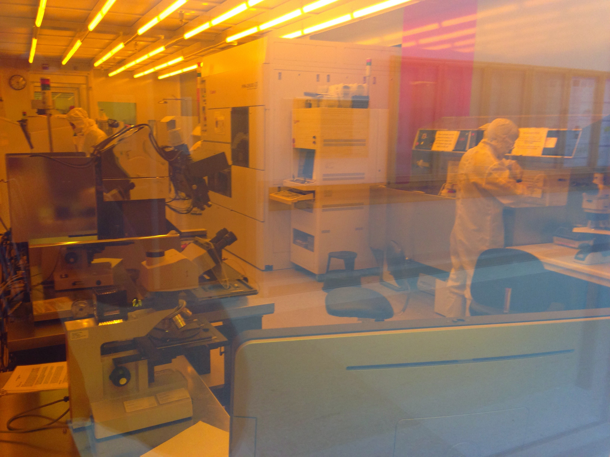
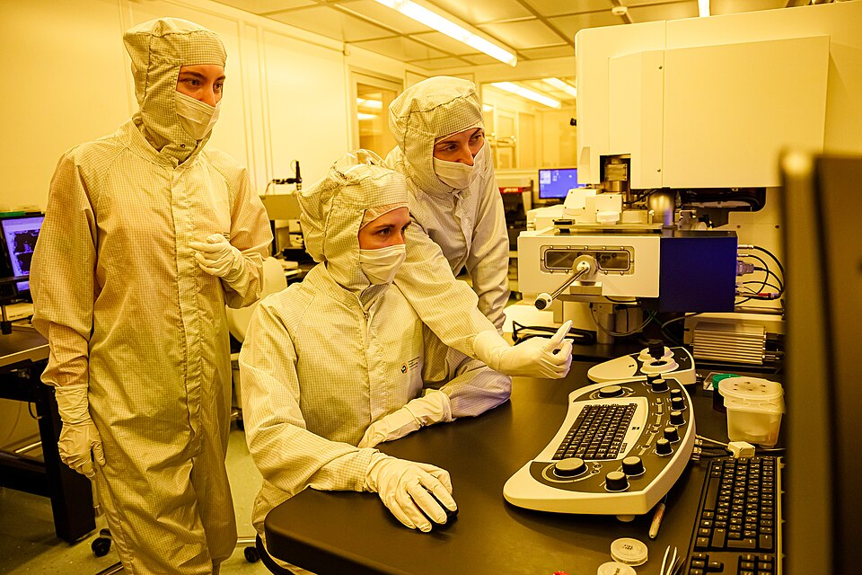
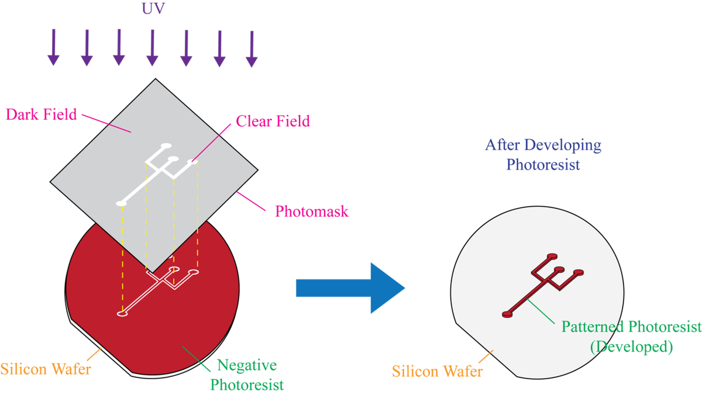
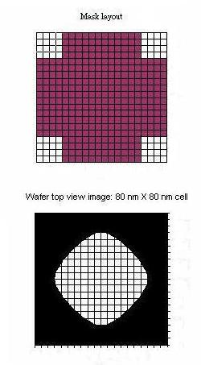
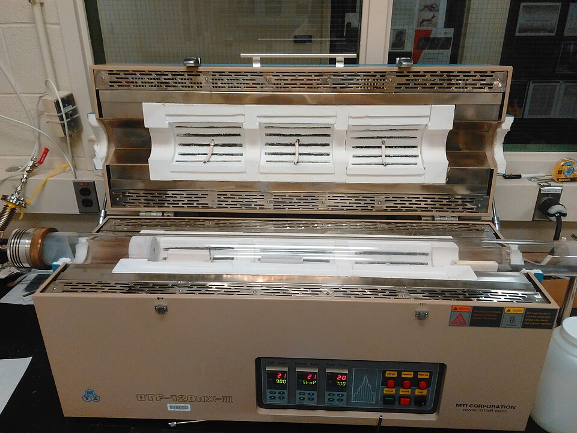
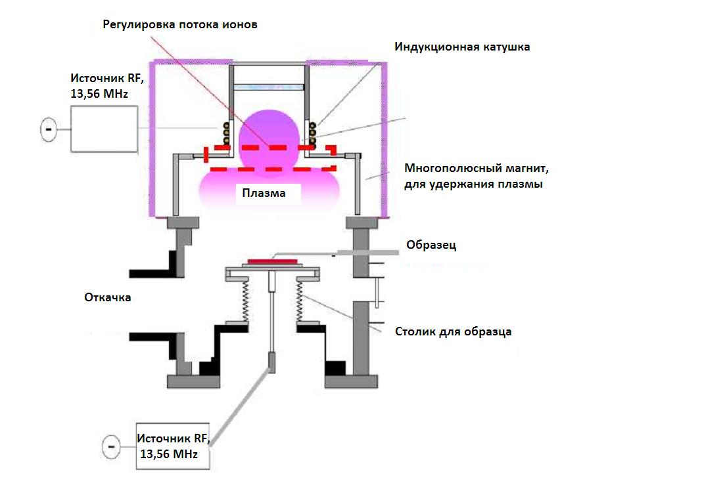
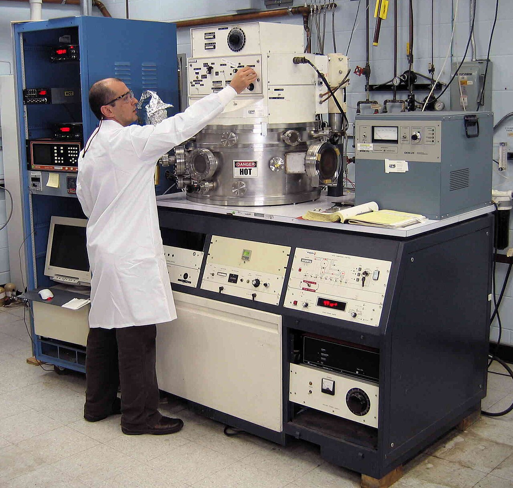
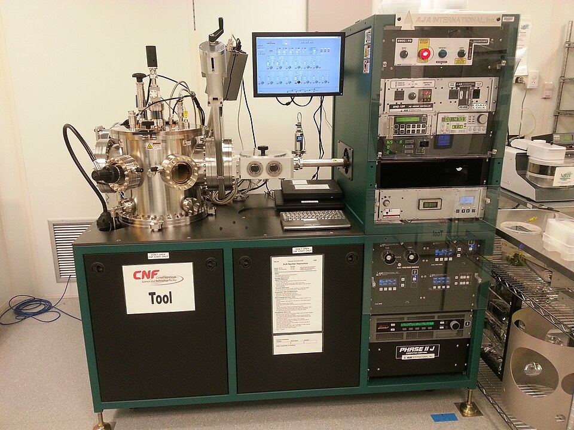
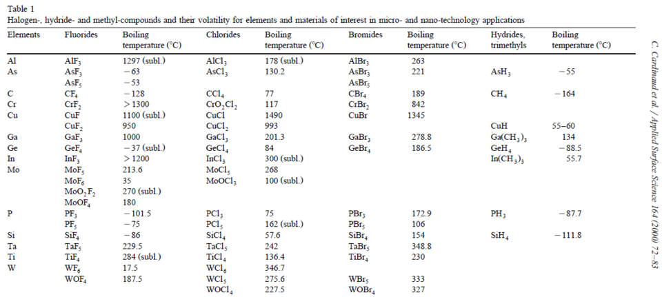

# Photolithography & IC Fabrication

> *Image: Runner1928, CC BY-SA 4.0*

> *Clean room lithography bay at the University of Minnesota Nanofabrication Center*

> *Image: Runner1928, CC BY-SA 4.0*

Capabilities in this domain:

> *Image: CleanroomKnowItAll, CC BY-SA 4.0*

- [Cleanrooms](cleanrooms.md) — Cleanroom construction (ISO 6-4, HEPA/ULPA filtration, laminar flow, positive pressure, gowning protocols), ultra-pure water systems (RO + DI + UV + membrane filtration to 18 MΩ·cm), and cleanroom consumables (garments, wipers, gloves).

> *Image: Jxg7516 at English Wikibooks, CC BY-SA 3.0*

- [Core Fab Processes](fab-processes.md) — Thermal oxidation (dry and wet), wet etching (HF for SiO₂, KOH for Si) and dry/plasma etching (RIE), CVD deposition (poly-Si, SiO₂, Si₃N₄), PVD (sputtering, evaporation), doping (diffusion and later ion implantation), metallization (Al, later Cu), and the planar process integration for IC fabrication.

> *Image: Guiding light at en.wikipedia / Later version(s) were uploaded by Oleg Alexandrov at en.wikipedia., CC BY-SA 3.0*

- [Photoresists, Masks & Lithography](resists-masks.md) — Photoresist progression from bitumen (100 μm+) to dichromated gelatin (10-50 μm) to novolac+DNQ (0.5-3 μm).

> *Image: Aksy88, CC BY-SA 4.0*

- **[Chemical Vapor Deposition](cvd.md)** — LPCVD, PECVD, and APCVD thin film deposition of poly-Si, SiO₂, Si₃N₄, and tungsten.

> *Image: sigmaaldrich, CC BY-SA 4.0*

- **[Physical Vapor Deposition](pvd.md)** — Sputtering (DC, RF, magnetron) and evaporation (thermal, e-beam) for metal and dielectric thin films.

> *Image: Guillaume Paumier (user:guillom), CC BY-SA 3.0*

- **[Ion Implantation](ion-implantation.md)** — Precise dopant introduction using high-energy ion beams with dose and energy control for junction engineering.

> *Image: cpxmn, CC BY-SA 2.0*

- **[Chemical Mechanical Planarization](cmp.md)** — Wafer surface planarization using slurry chemistry and mechanical polishing for multilevel metallization.

> *Image: Zas2000, CC BY-SA 3.0*

- **[Plasma Etching](plasma-etching.md)** — RIE, DRIE (Bosch process), and selective material removal using plasma-generated reactive species.

> *Image: Argonne National Laboratory, CC BY-SA 2.0*

- [CVD Reactor (Construction)](cvd-reactor.md) — Construction of LPCVD, PECVD, and APCVD reactor systems for thin film deposition in semiconductor fabrication.

> *Image: a13ean, CC BY-SA 3.0*

- [Sputtering System (Construction)](sputtering-system.md) — Construction of DC and RF magnetron sputtering systems for physical vapor deposition of thin films.

> *Image: Pepinpeterkapichler, CC BY-SA 4.0*

- [Plasma Etcher (Construction)](plasma-etcher.md) — Construction of reactive ion etching (RIE) and deep reactive ion etching (DRIE) systems for pattern transfer.

> *Image: Guillaume Paumier (user:guillom), CC BY-SA 3.0*

- [Ion Implanter (Construction)](ion-implanter.md) — Construction of medium-current and high-current ion implantation systems for semiconductor doping.

> *Image: a13ean, CC BY-SA 3.0*

- [Photolithography Stepper (Construction)](photolithography-stepper.md) — Construction of projection lithography systems for pattern transfer onto semiconductor wafers.
[↑ Back to Tech Tree](../../index.md)
