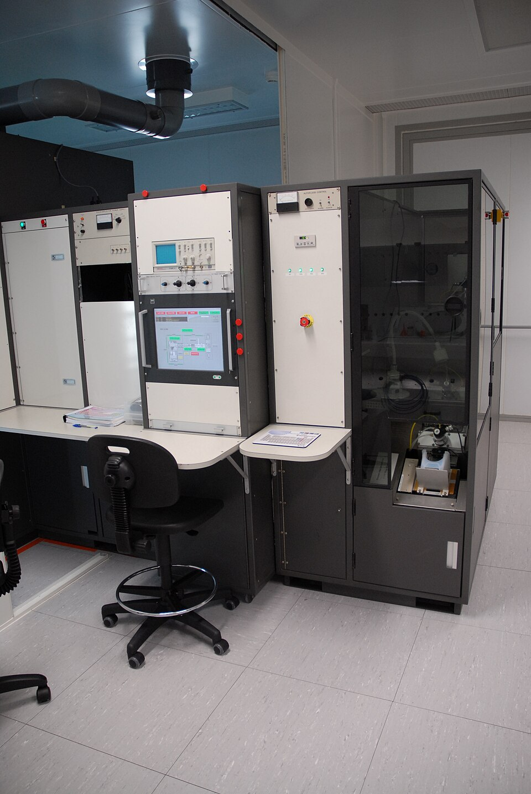

# Ion Implantation

> **Node ID**: photolithography.fab-processes.ion-implantation
> **Domain**: [Photolithography & IC Fabrication](./index.md)
> **Dependencies**: [`gas-handling`](../gas-handling/index.md), [`vacuum`](../vacuum/index.md), [`energy.electricity`](../energy/electricity.md)
> **Parent**: [`photolithography.fab-processes`](fab-processes.md)
> **Timeline**: Years 50-80
> **Outputs**: ion_implantation, doped_regions, doping_profiles
> **Critical**: No

Precision doping by accelerating ionized dopant species (B⁺, BF₂⁺, P⁺, As⁺) into silicon wafers using a particle accelerator chain: ion source, mass analyzer, acceleration column, and beam scanning system. Replaces thermal diffusion with independent control of dose (10¹¹ to 10¹⁶ ions/cm²) and junction depth (10 to 1000 nm via energy selection from 10 keV to several MeV). Requires high-voltage power, toxic dopant gas handling, and high-vacuum beam lines.

The four parameters that define every implant recipe are species, energy, dose, and beam current. Species selects the dopant type: boron for p-type, phosphorus or arsenic for n-type. Energy sets the penetration depth, ranging from a few keV for shallow source/drain extensions to several MeV for deep retrograde wells. Dose sets the dopant concentration, from 10¹¹ ions/cm² for threshold voltage tweaks to 10¹⁶ ions/cm² for low-resistance contact regions. Beam current sets throughput, measured in milliamps for high-current machines or microamps for precision medium-current tools.

After implantation the wafer must be annealed. The ion impacts displace silicon atoms from their lattice sites, leaving a damaged amorphous layer. Thermal annealing at 900–1100°C repairs the crystal damage by allowing silicon atoms to return to lattice sites, and it electrically activates the dopant by moving implanted atoms from interstitial positions onto substitutional lattice sites where they can donate carriers. These two processes, damage repair and dopant activation, compete with an undesirable third: dopant diffusion. The anneal strategy must maximize activation while minimizing the time at temperature, which drives the adoption of rapid thermal annealing (RTA) that heats the wafer to 1050°C for 10–30 seconds rather than the hours-long furnace soak that would broaden the junction beyond its intended depth.

## Implanter Architecture

> *Ion implantation machine front end at LAAS-CNRS technological facility in Toulouse, France.*

> *Image: Guillaume Paumier (user:guillom), CC BY-SA 3.0*

An ion implanter is a specialized particle accelerator with five main subsystems arranged in series along the beam path: ion source, mass-analyzing magnet, acceleration column, beam scanning system, and end station. The entire beam path from source to wafer runs under high vacuum (10⁻⁶ Torr or below). Residual gas molecules scatter the ion beam, degrading uniformity and causing energy contamination.

### Ion Source

The ion source ionizes a dopant gas and extracts positive ions. Two source types dominate:

| Source Type | Ionization Mechanism | Beam Current | Lifetime | Typical Gases |
|---|---|---|---|---|
| Freeman (hot filament) | Tungsten filament (2500°C) emits electrons; arc discharge at 50–100 V, 1–5 A ionizes gas | Up to 5 mA (B⁺), 10 mA (As⁺) | 50–100 hours per filament | BF₃, PH₃, AsH₃ |
| Bernas (indirectly heated cathode) | Enclosed cathode emits electrons into arc chamber; longer life than Freeman | Up to 10 mA | 100–200 hours per cathode | BF₃, PH₃, AsH₃ |
| RF plasma source | 13.56 MHz RF coil generates inductively coupled plasma around gas feed | Up to 30 mA (for high-current tools) | 200–500 hours (no filament to erode) | BF₃, PH₃, AsH₃, solid charge for Sb, In |

The source arc chamber is typically made of molybdenum or graphite (refractory, low sputtering yield). Gas feed enters at 0.1–10 sccm through a mass flow controller. The extraction electrode (at negative potential relative to the plasma) pulls positive ions out through a slit aperture, forming a ribbon beam or a focused spot depending on the aperture geometry. Extraction voltage: 20–40 kV for the initial beam energy before the main acceleration stage.

### Mass-Analyzing Magnet

The extracted beam contains all ionized species from the source gas, including molecular fragments and doubly-charged ions. The mass-analyzing magnet bends the beam through a curved flight tube (typically 60°–90° deflection angle), selecting only ions with the desired mass-to-charge ratio.

**Physics**: A magnetic field B perpendicular to the ion velocity v bends charged particles into a circular path with radius r given by:

**r = (1/B) × √(2mV/q)**

where m is the ion mass, V is the acceleration voltage, and q is the charge state. By setting the field strength, only the target species follows the correct radius to pass through the resolving aperture (a slit 2–10 mm wide at the magnet exit). Heavier or lighter species strike the chamber walls.

**Magnet specifications for production implanters**:
- Pole gap: 30–60 mm (must accommodate the beam envelope with margin)
- Field strength: 0.1–1.0 Tesla, electromagnet with NMR or Hall-effect sensor feedback for 0.01% stability
- Resolving power (m/Δm): 50–100 sufficient to separate B⁺ (mass 11) from C⁺ (mass 12) and BF₂⁺ (mass 49) from ⁵⁰Ti⁺ (mass 50)
- Flight tube: stainless steel, electropolished inner surface, water-cooled walls to dissipate power from deflected ions

**Species separation examples**:
- B⁺ (mass 11) vs. C⁺ (mass 12): requires m/Δm ≥ 11
- BF₂⁺ (mass 49) vs. ⁵⁰Ti⁺ (mass 50): requires m/Δm ≥ 49
- ⁷⁵As⁺ (mass 75) vs. ³⁷Cl₂⁺ (mass 74): requires m/Δm ≥ 37 — doubly-charged contamination from chlorine-bearing source components

Doubly-charged ions (which would implant at twice the intended depth for a given voltage) are filtered at this stage. For example, ⁷⁵As²⁺ at mass 37.5 would appear between Cl⁺ (mass 35) and Ar⁺ (mass 40), and the resolving aperture rejects it.

### Acceleration Column

After mass selection, ions enter the acceleration column where the final beam energy is set. Two configurations exist:

**Post-acceleration (standard)**: The source and magnet float at high positive potential; ions are accelerated toward the grounded end station. Acceleration voltage: 10 kV to 5 MV. The column consists of a stack of graded resistor rings or corona shields that distribute the voltage evenly across the gap, preventing arcing. Column length: 0.5–2 m depending on maximum voltage. Insulating material: ceramic (alumina) or glass.

**Tandem acceleration (high-energy implanters)**: Negative ions are extracted from the source and accelerated toward a positive high-voltage terminal (1–5 MV). At the terminal, a thin gas stripper foil or gas cell strips two electrons, converting negative ions to positive. The now-positive ions are repelled by the same positive terminal and accelerate a second time, gaining energy in both legs. A 3 MV tandem accelerator produces 6 MeV singly-charged ions — doubling the effective energy.

**Voltage stability requirements**: ±0.1% for dose accuracy (energy spread of ±1 keV at 1 MeV translates to ±1 nm junction depth variation). High-voltage power supplies use oil-filled transformer tanks with solid-state rectifiers and feedback-stabilized output. Voltage ripple must remain below 0.05% RMS to prevent beam energy spread.

### Beam Transport and Optics

Between the magnet exit and the end station, electrostatic and magnetic lenses focus, steer, and shape the beam:

- **Electrostatic quadrupole lenses**: Four rods with alternating positive/negative potentials create a focusing field. Two quadrupole pairs in series (one focusing in X, one in Z) form a quadrupole doublet that focuses the beam to a controlled spot size. Typical potentials: ±1 to ±10 kV on each rod pair. Beam spot diameter at the wafer: 5–50 mm for spot-scanning tools, or a ribbon 200–300 mm wide × 5–20 mm tall for high-current batch tools.
- **Electrostatic deflection plates**: Two pairs of plates (X and Y) steer the beam to correct alignment drift and center the beam on the wafer. Deflection sensitivity: 0.1–1 mm per kV depending on plate length and beam energy.
- **Neutral beam trap**: A bent section (5°–15° deflection by an electrostatic bend) removes neutral atoms from the beam. Neutral atoms (formed by charge exchange with residual gas) cannot be steered by the deflection plates and continue straight into a beam dump, preventing dose errors from neutrals that would bypass the scanning system.

### Beam Scanning System

The scanning system distributes the beam uniformly across the wafer surface. Two approaches are used:

**Electrostatic scan (medium-current implanters)**: Two pairs of deflection plates sweep the focused beam in a raster pattern across the stationary wafer. X-scan frequency: 100–1000 Hz. Y-scan frequency: 0.5–10 Hz. The frequency ratio must be irrational to avoid systematic scan patterns. Scan waveform: triangular or sawtooth with compensated edges (slower sweep at wafer edges to correct for the cosine effect — the beam sweeps a larger area per unit time at the edges of a flat wafer).

**Mechanical scan (high-current implanters)**: The beam is stationary (or wide ribbon), and the wafer moves through it. The end station is a spinning disk (1000–1500 RPM) with wafers mounted near the rim, combined with a linear translation that moves the disk through the beam. Centrifugal acceleration at 1500 RPM with 150 mm radius is ~3700 g — wafers must be mechanically clamped or electrostatically chucked to prevent displacement.

**Hybrid scan**: Electrostatic scan in one axis (fast), mechanical translation in the other. Used in some medium-current tools for larger wafer sizes.

## End Station and Target Chamber

The end station is where wafers are loaded, positioned, and irradiated. Key components:

### Wafer Handling

- **Cassette-to-cassette automation**: Wafers transfer from FOUPs (Front-Opening Unified Pods, 25 wafers per cassette) through a vacuum load lock into the process chamber without operator handling. Load lock pump-down: 30–60 seconds from atmosphere to 10⁻⁵ Torr using a turbomolecular pump.
- **Electrostatic chuck (ESC)**: A dielectric-coated metallic plate that clamps the wafer electrostatically (Johnson-Raabek force). Chuck voltage: 500–3000 V DC. Clamping force: 10–30 kPa uniform across the wafer. Helium backside cooling (5–20 Torr He between wafer and chuck) maintains wafer temperature below 80°C during high-current implants that deposit 500–2000 W of beam power.
- **Tilt and twist mechanism**: A goniometer stage rotates the wafer to the programmed tilt angle (0°–15° from beam normal, typically 7°) and twist angle (0°–360°, typically 0° or 30° from major flat). Angular resolution: ±0.1°. Repeatable positioning at ±0.2° across wafer loads.

### Dose Measurement and Control

Dose is the total number of ions delivered per unit area (ions/cm²), calculated from beam current and implant time:

**Dose = (I × t) / (q × A)**

where I is the beam current (A), t is the implant time (s), q is the elementary charge (1.602 × 10⁻¹⁹ C), and A is the scanned area (cm²). Accurate dose control requires accurate beam current measurement.

**Faraday cup**: The primary dose measurement device. A deep cup (depth ≥ 5× the cup opening diameter) with a suppressed secondary electron barrier. When the beam enters the cup, the ion current is measured directly. Secondary electrons knocked out of the cup by ion impact would register as additional positive ion current if not suppressed — a bias ring at −300 V to −1000 V repels secondary electrons back into the cup. Faraday cup accuracy: ±0.5% with proper suppression.

**Dose control loop**: The beam current is measured continuously by Faraday cups positioned at the end station. Four corner Faraday cups (one at each quadrant of the scan field) monitor dose uniformity in real time. A fifth center cup provides the dose reference. The control system integrates the beam current over time and terminates the implant when the target dose is reached. Typical dose repeatability: ±0.5% wafer-to-wafer, ±1% lot-to-lot.

**Charge neutralization**: High-current beams deposit positive charge on the wafer. An electron flood gun (thermionic cathode emitting 10–100 mA of electrons at 5–20 eV) or plasma electron shower compensates the ion current. Net wafer potential must stay within ±5 V to prevent dielectric breakdown of thin gate oxides (sub-5 nm). Charge monitors measure the wafer surface potential in real time and adjust the flood gun current.

### Vacuum Requirements

The beam path and end station operate at different vacuum levels:

| Region | Pressure | Pump Type | Purpose |
|---|---|---|---|
| Ion source | 10⁻³–10⁻⁴ Torr | Roughing pump (rotary vane or dry scroll) | Source gas flows at 0.1–10 sccm; pressure maintained by balancing gas flow against pump speed |
| Analyzing magnet / acceleration column | 10⁻⁶–10⁻⁷ Torr | Turbomolecular pump (300–2000 L/s) | Minimize charge exchange (neutral formation) and beam scattering |
| End station | 10⁻⁶–10⁻⁷ Torr | Cryogenic pump (1500–4000 L/s for water vapor) | Capture outgassing products from photoresist bombardment (H₂, CO, CO₂, hydrocarbons); cryo-pumps freeze these species onto cold arrays at 10–20 K |

Cryogenic pumps on the end station serve a dual purpose: maintaining beamline vacuum and trapping the gases released when the ion beam strikes photoresist. During high-dose implants, photoresist outgassing can release 10–100 mTorr·L/s of gas load. The cryo-pump must handle this transient load without the end station pressure rising above 10⁻⁵ Torr. Cryo-pump regeneration (heating the cold arrays to release trapped gases) is scheduled every 8–24 hours depending on dose throughput.

### Energy Calibration

Energy calibration verifies that the actual beam energy matches the setpoint, directly controlling junction depth:

1. **Channeling method**: Implant into a bare silicon wafer at normal incidence (0° tilt). Channeling depth depends on beam energy with high sensitivity. Measure the channeling tail depth by SIMS and compare to SRIM simulations to back-calculate the actual energy.
2. **Nuclear reaction analysis (NRA)**: For proton or helium beams, specific nuclear reaction thresholds occur at known energies (e.g., ¹¹B(p,α)²Be at 163 keV). The reaction yield rises sharply at the threshold energy, providing an absolute energy reference.
3. **Threshold detector method**: A silicon surface barrier detector measures the energy of ions that have passed through a thin foil of known stopping power. The energy loss through the foil is a known function of beam energy, providing a cross-check.
4. **Cross-check with SIMS**: Implant a test wafer at known energy and dose, then measure the projected range (Rp) by SIMS. Compare to SRIM-calculated Rp for the nominal energy. Energy error = (Rp_measured − Rp_SRIM) / (dRp/dE), where dRp/dE is the rate of range change with energy. Target: energy within ±1% of setpoint.

Calibration frequency: before each new implant campaign, or at least every 8 hours of continuous operation.

## Process Description

### Step-by-Step Procedure

1. **Wafer preparation**: Load patterned wafers onto the implanter end station. Verify photoresist thickness against the implant energy using the resist stopping range tables. Minimum resist thickness = 1.5 × Rp + 3ΔRp (where Rp is the projected range and ΔRp is the straggle for the given species/energy combination). For a 100 keV B⁺ implant (Rp ≈ 300 nm, ΔRp ≈ 80 nm), minimum resist = 1.5 × 300 + 3 × 80 = 690 nm. Typical production resist: 1.0–2.0 μm.

2. **Source setup**: Select the dopant gas cylinder and set the mass flow controller to 0.5–5 sccm. Ignite the source plasma (Freeman: apply 50–100 V arc, 1–5 A; RF: apply 500–2000 W at 13.56 MHz). Tune extraction voltage (20–40 kV) for stable beam current. Allow 5–10 minutes for source thermal stabilization.

3. **Species selection**: Set the mass-analyzing magnet current to select the desired ion species. Verify species purity by scanning the mass spectrum at the resolving aperture — the target species peak should be the dominant feature, with no more than 0.1% contamination from adjacent masses. For BF₃ source gas, verify that the BF₂⁺ peak (mass 49) is cleanly separated from ⁵⁰Ti⁺ contaminants.

4. **Energy setting**: Set the acceleration voltage for the target implant depth. For deceleration mode (shallow junctions, E < 10 keV): extract at 30–50 keV and decelerate by applying a positive bias to the end station. Verify the deceleration voltage with a calibrated voltage divider at the wafer plane.

5. **Dose calibration**: Measure beam current with the Faraday cup before exposing wafers. Verify dose rate = I / (q × scan area) matches the programmed value within ±1%. Check all four corner Faraday cups for uniformity.

6. **Implant**: Run the implant at the programmed tilt angle (typically 7° from normal to suppress channeling) and twist rotation. Monitor dose accumulation in real time via the corner Faraday cups. The implant terminates automatically when the target dose is reached. Beam current stability should remain within ±2% throughout the implant.

7. **Anneal**: Transfer wafers to rapid thermal annealer within 4 hours of implant (sooner for high-dose wafers where the amorphous layer may regrow imperfectly). Anneal at 950–1100°C for 10–30 seconds in N₂ or forming gas (N₂/H₂ 95/5). Ramp rate: ≥50°C/s to peak temperature. For spike anneals: ramp at ≥100°C/s, dwell at peak temperature for 0–5 seconds, cool at ≥50°C/s.

8. **Resist strip and clean**: Strip photoresist in an oxygen plasma asher (200–400 W RF, 200–400°C, 5–30 min), followed by a wet clean (H₂SO₄:H₂O₂ 4:1 at 120°C for 10 min, or solvent clean) to remove carbonized resist residue. Inspect for particles (≤50 adders ≥0.16 μm on 200 mm wafer) and resist residue before the next lithography step.

### Typical Implant Recipes for CMOS Transistors

A typical CMOS process flow requires 5–10 implant steps:

| Step | Species | Energy | Dose (ions/cm²) | Purpose | Implanter Type |
|---|---|---|---|---|---|
| N-well | P⁺ | 500–2000 keV | 1–5 × 10¹³ | Deep retrograde n-well | High-energy |
| P-well | B⁺ | 300–1500 keV | 1–5 × 10¹³ | Deep retrograde p-well | High-energy |
| Vt adjust (NMOS) | B⁺ | 20–80 keV | 5–50 × 10¹¹ | Set threshold voltage | Medium-current |
| Vt adjust (PMOS) | As⁺ or P⁺ | 20–80 keV | 5–50 × 10¹¹ | Set threshold voltage | Medium-current |
| LDD extension (NMOS) | As⁺ | 5–30 keV | 1–5 × 10¹⁴ | Shallow source/drain extension | Medium-current |
| LDD extension (PMOS) | BF₂⁺ | 10–40 keV | 1–5 × 10¹⁴ | Shallow source/drain extension | Medium-current |
| Halo (NMOS) | B⁺ | 50–150 keV, tilted 25–45° | 1–5 × 10¹³ | Suppress short-channel effects | Medium-current |
| Source/drain (NMOS) | P⁺ or As⁺ | 30–80 keV | 3–8 × 10¹⁵ | Low-resistance contact regions | High-current |
| Source/drain (PMOS) | B⁺ or BF₂⁺ | 20–60 keV | 3–8 × 10¹⁵ | Low-resistance contact regions | High-current |
| Poly gate doping (n+) | P⁺ | 30–80 keV | 3–8 × 10¹⁵ | Low-resistance gate electrode | High-current |

### Process Parameters

| Parameter | Range | Notes |
|-----------|-------|-------|
| Implant Energy | 10 keV – 5 MeV | Determines junction depth; higher energy = deeper implant |
| Dose | 10¹¹ – 10¹⁶ ions/cm² | Sets dopant concentration; low dose for Vt adjust, high dose for S/D |
| Beam Current | 1 μA – 30 mA | Sets throughput; high current for high-dose implants |
| Tilt Angle | 0° – 15° from normal | 7° typical to suppress channeling along <110> crystal axes |
| Twist Rotation | 0° – 360° | Rotated 30°–90° from major flat to avoid {110} channeling planes |
| Anneal Temperature | 900 – 1100°C | RTA: 10–30 sec; furnace: 30–60 min |
| Anneal Ambient | N₂ or N₂/H₂ (95/5) | Forming gas prevents oxidation during anneal |
| Wafer Temperature (during implant) | < 80°C | He backside cooling; higher temperatures cause self-annealing and profile distortion |

### Projected Range and Straggle Data

The projected range (Rp) is the average depth the ion penetrates before coming to rest. The straggle (ΔRp) is the standard deviation of the depth distribution. Both are calculated from SRIM/TRIM simulations:

| Species | Energy | Rp (nm) | ΔRp (nm) | Peak Concentration (relative) |
|---|---|---|---|---|
| B⁺ | 10 keV | 33 | 13 | Low (shallow, spread) |
| B⁺ | 50 keV | 167 | 52 | Medium |
| B⁺ | 100 keV | 307 | 81 | Reference |
| B⁺ | 500 keV | 1085 | 180 | Deep |
| BF₂⁺ | 50 keV | 42 | 16 | Low (shallower than B⁺ at same energy) |
| BF₂⁺ | 100 keV | 86 | 29 | Medium |
| P⁺ | 50 keV | 62 | 23 | Medium |
| P⁺ | 100 keV | 127 | 42 | Reference |
| P⁺ | 500 keV | 600 | 115 | Deep |
| As⁺ | 50 keV | 33 | 11 | Medium (heavy ion, shallow) |
| As⁺ | 100 keV | 67 | 22 | Reference |
| As⁺ | 500 keV | 362 | 72 | Deep |

Lighter ions (B⁺, mass 11) penetrate deeper than heavier ions (As⁺, mass 75) at the same energy. BF₂⁺ (mass 49) implants at roughly half the depth of B⁺ at the same energy — the molecular bond energy is small compared to the kinetic energy, and the boron atom carries a fraction of the total momentum proportional to its mass fraction (11/49).

## Prerequisites

### Materials

- Dopant source gases: BF₃ (boron trifluoride), PH₃ (phosphine), AsH₃ (arsine)
- Silicon wafers with photoresist or hard mask patterns already defined
- Photoresist thick enough to stop the implanted ions (minimum 1.5 × Rp + 3ΔRp)
- For high-energy implants (>500 keV): hard mask of deposited SiO₂ (1–3 μm) or Si₃N₄

### Equipment

- Ion implanter: ion source, mass-analyzing magnet, acceleration column, beam scanner, end station with Faraday cups
- High-voltage power supply (10 kV to 5 MV, ±0.1% stability)
- High-vacuum pumping system: turbomolecular pumps (300–2000 L/s) for beamline, cryogenic pumps (1500–4000 L/s) for end station
- Rapid thermal annealer (RTA): halogen lamp or arc lamp heated, ramp rate ≥50°C/s, temperature uniformity ±5°C across 200 mm wafer
- Or batch diffusion furnace (for deep well anneals): 3-zone resistance heated, ±1°C uniformity
- Four-point probe sheet resistance mapping system (49-point or 121-point)
- SIMS depth profiling instrument (for junction depth verification)

### Knowledge

- Beam physics: mass-to-charge ratio selection, energy-to-depth relationships, Gaussian implant profiles, SRIM/TRIM simulation
- Doping physics: carrier concentration versus dose and activation, junction formation, Irvin curves mapping dose to sheet resistance
- Vacuum system operation and maintenance: cryo-pump regeneration, leak detection, outgassing management
- Radiation safety and toxic gas handling procedures (see Safety Considerations)
- Statistical process control: tracking dose uniformity, sheet resistance, and particle counts across lots
- Projected range (Rp) and straggle (ΔRp) for each species-energy combination

### Infrastructure

- Cleanroom (Class 100 or better) for wafer loading and unloading
- Toxic gas cabinets with continuous monitoring for PH₃ (TLV 0.3 ppm) and AsH₃ (TLV 0.05 ppm) — exposure limits in low ppb
- X-ray shielding around the acceleration column and beam line (lead or steel, thickness per local radiation code)
- Exhaust gas abatement (burn boxes at 400°C or wet scrubbers with NaOH solution) for dopant source gases
- Backup power for toxic gas monitoring and emergency ventilation (must remain active during power outages)
- Seismic restraints on gas cylinders and implanter frame

## Safety Considerations

Ion implanters present four categories of severe hazard: high-voltage electrical, ionizing radiation, toxic gases, and mechanical.

### High-Voltage Electrical

The acceleration column operates at tens to hundreds of kilovolts (up to 5 MV on high-energy implanters), storing lethal electrical energy in the cable capacitance and power supply filter capacitors. All maintenance requires:

- Lockout/tagout (LOTO) of the main disconnect
- Grounding sticks to discharge residual voltage from the high-voltage terminal, column, and filter capacitors (wait ≥ 5 time constants: typically 5 minutes for the supply to self-discharge to safe levels)
- Verification of zero-energy state with a high-voltage probe before any contact
- Interlocks on all access panels: opening any panel trips the high-voltage supply and engages the grounding system within 2 seconds

### Ionizing Radiation (X-rays)

The ion beam striking metal surfaces (beam dumps, slits, chamber walls) generates bremsstrahlung X-rays with energy proportional to the beam energy. At 200 keV beam energy, the X-ray spectrum extends to 200 keV. Shielding requirements scale with voltage:

- < 100 kV: 1.5 mm lead or 6 mm steel surrounding the beam line
- 100–500 kV: 3 mm lead or 12 mm steel
- 500 kV–5 MV: concrete shield walls (150–300 mm) around the implanter enclosure, plus lead-lined access doors

Safety interlocks prevent access to the shielded enclosure during beam operation. All operators wear thermoluminescent dosimetry (TLD) badges, monitored monthly. Area radiation monitors (ionization chambers) inside the enclosure alarm at 2 mrem/hour and trip the beam at 5 mrem/hour.

### Toxic Dopant Gases

The dopant gases are the most acute hazard:

| Gas | Formula | TLV-TWA | IDLH | Lethal Dose | Key Properties |
|---|---|---|---|---|---|
| Arsine | AsH₃ | 0.05 ppm | 3 ppm | ~0.5 ppm for 30 min causes hemolytic anemia | Colorless, faint garlic odor unreliable as warning. Destroys red blood cells. Symptoms delayed 2–24 hours. |
| Phosphine | PH₃ | 0.3 ppm | 50 ppm | ~1000 ppm for 5 min | Colorless, fishy/garlic odor. Respiratory and central nervous system toxin. Pyrophoric (ignites in air). |
| Boron trifluoride | BF₃ | 1 ppm (ceiling) | 25 ppm | Corrosive, not typically lethal at TLV | Reacts with moisture to form HF. Burns skin, eyes, respiratory tract. |

**Gas cabinet requirements**:
- Welded 316L stainless steel tubing with VCR fittings (no threaded connections)
- Continuous toxic gas monitoring: electrochemical sensors for AsH₃ (0.01 ppm resolution), PH₃ (0.01 ppm resolution). Alarms at 0.5 × TLV, auto-shutdown at 1 × TLV
- Automatic cylinder valve closure on: gas detection alarm, loss of cabinet exhaust flow, power failure, seismic event
- Emergency exhaust ventilation: 100+ air changes per hour, dedicated exhaust stack
- Gas cabinets in a dedicated gas room with fire-rated walls, negative pressure to corridor, and emergency shutoff accessible from outside the room

**Exhaust abatement**: All exhaust gas (source venting, vacuum pump exhaust) passes through a burn box (electrically heated to 400–600°C) that decomposes hydrides to solid oxides and phosphorus/arsenic pentoxide, or through a wet scrubber (NaOH solution at pH 10–12) that dissolves acidic gases. Scrubber efficiency must exceed 99.9% for AsH₃ and PH₃.

**Medical countermeasures**: Arsine exposure causes hemolytic anemia — there is no specific antidote. Treatment is exchange transfusion. Facilities using AsH₃ must have arrangements for emergency blood transfusion and hemodialysis. Sodium thiosulfate may be administered to bind circulating arsine. Phosphine has no specific antidote; treatment is supportive (oxygen, respiratory support).

### Mechanical Hazards

- Vacuum chamber implosion: all glass viewports must have blast shields. Never exceed pressure ratings on vacuum windows.
- Spinning disk end station: 1500 RPM with wafers at 150 mm radius generates 3700 g. Mechanical clamps must be verified before each run. Rotating components have interlocked guards.
- Cryogenic burns: liquid nitrogen dewars for cryo-pumps at −196°C. Cryogenic gloves and face shield required for cryo-pump handling.

### Personal Protective Equipment

- Chemical splash goggles and face shield when connecting or disconnecting gas lines
- Heavy nitrile gloves (not latex — HF permeates latex) and chemical apron for gas cylinder handling
- Dosimetry badge (TLD) for personnel working near the implanter during operation, read monthly
- Cryogenic gloves and face shield when handling liquid nitrogen dewars for cryo-pumps
- Anti-static wrist strap when handling wafers near beam line components to prevent electrostatic discharge damage

### Emergency Procedures

- Toxic gas alarm: automatic gas shutoff, building ventilation exhaust to full capacity, area evacuation to upwind assembly point
- Know the location of: nearest emergency gas shutoff valve, scrubber bypass valve, eyewash station, safety shower, and fire extinguisher (CO₂ type for electrical fires)
- X-ray interlock breach: beam stops and high voltage discharges within 2 seconds. Never bypass interlocks.
- Cryo-pump failure: if cryo-pump warms unexpectedly with beam on, outgassing causes pressure spike → beam instability → possible high-voltage arc. Emergency beam kill and pump isolation.

## Quality Control

### Acceptance Criteria

- **Doped Regions**: Sheet resistance within ±5% of target across the wafer (measured by 4-point probe mapping)
- **Doping Profiles**: Junction depth within ±10% of target, peak concentration within specification
- **Uniformity**: Dose uniformity across 200 mm wafer better than ±1.5% (1σ) for medium-current implants, ±2% for high-current implants

### Testing Methods

- **Four-point probe sheet resistance mapping**: 49-point or 121-point maps across the wafer surface. Sheet resistance (Ω/□) relates to dose via the Irvin curve. Center-to-edge non-uniformity indicates beam scanning issues; localized hot spots suggest beam astigmatism or Faraday cup calibration errors.
- **Secondary Ion Mass Spectrometry (SIMS)**: Depth profile of dopant concentration with sub-nm resolution. Primary standard for junction depth measurement. Measures the full as-implanted or post-anneal profile. Detection limit: ~10¹⁵ atoms/cm³ for boron, ~10¹⁶ atoms/cm³ for arsenic.
- **Therma-Wave or carrier illumination**: Non-destructive measurement of implant dose for inline monitoring. Measures the change in optical reflectivity caused by implant damage. Correlates to dose but not to junction depth — requires calibration against SIMS for each recipe.
- **Spreading resistance profiling (SRP)**: Measures carrier concentration versus depth by probing a beveled wafer surface (1°–5° bevel angle). Two tungsten carbide probes measure resistance at each point along the bevel. Depth resolution: 2–5 nm. Requires calibration standards.
- **Cross-section TEM**: Direct imaging of the amorphous-crystalline interface after implant, confirming the damage depth and recovery after anneal.

### Sampling Protocol

- Measure sheet resistance on every wafer at 49+ sites; map uniformity across lot
- Run SIMS depth profiles on one wafer per lot to verify junction depth and profile shape
- Calibrate beam current against Faraday cup standards before each implant campaign and every 8 hours
- Track uniformity trends across lots to detect scanner drift or source degradation early
- Verify energy calibration with channeling SIMS check at each new energy setup

## Scaling Notes

Production ion implanters process 20–25 wafers per hour at high dose, limited by beam current capacity. Scaling from a single-wafer research implanter to a production tool involves:

- **Research scale**: Single wafer, manual loading, 10 μA beam, one species at a time. A few wafers per day. Vacuum pump-down: 10–30 minutes per wafer. Manual Faraday cup dose measurement.
- **Pilot production**: Batch end station (25 wafers on spinning disk), automated cassette-to-cassette loading, 1–5 mA beam. Tens of wafers per hour. In-situ dose monitoring.
- **Volume production**: Ribbon beam (scans full wafer width in one pass), 10–30 mA beam current, dual species capability, in-situ charge neutralization. 20+ wafer equivalents per hour even at high dose.

The throughput bottleneck at scale is high-dose implants (source/drain, polysilicon gate doping), which can consume 30–60 seconds per wafer at 10¹⁵ ions/cm². Modern high-current implanters use ribbon beam architecture to scan the full wafer width simultaneously, eliminating the serial spot-scan bottleneck.

Wafer charging during high-current implantation requires active charge neutralization. The ion beam deposits positive charge on the wafer surface, and insulating photoresist prevents charge dissipation. Without compensation, the surface potential rises until dielectric breakdown occurs (typically 10–50 V for thin gate oxides), destroying devices. Electron flood guns or plasma electron showers must maintain net wafer potential within ±5 V.

## Troubleshooting

| Problem | Probable Cause | Solution |
|---------|---------------|----------|
| Energy contamination (double peaks in SIMS profile) | Doubly-charged ions passing the mass analyzer (e.g., ⁷⁵As²⁺ at mass 37.5) | Increase magnet resolving power; add electrostatic energy filter after magnet; check source for contaminants producing half-mass species |
| Channeling (ions penetrate 2–5× deeper than Rp) | Beam aligned with <110> channel direction in silicon lattice | Set tilt to 7° ± 0.5°, add twist rotation of 30°–90°; pre-amorphize with Ge⁺ at 10–50 keV, 10¹⁴–10¹⁵ ions/cm² for critical implants |
| Particle contamination on wafer surface (>50 adders ≥0.16 μm) | Beam line deposits flaking; worn wafer clamps; end station debris | Clean beam line during scheduled maintenance; replace wafer clamp O-rings every 500 wafer loads; add electrostatic shields around beamline apertures |
| Dose non-uniformity at wafer edge (±3% vs. ±1% at center) | Beam scan overshoot or undershoot at scan field boundary | Adjust scan waveform compensation; verify corner Faraday cup readings match center cup within ±0.5%; check electrostatic plate voltage calibration |
| Photoresist outgassing causing pressure spike (>10⁻⁵ Torr) | High-dose beam decomposing resist faster than cryo-pump can capture | Reduce beam current to limit instantaneous gas load; add a second cryo-pump on end station; pre-bake resist at 120°C for 60 min to reduce volatile content |
| Sheet resistance 10–20% higher than target | Incomplete dopant activation during anneal (residual crystal damage) | Increase anneal temperature by 25°C or extend time by 10 s; verify RTA lamp uniformity; check for residual amorphous layer by cross-section TEM |
| Boron penetration through gate oxide during anneal | B⁺ diffuses through <5 nm gate oxide at ≥1000°C | Add nitrogen to gate oxide (NO or N₂O anneal after gate oxidation); reduce RTA peak temperature to ≤1000°C; use spike anneal with <5 s dwell |
| Implant angle error (asymmetric device characteristics) | Wafer misaligned on end station; notch sensor drift | Verify wafer orientation before implant; recalibrate notch alignment sensor monthly; check goniometer tilt repeatability with optical level (±0.1°) |
| Beam current instability (>±2% oscillation) | Source filament aging; arc chamber deposit buildup; extraction electrode contamination | Replace filament if >80 hours; clean arc chamber and extraction electrode during scheduled maintenance; check gas flow controller stability |
| High sheet resistance on one quadrant only | One corner Faraday cup reading low (blocked aperture) | Inspect and clean Faraday cup apertures; verify all four corner cups read within ±0.5% of each other before implant |

## Variations and Alternatives

- **High-current implanters**: Large beam currents (5–30 mA) for source/drain and polysilicon doping. Limited energy range (up to 200 keV), optimized for throughput at high dose. Ribbon beam scans full wafer width in one pass.
- **Medium-current implanters**: Wide energy range (10 keV to 1 MeV) for well implants and threshold voltage adjustment. Lower beam current (0.1–5 mA) but higher precision (±0.5% dose, ±0.1° angle).
- **High-energy implanters**: Tandem acceleration achieves 1–5 MeV for deep retrograde wells and buried layers, eliminating the need for some epitaxial layers. Beam current limited to 0.1–1 mA.
- **Cluster ion implantation**: Molecular ions like B₁₀H₁₄ (decaborane) or B₁₈H₂₂ (octadecaborane) deliver 10–18 dopant atoms per incident ion, boosting throughput and suppressing channeling (the heavy molecule amorphizes the surface layer). Effective boron dose per ion is 10–18× the electrical dose.
- **Thermal diffusion**: Older, simpler alternative that requires fewer capital resources. Cannot independently control dose and depth. Still used for deep wells where precision is less critical and for early-stage fabs where an implanter is not yet available.
- **BF₂⁺ molecular implant**: Using BF₂⁺ instead of B⁺ for shallow p-type implants. The heavier molecule (mass 49 vs. 11) implants at roughly half the depth of B⁺ at the same energy, enabling ultra-shallow junctions without impractically low extraction energies. Fluorine byproduct can passivate defects.

## References

- [Core Fab Processes](fab-processes.md) — parent capability
- [Photolithography Domain](./index.md) — domain overview and related capabilities
- [Silicon](../silicon/index.md) — upstream material dependency
- [Vacuum Technology](../vacuum/index.md) — vacuum systems for beamline and end station
- [Gas Handling](../gas-handling/index.md) — toxic gas delivery infrastructure
- [Electricity Generation & Distribution](../energy/electricity.md) — high-voltage power supply requirements
- [Vacuum Chambers & Sealing](../vacuum/chambers.md) — chamber construction
- [CVD](cvd.md) — complementary deposition process
- [PVD](pvd.md) — complementary deposition process

*Part of the [Bootciv Tech Tree](../index.md) · [Photolithography](./index.md) · [All Domains](../index.md)*
