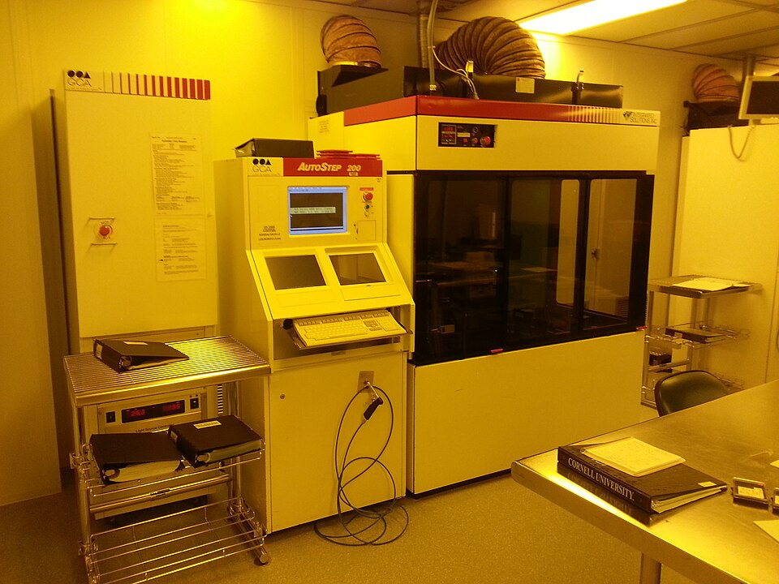

# Photolithography Stepper

> **Node ID**: photolithography.photolithography-stepper
> **Domain**: [Photolithography & IC Fabrication](./index.md)
> **Dependencies**: [`optics`](../optics/index.md), [`precision-motion`](../precision-motion/index.md), [`measurement`](../measurement/index.md), [`glass.advanced`](../glass/index.md)
> **Enables**: [`vlsi-scaling.advanced-lithography`](../vlsi-scaling/advanced-lithography.md)
> **Timeline**: Years 60-100+
> **Outputs**: patterned_photoresist, exposed_wafers
> **Critical**: Yes — the photolithography stepper is the single most complex and expensive piece of equipment in semiconductor fabrication; it determines the minimum feature size achievable

## Overview

> *Autostep i-line stepper for microelectronic photolithography*

> *Image: a13ean, CC BY-SA 3.0*

The photolithography stepper (step-and-repeat projection aligner) is the most complex machine in the semiconductor fab. It combines extreme-precision optics, sub-nanometer positioning, laser interferometry, autofocus systems, and high-intensity UV illumination into a single tool. A modern i-line stepper achieves 0.35-0.5 μm resolution across a 200 mm wafer with ±0.2 μm overlay accuracy. The precision requirements — positioning to ±10 nm over 300 mm travel, lens systems with λ/20 wavefront error, vibration isolation to <50 nm — represent the apex of precision engineering.

**At a bootstrap-civilization level, constructing a production-grade stepper from raw materials is not practical.** The lens system alone requires multi-element optics with surfaces figured to λ/20 (30 nm) flatness, anti-reflection coatings, and sub-ppb optical glass homogeneity. The laser interferometer positioning system requires HeNe lasers, precision mirrors, and optoelectronic detectors. The mechanical stage requires air bearings or hydrostatic bearings with sub-micron straightness over 300 mm travel.

However, **simpler lithography approaches are achievable** at earlier stages and can produce functional (if large-feature) devices:

- **Contact/proximity printing**: Mask in direct contact with or within 10-50 μm of the wafer. UV exposure through the mask. Resolution limited to ~2-5 μm by near-field diffraction. No precision optics required — only a UV source (mercury lamp), a mask aligner (mechanical jig with X-Y-θ adjustment), and a timer. This is the lithography method used for the first two decades of IC production (1960s-1970s) and is entirely buildable with moderate precision machining capability.

- **1:1 projection printing**: A single lens projects the mask image onto the wafer at 1:1 magnification. Simpler than a stepper (no step-and-repeat mechanics), but requires a large, high-quality lens covering the full wafer. Resolution ~1-2 μm with good optics. Used in early 1:1 projection aligners (Perkin-Elmer Micralign, 1970s).

## What a Stepper Contains

For reference, a step-and-repeat projection stepper consists of these subsystems:

1. **Illumination system**: Mercury arc lamp (350-1000 W) or excimer laser (KrF 248 nm, ArF 193 nm). Condenser optics homogenize and shape the light. Reticle (mask) stage holds the photomask.

2. **Projection lens**: 10-20 element refractive lens system reducing the reticle pattern 4× or 5× onto the wafer. Numerical aperture (NA) 0.28-0.65. Wavefront error <λ/20 at the operating wavelength. Lens cost: $100K-$1M+. The lens is the critical-path component — its quality determines the resolution.

3. **Wafer stage**: Precision X-Y stage with laser interferometer position feedback (HeNe laser, λ/4 ≈ 158 nm resolution). Air bearings for frictionless motion. Stage acceleration: 0.5-2 g. Vibration isolation: active or passive isolation system to limit stage vibration to <50 nm during exposure.

4. **Autofocus system**: Air gauge or optical (capacitive/interferometric) sensor measuring wafer height at each exposure field. Focus range: ±10 μm. Focus resolution: ±0.1 μm. Maintains the wafer surface within the lens depth of focus (DoF ≈ ±1-2 μm for i-line at NA 0.5).

5. **Alignment system**: Microscope with video image processing to detect alignment marks on the wafer and reticle. Overlay accuracy: ±0.1-0.5 μm (depending on generation). Global alignment (2 marks per wafer) or enhanced global alignment (20+ marks).

6. **Wafer handling**: Cassette-to-cassette robotic wafer loading, pre-aligner (centers and orients wafer flat/notch), and vacuum chuck on the stage.

## Principle

The stepper projects a reduced image of the reticle (mask) pattern onto a small field on the wafer (typically 20×20 mm to 26×33 mm for 4× reduction), exposes with UV light, then steps to the next field and repeats. Each wafer requires 50-200 exposure fields depending on field size and wafer diameter. Throughput: 20-60 wafers/hour. Resolution is determined by the Rayleigh criterion: Resolution = k₁ × λ / NA, where k₁ ≈ 0.5-0.8 (process factor), λ = wavelength (365 nm for i-line), and NA = numerical aperture of the projection lens.

## Prerequisites

- [Precision machining](../machine-tools/machining.md) — micrometer-adjustable stages, flat reference surfaces
- [Glass working](../glass/index.md) — fused silica for optics and mask substrates
- [Mercury arc lamp](../energy/electricity.md) — UV illumination source
- [Optics](../optics/index.md) — lens design and fabrication (for projection systems)
- [Precision motion](../precision-motion/index.md) — X-Y stages, vibration isolation (for steppers)
- [Photoresists](resists-masks.md) — resist chemistry for pattern formation
- [Cleanrooms](cleanrooms.md) — particle-controlled environment for wafer processing

## Bill of Materials (Contact/Proximity Printer)

| Material | Quantity | Specifications | Source | Alternatives |
|----------|----------|----------------|--------|-------------|
| Mercury arc lamp | 1 | 350-1000 W, g/h/i-line output | [Energy](../energy/electricity.md) | LED UV array (365 nm, limited intensity) |
| Reflective lamp housing | 1 | Aluminum or steel, elliptical reflector, heat filter | [Metals](../metals/index.md) | — |
| Bandpass filter | 1 | 365 nm (i-line) or 436 nm (g-line), ±10 nm passband | [Glass](../glass/index.md) | No filter (broadband exposure works, lower contrast) |
| X-Y-θ alignment stage | 1 | ±25 mm X-Y, 1 μm resolution; ±3° rotation, 1 arc-min resolution | [Precision Motion](../precision-motion/index.md) | — |
| Vacuum chuck | 1 | Aluminum, 100-200 mm, ±5 μm flatness, vacuum channels | [Metals](../metals/index.md) | Mechanical clamp (risks wafer damage) |
| Z-axis micrometer | 1 | 0-50 mm travel, 1 μm resolution, for gap setting | [Precision Motion](../precision-motion/index.md) | — |
| Alignment microscope | 1 | 10-50×, binocular, long working distance | [Optics](../optics/index.md) | — |
| Electromagnetic shutter | 1 | 10-50 mm aperture, 0.1 s timing resolution | [Electronics](../electronics/index.md) | Manual shutter with stopwatch |
| Electronic timer | 1 | 0.1-999.9 s, 0.1 s resolution | [Electronics](../electronics/index.md) | Manual stopwatch |
| UV radiometer | 1 | Measures mW/cm² at exposure wavelength | [Measurement](../measurement/index.md) | — |

## Process Description (Contact/Proximity Printer)

For the purposes of this tech tree, a contact/proximity printer is the achievable lithography tool at bootstrap level. Construction steps:

1. **Build the UV source**: Mount a mercury arc lamp (350-1000 W) in a reflective housing with a heat-absorbing filter and a bandpass filter selecting the desired wavelength (g-line 436 nm, h-line 405 nm, or i-line 365 nm). The lamp housing must be fully enclosed with an interlocked cover — the lamp produces intense UV and ozone. Align the reflector to produce uniform illumination at the mask plane (±5% intensity variation across 150 mm).

2. **Build the mask aligner**: Construct a mechanical stage with X-Y translation (micrometer-driven, ±25 mm range, 1 μm resolution) and rotation (θ adjustment, ±3° range, 1 arc-minute resolution). The stage holds the mask in a frame above the wafer. A microscope (10-50×) mounted above the mask allows the operator to view alignment marks on both mask and wafer simultaneously. The alignment marks are viewed through a beam-splitter arrangement so mask and wafer appear superimposed.

3. **Build the wafer chuck**: Machine a flat aluminum plate with vacuum channels to hold the wafer by suction. Flatness: ±5 μm. Mount on a Z-axis (vertical) micrometer for setting the mask-to-wafer gap (proximity mode: 10-50 μm gap; contact mode: gap = 0). The Z-axis micrometer must be smooth and backlash-free — any drift during exposure blurs the pattern. Use a micrometer head with 0.5 μm graduation and a locking lever.

4. **Add the timer and shutter**: Install an electronic timer controlling an electromagnetic shutter between the UV source and the mask. Exposure time: 1-60 seconds, resolution 0.1 seconds. Dose calibration: measure UV intensity at the wafer plane with a radiometer; set exposure time = target dose / measured intensity. For a typical i-line resist at 100 mJ/cm² dose and 10 mW/cm² measured intensity, exposure time = 10 seconds.

5. **Add gap-setting gauge**: For proximity printing, the mask-to-wafer gap must be controlled to ±5 μm. Install dial indicators or capacitive gap sensors at three points around the mask periphery. Adjust the Z-axis micrometer until all three gauges read the target gap. For contact printing (gap = 0), bring the mask into contact and verify with a slight mechanical "kiss" — the wafer and mask touch, visible as Newton's rings (interference fringes) under the alignment microscope.

## Dose Calibration Procedure

1. **Measure UV intensity**: Place a calibrated UV radiometer at the wafer plane (remove the wafer and mask, position the sensor where the wafer surface would be). Record the intensity in mW/cm² at the exposure wavelength (365 nm for i-line, 436 nm for g-line).

2. **Calculate exposure time**: Time (s) = Target dose (mJ/cm²) / Measured intensity (mW/cm²). Example: target dose 100 mJ/cm², measured intensity 8 mW/cm² → exposure time = 12.5 seconds.

3. **Verify with test wafer**: Expose a silicon test wafer coated with photoresist at the calculated time. Develop and inspect under a microscope. If features are fully resolved with clean sidewalls and no scumming, the dose is correct. If small features are missing (underexposed), increase exposure time by 10-20%. If large features are narrowed (overexposed), decrease by 10%.

4. **Map intensity uniformity**: Move the radiometer to 5-9 positions across the exposure field. If intensity varies more than ±5%, adjust the lamp position or add a diffuser to homogenize the beam.

5. **Re-measure weekly**: Mercury lamp intensity decreases ~10% per 100 hours of operation. Track lamp hours and re-measure intensity after every 50-100 hours. Adjust exposure time to compensate for lamp aging.

## Exposure Dose and Resolution

Exposure dose and the mask-to-wafer gap determine the achievable resolution:

**Contact printing** (gap = 0): Resolution limited by near-field diffraction to approximately √(λ × d) where λ is wavelength and d is any residual gap. With intimate contact (d < 0.5 μm): resolution ~1-2 μm at i-line (365 nm). The mask touches the wafer directly, producing the highest resolution but causing defects on both mask and wafer (particle trapping, resist sticking to mask).

**Proximity printing** (gap 10-50 μm): Resolution degrades as the gap increases. At 20 μm gap: ~3-5 μm resolution. At 50 μm gap: ~5-8 μm. The gap eliminates mask damage but introduces diffraction broadening. Proximity printing is the standard compromise for production — the gap protects the mask while maintaining usable resolution for features ≥3 μm.

| Gap (μm) | Resolution (μm) | Mask damage | Throughput |
|----------|-----------------|-------------|------------|
| 0 (contact) | 1-2 | High — mask lasts 10-50 wafers | Low — alignment and cleaning between wafers |
| 10 | 2-3 | Minimal | Moderate |
| 20 | 3-5 | None | Good |
| 50 | 5-8 | None | Good |

**Step-and-repeat mechanics** (for projection steppers): The wafer is exposed one field at a time. After each exposure, the X-Y stage steps to the next field position. Step size: 20-33 mm. Settling time after step: 50-200 ms (shorter settling = higher throughput but residual vibration degrades overlay). Stage positioning measured by laser interferometer (HeNe laser, λ/4 ≈ 158 nm resolution). Overlay accuracy: ±0.1-0.5 μm for production steppers.

## Quantitative Parameters (Contact/Proximity Printer)

| Parameter | Value |
|-----------|-------|
| Resolution (contact, gap = 0) | ~1-2 μm |
| Resolution (proximity, gap = 20 μm) | ~3-5 μm |
| Resolution (proximity, gap = 50 μm) | ~5-8 μm |
| Overlay accuracy | ±1-2 μm (manual alignment) |
| Exposure time | 5-30 seconds per exposure |
| UV source lifetime | ~1000 hours (mercury lamp) |
| Throughput | 5-20 wafers/hour |
| Wafer size | Up to 150 mm |

## Quantitative Parameters (Production Stepper — Reference Only)

| Parameter | Value |
|-----------|-------|
| Resolution (i-line, NA 0.5) | 0.35-0.5 μm |
| Resolution (KrF, NA 0.7) | 0.18-0.25 μm |
| Overlay accuracy | ±0.1-0.2 μm |
| Field size | 20×20 to 26×33 mm |
| Throughput | 20-60 wafers/hour |
| Stage positioning resolution | λ/1000 ≈ 0.6 nm (HeNe laser interferometer) |
| Depth of focus (i-line, NA 0.5) | ±1.0 μm |

## Mask Alignment Procedure

1. **Load the wafer**: Place the wafer on the vacuum chuck. Apply vacuum to hold it flat. Verify wafer flatness through the alignment microscope — any bow or warp causes focus errors in projection printing.

2. **Load the mask**: Place the photomask in the mask frame, chrome side facing down toward the wafer. The mask must be clean — any particle on the chrome surface prints as a defect on every die.

3. **Coarse alignment**: Using the X-Y micrometers, bring the mask alignment marks into approximate registration with the wafer alignment marks (visible through the alignment microscope). Get within 10-20 μm.

4. **Fine alignment**: Use the θ (rotation) adjustment to correct any rotational misalignment. Then use the X-Y micrometers for final position. Target: alignment marks overlap to within 1-2 μm (visible through a 50× microscope).

5. **Set the gap** (proximity mode): Adjust the Z-axis micrometer to set the target gap (10-50 μm). Verify the gap with the dial indicators or gap gauges. The gap must be uniform across the mask — any tilt causes one side to be in contact (high resolution) while the other is too far away (low resolution, diffraction blur).

6. **Expose**: Close the shutter, verify alignment one last time, open the shutter for the calculated exposure time. The timer controls the shutter automatically.

7. **Unload**: Release the vacuum chuck. Remove the wafer for development. Inspect the mask for resist transfer (if contact mode) and clean if needed.

## Safety

- **Mercury arc lamp UV radiation**: The lamp emits intense UV (200-400 nm) that causes severe eye damage (photokeratitis, "welder's flash") and skin burns. The lamp housing must be fully enclosed with an interlocked cover. Never operate the lamp with the housing open. Wear UV-blocking safety glasses (OD > 3 at 365 nm) when adjusting the optical path. Ozone generated by UV interacting with air requires ventilation — ozone TLV 0.1 ppm.

- **Mercury hazard**: The lamp contains mercury under high pressure (~30 atm when hot). Lamp envelope rupture releases mercury vapor (IDLH 10 mg/m³). Replace lamps at rated lifetime (~1000 hours) — aging lamps risk catastrophic failure. Handle lamps with cotton gloves (skin oils on the quartz envelope cause hot spots). Mercury spill protocol: evacuate area, use mercury spill kit (zinc dust or sulfur powder), never vacuum. Clean up under local exhaust ventilation.

- **Electrical hazard**: The lamp ignition circuit operates at 5-15 kV to strike the arc, then 50-100 V at 5-20 A during operation. Interlocked power supply. Lock-out/tag-out before servicing the lamp or its power supply. Allow the lamp to cool for 30+ minutes before handling (envelope temperature exceeds 600°C during operation).

- **Heat**: The lamp and housing generate 200-800 W of heat. Provide forced-air cooling of the housing. Do not place flammable materials near the exhaust.

## Troubleshooting

| Problem | Probable Cause | Solution |
|---------|---------------|----------|
| Features not resolved — resist remains in exposed areas | Underexposure: lamp aging, incorrect timer setting, or bandpass filter absorbing too much light | Re-measure UV intensity with radiometer; increase exposure time by 20%; replace lamp if intensity <70% of rated output |
| Features swollen or distorted — resist not clearing properly | Overexposure causing excessive light scattering under the mask edges | Reduce exposure time by 10-20%; decrease mask-to-wafer gap; use higher contrast resist |
| Pattern misaligned between layers | Alignment marks not visible clearly; micrometer backlash; thermal expansion of stage components | Clean alignment marks; approach setpoint from same direction to eliminate backlash; allow thermal equilibrium before alignment |
| Repeating defects on every die | Particle or defect on the mask chrome; cracked mask; mask contamination | Inspect mask under microscope; clean mask with filtered N₂; replace damaged masks; increase proximity gap to reduce particle trapping |
| Non-uniform exposure across wafer | Lamp reflector misaligned; diffuser missing or damaged; wafer not flat on chuck | Adjust lamp reflector position; check diffuser condition; verify wafer chuck flatness with gauge; ensure vacuum is holding wafer uniformly |

## Quality Control

**Critical dimension (CD) measurement**: After exposure and development, measure feature widths on test structures using an optical microscope (for features ≥1 μm) or scanning electron microscope (for features <1 μm). Measure at 5-9 sites across the wafer. CD uniformity target: ±5% of nominal. CD variation directly impacts device electrical characteristics (gate length → threshold voltage, speed).

**Overlay accuracy verification**: Measure alignment between the current layer and the previous layer using overlay measurement marks (box-in-box or bar-in-bar structures). Optical microscope with image processing measures the offset between layers. Target: ±1-2 μm for contact/proximity printing, ±0.1-0.5 μm for steppers. Overlay error >2× the target causes systematic yield loss.

**Exposure dose verification**: Process a dose matrix wafer — expose at 5-7 different dose levels (e.g., 80, 90, 100, 110, 120 mJ/cm²) on the same wafer. Develop and measure CD at each dose. Plot CD vs. dose. The correct dose produces CD at nominal value. The slope of the CD vs. dose curve indicates process latitude — a flatter slope is more forgiving of dose variations.

**Defect density inspection**: Laser scattering surface scan (KLA Tencor Surfscan) after develop. Count particles, scratches, and pattern defects. Target: <0.5 defects/cm² for features ≥0.5 μm. Defects in lithography repeat on every die — a single mask defect creates a systematic yield limiter.

**Line edge roughness (LER)**: For features below 250 nm, measure line edge roughness from top-down SEM images. LER is the 3σ deviation of the line edge from an ideal straight line. Target: <5 nm (3σ). High LER causes transistor parameter variation in advanced devices.

**Focus verification**: For projection systems, expose a focus matrix (vary focus in 0.2-0.5 μm steps) on a test wafer. The best focus produces the smallest CD and steepest sidewalls. Verify that the autofocus system maintains focus within ±0.5 μm of the best focus position across the wafer.

## Variations and Alternatives

| Method | Resolution | Complexity | Mask Life | When to Use |
|--------|-----------|------------|-----------|-------------|
| Contact print | 1-2 μm | Low | 10-50 wafers | Prototyping, low-volume production with large features |
| Proximity print (20 μm) | 3-5 μm | Low | 1000+ wafers | Production of ≥3 μm features; standard for early fab |
| 1:1 projection | ~1 μm | Moderate | Indefinite | When projection optics are available; eliminates mask wear |
| Step-and-repeat (i-line) | 0.35-0.5 μm | Very high | Indefinite | Sub-micron production; requires full precision engineering |
| Step-and-scan (DUV) | 0.13-0.25 μm | Extreme | Indefinite | Advanced nodes (90-130 nm); KrF/ArF excimer laser |

Contact and proximity printing are the baseline methods — they require no optics beyond the UV source and alignment microscope. The 1:1 projection aligner is the first optical upgrade, adding a lens system between mask and wafer. The step-and-repeat stepper is the production workhorse from the 1 μm node through 350 nm, using a reduction lens to image a small field at a time. Step-and-scan systems (DUV, 248-193 nm) extend optical lithography to 130 nm and below by scanning the mask and wafer simultaneously through a slit-shaped illumination field.

For bootstrapping, start with proximity printing at 20 μm gap. This produces 3-5 μm features with inexpensive equipment and reusable masks. When 1 μm features are needed, invest in a 1:1 projection lens system. The full stepper requires industrial infrastructure that takes decades to develop.

## Scaling Notes

- **Contact printer to proximity printer**: Increase the gap to 20-50 μm. Resolution degrades to 3-8 μm but mask lifetime improves from 10-50 wafers to 1000+ wafers. No equipment changes needed — only the Z-axis micrometer setting.

- **Proximity printer to 1:1 projection**: Replace the contact/proximity head with a 1:1 projection lens assembly. Requires a high-quality lens covering the full wafer diameter (expensive). Resolution improves to ~1 μm without mask contact. Perkin-Elmer Micralign (1973) was the first production 1:1 projection aligner.

- **1:1 projection to step-and-repeat stepper**: Add a precision X-Y stage with laser interferometer feedback, a reduction lens (4× or 5×), step-and-repeat control electronics, and autofocus. This is the modern stepper architecture. Each added subsystem requires its own precision engineering capability — the stepper represents the convergence of optics, mechanics, electronics, and software at the highest level.

## References

- [Photoresists, Masks & Lithography](resists-masks.md) — resist chemistry, mask making, lithography process optimization
- [Core Fab Processes](fab-processes.md) — lithography in the full IC process flow
- [Advanced Lithography](../vlsi-scaling/advanced-lithography.md) — DUV, EUV, and advanced patterning techniques
- [Optics](../optics/index.md) — lens design, optical materials
- [Precision Motion](../precision-motion/index.md) — air bearings, laser interferometers, vibration isolation
- [Cleanrooms](cleanrooms.md) — contamination control for lithography

---
*Part of the [Bootciv Tech Tree](../index.md) • [Photolithography & IC Fabrication](./index.md) • [All Domains](../index.md)*
