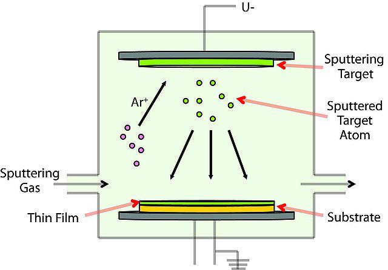
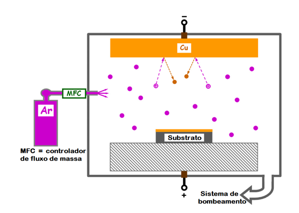

# Physical Vapor Deposition (PVD)

> **Node ID**: photolithography.fab-processes.pvd
> **Domain**: [Photolithography & IC Fabrication](./index.md)
> **Dependencies**: [`metals`](../metals/index.md), [`vacuum`](../vacuum/index.md), [`vacuum.pumps`](../vacuum/pumps.md)
> **Parent**: [Core Fab Processes](./fab-processes.md)
> **Timeline**: Years 45-65
> **Outputs**: metal_thin_films, barrier_layers, adhesion_layers

## Overview

> *Physical Vapor Deposition (PVD)*

> *Image: sigmaaldrich, CC BY-SA 4.0*

> *Physical Vapor Deposition (PVD)*

> *Image: sigmaaldrich, CC BY-SA 4.0*

> *Figura adaptada de: GREENE, J. E. (2017). «Review Article: Tracing the recorded history of thin-film sputter deposition: From the 1800s to 2017». Journal of Vacuum Science &amp; Technology. 35. 61 páginas.*

> *Image: RegiSantana, CC BY-SA 4.0*

Physical Vapor Deposition (PVD) encompasses a family of vacuum-based processes that deposit thin solid films by physically transporting material from a source (target or evaporant) to a substrate. Unlike Chemical Vapor Deposition (CVD), PVD involves no chemical reaction at the substrate surface — the film material arrives as atoms or clusters ejected from the source by kinetic energy (sputtering) or thermal energy (evaporation). PVD is the workhorse for metallization in IC fabrication, depositing aluminum, copper, titanium, tantalum, tungsten, and their alloys as interconnects, diffusion barriers, and adhesion layers.

Two principal mechanisms define PVD:

- **Sputtering**: Energetic ions (typically Ar⁺) bombard a target, ejecting atoms that condense on the substrate. Operates at relatively higher pressure (~10⁻³ Torr) with argon working gas.
- **Evaporation**: The source material is heated to vaporization (thermal or electron-beam) in high vacuum (10⁻⁶ to 10⁻⁸ Torr), and vaporized atoms travel line-of-sight to the substrate.

## Vacuum Requirements

Vacuum quality is the single most critical enabler for PVD. Residual gas molecules scatter the depositing atoms (degrading film uniformity in sputtering) and incorporate impurities (oxygen, water vapor) into the growing film (degrading electrical conductivity and adhesion in both processes).

| Process | Base Pressure | Working Pressure | Pump Type |
|---------|--------------|-----------------|-----------|
| DC/RF Sputtering | ≤10⁻⁶ Torr | 1–10 mTorr (10⁻³ Torr, Ar gas) | Turbomolecular + roughing |
| Magnetron Sputtering | ≤10⁻⁶ Torr | 2–8 mTorr (Ar gas) | Turbomolecular + roughing |
| Thermal Evaporation | ≤10⁻⁶ Torr | 10⁻⁶–10⁻⁷ Torr (no working gas) | Diffusion pump or turbomolecular |
| E-beam Evaporation | ≤10⁻⁷ Torr | 10⁻⁷–10⁻⁸ Torr (no working gas) | Cryopump or turbomolecular |

The base pressure (achieved before deposition begins) determines the residual contamination level. A typical PVD tool pumps down to base pressure, then introduces high-purity argon (99.999%+) for sputtering, or continues pumping at base pressure for evaporation. See [Vacuum Pumps](../vacuum/pumps.md) for turbomolecular and cryopump details.

## Chamber Design

A PVD chamber is a stainless steel (304L or 316L) vacuum vessel with the following key components:

- **Vacuum envelope**: CF-flanged (ConFlat, copper gasket) or ISO-KF (O-ring) sealed chamber. Chamber walls are electropolished to reduce outgassing and particle generation. Typical internal volume: 20–100 liters for single-wafer tools.
- **Target/source assembly**: Water-cooled target holder (sputtering) or crucible with water-cooled copper hearth (e-beam evaporation). Target diameter 100–300 mm, matching wafer size.
- **Substrate holder (platen)**: Heated (optional, 20–400°C) and may rotate (10–30 RPM) for uniformity. May be electrically biased (RF or DC) to control ion bombardment of the growing film.
- **Gas delivery**: Mass flow controllers (MFCs) for argon (sputtering) and reactive gases (N₂ for TiN, O₂ for ITO). Gas purity: 99.999%+ with point-of-use purification.
- **Vacuum pumping**: Turbomolecular pump (300–2000 L/s) backed by a dry roughing pump (scroll or diaphragm), or cryopump (for evaporation). Gate valve isolates the pump during source maintenance.
- **Load-lock**: Most production tools have a separate load-lock chamber for wafer loading/unloading, preventing the main deposition chamber from venting to atmosphere. Load-lock pumps down in 30–120 seconds; main chamber stays at base pressure continuously.

## Sputtering Processes

### DC Sputtering

The simplest sputtering mode. A DC voltage (200–1000 V) is applied between the cathode (target, negative) and anode (chamber ground, positive). Argon gas at 1–10 mTorr ionizes in the resulting electric field, creating a glow discharge plasma. Ar⁺ ions accelerate toward the negatively biased target, striking it with energies of 100–1000 eV. The **sputter yield** (atoms ejected per incident ion) depends on target material, ion energy, and angle of incidence:

| Target Material | Sputter Yield (500 eV Ar⁺) | Notes |
|----------------|---------------------------|-------|
| Al | 1.05 | Most common interconnect metal |
| Cu | 2.35 | Highest yield among common metals; used for advanced interconnects |
| Ti | 0.51 | Barrier/adhesion layer metal |
| Ta | 0.58 | Diffusion barrier for Cu interconnects |
| W | 0.57 | Gate metal, contact plugs |

DC sputtering only works with electrically conductive targets (metals). Insulating targets charge up and extinguish the plasma. Deposition rate: 5–50 nm/min depending on power density (1–10 W/cm²) and target-to-substrate distance (50–100 mm).

### RF Sputtering

For insulating targets (SiO₂, Si₃N₄, Al₂O₃, ITO), an RF power supply (typically 13.56 MHz) replaces the DC supply. The alternating RF field prevents charge buildup on the insulator surface. A blocking capacitor in the matching network develops a DC self-bias on the target (the target is the powered electrode, which has a smaller area than the grounded chamber). This self-bias accelerates Ar⁺ ions into the target, producing sputtering. RF sputtering rates are typically lower than DC sputtering for equivalent power input (energy is split between sputtering and maintaining the plasma). Deposition rate: 1–20 nm/min for dielectric targets.

### Magnetron Sputtering

A magnetron adds permanent magnets behind the target to trap electrons in a closed magnetic field loop near the target surface. This dramatically increases the ionization efficiency in the plasma, allowing:

- **Higher deposition rates**: 5–30 nm/min for metals at moderate power (100–500 W).
- **Lower operating pressure**: 2–8 mTorr (vs. 10–30 mTorr for non-magnetron diode sputtering). Lower pressure means fewer gas-phase collisions and more directional deposition.
- **Reduced substrate heating**: Electrons are confined near the target, not bombarding the substrate.

Magnetron sputtering is the dominant production technique for metal deposition in semiconductor fabs. Both DC magnetron (for conductive targets: Al, Ti, Cu, Ta, W) and RF magnetron (for insulating targets: SiO₂, Si₃N₄) configurations exist.

**Sputter deposition parameters for common IC metals**:

| Material | Power | Ar Pressure | Rate | Film Resistivity | Application |
|----------|-------|-------------|------|-----------------|-------------|
| Al (or Al-Cu 0.5%) | 200–500 W DC | 3–5 mTorr | 10–30 nm/min | 2.7–3.0 μΩ·cm | Interconnects, bond pads |
| Ti | 200–400 W DC | 3–5 mTorr | 5–15 nm/min | 55–80 μΩ·cm | Adhesion layer, barrier |
| TiN (reactive, Ar+N₂) | 300–500 W DC | 4–6 mTorr | 3–10 nm/min | 50–200 μΩ·cm | Diffusion barrier |
| Cu | 200–500 W DC | 3–5 mTorr | 15–40 nm/min | 1.7–2.0 μΩ·cm | Advanced interconnects |
| Ta | 200–400 W DC | 3–5 mTorr | 5–15 nm/min | 170–220 μΩ·cm | Cu diffusion barrier |
| TaN (reactive, Ar+N₂) | 300–500 W DC | 4–6 mTorr | 3–8 nm/min | 200–500 μΩ·cm | Cu diffusion barrier |

## Evaporation Processes

### Thermal Evaporation

A resistively heated metal boat (tungsten, molybdenum, or tantalum) or filament holds the source material. Current (50–500 A at 2–10 V) heats the source to its vaporization temperature. Atoms leave the molten source surface and travel in straight lines to the substrate. The process operates at very low pressure (10⁻⁶ to 10⁻⁷ Torr) so that evaporated atoms have mean free paths much longer than the source-to-substrate distance (typically 300–500 mm), ensuring line-of-sight transport with minimal gas-phase scattering.

**Source temperatures for common metals**:

| Metal | Vaporization Temperature | Melting Point | Notes |
|-------|------------------------|---------------|-------|
| Al | ~1200°C | 660°C | Easily evaporated from W or Mo boat; most common thermal evaporation metal |
| Ti | ~1750°C | 1668°C | Requires W boat or e-beam; used for adhesion/barrier layers |
| Cu | ~1260°C | 1085°C | Evaporates readily; used for interconnects in research settings |
| Au | ~1465°C | 1064°C | Used for wire bond pads, contacts; evaporates from Mo or W boat |
| Cr | ~1400°C | 1907°C | Sublimes rather than melts; used as adhesion promoter for Au |

Deposition rate: 5–100 nm/min depending on source temperature and source-to-substrate distance. Film purity depends on source purity and vacuum quality — residual oxygen and water vapor incorporate into the film as oxides. Thermal evaporation provides poor step coverage (shadowing at step edges) due to the point-source geometry, limiting its use in advanced multi-level metallization.

### Electron-Beam (E-beam) Evaporation

A focused electron beam (5–40 kV accelerating voltage, 0.1–5 A beam current) scans across the source material held in a water-cooled copper crucible. The beam locally heats a small area of the source to vaporization temperature while the surrounding material remains solid (contained by the water-cooled crucible). This offers several advantages over thermal evaporation:

- **Higher evaporation temperature**: Refractory metals (W, Mo, Ta) and ceramics (SiO₂, Al₂O₃) that cannot be thermally evaporated from a boat can be e-beam evaporated.
- **Higher purity**: The water-cooled crucible does not contaminate the source (unlike a resistively heated boat that can alloy with the source material). Only the e-beam impact spot is molten.
- **Higher deposition rate**: Up to 100–500 nm/min for metals with high beam power (10–20 kW).
- **Multiple sources**: A multi-pocket crucible allows sequential deposition of different materials without breaking vacuum.

E-beam evaporation requires the highest vacuum quality of all PVD processes (10⁻⁷ to 10⁻⁸ Torr base pressure), typically achieved with cryopumps. The electron beam itself can generate X-rays that cause radiation damage in sensitive devices (MOS gate oxides), so a grounded shield is placed between the e-beam source and the substrate during beam stabilization.

## Thin Film Monitoring

### Quartz Crystal Microbalance (QCM)

The QCM is the standard in-situ thickness monitor for all PVD processes. A thin AT-cut quartz crystal oscillates at its resonant frequency (typically 5–6 MHz). As material deposits on the crystal face, the added mass lowers the resonant frequency. The frequency shift Δf is proportional to the deposited mass per unit area (Sauerbrey equation):

**Δf = −(2f₀² · Δm) / (A · √(ρq · μq))**

Where f₀ is the fundamental frequency, Δm is the deposited mass, A is the active crystal area, ρq is the density of quartz (2.649 g/cm³), and μq is the shear modulus of quartz (2.947 × 10¹¹ g/cm·s²).

The deposition controller converts frequency change to film thickness using the known density and acoustic impedance (Z-factor) of the deposited material. Typical accuracy: ±1–5% of film thickness. The crystal is replaced when the total frequency shift reaches ~2% of f₀ (film thickness ~5–10 μm, depending on material density).

**QCM placement**: The crystal is positioned in the chamber at a location where the deposition rate is proportional to (but not equal to) the rate at the wafer — the tooling factor calibrates this ratio. Tooling factor is measured by depositing a known thickness and comparing QCM reading to ex-situ measurement (profilometer or ellipsometer).

### Additional Monitoring

- **Optical monitoring**: Reflectance or transmittance at a specific wavelength measures film thickness in real time for transparent films (interference oscillations). Complements QCM for dielectric films.
- **Endpoint detection**: For reactive sputtering (TiN, TaN), the plasma emission or voltage change indicates when the target surface has transitioned from metallic to poisoned (compound) mode.
- **Ex-situ verification**: [Ellipsometry](../glossary/ellipsometry.md) for film thickness and refractive index, [four-point probe](../glossary/four-point-probe.md) for sheet resistance, and [profilometer](../glossary/dektak-profilometer.md) for step height measurement.

## Target Materials

The choice of target (or evaporant) material determines the film composition and its function in the IC:

| Target Material | Film Function | Typical Thickness | Key Properties |
|----------------|--------------|-------------------|----------------|
| Al or Al-Cu (0.5%) | Interconnect metal, bond pads | 0.5–2.0 μm | Low resistivity (2.7 μΩ·cm), good step coverage, electromigration resistance with Cu alloy |
| Al-Si (1%) | Interconnect with Si substrate contact | 0.5–1.5 μm | Si addition prevents Al spiking into Si at contacts |
| Ti | Adhesion layer | 20–50 nm | Excellent adhesion to SiO₂ and SiNₓ; reduces native oxide |
| TiN | Diffusion barrier | 30–100 nm | Blocks Al-Si interdiffusion; barrier for W plug CVD |
| Cu | Advanced interconnect (with barrier) | 0.2–1.0 μm | Lowest resistivity (1.7 μΩ·cm) of practical metals; requires Ta/TaN barrier |
| Ta | Cu diffusion barrier | 10–30 nm | Prevents Cu diffusion into SiO₂ or Si; amorphous Ta is preferred |
| TaN | Cu diffusion barrier (alternative) | 10–30 nm | Reactive sputtering (Ar + N₂); amorphous, excellent barrier properties |
| W | Gate metal, local interconnect | 100–500 nm | High melting point, good step coverage; usually deposited by CVD, not PVD |
| Cr | Adhesion promoter | 5–20 nm | Promotes adhesion of Au, Cu to oxides; rarely used in mainstream IC |
| Au | Wire bond pads, contacts | 0.2–1.0 μm | Noble metal, excellent corrosion resistance; used in packaging and research |

## Process Integration

PVD steps are embedded throughout the BEOL (Back-End-Of-Line) process flow:

1. **Contact/metallization**: After contact hole etch, deposit Ti adhesion layer (20–50 nm) followed by TiN barrier (30–100 nm) by sputtering, then W plug fill by CVD.
2. **Metal 1 interconnect**: Sputter Al-Cu (0.5%) or Al-Si (1%), typically 0.5–1.5 μm. Pattern by wet etch or dry etch (Cl₂-based RIE).
3. **Barrier/seed for Cu damascene** (advanced nodes): Sputter Ta/TaN barrier (10–30 nm) followed by Cu seed layer (50–100 nm), then electroplate Cu to fill trenches and vias.
4. **Passivation**: PECVD SiNₓ (not PVD — listed for context).

PVD films are typically annealed after deposition (400–450°C, 30 min, forming gas N₂/H₂ 90/10) to improve grain structure, reduce stress, and lower resistivity.

## Troubleshooting

| Problem | Probable Cause | Solution |
|---------|---------------|----------|
| Film resistivity 2–5× bulk value | Base pressure too high (oxygen/water incorporation); Ar pressure too high in sputter (gas scattering reduces adatom energy); substrate not heated | Improve base pressure to ≤10⁻⁶ Torr; reduce Ar pressure toward 2–3 mTorr; heat substrate to 200–350°C for denser film |
| Poor step coverage at contact hole sidewalls | Evaporation used instead of sputtering; low Ar pressure in sputter (too directional) | Switch to sputtering for better conformity; increase Ar pressure to 5–8 mTorr for more scattering; or use CVD instead of PVD for high-aspect-ratio features |
| Al film delamination from SiO₂ | Missing Ti adhesion layer; surface contamination (water, photoresist residue) | Deposit 20–50 nm Ti adhesion layer before Al; perform Ar sputter clean (100–200 W, 30–60 s) immediately before metal deposition to remove native oxide and organics |
| QCM thickness reading drifts or saturates | Crystal coated too thickly (near end of life); temperature variation in water-cooled crystal holder | Replace crystal when frequency shift exceeds 2% of f₀; verify crystal water cooling is functioning; recalibrate tooling factor with new crystal |
| Non-uniform deposition across wafer (±10%) | Target erosion pattern uneven; substrate not rotating; magnetron magnet degraded | Rotate substrate at 10–30 RPM; replace target when erosion groove exceeds 50% depth; check magnetron magnet strength; adjust target-to-substrate distance |
| Target arcing (DC sputtering) | Target surface contaminated with oxides or particulates; moisture on target | Pre-sputter (burn-in) with shutter closed for 1–5 min to clean target surface; ensure chamber is properly vented and pumped; use arc suppression power supply |

## See Also

- [Core Fab Processes](./fab-processes.md) — parent capability
- [Vacuum Technology](../vacuum/index.md) — vacuum systems
- [Vacuum Pumps](../vacuum/pumps.md) — turbomolecular and cryopump details
- [Metals](../metals/index.md) — metallurgy and metal production
- [Resists & Masks](./resists-masks.md) — patterning for metal layers
- [Cleanrooms](./cleanrooms.md) — contamination control for PVD tools

Target utilization is a significant economic consideration in PVD. Sputter targets are consumed non-uniformly — the erosion profile depends on the magnetic field geometry of the magnetron, creating a racetrack-shaped groove that typically wastes 60-80% of the target material. Rotating magnet designs and cylindrical targets improve utilization but add complexity. For expensive target materials (gold, platinum, rare-earth alloys), reclaiming unused target material becomes economically important.

PVD tool maintenance cycles are driven by film buildup on chamber walls and fixtures. Over time, deposited material flakes off these surfaces, generating particles that contaminate wafer surfaces. Regular chamber cleaning (plasma etch of chamber walls, replacement of shield liners) is necessary to maintain particle performance. The mean time between cleaning cycles is a key productivity metric for production PVD equipment.
Target utilization is a significant economic consideration in PVD. Sputter targets are consumed
non-uniformly — the erosion profile depends on the magnetic field geometry of the magnetron,
creating a racetrack-shaped groove that typically wastes a large fraction of the target material.
Rotating magnet designs and cylindrical targets improve utilization but add mechanical complexity.
For expensive target materials (gold, platinum, rare-earth alloys), reclaiming unused target
material becomes economically worthwhile.

PVD tool maintenance cycles are driven by film buildup on chamber walls and fixtures. Over
time, deposited material flakes off these surfaces, generating particles that contaminate wafer
surfaces. Regular chamber cleaning (plasma etch of chamber walls, replacement of shield liners)
is necessary to maintain particle performance. The mean time between cleaning cycles is a key
productivity metric for production PVD equipment.

Step coverage — the ability of a PVD film to deposit uniformly on vertical sidewalls and the
bottoms of trenches and vias — is inherently limited in conventional sputtering because atoms
travel in straight lines from target to substrate. Ionized PVD (where a fraction of the sputtered
atoms are ionized and accelerated toward the substrate by a bias voltage) improves bottom
coverage by directing material into features. CVD generally provides superior step coverage
compared to PVD, which is why the two techniques are used for different applications in a
semiconductor fabrication flow.

[← Back to Photolithography](index.md)
