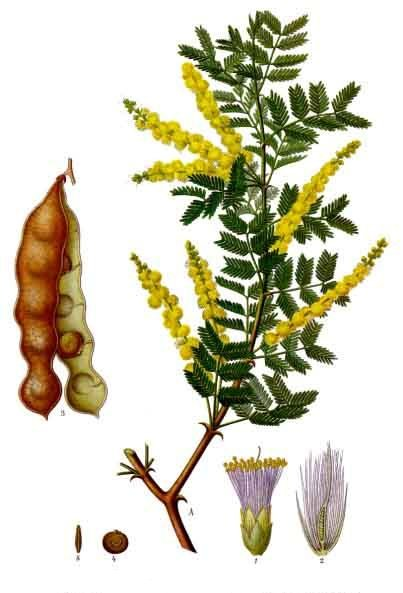

# Gum Arabic

> **Node ID**: plants.resin.gum-arabic
> **Domain**: [Plants](./index.md)
> **Dependencies**: See prerequisites
> **Enables**: [`Chemistry`](../chemistry/index.md), [`Knowledge`](../knowledge/index.md)
> **Timeline**: Years 5-6
> **Outputs**: gum arabic (emulsifier, adhesive, ink binder, food additive)
> **Critical**: No — versatile gum but other adhesives and binders can substitute

## Overview

> *Tito Melema, pencil, watercolour and bodycolour, with gum arabic painting by Edward Clifford (1844-1907)*

> *Image: Edward Clifford, Public domain*

Gum arabic (*Acacia senegal*, also known as Senegalia senegal) is a small thorny tree native to the Sahel region of Africa that exudes a natural gum from its bark when wounded. This gum, known as gum arabic, is one of the most useful natural materials in existence: it is an edible, water-soluble adhesive, emulsifier, film-former, and binder used in food, ink, paint, ceramics, textiles, and medicine.

Gum arabic is a complex polysaccharide (arabin) that dissolves readily in water to form a viscous, sticky solution. It is unique among natural gums for its high solubility (up to 50% concentration in water), low viscosity (even at high concentrations), and excellent emulsifying properties. It is the traditional binder for watercolor paints and India ink, the adhesive on postage stamps, and the emulsifier that keeps flavor oils suspended in soft drinks.

The tree grows 3-8 meters tall in the semi-arid Sahel belt south of the Sahara, from Senegal to Somalia. It tolerates extreme drought (250-400 mm annual rainfall), poor sandy soils, and temperatures from 10°C to 45°C. The gum is harvested by making deliberate wounds (tapping) in the bark and collecting the dried gum nodules that form over 2-6 weeks.

Gum arabic has been traded across the Sahara for over 4,000 years. It was one of the most valuable commodities in the medieval Islamic world and remains an important export for Sahelian countries.

Primary outputs: `gum_arabic` for use as adhesive, emulsifier, ink binder, and food additive.

## Prerequisites

### Materials

- *Acacia senegal* seeds or seedlings
- Semi-arid tropical site with sandy or gravelly soil
- Annual rainfall 250-500 mm

### Equipment

- Tapping axe or spear (sharp pointed tool for bark wounding)
- Collection containers
- Drying trays or screens
- Grinding equipment (mortar or mill) for powder production

### Knowledge

- Tree maturity assessment (gum quality improves with age, best at 6+ years)
- Tapping technique: wound placement and timing
- Gum collection and grading
- Dissolving and using gum arabic in various applications

### Infrastructure

- Acacia woodland or plantation
- Tapping trails through the stand
- Drying and storage area (dry conditions essential)
- Clean workspace for gum processing

## Process Description

### Tapping and Gum Collection

1. Plant seedlings (nursery-grown) at 4-6 meter spacing at the start of the rainy season. Protect from grazing animals for the first 2-3 years.
2. Allow trees to grow for 5-6 years before first tapping. Gum quality and quantity improve with tree age.
3. Tap during the dry season (November-March in the Sahel). Make a horizontal strip wound (5-10 cm long, 2-3 cm wide) through the bark on one side of the trunk, 30-60 cm above ground. Do not cut into the wood.
4. Gum exudes from the wound over 2-6 weeks, forming hard, glassy nodules (tears) on the bark surface. The gum is pale yellow to amber when fresh.
5. Collect dried gum nodules by hand. Grade by size and color: larger, paler nodules are higher quality.
6. A single tree yields 200-2,000 g of gum per season, with peak production from trees 7-15 years old.
7. Trees can be retapped annually for 10-15 years. Rest periods of 4-6 years between tapping cycles extend tree life.

### Processing and Use

1. Sort collected gum by quality. Remove bark fragments and debris. Sun-dry for 2-3 days if needed.
2. For whole gum: store dried nodules in sealed containers in a dry location. Gum arabic keeps for years if protected from moisture.
3. For powder: grind dried nodules in a mortar or mill. Sieve to uniform particle size.
4. **Dissolving**: Add gum powder to warm water (30-40°C) at 10-30% concentration. Stir until fully dissolved (30-60 minutes). Filter through cloth if clarity is needed.
5. **Ink making**: dissolve 20-30 g of gum arabic in 100 ml of water. Add 10-20 g of soot (carbon black) or other pigment. Grind to a smooth paste. Dilute with water to ink consistency.
6. **Watercolor paint**: dissolve 20 g of gum arabic in 80 ml of water. Add pigment (10-30 g depending on color) and grind to a smooth paste.
7. **Adhesive**: dissolve 30-50 g in 100 ml of water. Apply warm. Bonds paper, light wood, and fabric.

### Process Parameters

| Parameter | Range | Notes |
|-----------|-------|-------|
| Gum yield per tree per season | 200-2,000 g | Peak at 7-15 years |
| Gum yield per hectare per year | 100-500 kg | From managed woodland |
| Gum solubility in water | Up to 50% w/v | Dissolves readily in cold to warm water |
| Viscosity (30% solution) | Low | Easier to work with than other gums |
| First tapping age | 5-6 years | Quality improves with age |
| Tapping season | Dry season | November-March in Sahel |
| Time from tap to harvest | 2-6 weeks | Gum hardens on the tree |
| Tree productive lifespan | 15-25 years | Of tapping age |
| Optimal rainfall | 250-500 mm/year | Semi-arid |
| Storage life | 5+ years | If kept dry |
| Tree density (managed woodland) | 200-400 trees/ha | Semi-arid savanna |
| Gum arabic composition | ~90% polysaccharide | Arabin, with calcium/magnesium/potassium salts |

### Processing Details and Applications

Gum arabic's value lies in its dual behavior: it dissolves to high concentration without becoming viscous (unlike guar gum or starch), and it stabilizes oil-in-water emulsions at low concentrations (2-5%). This makes it irreplaceable for certain applications until synthetic polymers become available.

For ink production, gum arabic serves as both the binder that holds pigment particles in suspension and the film-former that creates a smooth, glossy surface when the ink dries. India ink (carbon black suspended in gum arabic solution) has been the standard writing and drawing ink for over 3,000 years. The gum prevents the carbon particles from settling, allows smooth flow from a pen or brush, and forms a water-resistant film when dry. A well-made gum arabic ink does not feather or bleed on paper.

For ceramic glaze suspension, dissolve 5-10 g of gum arabic in 100 ml of glaze slip. The gum prevents heavy glaze particles from settling during application, ensuring an even coating on the pottery surface. This technique is particularly important for applying glazes by dipping or pouring.

Gum arabic solutions have a limited shelf life once mixed with water: 3-7 days at room temperature before fermentation begins. Add 10-20% alcohol by volume (or a few drops of clove oil) as a preservative for solutions that must be stored. Alternatively, prepare only as much solution as needed for immediate use and dry the remainder back to solid form.

### Woodland Management

Acacia senegal grows in the Sahel as part of the traditional agroforestry system known as the "gum arabic belt." Trees are maintained at 200-400 per hectare in a parkland landscape, with millet, sorghum, or peanuts cultivated between the trees during the rainy season. The trees provide shade and wind protection for understory crops while producing gum during the dry season when agricultural work is minimal.

Tapping should be limited to one wound panel per tree per year, alternating sides of the trunk annually. Trees that are over-tapped (multiple wounds or retapped before rest) show declining gum yield and reduced lifespan. A well-managed tree produces gum for 15-25 years; an over-tapped tree may die within 5-8 years.

## Safety Considerations

- Gum arabic is edible and generally recognized as safe (GRAS). No toxicity concerns for normal use.
- Thorns on the tree can cause puncture wounds. Wear gloves and protective clothing during tapping and collection.
- Dust from grinding gum arabic can irritate the respiratory tract. Wear a mask when grinding.
- Gum arabic solutions can ferment if stored in warm conditions. Use preservatives (alcohol, essential oils) or use within a few days.

### Personal Protective Equipment

- Heavy gloves and long sleeves for tapping (thorns)
- Dust mask for grinding operations

## Quality Control

### Acceptance Criteria

- **Grade 1 (hand-picked selected)**: Pale yellow to amber, round nodules, no bark, clean
- **Grade 2 (cleaned)**: Amber to brown, some fragments, minimal bark
- **Grade 3 (siftings)**: Small pieces, darker color, some bark fragments

### Testing Methods

- Solubility: dissolve 1 g of gum in 5 ml of water. Grade 1 gum dissolves completely in 15 minutes with no residue.
- Viscosity: a 30% solution should pour freely, not gel.
- Adhesive test: apply gum solution to two paper strips, press together, and dry. The bond should resist gentle pulling after drying.

## Scaling Notes

- **Household trees** (5-10 trees): 1-20 kg of gum per year. Sufficient for household adhesive, ink, and food needs.
- **Woodland management** (10 hectares): 500-2,000 trees. Gum yield: 100-1,000 kg per year. Village-level trade production.
- **Bottleneck**: The 5-6 year wait before first tapping. Once established, gum arabic trees produce for 15-25 years with minimal care.

## Troubleshooting

| Problem | Probable Cause | Solution |
|---------|---------------|----------|
| Tree does not produce gum after tapping | Tapped too early in season or tree stressed | Tap during peak dry season; avoid trees stressed by drought or grazing |
| Gum is dark brown, not pale | Old wounds, insect damage, or delayed collection | Collect gum promptly (within 4-6 weeks of tapping); use fresh wounds |
| Gum does not dissolve well | Gum too old or stored in humid conditions | Use fresh gum; protect from moisture during storage |
- | Gum solution ferments | Stored too long in warm water | Use immediately or add alcohol preservative |
| Trees dying after tapping | Over-tapping or fungal infection through wounds | Limit tapping to one panel per year; rest trees every 4-5 years |

## Variations and Alternatives

- **Acacia seyal** (talh gum): Related species producing a darker gum (gum talha). Lower quality than *A. senegal* but more abundant. Used for non-food applications.
- **Tragacanth** (*Astragalus gummifer*): Another natural gum, more viscous than gum arabic. Used in pharmaceuticals and food.
- **Guar gum** (*Cyamopsis tetragonoloba*): Seed gum from a legume crop. Higher viscosity than gum arabic. Used as thickener.
- **Egg white (glair)**: Traditional binder for manuscript illumination and gilding. Replaces gum arabic in some applications.

### Industrial-Scale Applications

At production scale, gum arabic serves as the primary emulsifier in soft drink manufacturing (keeping citrus flavor oils suspended in water), the adhesive on postage stamps and envelope flaps, the protective coating on pills and tablets in pharmaceuticals, and the sizing agent in textile printing that prevents dye from spreading beyond printed areas. For civilization bootstrapping, the most critical applications are ink binder (enabling permanent written records), ceramic glaze suspender, and watercolor paint binder — all achievable at minimal technology levels.

## References

- [Chemistry](../chemistry/index.md) — gum chemistry and applications
- [Knowledge: Writing](../knowledge/writing.md) — ink production using gum arabic
- [Knowledge: Printing](../knowledge/printing.md) — printmaking binders
- [Black Wattle](./acacia-mearnsii.md) — related acacia species (tannin source)
- [Plants Domain](./index.md) — domain overview and related capabilities

### Gum Arabic in Ceramics and Industry

Beyond ink and food uses, gum arabic serves critical functions in ceramics and industrial
processes. In ceramics, a 2-5% gum arabic solution added to glaze slip prevents heavy
particles from settling during application, ensuring an even coating on pottery. Without
a suspending agent, glaze particles settle rapidly, producing uneven, streaky coatings.

In textile printing, gum arabic serves as the thickener that prevents printed dye from
spreading beyond the intended pattern. The printing paste (dye + gum arabic + mordant)
is applied to fabric through carved wooden blocks or stencils. The gum holds the dye in
place during steaming (which fixes the dye to the fiber), then washes out completely.

Gum arabic also functions as an adhesive for paper, bookbinding, and stamp application.
A 30-50% solution provides a strong, flexible bond that re-moistens for repositioning.
This reversibility is why gum arabic has been the adhesive of choice for paper products
for centuries — it allows correction before final setting.

### Sahelian Agroforestry Integration

In the traditional Sahelian system, *Acacia senegal* trees are spaced at 10-20 meter intervals
across cultivated fields, providing gum during the dry season while allowing millet, sorghum,
or peanut cultivation during the rainy season. The trees improve soil fertility through
nitrogen fixation and leaf litter, and their deep roots bring nutrients from subsoil layers
to the surface. This integrated system has sustained populations in the semi-arid Sahel for
centuries, producing both food and cash crops from the same land.

Gum arabic is classified as a dietary fiber and has been shown to have prebiotic effects, promoting the growth of beneficial gut bacteria. This nutritional property, combined with its functional uses as an emulsifier and stabilizer, makes gum arabic one of the most versatile natural food additives available. The gum's ability to form clear, flexible films also makes it useful for coating pills and tablets.

### Gum Arabic Summary

This species represents an important component of a diversified food production system.
No single crop provides complete nutrition, and dietary diversity is essential for human

---
*Part of the [Bootciv Tech Tree](../index.md) · [Plants](./index.md) · [All Domains](../index.md)*
