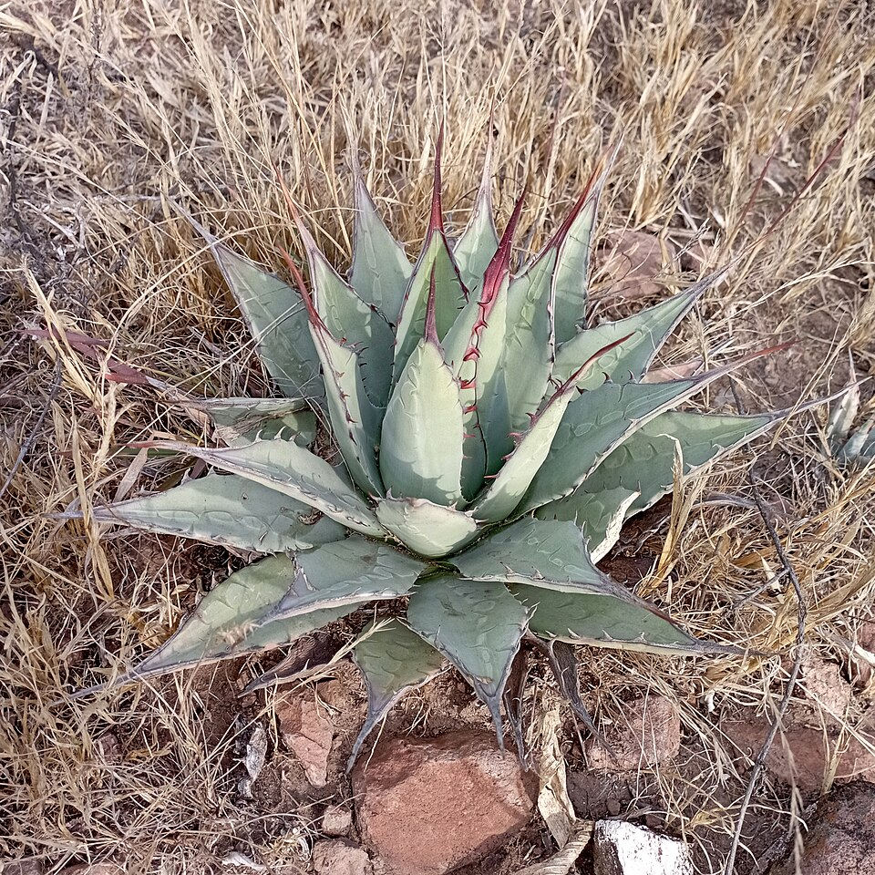
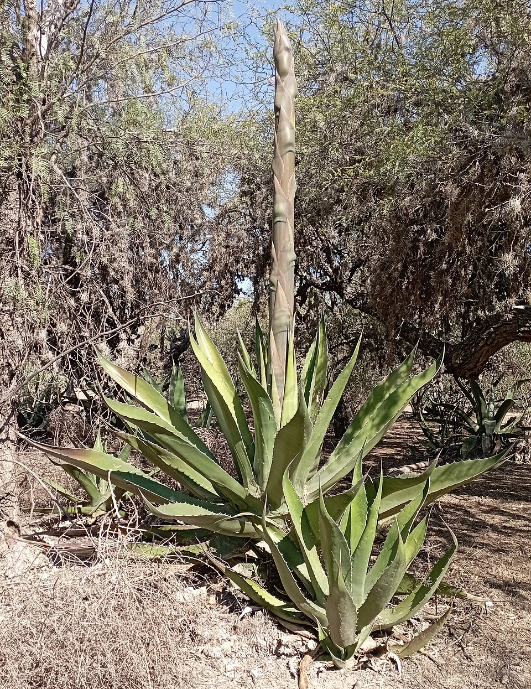

# Agave

> **Node ID**: plants.edible-plants.agave
> **Domain**: [Plants](./index.md)
> **Dependencies**: See prerequisites
> **Enables**: [`Edible Plants`](edible-plants.md)
> **Timeline**: Years 0-10
> **Outputs**: edible_plant_material
> **Critical**: No

## Overview

> *Agave applanata. Nombre común: maguey de Castilla.*

> *Image: Juan Carlos Fonseca Mata, CC BY-SA 4.0*

> *Agave salmiana. Nombre común: maguey pulquero.*

> *Image: Juan Carlos Fonseca Mata, CC BY-SA 4.0*

Agave

Agave is a cornerstone crop for arid-zone food and fiber production. Unlike grain crops that demand consistent rainfall, agave stores carbohydrates in its massive leaf rosette and heart (piña), making it a reliable calorie source in dryland regions where seasonal rains are unpredictable. The same plant yields both food and strong leaf fiber, giving it unusually high value per unit of land and water.

Primary outputs: `edible_plant_material` from roasted piña flesh, with secondary outputs of `plant_fiber` from leaf processing. The roasted piña provides sweet, calorie-dense food, while leaf fibers produce cordage strong enough for ropes, nets, and woven goods.

Agave species are succulent plants native to arid and semi-arid regions of the Americas, ranging from the southern United States through Mexico and into northern South America. They are characterized by thick, fleshy leaves arranged in a rosette pattern, with sharp terminal spines and marginal teeth along the leaf edges. Most species are monocarpic, flowering once after 8 to 30 years of growth and then dying, though they produce offsets (pups) that continue the colony.

The genus includes over 200 recognized species, with considerable variation in size, leaf morphology, and sugar content. This diversity allows selection of species matched to local climate, soil, and intended use.

The plant has served as a multi-purpose resource for millennia. The heart (piña) of several species is roasted and eaten or fermented into beverages. Leaf fibers yield strong cordage, and the sap can be processed into sweet syrup. Agave requires minimal water once established, making it well-suited to dryland agriculture where irrigation is unavailable.

The Crassulacean Acid Metabolism (CAM) photosynthesis pathway allows agave to open its stomata at night, absorbing carbon dioxide when temperatures are lower and water loss is minimal. This adaptation gives agave water-use efficiency several times higher than conventional C3 crops. In regions receiving 250 to 500 mm of annual rainfall, agave can produce usable carbohydrate yields where corn or wheat would fail entirely.

Agave fiber (sisal, henequen) has been the basis of rope and cordage industries from pre-Columbian Mexico through the 20th century. The fiber is extracted by crushing and scraping the fleshy leaf tissue away from the bundled cellulose fibers within. After drying, these fibers can be spun directly into twine or rope without chemical treatment, making the process accessible at a Stone Age technology level.

## Prerequisites

### Materials

- Biomass

### Equipment

- Sharp machete or heavy spade for leaf removal and piña harvest
- Digging tools for pit oven construction (shovel, pick)
- Scraping blade or dull knife for fiber extraction from leaves
- Drying racks or lines for fiber processing
- Storage containers for roasted product (ceramic jars, woven baskets)

### Knowledge

- Recognition of agave species and their varying sugar content, fiber quality, and growth duration
- Understanding of pit oven construction and temperature management for piña roasting
- Skill in leaf scraping technique to extract clean fiber bundles without breakage
- Awareness of calcium oxalate crystals in fresh sap and safe handling practices
- Knowledge of local agave species, their growth habits, and optimal harvest timing
- Understanding of soil drainage requirements and companion planting with nitrogen-fixing species

### Infrastructure

- Well-drained field site with full sun exposure and sandy or rocky soil
- Pit oven or earth oven for roasting piñas, lined with stones to retain heat
- Covered drying area for fiber processing, protected from rain
- Composting area for plant waste to support soil health in planting fields
- Water access for initial plant establishment, though minimal once plants are mature
- Storage area for dried fiber bundles and roasted agave products, protected from rodents

## Process Description

Agave cultivation and processing splits into two parallel tracks: piña production for food and drink, and leaf harvest for fiber. Both tracks draw from the same plants but operate on different timelines. Piña harvest ends the plant's life, while leaf harvest for fiber can occur annually from established plants without killing them.

### Step-by-Step Procedure

1. Select planting site with well-drained soil and full sun. Plant offsets (pups) separated from mature mother plants, spacing 1.5 to 3 meters apart depending on species.
2. Irrigate sparingly during the first two months to establish roots. After establishment, rely on natural rainfall. Avoid watering established plants except during extended drought.
3. Monitor plant growth and watch for pest damage, particularly agave snout weevil. Remove and destroy affected plants to prevent spread.
4. For piña harvest: when the central rosette is well-developed (7 to 15 years), remove all leaves with a machete and sever the piña at ground level. Process within three days.
5. For fiber harvest: cut mature outer leaves at the base before flowering. Split leaves lengthwise and scrape away pulp with a dull blade to expose fiber bundles.
6. Roast piña in a stone-lined pit oven for 24 to 72 hours until flesh is uniformly tender. Wash extracted fibers and sun-dry for 3 to 7 days until brittle-stiff.

### Process Parameters

| Parameter | Range | Notes |
|-----------|-------|-------|
| Roasting time | 24-72 hours | Longer for larger piñas; until flesh is tender throughout |
| Pit temperature | Moderate-hot | Sustained heat, not open flame contact |
| Drying time (fiber) | 3-7 days | Sun-dried until fibers are brittle-stiff |
| Piña weight at harvest | 20-90 kg | Varies by species and growing conditions |
| Fiber yield per leaf | 2-5% by weight | After scraping and drying |

### Cultivation and Harvesting

Agave thrives in well-drained, sandy or rocky soils with a neutral to slightly alkaline pH. Heavy clay soils that retain water promote root rot and should be avoided. Select a site with full sun exposure; agave tolerates partial shade but grows slower and produces less sugar in the piña.

Plant offsets or seedlings at a spacing of 1.5 to 3 meters apart depending on the species and intended harvest age. Wider spacing produces larger individual plants with bigger piñas. Dig planting holes twice the width of the root ball and backfill with native soil mixed with coarse sand or gravel to improve drainage.

Water newly planted offsets sparingly, once every 10 to 14 days for the first two months until roots establish. After establishment, agave requires little supplemental irrigation in most climates. Excessive watering produces soft, weak leaves and increases susceptibility to fungal disease.

Agave matures slowly, with harvest-ready piñas forming after 7 to 15 years depending on species and growing conditions. The harvest indicator is a well-developed central rosette with leaves beginning to yellow slightly at the margins. To harvest, remove all leaves with a machete or sharp spade, working from the outside inward to expose the piña. Sever the piña at ground level. A mature piña weighs between 20 and 90 kg depending on species.

### Processing and Storage

Fresh piñas must be processed within days of harvest. For food use, roast the piña in an earth oven or pit for 24 to 72 hours until tender. The roasted flesh can be eaten directly, mashed into cakes for drying, or pressed to extract sweet juice for fermentation. Dried agave cakes store for months in a cool, dry location.

For fiber extraction, harvest mature leaves before the plant flowers. Split each leaf lengthwise and scrape away the pulpy flesh with a dull blade to reveal the fiber bundles. Wash fibers thoroughly and hang to dry in the sun for several days. Dried fibers can be spun into cordage or woven into mats and fabric.

For sap collection from species like Agave salmiana, make a cavity in the piña of a mature but still-living plant. The cavity fills with aguamiel (honey water) daily, which can be collected each morning for weeks or months. Fresh aguamiel ferments readily into pulque, a mildly alcoholic beverage. Boiled aguamiel reduces to a sweet syrup similar to maple syrup in consistency and use.

Roasted piña can be pressed through woven baskets or cloth to extract the sweet juice. This juice ferments into pulque within hours at ambient temperature, or can be distilled if distillation equipment is available to produce mezcal. The pressed fiber residue from juice extraction is edible and can be dried into cakes for storage.

## Safety Considerations

Working with agave involves hazards from the plant itself and from the processing methods:

- Allergic reactions to plant compounds, particularly sap contact dermatitis
- Improper preparation toxicity — raw agave piña contains saponins and oxalate crystals that cause digestive distress
- Tool injuries during harvesting — machete cuts are common during leaf removal
- Pest exposure — agave snout weevil larvae can cause secondary skin infections if handled
- Soil-borne pathogens, particularly in clay-heavy soils with poor drainage
- Leaf spine puncture wounds that can become infected if not cleaned promptly

### Personal Protective Equipment

- Leather gloves with gauntlet cuffs for leaf trimming — agave spines can puncture lightweight gloves
- Long sleeves and pants to prevent sap contact with skin
- Eye protection when trimming leaves near face level to guard against spine tips
- Heat-resistant gloves when retrieving piñas from pit oven
- Sturdy boots with thick soles for field work around spiny plants
- Long-handled tools to maintain safe distance from sharp leaf tips during harvest

### Emergency Procedures

- For sap contact: wash affected skin immediately with soap and water. Sap contains calcium oxalate crystals that cause burning and blistering with prolonged contact
- For machete lacerations: apply direct pressure, elevate the wound, and seek medical attention for deep cuts. Agave sap contaminating open wounds increases infection risk
- For pit-oven roasting: maintain clear zones around the cooking pit to prevent falls into heated areas. Use long-handled tools for placing and retrieving piñas
- For spine puncture wounds: clean thoroughly with soap and water, remove any broken spine fragments, and monitor for infection over the following days
- Keep first aid supplies including bandages, antiseptic, and tweezers for spine removal accessible in the field

## Quality Control

### Acceptance Criteria

- **Roasted piña**: Flesh should be uniformly amber-brown, tender when pressed, free of charred or uncooked portions
- **Agave fiber**: Should be cream to pale yellow, free of residual pulp, minimum practical length of 30 cm for cordage use
- **Dried agave cakes**: Should hold together when handled, sweet taste without bitterness, no mold growth

### Testing Methods

- Visual inspection of piña flesh color and texture — properly roasted flesh is amber-brown and fibrous, not charred or raw-white
- Taste testing of roasted product for sweetness and absence of bitter compounds
- Fiber tensile testing by hand: good-quality dried fiber should resist breaking when pulled with moderate force
- Visual grading of fiber length, color uniformity, and absence of residual pulp
- Snap test for dried cakes: should break cleanly without crumbling to dust

### Sampling Protocol

For plantation-scale production, inspect every 10th piña from each harvest batch for moisture content and sugar concentration. Grade fiber batches by pulling test samples from each drying rack — fibers that break under hand tension indicate incomplete processing or over-drying. Document pest damage incidence per field section to identify problem areas for treatment. Record piña weight and fiber yield per plant to track productivity trends across growing seasons.

## Scaling Notes

Agave production scales from household gardens to plantations, but the long maturation period demands forward planning measured in decades, not seasons.

- **Bench scale**: Individual plants in a garden plot. Output for direct consumption and fiber. Single piñas harvested as each plant matures.
- **Pilot scale**: Field planting of 50 to 200 plants. Staggered planting ages provide annual harvest. Tens to hundreds of piñas per year.
- **Production scale**: Plantation with thousands of plants in various growth stages. Mechanized leaf harvesting and fiber processing. Hundreds of tonnes of piñas per year.

Key scaling challenges: long maturation period requires staggered plantings over many years, field pests (agave snout weevil) can devastate monoculture plantings, and post-harvest processing capacity must match harvest volume to avoid spoilage of fresh piñas.

For fiber production at scale, the critical bottleneck is scraping capacity. Each leaf requires individual splitting and scraping to extract the fiber, a process that takes several minutes per leaf by hand. Mechanized decortication machines exist for sisal processing but require metalworking capability to build. At Stone Age technology levels, fiber processing remains a labor-intensive manual operation, limiting the volume of fiber that can be produced per worker per day.

## Troubleshooting

| Problem | Probable Cause | Solution |
|---------|---------------|----------|
| Piña flesh raw and bitter | Insufficient roasting time or low pit temperature | Extend roasting; verify pit insulation |
| Fiber breaks during extraction | Leaves harvested too young or over-dried | Harvest mature leaves; adjust scraping technique |
| Root rot in field | Poorly drained soil or overwatering | Improve drainage; reduce irrigation frequency |
| Pest infestation (snout weevil) | Overcrowded planting; lack of field sanitation | Remove affected plants; increase spacing |
| Sap dermatitis | Direct skin contact with fresh sap | Wear gloves; wash immediately after contact |

## Variations and Alternatives

- **Agave americana** (century plant): Large ornamental species with substantial piña. Widely naturalized. Fiber quality is moderate; piña is bitter and requires extended roasting.
- **Agave tequilana** (blue agave): Primary cultivar for distilled spirit production. High sugar content in the piña. Requires 5 to 8 years to maturity in ideal conditions.
- **Agave sisalana** (sisal): Grown primarily for fiber production. Leaves yield long, strong fibers suitable for rope and twine. Lower sugar content in the piña.
- **Agave salmiana** (green maguey): Used for aguamiel (sap) collection. The live plant is tapped by cutting a cavity in the heart, and sap flows daily for months.
- **Agave angustifolia** (espadín): Widely cultivated for mezcal production. Adaptable to various soil types and elevations. Moderate piña size with good sugar yield.
- **Alternative starch/sugar sources**: Sweet potato, cassava, or sugar cane may provide faster carbohydrate yields where growing seasons permit.

## References

- [Edible Plants](edible-plants.md) — parent capability
- [Plants Domain](./index.md) — domain overview and related capabilities
- [Textiles / Rope Making](../textiles/rope-making.md) — agave fiber cordage and rope production
- [Food Processing / Brewing](../food-processing/brewing.md) — fermented agave juice (pulque, mezcal)

### Material Handling

Fresh piñas are highly perishable and must be roasted or processed within three days of harvest. Dried agave products (cakes, fiber) store well in low-humidity conditions for months. Fermenting juice should be monitored daily for off-odors indicating contamination. Fiber should be stored in bundles hung off the ground to prevent mold and insect damage. Compost leaf scrapings and spent piña material to return organic matter to planting areas.

Label dried fiber bundles with harvest date and species. Track piña sugar content by season to optimize harvest timing. Spent leaves from fiber extraction make excellent mulch or compost feedstock, returning organic matter to the agave fields.

Agave provides one of the few reliable carbohydrate sources for arid-zone subsistence. Where rainfall is too scarce or too unpredictable for grain agriculture, agave plantations can sustain communities across decades. The long maturation period, far from being a drawback, provides a built-in storage mechanism: a plantation with staggered ages produces a steady annual harvest from plants that have been accumulating carbohydrates for 7 to 15 years. This slow-burn productivity is well-suited to the tempo of arid-land agriculture.

For fiber spinning, agave fibers are best worked while still slightly pliable, before they become fully brittle. Roll fibers against the thigh with the palm of the hand to twist them into a continuous strand. Two or more strands can be plied together by twisting them in the opposite direction. The resulting cordage is strong, rot-resistant, and suitable for fishing nets, bowstrings, and load-bearing rope. Agave fiber cordage was the standard rope material in pre-Columbian Mesoamerica, used for everything from construction to ship rigging.
---
*Part of the [Bootciv Tech Tree](../../index.md) · [Plants](./index.md) · [All Domains](../../index.md)*
