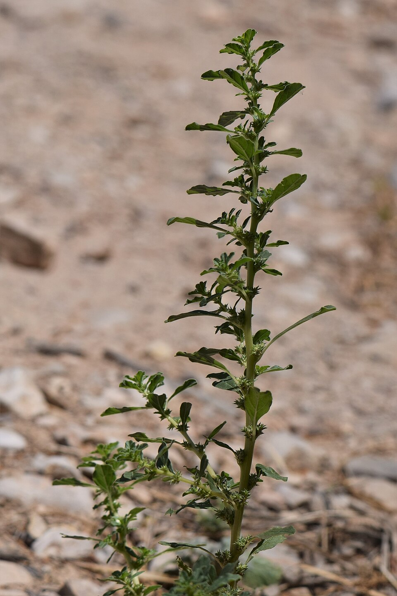

# Amaranthus albus

> **Node ID**: plants.fiber-plants.amaranthus-albus
> **Domain**: [Plants](./index.md)
> **Dependencies**: See prerequisites
> **Enables**: [`Fiber Plants`](fiber-plants.md)
> **Timeline**: Years 0-10
> **Outputs**: plant_fiber
> **Critical**: No

## Overview

> *Amaranthus albus at Wadi Mujib in Jordan*

> *Image: Krzysztof Ziarnek, Kenraiz, CC BY-SA 4.0*

> *Amaranthus albus at Wadi Mujib in Jordan*

> *Image: Krzysztof Ziarnek, Kenraiz, CC BY-SA 4.0*

Amaranthus albus is an annual species of flowering plant native to the Americas. Its common names include common tumbleweed , tumble pigweed , tumbleweed , prostrate pigweed , pigweed amaranth , white amaranth and white pigweed

Tumble pigweed is an unglamorous plant that earns its keep through sheer productivity. It sprouts in disturbed soil without any encouragement, produces edible protein-rich seeds, and yields stem fiber coarse enough for rope. Where more demanding crops fail, amaranth still grows. The mature plant's habit of detaching at the base and tumbling across the landscape, scattering seeds as it goes, is both its weed reputation and its seeding strategy.

Primary outputs: `plant_fiber` from retted stems, suitable for coarse cordage and matting. Secondary outputs include edible seeds high in complete protein and leaves usable as cooked greens.

White pigweed is a fast-growing annual producing branching stems 20 to 80 cm tall with pale green to white-tinged leaves. The plant is notable for its drought tolerance and ability to thrive in disturbed soils, roadsides, and waste ground. The mature plant detaches at the base and tumbles in the wind, scattering seeds across a wide area — the origin of the tumbleweed common name.

While primarily known as a weed, the stems yield coarse fibers suitable for cordage and rough matting when retted and processed. The seeds are also edible and nutritionally dense, containing high-quality protein. The dual utility of fiber and food makes this plant a practical multi-purpose crop for low-input agriculture.

Amaranthus albus uses the C4 photosynthetic pathway, which gives it a significant efficiency advantage over C3 plants in hot, sunny conditions. The plant fixes carbon dioxide into four-carbon compounds before passing it to the Calvin cycle, reducing photorespiration losses at high temperatures. This metabolic advantage means tumble pigweed grows faster and produces more biomass per unit of water than most common weeds and many cultivated crops in warm conditions.

The seeds contain 14 to 18 percent protein by weight, and that protein is notable for containing adequate levels of all essential amino acids, including lysine, which is deficient in most cereal grains. This makes amaranth seed a nutritionally complete protein source, rare among plant foods. The seeds also contain significant quantities of iron, calcium, and magnesium. The leaves, when young and tender, provide vitamins A and C when cooked as greens.

## Prerequisites

### Materials

- Biomass

### Equipment

- Sickle or scythe for stem harvest
- Retting tank or pit with water supply
- Wooden mallet or blunt beater for fiber separation
- Drying racks or lines for processed fiber

### Knowledge

- Understanding of retting timing for annual stem fiber crops, where over-retting weakens fiber and under-retting makes separation difficult
- Skill in seed harvest timing to catch seed heads before the plant dries completely and shatters
- Familiarity with winnowing technique to separate amaranth's small seeds from chaff
- Knowledge of C4 photosynthesis and warm-season growth patterns that distinguish amaranth from cool-season fiber crops
- Knowledge of retting timing for annual stem fiber crops
- Understanding of seed harvest timing to prevent premature seed shatter

### Infrastructure

- Field or plot in full sun with minimal competition from perennials
- Retting area with access to clean water
- Dry storage for fiber bundles and cleaned seed
- Warm-season growing period with soil temperatures above 15 degrees Celsius for germination
- Threshing floor or hard clean surface for seed processing
- Drying area with protection from birds during seed maturation

## Process Description

Amaranthus albus is a warm-season annual that grows from seed to maturity in a single season. The fiber and seed tracks run in parallel: stems are harvested at full height for fiber, while seed heads are collected before the plant dries enough to shatter. Retting and decortication convert stems into usable fiber, while threshing and winnowing clean the seed for food use.

### Step-by-Step Procedure

1. Broadcast seed in prepared soil after frost danger passes and soil has warmed. Rake lightly to cover. No special soil preparation needed beyond loosening the surface.
2. Thin seedlings to 10 to 15 cm apart for maximum stem size. The plant requires no irrigation after establishment in most climates.
3. Allow stems to grow to full height and begin to lignify. For seed production, harvest seed heads before the plant dries completely to prevent loss from shattering.
4. For fiber: cut stems at ground level with a sickle or scythe. Bundle securely and submerge in water for retting.
5. Check retting progress every few days after the first week. When fibers separate from the woody core when bent and pulled, remove bundles, rinse, and dry.
6. Break dried stems with a wooden mallet to separate shives from fiber. Pull fibers free by hand, hackle to align, and store in bundles for spinning or plaiting.

### Process Parameters

| Parameter | Range | Notes |
|-----------|-------|-------|
| Stem maturity | Late season, pre-seed drop | Stems fully lignified for fiber strength |
| Retting time | 7-21 days | Depends on water temperature |
| Seed harvest | When seed heads begin to dry | Before plants tumble |
| Fiber length (typical) | 15-30 cm | Depends on stem height |
| Seed yield per plant | 5-20 g | Varies with plant size and competition |

### Cultivation and Harvesting

Broadcast seed in prepared soil after frost danger passes in spring. Amaranthus albus germinates readily in warm soil and tolerates poor conditions. No special soil preparation is needed beyond loosening the surface. Thin seedlings to 10 to 15 cm apart for maximum stem size. The plant requires no irrigation after establishment in most climates.

For fiber production, allow stems to grow to full height and begin to dry before harvest. Cut stems at ground level with a sickle or scythe. For seed production, harvest seed heads before the plant dries completely to prevent seed loss from shattering.

Bundle cut stems and tie securely. If saving seed, thresh the seed heads against a hard surface or walk over them on a clean floor. Winnow to separate seed from chaff.

### Fiber Extraction

Submerge stem bundles in water for retting. Check progress every few days after the first week by testing a few stems — when fibers separate from the woody core when bent and pulled, retting is complete. Remove bundles, rinse in clean water, and dry in the sun.

Once dry, break the stems by beating with a wooden mallet to separate the woody core (shives) from the fiber. Pull the fibers free by hand, removing remaining shive fragments. Hackle or comb the fibers to align them and remove short pieces. The resulting fiber is coarse but suitable for rope, twine, and coarse fabric.

For seed processing, thresh dried seed heads against a hard surface or walk over them on a clean floor. Winnow to separate seed from chaff by pouring the mixture from one container to another in a light breeze. The small, round seeds are heavier than chaff and fall straight while the lighter material blows away. Repeat winnowing until seeds are visibly clean with no chaff debris. Cooked amaranth seeds can be prepared like a porridge by boiling in water for 20 to 25 minutes, or they can be popped by heating in a dry pan until they pop like miniature popcorn.

## Safety Considerations

Amaranth processing involves field tools and retting water, both of which carry hazards:

- Allergic reactions to plant compounds — pollen can trigger hay fever in sensitive individuals during the flowering period
- Improper preparation toxicity — amaranth seeds contain oxalates; cooking or soaking reduces these compounds
- Tool injuries during harvesting — cuts from sickle or scythe
- Pest exposure — pigweed can host crop pests that affect nearby food crops
- Soil-borne pathogens — minimal risk; the plant grows in disturbed soils
- Retting water contamination — stagnant retting water contains high bacterial loads

### Personal Protective Equipment

- Waterproof gloves for retting operations
- Dust mask when processing dried stems or winnowing seed
- Gloves and long pants when using sickle or scythe
- Eye protection when winnowing to keep chaff and dust out of eyes
- Sturdy footwear for field work with cutting tools

### Emergency Procedures

- For sickle or scythe cuts: apply direct pressure, clean the wound, and bandage. Seek medical attention for deep lacerations.
- For retting water contact with broken skin: wash immediately with clean water and soap. Monitor for signs of infection.
- For dust inhalation during winnowing: move upwind or to fresh air. Wear a dust mask for future processing.
- Keep first aid supplies including bandages, antiseptic, and clean water for wound irrigation near the field and processing areas.

## Quality Control

### Acceptance Criteria

- **Dried fiber**: Light-colored, free of shive fragments, minimum practical length 15 cm
- **Cleaned seed**: Free of chaff and debris, uniform dark color, no mold or insect damage
- **Cordage**: Holds together under moderate tension without fraying

### Testing Methods

- Fiber tensile test: hand-pull a sample — adequate fiber resists moderate force
- Seed germination test: sprout a sample of 50 seeds to verify viability
- Visual inspection for remaining shive fragments adhering to fiber bundles
- Winnowing completeness test: no visible chaff among cleaned seeds
- Moisture test for seeds: bite test should produce a hard crunch, not a soft chew

### Sampling Protocol

For seed production, test germination rate from each harvest batch. For fiber, test retting completeness on sample stems from each bundle before full processing. Record yield per square meter for both seed and fiber to track productivity across seasons and soil conditions.

## Scaling Notes

Amaranthus albus scales readily due to its aggressive growth and minimal input requirements, but retting capacity limits throughput.

- **Bench scale**: Small plot of 5 to 20 square meters. Manual harvest and retting in a basin. Small fiber bundles and handfuls of seed.
- **Pilot scale**: Field plot of 100 to 500 square meters. Batch retting in a dedicated tank. Several kilograms of fiber and tens of kilograms of seed per season.
- **Production scale**: Multi-hectare planting. Mechanized harvest and dedicated retting ponds. Tonnes of seed and hundreds of kilograms of fiber per season.

Key scaling challenges: seed shatter losses increase with delayed harvest at scale. Retting throughput is limited by tank capacity and water availability. Fiber quality decreases with over-retting, requiring careful timing across large batches.

The tumbleweed habit that makes Amaranthus albus a notorious weed is also its seeding mechanism. A single mature plant produces 50,000 to 100,000 seeds, and the tumbling plant scatters these across a wide area as it rolls. For cultivation, this means volunteer plants appear readily in subsequent seasons in the same area. In a managed planting, allow some plants to mature and tumble to reseed the plot for the following year. The seeds remain viable in soil for several years, creating a persistent seed bank.

## Troubleshooting

| Problem | Probable Cause | Solution |
|---------|---------------|----------|
| Fiber breaks during extraction | Over-retting or immature stems | Reduce retting time; harvest at full maturity |
| Fiber difficult to separate | Under-retting | Extend retting time; verify water quality |
| Low seed yield | Early harvest or bird predation | Harvest earlier; use netting to protect seed heads |
| Stem lodging (falling over) | Crowded planting or wind exposure | Thin seedlings; plant in sheltered location |
| Weedy contamination in seed | Poor winnowing | Re-winnow or use finer sieves |

## Variations and Alternatives

- **Wild harvest**: Collecting naturally occurring plants from waste ground. No cultivation needed, but supply is unpredictable.
- **Amaranthus hypochondriacus** (Prince of Wales feather): Cultivated amaranth with larger seed heads and higher grain yield. Stems also produce fiber but the plant requires more water and richer soil.
- **Amaranthus retroflexus** (redroot pigweed): Similar growth habit, coarser fiber. Common weed species in temperate agriculture. Seeds equally edible.
- **Other annual fiber crops**: Flax, hemp, and jute produce superior fiber quality and yield but require more consistent moisture and soil fertility.
- **Dual-purpose cultivation**: Harvest seed heads first for grain, then cut stems for fiber processing. This two-pass approach maximizes output per unit area.

### Seed Processing Notes

Amaranth seed is small and requires careful winnowing to achieve clean grain for food use. Rub dried seed heads between the palms to release seeds, then pour the mixture from one container to another in a light breeze. The chaff blows away while the heavier seed falls into the receiving container. Repeat until seed is visibly clean.

## References

- [Fiber Plants](fiber-plants.md) — parent capability
- [Plants Domain](./index.md) — domain overview and related capabilities
- [Fiber Plants](fiber-plants.md) — downstream capability

### Material Handling

Store dried fiber in breathable bundles hung off the ground. Keep seed in airtight containers in a cool, dry location to prevent mold and insect damage. Processed amaranth seed stores well for one to two years under good conditions. Retting waste (spent shives and stem fragments) can be composted or used as mulch.

Amaranth seed is a complete protein source containing all essential amino acids, making it nutritionally superior to most cereal grains. This dual food-and-fiber value makes it a practical crop for self-sufficient agricultural systems.

The young leaves of Amaranthus albus can be harvested before the plant flowers and cooked as a spinach substitute. The leaves are rich in vitamins A and C, iron, and calcium. Like the seeds, the leaves contain oxalates that are reduced by cooking. Boil the leaves for 5 to 10 minutes in ample water and discard the cooking water. This preparation method is standard for all amaranth leaf consumption across cultures that use the plant as a green vegetable.

Amaranth was a staple grain crop of pre-Columbian Mesoamerica, though Amaranthus albus was less important than the larger-seeded species like A. hypochondriacus and A. cruentus. Nevertheless, the genus as a whole represents one of the few non-cereal grain crops domesticated in the Americas. The seeds can be popped, ground into flour, or cooked as a porridge, providing a gluten-free grain alternative that was largely displaced by European cereals after colonization but is experiencing renewed interest for its nutritional qualities.

For seed production at scale, the main challenge is harvest timing. Amaranthus albus begins dropping seeds as soon as the seed heads dry, and the entire plant may detach and tumble away before all seeds are collected. Harvest seed heads when they begin to dry but before they open fully. Cut the entire seed head with a short stem and place it in a paper bag to finish drying. The seeds release from the head as it dries, collecting in the bag bottom.

The C4 photosynthetic pathway that makes amaranth so productive in heat also means it struggles in cold conditions. Seeds will not germinate in soil temperatures below 15 degrees Celsius, and seedlings are killed by even light frost. This temperature sensitivity limits the growing season in temperate climates but poses no constraint in tropical and subtropical regions where amaranth is most valuable as a crop. In temperate areas, start seeds indoors two to three weeks before the last frost date and transplant seedlings when soil has warmed.

The plant's tumbleweed habit, while convenient for seed dispersal, creates a management challenge in cultivated settings. Plants that are left to mature and detach can scatter seeds into neighboring fields and gardens, creating unwanted volunteer plants. For controlled production, harvest all plants before they dry completely and detach from the root. This practice also maximizes seed recovery, as the seeds are still held in the seed heads when the plants are cut.
### Amaranthus albus Summary

---
*Part of the [Bootciv Tech Tree](../../index.md) · [Plants](./index.md) · [All Domains](../../index.md)*
