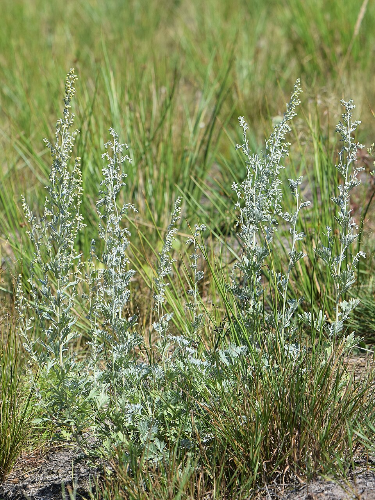

# Artemisia absinthium

> **Node ID**: plants.edible-plants.artemisia-absinthium
> **Domain**: [Plants](./index.md)
> **Dependencies**: See prerequisites
> **Enables**: [`Edible Plants`](edible-plants.md)
> **Timeline**: Years 0-10
> **Outputs**: edible_plant_material
> **Critical**: No

## Overview

> *Artemisia absinthium in Brzozowo, NW Poland*

> *Image: Krzysztof Ziarnek, Kenraiz, CC BY-SA 4.0*

> *Artemisia absinthium in Brzozowo, NW Poland*

> *Image: Krzysztof Ziarnek, Kenraiz, CC BY-SA 4.0*

Artemisia absinthium , otherwise known as common wormwood , is a species of Artemisia native to North Africa and temperate regions of Eurasia , and widely naturalized in Canada and the northern United States

Wormwood is one of the most intensely bitter plants in common cultivation. That bitterness, produced by absinthin and other sesquiterpene lactones, is both its medicinal value and its primary hazard. Small amounts stimulate digestion and expel intestinal parasites; larger doses cause neurological symptoms from thujone toxicity. The line between therapeutic bitter and poison is a matter of precise dosing.

Primary outputs: `edible_plant_material` used as a bittering agent in spirits, liqueurs, and traditional medicinal preparations. The intensely bitter leaves and flowering tops are never eaten as food directly but serve as flavoring and medicinal agents in carefully measured quantities.

Common wormwood is a perennial herb growing 50 to 120 cm tall, with deeply divided, silvery-gray leaves and small yellow flower heads arranged in loose panicles. All parts of the plant are intensely aromatic and extremely bitter due to the presence of absinthin and other sesquiterpene lactones. The plant has been cultivated for millennia as a flavoring agent, bittering herb, and vermifuge.

The species thrives in poor, dry, well-drained soils and full sun. It tolerates drought, alkaline conditions, and neglect, making it one of the easiest culinary herbs to maintain. The intense bitterness limits direct consumption, but small quantities are used to flavor spirits (absinthe, vermouth), bitter liqueurs, and traditional medicinal preparations across European and North African cultures.

The primary bitter compound, absinthin, is one of the most bitter substances known. A dilution of 1 part in 70,000 parts water is still detectable by taste. This extreme bitterness means that very small quantities of wormwood suffice for flavoring. A single leaf can bitter an entire bottle of spirits. The companion bitter compound anabsinthin and the essential oil components thujone and chamazulene contribute additional flavor complexity and the characteristic aroma.

Wormwood's allelopathic properties are among the strongest of any common garden herb. Water-soluble compounds exuded from its roots suppress seed germination and root growth of neighboring plants within a radius of roughly one meter. This self-defense mechanism reduces competition in the wild but means wormwood must be planted in isolation from sensitive crops. Beans, peas, and carrots are particularly susceptible to wormwood allelopathy.

## Prerequisites

### Materials

- Biomass

### Equipment

- Sharp scissors or pruning shears for harvest
- Drying racks or screens
- Glass jars or ceramic containers for storage
- Mortar and pestle or grinding stones for powdering dried herb

### Knowledge

- Understanding of thujone toxicity thresholds and safe dosing for wormwood preparations
- Recognition of harvest timing for peak essential oil and bitter compound concentration
- Skill in tincture and maceration techniques for extracting bitter compounds into alcohol
- Awareness of wormwood's allelopathic properties and need for isolated planting locations
- Knowledge of proper dosing — wormwood preparations can be toxic in excess
- Understanding of harvest timing for optimal essential oil concentration

### Infrastructure

- Well-drained garden plot or field with full sun and poor to moderate soil
- Drying area protected from direct sun and moisture
- Airtight storage containers for dried herb and powdered material
- Isolated planting area at least one meter from sensitive garden crops due to allelopathic root exudates
- Amber glass bottles for tincture storage
- Cool, dark storage cabinet for finished preparations

## Process Description

Wormwood processing follows a simple herb workflow: harvest at peak oil concentration, shade-dry to preserve volatile compounds, then prepare as dried herb, powder, or alcohol tincture. The critical variable is harvest timing: too early and the plant lacks full bitterness, too late and oil content declines. The secondary concern is preserving volatile oils during drying by avoiding direct sun exposure.

### Step-by-Step Procedure

1. Establish plants from seed, cuttings, or root division in lean, well-drained soil with full sun. Space 40 to 60 cm apart. Avoid rich soil, which produces lush but less aromatic growth.
2. Allow plants to mature through spring. Cut back woody growth in late autumn or early spring to encourage fresh basal shoots.
3. Harvest aerial parts when flower buds are forming but before full bloom. Cut stems 15 to 20 cm above the ground. A healthy plant produces two to three harvests per growing season.
4. Bundle harvested stems and hang upside down in a warm, well-ventilated area away from direct sunlight. Alternatively, spread stems on drying screens.
5. When fully dry (leaves crumble easily, stems snap), strip leaves and flower heads from stems by rubbing through a coarse screen. Store whole dried herb in airtight glass jars.
6. For tincture: pack dried herb into a glass jar, cover with alcohol, steep for two to four weeks in darkness. Strain through cloth into amber glass bottles.

### Process Parameters

| Parameter | Range | Notes |
|-----------|-------|-------|
| Harvest timing | Pre-flower to early flower | Peak essential oil concentration |
| Drying method | Shade, ambient temperature | Direct sun degrades volatile oils |
| Drying time | 5-10 days | Until stems are brittle |
| Tincture steeping | 2-4 weeks | In dark location, shaking occasionally |
| Thujone content | Regulated substance | Internal use restricted in many jurisdictions |

### Cultivation and Harvesting

Wormwood grows readily from seed, cuttings, or root division. Sow seeds on the surface of prepared soil in spring — they need light to germinate. Space plants 40 to 60 cm apart. The plant thrives in lean, well-drained soil and full sun. Rich soil or excessive watering produces lush but less aromatic growth with lower oil concentration.

Established plants are long-lived perennials that require minimal care. Cut back woody growth in late autumn or early spring to encourage fresh basal shoots. Wormwood's strong aroma repels many garden pests, making it a useful companion plant in vegetable gardens and orchards.

Harvest aerial parts when flower buds are forming but before full bloom. At this stage, essential oil and bitter compound concentrations peak. Cut stems 15 to 20 cm above the ground, leaving enough growth for the plant to recover. Use clean, sharp tools. A healthy plant produces two to three harvests per growing season.

### Processing and Storage

Bundle harvested stems and hang upside down in a warm, well-ventilated area away from direct sunlight. Alternatively, spread stems on drying screens. The herb is fully dry when leaves crumble easily and stems snap.

Once dry, strip leaves and flower heads from the stems by rubbing through a coarse screen. Store whole dried herb in airtight glass jars in a cool, dark location. For powder, grind small batches as needed using a mortar and pestle — pre-ground powder loses potency faster than whole herb.

For bitter tincture preparation, pack dried herb into a glass jar, cover with alcohol, and steep for two to four weeks in a dark location. Strain through cloth and store in amber glass bottles.

For absinthe-style spirit preparation, macerate dried wormwood herb and complementary herbs (anise, fennel) in high-proof alcohol for several days. The wormwood contributes bittering agents and thujone, while anise and fennel provide the characteristic licorice flavor. After maceration, strain and dilute to drinking strength. Traditional absinthe production involves a secondary coloring step using additional herbs, but the basic bitter spirit is functional without it. Caution: thujone content must be controlled by limiting wormwood quantity and maceration time.

## Safety Considerations

Wormwood's thujone content makes it one of the more hazardous common garden herbs:

- Allergic reactions to plant compounds — wormwood pollen and essential oil can cause contact dermatitis
- Improper preparation toxicity — thujone, a compound in wormwood, is neurotoxic in large doses. Chronic consumption of thujone-containing preparations can cause seizures and kidney damage. Use in strict moderation.
- Tool injuries during harvesting — cuts from pruning shears
- Pest exposure — minimal; the plant's bitter compounds deter most pests
- Soil-borne pathogens — root rot in poorly drained soils
- Essential oil inhalation — concentrated wormwood oil can cause headaches and nausea

### Personal Protective Equipment

- Gloves when harvesting to prevent skin sensitization from essential oils
- Dust mask when grinding dried herb or handling powder in quantity
- Long sleeves if sensitive to essential oil contact dermatitis
- Eye protection when cutting large quantities of flowering stems
- Standard hand protection when using pruning shears

### Emergency Procedures

- For essential oil skin contact: wash thoroughly with soap and water
- For suspected thujone poisoning (seizures, hallucinations): seek immediate medical attention. Do not induce vomiting.
- For dust inhalation during grinding: move to fresh air. Wear a mask for future processing.
- Keep poison control information accessible. Label all wormwood preparations clearly with thujone content warnings.

## Quality Control

### Acceptance Criteria

- **Dried herb**: Silvery-green color, intense bitter aroma, free of mold and foreign matter
- **Powdered herb**: Fine texture, strong aroma, no clumping or moisture
- **Tincture**: Clear green-amber liquid, intensely bitter taste, no sediment

### Testing Methods

- Aroma assessment: properly dried herb should have a strong, characteristic bitter scent
- Bitterness test: a small taste of leaf tip should produce immediate, intense bitterness
- Color check: silvery-green color should be retained, not faded to brown
- Tincture potency test: a single drop on the tongue should produce prolonged bitter aftertaste
- Moisture test: leaves should crumble readily, not feel leathery or pliable

### Sampling Protocol

For tincture production, test each batch for consistent bitterness by comparing a diluted sample against a reference standard. Track year-over-year yield per plant and oil concentration trends. Record drying conditions and duration for each batch to correlate with potency retention.

## Scaling Notes

Wormwood is easy to grow in quantity but its allelopathic properties create spacing constraints at scale.

- **Bench scale**: Garden plot with 5 to 20 plants. Manual harvest and air drying. Individual herb bundles and small tincture batches.
- **Pilot scale**: Field planting of 50 to 200 plants. Staggered harvest timing. Tens of kilograms of dried herb per season.
- **Production scale**: Row plantings of several hundred to a thousand plants. Semi-mechanized harvest. Hundreds of kilograms of dried herb per season.

Key scaling challenges: wormwood's strong allelopathic properties inhibit growth of nearby plants, requiring isolated field sections. Essential oil concentration drops in rich soils, requiring deliberate soil management to maintain quality at scale.

Wormwood has a long and controversial history as the primary flavoring agent in absinthe, the green spirit that was banned in many countries during the early 20th century due to concerns about thujone toxicity. Modern analysis has shown that properly produced absinthe contains thujone levels well below toxic thresholds, and the bans were likely driven more by the drink's high alcohol content and cultural associations than by genuine pharmacological danger. Nevertheless, thujone is a real neurotoxin, and concentrated wormwood preparations demand the same respect given to any potent herbal medicine.

## Troubleshooting

| Problem | Probable Cause | Solution |
|---------|---------------|----------|
| Low oil concentration | Rich soil or excessive watering | Reduce fertility; cut irrigation |
| Loss of silver leaf color | Too much shade or nitrogen | Move to sunnier location; reduce fertilizer |
| Woody, unproductive growth | Age or lack of pruning | Cut back hard in spring; replace very old plants |
| Root rot | Poor drainage | Improve soil drainage; transplant to raised bed |
| Herb turns brown during drying | Too much sun or humidity | Move drying racks to shade; improve ventilation |

## Variations and Alternatives

- **Wild harvest**: Collecting from naturalized populations. Free and requires no cultivation, but sustainability and contamination risk must be monitored.
- **Garden cultivation**: Controlled planting for reliable supply and consistent quality. Easy to maintain once established.
- **Artemisia pontica** (Roman wormwood): Milder bitterness, used in traditional vermouth production. Less hardy but more refined flavor.
- **Artemisia annua** (sweet wormwood): Annual species, source of artemisinin for malaria treatment. Different growth habit but similar cultivation requirements.
- **Alternative bittering herbs**: Gentian root, hops, and centaury provide bitter flavoring with different safety profiles. Gentian is non-toxic and preferred where thujone risk is a concern.

### Allelopathy Note

Wormwood releases water-soluble compounds from its roots and leaves that inhibit the germination and growth of nearby plants. This allelopathic effect reduces competition in wild populations but can suppress growth of neighboring crops in mixed plantings. Plant wormwood at least one meter from sensitive garden crops.

## References

- [Edible Plants](edible-plants.md) — parent capability
- [Plants Domain](./index.md) — domain overview and related capabilities
- [Edible Plants](edible-plants.md) — downstream capability

### Material Handling

Dried wormwood herb should be stored in airtight, opaque glass jars in a cool, dark location. Essential oils degrade with light and heat exposure. Label all tincture bottles clearly with concentration and date of preparation. Keep all wormwood preparations out of reach of children due to thujone toxicity risk. Spent herb from tincture production can be composted.

Wormwood has been cultivated in European monastic gardens since the early Middle Ages, valued both as a medicinal bitter and as a strewing herb to repel insects from living spaces. The plant's strong aroma keeps moths from woolens and fleas from bedding when dried branches are placed in storage chests and mattresses. This insect-repellent property, combined with its medicinal value, made wormwood one of the most commonly grown herbs in pre-industrial Europe.

In traditional European herbalism, wormwood was classified as a "bitter" — one of the basic flavor categories used to describe medicinal actions. Bitters were prescribed to stimulate appetite, promote bile flow, and improve digestion. This classification persisted from Dioscorides through the medieval herbal tradition and into 19th-century pharmacopoeias. The underlying pharmacology involves stimulation of bitter taste receptors on the tongue, which triggers a vagal nerve reflex that increases gastric secretions and digestive motility.

The plant also has a long history of use as a vermifuge (deworming agent). Wormwood's common name derives from this application. The bitter compounds, particularly absinthin, are toxic to intestinal parasites at concentrations that are tolerable to the human host. Traditional preparations involved drinking a strong decoction of dried herb on an empty stomach for several consecutive days. This use has largely been replaced by modern anthelmintic drugs but remains part of the traditional herbal repertoire in many cultures.

The silvery-gray leaf color that makes wormwood visually distinctive is produced by a dense covering of fine white hairs (trichomes) on the leaf surface. These hairs reflect sunlight and reduce water loss through transpiration, an adaptation to the dry, sunny habitats the plant prefers. The same trichomes contain the essential oil glands that produce the plant's characteristic aroma. Leaves grown in full sun with minimal water develop the densest trichome covering and the highest essential oil content.

Wormwood can be propagated by root division in addition to seed and cuttings. Established plants develop a woody root crown that can be divided in early spring before new growth begins. Each division should include several growing buds and a portion of the root system. Replant divisions at the same depth as the parent plant. Root division produces mature plants faster than seed propagation and is the preferred method for maintaining specific chemotypes or high-oil-producing individuals.
### Artemisia absinthium Summary

---
*Part of the [Bootciv Tech Tree](../index.md) · [Plants](./index.md) · [All Domains](../index.md)*
