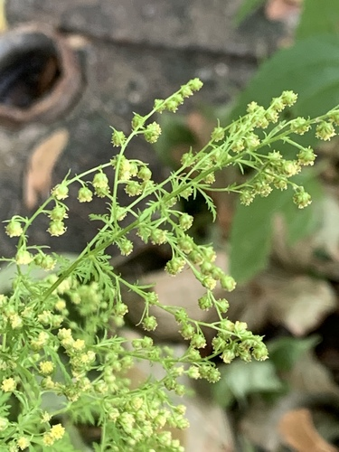

# Sweet Wormwood

> **Node ID**: plants.medicinal.sweet-wormwood
> **Domain**: [Plants](./index.md)
> **Dependencies**: See prerequisites
> **Enables**: [`Health`](../health/index.md)
> **Timeline**: Years 0-1
> **Outputs**: artemisinin (malaria treatment), essential oil (insect repellent)
> **Critical**: Yes — most effective antimalarial known, faster-acting than quinine for falciparum malaria

## Overview

> *Stem with leaf Taxonym: Artemisia annua ss Rottensteiner: Exkursionsflora für Istrien ISBN 978-3-85328-067-6 Location: north of Krk, County Primorje-Gorski kotar, Croatia Habitat: ruderal area*

> *Image: Stefan.lefnaer, CC BY-SA 4.0*

Sweet wormwood (*Artemisia annua*) is an annual herb native to temperate Asia that produces artemisinin, a sesquiterpene lactone that is the most effective antimalarial compound discovered. Artemisinin and its derivatives (artesunate, artemether, dihydroartemisinin) have become the frontline treatment for Plasmodium falciparum malaria worldwide, replacing quinine and chloroquine in areas where drug resistance has developed.

Artemisinin works by reacting with iron in the malaria parasite, generating free radicals that destroy the parasite's membranes and proteins. It acts faster than quinine, clearing parasites from the blood within 48 hours. The standard treatment is artemisinin-based combination therapy (ACT): artemisinin combined with a longer-acting partner drug to prevent resistance.

The plant grows 1-2 meters tall with aromatic, finely divided leaves. It is an annual, completing its lifecycle in one growing season. Artemisinin content peaks in the leaves just before flowering, typically 0.1-1.0% of dry leaf weight. *A. annua* grows in temperate to subtropical climates with moderate rainfall (400-1,000 mm).

Artemisinin was isolated in 1972 by Chinese scientist Tu Youyou, who received the Nobel Prize in Medicine in 2015 for the discovery. The compound was identified through screening of traditional Chinese medicine references, specifically a 1,700-year-old text recommending sweet wormwood for fever treatment.

Beyond malaria, the essential oil of *A. annua* contains compounds that repel insects, making it useful as a natural mosquito repellent where synthetic repellents are unavailable.

Primary outputs: `artemisinin` for malaria treatment, `essential_oil` for insect repellent.

## Prerequisites

### Materials

- *Artemisia annua* seeds (small, numerous)
- Temperate or subtropical climate with well-drained soil
- Full sun exposure

### Equipment

- Harvesting sickle or knife
- Drying racks or screens
- Grinding equipment
- Extraction vessel and solvent (low-grade alcohol, hexane, or ether)
- Dose measurement equipment
- Planting tools (hoe, rake)

### Knowledge

- Planting timing (after last frost for temperate zones)
- Harvest timing (pre-flowering for maximum artemisinin)
- Simple extraction methods for artemisinin from dried leaves
- Malaria treatment protocols and dosing
- Essential oil distillation (steam distillation)

### Infrastructure

- Planting area with full sun and well-drained soil
- Drying area protected from direct sun and rain
- Extraction workspace with ventilation
- Steam distillation setup (simple still) for essential oil

## Process Description

### Cultivation and Harvest

1. Sow seeds on the soil surface in spring after last frost. Seeds are tiny (1 mm); broadcast and rake lightly. Germination in 7-14 days.
2. Thin seedlings to 20-30 cm spacing. Plants grow rapidly in warm weather, reaching 1-2 meters tall in 3-4 months.
3. Harvest at the pre-flowering stage (flower buds visible but not open), when artemisinin content peaks. This is typically 90-120 days after planting.
4. Cut the entire above-ground plant 10-15 cm above ground level. Harvest in the morning after dew has dried.
5. Dry the harvested plants in a well-ventilated area, protected from direct sunlight, for 3-7 days. Leaves should be brittle when fully dry.
6. Strip dried leaves from stems and store in sealed containers. The leaves contain the artemisinin; discard stems.

### Artemisinin Use

1. **Dried leaf therapy (simplest)**: Consume 5-10 g of dried leaf powder per day, divided into 2-3 doses, for 5-7 days. This delivers approximately 5-100 mg of artemisinin per day, depending on leaf artemisinin content. The dose is imprecise because leaf content varies.
2. **Artemisinin tea**: Pour 250 ml of boiling water over 5 g of dried leaf. Steep 5-10 minutes. Strain. Drink 2-3 cups per day for 5-7 days. Note: artemisinin is poorly soluble in water, so this method delivers less drug than consuming the whole leaf.
3. **Solvent extraction (higher technology)**: Extract dried leaf powder with a non-polar solvent (hexane or petroleum ether) at room temperature for 24 hours. Filter. Evaporate the solvent. The residue contains crude artemisinin (yellow-white crystals). Further purify by recrystallization from ethanol. Yield: 1-10 g of artemisinin per kg of dried leaf.
4. **Standard dose of purified artemisinin**: 500-1000 mg per day for 3-7 days, combined with a partner antimalarial drug for combination therapy.

### Essential Oil Production

1. Harvest aerial parts (leaves and flowering tops) at full flowering for maximum essential oil yield.
2. Steam-distill the plant material: pack a still with plant material, pass steam through it, and collect the condensed oil that separates from the water.
3. Yield: 0.2-1.0% of fresh plant weight as essential oil.
4. Apply the diluted essential oil to skin or clothing as a mosquito repellent.

### Process Parameters

| Parameter | Range | Notes |
|-----------|-------|-------|
| Artemisinin content (dried leaf) | 0.1-1.0% | Varies by variety, growing conditions |
| Dry leaf yield per hectare | 1,000-3,000 kg | Per growing season |
| Artemisinin yield per hectare | 1-30 kg | Highly dependent on variety |
| Dried leaf therapeutic dose | 5-10 g/day | For 5-7 days |
| Purified artemisinin dose | 500-1000 mg/day | For 3-7 days |
| Essential oil yield | 0.2-1.0% fresh weight | By steam distillation |
| Plant height | 1-2 m | At flowering |
| Days to harvest | 90-120 | From sowing |
| Leaf drying time | 3-7 days | In shade, ventilated |
| Optimal rainfall | 400-1,000 mm/year | Temperate/subtropical |
| Seed yield per hectare | 10-30 kg | Small, lightweight seeds |
| Leaf-to-stem ratio at harvest | 60:40 by weight | Leaves contain the artemisinin |

### Extraction Processing Details

Artemisinin extraction efficiency varies dramatically by method. Simple hot water extraction (tea) recovers only 5-15% of available artemisinin because the compound is poorly soluble in water. Ethanol extraction at room temperature recovers 40-60%. Hexane or petroleum ether extraction at room temperature recovers 70-90% and is the standard industrial method. For maximum yield at low technology levels, a two-step process works best: first extract with warm ethanol (40-60°C) for 24 hours, then concentrate by evaporation.

Recrystallization from ethanol or hexane purifies the crude extract to pharmaceutical-grade white crystals. Dissolve the crude extract in warm ethanol at 1:10 ratio, filter to remove insoluble material, then cool slowly to 0-5°C. Artemisinin crystallizes as fine white needles. Collect by filtration and dry. Typical purity after one recrystallization: 70-90%. Multiple recrystallizations yield >99% pure artemisinin.

The entire extraction and purification process requires no specialized equipment beyond glass or ceramic vessels, a heat source, and basic filtration (cloth or paper). A field laboratory with 5-10 liters of ethanol and 5 kg of dried leaf can produce 5-50 g of purified artemisinin — enough for 10-100 adult treatment courses.

### Cultivation for Maximum Yield

Artemisinin content varies from 0.01% to over 1.5% depending on variety, with most wild-type plants at 0.1-0.4%. Selecting and propagating high-yield varieties is the single most impactful intervention for practical malaria treatment. Several cultivars (e.g., 'Anamed A-3', various Chinese breeding lines) consistently produce 1.0-1.5% artemisinin in dried leaf tissue.

Plant density of 100,000-250,000 plants per hectare (20-30 cm spacing) maximizes leaf yield. Excessive nitrogen fertilizer increases biomass but can dilute artemisinin concentration. Moderate fertility with adequate phosphorus and potassium produces the optimal balance of leaf yield and artemisinin content.

## Safety Considerations

- Artemisinin is generally well-tolerated at therapeutic doses. Side effects include dizziness, nausea, and abdominal pain in some patients.
- Do not use as monotherapy for malaria (single drug treatment). Artemisinin monotherapy promotes drug resistance. Always combine with a partner antimalarial if possible.
- Avoid in first trimester of pregnancy unless no alternative exists (limited safety data).
- The essential oil can cause skin irritation in sensitive individuals. Dilute before applying to skin.
- Do not confuse *Artemisia annua* with other Artemisia species (wormwood, mugwort) that contain thujone, a neurotoxic compound. *A. annua* has negligible thujone content.
- Large-scale cultivation for malaria treatment requires selection of high-artemisinin varieties. Wild-type plants may be too low in artemisinin for effective treatment.

### Personal Protective Equipment

- Gloves for handling concentrated essential oil
- Ventilation for solvent extraction
- Standard measurement tools for dosing

## Quality Control

### Acceptance Criteria

- **Dried leaves**: Green to dark green, aromatic (pleasant, sweet-herbal scent), brittle, no mold
- **Artemisinin (crude)**: Yellow-white crystals or powder, bitter taste
- **Essential oil**: Clear, pale yellow to blue-tinted, strong camphoraceous aroma

### Testing Methods

- Aroma test: good quality *A. annua* has a distinctive sweet, camphor-like aroma. Musty or hay-like smell indicates poor quality or over-drying.
- Artemisinin presence: dissolve a small sample of leaf extract in ethanol. Add a drop of sodium hydroxide solution. A yellow color indicates artemisinin (simplified test).
- Therapeutic response: body temperature reduction within 24-48 hours of starting treatment indicates effective drug levels.

## Scaling Notes

- **Household plot** (10 m²): 50-100 plants. Dried leaf yield: 1-3 kg. Sufficient for 100-600 courses of leaf therapy.
- **Field plot** (0.1 hectare): 5,000-10,000 plants. Dried leaf yield: 100-300 kg. Sufficient for a village pharmacy.
- **Community scale** (1 hectare): 50,000-100,000 plants. Annual artemisinin production: 1-30 kg. Can treat 1,000-30,000 malaria cases.
- **Key advantage**: Annual crop, no waiting years for harvest. Seeds are easy to collect and store.

## Troubleshooting

| Problem | Probable Cause | Solution |
|---------|---------------|----------|
| Low artemisinin in leaves | Harvested too early or too late, or low-yield variety | Harvest at pre-flowering stage; plant high-yield varieties |
| Seeds do not germinate | Old seeds or planted too deep | Use fresh seeds; sow on surface, do not cover |
- | Plants grow tall but fall over (lodge) | Too much nitrogen or wind exposure | Reduce nitrogen; plant in sheltered location or stake tall plants |
| Leaf therapy ineffective | Insufficient artemisinin content or drug resistance | Use purified extract; combine with partner antimalarial |
| Essential oil yield very low | Harvested at wrong stage or poor distillation technique | Harvest at full flowering; ensure adequate steam flow |

## Variations and Alternatives

- **High-yield varieties**: Several *A. annua* cultivars have been bred for artemisinin content above 1%. These are essential for practical malaria treatment from the raw plant.
- **Cinchona (quinine)**: The traditional antimalarial. Slower-acting than artemisinin but with centuries of successful use. Available from tree bark.
- **Synthetic artemisinin**: Semi-synthetic production from engineered yeast (developed 2012). Requires biotechnology capability.
- **Sweet Annie tea**: Traditional Chinese preparation. Less reliable than purified artemisinin but accessible at low technology.

### Industrial and Research Applications

Beyond malaria treatment, artemisinin shows promise as an antiparasitic agent against schistosomiasis and other helminth infections. The essential oil of *A. annua* (0.2-1.0% yield by steam distillation) contains camphor, artemisia ketone, and 1,8-cineole, compounds with insect repellent and antimicrobial activity. Dried *A. annua* foliage can be hung in dwellings or burned as a smudge to repel mosquitoes — a simple prevention measure that complements active malaria treatment.

For seed production, allow a portion of the planting to flower and set seed. Each plant produces 50,000-100,000 tiny seeds. Collect seed heads as they dry on the plant and store in paper bags. Seeds remain viable for 2-3 years when stored cool and dry.

## References

- [Health](../health/index.md) — malaria treatment and infectious disease
- [Cinchona](./cinchona-officinalis.md) — quinine, the alternative antimalarial
- [Neem](./azadirachta-indica.md) — insect repellent for malaria prevention
- [Plants Domain](./index.md) — domain overview and related capabilities

### Artemisinin Resistance and Combination Therapy

Artemisinin-resistant malaria parasites have emerged in Southeast Asia since 2008, characterized
by delayed parasite clearance after treatment. This resistance underscores the importance of
using artemisinin in combination with a partner drug (ACT — artemisinin-based combination
therapy) rather than as monotherapy. The partner drug (lumefantrine, amodiaquine, or piperaquine)
kills residual parasites that survive artemisinin treatment, preventing the selection of
resistant strains.

At low technology levels, combination therapy is challenging because the partner drugs require
pharmaceutical synthesis. The dried leaf therapy approach (consuming whole leaf powder)
naturally provides a cocktail of antimalarial compounds (artemisinin plus flavonoids and
other sesquiterpenes) that may slow resistance development compared to purified artemisinin alone.

### Cultivation Scale for Community Health

A community of 1,000 people in a malaria-endemic region can expect 200-400 malaria cases per
year. To treat these cases with dried leaf therapy (10 g dried leaf per day × 7 days per
course = 70 g per treatment), the community needs 14-28 kg of dried leaf per year. One hectare
of high-yield *A. annua* producing 2,000 kg of dried leaf per year provides enough medicine
for 50,000-100,000 treatment courses — far exceeding community needs and allowing surplus
for trade or emergency reserves.

---
*Part of the [Bootciv Tech Tree](../index.md) · [Plants](./index.md) · [All Domains](../index.md)*
