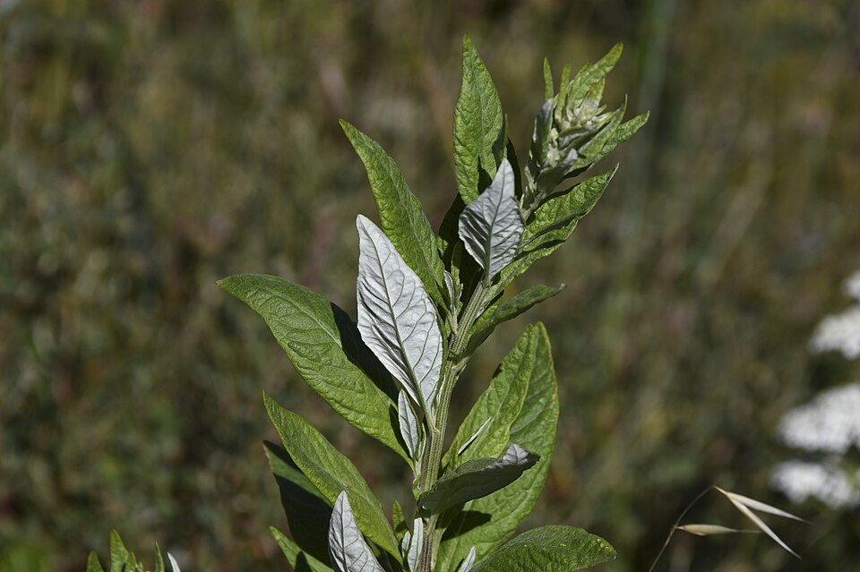

# Artemisia douglasiana

> **Node ID**: plants.medicinal-plants.artemisia-douglasiana
> **Domain**: [Plants](./index.md)
> **Dependencies**: See prerequisites
> **Enables**: [`Medicinal Plants`](medicinal-plants.md)
> **Timeline**: Years 0-10
> **Outputs**: medicinal_compounds
> **Critical**: No

## Overview

> *Image: Jerry Kirkhart from Los Osos, Calif., CC BY 2.0*

Artemisia douglasiana , known as California mugwort , Douglas's sagewort , or dream plant , is a western North American species of aromatic herb in the sunflower family

California mugwort is a generous plant for the medicine-maker. Once a colony is established, it produces harvestable material year after year without replanting, thanks to its aggressive rhizome network. The leaves yield a herb with anti-inflammatory and antimicrobial properties useful in salves, poultices, and teas. The plant also serves as a smudging herb in Indigenous ceremonial traditions. Its only drawback is that it refuses to stay where you put it, spreading through any soil it can reach.

Primary outputs: `medicinal_compounds` from dried leaves and flowering tops, prepared as infused oils, salves, poultices, teas, and smudge sticks. The active constituents include essential oils, flavonoids, and sesquiterpene lactones with documented anti-inflammatory and antimicrobial properties.

California mugwort is a rhizomatous perennial growing 50 to 200 cm tall, with lobed green leaves that are white and felted underneath. The plant spreads aggressively through underground rhizomes, forming dense colonies in moist habitats along streambanks, canyon bottoms, and disturbed ground throughout western North America from Baja California to Washington state.

The leaves and flowering tops contain essential oils, flavonoids, and sesquiterpene lactones with documented anti-inflammatory and antimicrobial properties. Indigenous peoples of California and the Pacific Northwest have used mugwort preparations for wound care, skin conditions, digestive complaints, and ceremonial purposes for millennia. The plant is prepared as a poultice, salve, tea, or smoke for topical and inhalation applications.

California mugwort's essential oil profile includes 1,8-cineole, camphor, and thujone in varying concentrations depending on growing conditions and harvest timing. The camphoraceous aroma is distinctive and useful for identifying the plant in the field. The white felted leaf undersides are a reliable identification feature that distinguishes A. douglasiana from most other western Artemisia species.

The plant's vigorous growth habit makes it easy to cultivate and harvest in quantity. Once established, a colony sustains repeated harvest without replanting, as the rhizome network continuously sends up new shoots. A single planting can provide medicinal material for decades, making the initial investment in site preparation and containment very worthwhile.

## Prerequisites

### Materials

- Biomass

### Equipment

- Pruning shears or sickle for harvest
- Drying racks or screens for herb processing
- Glass jars with tight lids for storage
- Mortar and pestle for grinding dried herb

### Knowledge

- Understanding of rhizomatous growth patterns and containment strategies for garden-scale cultivation
- Recognition of harvest timing for peak essential oil concentration in mugwort leaves
- Skill in salve preparation: infusing dried herb in warm oil and combining with beeswax
- Awareness of thujone content in mugwort and contraindications for pregnancy
- Knowledge of harvest timing for peak essential oil concentration
- Understanding of rhizomatous growth habit for cultivation management

### Infrastructure

- Moist garden plot or streamside location with partial to full sun
- Covered drying area with good air circulation
- Dark, cool storage for processed herb material
- Root barrier or contained raised bed to prevent unwanted spread
- Loamy, consistently moist soil amended with organic matter
- Amber glass containers for infused oils and salves

## Process Description

California mugwort follows a perennial herb cycle driven by its rhizome network. The colony produces new shoots each spring, reaches peak oil content in the leaves during bud formation in mid to late summer, and can be harvested two or even three times per season. Dried herb is stored whole or processed into infused oils and salves for topical use.

### Step-by-Step Procedure

1. Plant rhizome segments or container-grown plants in moist, well-drained soil in spring. Space 30 to 50 cm apart. Install root barriers if spread control is needed.
2. Maintain consistent soil moisture. The plant tolerates a wide range of light levels, from full sun to partial shade. Larger, more aromatic leaves develop with consistent water.
3. Divide established colonies every two to three years to maintain vigor and prevent center die-out. Replant outer sections.
4. Harvest aerial parts when flower buds are forming in mid to late summer. Cut stems 15 to 20 cm above ground level. The colony regrows from the rhizome network.
5. Bundle harvested stems loosely and hang upside down in a warm, well-ventilated area away from direct sunlight. Turn daily for even drying.
6. When fully dry, strip leaves and flower heads from stems. Store whole herb in airtight glass jars, or process immediately into infused oil or salve.

### Process Parameters

| Parameter | Range | Notes |
|-----------|-------|-------|
| Harvest timing | Pre-flower to early flower | Peak active compound concentration |
| Drying method | Shade, ambient temperature | Preserve volatile compounds |
| Drying time | 5-10 days | Until stems snap cleanly |
| Harvests per season | 1-2 | Depends on growing conditions and regrowth vigor |
| Colony spread rate | 30-60 cm per year | Requires containment barriers |

### Cultivation and Harvesting

Plant rhizome segments or container-grown plants in moist, well-drained soil in spring. Space plants 30 to 50 cm apart — they will fill in rapidly via rhizome spread. California mugwort tolerates a wide range of soil conditions and light levels, from full sun to partial shade. Consistent moisture produces larger, more aromatic leaves.

To control spread, plant in contained beds or install root barriers. Without containment, mugwort will colonize adjacent garden areas aggressively. Division of established colonies every two to three years maintains plant vigor and prevents center die-out.

Harvest aerial parts when flower buds are forming, typically in mid to late summer. At this stage, the essential oil concentration in leaves peaks. Cut stems 15 to 20 cm above ground level using clean pruning shears. The colony will regrow from the rhizome network. Two harvests per season are possible in favorable growing conditions.

### Processing and Storage

Bundle harvested stems loosely and hang upside down in a warm, well-ventilated area away from direct sunlight. Alternatively, spread individual stems on drying screens. Turn the material daily for even drying. The herb is fully dry when leaves crumble easily and stems snap.

Strip dried leaves and flower heads from stems by hand. Store whole dried herb in airtight glass jars in a cool, dark location. For salve preparation, infuse dried herb in warm oil for several hours, then strain through cloth and combine the infused oil with beeswax. For tea, steep dried leaves in hot water for 10 minutes.

For smudge stick preparation, bundle freshly harvested stems 15 to 20 cm long and tie tightly with cotton string. Hang bundles to dry for two to three weeks until fully dry. Dried smudge sticks are lit at the tip, allowed to smolder, and the smoke is directed over the body or through a space using a feather or hand. The smoke has a strong herbaceous, slightly camphoraceous odor. Always burn smudge sticks in a well-ventilated area.

## Safety Considerations

California mugwort is a common medicinal herb with specific precautions:

- Allergic reactions to plant compounds — mugwort pollen is a common allergen; skin contact with fresh sap can cause dermatitis in sensitive individuals
- Improper preparation toxicity — mugwort contains thujone in small amounts; excessive internal use should be avoided. Not recommended for use during pregnancy.
- Tool injuries during harvesting — cuts from pruning shears
- Pest exposure — aphids and spider mites on cultivated plants
- Soil-borne pathogens — root rot in waterlogged conditions
- Smoke inhalation — burning mugwort for ceremonial or medicinal purposes produces irritant smoke

### Personal Protective Equipment

- Gloves when handling fresh plants to prevent contact dermatitis
- Dust mask when grinding or processing dried herb in quantity
- Standard hand protection when using pruning shears
- Long sleeves if sensitive to mugwort sap
- Ventilation or respiratory protection when burning smudge sticks in enclosed spaces

### Emergency Procedures

- For contact dermatitis: wash affected area with soap and water. Discontinue handling if rash develops.
- For smoke inhalation: move to fresh air. If breathing difficulty persists, seek medical attention.
- For pruning shear cuts: clean wound, apply pressure, and bandage. Seek medical attention for deep cuts.
- Keep antihistamines accessible for allergic reactions to pollen during harvest season.

## Quality Control

### Acceptance Criteria

- **Dried herb**: Green leaves with white-felted undersides intact, strong characteristic aroma, free of mold
- **Infused oil**: Clear to pale green, characteristic mugwort scent, no off-odors
- **Salve**: Smooth texture, even consistency, retains herb aroma

### Testing Methods

- Aroma assessment: properly dried herb should have a strong, herbaceous, slightly camphoraceous scent
- Leaf underside check: white felt should be intact, indicating careful drying
- Oil clarity test: infused oil should be free of cloudiness or particulate matter after straining
- Salve consistency test: should spread smoothly at skin temperature without graininess
- Moisture test: dried leaves should crumble readily between the fingers

### Sampling Protocol

For salve and oil preparations, test each batch for consistent aroma and color. Track yield per colony area over multiple seasons to monitor long-term productivity. Record harvest dates and drying conditions to correlate with essential oil retention.

## Scaling Notes

Mugwort's aggressive growth makes it easy to scale, but containment requirements limit where it can be planted.

- **Bench scale**: Small colony of 5 to 15 plants in a contained bed. Manual harvest and air drying. Small batches of dried herb and salve.
- **Pilot scale**: Contained field planting of 50 to 200 plants. Multiple harvests per season. Several kilograms of dried herb per year.
- **Production scale**: Dedicated field plots with root barrier containment. Rotational harvest across sections. Tens of kilograms of dried herb per season.

Key scaling challenges: the plant's aggressive rhizome spread requires physical containment at any scale to prevent unwanted colonization. Drying capacity must scale with harvest volume. Essential oil concentration varies with growing conditions, requiring standardized harvest and processing protocols to maintain consistent product quality.

California mugwort's ecological role extends beyond human medicinal use. The plant is one of the few late-summer nectar sources available in dry Mediterranean climates, making it valuable for pollinator support. In restoration projects, mugwort colonizes disturbed streambanks and road cuts quickly, stabilizing soil with its dense rhizome network while providing habitat structure for wildlife. Its aggressive growth, a nuisance in garden settings, becomes an asset in ecological restoration.

## Troubleshooting

| Problem | Probable Cause | Solution |
|---------|---------------|----------|
| Low aroma intensity | Harvested too late or dried in sun | Harvest at early flower; dry in shade |
| Herb turns black during drying | Slow drying in humid conditions | Improve ventilation; spread stems more loosely |
| Colony center dying out | Mature, overcrowded rhizome network | Divide colony and replant outer sections |
| Insect damage on leaves | Aphid or mite infestation | Spray with water; introduce beneficial insects |
| Poor leaf growth | Insufficient moisture or excessive shade | Water during dry periods; thin overhead canopy |

## Variations and Alternatives

- **Wild harvest**: Collecting from natural colonies along streambanks. Free and requires no cultivation, but over-harvesting can damage local populations.
- **Contained garden cultivation**: Growing in raised beds or pots with root barriers. Reliable supply, controlled quality, prevents unwanted spread.
- **Artemisia vulgaris** (common mugwort): European species with similar medicinal properties and growth habit. More widely documented in Western herbal traditions.
- **Artemisia argyi** (Chinese mugwort): Primary species used in traditional Chinese medicine for moxibustion. Higher oil yield but more cold-sensitive.
- **Alternative anti-inflammatory herbs**: Calendula, comfrey, and plantain provide similar wound-care properties with different active compounds and safety profiles.

### Ecological Role

California mugwort provides habitat value in cultivated settings. The dense growth offers cover for ground-nesting birds and small mammals. The flowers attract a wide range of pollinators including native bees, wasps, and butterflies during the late summer bloom period when few other nectar sources are available in dry Mediterranean climates.

## References

- [Medicinal Plants](medicinal-plants.md) — parent capability
- [Plants Domain](./index.md) — domain overview and related capabilities
- [Medicinal Plants](medicinal-plants.md) — downstream capability

### Material Handling

Dried mugwort herb should be stored in opaque glass jars in a cool, dark location to preserve essential oils. Label each container with harvest date and batch number. Infused oils and salves should be stored in amber glass containers. Use dried herb within one year for best potency. Spent plant material from preparations can be composted.

California mugwort has been used by Indigenous peoples of the Pacific Northwest and California for wound care and pain relief for thousands of years. The plant was prepared as a poultice for bruises and sprains, a steam inhalation for congestion, and a tea for digestive discomfort. Leaves were placed in shoes and bedding as a foot deodorant and insect repellent. The plant was also burned as a smudge for ceremonial purification. These traditional uses are well-documented in ethnobotanical records and continue in contemporary Indigenous and herbalist practice.

The common name "dream plant" reflects the traditional use of mugwort leaves placed under pillows or in dream pillows to promote vivid dreaming. While this use is primarily ceremonial and cultural rather than pharmacological, the plant's aromatic compounds may influence sleep quality through mild olfactory stimulation. Mugwort's association with dreaming and ceremonial use is found across multiple Indigenous cultures in western North America, suggesting deep historical roots for this practice.

California mugwort can be distinguished from the similar European species Artemisia vulgaris by its generally larger leaves and more robust growth habit. The white felted leaf undersides are more pronounced in A. douglasiana, and the plant tends to form larger, more dense colonies in favorable habitat. The two species are used interchangeably in herbal practice, though A. douglasiana is more readily available in western North America and A. vulgaris is the standard species in European herbal traditions.

California mugwort's sprawling rhizome network makes it one of the first plants to colonize disturbed ground along streambanks and canyon bottoms in western North America. This pioneer habit means the plant often appears spontaneously in suitable habitat without deliberate planting. Foragers harvest from these natural colonies, but sustainable practice requires taking only a portion of the aerial growth from each colony and leaving enough biomass for the rhizome network to regenerate.

California mugwort produces two types of leaves: larger, more deeply lobed leaves on the lower stems, and smaller, narrower leaves near the flowering tops. The lower leaves have the highest concentration of essential oils and are preferred for medicinal preparations. The upper leaves and flowering tops are used for smudge sticks and tea. This variation in leaf morphology means that selective harvest by leaf position can optimize the quality of different medicinal products from the same plant.

The plant's white-felted leaf undersides are caused by a dense mat of tiny hairs (tomentose indumentum) that reflect light and reduce water loss. This feature is most pronounced in plants growing in full sun and dry conditions, and less developed in shaded, moist habitats. The density of the white felt is a quick visual indicator of growing conditions and can be used to assess whether a colony is producing optimal medicinal-quality foliage.
### Artemisia douglasiana Summary

---
*Part of the [Bootciv Tech Tree](../index.md) · [Plants](./index.md) · [All Domains](../index.md)*
