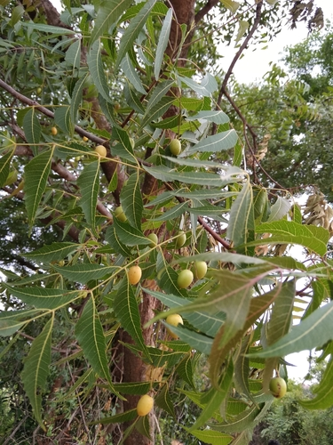

# Neem

> **Node ID**: plants.insecticide.neem
> **Domain**: [Plants](./index.md)
> **Dependencies**: See prerequisites
> **Enables**: [`Agriculture`](../agriculture/index.md), [`Health`](../health/index.md)
> **Timeline**: Years 3-5
> **Outputs**: neem oil (insecticide, medicine), neem cake (fertilizer), timber
> **Critical**: No — excellent natural insecticide but not the only option

## Overview

> *Qutb Minar in the evening seen along with Neem Tree (Azadirachta indica)*

> *Image: Shikhers, CC BY-SA 4.0*

Neem (*Azadirachta indica*) is a fast-growing tropical tree native to the Indian subcontinent that produces seeds containing azadirachtin, one of the most potent natural insecticides known. Azadirachtin disrupts insect growth, feeding, and reproduction at concentrations as low as 1-10 ppm, making neem-based sprays effective against over 200 species of insect pests while being relatively harmless to mammals, birds, and beneficial insects like bees.

The tree grows 15-20 meters tall with a spreading crown. It thrives in tropical and subtropical regions with 400-1,200 mm annual rainfall, tolerating poor soils and temperatures to 45°C. Neem is evergreen in tropical climates, semi-deciduous in cooler regions. Trees begin producing seeds at 3-5 years of age, reaching full production at 10-15 years.

Neem seeds contain 20-40% oil by weight. The oil is extracted by pressing and contains 0.1-0.3% azadirachtin. After oil extraction, the remaining seed cake is a nitrogen-rich organic fertilizer (5-6% nitrogen) and soil amendment with nematicidal properties.

Beyond agriculture, neem has medicinal uses: the oil treats skin conditions (eczema, acne), the twigs are used as antibacterial chewing sticks for dental hygiene, and leaf preparations have antimalarial and anti-inflammatory properties. Neem timber is moderately durable and used for furniture and construction.

For civilization bootstrapping, neem's primary value is as a natural pesticide that protects stored grain and growing crops from insect damage without requiring chemical synthesis. Post-harvest grain losses to insects in the tropics can reach 30-50% without protection; neem seed treatment reduces these losses to under 5%.

Primary outputs: `neem_oil` (insecticide, medicine), `neem_cake` (fertilizer, nematicide), `timber`.

## Prerequisites

### Materials

- Neem seeds or seedlings
- Tropical or subtropical site with well-drained soil
- Annual rainfall 400-1,200 mm

### Equipment

- Seed collection tools (tarps, sticks for shaking branches)
- Oil press (screw press or wedge press)
- Sprayer or brush for insecticide application
- Drying area for seeds

### Knowledge

- Seed collection timing (fruit ripens throughout the year in tropics)
- Oil extraction technique
- Insecticide preparation and dilution rates
- Application timing for pest control
- Seed storage to preserve azadirachtin potency

### Infrastructure

- Neem trees (3-5 years to first seed production)
- Seed processing and oil extraction area
- Insecticide mixing and application equipment

## Process Description

### Seed Collection and Oil Extraction

1. Collect ripe fruit (yellow) from beneath trees or by shaking branches. Remove the fleshy outer pulp by washing and rubbing. The inner seed (nut) is hard and contains the oil.
2. Dry cleaned seeds in the sun for 3-5 days until moisture content is below 10%. Azadirachtin degrades rapidly in moist, hot conditions; dry seeds promptly.
3. Press dried seeds in a screw press or wedge press. Yield: 20-40% of seed weight as neem oil.
4. The remaining seed cake (press cake) is retained for use as fertilizer.
5. Store oil in sealed containers away from light and heat. Azadirachtin content degrades 30-50% per year in storage.

### Insecticide Preparation and Use

1. **Neem oil spray**: Dilute neem oil 10-30 ml per liter of water. Add a few drops of liquid soap as an emulsifier (neem oil does not mix with water without one). Spray on crops at the first sign of insect damage.
2. **Neem seed extract**: Soak 50 g of crushed neem seeds in 1 liter of water overnight. Strain through cloth. Spray directly on crops. This crude extract contains azadirachtin and other active compounds.
3. **Neem leaf extract**: Boil 100 g of fresh neem leaves in 1 liter of water for 20 minutes. Cool, strain, and spray. Less potent than seed extracts but available year-round.
4. **Grain storage treatment**: Mix dried, ground neem leaves or seed cake powder with stored grain at 1-2% by weight. The neem compounds repel storage beetles and weevils for 3-6 months.

### Process Parameters

| Parameter | Range | Notes |
|-----------|-------|-------|
| Azadirachtin content (seed oil) | 0.1-0.3% | Active insecticidal compound |
| Seed oil content | 20-40% | By weight of dried seed |
| Seed yield per tree per year | 10-50 kg | Mature tree (10+ years) |
| Oil yield per tree per year | 2-20 kg | From pressed seeds |
| Neem cake nitrogen content | 5-6% | Effective organic fertilizer |
| Insecticide dilution rate | 10-30 ml oil per liter water | For foliar spray |
| Grain treatment rate | 1-2% by weight | Neem powder mixed with grain |
| Insect control effectiveness | 70-95% | Against most common crop pests |
| Mammalian toxicity | Very low | LD50 > 5,000 mg/kg (practically non-toxic) |
| First seed production | 3-5 years | From planting |
| Optimal temperature | 25-35°C | Tropical/subtropical |
| Seed yield per hectare | 2,000-5,000 kg | Mature plantation (10+ years) |
| Neem cake application rate | 500-1,000 kg/ha | As soil amendment |
| Azadirachtin degradation rate | 30-50% per year | In stored oil at ambient temperature |

### Oil Extraction and Processing Details

Neem oil extraction efficiency depends heavily on seed preparation and press type. Fresh seeds at 8-10% moisture pressed in a screw expeller yield 25-35% oil. A second pressing of the seed cake with higher pressure extracts an additional 5-10%. Traditional ghani (rotary mortar and pestle) extraction achieves 15-25% yield but requires no metal machinery. Cold pressing (below 60°C) preserves azadirachtin content; hot pressing increases oil yield but can degrade the active compounds.

After pressing, filter the raw oil through cloth or let it settle for 2-3 days. The filtered oil is dark brown with a strong bitter-garlic odor. Raw neem oil contains 0.1-0.3% azadirachtin along with related limonoids (salannin, nimbin, gedunin) that contribute to the insecticidal and medicinal properties. The full spectrum of limonoids makes whole neem oil more effective as an insecticide than purified azadirachtin alone, because multiple compounds act synergistically against insect pests.

### Soil Amendment and Integrated Pest Management

Neem cake (the pressed seed residue) is one of the most valuable organic fertilizers available in the tropics. With 5-6% nitrogen, 1-2% phosphorus, and 1-2% potassium, it provides balanced nutrition while simultaneously suppressing soil nematodes and root-feeding insects. Apply 500-1,000 kg per hectare as a basal dressing before planting. The nematicidal effect lasts 2-3 months, protecting young crop roots during the critical establishment period.

For integrated pest management, combine neem treatments with crop rotation, companion planting, and physical barriers. Neem does not kill beneficial insects (ladybugs, lacewings, parasitic wasps) at normal application rates, making it compatible with biological control programs. Spray neem oil in the early morning or late evening to avoid UV degradation of azadirachtin (half-life in direct sunlight: 1-4 hours).

## Safety Considerations

- Neem oil is low in toxicity to mammals but should not be ingested in large quantities. Internal use of concentrated neem oil causes nausea, vomiting, and diarrhea.
- Neem is toxic to fish and aquatic organisms. Do not spray near ponds, streams, or waterways.
- Azadirachtin has low toxicity to bees, but direct spraying of bees should be avoided. Spray in the early morning or late evening when bees are less active.
- Neem oil can cause skin and eye irritation in concentrated form. Wear gloves when handling pure oil.
- Neem seed cake is not safe for human consumption despite being used as animal fodder in some regions. It contains residual limonoids that can cause toxicity.
- Do not use neem products on infants or young children without medical supervision.

### Personal Protective Equipment

- Gloves for handling concentrated neem oil
- Eye protection when spraying

## Quality Control

### Acceptance Criteria

- **Neem seeds**: Clean, dry (below 10% moisture), pale beige, no mold
- **Neem oil**: Dark brown to reddish-brown, bitter taste and garlic-like odor, viscous
- **Neem cake**: Brown solid, crumbly, slightly bitter odor

### Testing Methods

- Azadirachtin activity bioassay: spray diluted neem extract on aphids or mosquito larvae. Effective preparation kills 70%+ within 24 hours.
- Seed moisture: bite a seed. If it cracks cleanly, it is dry enough for pressing.
- Oil quality: pure neem oil has a strong, characteristic bitter-garlic odor. Rancid or mild odor indicates degradation.

## Scaling Notes

- **Individual tree**: 10-50 kg of seeds per year. 2-20 kg of oil. Sufficient to protect 0.5-5 hectares of crops with regular spraying.
- **Village planting** (10 trees): 100-500 kg of seeds. 20-200 kg of oil. Protects 5-50 hectares of crops.
- **Community plantation** (1 hectare): 200-400 trees. Oil yield: 400-8,000 kg per year. Large-scale crop protection.

## Troubleshooting

| Problem | Probable Cause | Solution |
|---------|---------------|----------|
| Neem spray does not kill insects | Azadirachtin degraded (old oil) or concentration too low | Use fresh oil; increase concentration; ensure emulsifier is mixed in |
| Seeds mold during storage | Too moist when stored | Dry seeds thoroughly before storage; store in breathable containers |
| Oil yield very low from pressing | Seeds not dry enough or press not tight enough | Dry seeds to below 10% moisture; adjust press pressure |
| Treated grain has bitter taste | Too much neem powder applied | Reduce treatment rate to 1% or less; winnow excess powder before cooking |
| Neem trees not producing seeds | Too young or wrong climate | Wait 3-5 years; ensure tropical conditions |

## Variations and Alternatives

- **Chinaberry** (*Melia azedarach*): Related species with similar insecticidal properties. More cold-tolerant but less potent.
- **Pyrethrum** (*Chrysanthemum cinerariifolium*): Different mode of action (neurotoxin). Fast-acting knockdown insecticide. Temperate climate.
- **Rotenone** (*Derris elliptica*): Tropical vine root extract. Potent insecticide and fish poison. More toxic to mammals than neem.
- **Tobacco extract** (*Nicotiana tabacum*): Nicotine sulfate is a potent insecticide. More toxic to mammals than neem. Requires careful handling.

### Additional Uses

Neem wood is moderately durable (similar to teak in resistance to termites) and used for furniture, cart wheels, and construction in regions where the tree grows. The timber seasons well with minimal warping. Neem leaves placed in stored grain act as a repellent against storage pests at lower concentrations than seed cake powder. In traditional medicine, neem leaf paste treats skin infections and the twig chewing stick provides antibacterial oral hygiene — the twigs contain compounds that inhibit Streptococcus mutans, a primary cause of dental caries.

## References

- [Agriculture](../agriculture/index.md) — crop protection and pest management
- [Health](../health/index.md) — medicinal uses of neem
- [Food Processing](../food-processing/index.md) — grain storage protection
- [Pyrethrum](./chrysanthemum-cinerariifolium.md) — comparison natural insecticide
- [Plants Domain](./index.md) — domain overview and related capabilities

### Neem in Integrated Pest Management

Neem plays a central role in integrated pest management (IPM) systems because it controls
pests through multiple mechanisms: antifeedant action (insects stop eating treated plants),
growth disruption (larvae fail to molt and develop), repellent action (insects avoid treated
surfaces), and sterility (reduced egg-laying and hatching rates). This multi-mode action
makes it difficult for pests to develop resistance, unlike single-action synthetic pesticides.

Neem is compatible with biological control agents. At normal application rates, neem does
not harm predatory insects (ladybugs, lacewings, praying mantises), parasitic wasps, or
spiders that provide natural pest control. This allows neem to be integrated into IPM
programs that combine botanical, biological, and cultural control methods.

For grain storage protection, mix dried neem leaves or ground seed cake with stored grain
at 1-2% by weight. The neem compounds repel storage beetles (Sitophilus, Tribolium, and
Callosobruchus species) for 3-6 months, reducing post-harvest losses from 30-50% to under
5%. This application alone makes neem critically important for food security in tropical
regions where grain storage losses are a major cause of food insecurity.

Neem cake (the pressed seed residue) has multiple uses beyond fertilizer. When mixed with stored grain at 1-2% by weight, it repels storage pests for 3-6 months. Neem cake tea (soaking cake in water) can be used as a foliar spray for crop protection. The cake also has nematicidal properties, reducing soil nematode populations when incorporated into planting beds. These multiple uses make the entire neem seed valuable, not just the extracted oil.

### Neem Summary

This species represents an important component of a diversified food production system.
No single crop provides complete nutrition, and dietary diversity is essential for human
health. A civilization bootstrap food system should include grains, legumes, roots, fruits,
vegetables, and nuts to ensure adequate intake of calories, protein, vitamins, and minerals.

The crop's specific growing requirements (soil type, rainfall, temperature range, and
growing season length) determine its geographic suitability. Matching crops to local
conditions is more important than attempting to grow unsuitable crops in marginal
environments. Where this species is well-adapted, it should be a priority for cultivation;
where conditions are marginal, alternative species should be preferred.

---
*Part of the [Bootciv Tech Tree](../../index.md) · [Plants](./index.md) · [All Domains](../../index.md)*

