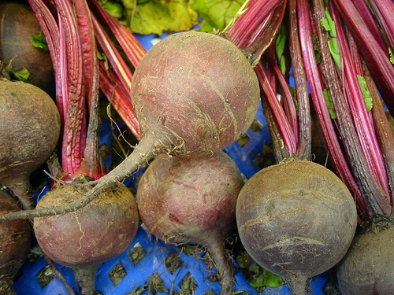

# Beet

> **Node ID**: plants.edible-plants.beet
> **Domain**: [Plants](./index.md)
> **Dependencies**: See prerequisites
> **Enables**: [`Edible Plants`](edible-plants.md)
> **Timeline**: Years 0-5
> **Outputs**: edible_plant_material
> **Critical**: Yes

## Overview

> *Image: Dag Endresen, CC BY 2.0*

Beet

*Beta vulgaris* (Amaranthaceae) is a root & tuber crop species of major importance for civilization bootstrapping. Beetroot provides leaves, roots as its primary edible product and ranks 40/100 on the nutrition score.

Beta vulgaris (beet) is a species of flowering plant in the subfamily Betoideae of the family Amaranthaceae. It is a perennial plant usually growing up to 120 centimetres (4 ft) tall. Three subspecies are typically recognised. The wild ancestor of all the cultivated beets is the sea beet (Beta vulgaris subsp. maritima), with several modern cultivars all belonging to B. vulgaris subsp. vulgaris. Some of the most popular cultivar groups include: the sugar beet (used to produce table sugar), the root vegetable known as the beetroot or garden beet, the leaf vegetable known as chard or spinach beet or silverbeet, and mangelwurzel (a fodder crop).

Edible parts: Roots, Leaves, Vegetable Spinach beet leaves are eaten as a pot herb. Young leaves of the garden beet are sometimes used similarly. The midribs of Swiss chard are eaten boiled while the whole leaf blades are eaten as spinach beet. In some parts of Africa, the whole leaf blades are usually prepared with the midribs as one dish. The leaves and stems of young plants are steamed briefly and eaten as a vegetable; older leaves and stems are stir-fried and have a flavour resembling taro leaves. The usually deep-red roots of garden beet can be baked, boiled, or steamed, and often served hot as a cooked vegetable or cold as a salad vegetable. They are also pickled. Raw beets are added to salads. A large proportion of the commercial production is processed into boiled and sterilised beets or into pickles. In Eastern Europe beet soup, such as cold borsch, is a popular dish. Yellow-coloured garden beets are grown on a very small scale for home consumption. The consumption of beets causes pink urine in some people. Jewish people traditionally eat beet on Rosh Hashana (New Year). Its Aramaic name סלקא sounds like the word for "remove" or "depart"; it is eaten with a prayer "that our enemies be removed".

For civilization bootstrapping, beet is significant because of its role as a root & tuber crop. Reliable food production is the foundation upon which all other technological development rests. Understanding the cultivation, processing, and storage of *Beta vulgaris* enables communities to establish food security and allocate labor to non-subsistence activities.

*Beta vulgaris* is a member of the Amaranthaceae family. As a root & tuber crop, it provides essential calories, protein, or other nutrients needed to sustain human populations during the bootstrap process. The ability to produce food reliably from cultivated plants is what separates sedentary civilizations from hunter-gatherer societies, because food surplus allows specialization of labor into toolmaking, construction, and eventually metallurgy and beyond.

This species grows as a perennial or annual depending on climate and management. Propagation is primarily by Seed - sow in situ.. Harvest timing depends on the plant part used: leaves, roots are typically ready at specific growth stages or seasons.

## Prerequisites

### Materials

- Propagation material: Seed - sow in situ.
- Compost or organic matter for soil amendment
- Mulch material for moisture retention and weed suppression

### Equipment

- Hoe or digging stick for soil preparation and planting
- Sickle, machete, or harvesting knife for crop harvest
- Drying racks or flat drying surfaces for post-harvest processing
- Storage containers: woven baskets, ceramic jars, or sacks for dried product
- Winnowing baskets or screens if processing grains or seeds

### Knowledge

- Species identification: A dark green leafed plant. The plant is upright and about 20 cm tall. It can be grown as an annual plant. Normally it gives a thickened root in the first year then flowers in the second year. The leaves vary in shape and colour. They can be oval with an irregular wavy edge. They can be dark green or
- Understanding of planting timing relative to local frost dates and rainy seasons
- Knowledge of soil preparation, seed depth, and spacing requirements
- Recognition of common pests and diseases and their early indicators
- Safe preparation methods for any toxic or bitter compounds (see Safety)

### Infrastructure

- Field or garden site with suitable climate, soil type, and sun exposure
- Reliable water access for germination and establishment phase
- Fenced or protected area if animal browsing is a risk
- Storage structure protected from moisture, rodents, and insects

## Process Description

### Cultivation and Propagation

Plants are grown from seed. Normally the plants are planted in the final site because transplanting is difficult. When the small clump of seeds or seed ball are planted more than one seedling will result. Plants get a soft heart due to boron deficiency. This is treated with borax. Propagation: Seed - sow in situ.

### Distribution and Growing Conditions

### Identification

A dark green leafed plant. The plant is upright and about 20 cm tall. It can be grown as an annual plant. Normally it gives a thickened root in the first year then flowers in the second year. The leaves vary in shape and colour. They can be oval with an irregular wavy edge. They can be dark green or reddish. It has a round or elongated fattened root. The root is red in colour. (White varieties also occur). The flowers are small and green and have both sexes. They occur in flower arrangements with the end bud a flower bud. This forms a tall, branching, spike-like arrangement. The fruit are one seed. Often 2 or more seeds are joined together in a "seedball". Plants are wind cross pollinated.

### Edible Parts and Preparation

## Quantitative Parameters

### Nutritional Composition (per 100g)

| Part | Moisture | kJ | kcal | Protein | Vit A | Vit C | Iron | Zinc |
| --- | --- | --- | --- | --- | --- | --- | --- | --- |
| Root - boiled flesh | 82.7 | 189 | 45 | 1.8 | 4 | 5 | 0.4 | 0.4 |
| Root - raw flesh | 87.1 | 118 | 28 | 1.3 | 4 | 6 | 0.8 | 0.4 |
| Leaves - boiled | 89 | 113 | 27 | 2.6 | 510 | 25 | 1.9 | 0.5 |
| Leaves - raw | 92 | 80 | 19 | 1.8 | 610 | 30 | 3.3 | 0.4 |
| Leaves | 89 | 77 | — | 3.4 | — | — | — | — |

### Growing Parameters

| Parameter | Value | Notes |
|-----------|-------|-------|
| Germination temperature | 22°C | Optimal |
| Edible parts | Leaves, Roots | Primary harvest |

## Processing and Storage

### Storage

Fresh roots and tubers can be stored in cool, dark, well-ventilated conditions. Root cellars or pits lined with straw maintain appropriate temperature and humidity. Avoid washing before storage — soil protects the skin. Check stored roots weekly and remove any showing rot to prevent spread. For longer storage, slice and sun-dry, or process into flour. Some tropical tubers store for weeks at ambient temperature; others require processing within days of harvest.

### Material Handling

Handle beet produce with clean hands and tools to prevent contamination. Remove field heat promptly after harvest by moving product to shade. Process within the recommended timeframe to prevent quality loss. Compost crop residues and processing waste to return organic matter to the soil. Label stored products with harvest date, variety, and any treatments applied.

## Scaling Notes

- **Bench scale**: Individual plants or small garden plot (10-50 plants). Output for direct household consumption. Useful for seed saving, variety selection, and learning the crop's behavior under local conditions.
- **Pilot scale**: Field planting of 0.1 to 1 hectare (500-5,000 plants). Staggered planting or sequential harvests to extend availability. Requires basic hand tools and family-level labor. Surplus can be traded or stored.
- **Production scale**: Multi-hectare cultivation with mechanized planting, harvesting, and processing. Requires plow animals or tractors, grain mills or processing equipment, and bulk storage facilities. Enables community-level food security and trade.

Key scaling challenges include maintaining genetic diversity at plantation scale, managing pest and disease pressure in monoculture, and matching post-harvest processing capacity to harvest volume. Seed saving and variety selection at bench scale directly informs decisions about which cultivars to scale up.

## Troubleshooting

| Problem | Probable Cause | Solution |
|---------|---------------|----------|
| Poor germination | Old seed, wrong soil temperature, planted too deep, or insufficient moisture | Use fresh seed; verify germination temperature range; plant at recommended depth; maintain soil moisture during germination |
| Pest damage | Insect infestation or browsing animals | Hand-pick pests; use companion planting with repellent species; install fencing for larger pests |
| Disease (fungal/bacterial) | Poor air circulation, excessive moisture, infected seed | Space plants adequately; avoid overhead watering; use clean seed from disease-free plants; practice crop rotation |
| Low yield | Nutrient deficiency, water stress, overcrowding, or shade | Amend soil with compost or manure; ensure adequate water at critical growth stages; thin to recommended spacing; plant in full sun |
| Storage losses | Insufficient drying, rodent/insect damage, high humidity | Dry product thoroughly before storage; use sealed containers; inspect stored product regularly; keep storage area clean and dry |
| Quality or safety note | See species-specific notes | Chemical composition: Fat = 5.75% (dry). Albumenoids = 13.92% (dry). Carbohydrates = 45.55% (dry). Fibre = 17.85% (dry). Ash = 16.93% (dry). Nitrogen  |

## Safety Considerations

Working with *Beta vulgaris* involves the following hazards:

- **Toxicity**: Parts of this plant may contain compounds that are toxic when raw or improperly prepared. Always follow proper preparation procedures before consumption. Verify with multiple authoritative sources.
- Tool injuries during harvest and processing — use sharp tools in good condition and cut away from the body
- Allergic reactions to plant compounds — sensitive individuals should test small quantities first
- Sun exposure and heat stress during field work — schedule heavy work for early morning or late afternoon
- Musculoskeletal strain from repetitive harvesting motions — vary tasks and take regular breaks

### Personal Protective Equipment

- Sturdy gloves when handling plants with irritant sap, spines, or rough surfaces
- Long sleeves and trousers for field work to reduce skin exposure to irritants and insects
- Eye protection when using cutting tools overhead or near face level
- Sun hat and sunscreen for extended field work

### Emergency Procedures

- For suspected plant poisoning: stop eating immediately, save a sample of the plant material, and seek medical attention. Do not induce vomiting unless directed by a medical professional.
- For tool lacerations: apply direct pressure with a clean cloth, elevate the wound, and seek medical attention for cuts deeper than skin level.
- For allergic reaction (swelling, difficulty breathing): discontinue exposure immediately and seek emergency medical help.

## Quality Control

### Acceptance Criteria

- Harvest product shows expected color, texture, size, and flavor for the variety grown
- No visible mold, rot, pest damage, or foreign material in stored product
- Dried products are brittle throughout with no flexible or moist spots
- Seeds intended for storage test at below 14% moisture content

### Testing Methods

- **Visual inspection**: check for discoloration, mold, insect damage, or foreign material
- **Bite test (seeds/grains)**: properly dried seeds crack cleanly; under-dried seeds dent or feel leathery
- **Smell test**: fresh product has characteristic aroma; off-odors indicate spoilage or contamination
- **Snap test (dried products)**: properly dried material snaps rather than bends

### Sampling Protocol

For field-scale production, inspect every 10th plant during harvest for disease and pest damage. Grade each batch by size and quality before storage. Record yield per unit area to track productivity trends across seasons and identify declining performance early.

## Variations and Alternatives

### Medicinal Uses

The roots and leaves of the beet have been used in traditional medicine to treat a wide variety of ailments. Ancient Romans used beetroot as a treatment for fevers and constipation, amongst other ailments. Apicius in De re coquinaria gives five recipes for soups to be given as a laxative, three of which feature the root of beet. Platina recommended taking beetroot with garlic to nullify the effects of 'garlic-breath'. Beet greens and Swiss chard are both considered high oxalate foods which are implicated in the formation of kidney stones.

### Additional Information

It is a commercially cultivated vegetable. Not often seen in Papua New Guinea.

### Notes

Chemical composition: Fat = 5.75% (dry). Albumenoids = 13.92% (dry). Carbohydrates = 45.55% (dry). Fibre = 17.85% (dry). Ash = 16.93% (dry). Nitrogen - 2.23% (dry). Phosphoric acid = .50% (dry). Silicates = .86% (dry). Probably all Beta are one species and 2 main forms - Cicla - for leaves, and Contiva - for roots. Also put in the family Chenopodiaceae. It has anticancer properties.

### Related Species

- [Water Yam](water-yam.md)
- [Taro](taro.md)
- [Cocoyam](cocoyam.md)
- [Lesser Yam](lesser-yam.md)
- [Jerusalem Artichoke](jerusalem-artichoke.md)

### Cultivar Selection

Within *Beta vulgaris*, considerable variation exists in yield, disease resistance, climate adaptation, and quality characteristics. When establishing a beet crop, select varieties adapted to local conditions: day length, temperature range, rainfall pattern, and soil type. Landrace varieties — locally adapted populations maintained by traditional farmers — often outperform modern cultivars under low-input conditions because they have been selected for resilience rather than maximum yield under optimal conditions.

Seed saving from the best-performing plants each generation gradually adapts the variety to local conditions. Select for vigor, disease resistance, appropriate maturity timing, and product quality. Maintain genetic diversity by saving seed from multiple plants rather than a single individual, which preserves the population's ability to adapt to changing conditions and disease pressures.

### Crop Rotation and Companion Planting

*Beta vulgaris* benefits from crop rotation to prevent buildup of species-specific pests and diseases. Avoid planting in the same field in consecutive seasons where possible. Follow with a different crop family to break pest cycles and maintain soil health.

Companion planting with aromatic herbs or flowering plants can deter pests and attract beneficial insects. Avoid planting near species that compete for the same nutrients or harbor shared pathogens.

## References

- [Edible Plants](edible-plants.md) — parent capability
- [Plants Domain](./index.md) — domain overview and related capabilities
- [Agave](agave.md) — example plant article format
- [Food Processing](../food-processing/index.md) — downstream processing of harvested crops
- [Agriculture](../agriculture/index.md) — cultivation systems and crop rotation
- Family: Amaranthaceae
- Distribution: Andorra, United Arab Emirates, Afghanistan, Antigua &amp; Barbuda, Albania, Armenia, Angola, Argentina, Austria, Australia, Azerbaijan, Bosnia &amp; Herzegovina, Barbados, Bangladesh, Belgium, Burkina Faso, Bulgaria, Bahrain, Burundi, Benin and 176 more
- Data sourced from Food Plants International, Wikipedia, and iNaturalist via the Edible Plant Database (ZIM)
- Plants for a Future (pfaf.org) — supplementary cultivation and use data

---
*Part of the [Bootciv Tech Tree](../index.md) · [Plants](./index.md) · [All Domains](../index.md)*
