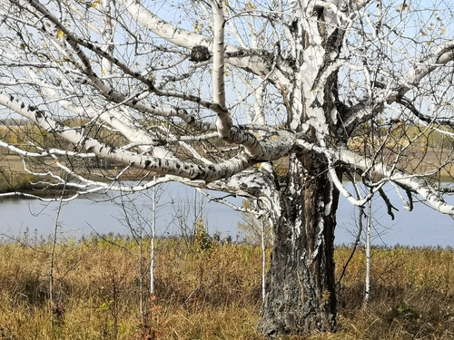

# Silver Birch

> **Node ID**: plants.timber.silver-birch
> **Domain**: [Plants](./index.md)
> **Dependencies**: See prerequisites
> **Enables**: [`Construction`](../construction/index.md), [`Chemistry`](../chemistry/index.md)
> **Timeline**: Years 2-40
> **Outputs**: birch bark (containers, canoes), timber (plywood, turned goods), birch oil, birch sap
> **Critical**: No — versatile northern species but not irreplaceable for any single application

## Overview

> *Silver birch trunks (Betula pendula) the day after the first snow in Brastad, Lysekil Municipality, Sweden.*

> *Image: W.carter, CC BY-SA 4.0*

Silver birch (*Betula pendula*) is a pioneer tree species of northern Eurasia, found from Britain to Siberia and from Scandinavia to the Mediterranean mountains. It is the first tree to colonize cleared land and burned areas, growing rapidly to 15-25 meters tall with a lifespan of 60 to 90 years. Birch wood is pale, fine-grained, and takes an excellent finish, making it suitable for plywood, turned items (bobbins, tool handles), and furniture.

The tree's most distinctive product is its bark. Birch bark is waterproof, flexible, rot-resistant, and can be peeled from living or felled trees in large sheets. It has been used for millennia to make containers, canoes, shelters, and writing surfaces. The bark contains betulin, a compound with antimicrobial properties that contributes to its extraordinary preservation in archaeological contexts.

Birch also yields two useful liquids: sap collected by tapping the trunk in early spring (1-5 liters per day per tree, containing 1-2% sugar), and birch oil (birch tar) produced by destructive distillation of the bark. Birch tar is one of the oldest known adhesives, used by Neanderthals 200,000 years ago to haft stone tools. It remains a serviceable waterproof adhesive and preservative for cordage, leather, and wood.

The wood itself is light (average density 610-670 kg/m³ at 12% MC), uniform in texture, and easy to work. It has no resistance to decay (Class 5, not durable) and must be used dry or treated. Birch plywood, made by laminating thin veneers with perpendicular grain, is strong, stable, and widely used for structural panels and furniture.

Primary outputs: `birch_bark` for containers and canoes, `timber` for plywood and turned goods, `birch_tar` for adhesive, `birch_sap` for drink and sugar.

## Prerequisites

### Materials

- Birch seeds (tiny winged nutlets) collected in summer, or saplings from nursery
- Light, well-drained, acidic to neutral soil
- Birch bark from felled trees (peeled fresh) or from living trees (selective harvest)

### Equipment

- Tapping tools: brace and bit or auger for sap collection holes
- Collection containers (birch bark cones, wooden buckets, or clay pots)
- Destructive distillation setup (earthen pit with collection channel, or metal retort)
- Knife for bark peeling
- Sewing tools (awl, root w ithies) for bark container construction

### Knowledge

- Identification of silver birch (white peeling bark, pendulous branches, triangular doubly-toothed leaves)
- Bark peeling technique: bark comes off most easily in late spring when sap is flowing
- Sap tapping season: early spring when nights are below freezing and days above
- Birch tar distillation: temperature control to avoid burning the tar

### Infrastructure

- Access to birch woodland or plantation
- Sap collection and storage infrastructure (tapped trees, collection vessels, boiling setup for syrup)
- Distillation pit or retort for birch tar production
- Covered drying area for peeled bark sheets

## Process Description

### Birch Bark Harvesting

1. Harvest bark in late spring (May-June in northern hemisphere) when the sap is flowing and the bark separates easily from the inner wood.
2. Select a straight, healthy tree. Make a vertical cut through the bark from about 1.5 meters height down to ground level. Do not cut into the inner wood (phloem) or the tree will be damaged.
3. Peel the bark outward from the vertical cut. It should separate in one clean sheet. A mature tree yields bark sheets 0.5-1.0 meters wide and 2-3 meters long.
4. Harvesting bark from a felled tree is easier and does not harm a standing tree. Peel bark within 48 hours of felling before it dries and adheres.
5. Roll bark sheets with the inner surface facing outward for storage. Store in a cool, dry place. Birch bark keeps indefinitely if kept dry.

### Birch Sap Collection

1. Tap trees in early spring when the sap is rising. Select trees at least 20 cm diameter at breast height.
2. Drill a hole 10-15 mm diameter, 30-50 mm deep, angled slightly upward at 1-1.5 meters height on the trunk. Insert a tap (hollow wooden or metal spile) or collection tube.
3. Hang a collection container below the tap. Sap flows at 1-5 liters per day per tree for 2-4 weeks.
4. Collect sap daily. It is perishable (ferments in 2-3 days at room temperature) and should be consumed fresh, boiled to syrup, or stored cold.
5. When sap flow slows, remove the tap and plug the hole with a wooden dowel to allow the tree to heal.

### Birch Tar Production (Destructive Distillation)

1. Roll birch bark into tight cylinders and pack them into a container (earthen pot or metal retort). The container must have a tight-fitting lid with one outlet hole.
2. Bury the container upside-down in an earthen mound or place in a kiln. The outlet points downward into a collection vessel.
3. Heat the container to 300-400°C. The bark pyrolyzes, producing volatile gases that condense in the collection vessel as birch tar.
4. Continue heating until no more tar drips (2-4 hours for a 5 kg batch of bark).
5. Yield: approximately 15-25% of bark weight as tar. The tar is thick, dark brown to black, with a characteristic smoky smell.
6. The residue in the container is charcoal, usable as fuel.

### Process Parameters

| Parameter | Range | Notes |
|-----------|-------|-------|
| Wood density (12% MC) | 610-670 kg/m³ | Light hardwood |
| Bending strength (MOR) | 80-110 MPa | Good for a light hardwood |
| Modulus of elasticity | 9,500-13,000 MPa | Surprisingly stiff |
| Volumetric shrinkage | 11.0-13.5% | High — prone to warping if dried carelessly |
| Natural durability | Class 5 (not durable) | Must be kept dry or treated |
| Sap yield per tree per season | 30-150 liters | Over 2-4 week tapping season |
| Sap sugar content | 1-2% | Lower than maple (2-3%) |
| Birch tar yield from bark | 15-25% by weight | Destructive distillation at 300-400°C |
| Bark thickness (mature tree) | 1-3 mm | Multiple layers peel together |
| Growth rate (good site) | 0.5-1.0 m/year height | Rapid early growth |
| Rotation age (timber) | 40-60 years | Short for a timber tree |
| Bark yield per tree | 5-15 kg | From felled mature tree |
| Birch tar density | 1.05-1.15 g/cm³ | At 20°C |

### Birch Tar Processing Details

Birch tar (also called birch pitch) was the first synthetic material produced by humans, with archaeological evidence dating to 200,000 years ago. The tar is produced by heating birch bark in the absence of oxygen (destructive distillation or pyrolysis). The temperature must be carefully controlled: below 300°C, tar yield drops sharply; above 400°C, the tar overheats and becomes brittle rather than sticky.

The simplest field method is the pit-and-pot technique: dig a small pit, line it with birch bark rolls (bark side in, inner bark facing outward), place a collection pot beneath the pit, and cover with earth. Build a fire on top of the covered pit. Heat transfers through the earth, pyrolyzing the bark. Tar condenses and flows downward into the collection pot. This method yields 10-15% tar by weight.

A more efficient method uses a closed retort (metal container with a single outlet tube). Pack birch bark rolls tightly, seal the container, and heat over a fire. The outlet tube leads to a collection jar. This method yields 15-25% and produces cleaner tar because the condensate does not contact ash or earth. The retort method requires metalworking capability (iron or bronze container).

Fresh birch tar is a viscous, dark brown to black liquid at room temperature. It softens at 30-40°C and becomes fully liquid at 60-80°C. For tool hafting, warm the tar until liquid, apply to the joint (e.g., stone spear point in a wooden shaft), and wrap with wet rawhide or cordage. The tar sets hard as it cools. Birch tar adhesive bonds are water-resistant and durable — artifacts from 50,000 years ago retain their hafted points with intact birch tar bonds.

### Timber Uses and Seasoning

Birch wood is pale cream to light brown with no distinct heartwood-sapwood boundary. It is fine-textured, uniform, and takes an excellent finish with hand planes and scrapers. Birch is particularly valued for turned items (bobbins, tool handles, dowels, chair legs) because it turns cleanly without chipping. The wood also bends well with steam, making it suitable for bentwood furniture and boat ribs.

Season birch lumber promptly after felling. The wood stains easily if left in log form during warm weather — a brown fungal discoloration that reduces value. Saw logs within 2 weeks of felling and stack for air drying immediately. Birch takes 6-12 months to air-dry to 15% moisture content in 25 mm boards. Quarter-sawn birch is more dimensionally stable than flat-sawn due to the high volumetric shrinkage.

## Safety Considerations

- Birch tar is a skin sensitizer. Repeated handling causes contact dermatitis. Wear gloves when working with fresh tar.
- Birch tar fumes during distillation are irritating to eyes and respiratory tract. Perform distillation outdoors or in a well-ventilated space.
- Birch sap ferments readily. Consuming fermented sap (birch wine) causes intoxication. Fresh sap is safe.
- Drilling tap holes with an auger can cause wrist injuries if the bit catches. Brace yourself and use a sharp bit.
- Birch trees are shallow-rooted and prone to windthrow. Do not camp or work under birch in high winds.
- Birch bark is extremely flammable. Do not store bark near open flames or heat sources.

### Personal Protective Equipment

- Leather gloves for bark peeling and tar handling
- Eye protection when drilling tap holes or using cutting tools
- Respiratory protection during birch tar distillation
- Long sleeves for woodland work

## Quality Control

### Acceptance Criteria

- **Bark sheets**: No tears or holes, minimum width 30 cm, flexible (not brittle), inner surface clean
- **Birch sap**: Clear, slightly sweet taste, no cloudiness or off-odors. If cloudy, it has started to ferment
- **Birch tar**: Thick, dark brown to black, sticky at room temperature, no visible charcoal particles
- **Timber**: Pale, uniform color, no discoloration (brown stain), moisture content 10-15% for furniture use

### Testing Methods

- Bark flexibility test: bend a strip 180° around a 25 mm diameter mandrel. Good bark flexes without cracking.
- Sap freshness test: smell and taste. Fresh sap is slightly sweet with no sourness. Cloudy sap is past its prime.
- Tar adhesion test: apply a thin film to two pieces of wood, press together, and allow to set for 24 hours. The bond should resist hand-pulling.
- Tar purity: dissolve a sample in alcohol. Pure birch tar dissolves completely. Charcoal residue indicates incomplete distillation or contamination.

## Scaling Notes

- **Individual tree**: 30-150 liters of sap per season, 1-4 large bark sheets, 0.3-1.0 cubic meters of timber.
- **Birch woodland** (10 hectares): 2,000-5,000 trees. Sap collection from 200 tapped trees: 6,000-30,000 liters per season, boiling down to 60-600 liters of birch syrup.
- **Birch tar production**: A single pit distillation processes 5-10 kg of bark in 3-4 hours, yielding 0.75-2.5 kg of tar. For larger production, build multiple pits or use a larger retort.
- **Bottleneck**: Birch tar production is labor-intensive and low-yield. For large-scale adhesive needs, pine resin or animal glue may be more practical.

## Troubleshooting

| Problem | Probable Cause | Solution |
|---------|---------------|----------|
| Bark tears during peeling | Too early or too late in season; tree unhealthy | Peel in late spring when sap is flowing; select healthy, straight trees |
| Bark sticks to wood | Harvested from a tree felled too long ago | Peel bark within 48 hours of felling |
| Sap flow stops after a few days | Hole clogged or healed; dry weather | Clean the tap hole; wait for a freeze-thaw cycle to restart flow |
| Birch tar too thin and runny | Distillation temperature too high, overheating | Reduce temperature; stop heating when tar flow becomes thin |
| Birch tar contaminated with charcoal | Bark rolls too loose; container leaked ash | Pack bark more tightly; ensure container seal is intact |
| Timber warps badly during drying | Birch has high shrinkage; stacked poorly | Stack with close sticker spacing (30 cm); weight the stack top |

## Variations and Alternatives

- **Downy birch** (*Betula pubescens*): Closely related, found in wetter, colder sites. Bark quality similar but timber slightly lighter.
- **Paper birch** (*Betula papyrhorta*): North American species with superior bark for canoe building. Bark peels in larger, more flexible sheets than silver birch.
- **Yellow birch** (*Betula alleghaniensis*): North American species with harder, denser wood (720 kg/m³). Better for furniture and flooring than silver birch.
- **Birch syrup**: Boiling sap to 66% sugar produces birch syrup with a complex, savory-sweet flavor. Yield is much lower than maple (80-100 liters of sap per liter of syrup for birch vs. 40:1 for maple).
- **Alternative adhesives**: Pine resin, animal hide glue, or casein glue can substitute for birch tar in most applications. Birch tar's advantage is water resistance and ease of production from available bark.
- **Birch charcoal**: Birch wood produces high-quality charcoal with a fine pore structure, valued for blacksmithing and smelting. The charcoal burns hot and clean, making it suitable for ironworking.

### Bark Products and Containers

Birch bark containers (makuks, winnowing baskets, waterproof boxes) are constructed by folding and sewing bark sheets with split roots or rawhide thongs. The bark is waterproof, lightweight, and semiridig — ideal for water transport, food storage, and shelter cladding. Birch bark canoes (constructed over a cedar or spruce frame) were the primary watercraft of the North American subarctic, capable of carrying loads over portages that would crush a dugout canoe. For writing surfaces, the smooth inner bark of birch has been used from ancient India (bhurja patra) through medieval Russia (birchbark manuscripts from Novgorod), accepting ink and stylus marks without preparation.

## References

- [Construction](../construction/index.md) — plywood and timber applications
- [Chemistry](../chemistry/index.md) — birch tar as adhesive and preservative
- [Scots Pine](./pinus-sylvestris.md) — comparison timber and resin source
- [Marine](../marine/index.md) — birch bark canoes for water transport
- [Plants Domain](./index.md) — domain overview and related capabilities

### Birch Bark Canoe Construction

The birch bark canoe represents one of the most sophisticated pre-industrial technologies
in North America. A typical canoe is 4-6 meters long, weighs 20-30 kg, and can carry
several hundred kilograms of cargo. The hull is a single sheet of birch bark (or several
sheets sewn together with split spruce roots), stretched over a cedar or spruce frame,
and sealed at the seams with spruce gum or pine resin.

The bark is harvested in late spring when it peels most easily, rolled with the inner surface
facing outward for transport, and stored until needed. The frame is assembled from cedar
ribs and spruce root lashings. The bark is then stretched over the frame, sewn at the seams,
and the gunwales are lashed in place. The final step is waterproofing: all seams are sealed
with a mixture of spruce gum, animal fat, and charcoal applied warm.

A well-made birch bark canoe lasts 5-10 years with regular maintenance (re-gumming seams
annually) and can be repaired in the field using materials carried aboard. The canoe is
light enough to be portaged overland by one person, making it the ideal watercraft for
the lake-and-river country of subarctic North America.

---
*Part of the [Bootciv Tech Tree](../../index.md) · [Plants](./index.md) · [All Domains](../../index.md)*
