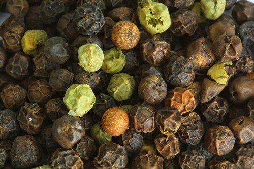

# Black Pepper

> **Node ID**: plants.edible-plants.black-pepper
> **Domain**: [Plants](./index.md)
> **Dependencies**: See prerequisites
> **Enables**: [`Edible Plants`](edible-plants.md)
> **Timeline**: Years 0-5
> **Outputs**: edible_plant_material
> **Critical**: No

## Overview

> *Piper nigrum, black pepper being still green in the Jardin du Roi, Mahe, Seychelles.*

> *Image: NorbertNagel, CC BY-SA 4.0*

Black Pepper

*Piper nigrum* (Piperaceae) is a medicinal & spice plant species of major importance for civilization bootstrapping. Pepper provides fruit, seeds/nuts, spice/beverage as its primary edible product and ranks 73/100 on the nutrition score.

An evergreen climbing vine reaching 6 meters tall with a 1-meter spread, growing at a fast rate. Hardy to UK zone 10. Tolerates light sandy, medium loamy, and heavy clay soils with good drainage; adapts to mildly acidic through basic pH levels. Prefers moist conditions and semi-shaded environments but is intolerant of wind exposure.

Edible parts: Seeds, Herb, Spice, Fruit The pungent fruits — known as peppercorns — are dried and ground into black pepper, one of the world's most widely used condiments. The globose red fruits are 4–6mm in diameter and deliver a hot flavour. White pepper, which is milder, is made by removing the outer fruit coverings before drying. Unripe green fruits can be pickled in vinegar and used as a relish. An essential oil obtained from the seed is used as a flavouring in various foods.

Berries dried with the skin give white pepper. Berries where the skin is soaked off produce black pepper. To do these they are soaked in water for a few days. Plants produce in the third year. They can continue producing for 20 years. Flowering normally follows rain. Fruit ripen after 3-4 months.

For civilization bootstrapping, black pepper is significant because of its role as a medicinal & spice plant. Reliable food production is the foundation upon which all other technological development rests. Understanding the cultivation, processing, and storage of *Piper nigrum* enables communities to establish food security and allocate labor to non-subsistence activities.

*Piper nigrum* is a member of the Piperaceae family. As a medicinal & spice plant, it provides essential calories, protein, or other nutrients needed to sustain human populations during the bootstrap process. The ability to produce food reliably from cultivated plants is what separates sedentary civilizations from hunter-gatherer societies, because food surplus allows specialization of labor into toolmaking, construction, and eventually metallurgy and beyond.

This species grows as a perennial or annual depending on climate and management. Propagation is primarily by Propagate by seed or by cuttings — very easy. Use shoots of wood about 45cm long, taken from parts of the plant that have already flowered.. Harvest timing depends on the plant part used: fruit, seeds/nuts, spice/beverage are typically ready at specific growth stages or seasons.

## Prerequisites

### Materials

- Propagation material: Propagate by seed or by cuttings — very easy. Use shoots of wood about 45cm long, taken from parts of the plant that have already flowered.
- Compost or organic matter for soil amendment
- Mulch material for moisture retention and weed suppression

### Equipment

- Hoe or digging stick for soil preparation and planting
- Sickle, machete, or harvesting knife for crop harvest
- Drying racks or flat drying surfaces for post-harvest processing
- Storage containers: woven baskets, ceramic jars, or sacks for dried product
- Winnowing baskets or screens if processing grains or seeds

### Knowledge

- Species identification: A climbing, green, leafy vine. It is woody. The nodes are enlarged. The plant has roots on the main stem which attach to tree trunks. The vines can be 8-10 m long. The leaf stalk is 1-2 cm long. The leaf blade is oval and 10-15 cm long by 5-9 cm wide. It is thick and leathery. The base is rounded and the tip tapers to a point. Flowers are small, borne on slender spikes 5-12 cm long that hang opposite the leaves. Fruit is a small drupe 3-5 mm in diameter, green when immature, turning red when ripe, black when dried.
- Understanding of planting timing relative to local frost dates and rainy seasons
- Knowledge of soil preparation, seed depth, and spacing requirements
- Recognition of common pests and diseases and their early indicators
- Safe preparation methods for any toxic or bitter compounds (see Safety)

### Infrastructure

- Field or garden site with suitable climate, soil type, and sun exposure
- Reliable water access for germination and establishment phase
- Fenced or protected area if animal browsing is a risk
- Storage structure protected from moisture, rodents, and insects

## Process Description

### Cultivation and Propagation

A plant of the hot and humid lowland tropics, where it grows best at elevations up to 500 metres, but can be grown up to 2,000 metres. It grows best in areas where annual daytime temperatures are within the range 22 - 35°c, but can tolerate 10 - 40°c. It prefers a mean annual rainfall in the range 2,500 - 4,000mm, but tolerates 2,000 - 5,500mm. Grows best in sheltered positions in semi-shade. Prefers a neutral soil rich in organic matter. Prefers a pH in the range 6 - 7, tolerating 5 - 7.5. Level ground is most suitable for the production of pepper, prov ided there is no flooding, but it is often grown in rolling country or on hill slopes of varying steepness. The plant begins to bear in 3 - 4 years, can reach full production after 7 years and has an economic life of about 12 - 20 years. Optimum yields at low capital input are 6 tonnes per hectare of the unprocessed (green) peppers; 2 tonnes of the sundried (black) peppers; or 1.67 tonnes of the washed and dried (white) peppers. In gardens with higher inputs, yields may be 8 - 9 tonnes of green pepper in the first harvest and 12 - 20 tonnes in the sixth or seventh harvest. The root system can be 4 metres or more deep. Flowering Time: Mid Summer. Bloom Color: White/Near White. Spacing: 12-15 ft. (3.6-4.7 m). Propagation: Propagate by seed or by cuttings — very easy. Use shoots of wood about 45cm long, taken from parts of the plant that have already flowered.

### Distribution and Growing Conditions

### Identification

A climbing, green, leafy vine. It is woody. The nodes are enlarged. The plant has roots on the main stem which attach to tree trunks. The vines can be 8-10 m long. The leaf stalk is 1-2 cm long. The leaf blade is oval and 10-15 cm long by 5-9 cm wide. It is thick and leathery. The base is rounded and it tapers to a short tip. The flowers are usually of one sex but many flowers occur together. The spikes are opposite the leaves. The spikes are 3-3.5 cm long by 0.8 mm wide. They can be 10 cm long. It has clusters of berries on the side branches. The berries are red when ripe. They are 3-4 mm across.

### Edible Parts and Preparation

## Quantitative Parameters

### Nutritional Composition (per 100g)

| Part | Moisture | kJ | kcal | Protein | Vit A | Vit C | Iron | Zinc |
| --- | --- | --- | --- | --- | --- | --- | --- | --- |
| Seeds - white | 11.4 | 1238 | 296 | 10.4 | 0 | 21 | 14.3 | 1.1 |
| Seeds - black | 10.5 | 1067 | 255 | 11 | 19 | 21 | 28.9 | 1.4 |

### Growing Parameters

| Parameter | Value | Notes |
|-----------|-------|-------|
| Annual rainfall | 2500 mm | Growing requirement |
| Germination temperature | 26°C | Optimal |
| Hardiness zones | 10-12 | USDA |
| Edible parts | Fruit, Seeds/Nuts, Spice/Beverage | Primary harvest |

## Processing and Storage

### Non-Food Uses

An essential oil obtained from the fruits is used in perfumery to create oriental-type bouquets with spicy notes.

### Storage

Dry seeds thoroughly to below 14% moisture content before storage. Spread in thin layers on drying racks in full sun, stirring periodically. Test dryness by biting: properly dried seeds crack rather than dent. Store in airtight containers (ceramic jars with tight lids, sealed woven bags) in a cool, dry, dark location. Protect from rodents and insects with tight lids or by mixing with inert ash. Under good conditions, dried grains and legumes store for 1-5 years with minimal loss.

### Material Handling

Handle black pepper produce with clean hands and tools to prevent contamination. Remove field heat promptly after harvest by moving product to shade. Process within the recommended timeframe to prevent quality loss. Compost crop residues and processing waste to return organic matter to the soil. Label stored products with harvest date, variety, and any treatments applied.

## Scaling Notes

- **Bench scale**: Individual plants or small garden plot (10-50 plants). Output for direct household consumption. Useful for seed saving, variety selection, and learning the crop's behavior under local conditions.
- **Pilot scale**: Field planting of 0.1 to 1 hectare (500-5,000 plants). Staggered planting or sequential harvests to extend availability. Requires basic hand tools and family-level labor. Surplus can be traded or stored.
- **Production scale**: Multi-hectare cultivation with mechanized planting, harvesting, and processing. Requires plow animals or tractors, grain mills or processing equipment, and bulk storage facilities. Enables community-level food security and trade.
  Reported production data: Berries dried with the outer skin intact give black pepper. Berries where the skin is soaked off produce white pepper. To produce white pepper, ripe berries are soaked in water for 5-7 days until the outer skin softens, then rubbed off. Plants begin producing in the third year. They can continue yielding for 15-20 years. Yields of 2-4 kg dried pepper per vine per year are typical.

Key scaling challenges include maintaining genetic diversity at plantation scale, managing pest and disease pressure in monoculture, and matching post-harvest processing capacity to harvest volume. Seed saving and variety selection at bench scale directly informs decisions about which cultivars to scale up.

## Troubleshooting

| Problem | Probable Cause | Solution |
|---------|---------------|----------|
| Poor germination | Old seed, wrong soil temperature, planted too deep, or insufficient moisture | Use fresh seed; verify germination temperature range; plant at recommended depth; maintain soil moisture during germination |
| Pest damage | Insect infestation or browsing animals | Hand-pick pests; use companion planting with repellent species; install fencing for larger pests |
| Disease (fungal/bacterial) | Poor air circulation, excessive moisture, infected seed | Space plants adequately; avoid overhead watering; use clean seed from disease-free plants; practice crop rotation |
| Low yield | Nutrient deficiency, water stress, overcrowding, or shade | Amend soil with compost or manure; ensure adequate water at critical growth stages; thin to recommended spacing; plant in full sun |
| Storage losses | Insufficient drying, rodent/insect damage, high humidity | Dry product thoroughly before storage; use sealed containers; inspect stored product regularly; keep storage area clean and dry |
| Quality or safety note | See species-specific notes | There are between 1000-2000 Piper species. They are mostly in the tropics. |

## Safety Considerations

Working with *Piper nigrum* involves the following hazards:

- **Toxicity**: Parts of this plant may contain compounds that are toxic when raw or improperly prepared. Always follow proper preparation procedures before consumption. Verify with multiple authoritative sources.
- Tool injuries during harvest and processing — use sharp tools in good condition and cut away from the body
- Allergic reactions to plant compounds — sensitive individuals should test small quantities first
- Sun exposure and heat stress during field work — schedule heavy work for early morning or late afternoon
- Musculoskeletal strain from repetitive harvesting motions — vary tasks and take regular breaks

### Personal Protective Equipment

- Sturdy gloves when handling plants with irritant sap, spines, or rough surfaces
- Long sleeves and trousers for field work to reduce skin exposure to irritants and insects
- Eye protection when using cutting tools overhead or near face level
- Sun hat and sunscreen for extended field work

### Emergency Procedures

- For suspected plant poisoning: stop eating immediately, save a sample of the plant material, and seek medical attention. Do not induce vomiting unless directed by a medical professional.
- For tool lacerations: apply direct pressure with a clean cloth, elevate the wound, and seek medical attention for cuts deeper than skin level.
- For allergic reaction (swelling, difficulty breathing): discontinue exposure immediately and seek emergency medical help.

## Quality Control

### Acceptance Criteria

- Harvest product shows expected color, texture, size, and flavor for the variety grown
- No visible mold, rot, pest damage, or foreign material in stored product
- Dried products are brittle throughout with no flexible or moist spots
- Seeds intended for storage test at below 14% moisture content

### Testing Methods

- **Visual inspection**: check for discoloration, mold, insect damage, or foreign material
- **Bite test (seeds/grains)**: properly dried seeds crack cleanly; under-dried seeds dent or feel leathery
- **Smell test**: fresh product has characteristic aroma; off-odors indicate spoilage or contamination
- **Snap test (dried products)**: properly dried material snaps rather than bends

### Sampling Protocol

For field-scale production, inspect every 10th plant during harvest for disease and pest damage. Grade each batch by size and quality before storage. Record yield per unit area to track productivity trends across seasons and identify declining performance early.

## Variations and Alternatives

### Medicinal Uses

Black pepper fruits contain an essential oil (comprising beta-bisabolene, camphene, beta-caryophyllene, and many other terpenes and sesquiterpenes), up to 9% alkaloids — particularly piperine, which accounts for the acrid taste — around 11% protein, and small amounts of minerals. The fruit is a pungent, aromatic, warming herb that lowers fever, acts as an antiseptic, and improves digestion. In Western and Ayurvedic medicine, black pepper is regarded as a stimulating expectorant; in Chinese medicine it is considered tranquilizing and anti-emetic. Used internally in Western herbalism, the seed treats indigestion and wind. In Chinese medicine it is a warming herb for stomach chills, food poisoning, cholera, dysentery, diarrhoea, and cold-induced vomiting. In Ayurvedic medicine it is applied externally to treat nasal congestion, sinusitis, epilepsy, and skin inflammations. The essential oil is antiseptic, antibacterial, and febrifuge, and has been used to relieve rheumatic pain and toothache.

### Other Uses

### Additional Information

In Papua New Guinea it is becoming of some importance as a cash crop but is little used locally as a spice. About 80,000 tons are produced each year worldwide. It is a cultivated food plant.

### Notes

There are between 1000-2000 Piper species. They are mostly in the tropics.

### Related Species

- [Moringa](moringa.md)
- [Ginger](ginger.md)
- [Turmeric](turmeric.md)

### Cultivar Selection

Within *Piper nigrum*, considerable variation exists in yield, disease resistance, climate adaptation, and quality characteristics. When establishing a black pepper crop, select varieties adapted to local conditions: day length, temperature range, rainfall pattern, and soil type. Landrace varieties — locally adapted populations maintained by traditional farmers — often outperform modern cultivars under low-input conditions because they have been selected for resilience rather than maximum yield under optimal conditions.

Seed saving from the best-performing plants each generation gradually adapts the variety to local conditions. Select for vigor, disease resistance, appropriate maturity timing, and product quality. Maintain genetic diversity by saving seed from multiple plants rather than a single individual, which preserves the population's ability to adapt to changing conditions and disease pressures.

### Crop Rotation and Companion Planting

*Piper nigrum* benefits from crop rotation to prevent buildup of species-specific pests and diseases. Avoid planting in the same field in consecutive seasons where possible. Follow with a different crop family to break pest cycles and maintain soil health.

Companion planting with aromatic herbs or flowering plants can deter pests and attract beneficial insects. Avoid planting near species that compete for the same nutrients or harbor shared pathogens.

## References

- [Edible Plants](edible-plants.md) — parent capability
- [Plants Domain](./index.md) — domain overview and related capabilities
- [Agave](agave.md) — example plant article format
- [Food Processing](../food-processing/index.md) — downstream processing of harvested crops
- [Agriculture](../agriculture/index.md) — cultivation systems and crop rotation
- Family: Piperaceae
- Distribution: Andorra, United Arab Emirates, Afghanistan, Antigua &amp; Barbuda, Albania, Armenia, Angola, Argentina, Austria, Australia, Azerbaijan, Bosnia &amp; Herzegovina, Barbados, Bangladesh, Belgium, Burkina Faso, Bulgaria, Bahrain, Burundi, Benin and 175 more
- Data sourced from Food Plants International, Wikipedia, and iNaturalist via the Edible Plant Database (ZIM)
- Plants for a Future (pfaf.org) — supplementary cultivation and use data

---
*Part of the [Bootciv Tech Tree](../index.md) · [Plants](./index.md) · [All Domains](../index.md)*
