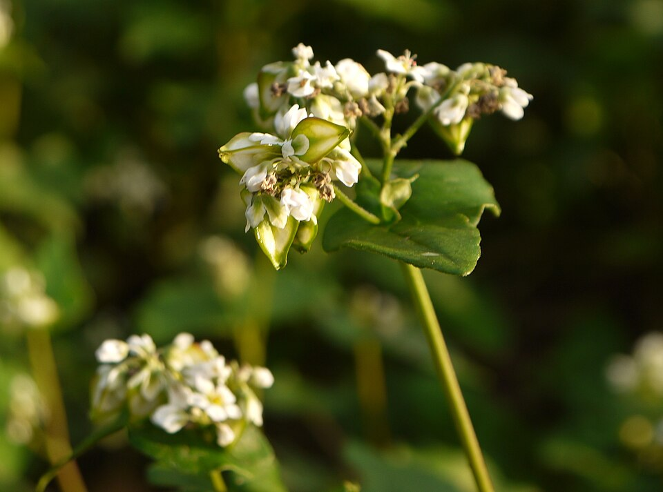

# Buckwheat

> **Node ID**: plants.edible-plants.buckwheat
> **Domain**: [Plants](./index.md)
> **Dependencies**: See prerequisites
> **Enables**: [`Edible Plants`](edible-plants.md)
> **Timeline**: Years 0-5
> **Outputs**: edible_plant_material
> **Critical**: No

## Overview

> *817 V300*

> *Image: STRONGlk7, CC BY-SA 3.0*

Buckwheat

*Fagopyrum esculentum* (Polygonaceae) is a staple food crop species of major importance for civilization bootstrapping. Buckwheat, Japanese buckwheat, Silverhull buckwheat provides leaves, seeds/nuts, flowers as its primary edible product and ranks 57/100 on the nutrition score.

Annual herb reaching 1.5 m tall and 0.3 m wide, growing quickly and unsuitable for shade. Frost tender with flowers appearing July to September and seeds maturing August to October. Monoecious flowers pollinated by bees and flies. Thrives in light sandy, medium loamy, or heavy clay soils with good drainage; tolerates poor nutrition, very acid to alkaline pH, and drought conditions. Notable for attracting wildlife.

Edible parts: Seeds, Leaves, Flowers Leaves can be eaten raw or cooked like spinach. They are not particularly impressive raw but improve with cooking, and their richness in rutin makes them a very healthy addition to the diet. The seed has a nutty flavour, though a somewhat gritty texture that not everyone enjoys. It can be cooked like rice, soaked overnight in warm water and sprouted for a few days to add to salads, or ground into flour for pancakes, noodles, bread, and similar foods, and used as a thickening agent in soups. Buckwheat flour can be mixed with wheat, barley, or rye flour to improve taste and nutritional value — up to 30% buckwheat flour can be included in wheat bread dough. Because it contains no gluten, it is suitable for people with coeliac disease. The seed is rich in vitamin B6. Excellent beer can be brewed from the grain. Fresh leaves and inflorescences are used for industrial extraction of rutin, which is applied to strengthen the inner lining of blood vessels. Rutin is also used industrially as a natural pigment, antioxidant, stabiliser, food preservative, and UV light absorber.

Seeds usually germinate in 5 days. It has a very short growing period from sowing to maturity. It can produce a crop of leaves in 8 weeks and seeds in 12 weeks. Seed ripen irregularly over several weeks making harvesting difficult. Under cool conditions plants flower in 7-9 months. Commercial grain yields in Australia have been up to 2.5 tonnes/ha. In India yields of 600-800 kg/ha are achieved.

For civilization bootstrapping, buckwheat is significant because of its role as a staple crop. Reliable food production is the foundation upon which all other technological development rests. Understanding the cultivation, processing, and storage of *Fagopyrum esculentum* enables communities to establish food security and allocate labor to non-subsistence activities.

*Fagopyrum esculentum* is a member of the Polygonaceae family. As a staple food crop, it provides essential calories, protein, or other nutrients needed to sustain human populations during the bootstrap process. The ability to produce food reliably from cultivated plants is what separates sedentary civilizations from hunter-gatherer societies, because food surplus allows specialization of labor into toolmaking, construction, and eventually metallurgy and beyond.

This species grows as a perennial or annual depending on climate and management. Propagation is primarily by Sow seed in situ from mid-spring to early summer. Germination typically occurs within 5 days. Earlier sowings are intended for a seed or leaf crop; later sowings are used mainly for leaf crops or green manure.. Harvest timing depends on the plant part used: leaves, seeds/nuts, flowers are typically ready at specific growth stages or seasons.

## Prerequisites

### Materials

- Propagation material: Sow seed in situ from mid-spring to early summer. Germination typically occurs within 5 days. Earlier sowings are intended for a seed or leaf crop; later sowings are used mainly for leaf crops or green manure.
- Compost or organic matter for soil amendment
- Mulch material for moisture retention and weed suppression

### Equipment

- Hoe or digging stick for soil preparation and planting
- Sickle, machete, or harvesting knife for crop harvest
- Drying racks or flat drying surfaces for post-harvest processing
- Storage containers: woven baskets, ceramic jars, or sacks for dried product
- Winnowing baskets or screens if processing grains or seeds

### Knowledge

- Species identification: An upright annual herb up to 1 m high. It spreads to 1 m across. It has angular hollow stems. These are erect and branching. Leaves are heart shaped or triangular and small. It has groups of white or pink flowers. These have a smell. They occur in clusters at the ends of branches. Fruit are small an
- Understanding of planting timing relative to local frost dates and rainy seasons
- Knowledge of soil preparation, seed depth, and spacing requirements
- Recognition of common pests and diseases and their early indicators
- Safe preparation methods for any toxic or bitter compounds (see Safety)

### Infrastructure

- Field or garden site with suitable climate, soil type, and sun exposure
- Reliable water access for germination and establishment phase
- Fenced or protected area if animal browsing is a risk
- Storage structure protected from moisture, rodents, and insects

## Process Description

### Cultivation and Propagation

Fagopyrum esculentum is a plant of the temperate and subtropical zones, though it can also be grown at higher elevations, generally above 1,500 metres, in the tropics. It grows best in areas where annual daytime temperatures are within the range 17 - 27°c, but can tolerate 7 - 40°c. It is very sensitive to frost. It prefers a mean annual rainfall in the range 700 - 1,000mm, but tolerates 400 - 1,300mm. A very easily grown plant, it prefers dry sandy soils but succeeds in most conditions, including poor, heavy or acid soils and even sub-soils. It prefers a pH in the range 5 - 6.5, tolerating 4.4 - 7.5. It prefers a cool moist climate, but it also succeeds in dry and arid regions. Hot drying temperatures and drying weather at blooming time blast the flowers and prevent seed formation. The plant has a poorly developed root system that makes it rather sensitive to drought. Fagopyrum esculentum is cultivated in many parts of the world for its edible seed. It is a prolific producer of seeds, and these are often spread by animal activity. It easily escapes from cultivation and can become established as a weed of cultivated and waste ground, though it is easy to control and does not usually become a pest. Buckwheat is a fast-growing plant that can reach its full height within 4 - 6 weeks. Flower formation starts 20 days after emergence, the plant continuing to flower until complete senescence and death of the whole plant. After the onset of flowering, the leaves and stems continue to grow while the fruits develop; hence seed ripening is very uneven, making harvesting difficult. From the middle of the flowering period onwards, when the leaf area has reached its maximum, further growth of the vegetative parts is slow, and producing ripe seed becomes the main focus of the plant. The seed is ready for harvesting 70 - 130 days after emergence, depending on cultivar and ecological conditions[141 , 183 , 299 , 418 ]. The seed is harvested when most of it (at least 75%) is mature, and most leaves have yellowed and dropped. The crop is harvested by mowing, after which the stems are bundled and put in heaps to dry. Farmers prefer to harvest early in the morning or late in the afternoon, or even at night, when the plants are slightly damp from dew, to reduce grain shattering. The average seed yield in the United States is 0.9 - 1 tonne per hectare; in Kenya, it is 1 tonne, and in Russia 1 - 1.3 tonnes; but up to 4 tonnes can be obtained. The seed ripens irregularly over a period of several weeks, so it is difficult to harvest. Plants have poor frost resistance, but they are disease and insect resistant. They inhibit the growth of winter wheat. There are some named varieties. The flowers have a pleasant sweet honey scent and are extremely attractive to bees and hoverflies. Propagation: Sow seed in situ from mid-spring to early summer. Germination typically occurs within 5 days. Earlier sowings are intended for a seed or leaf crop; later sowings are used mainly for leaf crops or green manure.

### Distribution and Growing Conditions

### Identification

An upright annual herb up to 1 m high. It spreads to 1 m across. It has angular hollow stems. These are erect and branching. Leaves are heart shaped or triangular and small. It has groups of white or pink flowers. These have a smell. They occur in clusters at the ends of branches. Fruit are small and 3 angled. The plants are not grasses but the seeds are normally grouped with other grain crops.

### Edible Parts and Preparation

**Seeds (groats)** are the primary harvest. Buckwheat seeds (*Fagopyrum esculentum*) are triangular, 5-7 mm across, with a dark brown to black hull surrounding a white starchy interior. Despite the name, buckwheat is not a cereal — it is a pseudocereal in the Polygonaceae family, unrelated to wheat. It contains no gluten.

**Groats preparation**: Raw groats have a tough, fibrous hull that must be removed. After dehulling, the groat (seed interior) can be cooked whole like rice: simmer 1 part groats in 2 parts water for 15-20 minutes until tender. Toasted groats are known as *kasha* in Eastern European cuisine — dry-roast groats in a hot pan (180-200°C) for 3-5 minutes, stirring constantly, until fragrant and golden-brown. Toasting reduces bitterness and develops a nutty flavor. Toasted groats cook faster (10-12 minutes) and have a firmer texture.

**Flour**: Buckwheat flour comes in two grades:
- **Light flour** (from hulled groats): Pale, mild-flavored, higher in starch. Used for pancakes, crêpes (galettes in Brittany), and noodles (soba in Japan).
- **Dark flour** (from whole seeds including hull fragments): Dark speckled, stronger flavor, higher in fiber and rutin. Used for pumpernickel-style breads and hearty pancakes. Mixed with wheat flour at 20-30% for composite breads — buckwheat's lack of gluten prevents rising if used alone.

Buckwheat flour is 10-12% protein with a well-balanced amino acid profile (rich in lysine, unlike most cereals). It spoils faster than wheat flour due to higher fat content — store in cool conditions and use within 3-6 months.

**Leaves** are edible raw or cooked like spinach. Harvest young leaves before flowering for tenderness. Cooking improves flavor and digestibility. Leaves contain up to 6% rutin (a flavonoid that strengthens blood vessel walls), making them the richest dietary source of this compound.

**Flowers** produce nectar yielding dark, strong-flavored honey. Buckwheat honey has a distinctive molasses-like taste and is rich in antioxidants. One hectare of flowering buckwheat can support 2-3 beehives, producing 60-150 kg honey per season.

## Quantitative Parameters

### Nutritional Composition (per 100g)

| Part | Moisture | kJ | kcal | Protein | Vit A | Vit C | Iron | Zinc |
| --- | --- | --- | --- | --- | --- | --- | --- | --- |
| Seed | 11.3 | 1404 | 336 | 10.3 | — | — | 3 | — |

### Growing Parameters

| Parameter | Value | Notes |
|-----------|-------|-------|
| Yield | 800 kg/ha | Reported yield |
| Growing period | 5 days | Time to maturity |
| Altitude | 1000–2500 m | Growing elevation |
| Edible parts | Leaves, Seeds/Nuts, Flowers | Primary harvest |

## Processing and Storage

### Non-Food Uses

An excellent green manure plant, buckwheat can be used to reclaim badly degraded soils and subsoils. A blue dye is obtained from the stems and a brown dye from the flowers. It has historically been used as feed for cattle, pigs, and chickens. As a cover crop it is the fastest-maturing of all options, flowering within 3–6 weeks and fully maturing in 11–12 weeks. It grows quickly enough to suppress weeds effectively, a use documented in North America for several centuries. It also prevents erosion, improves soil aggregate stability, and scavenges nutrients such as phosphorus and calcium, including mineralising rock phosphate. Buckwheat is an excellent plant for bee pasture — approximately one acre can provide sufficient forage for a hive, producing around 150 pounds of honey per season. Its flowers also attract beneficial insects including parasitic wasps, minute pirate bugs, insidious flower bugs, tachinid flies, ladybeetles, and hoverflies, which may prey on pests in neighbouring crops. It is sometimes included in birdseed mixes and wildlife food plot plantings.

### Storage

**Dried seed**: Buckwheat stores well as whole seed at below 13% moisture in sealed containers. The thick hull provides protection against moisture and pests. Whole seed retains quality for 2-3 years in cool, dry storage. Monitor for pantry moths (*Plodia interpunctella*) and weevils.

**Flour storage**: Buckwheat flour has a shorter shelf life than wheat flour due to 2-3% fat content that oxidizes and turns rancid. Store in airtight containers at 5-10°C for up to 6 months; at room temperature, use within 2-3 months. Whole seed ground fresh produces the best-flavored flour. Rancid flour has a paint-like odor.

**Groats (hulled)**: Store dehulled groats in airtight containers at cool temperatures for 6-12 months. Toasted groats (kasha) have slightly longer shelf life because toasting denatures lipase enzymes that cause rancidity.

### Harvesting and Threshing

Buckwheat's indeterminate flowering habit means seeds ripen unevenly over several weeks. The critical harvest decision:

- **Timing**: Harvest when approximately 75% of seeds have turned from green to dark brown. If you wait for 100%, the earliest seeds will have already shattered (fallen from the plant). At 75% brown seed, the crop has reached maximum yield.
- **Method**: Cut plants with a sickle or scythe when morning dew is still present (dew reduces shattering). Gather cut plants into sheaves and stand upright in the field to dry for 3-5 days (shocking). The residual moisture in the stem allows late seeds to continue ripening during this curing period.
- **Threshing**: Flail the dried sheaves on a hard surface. Buckwheat threshes relatively easily — the small, triangular seeds separate from the chaff with moderate beating. Throughput with hand flailing: 15-30 kg/hour.
- **Winnowing**: Pour threshed mixture from shoulder height in a light breeze (2-4 m/s). The lightweight chaff blows away; the heavy seeds (specific gravity ~1.2) fall straight down. Repeat 3-4 times. Buckwheat chaff is exceptionally light — winnowing is easier than for wheat or barley.

### Milling and Processing

1. **Dehulling**: Buckwheat hulls are thicker and more fibrous than cereal grain husks. Use a mortar and pestle or a mechanized dehuller (two abrasive surfaces with a gap slightly larger than the groat but smaller than the whole seed). Hull removal rate: 70-85% per pass; re-process un-hulled seeds. Hulls constitute 18-22% of whole seed weight.

2. **Grinding for flour**: Grind dehulled groats on a stone mill or between flat stones. For light flour, sift through a 0.5 mm mesh to remove hull fragments. For dark flour, grind whole seed with hulls included (provides fiber and rutin but coarser texture). Grinding yield: 65-70% light flour or 85-90% dark flour from whole seed.

3. **Groat sorting**: After dehulling, sort groats by size using a slotted screen or basket. Uniform groat size ensures even cooking. Discard broken and discolored groats (indicate mold or insect damage).

### Process Parameters

| Parameter | Range | Notes |
|-----------|-------|-------|
| Seed yield | 0.6-2.5 tonnes/ha | Varies widely; 800 kg/ha average |
| Growing period | 70-130 days | From emergence to harvest |
| Harvest trigger | 75% brown seeds | Balance ripeness vs. shattering |
| Hull fraction | 18-22% | Of whole seed weight |
| Protein content | 10-12% | Complete amino acid profile, rich in lysine |
| Flour yield (light) | 65-70% | From whole seed to sifted flour |
| Flour yield (dark) | 85-90% | From whole seed including hulls |
| Flour storage (room temp) | 2-3 months | Higher fat content causes rancidity |
| Flour storage (cool) | 6 months | Below 10°C, airtight |
| Groats cooking time | 15-20 minutes | Raw; 10-12 minutes if pre-toasted |
| Seed moisture (storage) | <13% | For whole seed storage |
| Rutin content (leaves) | Up to 6% | Richest dietary source |

### Material Handling

Buckwheat matures quickly (12 weeks to seed), making it an excellent catch crop — plant after a failed main crop to salvage the season. The plant's fibrous root system and rapid leaf canopy suppress weeds effectively. After harvest, buckwheat straw is softer and more decomposable than cereal straw; incorporate directly into soil as green manure. The hulls removed during dehulling make excellent mulch, pillow stuffing, or compost bulk material. Buckwheat inhibits germination of other seeds for a period after incorporation (allelopathic effect) — wait 2-3 weeks after turning under before planting the next crop.

## Scaling Notes

- **Bench scale**: Individual plants or small garden plot (10-50 plants). Output for direct household consumption. Useful for seed saving, variety selection, and learning the crop's behavior under local conditions.
- **Pilot scale**: Field planting of 0.1 to 1 hectare (500-5,000 plants). Staggered planting or sequential harvests to extend availability. Requires basic hand tools and family-level labor. Surplus can be traded or stored.
- **Production scale**: Multi-hectare cultivation with mechanized planting, harvesting, and processing. Requires plow animals or tractors, grain mills or processing equipment, and bulk storage facilities. Enables community-level food security and trade.
  Reported production data: Seeds usually germinate in 5 days. It has a very short growing period from sowing to maturity. It can produce a crop of leaves in 8 weeks and seeds in 12 weeks. Seed ripen irregularly over several wee

Key scaling challenges include maintaining genetic diversity at plantation scale, managing pest and disease pressure in monoculture, and matching post-harvest processing capacity to harvest volume. Seed saving and variety selection at bench scale directly informs decisions about which cultivars to scale up.

## Troubleshooting

| Problem | Probable Cause | Solution |
|---------|---------------|----------|
| Poor germination | Old seed, wrong soil temperature, planted too deep, or insufficient moisture | Use fresh seed; verify germination temperature range; plant at recommended depth; maintain soil moisture during germination |
| Pest damage | Insect infestation or browsing animals | Hand-pick pests; use companion planting with repellent species; install fencing for larger pests |
| Disease (fungal/bacterial) | Poor air circulation, excessive moisture, infected seed | Space plants adequately; avoid overhead watering; use clean seed from disease-free plants; practice crop rotation |
| Low yield | Nutrient deficiency, water stress, overcrowding, or shade | Amend soil with compost or manure; ensure adequate water at critical growth stages; thin to recommended spacing; plant in full sun |
| Storage losses | Insufficient drying, rodent/insect damage, high humidity | Dry product thoroughly before storage; use sealed containers; inspect stored product regularly; keep storage area clean and dry |
| Quality or safety note | See species-specific notes | The plant contains rutin useful for blood conditions. The plant inhibits the germination of other seeds for a period of time. Seeds are 11% protein. I |

## Safety Considerations

Working with *Fagopyrum esculentum* involves the following hazards:

- **Toxicity**: Parts of this plant may contain compounds that are toxic when raw or improperly prepared. Always follow proper preparation procedures before consumption. Verify with multiple authoritative sources.
- Tool injuries during harvest and processing — use sharp tools in good condition and cut away from the body
- Allergic reactions to plant compounds — sensitive individuals should test small quantities first
- Sun exposure and heat stress during field work — schedule heavy work for early morning or late afternoon
- Musculoskeletal strain from repetitive harvesting motions — vary tasks and take regular breaks

### Personal Protective Equipment

- Sturdy gloves when handling plants with irritant sap, spines, or rough surfaces
- Long sleeves and trousers for field work to reduce skin exposure to irritants and insects
- Eye protection when using cutting tools overhead or near face level
- Sun hat and sunscreen for extended field work

### Emergency Procedures

- For suspected plant poisoning: stop eating immediately, save a sample of the plant material, and seek medical attention. Do not induce vomiting unless directed by a medical professional.
- For tool lacerations: apply direct pressure with a clean cloth, elevate the wound, and seek medical attention for cuts deeper than skin level.
- For allergic reaction (swelling, difficulty breathing): discontinue exposure immediately and seek emergency medical help.

## Quality Control

### Acceptance Criteria

- Harvest product shows expected color, texture, size, and flavor for the variety grown
- No visible mold, rot, pest damage, or foreign material in stored product
- Dried products are brittle throughout with no flexible or moist spots
- Seeds intended for storage test at below 14% moisture content

### Testing Methods

- **Visual inspection**: check for discoloration, mold, insect damage, or foreign material
- **Bite test (seeds/grains)**: properly dried seeds crack cleanly; under-dried seeds dent or feel leathery
- **Smell test**: fresh product has characteristic aroma; off-odors indicate spoilage or contamination
- **Snap test (dried products)**: properly dried material snaps rather than bends

### Sampling Protocol

For field-scale production, inspect every 10th plant during harvest for disease and pest damage. Grade each batch by size and quality before storage. Record yield per unit area to track productivity trends across seasons and identify declining performance early.

## Variations and Alternatives

### Medicinal Uses

Buckwheat is a bitter but pleasant-tasting herb used medicinally primarily because its leaves are a good source of rutin. Rutin dilates blood vessels, reduces capillary permeability, and lowers blood pressure, making it useful for a wide range of circulatory problems. The leaves and shoots of flowering plants are acrid, astringent, and vasodilatory, and are used internally for high blood pressure, gout, varicose veins, chilblains, and radiation damage. Vitamin C aids absorption and is best taken alongside rutin. Combined with lime flowers (Tilia species), it is a specific treatment for haemorrhage into the retina. Leaves and flowering stems are harvested as flowering begins and dried for later use — they must be stored in the dark, as active ingredients degrade rapidly in light. Some caution is warranted as the herb has been known to cause light-sensitive dermatitis. A poultice of the seeds has been used to restore milk flow in nursing mothers. An infusion of the herb has been used for erysipelas, an acute infectious skin disease. A homeopathic remedy prepared from the leaves is used for eczema and liver disorders.

### Other Uses

### Additional Information

It is a commonly cultivated food plant. It is sold in local markets. Nine countries produce thousands of tons.

### Notes

The plant contains rutin useful for blood conditions. The plant inhibits the germination of other seeds for a period of time. Seeds are 11% protein. It is insect pollinated.

### Related Species

- [Wheat](wheat.md)
- [Rice](rice.md)
- [Maize](maize.md)
- [Potato](potato.md)
- [Cassava](cassava.md)

### Cultivar Selection

Within *Fagopyrum esculentum*, considerable variation exists in yield, disease resistance, climate adaptation, and quality characteristics. When establishing a buckwheat crop, select varieties adapted to local conditions: day length, temperature range, rainfall pattern, and soil type. Landrace varieties — locally adapted populations maintained by traditional farmers — often outperform modern cultivars under low-input conditions because they have been selected for resilience rather than maximum yield under optimal conditions.

Seed saving from the best-performing plants each generation gradually adapts the variety to local conditions. Select for vigor, disease resistance, appropriate maturity timing, and product quality. Maintain genetic diversity by saving seed from multiple plants rather than a single individual, which preserves the population's ability to adapt to changing conditions and disease pressures.

### Crop Rotation and Companion Planting

*Fagopyrum esculentum* benefits from crop rotation to prevent buildup of species-specific pests and diseases. Avoid planting in the same field in consecutive seasons where possible. Follow with a different crop family to break pest cycles and maintain soil health.

Companion planting with aromatic herbs or flowering plants can deter pests and attract beneficial insects. Avoid planting near species that compete for the same nutrients or harbor shared pathogens.

## References

- [Edible Plants](edible-plants.md) — parent capability
- [Plants Domain](./index.md) — domain overview and related capabilities
- [Agave](agave.md) — example plant article format
- [Food Processing](../food-processing/index.md) — downstream processing of harvested crops
- [Agriculture](../agriculture/index.md) — cultivation systems and crop rotation
- Family: Polygonaceae
- Distribution: Andorra, United Arab Emirates, Afghanistan, Antigua &amp; Barbuda, Albania, Armenia, Angola, Argentina, Austria, Australia, Azerbaijan, Bosnia &amp; Herzegovina, Barbados, Bangladesh, Belgium, Burkina Faso, Bulgaria, Bahrain, Burundi, Benin and 177 more
- Data sourced from Food Plants International, Wikipedia, and iNaturalist via the Edible Plant Database (ZIM)
- Plants for a Future (pfaf.org) — supplementary cultivation and use data

---
*Part of the [Bootciv Tech Tree](../index.md) · [Plants](./index.md) · [All Domains](../index.md)*
